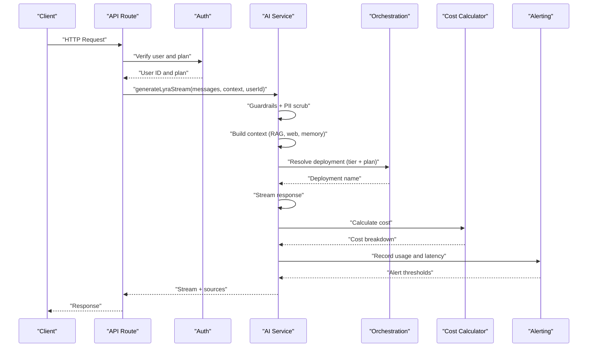
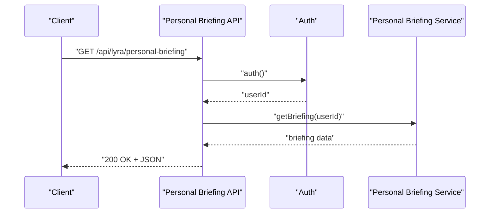
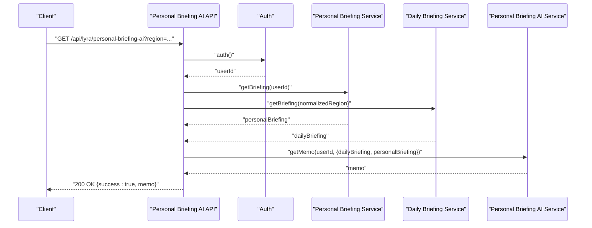
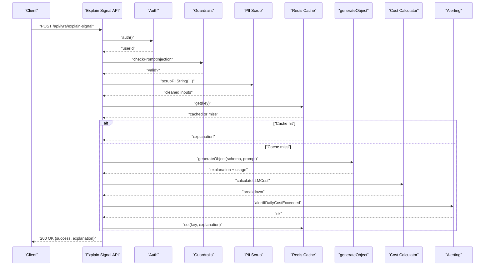
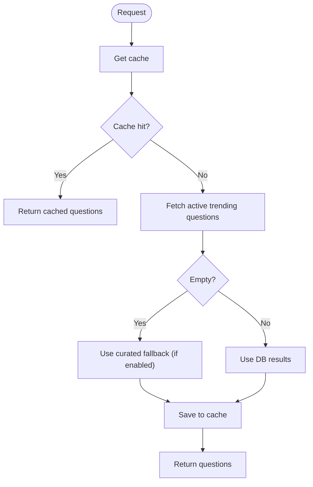
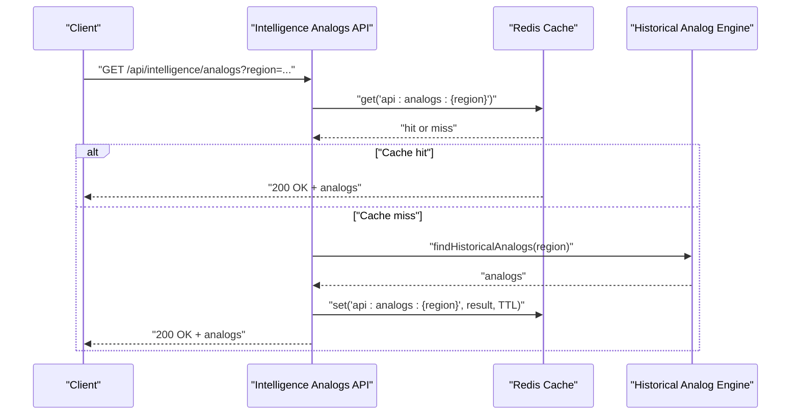
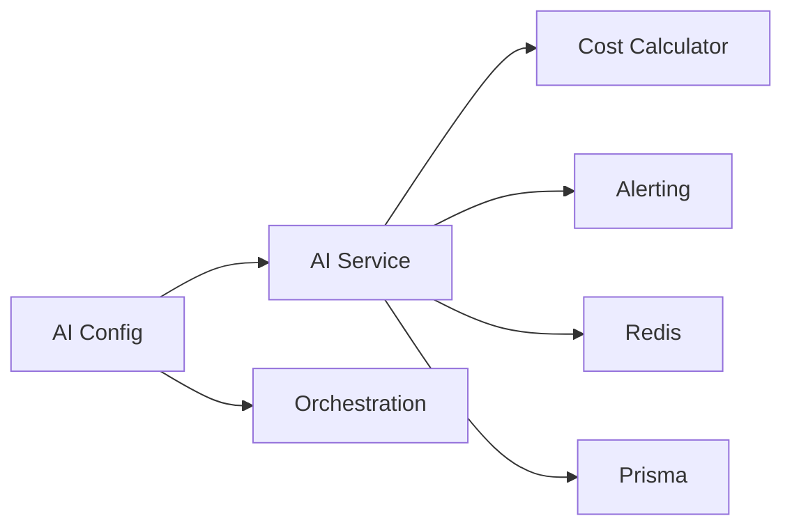

# AI Services API

<cite>
**Referenced Files in This Document**
- [route.ts](file://src/app/api/lyra/personal-briefing/route.ts)
- [route.ts](file://src/app/api/lyra/personal-briefing-ai/route.ts)
- [personal-briefing-ai.service.ts](file://src/lib/services/personal-briefing-ai.service.ts)
- [route.ts](file://src/app/api/lyra/explain-signal/route.ts)
- [route.ts](file://src/app/api/lyra/trending/route.ts)
- [route.ts](file://src/app/api/discovery/feed/route.ts)
- [route.ts](file://src/app/api/intelligence/feed/route.ts)
- [route.ts](file://src/app/api/intelligence/analogs/route.ts)
- [historical-analog.ts](file://src/lib/engines/historical-analog.ts)
- [route.ts](file://src/app/api/intelligence/calendars/route.ts)
- [config.ts](file://src/lib/ai/config.ts)
- [service.ts](file://src/lib/ai/service.ts)
- [cost-calculator.ts](file://src/lib/ai/cost-calculator.ts)
- [orchestration.ts](file://src/lib/ai/orchestration.ts)
- [alerting.ts](file://src/lib/ai/alerting.ts)
- [audit-prompt-pipeline.ts](file://scripts/audit-prompt-pipeline.ts)
- [admin.service.ts](file://src/lib/services/admin.service.ts)
</cite>

## Table of Contents
1. [Introduction](#introduction)
2. [Project Structure](#project-structure)
3. [Core Components](#core-components)
4. [Architecture Overview](#architecture-overview)
5. [Detailed Component Analysis](#detailed-component-analysis)
6. [Dependency Analysis](#dependency-analysis)
7. [Performance Considerations](#performance-considerations)
8. [Troubleshooting Guide](#troubleshooting-guide)
9. [Conclusion](#conclusion)
10. [Appendices](#appendices)

## Introduction
This document provides comprehensive API documentation for AI-powered services, focusing on personal briefing generation, signal explanation, trend analysis, discovery feed, intelligence calendar, analog detection, and market intelligence endpoints. It details request parameters for AI prompts, response formats, cost estimation, usage tracking, AI service configuration, fallback mechanisms, and performance optimization. Examples demonstrate AI-assisted market analysis, discovery queries, and personalized intelligence feeds.

## Project Structure
The AI services are implemented as Next.js API routes backed by AI orchestration libraries and services:
- API routes define endpoints and handle authentication, rate limiting, and caching.
- AI orchestration manages plan-based routing, context building, RAG, web search, and cost tracking.
- Services encapsulate domain logic for personal briefings, signals, discovery, intelligence feeds, and analogs.
- Monitoring and alerting track cost, latency, fallback rates, and operational health.

```mermaid
graph TB
subgraph "API Routes"
PB["Personal Briefing<br/>GET /api/lyra/personal-briefing"]
PBAI["Personal Briefing AI<br/>GET /api/lyra/personal-briefing-ai"]
EXPLAIN["Explain Signal<br/>POST /api/lyra/explain-signal"]
TREND["Trending Questions<br/>GET /api/lyra/trending"]
DISCOVERY["Discovery Feed<br/>GET /api/discovery/feed"]
INTEL_FEED["Intelligence Feed<br/>GET /api/intelligence/feed"]
ANALOGS["Historical Analogs<br/>GET /api/intelligence/analogs"]
CALENDAR["Intelligence Calendar<br/>GET /api/intelligence/calendars"]
end
subgraph "AI Orchestration"
CFG["AI Config<br/>Tier routing, deployments"]
SVC["AI Service<br/>Context, RAG, web search, credits"]
COST["Cost Calculator<br/>Token pricing, voice costs"]
ORCH["Orchestration<br/>Deployment selection"]
ALERT["Alerting & Monitoring<br/>Daily cost, fallback, latency"]
end
subgraph "Services"
PBS["Personal Briefing Service"]
PBS_AI["Personal Briefing AI Service"]
TQS["Trending Question Service"]
DFS["Discovery Feed Service"]
IFS["Intelligence Feed Service"]
HAS["Historical Analog Service"]
end
PB --> PBS
PBAI --> PBAI
EXPLAIN --> SVC
TREND --> TQS
DISCOVERY --> DFS
INTEL_FEED --> IFS
ANALOGS --> HAS
PBAI --> SVC
SVC --> CFG
SVC --> COST
SVC --> ORCH
SVC --> ALERT
```

**Diagram sources**
- [route.ts:1-33](file://src/app/api/lyra/personal-briefing/route.ts#L1-L33)
- [route.ts:1-45](file://src/app/api/lyra/personal-briefing-ai/route.ts#L1-L45)
- [route.ts:1-167](file://src/app/api/lyra/explain-signal/route.ts#L1-L167)
- [route.ts:1-88](file://src/app/api/lyra/trending/route.ts#L1-L88)
- [route.ts:1-63](file://src/app/api/discovery/feed/route.ts#L1-L63)
- [route.ts:1-168](file://src/app/api/intelligence/feed/route.ts#L1-L168)
- [route.ts:1-42](file://src/app/api/intelligence/analogs/route.ts#L1-L42)
- [route.ts:1-67](file://src/app/api/intelligence/calendars/route.ts#L1-L67)
- [config.ts:124-389](file://src/lib/ai/config.ts#L124-L389)
- [service.ts:383-800](file://src/lib/ai/service.ts#L383-L800)
- [cost-calculator.ts:293-313](file://src/lib/ai/cost-calculator.ts#L293-L313)
- [orchestration.ts:1-8](file://src/lib/ai/orchestration.ts#L1-L8)
- [alerting.ts:92-122](file://src/lib/ai/alerting.ts#L92-L122)

**Section sources**
- [route.ts:1-33](file://src/app/api/lyra/personal-briefing/route.ts#L1-L33)
- [route.ts:1-45](file://src/app/api/lyra/personal-briefing-ai/route.ts#L1-L45)
- [route.ts:1-167](file://src/app/api/lyra/explain-signal/route.ts#L1-L167)
- [route.ts:1-88](file://src/app/api/lyra/trending/route.ts#L1-L88)
- [route.ts:1-63](file://src/app/api/discovery/feed/route.ts#L1-L63)
- [route.ts:1-168](file://src/app/api/intelligence/feed/route.ts#L1-L168)
- [route.ts:1-42](file://src/app/api/intelligence/analogs/route.ts#L1-L42)
- [route.ts:1-67](file://src/app/api/intelligence/calendars/route.ts#L1-L67)
- [config.ts:124-389](file://src/lib/ai/config.ts#L124-L389)
- [service.ts:383-800](file://src/lib/ai/service.ts#L383-L800)
- [cost-calculator.ts:293-313](file://src/lib/ai/cost-calculator.ts#L293-L313)
- [orchestration.ts:1-8](file://src/lib/ai/orchestration.ts#L1-L8)
- [alerting.ts:92-122](file://src/lib/ai/alerting.ts#L92-L122)

## Core Components
- AI Configuration and Routing
  - Plan-based tier configuration controls max tokens, reasoning effort, RAG/web search, cross-sector, and latency budgets.
  - GPT-5.4 deployment mapping enables multi-role orchestration across lyra-nano, lyra-mini, lyra-full, and myra.
  - Shared AI SDK client pools connections for efficiency.

- AI Service Pipeline
  - Input guardrails and PII scrubbing precede context building.
  - Parallel retrieval includes RAG, web search, asset enrichment, and memory/context augmentation.
  - Streaming response with cost tracking, daily token caps, and credit consumption.
  - Early model cache and educational cache reduce latency and cost.

- Cost Estimation and Tracking
  - Token-based pricing for GPT-5.4 families with cached input discounts.
  - Voice session cost calculator for real-time channels.
  - Daily cost accumulation and alert thresholds for proactive monitoring.

- Fallback Mechanisms and Mitigation
  - Fallback to nano deployments when primary model degrades.
  - Automatic mitigation flag switches to backup model when fallback rate exceeds threshold.
  - Curated fallbacks for trending questions and analogs.

**Section sources**
- [config.ts:124-389](file://src/lib/ai/config.ts#L124-L389)
- [service.ts:383-800](file://src/lib/ai/service.ts#L383-L800)
- [cost-calculator.ts:293-313](file://src/lib/ai/cost-calculator.ts#L293-L313)
- [alerting.ts:213-294](file://src/lib/ai/alerting.ts#L213-L294)

## Architecture Overview
The AI services follow a layered architecture:
- Presentation Layer: API routes validate inputs, enforce auth and rate limits, and delegate to services.
- Domain Services: Personal briefing, discovery, intelligence feed, and analogs encapsulate business logic.
- AI Orchestration: Centralized configuration, deployment selection, context building, and cost tracking.
- Infrastructure: Redis caches, rate limiting, and admin-configurable caps.

**Diagram sources**
- [service.ts:383-800](file://src/lib/ai/service.ts#L383-L800)
- [orchestration.ts:1-8](file://src/lib/ai/orchestration.ts#L1-L8)
- [cost-calculator.ts:293-313](file://src/lib/ai/cost-calculator.ts#L293-L313)
- [alerting.ts:92-122](file://src/lib/ai/alerting.ts#L92-L122)

## Detailed Component Analysis

### Personal Briefing Generation
- Endpoint: GET /api/lyra/personal-briefing
- Authentication: Requires user session; returns unauthorized if missing.
- Authorization: Accessible to ELITE and ENTERPRISE plans.
- Behavior: Retrieves personal briefing content for the authenticated user.
- Caching: Private cache-control header to prevent intermediate caching.

**Diagram sources**
- [route.ts:1-33](file://src/app/api/lyra/personal-briefing/route.ts#L1-L33)

**Section sources**
- [route.ts:1-33](file://src/app/api/lyra/personal-briefing/route.ts#L1-L33)

### Personal Briefing AI Memo
- Endpoint: GET /api/lyra/personal-briefing-ai
- Parameters:
  - region: Query parameter; defaults to "US", normalized to "IN" or "US".
- Authentication and Authorization: Same as personal briefing.
- Behavior:
  - Fetches both personal and daily briefings.
  - Generates a tailored memo combining personal and macro context.
  - Returns success flag and memo object with headline, summary, focus, nextAction, bullets.
- Caching: Service-level memo cache TTL applied.

**Diagram sources**
- [route.ts:1-45](file://src/app/api/lyra/personal-briefing-ai/route.ts#L1-L45)
- [personal-briefing-ai.service.ts:1-26](file://src/lib/services/personal-briefing-ai.service.ts#L1-L26)

**Section sources**
- [route.ts:1-45](file://src/app/api/lyra/personal-briefing-ai/route.ts#L1-L45)
- [personal-briefing-ai.service.ts:1-26](file://src/lib/services/personal-briefing-ai.service.ts#L1-L26)

### Signal Explanation
- Endpoint: POST /api/lyra/explain-signal
- Request Schema:
  - title: String (1–200 chars)
  - score: Number (0–100)
  - definition: String (1–1000 chars)
  - drivers: Array of strings (≤10, each ≤200 chars)
  - context: String (≤2000 chars)
  - limitations: String (≤1000 chars)
- Behavior:
  - Validates payload and scans for prompt injection.
  - Scrubs PII from user inputs.
  - Returns cached explanation if available.
  - Generates explanation using lyra-nano deployment with JSON schema validation.
  - Records cost and latency metrics; supports fallback with curated response on failure.
- Response: success flag and explanation object with summary, whatItMeans, whatToWatch, nextAction.

**Diagram sources**
- [route.ts:1-167](file://src/app/api/lyra/explain-signal/route.ts#L1-L167)
- [cost-calculator.ts:293-313](file://src/lib/ai/cost-calculator.ts#L293-L313)
- [alerting.ts:92-122](file://src/lib/ai/alerting.ts#L92-L122)

**Section sources**
- [route.ts:1-167](file://src/app/api/lyra/explain-signal/route.ts#L1-L167)
- [cost-calculator.ts:293-313](file://src/lib/ai/cost-calculator.ts#L293-L313)
- [alerting.ts:92-122](file://src/lib/ai/alerting.ts#L92-L122)

### Trend Analysis
- Endpoint: GET /api/lyra/trending
- Behavior:
  - Returns up to 6 active trending questions ordered by display order.
  - Supports curated fallback when DB is empty or disabled via feature flag.
  - Caching with configurable TTL depending on fallback mode.
- Response: success flag and questions array.

**Diagram sources**
- [route.ts:1-88](file://src/app/api/lyra/trending/route.ts#L1-L88)

**Section sources**
- [route.ts:1-88](file://src/app/api/lyra/trending/route.ts#L1-L88)

### Discovery Feed
- Endpoint: GET /api/discovery/feed
- Query Parameters:
  - type: Filter by type
  - region: Market region
  - limit: Number of items
  - offset: Pagination offset
- Behavior:
  - Parses and validates parameters.
  - Enforces rate limits for market data.
  - Fetches discovery feed data with plan-aware access.
  - Returns private no-store cache header to prevent unintended caching.

**Section sources**
- [route.ts:1-63](file://src/app/api/discovery/feed/route.ts#L1-L63)

### Intelligence Feed
- Endpoint: GET /api/intelligence/feed
- Query Parameters:
  - limit: Number of events
  - type: Comma-separated event types
  - severity: Severity level
  - region: Asset region
  - assetType: Asset type filter
- Behavior:
  - Applies rate limits and optional test bypass.
  - Builds filters for event types and severity.
  - Queries institutional events with asset region handling (crypto assets show globally).
  - Returns events and available asset types with caching.

**Section sources**
- [route.ts:1-168](file://src/app/api/intelligence/feed/route.ts#L1-L168)

### Historical Analogs
- Endpoint: GET /api/intelligence/analogs
- Query Parameter:
  - region: Market region (defaults to "US")
- Behavior:
  - Returns cached analogs for the region with long TTL.
  - Computes market fingerprint, embeddings, and similarity search.
  - Stores results in cache with TTL.

**Diagram sources**
- [route.ts:1-42](file://src/app/api/intelligence/analogs/route.ts#L1-L42)
- [historical-analog.ts:145-173](file://src/lib/engines/historical-analog.ts#L145-L173)

**Section sources**
- [route.ts:1-42](file://src/app/api/intelligence/analogs/route.ts#L1-L42)
- [historical-analog.ts:145-173](file://src/lib/engines/historical-analog.ts#L145-L173)

### Intelligence Calendar
- Endpoint: GET /api/intelligence/calendars
- Query Parameter:
  - type: One of "economic", "ipo", "market_news"
- Behavior:
  - Returns calendar data from Redis cache keyed by type.
  - Unauthorized for anonymous users.

**Section sources**
- [route.ts:1-67](file://src/app/api/intelligence/calendars/route.ts#L1-L67)

## Dependency Analysis
- AI Configuration
  - Tiered routing depends on plan and query complexity.
  - Deployment mapping supports role-based routing with graceful fallback.
- AI Service
  - Integrates guardrails, PII scrubbing, RAG, web search, memory, and cost tracking.
  - Atomic daily token counters and Redis-backed caps.
- Cost and Monitoring
  - Pricing by model family; daily cost accumulation and alert thresholds.
  - Fallback mitigation toggled by Redis flag.

**Diagram sources**
- [config.ts:124-389](file://src/lib/ai/config.ts#L124-L389)
- [service.ts:383-800](file://src/lib/ai/service.ts#L383-L800)
- [cost-calculator.ts:293-313](file://src/lib/ai/cost-calculator.ts#L293-L313)
- [alerting.ts:92-122](file://src/lib/ai/alerting.ts#L92-L122)

**Section sources**
- [config.ts:124-389](file://src/lib/ai/config.ts#L124-L389)
- [service.ts:383-800](file://src/lib/ai/service.ts#L383-L800)
- [cost-calculator.ts:293-313](file://src/lib/ai/cost-calculator.ts#L293-L313)
- [alerting.ts:92-122](file://src/lib/ai/alerting.ts#L92-L122)

## Performance Considerations
- Caching Strategies
  - Early model cache and educational cache reduce latency and cost for repeated queries.
  - Long TTL for analogs and trending questions; shorter TTL for dynamic content.
- Parallel Retrieval
  - RAG, web search, asset enrichment, and memory retrieval executed concurrently to minimize latency.
- Deployment Selection
  - Role-based deployment mapping enables optimal model choice per tier and plan.
- Rate Limiting and Daily Caps
  - Rate limits protect against abuse; daily token caps act as a secondary backstop.
- Cost Estimation
  - Token-based pricing with cached input discounts; fallback cost estimator for audits.

[No sources needed since this section provides general guidance]

## Troubleshooting Guide
- Unauthorized Access
  - Ensure authentication is successful and user has required plan (ELITE/ENTERPRISE for personal briefing endpoints).
- Rate Limits Exceeded
  - Verify rate limit enforcement and consider bypass only in controlled test environments.
- Daily Token Cap Reached
  - Monitor daily token counters and adjust caps via admin APIs if necessary.
- Fallback Mitigation
  - When fallback rate exceeds mitigation threshold, the system automatically switches to backup model; monitor alerts and deployment-specific fallback counters.
- Cost Alerts
  - Review daily cost accumulation and webhook alerts for anomalies.

**Section sources**
- [route.ts:1-33](file://src/app/api/lyra/personal-briefing/route.ts#L1-L33)
- [route.ts:1-45](file://src/app/api/lyra/personal-briefing-ai/route.ts#L1-L45)
- [service.ts:656-676](file://src/lib/ai/service.ts#L656-L676)
- [alerting.ts:213-294](file://src/lib/ai/alerting.ts#L213-L294)

## Conclusion
The AI Services API provides robust, plan-aware, and cost-controlled AI capabilities across personal briefings, signal explanations, trends, discovery feeds, intelligence feeds, analogs, and calendars. Through tiered routing, caching, parallel retrieval, and comprehensive monitoring, the system balances performance, reliability, and cost-efficiency while offering fallback mechanisms and administrative controls.

[No sources needed since this section summarizes without analyzing specific files]

## Appendices

### Request Parameters and Response Formats

- Personal Briefing AI
  - Parameters: region (optional)
  - Response: success flag and memo object with headline, summary, focus, nextAction, bullets.

- Explain Signal
  - Request: title, score, definition, drivers[], context, limitations
  - Response: success flag and explanation object with summary, whatItMeans, whatToWatch, nextAction.

- Trending Questions
  - Response: success flag and questions array.

- Discovery Feed
  - Parameters: type, region, limit, offset
  - Response: feed items with plan-aware access.

- Intelligence Feed
  - Parameters: limit, type, severity, region, assetType
  - Response: events and available asset types.

- Historical Analogs
  - Parameters: region
  - Response: analogs with forward returns and similarity metrics.

- Intelligence Calendar
  - Parameters: type
  - Response: calendar events by type.

**Section sources**
- [route.ts:1-45](file://src/app/api/lyra/personal-briefing-ai/route.ts#L1-L45)
- [route.ts:24-42](file://src/app/api/lyra/explain-signal/route.ts#L24-L42)
- [route.ts:26-69](file://src/app/api/lyra/trending/route.ts#L26-L69)
- [route.ts:19-54](file://src/app/api/discovery/feed/route.ts#L19-L54)
- [route.ts:56-151](file://src/app/api/intelligence/feed/route.ts#L56-L151)
- [route.ts:14-37](file://src/app/api/intelligence/analogs/route.ts#L14-L37)
- [route.ts:18-58](file://src/app/api/intelligence/calendars/route.ts#L18-L58)

### Cost Estimation and Usage Tracking
- Token Pricing
  - Pricing per model family (nano, mini, full) with cached input discounts.
- Voice Session Costs
  - Audio input/output and text input/output token rates for real-time sessions.
- Daily Cost Tracking
  - Accumulation per day with alert thresholds and webhook delivery.
- Admin Cost Stats
  - Aggregated stats including token usage, cost breakdowns, fallback rates, and model distribution.

**Section sources**
- [cost-calculator.ts:106-122](file://src/lib/ai/cost-calculator.ts#L106-L122)
- [cost-calculator.ts:192-248](file://src/lib/ai/cost-calculator.ts#L192-L248)
- [cost-calculator.ts:293-313](file://src/lib/ai/cost-calculator.ts#L293-L313)
- [audit-prompt-pipeline.ts:548-559](file://scripts/audit-prompt-pipeline.ts#L548-L559)
- [admin.service.ts:94-122](file://src/lib/services/admin.service.ts#L94-L122)

### AI Service Configuration and Fallback Mechanisms
- Tiered Routing
  - Plan and complexity determine max tokens, reasoning effort, RAG/web search, cross-sector, and latency budgets.
- Deployment Mapping
  - Role-based deployment selection with graceful fallback to primary deployment.
- Fallback Mitigation
  - Automatic mitigation flag activates when fallback rate exceeds threshold; monitored via Redis windows and alerts.

**Section sources**
- [config.ts:130-389](file://src/lib/ai/config.ts#L130-L389)
- [orchestration.ts:1-8](file://src/lib/ai/orchestration.ts#L1-L8)
- [alerting.ts:213-294](file://src/lib/ai/alerting.ts#L213-L294)