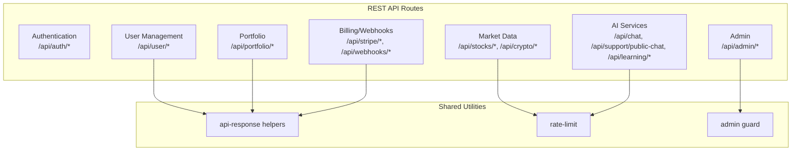
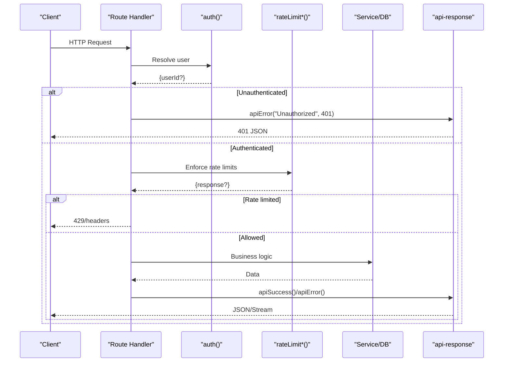
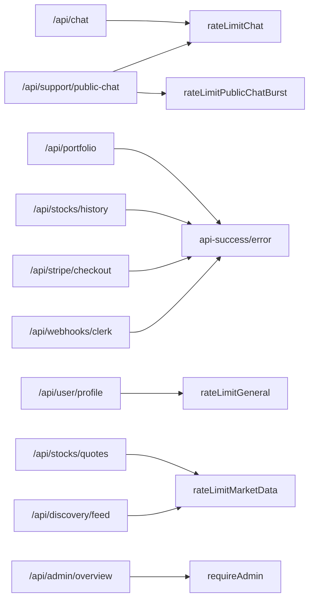

# API Reference

<cite>
**Referenced Files in This Document**
- [src/app/api/chat/route.ts](file://src/app/api/chat/route.ts)
- [src/app/api/support/public-chat/route.ts](file://src/app/api/support/public-chat/route.ts)
- [src/app/api/portfolio/route.ts](file://src/app/api/portfolio/route.ts)
- [src/app/api/user/profile/route.ts](file://src/app/api/user/profile/route.ts)
- [src/app/api/stocks/quotes/route.ts](file://src/app/api/stocks/quotes/route.ts)
- [src/app/api/stocks/history/route.ts](file://src/app/api/stocks/history/route.ts)
- [src/app/api/discovery/feed/route.ts](file://src/app/api/discovery/feed/route.ts)
- [src/app/api/learning/xp/route.ts](file://src/app/api/learning/xp/route.ts)
- [src/app/api/stripe/checkout/route.ts](file://src/app/api/stripe/checkout/route.ts)
- [src/app/api/webhooks/clerk/route.ts](file://src/app/api/webhooks/clerk/route.ts)
- [src/lib/api-response.ts](file://src/lib/api-response.ts)
- [src/lib/rate-limit/index.ts](file://src/lib/rate-limit/index.ts)
- [src/lib/middleware/admin-guard.ts](file://src/lib/middleware/admin-guard.ts)
- [src/app/api/admin/overview/route.ts](file://src/app/api/admin/overview/route.ts)
</cite>

## Table of Contents
1. [Introduction](#introduction)
2. [Project Structure](#project-structure)
3. [Core Components](#core-components)
4. [Architecture Overview](#architecture-overview)
5. [Detailed Component Analysis](#detailed-component-analysis)
6. [Dependency Analysis](#dependency-analysis)
7. [Performance Considerations](#performance-considerations)
8. [Troubleshooting Guide](#troubleshooting-guide)
9. [Conclusion](#conclusion)
10. [Appendices](#appendices)

## Introduction
This document provides a comprehensive API reference for LyraAlpha’s RESTful endpoints and real-time features. It covers authentication, user management, market data, portfolio operations, AI services, and administrative functions. For each endpoint, you will find HTTP methods, URL patterns, request/response schemas, authentication requirements, error handling, rate limiting, pagination/filtering/search capabilities, and practical examples. Real-time features are documented with streaming semantics and headers.

## Project Structure
LyraAlpha exposes APIs under the Next.js App Router at src/app/api. Endpoints are grouped by domain (e.g., user, portfolio, market, learning, support, admin). Shared utilities include standardized response helpers, rate limiting, and admin guards.

**Section sources**
- [src/app/api/chat/route.ts:1-207](file://src/app/api/chat/route.ts#L1-L207)
- [src/app/api/support/public-chat/route.ts:1-150](file://src/app/api/support/public-chat/route.ts#L1-L150)
- [src/app/api/portfolio/route.ts:1-102](file://src/app/api/portfolio/route.ts#L1-L102)
- [src/app/api/user/profile/route.ts:1-128](file://src/app/api/user/profile/route.ts#L1-L128)
- [src/app/api/stocks/quotes/route.ts:1-51](file://src/app/api/stocks/quotes/route.ts#L1-L51)
- [src/app/api/stocks/history/route.ts:1-74](file://src/app/api/stocks/history/route.ts#L1-L74)
- [src/app/api/discovery/feed/route.ts:1-63](file://src/app/api/discovery/feed/route.ts#L1-L63)
- [src/app/api/learning/xp/route.ts:1-67](file://src/app/api/learning/xp/route.ts#L1-L67)
- [src/app/api/stripe/checkout/route.ts:1-108](file://src/app/api/stripe/checkout/route.ts#L1-L108)
- [src/app/api/webhooks/clerk/route.ts:1-379](file://src/app/api/webhooks/clerk/route.ts#L1-L379)
- [src/lib/api-response.ts:1-28](file://src/lib/api-response.ts#L1-L28)
- [src/lib/rate-limit/index.ts:1-372](file://src/lib/rate-limit/index.ts#L1-L372)
- [src/lib/middleware/admin-guard.ts:1-56](file://src/lib/middleware/admin-guard.ts#L1-L56)
- [src/app/api/admin/overview/route.ts:1-24](file://src/app/api/admin/overview/route.ts#L1-L24)

## Core Components
- Standardized API responses: apiSuccess and apiError wrap responses consistently and sanitize errors in production.
- Rate limiting: Centralized rate-limit functions enforce burst and capacity limits across chat, discovery, market data, general, and public chat bursts.
- Admin guard: requireAdmin enforces admin-only access using Clerk public metadata.
- Authentication: auth resolves the current user; many endpoints require a valid session.

**Section sources**
- [src/lib/api-response.ts:1-28](file://src/lib/api-response.ts#L1-L28)
- [src/lib/rate-limit/index.ts:1-372](file://src/lib/rate-limit/index.ts#L1-L372)
- [src/lib/middleware/admin-guard.ts:1-56](file://src/lib/middleware/admin-guard.ts#L1-L56)

## Architecture Overview
The API follows a layered design:
- Route handlers implement HTTP verbs and parameter parsing.
- Middleware enforces auth and admin checks.
- Services encapsulate business logic (e.g., discovery feed, portfolio queries).
- Utilities provide standardized responses, rate limiting, and logging.

**Diagram sources**
- [src/app/api/chat/route.ts:21-206](file://src/app/api/chat/route.ts#L21-L206)
- [src/app/api/support/public-chat/route.ts:24-149](file://src/app/api/support/public-chat/route.ts#L24-L149)
- [src/app/api/portfolio/route.ts:17-101](file://src/app/api/portfolio/route.ts#L17-L101)
- [src/lib/api-response.ts:10-27](file://src/lib/api-response.ts#L10-L27)
- [src/lib/rate-limit/index.ts:94-190](file://src/lib/rate-limit/index.ts#L94-L190)

## Detailed Component Analysis

### Authentication and Admin Access
- Admin guard: requireAdmin verifies Clerk public metadata role equals "admin". Returns 401/403/500 as appropriate.
- Standardized responses: apiError sanitizes internal errors in production and logs originals for debugging.

**Section sources**
- [src/lib/middleware/admin-guard.ts:17-55](file://src/lib/middleware/admin-guard.ts#L17-L55)
- [src/lib/api-response.ts:14-27](file://src/lib/api-response.ts#L14-L27)

### User Management
- GET /api/user/profile
  - Purpose: Retrieve profile, plan, and active subscription.
  - Auth: Required.
  - Rate limit: General rate limiter keyed per user.
  - Response: JSON with profile, plan, and optional subscription.
  - Errors: 401, 500.
- PUT /api/user/profile
  - Purpose: Update first/last name via Clerk.
  - Auth: Required.
  - Rate limit: General rate limiter keyed per user.
  - Response: JSON with updated profile.
  - Errors: 400 (invalid body), 401, 500.

**Section sources**
- [src/app/api/user/profile/route.ts:16-89](file://src/app/api/user/profile/route.ts#L16-L89)
- [src/app/api/user/profile/route.ts:91-127](file://src/app/api/user/profile/route.ts#L91-L127)
- [src/lib/rate-limit/index.ts:255-281](file://src/lib/rate-limit/index.ts#L255-L281)

### Market Data
- GET /api/stocks/quotes
  - Purpose: Fetch latest quotes for a list of symbols.
  - Auth: Optional (uses userId if present, otherwise client IP).
  - Rate limit: Market data limiter per user/IP.
  - Query params: symbols (comma-separated list).
  - Response: JSON mapping symbol to {symbol, price, changePercent, name, type}.
  - Errors: 400 (invalid symbols), 500.
  - Notes: Cache-Control: private, no-store.
- GET /api/stocks/history
  - Purpose: Fetch OHLCV history for a symbol and range.
  - Auth: Optional.
  - Rate limit: Optional (not enforced in handler).
  - Query params: symbol, range (1d, 5d, 1mo, 3mo, 6mo, 1y, 5y).
  - Response: JSON with historical data; 404 if asset not found.
  - Errors: 400 (invalid params), 500.
  - Notes: Cache-Control: private, no-store; TTL per range.

**Section sources**
- [src/app/api/stocks/quotes/route.ts:14-50](file://src/app/api/stocks/quotes/route.ts#L14-L50)
- [src/app/api/stocks/history/route.ts:22-73](file://src/app/api/stocks/history/route.ts#L22-L73)
- [src/lib/rate-limit/index.ts:224-250](file://src/lib/rate-limit/index.ts#L224-L250)

### Portfolio Operations
- GET /api/portfolio
  - Purpose: List user portfolios with counts and latest health snapshot.
  - Auth: Required.
  - Query params: region (optional).
  - Response: JSON with array of portfolios.
  - Errors: 401, 500.
- POST /api/portfolio
  - Purpose: Create a new portfolio.
  - Auth: Required.
  - Body: {name, description, currency, region}.
  - Limits: Enforced by plan tier (plan gate).
  - Response: JSON with created portfolio; 201 on success.
  - Errors: 400 (invalid body), 401, 403 (limit reached), 409 (duplicate name), 500.

**Section sources**
- [src/app/api/portfolio/route.ts:17-52](file://src/app/api/portfolio/route.ts#L17-L52)
- [src/app/api/portfolio/route.ts:54-101](file://src/app/api/portfolio/route.ts#L54-L101)

### AI Services
- POST /api/chat
  - Purpose: Stream AI-assisted chat with Lyra.
  - Auth: Required.
  - Rate limit: Chat limiter (daily burst + monthly cap) per plan tier.
  - Body: {messages, symbol?, contextData?, sourcesLimit?, skipAssetLinks?, cacheScope?}.
  - Response: Text stream with headers:
    - X-Lyra-Sources (JSON-encoded, truncated)
    - X-Credits-Remaining
    - X-Context-Truncated
    - X-RateLimit-* headers
  - Errors: 400 (validation), 401 (unauthorized), 429 (usage limit), 500.
  - Notes: Max duration 120s; dynamic disabled; preferred region bom1.
- POST /api/support/public-chat
  - Purpose: Public FAQ chat powered by Myra.
  - Auth: Not required (IP-based).
  - Rate limit: Burst limiter (short window) plus chat limiter at STARTER tier.
  - Body: {message, history? (limited to last 8)}.
  - Response: Text stream; may serve static replies or cached responses.
  - Errors: 400 (missing/long/invalid input), 429, 500.
  - Notes: Max duration 30s; preferred region bom1.

**Section sources**
- [src/app/api/chat/route.ts:21-206](file://src/app/api/chat/route.ts#L21-L206)
- [src/app/api/support/public-chat/route.ts:24-149](file://src/app/api/support/public-chat/route.ts#L24-L149)
- [src/lib/rate-limit/index.ts:94-190](file://src/lib/rate-limit/index.ts#L94-L190)

### Discovery and Search
- GET /api/discovery/feed
  - Purpose: Paginated discovery feed items filtered by type and region.
  - Auth: Required.
  - Query params: type, region, limit, offset.
  - Rate limit: Market data limiter per user/IP.
  - Response: JSON feed data.
  - Errors: 400 (invalid params), 429, 500.
  - Notes: Cache-Control: private, no-store.

**Section sources**
- [src/app/api/discovery/feed/route.ts:19-62](file://src/app/api/discovery/feed/route.ts#L19-L62)
- [src/lib/rate-limit/index.ts:224-250](file://src/lib/rate-limit/index.ts#L224-L250)

### Learning and Gamification
- POST /api/learning/xp
  - Purpose: Award XP for a learning action; optionally trigger streak and badge evaluation.
  - Auth: Required.
  - Body: {action, context?}.
  - Response: JSON with {success, xp, streakBonus, badges.newlyAwarded}.
  - Errors: 400 (invalid body), 401, 500.

**Section sources**
- [src/app/api/learning/xp/route.ts:17-66](file://src/app/api/learning/xp/route.ts#L17-L66)

### Billing and Payments
- GET /api/stripe/checkout
  - Purpose: Create Stripe Checkout session for plan upgrade (pro/elite) with region selection.
  - Auth: Required.
  - Query params: plan (pro|elite), region (IN|US).
  - Response: Redirect to Stripe-hosted checkout URL.
  - Errors: 401 (not signed in), 500 (configuration or redirect failure).

**Section sources**
- [src/app/api/stripe/checkout/route.ts:19-107](file://src/app/api/stripe/checkout/route.ts#L19-L107)

### Webhooks
- POST /api/webhooks/clerk
  - Purpose: Handle Clerk user lifecycle events (created/updated/deleted) and side effects (credits, emails, preferences).
  - Auth: Not required; verified via Svix signature.
  - Body: Clerk event payload (validated).
  - Response: JSON {success: true}; duplicate events are idempotent.
  - Errors: 400 (missing/invalid headers/signature), 500 (misconfigured or handler failure).
  - Notes: Idempotency via Redis lock; GDPR-compliant deletion of user data.

**Section sources**
- [src/app/api/webhooks/clerk/route.ts:50-378](file://src/app/api/webhooks/clerk/route.ts#L50-L378)

### Administrative Functions
- GET /api/admin/overview
  - Purpose: Admin dashboard overview statistics.
  - Auth: Admin-only (requireAdmin).
  - Response: Stats object; Cache-Control: private, max-age=30.
  - Errors: 401/403/500.

**Section sources**
- [src/app/api/admin/overview/route.ts:10-23](file://src/app/api/admin/overview/route.ts#L10-L23)
- [src/lib/middleware/admin-guard.ts:17-55](file://src/lib/middleware/admin-guard.ts#L17-L55)

## Dependency Analysis

**Diagram sources**
- [src/app/api/chat/route.ts:37-41](file://src/app/api/chat/route.ts#L37-L41)
- [src/app/api/support/public-chat/route.ts:33-40](file://src/app/api/support/public-chat/route.ts#L33-L40)
- [src/app/api/portfolio/route.ts:4-11](file://src/app/api/portfolio/route.ts#L4-L11)
- [src/app/api/user/profile/route.ts:22-23](file://src/app/api/user/profile/route.ts#L22-L23)
- [src/app/api/stocks/quotes/route.ts:29-30](file://src/app/api/stocks/quotes/route.ts#L29-L30)
- [src/app/api/discovery/feed/route.ts:35-40](file://src/app/api/discovery/feed/route.ts#L35-L40)
- [src/app/api/stripe/checkout/route.ts:21-24](file://src/app/api/stripe/checkout/route.ts#L21-L24)
- [src/app/api/webhooks/clerk/route.ts:51-56](file://src/app/api/webhooks/clerk/route.ts#L51-L56)
- [src/app/api/admin/overview/route.ts:11-12](file://src/app/api/admin/overview/route.ts#L11-L12)
- [src/lib/rate-limit/index.ts:94-190](file://src/lib/rate-limit/index.ts#L94-L190)

**Section sources**
- [src/lib/rate-limit/index.ts:94-190](file://src/lib/rate-limit/index.ts#L94-L190)
- [src/lib/api-response.ts:10-27](file://src/lib/api-response.ts#L10-L27)
- [src/lib/middleware/admin-guard.ts:17-55](file://src/lib/middleware/admin-guard.ts#L17-L55)

## Performance Considerations
- Streaming responses: Chat endpoints return text streams with streaming headers to minimize latency and backpressure.
- Rate limiting: Parallel Redis checks for chat daily/monthly caps; timeouts fail open for UX but return 503 on timeout to prevent overload.
- Caching: Discovery feed and asset history use cache keys with TTLs; quotes disable store caching to reflect real-time prices.
- Regional preference: Handlers set preferredRegion to optimize cold-start and routing.

[No sources needed since this section provides general guidance]

## Troubleshooting Guide
- Unauthorized requests: Many endpoints return 401 when auth fails. Ensure Authorization headers or session cookies are included.
- Rate limit exceeded: Expect 429 with rate limit headers (X-RateLimit-Limit, X-RateLimit-Remaining, X-RateLimit-Reset). For public chat, a separate burst limiter may trigger first.
- Internal errors: Production responses sanitize error messages; check logs for original error details.
- Webhook delivery: Verify Svix headers and signature secret; duplicates are handled idempotently.

**Section sources**
- [src/lib/api-response.ts:14-27](file://src/lib/api-response.ts#L14-L27)
- [src/lib/rate-limit/index.ts:134-151](file://src/lib/rate-limit/index.ts#L134-L151)
- [src/app/api/webhooks/clerk/route.ts:69-84](file://src/app/api/webhooks/clerk/route.ts#L69-L84)

## Conclusion
LyraAlpha’s API provides a cohesive set of REST endpoints and streaming AI features with robust authentication, admin controls, and rate limiting. Responses follow a consistent schema, and real-time endpoints deliver low-latency streams with clear headers for diagnostics. Administrators can monitor and manage system metrics, while clients can integrate market data, portfolio management, gamification, and secure billing flows.

[No sources needed since this section summarizes without analyzing specific files]

## Appendices

### Endpoint Catalog and Examples

- GET /api/user/profile
  - curl: curl -H "Cookie: __session=..." https://yourdomain/api/user/profile
  - Response: { profile, plan, subscription }
  - Errors: 401, 500

- PUT /api/user/profile
  - curl: curl -X PUT -H "Cookie: __session=..." -H "Content-Type: application/json" -d '{"firstName":"John","lastName":"Doe"}' https://yourdomain/api/user/profile
  - Response: { profile }
  - Errors: 400, 401, 500

- GET /api/stocks/quotes?symbols=AAPL,MSFT
  - curl: curl "https://yourdomain/api/stocks/quotes?symbols=AAPL,MSFT"
  - Response: {"AAPL": {...}, "MSFT": {...}}
  - Errors: 400, 500

- GET /api/stocks/history?symbol=AAPL&range=1mo
  - curl: curl "https://yourdomain/api/stocks/history?symbol=AAPL&range=1mo"
  - Response: Historical data JSON
  - Errors: 400, 404, 500

- GET /api/discovery/feed?type=NEWS&region=US&limit=20&offset=0
  - curl: curl "https://yourdomain/api/discovery/feed?type=NEWS&region=US&limit=20&offset=0"
  - Response: Feed items JSON
  - Errors: 400, 429, 500

- POST /api/portfolio
  - curl: curl -X POST -H "Cookie: __session=..." -H "Content-Type: application/json" -d '{"name":"My Portfolio","currency":"USD","region":"US"}' https://yourdomain/api/portfolio
  - Response: { portfolio }
  - Errors: 400, 401, 403, 409, 500

- POST /api/chat
  - curl: curl -N -H "Cookie: __session=..." -H "Content-Type: application/json" --no-buffer -d '{"messages":[{"role":"user","content":"..."}]}' https://yourdomain/api/chat
  - Response: Text stream; headers include X-Lyra-Sources, X-Credits-Remaining, X-Context-Truncated, X-RateLimit-*
  - Errors: 400, 401, 429, 500

- POST /api/support/public-chat
  - curl: curl -N -X POST -H "Content-Type: application/json" --no-buffer -d '{"message":"How do I upgrade?"}' https://yourdomain/api/support/public-chat
  - Response: Text stream; may return cached/static reply
  - Errors: 400, 429, 500

- POST /api/learning/xp
  - curl: curl -X POST -H "Cookie: __session=..." -H "Content-Type: application/json" -d '{"action":"OPEN_MODULE","context":"intro"}' https://yourdomain/api/learning/xp
  - Response: { success, xp, streakBonus, badges }
  - Errors: 400, 401, 500

- GET /api/stripe/checkout?plan=pro&region=US
  - curl: curl -L "https://yourdomain/api/stripe/checkout?plan=pro&region=US"
  - Response: 302 Redirect to Stripe checkout

- POST /api/webhooks/clerk
  - curl: curl -X POST -H "svix-id: ..." -H "svix-timestamp: ..." -H "svix-signature: ..." -d '{...}' https://yourdomain/api/webhooks/clerk
  - Response: { success: true }

- GET /api/admin/overview
  - curl: curl -H "Cookie: __session=..." https://yourdomain/api/admin/overview
  - Response: Stats JSON
  - Errors: 401/403/500

### Rate Limiting, Pagination, Filtering, and Search
- Rate limiting:
  - Chat: Daily burst + monthly cap per plan tier; returns 429 with X-RateLimit-* headers.
  - Discovery/Market Data/General: Fixed window limit per plan tier; returns 429 with headers.
  - Public chat burst: Separate sliding window for abuse prevention.
- Pagination and filtering:
  - Discovery feed supports type, region, limit, offset.
  - Portfolio list supports region filter.
  - Quotes accepts a comma-separated symbols list.
- Search:
  - Discovery feed supports type and region filters; implement additional filters as needed in the service layer.

**Section sources**
- [src/lib/rate-limit/index.ts:94-190](file://src/lib/rate-limit/index.ts#L94-L190)
- [src/app/api/discovery/feed/route.ts:27-48](file://src/app/api/discovery/feed/route.ts#L27-L48)
- [src/app/api/portfolio/route.ts:24-32](file://src/app/api/portfolio/route.ts#L24-L32)
- [src/app/api/stocks/quotes/route.ts:16-25](file://src/app/api/stocks/quotes/route.ts#L16-L25)

### Authentication and Security
- Authentication: Session-based via auth() middleware; many endpoints require a valid session.
- Admin access: requireAdmin checks Clerk public metadata role.
- Webhook security: Svix signature verification; idempotency via Redis lock.
- Error sanitization: apiError hides internal errors in production.

**Section sources**
- [src/app/api/chat/route.ts:27-31](file://src/app/api/chat/route.ts#L27-L31)
- [src/lib/middleware/admin-guard.ts:26-47](file://src/lib/middleware/admin-guard.ts#L26-L47)
- [src/app/api/webhooks/clerk/route.ts:74-84](file://src/app/api/webhooks/clerk/route.ts#L74-L84)
- [src/lib/api-response.ts:15-24](file://src/lib/api-response.ts#L15-L24)

### Real-Time Features
- Streaming:
  - /api/chat returns a text stream with headers for diagnostics and optional cached responses.
  - /api/support/public-chat returns a text stream; may serve static or cached replies.
- Headers:
  - X-Lyra-Sources: JSON-encoded sources (truncated).
  - X-Credits-Remaining: Remaining credits after request.
  - X-Context-Truncated: Indicates context truncation.
  - X-RateLimit-Limit/Remaining/Reset/Window: Rate limit state.

**Section sources**
- [src/app/api/chat/route.ts:96-137](file://src/app/api/chat/route.ts#L96-L137)
- [src/app/api/chat/route.ts:164-178](file://src/app/api/chat/route.ts#L164-L178)
- [src/app/api/support/public-chat/route.ts:87-107](file://src/app/api/support/public-chat/route.ts#L87-L107)
- [src/app/api/support/public-chat/route.ts:142-144](file://src/app/api/support/public-chat/route.ts#L142-L144)

### API Versioning, Backward Compatibility, and Deprecation
- API versioning: Stripe client uses a specific API version string in the checkout handler.
- Backward compatibility: Handlers validate inputs and return structured errors; schema parsing ensures stable request shapes.
- Deprecation: No explicit deprecation notices were identified in the analyzed files; follow release notes for policy updates.

**Section sources**
- [src/app/api/stripe/checkout/route.ts:15](file://src/app/api/stripe/checkout/route.ts#L15)