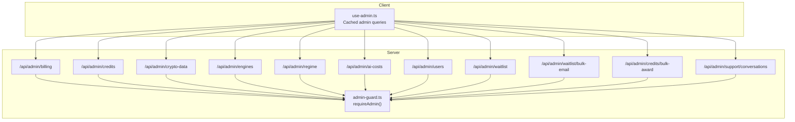
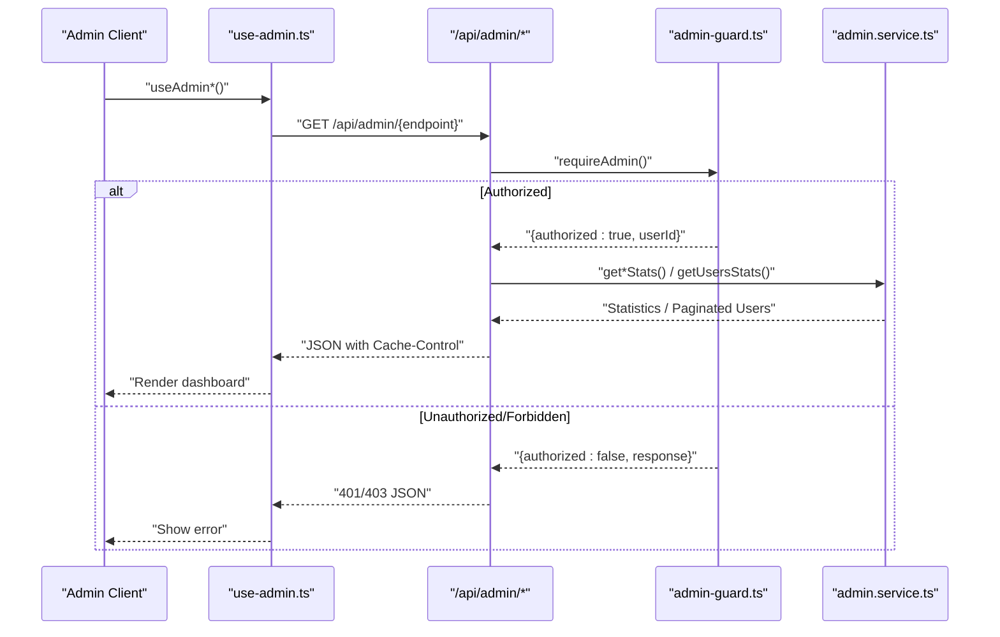
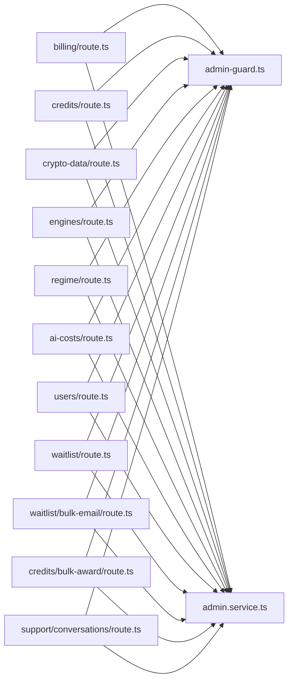

# Administrative API

<cite>
**Referenced Files in This Document**
- [admin-guard.ts](file://src/lib/middleware/admin-guard.ts)
- [use-admin.ts](file://src/hooks/use-admin.ts)
- [admin.service.ts](file://src/lib/services/admin.service.ts)
- [billing/route.ts](file://src/app/api/admin/billing/route.ts)
- [credits/route.ts](file://src/app/api/admin/credits/route.ts)
- [crypto-data/route.ts](file://src/app/api/admin/crypto-data/route.ts)
- [engines/route.ts](file://src/app/api/admin/engines/route.ts)
- [regime/route.ts](file://src/app/api/admin/regime/route.ts)
- [ai-costs/route.ts](file://src/app/api/admin/ai-costs/route.ts)
- [users/route.ts](file://src/app/api/admin/users/route.ts)
- [waitlist/route.ts](file://src/app/api/admin/waitlist/route.ts)
- [waitlist/bulk-email/route.ts](file://src/app/api/admin/waitlist/bulk-email/route.ts)
- [credits/bulk-award/route.ts](file://src/app/api/admin/credits/bulk-award/route.ts)
- [support/conversations/route.ts](file://src/app/api/admin/support/conversations/route.ts)
- [admin-crypto-overhaul.spec.ts](file://e2e/admin-crypto-overhaul.spec.ts)
</cite>

## Table of Contents
1. [Introduction](#introduction)
2. [Project Structure](#project-structure)
3. [Core Components](#core-components)
4. [Architecture Overview](#architecture-overview)
5. [Detailed Component Analysis](#detailed-component-analysis)
6. [Dependency Analysis](#dependency-analysis)
7. [Performance Considerations](#performance-considerations)
8. [Troubleshooting Guide](#troubleshooting-guide)
9. [Conclusion](#conclusion)

## Introduction
This document describes the administrative API surface used by platform operators to monitor and manage the system. It covers analytics dashboards, billing administration, credit management, crypto data operations, engine configuration insights, regime analysis, support ticket management, user administration, and waitlist operations. It also documents role-based access control, administrative permissions, bulk operations, and system monitoring endpoints. Examples illustrate administrative workflows and system maintenance functions.

## Project Structure
Administrative endpoints are organized under `/api/admin` and protected by a shared admin guard. Client-side hooks provide cached, near-real-time access to admin dashboards. Services encapsulate data retrieval and business logic.

**Diagram sources**
- [use-admin.ts:1-86](file://src/hooks/use-admin.ts#L1-L86)
- [admin-guard.ts:17-55](file://src/lib/middleware/admin-guard.ts#L17-L55)
- [billing/route.ts:1-24](file://src/app/api/admin/billing/route.ts#L1-L24)
- [credits/route.ts:1-22](file://src/app/api/admin/credits/route.ts#L1-L22)
- [crypto-data/route.ts:1-24](file://src/app/api/admin/crypto-data/route.ts#L1-L24)
- [engines/route.ts:1-24](file://src/app/api/admin/engines/route.ts#L1-L24)
- [regime/route.ts:1-24](file://src/app/api/admin/regime/route.ts#L1-L24)
- [ai-costs/route.ts:1-24](file://src/app/api/admin/ai-costs/route.ts#L1-L24)
- [users/route.ts:1-28](file://src/app/api/admin/users/route.ts#L1-L28)
- [waitlist/route.ts:1-66](file://src/app/api/admin/waitlist/route.ts#L1-L66)
- [waitlist/bulk-email/route.ts:1-62](file://src/app/api/admin/waitlist/bulk-email/route.ts#L1-L62)
- [credits/bulk-award/route.ts:1-78](file://src/app/api/admin/credits/bulk-award/route.ts#L1-L78)
- [support/conversations/route.ts:1-34](file://src/app/api/admin/support/conversations/route.ts#L1-L34)

**Section sources**
- [use-admin.ts:1-86](file://src/hooks/use-admin.ts#L1-L86)
- [admin-guard.ts:17-55](file://src/lib/middleware/admin-guard.ts#L17-L55)

## Core Components
- Role-based access control: All admin endpoints are protected by requireAdmin(), which validates Clerk publicMetadata.role equals "admin". A development-mode bypass allows local testing without real authentication.
- Client hooks: use-admin.ts provides cached, periodic polling for admin metrics and lists, with faster refresh for operational dashboards.
- Services: admin.service.ts exposes typed statistics and paginated user listings used by admin routes.

Key responsibilities:
- Authentication and authorization via Clerk metadata
- Caching headers for dashboard endpoints
- Bulk operations with transactional safety
- Export endpoints for CSV downloads
- Cursor-based pagination for long lists

**Section sources**
- [admin-guard.ts:17-55](file://src/lib/middleware/admin-guard.ts#L17-L55)
- [use-admin.ts:10-86](file://src/hooks/use-admin.ts#L10-L86)
- [admin.service.ts:1995-2015](file://src/lib/services/admin.service.ts#L1995-L2015)

## Architecture Overview
Administrative requests flow through a shared guard that enforces admin-only access. Endpoints delegate to services for data aggregation and return JSON responses with appropriate caching headers. Some endpoints support bulk actions and exports.

**Diagram sources**
- [use-admin.ts:16-86](file://src/hooks/use-admin.ts#L16-L86)
- [admin-guard.ts:17-55](file://src/lib/middleware/admin-guard.ts#L17-L55)
- [billing/route.ts:10-23](file://src/app/api/admin/billing/route.ts#L10-L23)
- [users/route.ts:10-27](file://src/app/api/admin/users/route.ts#L10-L27)

## Detailed Component Analysis

### Role-Based Access Control and Permissions
- Endpoint protection: requireAdmin() checks Clerk user metadata for role "admin". On failure, returns 401 or 403 depending on auth state.
- Development bypass: When a runtime flag is enabled, requests are auto-authorized for local testing.
- Error handling: All failures are logged and surfaced as structured JSON errors.

Operational notes:
- Set Clerk user publicMetadata.role to "admin" for production access.
- Use the development bypass only in controlled environments.

**Section sources**
- [admin-guard.ts:17-55](file://src/lib/middleware/admin-guard.ts#L17-L55)

### Analytics Dashboards
- Overview: /api/admin/overview (client hook: useAdminOverview)
- Revenue: /api/admin/revenue (client hook: useAdminRevenue)
- AI Costs: /api/admin/ai-costs (client hook: useAdminAICosts)
- Usage: /api/admin/usage (client hook: useAdminUsage)
- Engines: /api/admin/engines (client hook: useAdminEngines)
- Regime: /api/admin/regime (client hook: useAdminRegime)
- Infrastructure: /api/admin/infrastructure (client hook: useAdminInfrastructure)
- Growth: /api/admin/growth (client hook: useAdminGrowth)
- Myra: /api/admin/myra (client hook: useAdminMyra)
- Credits: /api/admin/credits (client hook: useAdminCredits)
- Waitlist: /api/admin/waitlist (client hook: useAdminWaitlist)
- Crypto Data: /api/admin/crypto-data (client hook: useAdminCryptoData)
- AI Ops: /api/admin/ai-ops (client hook: useAdminAIOps)

Caching behavior:
- Many endpoints set Cache-Control headers to balance freshness and performance.

**Section sources**
- [use-admin.ts:16-86](file://src/hooks/use-admin.ts#L16-L86)
- [ai-costs/route.ts:10-23](file://src/app/api/admin/ai-costs/route.ts#L10-L23)
- [engines/route.ts:10-23](file://src/app/api/admin/engines/route.ts#L10-L23)
- [regime/route.ts:10-23](file://src/app/api/admin/regime/route.ts#L10-L23)
- [crypto-data/route.ts:10-23](file://src/app/api/admin/crypto-data/route.ts#L10-L23)
- [credits/route.ts:10-21](file://src/app/api/admin/credits/route.ts#L10-L21)

### Billing Administration
Endpoint: GET /api/admin/billing
- Purpose: Retrieve billing analytics for the admin dashboard.
- Protection: requireAdmin()
- Response: Aggregated billing statistics.
- Caching: Private cache with short TTL.

Example workflow:
- Load billing stats in the admin UI using the client hook.
- Display revenue trends and subscription metrics.

**Section sources**
- [billing/route.ts:10-23](file://src/app/api/admin/billing/route.ts#L10-L23)

### Credit Management
Endpoints:
- GET /api/admin/credits
  - Returns credit-related statistics for the dashboard.
- POST /api/admin/credits/bulk-award
  - Bulk award credits to users with transactional safety.
  - Request body:
    - userIds: array of user IDs
    - amount: positive number
    - reason: string description
  - Response: { success: boolean, awarded: number, failed: number, totalCredits: number }
- GET /api/admin/credits/bulk-award
  - Lists recent users for selection in bulk award UI.

Example workflow:
- Prepare a list of recipients and a reason.
- Submit the bulk award request.
- Review results and logs.

**Section sources**
- [credits/route.ts:10-21](file://src/app/api/admin/credits/route.ts#L10-L21)
- [credits/bulk-award/route.ts:11-77](file://src/app/api/admin/credits/bulk-award/route.ts#L11-L77)

### Crypto Data Operations
Endpoint: GET /api/admin/crypto-data
- Purpose: Provide crypto data source statistics for the admin dashboard.
- Protection: requireAdmin()
- Response: Data source health and coverage metrics.
- Caching: Short private TTL.

Validation:
- E2E tests confirm the endpoint returns expected keys including crypto intelligence stats.

**Section sources**
- [crypto-data/route.ts:10-23](file://src/app/api/admin/crypto-data/route.ts#L10-L23)
- [admin-crypto-overhaul.spec.ts:38-55](file://e2e/admin-crypto-overhaul.spec.ts#L38-L55)

### Engine Configuration and Intelligence
Endpoint: GET /api/admin/engines
- Purpose: Return engine statistics, including crypto intelligence metrics.
- Protection: requireAdmin()
- Response: Engine health and crypto intelligence stats.
- Caching: Short private TTL.

**Section sources**
- [engines/route.ts:10-23](file://src/app/api/admin/engines/route.ts#L10-L23)

### Regime Analysis
Endpoint: GET /api/admin/regime
- Purpose: Provide regime analysis statistics for the admin dashboard.
- Protection: requireAdmin()
- Response: Regime metrics and distribution.
- Caching: Short private TTL.

**Section sources**
- [regime/route.ts:10-23](file://src/app/api/admin/regime/route.ts#L10-L23)

### Support Ticket Management
Endpoints:
- GET /api/admin/support/conversations
  - List support conversations with optional cursor-based pagination.
  - Query parameters:
    - limit: integer between 1 and 100
    - cursor: object with id and updatedAt
  - Response: Paginated list of conversations.

Example workflow:
- Fetch recent conversations.
- Use cursor to paginate through older items.

**Section sources**
- [support/conversations/route.ts:10-33](file://src/app/api/admin/support/conversations/route.ts#L10-L33)

### User Administration
Endpoint: GET /api/admin/users
- Purpose: Paginated listing of users for administrative review.
- Query parameters:
  - page: minimum 1
  - pageSize: clamped between 1 and 100
- Response: Users list, total count, and plan breakdown.

Example workflow:
- Navigate through pages to audit user activity.
- Export user data for compliance if needed.

**Section sources**
- [users/route.ts:10-27](file://src/app/api/admin/users/route.ts#L10-L27)
- [admin.service.ts:1995-2015](file://src/lib/services/admin.service.ts#L1995-L2015)

### Waitlist Operations
Endpoints:
- GET /api/admin/waitlist
  - Returns waitlist statistics and user records.
- POST /api/admin/waitlist
  - Exports waitlist users to CSV with headers and proper escaping.
  - Response: CSV file attachment with current date suffix.
- POST /api/admin/waitlist/bulk-email
  - Sends bulk email to selected waitlist users via Brevo.
  - Request body:
    - ids: array of user IDs
    - subject: string
    - htmlContent: string
    - textContent: optional string
  - Response: { success: boolean, sent: number }
  - Side effect: marks users as emailed.

Example workflow:
- Export waitlist for external analysis.
- Select recipients and send a targeted campaign.
- Track sent counts and update waitlist status.

**Section sources**
- [waitlist/route.ts:19-65](file://src/app/api/admin/waitlist/route.ts#L19-L65)
- [waitlist/bulk-email/route.ts:12-61](file://src/app/api/admin/waitlist/bulk-email/route.ts#L12-L61)

### AI Costs and Limits
Endpoints:
- GET /api/admin/ai-costs
  - Returns AI cost statistics for the dashboard.
- GET /api/admin/ai-limits
  - Returns AI limits statistics for the dashboard.

Caching: Short private TTL for near-real-time insights.

**Section sources**
- [ai-costs/route.ts:10-23](file://src/app/api/admin/ai-costs/route.ts#L10-L23)

### System Monitoring Endpoints
- GET /api/admin/cache-stats
  - Returns cache statistics for monitoring.
- GET /api/admin/usage
  - Returns usage metrics for the requested range.
- GET /api/admin/overview
  - Returns high-level overview metrics.
- GET /api/admin/ai-ops
  - Returns near-real-time operational metrics (refreshed frequently).

These endpoints support operational dashboards and alerting.

**Section sources**
- [use-admin.ts:16-86](file://src/hooks/use-admin.ts#L16-L86)

## Dependency Analysis
The admin API relies on a small set of shared guards and services. Routes depend on requireAdmin() and service functions that encapsulate database and external integrations.

**Diagram sources**
- [admin-guard.ts:17-55](file://src/lib/middleware/admin-guard.ts#L17-L55)
- [billing/route.ts:1-24](file://src/app/api/admin/billing/route.ts#L1-L24)
- [credits/route.ts:1-22](file://src/app/api/admin/credits/route.ts#L1-L22)
- [crypto-data/route.ts:1-24](file://src/app/api/admin/crypto-data/route.ts#L1-L24)
- [engines/route.ts:1-24](file://src/app/api/admin/engines/route.ts#L1-L24)
- [regime/route.ts:1-24](file://src/app/api/admin/regime/route.ts#L1-L24)
- [ai-costs/route.ts:1-24](file://src/app/api/admin/ai-costs/route.ts#L1-L24)
- [users/route.ts:1-28](file://src/app/api/admin/users/route.ts#L1-L28)
- [waitlist/route.ts:1-66](file://src/app/api/admin/waitlist/route.ts#L1-L66)
- [waitlist/bulk-email/route.ts:1-62](file://src/app/api/admin/waitlist/bulk-email/route.ts#L1-L62)
- [credits/bulk-award/route.ts:1-78](file://src/app/api/admin/credits/bulk-award/route.ts#L1-L78)
- [support/conversations/route.ts:1-34](file://src/app/api/admin/support/conversations/route.ts#L1-L34)
- [admin.service.ts:1995-2015](file://src/lib/services/admin.service.ts#L1995-L2015)

**Section sources**
- [admin-guard.ts:17-55](file://src/lib/middleware/admin-guard.ts#L17-L55)
- [admin.service.ts:1995-2015](file://src/lib/services/admin.service.ts#L1995-L2015)

## Performance Considerations
- Caching: Many admin endpoints set Cache-Control headers to reduce load and improve responsiveness. Prefer these endpoints for dashboards.
- Polling intervals: use-admin.ts sets conservative refresh intervals for most widgets and faster intervals for AI ops.
- Pagination: Use limit and cursor parameters for long lists (e.g., support conversations).
- Bulk operations: Use bulk award and bulk email endpoints to minimize repeated requests.

[No sources needed since this section provides general guidance]

## Troubleshooting Guide
Common issues and resolutions:
- 401 Unauthorized: Ensure the authenticated user has Clerk publicMetadata.role set to "admin".
- 403 Forbidden: Admin access required; verify user role configuration.
- 500 Internal Error: Check server logs for sanitized error traces; endpoints wrap failures with structured apiError responses.
- Rate limiting: Admin endpoints are not rate-limited in the provided code; consider upstream rate limits from Clerk or email providers.

**Section sources**
- [admin-guard.ts:28-54](file://src/lib/middleware/admin-guard.ts#L28-L54)
- [billing/route.ts:19-22](file://src/app/api/admin/billing/route.ts#L19-L22)
- [waitlist/bulk-email/route.ts:57-60](file://src/app/api/admin/waitlist/bulk-email/route.ts#L57-L60)

## Conclusion
The administrative API provides a secure, efficient interface for platform operators to monitor and manage core system functions. With role-based access control, bulk operations, and export capabilities, it supports day-to-day administration and incident response. Use the provided client hooks and endpoints to build reliable dashboards and automate administrative tasks.