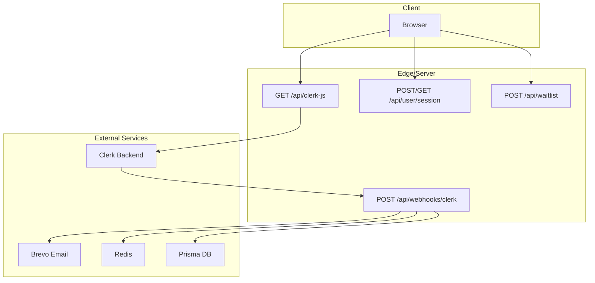
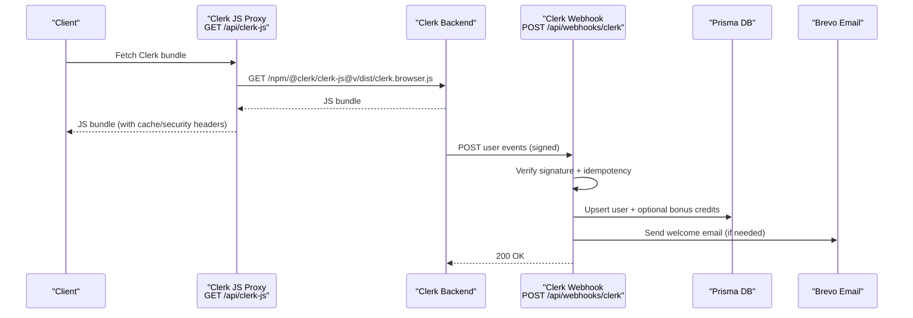
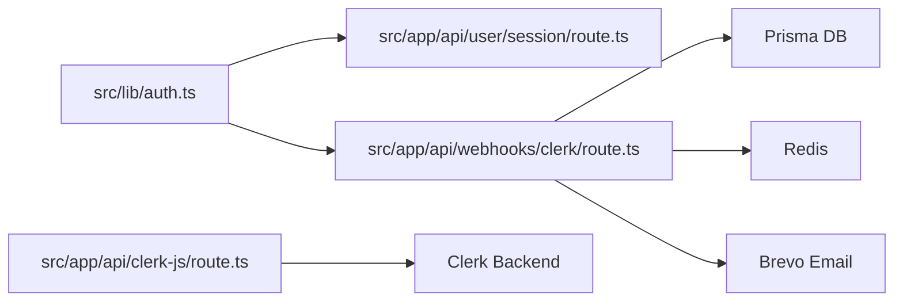

# Authentication API

<cite>
**Referenced Files in This Document**
- [route.ts](file://src/app/api/clerk-js/route.ts)
- [route.ts](file://src/app/api/webhooks/clerk/route.ts)
- [auth.ts](file://src/lib/auth.ts)
- [route.ts](file://src/app/api/user/session/route.ts)
- [route.ts](file://src/app/api/waitlist/route.ts)
- [proxy.ts](file://src/proxy.ts)
- [api-patterns/auth.md](file://.windsurf/skills/api-patterns/auth.md)
</cite>

## Table of Contents
1. [Introduction](#introduction)
2. [Project Structure](#project-structure)
3. [Core Components](#core-components)
4. [Architecture Overview](#architecture-overview)
5. [Detailed Component Analysis](#detailed-component-analysis)
6. [Dependency Analysis](#dependency-analysis)
7. [Performance Considerations](#performance-considerations)
8. [Troubleshooting Guide](#troubleshooting-guide)
9. [Conclusion](#conclusion)

## Introduction
This document provides comprehensive API documentation for authentication endpoints and related flows in the project. It covers:
- Pre-launch redemption and status verification endpoints for early access programs
- Clerk integration endpoints for client-side authentication flows and webhook handling
- Authentication methods, session management, token validation, and security considerations
- Request/response schemas, error codes, and practical examples for authentication workflows
- Rate limiting, security headers, and CORS configuration

## Project Structure
Authentication-related APIs are organized under the Next.js App Router at:
- Clerk JS proxy endpoint: GET /api/clerk-js
- Clerk webhooks: POST /api/webhooks/clerk
- Session management: POST/GET /api/user/session
- Public waitlist: POST /api/waitlist

**Diagram sources**
- [route.ts:15-47](file://src/app/api/clerk-js/route.ts#L15-L47)
- [route.ts:50-378](file://src/app/api/webhooks/clerk/route.ts#L50-L378)
- [route.ts:13-115](file://src/app/api/user/session/route.ts#L13-L115)
- [route.ts:14-46](file://src/app/api/waitlist/route.ts#L14-L46)

**Section sources**
- [route.ts:1-48](file://src/app/api/clerk-js/route.ts#L1-L48)
- [route.ts:1-379](file://src/app/api/webhooks/clerk/route.ts#L1-L379)
- [route.ts:1-115](file://src/app/api/user/session/route.ts#L1-L115)
- [route.ts:1-47](file://src/app/api/waitlist/route.ts#L1-L47)

## Core Components
- Clerk JS Proxy: Proxies Clerk’s browser bundle with caching and security headers.
- Clerk Webhooks: Validates signatures, ensures idempotency, and synchronizes user state.
- Session Management: Starts, tracks, and ends user sessions with activity logging.
- Waitlist API: Registers users for early access with basic validation.

**Section sources**
- [route.ts:15-47](file://src/app/api/clerk-js/route.ts#L15-L47)
- [route.ts:50-378](file://src/app/api/webhooks/clerk/route.ts#L50-L378)
- [route.ts:13-115](file://src/app/api/user/session/route.ts#L13-L115)
- [route.ts:14-46](file://src/app/api/waitlist/route.ts#L14-L46)

## Architecture Overview
The authentication architecture integrates Clerk for identity with internal handlers for session tracking and onboarding incentives.

**Diagram sources**
- [route.ts:15-47](file://src/app/api/clerk-js/route.ts#L15-L47)
- [route.ts:50-378](file://src/app/api/webhooks/clerk/route.ts#L50-L378)

## Detailed Component Analysis

### Clerk JS Proxy Endpoint
- Method: GET
- Path: /api/clerk-js
- Purpose: Proxies Clerk’s browser JavaScript bundle with caching and security headers.
- Behavior:
  - Reads publishable key from environment and parses the frontend API domain.
  - Builds Clerk JS URL using configured version and fetches the bundle.
  - Returns proxied content with appropriate Content-Type, Cache-Control, and X-Content-Type-Options.
  - Logs and returns 500 if publishable key is missing or proxy fetch fails.

Security and headers:
- Content-Type: Inherits from upstream or defaults to application/javascript; charset=utf-8
- Cache-Control: public, max-age=300, stale-while-revalidate=3600
- X-Content-Type-Options: nosniff

Rate limiting:
- Not exposed as a separate endpoint; caching reduces repeated fetches.

Operational notes:
- Environment variables: NEXT_PUBLIC_CLERK_PUBLISHABLE_KEY, NEXT_PUBLIC_CLERK_JS_VERSION

**Section sources**
- [route.ts:15-47](file://src/app/api/clerk-js/route.ts#L15-L47)

### Clerk Webhooks Endpoint
- Method: POST
- Path: /api/webhooks/clerk
- Purpose: Validates Clerk webhook signatures, ensures idempotency, and synchronizes user state.
- Security:
  - Verifies signature using Svix headers (svix-id, svix-timestamp, svix-signature) and configured secret.
  - Enforces idempotency using Redis with a 24-hour TTL keyed by svix-id.
- Supported events:
  - user.created: Creates/updates user record, grants sign-up bonus credits if eligible, sends welcome email, and sets preferences.
  - user.updated: Ensures user exists and preserves ELITE plan or admin privileges; grants sign-up bonus if needed.
  - user.deleted: GDPR-compliant anonymization and content purge across multiple tables.
- Error handling:
  - Returns 400 for missing headers or invalid signature.
  - Returns 500 on handler failures; releases idempotency lock to allow retries.

Idempotency and concurrency:
- Uses Redis NX to prevent duplicate processing.
- Wraps user creation and bonus grants in a database transaction to avoid race conditions.

**Section sources**
- [route.ts:50-378](file://src/app/api/webhooks/clerk/route.ts#L50-L378)

### Session Management API
- Methods: POST, GET
- Path: /api/user/session
- Purpose: Manage user sessions and track activity events.
- Authentication:
  - Requires authenticated user context resolved by the project’s auth wrapper.
- Endpoints:
  - POST: Supports actions “start”, “heartbeat”, “end”, “track”
    - start: Creates a new session and returns sessionId
    - heartbeat: Updates lastActivityAt for a given sessionId
    - end: Marks session as inactive and records endedAt
    - track: Records an activity event and optionally updates session heartbeat
  - GET: Returns current active sessionId and whether a session exists
- Request/response schemas:
  - POST body keys: action (required), sessionId (required for heartbeat/end/track), eventType, path, metadata, deviceInfo, ipAddress
  - POST response: { sessionId } for start; { success: true } for heartbeat/end/track
  - GET response: { sessionId, hasActiveSession }

Security and validation:
- Enforces action presence and sessionId requirement for heartbeat/end/track.
- Uses database transactions for user session and activity event writes.

**Section sources**
- [route.ts:13-115](file://src/app/api/user/session/route.ts#L13-L115)

### Waitlist API
- Method: POST
- Path: /api/waitlist
- Purpose: Register users for early access with basic validation.
- Request body:
  - email (required): validated as a basic email format
  - firstName, lastName, source (default: landing_page), notes
- Response:
  - success: boolean
  - waitlistUser: { id, email }

Validation and error handling:
- Returns 400 if email is invalid.
- Returns 500 on internal errors.

**Section sources**
- [route.ts:14-46](file://src/app/api/waitlist/route.ts#L14-L46)

### Authentication Wrapper and Token Validation
- Module: src/lib/auth.ts
- Purpose: Provides unified authentication abstraction with optional bypass for development/testing.
- Key behaviors:
  - Resolves authenticated user context via Clerk in production.
  - Supports auth bypass via environment variable or request header (x-skip-auth/SKIP_AUTH) with prioritized resolution:
    - Explicit user ID via environment variable
    - Plan-based seeded user lookup
    - Fallback sentinel user
  - Includes privileged email detection for admin roles.
- Token validation:
  - Delegates to Clerk for token verification in production.
  - Bypass mode returns a deterministic test context for E2E testing.

**Section sources**
- [auth.ts:32-88](file://src/lib/auth.ts#L32-L88)

### Pre-launch Redemption and Status Verification
- Current state:
  - No dedicated prelaunch redemption or status verification endpoints were identified in the repository.
  - The waitlist endpoint serves as an early access registration mechanism.
- Recommendations:
  - Introduce explicit endpoints for coupon validation and redemption with strict rate limiting and idempotency.
  - Add status verification endpoint returning eligibility and redemption state.

[No sources needed since this section summarizes absence of specific endpoints]

### Rate Limiting and Security Headers
- Rate limiting:
  - Auth bypass attempts are rate-limited by IP when x-skip-auth is present. The proxy enforces this during middleware processing.
- Security headers:
  - Clerk JS proxy sets X-Content-Type-Options: nosniff and Cache-Control for long-lived caching.
- CORS:
  - Not explicitly configured in the analyzed files; default Next.js behavior applies.

**Section sources**
- [proxy.ts:105-133](file://src/proxy.ts#L105-L133)
- [route.ts:38-46](file://src/app/api/clerk-js/route.ts#L38-L46)

## Dependency Analysis

**Diagram sources**
- [auth.ts:32-88](file://src/lib/auth.ts#L32-L88)
- [route.ts:13-115](file://src/app/api/user/session/route.ts#L13-L115)
- [route.ts:50-378](file://src/app/api/webhooks/clerk/route.ts#L50-L378)
- [route.ts:15-47](file://src/app/api/clerk-js/route.ts#L15-L47)

**Section sources**
- [auth.ts:32-88](file://src/lib/auth.ts#L32-L88)
- [route.ts:13-115](file://src/app/api/user/session/route.ts#L13-L115)
- [route.ts:50-378](file://src/app/api/webhooks/clerk/route.ts#L50-L378)
- [route.ts:15-47](file://src/app/api/clerk-js/route.ts#L15-L47)

## Performance Considerations
- Clerk JS proxy caching: Long cache TTLs reduce origin requests and latency.
- Webhook idempotency: Redis-based locks prevent duplicate processing and retries from causing overhead.
- Transactional writes: Batched or parallelized DB operations minimize round-trips for user deletions.
- Session tracking: Heartbeat and activity tracking are lightweight and optional.

[No sources needed since this section provides general guidance]

## Troubleshooting Guide
Common issues and resolutions:
- Missing Clerk publishable key:
  - Symptom: 500 from Clerk JS proxy
  - Resolution: Set NEXT_PUBLIC_CLERK_PUBLISHABLE_KEY
- Invalid webhook signature:
  - Symptom: 400 from Clerk webhooks
  - Resolution: Verify CLERK_WEBHOOK_SECRET and Svix headers
- Duplicate webhook processing:
  - Symptom: No-op after initial processing
  - Resolution: Idempotency lock prevents duplicates; inspect Redis key
- Auth bypass not working:
  - Symptom: Auth enforced despite headers/env
  - Resolution: Confirm x-skip-auth header or SKIP_AUTH environment variable; ensure proxy middleware applies rate limiting

**Section sources**
- [route.ts:17-20](file://src/app/api/clerk-js/route.ts#L17-L20)
- [route.ts:53-67](file://src/app/api/webhooks/clerk/route.ts#L53-L67)
- [proxy.ts:114-120](file://src/proxy.ts#L114-L120)

## Conclusion
The authentication subsystem integrates Clerk for identity while providing robust internal handlers for session tracking, onboarding incentives, and webhook-driven synchronization. The documented endpoints and patterns enable secure, scalable authentication flows with emphasis on idempotency, caching, and development-friendly bypass mechanisms.