# Market Data API

<cite>
**Referenced Files in This Document**
- [breadth/route.ts](file://src/app/api/market/breadth/route.ts)
- [correlation-stress/route.ts](file://src/app/api/market/correlation-stress/route.ts)
- [factor-rotation/route.ts](file://src/app/api/market/factor-rotation/route.ts)
- [regime-multi-horizon/route.ts](file://src/app/api/market/regime-multi-horizon/route.ts)
- [volatility-structure/route.ts](file://src/app/api/market/volatility-structure/route.ts)
- [quotes/route.ts](file://src/app/api/stocks/quotes/route.ts)
- [history/route.ts](file://src/app/api/stocks/history/route.ts)
- [movers/route.ts](file://src/app/api/stocks/movers/route.ts)
- [compare/route.ts](file://src/app/api/stocks/compare/route.ts)
- [stress-test/route.ts](file://src/app/api/stocks/stress-test/route.ts)
- [market-data.ts](file://src/lib/market-data.ts)
- [schemas.ts](file://src/lib/schemas.ts)
- [api-response.ts](file://src/lib/api-response.ts)
- [prisma.ts](file://src/lib/prisma.ts)
- [redis.ts](file://src/lib/cache.ts)
- [logger.ts](file://src/lib/logger.ts)
- [auth.ts](file://src/lib/auth.ts)
- [rate-limit.ts](file://src/lib/rate-limit.ts)
- [plan-gate.ts](file://src/lib/middleware/plan-gate.ts)
- [credit.service.ts](file://src/lib/services/credit.service.ts)
- [stress-scenarios.ts](file://src/lib/stress-scenarios.ts)
- [multi-horizon-regime.ts](file://src/lib/engines/multi-horizon-regime.ts)
</cite>

## Table of Contents
1. [Introduction](#introduction)
2. [Project Structure](#project-structure)
3. [Core Components](#core-components)
4. [Architecture Overview](#architecture-overview)
5. [Detailed Component Analysis](#detailed-component-analysis)
6. [Dependency Analysis](#dependency-analysis)
7. [Performance Considerations](#performance-considerations)
8. [Troubleshooting Guide](#troubleshooting-guide)
9. [Conclusion](#conclusion)

## Introduction
This document provides comprehensive API documentation for market data endpoints. It covers cryptocurrency and stock market data retrieval, price quotes, historical data, sector performance, market breadth analysis, correlation stress testing, factor rotation patterns, multi-horizon regime analysis, and volatility structure calculations. The guide includes request parameters, filtering options, pagination, data formatting, and real-time updates. It also provides examples for market data queries, comparison operations, and regime detection endpoints.

## Project Structure
The market data APIs are organized under the Next.js App Router at:
- Market analytics endpoints: src/app/api/market/*
- Stock market endpoints: src/app/api/stocks/*

Key supporting libraries include:
- Data fetching and caching: src/lib/market-data.ts, src/lib/cache.ts
- Request validation: src/lib/schemas.ts
- Response formatting and error handling: src/lib/api-response.ts
- Persistence: src/lib/prisma.ts
- Logging: src/lib/logger.ts
- Authentication and rate limiting: src/lib/auth.ts, src/lib/rate-limit.ts
- Plan gating and credits: src/lib/middleware/plan-gate.ts, src/lib/services/credit.service.ts
- Stress testing and regime engines: src/lib/stress-scenarios.ts, src/lib/engines/multi-horizon-regime.ts

```mermaid
graph TB
subgraph "Stocks API"
SQuotes["GET /api/stocks/quotes"]
SHistory["GET /api/stocks/history"]
SMovers["GET /api/stocks/movers"]
SCompare["GET /api/stocks/compare"]
SStress["POST /api/stocks/stress-test"]
end
subgraph "Market Analytics API"
MBreadth["GET /api/market/breadth"]
MCorr["GET /api/market/correlation-stress"]
MFacRot["GET /api/market/factor-rotation"]
MRegimeMH["GET /api/market/regime-multi-horizon"]
MVolStruct["GET /api/market/volatility-structure"]
end
subgraph "Libraries"
LPrisma["prisma.ts"]
LRedis["cache.ts"]
LSchemas["schemas.ts"]
LAuth["auth.ts"]
LRateLimit["rate-limit.ts"]
LPlanGate["plan-gate.ts"]
LCredit["credit.service.ts"]
LStress["stress-scenarios.ts"]
LMH["multi-horizon-regime.ts"]
end
SQuotes --> LPrisma
SHistory --> LPrisma
SMovers --> LPrisma
SCompare --> LPrisma
SStress --> LPrisma
MBreadth --> LPrisma
MCorr --> LPrisma
MFacRot --> LPrisma
MRegimeMH --> LPrisma
MVolStruct --> LPrisma
SQuotes --> LRedis
SHistory --> LRedis
SMovers --> LRedis
MFacRot --> LRedis
MBreadth --> LRedis
MVolStruct --> LRedis
SQuotes --> LSchemas
SHistory --> LSchemas
SMovers --> LSchemas
SCompare --> LSchemas
SStress --> LSchemas
SQuotes --> LAuth
SQuotes --> LRateLimit
SMovers --> LAuth
SMovers --> LRateLimit
SCompare --> LAuth
SCompare --> LPlanGate
SCompare --> LCredit
SStress --> LAuth
SStress --> LPlanGate
SStress --> LCredit
MFacRot --> LAuth
MFacRot --> LPlanGate
MFacRot --> LRedis
```

**Diagram sources**
- [quotes/route.ts:1-51](file://src/app/api/stocks/quotes/route.ts#L1-L51)
- [history/route.ts:1-74](file://src/app/api/stocks/history/route.ts#L1-L74)
- [movers/route.ts:1-88](file://src/app/api/stocks/movers/route.ts#L1-L88)
- [compare/route.ts:1-124](file://src/app/api/stocks/compare/route.ts#L1-L124)
- [stress-test/route.ts:1-486](file://src/app/api/stocks/stress-test/route.ts#L1-L486)
- [breadth/route.ts:1-58](file://src/app/api/market/breadth/route.ts#L1-L58)
- [correlation-stress/route.ts:1-76](file://src/app/api/market/correlation-stress/route.ts#L1-L76)
- [factor-rotation/route.ts:1-133](file://src/app/api/market/factor-rotation/route.ts#L1-L133)
- [regime-multi-horizon/route.ts:1-77](file://src/app/api/market/regime-multi-horizon/route.ts#L1-L77)
- [volatility-structure/route.ts:1-64](file://src/app/api/market/volatility-structure/route.ts#L1-L64)
- [prisma.ts](file://src/lib/prisma.ts)
- [redis.ts](file://src/lib/cache.ts)
- [schemas.ts](file://src/lib/schemas.ts)
- [auth.ts](file://src/lib/auth.ts)
- [rate-limit.ts](file://src/lib/rate-limit.ts)
- [plan-gate.ts](file://src/lib/middleware/plan-gate.ts)
- [credit.service.ts](file://src/lib/services/credit.service.ts)
- [stress-scenarios.ts](file://src/lib/stress-scenarios.ts)
- [multi-horizon-regime.ts](file://src/lib/engines/multi-horizon-regime.ts)

**Section sources**
- [quotes/route.ts:1-51](file://src/app/api/stocks/quotes/route.ts#L1-L51)
- [history/route.ts:1-74](file://src/app/api/stocks/history/route.ts#L1-L74)
- [movers/route.ts:1-88](file://src/app/api/stocks/movers/route.ts#L1-L88)
- [compare/route.ts:1-124](file://src/app/api/stocks/compare/route.ts#L1-L124)
- [stress-test/route.ts:1-486](file://src/app/api/stocks/stress-test/route.ts#L1-L486)
- [breadth/route.ts:1-58](file://src/app/api/market/breadth/route.ts#L1-L58)
- [correlation-stress/route.ts:1-76](file://src/app/api/market/correlation-stress/route.ts#L1-L76)
- [factor-rotation/route.ts:1-133](file://src/app/api/market/factor-rotation/route.ts#L1-L133)
- [regime-multi-horizon/route.ts:1-77](file://src/app/api/market/regime-multi-horizon/route.ts#L1-L77)
- [volatility-structure/route.ts:1-64](file://src/app/api/market/volatility-structure/route.ts#L1-L64)

## Core Components
- Market Breadth: Computes breadth metrics for trend and momentum across regions.
- Correlation Stress: Returns correlation metrics and cross-sector insights.
- Factor Rotation: Provides factor buckets and leading/lagging status for crypto assets.
- Multi-Horizon Regime: Aggregates regime analysis across short, medium, and long horizons.
- Volatility Structure: Bins assets by volatility into stable, normal, and elevated buckets.
- Stock Quotes: Fetches current quotes for requested symbols with rate limits.
- Stock History: Retrieves OHLCV-style historical data with per-range caching.
- Top Movers: Returns top gainers and losers with region-aware filtering.
- Asset Comparison: Compares up to three assets with scoring and performance data.
- Stress Test: Runs scenario-based stress tests with direct replay or proxy-based estimation.

**Section sources**
- [breadth/route.ts:14-57](file://src/app/api/market/breadth/route.ts#L14-L57)
- [correlation-stress/route.ts:24-75](file://src/app/api/market/correlation-stress/route.ts#L24-L75)
- [factor-rotation/route.ts:34-132](file://src/app/api/market/factor-rotation/route.ts#L34-L132)
- [regime-multi-horizon/route.ts:14-76](file://src/app/api/market/regime-multi-horizon/route.ts#L14-L76)
- [volatility-structure/route.ts:14-63](file://src/app/api/market/volatility-structure/route.ts#L14-L63)
- [quotes/route.ts:14-50](file://src/app/api/stocks/quotes/route.ts#L14-L50)
- [history/route.ts:22-73](file://src/app/api/stocks/history/route.ts#L22-L73)
- [movers/route.ts:18-87](file://src/app/api/stocks/movers/route.ts#L18-L87)
- [compare/route.ts:15-123](file://src/app/api/stocks/compare/route.ts#L15-L123)
- [stress-test/route.ts:238-485](file://src/app/api/stocks/stress-test/route.ts#L238-L485)

## Architecture Overview
The market data APIs follow a layered pattern:
- Route handlers validate requests, enforce auth and rate limits, and delegate to domain services.
- Data access uses Prisma ORM against the database.
- Caching leverages Redis with region-specific keys and TTLs tailored to data freshness.
- Responses are formatted via a unified error handler and logging utilities.

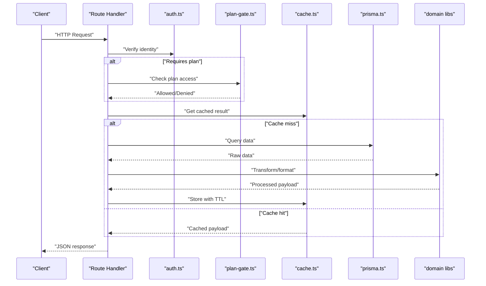

**Diagram sources**
- [quotes/route.ts:14-50](file://src/app/api/stocks/quotes/route.ts#L14-L50)
- [movers/route.ts:18-87](file://src/app/api/stocks/movers/route.ts#L18-L87)
- [compare/route.ts:15-123](file://src/app/api/stocks/compare/route.ts#L15-L123)
- [stress-test/route.ts:238-485](file://src/app/api/stocks/stress-test/route.ts#L238-L485)
- [breadth/route.ts:22-48](file://src/app/api/market/breadth/route.ts#L22-L48)
- [volatility-structure/route.ts:22-54](file://src/app/api/market/volatility-structure/route.ts#L22-L54)
- [factor-rotation/route.ts:47-127](file://src/app/api/market/factor-rotation/route.ts#L47-L127)
- [correlation-stress/route.ts:32-66](file://src/app/api/market/correlation-stress/route.ts#L32-L66)
- [regime-multi-horizon/route.ts:20-71](file://src/app/api/market/regime-multi-horizon/route.ts#L20-L71)

## Detailed Component Analysis

### Market Breadth
- Purpose: Compute breadth metrics for trend and momentum across a region.
- Endpoint: GET /api/market/breadth
- Query parameters:
  - region: "US" or "IN" (default "US")
- Response fields:
  - region: Requested region
  - total: Total assets considered
  - metrics.trend.threshold/count/percent: Threshold and counts for trend
  - metrics.momentum.threshold/count/percent: Threshold and counts for momentum
  - computedAt: ISO timestamp of computation
- Caching: 1 hour TTL with region-specific cache key
- Notes: Uses a single DB query to fetch required scores and computes counts in-memory.

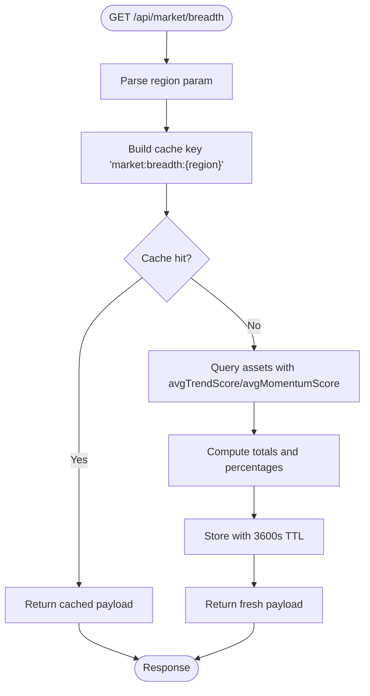

**Diagram sources**
- [breadth/route.ts:14-57](file://src/app/api/market/breadth/route.ts#L14-L57)

**Section sources**
- [breadth/route.ts:14-57](file://src/app/api/market/breadth/route.ts#L14-L57)

### Correlation Stress
- Purpose: Retrieve correlation metrics and cross-sector insights.
- Endpoint: GET /api/market/correlation-stress
- Query parameters:
  - region: "US" or "IN" (default "US")
- Response fields:
  - region: Requested region
  - computedAt: Latest regime date
  - correlation.avgCorrelation/dispersion/trend/regime/implications/confidence
  - crossSector.avgCorrelation/regime/trend/sectorDispersionIndex/guidance/implications (optional)
- Caching: 1 hour TTL with region-specific cache key
- Notes: Safely extracts typed fields from JSON stored in the regime model.

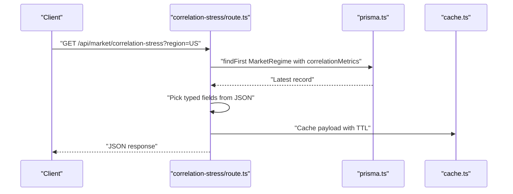

**Diagram sources**
- [correlation-stress/route.ts:24-75](file://src/app/api/market/correlation-stress/route.ts#L24-L75)

**Section sources**
- [correlation-stress/route.ts:24-75](file://src/app/api/market/correlation-stress/route.ts#L24-L75)

### Factor Rotation
- Purpose: Bucket crypto assets by factor criteria and compute average returns and momentum.
- Endpoint: GET /api/market/factor-rotation
- Query parameters:
  - region: "US" or "IN" (default "US")
- Authentication and permissions:
  - Requires authenticated user
  - Requires ELITE or ENTERPRISE plan
- Response fields:
  - factors[].factor/label/count/avgChangePercent/avgMomentumScore/status/topSymbols
  - region, assetCount, computedAt
- Caching: 1 hour TTL with region-specific cache key
- Notes: Enforces plan gate and caches result; returns empty array if no assets found.

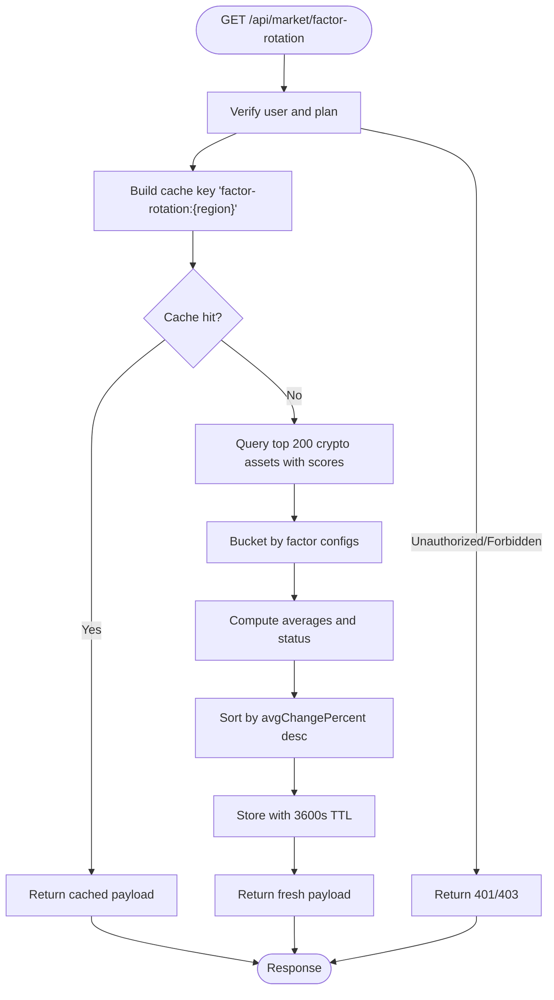

**Diagram sources**
- [factor-rotation/route.ts:34-132](file://src/app/api/market/factor-rotation/route.ts#L34-L132)

**Section sources**
- [factor-rotation/route.ts:34-132](file://src/app/api/market/factor-rotation/route.ts#L34-L132)

### Multi-Horizon Regime
- Purpose: Provide regime analysis across short, medium, and long horizons.
- Endpoint: GET /api/market/regime-multi-horizon
- Query parameters:
  - region: "US" or "IN" (default "US")
- Data source: Reads latest MarketRegime context JSON and enriches with multi-horizon calculations.
- Response fields:
  - current, timeframes.{shortTerm,mediumTerm,longTerm}, transition.{probability,direction,leadingIndicators}, interpretation
- Caching: 30-minute primary cache with stale-while-revalidate
- Notes: Falls back to wrapping a single snapshot if enrichment is not available.

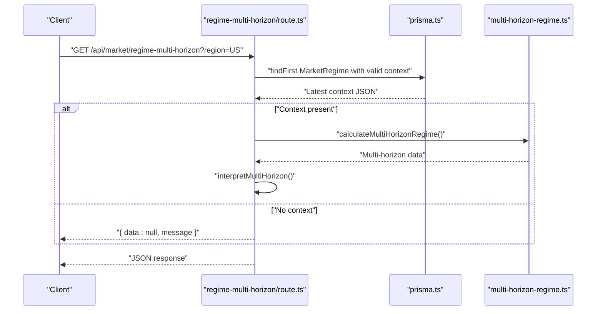

**Diagram sources**
- [regime-multi-horizon/route.ts:14-76](file://src/app/api/market/regime-multi-horizon/route.ts#L14-L76)
- [multi-horizon-regime.ts](file://src/lib/engines/multi-horizon-regime.ts)

**Section sources**
- [regime-multi-horizon/route.ts:14-76](file://src/app/api/market/regime-multi-horizon/route.ts#L14-L76)

### Volatility Structure
- Purpose: Bin assets by volatility into stable, normal, and elevated buckets.
- Endpoint: GET /api/market/volatility-structure
- Query parameters:
  - region: "US" or "IN" (default "US")
- Response fields:
  - region, total, buckets.{stable,normal,elevated}.{label,count,percent}, computedAt
- Caching: 1 hour TTL with region-specific cache key
- Notes: Single DB query to fetch scores and computes buckets in-memory.

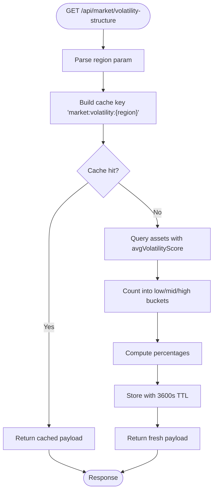

**Diagram sources**
- [volatility-structure/route.ts:14-63](file://src/app/api/market/volatility-structure/route.ts#L14-L63)

**Section sources**
- [volatility-structure/route.ts:14-63](file://src/app/api/market/volatility-structure/route.ts#L14-L63)

### Stock Quotes
- Purpose: Fetch current quotes for a list of symbols.
- Endpoint: GET /api/stocks/quotes
- Query parameters:
  - symbols: comma-separated list of ticker symbols (validated and uppercased)
- Authentication and rate limits:
  - Requires authenticated user or IP-based rate limit
- Response format: Object keyed by symbol with fields: symbol, price, changePercent, name, type
- Caching: No-store cache-control; relies on upstream caching above the API layer
- Notes: Validates input using schema and enforces rate limits.

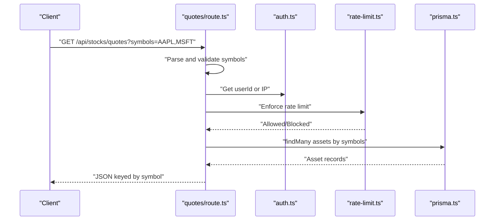

**Diagram sources**
- [quotes/route.ts:14-50](file://src/app/api/stocks/quotes/route.ts#L14-L50)

**Section sources**
- [quotes/route.ts:14-50](file://src/app/api/stocks/quotes/route.ts#L14-L50)

### Stock History
- Purpose: Retrieve historical OHLCV-like data for a symbol and range.
- Endpoint: GET /api/stocks/history
- Query parameters:
  - symbol: Required
  - range: One of "1d","5d","1mo","3mo","6mo","1y","5y"
- Response: Historical data array or object depending on provider
- Caching: Per-range TTLs; cache key includes symbol and range
- Notes: Validates parameters with schema and handles provider errors.

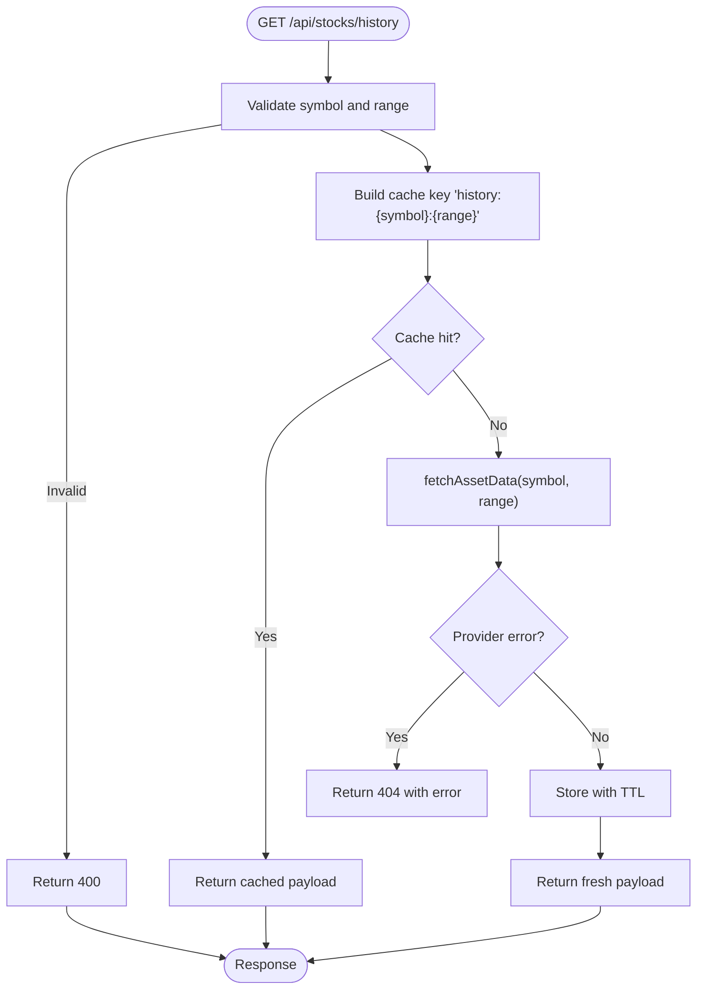

**Diagram sources**
- [history/route.ts:22-73](file://src/app/api/stocks/history/route.ts#L22-L73)
- [market-data.ts](file://src/lib/market-data.ts)

**Section sources**
- [history/route.ts:22-73](file://src/app/api/stocks/history/route.ts#L22-L73)

### Top Movers
- Purpose: Return top gainers and losers for a region with region-aware inclusion of crypto assets.
- Endpoint: GET /api/stocks/movers
- Query parameters:
  - region: "US" or "IN"
- Authentication and permissions:
  - Requires authenticated user
  - Enforces plan-region access policy
- Response fields:
  - topGainers[] and topLosers[] with symbol, name, price, changePercent, type
- Caching: 60 seconds TTL with region-specific cache key
- Notes: Includes crypto assets globally alongside the requested region.

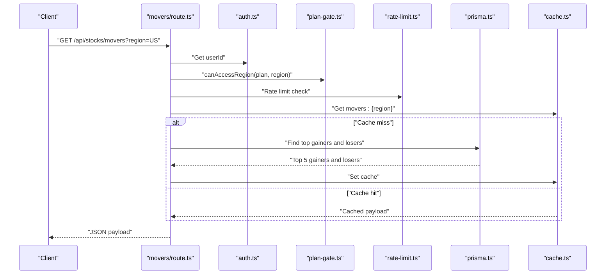

**Diagram sources**
- [movers/route.ts:18-87](file://src/app/api/stocks/movers/route.ts#L18-L87)

**Section sources**
- [movers/route.ts:18-87](file://src/app/api/stocks/movers/route.ts#L18-L87)

### Asset Comparison
- Purpose: Compare up to three assets with scores, signals, factor alignment, performance, valuation, and sector/industry metadata.
- Endpoint: GET /api/stocks/compare
- Query parameters:
  - symbols: comma-separated list (2–3 unique symbols)
- Authentication and permissions:
  - Requires authenticated user
  - Requires ELITE or ENTERPRISE plan
- Credits:
  - Consumes credits based on number of accessible assets
- Response fields:
  - symbols[], assets[]. Each asset includes metadata, prices, scores, signal strength, factor alignment, performance by horizon, valuation, sector, industry
- Notes: Validates symbols, checks plan access, consumes credits, and returns combined results.

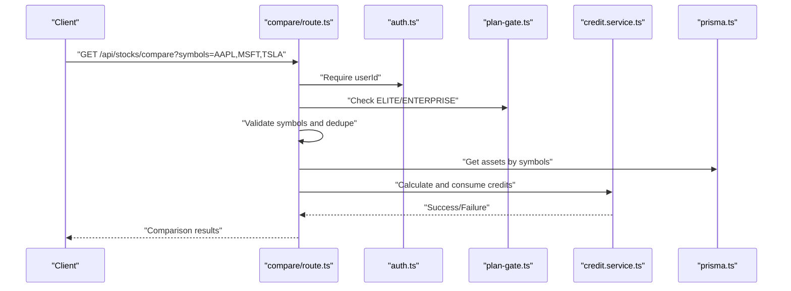

**Diagram sources**
- [compare/route.ts:15-123](file://src/app/api/stocks/compare/route.ts#L15-L123)

**Section sources**
- [compare/route.ts:15-123](file://src/app/api/stocks/compare/route.ts#L15-L123)

### Stress Test
- Purpose: Run scenario-based stress tests for assets with direct replay or proxy-based estimation.
- Endpoint: POST /api/stocks/stress-test
- Request body:
  - symbols: array of 1–3 symbols
  - scenarioId: supported scenario identifier
  - region: optional region override
- Authentication and permissions:
  - Requires authenticated user
  - Requires ELITE or ENTERPRISE plan
- Credits:
  - Consumes credits based on number of assets
- Response fields:
  - results[]. Each asset result includes drawdown, maxDrawdown, periodReturn, dailyPath, method, proxyUsed/beta/confidence, scenario details, and explanatory narrative
- Notes: Supports direct replay when sufficient historical data exists; otherwise uses proxy path with beta adjustments and confidence scaling.

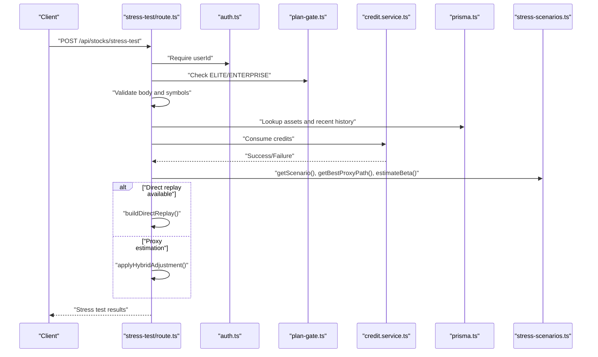

**Diagram sources**
- [stress-test/route.ts:238-485](file://src/app/api/stocks/stress-test/route.ts#L238-L485)
- [stress-scenarios.ts](file://src/lib/stress-scenarios.ts)

**Section sources**
- [stress-test/route.ts:238-485](file://src/app/api/stocks/stress-test/route.ts#L238-L485)

## Dependency Analysis
- Route handlers depend on:
  - Authentication and plan gating for premium endpoints
  - Rate limiting for public endpoints
  - Redis caching for performance
  - Prisma for data access
  - Domain libraries for transformations and calculations
- Premium endpoints (compare, factor-rotation, stress-test) additionally depend on:
  - Credit consumption services
  - Scenario definitions and proxy selection logic

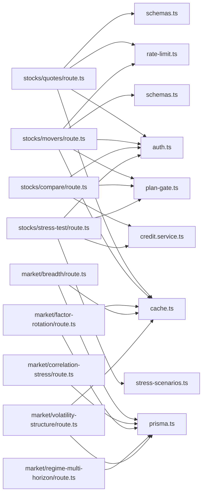

**Diagram sources**
- [quotes/route.ts:1-51](file://src/app/api/stocks/quotes/route.ts#L1-L51)
- [movers/route.ts:1-88](file://src/app/api/stocks/movers/route.ts#L1-L88)
- [compare/route.ts:1-124](file://src/app/api/stocks/compare/route.ts#L1-L124)
- [stress-test/route.ts:1-486](file://src/app/api/stocks/stress-test/route.ts#L1-L486)
- [breadth/route.ts:1-58](file://src/app/api/market/breadth/route.ts#L1-L58)
- [correlation-stress/route.ts:1-76](file://src/app/api/market/correlation-stress/route.ts#L1-L76)
- [factor-rotation/route.ts:1-133](file://src/app/api/market/factor-rotation/route.ts#L1-L133)
- [regime-multi-horizon/route.ts:1-77](file://src/app/api/market/regime-multi-horizon/route.ts#L1-L77)
- [volatility-structure/route.ts:1-64](file://src/app/api/market/volatility-structure/route.ts#L1-L64)
- [schemas.ts](file://src/lib/schemas.ts)
- [auth.ts](file://src/lib/auth.ts)
- [rate-limit.ts](file://src/lib/rate-limit.ts)
- [plan-gate.ts](file://src/lib/middleware/plan-gate.ts)
- [credit.service.ts](file://src/lib/services/credit.service.ts)
- [stress-scenarios.ts](file://src/lib/stress-scenarios.ts)
- [prisma.ts](file://src/lib/prisma.ts)
- [redis.ts](file://src/lib/cache.ts)

**Section sources**
- [quotes/route.ts:1-51](file://src/app/api/stocks/quotes/route.ts#L1-L51)
- [movers/route.ts:1-88](file://src/app/api/stocks/movers/route.ts#L1-L88)
- [compare/route.ts:1-124](file://src/app/api/stocks/compare/route.ts#L1-L124)
- [stress-test/route.ts:1-486](file://src/app/api/stocks/stress-test/route.ts#L1-L486)
- [breadth/route.ts:1-58](file://src/app/api/market/breadth/route.ts#L1-L58)
- [correlation-stress/route.ts:1-76](file://src/app/api/market/correlation-stress/route.ts#L1-L76)
- [factor-rotation/route.ts:1-133](file://src/app/api/market/factor-rotation/route.ts#L1-L133)
- [regime-multi-horizon/route.ts:1-77](file://src/app/api/market/regime-multi-horizon/route.ts#L1-L77)
- [volatility-structure/route.ts:1-64](file://src/app/api/market/volatility-structure/route.ts#L1-L64)

## Performance Considerations
- Caching:
  - Regionalized cache keys prevent cross-region contamination.
  - TTLs vary by data freshness: hourly for structural metrics, shorter for quotes and movers.
- Batch queries:
  - Market breadth and volatility structure use a single DB query to fetch required fields and compute counts in-memory.
  - Asset comparison performs a single multi-symbol lookup to avoid N round trips.
- Concurrency:
  - Movers endpoint uses concurrent queries for gainers and losers.
  - Stress test endpoint uses concurrent per-asset computations.
- Rate limiting:
  - Public endpoints enforce per-IP and per-user rate limits to protect downstream providers and DB.
- Real-time updates:
  - Quotes and history responses disable caching to reflect near-real-time data.
  - Other endpoints cache with appropriate TTLs to balance freshness and cost.

[No sources needed since this section provides general guidance]

## Troubleshooting Guide
- Common HTTP errors:
  - 400: Invalid parameters or request body (schema validation failures).
  - 401: Unauthorized access (authentication required).
  - 403: Forbidden access (plan or region restrictions).
  - 402: Payment required (insufficient credits).
  - 404: Not found (provider errors or missing assets).
  - 500: Internal server error (unhandled exceptions).
- Logging:
  - All endpoints log structured errors with sanitized stack traces.
- Error handling utilities:
  - Centralized error responses and status codes are returned consistently.

**Section sources**
- [quotes/route.ts:18-23](file://src/app/api/stocks/quotes/route.ts#L18-L23)
- [history/route.ts:32-37](file://src/app/api/stocks/history/route.ts#L32-L37)
- [movers/route.ts:21-23](file://src/app/api/stocks/movers/route.ts#L21-L23)
- [compare/route.ts:34-40](file://src/app/api/stocks/compare/route.ts#L34-L40)
- [stress-test/route.ts:254-257](file://src/app/api/stocks/stress-test/route.ts#L254-L257)
- [api-response.ts](file://src/lib/api-response.ts)
- [logger.ts](file://src/lib/logger.ts)

## Conclusion
The market data API suite provides comprehensive coverage for modern market analysis, combining real-time and historical data with advanced analytics such as regime multi-horizon modeling, factor rotation, and stress testing. Premium features are gated behind authentication and plan checks, while robust caching and rate limiting ensure scalability and reliability. The documented endpoints, parameters, and response formats enable efficient integration for applications requiring deep market insights.