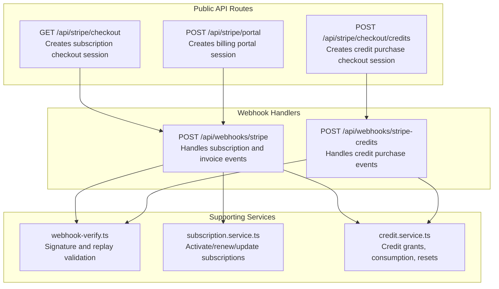
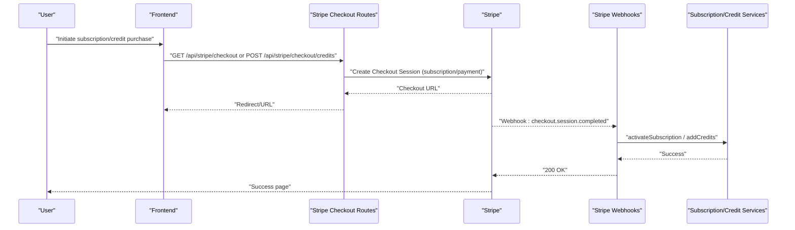
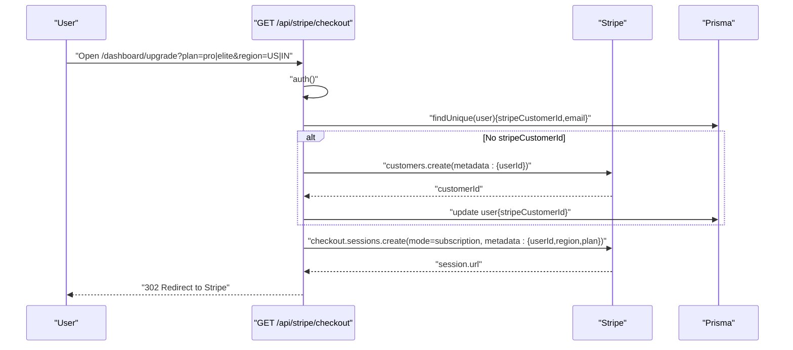
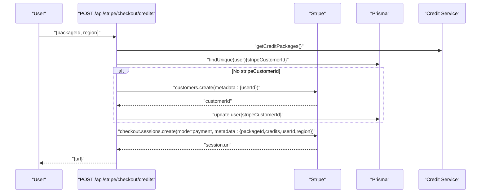
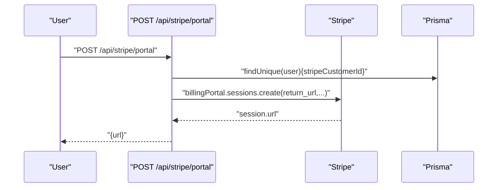
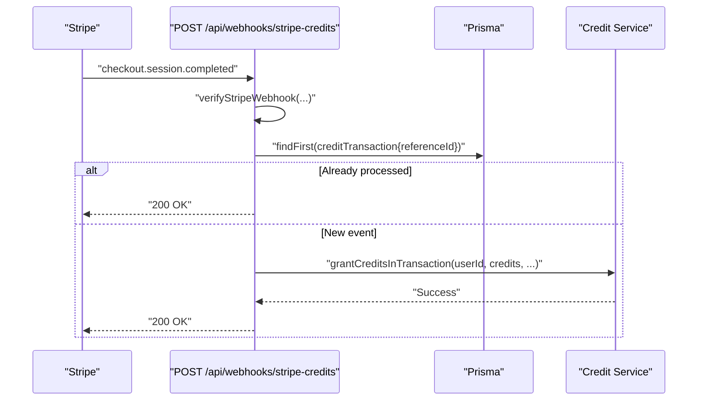
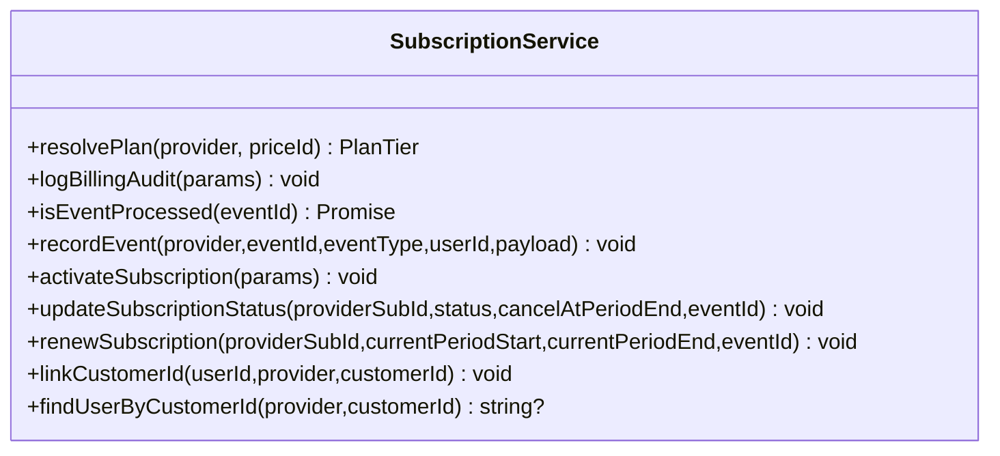
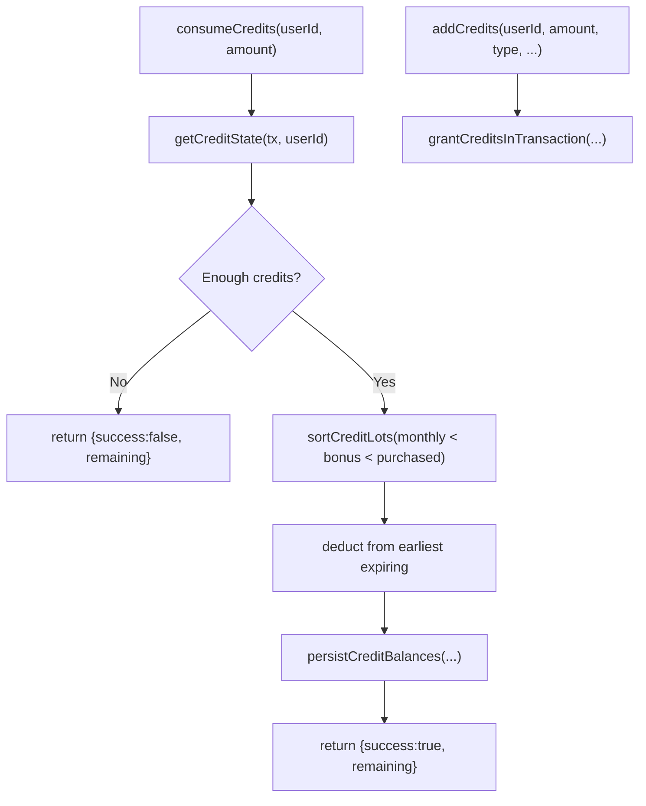
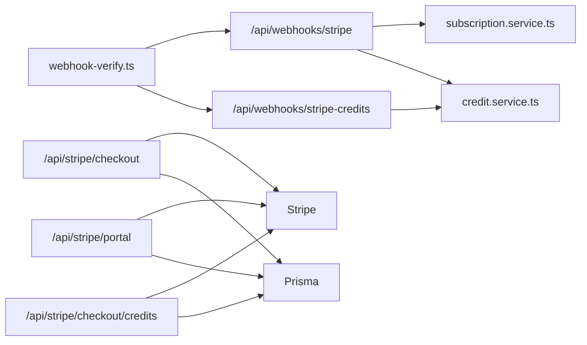

# Payment & Billing API

<cite>
**Referenced Files in This Document**
- [src/app/api/stripe/checkout/route.ts](file://src/app/api/stripe/checkout/route.ts)
- [src/app/api/stripe/checkout/credits/route.ts](file://src/app/api/stripe/checkout/credits/route.ts)
- [src/app/api/stripe/portal/route.ts](file://src/app/api/stripe/portal/route.ts)
- [src/app/api/webhooks/stripe/route.ts](file://src/app/api/webhooks/stripe/route.ts)
- [src/app/api/webhooks/stripe-credits/route.ts](file://src/app/api/webhooks/stripe-credits/route.ts)
- [src/lib/payments/webhook-verify.ts](file://src/lib/payments/webhook-verify.ts)
- [src/lib/payments/subscription.service.ts](file://src/lib/payments/subscription.service.ts)
- [src/lib/services/credit.service.ts](file://src/lib/services/credit.service.ts)
- [src/app/api/admin/billing/route.ts](file://src/app/api/admin/billing/route.ts)
</cite>

## Table of Contents
1. [Introduction](#introduction)
2. [Project Structure](#project-structure)
3. [Core Components](#core-components)
4. [Architecture Overview](#architecture-overview)
5. [Detailed Component Analysis](#detailed-component-analysis)
6. [Dependency Analysis](#dependency-analysis)
7. [Performance Considerations](#performance-considerations)
8. [Troubleshooting Guide](#troubleshooting-guide)
9. [Conclusion](#conclusion)
10. [Appendices](#appendices)

## Introduction
This document provides comprehensive API documentation for payment processing and billing endpoints. It covers Stripe checkout integration for subscriptions and credit purchases, customer portal access, webhook handling for payment events, subscription lifecycle management, invoice generation, credit top-up functionality, and robust failure handling. It also details webhook security, event validation, idempotency, retry mechanisms, and reconciliation processes, with practical examples for payment flows, subscription upgrades, and credit management operations.

## Project Structure
The payment and billing surface is organized under:
- Public Stripe checkout and portal routes
- Stripe webhook handlers for subscription and credit events
- Supporting services for subscription lifecycle and credit accounting
- Admin billing statistics endpoint

**Diagram sources**
- [src/app/api/stripe/checkout/route.ts:1-108](file://src/app/api/stripe/checkout/route.ts#L1-L108)
- [src/app/api/stripe/checkout/credits/route.ts:1-118](file://src/app/api/stripe/checkout/credits/route.ts#L1-L118)
- [src/app/api/stripe/portal/route.ts:1-48](file://src/app/api/stripe/portal/route.ts#L1-L48)
- [src/app/api/webhooks/stripe/route.ts:1-430](file://src/app/api/webhooks/stripe/route.ts#L1-L430)
- [src/app/api/webhooks/stripe-credits/route.ts:1-85](file://src/app/api/webhooks/stripe-credits/route.ts#L1-L85)
- [src/lib/payments/webhook-verify.ts:1-149](file://src/lib/payments/webhook-verify.ts#L1-L149)
- [src/lib/payments/subscription.service.ts:1-309](file://src/lib/payments/subscription.service.ts#L1-L309)
- [src/lib/services/credit.service.ts:1-455](file://src/lib/services/credit.service.ts#L1-L455)

**Section sources**
- [src/app/api/stripe/checkout/route.ts:1-108](file://src/app/api/stripe/checkout/route.ts#L1-L108)
- [src/app/api/stripe/checkout/credits/route.ts:1-118](file://src/app/api/stripe/checkout/credits/route.ts#L1-L118)
- [src/app/api/stripe/portal/route.ts:1-48](file://src/app/api/stripe/portal/route.ts#L1-L48)
- [src/app/api/webhooks/stripe/route.ts:1-430](file://src/app/api/webhooks/stripe/route.ts#L1-L430)
- [src/app/api/webhooks/stripe-credits/route.ts:1-85](file://src/app/api/webhooks/stripe-credits/route.ts#L1-L85)
- [src/lib/payments/webhook-verify.ts:1-149](file://src/lib/payments/webhook-verify.ts#L1-L149)
- [src/lib/payments/subscription.service.ts:1-309](file://src/lib/payments/subscription.service.ts#L1-L309)
- [src/lib/services/credit.service.ts:1-455](file://src/lib/services/credit.service.ts#L1-L455)

## Core Components
- Stripe checkout for subscriptions and credit purchases
- Stripe customer portal for managing billing
- Webhook handlers for subscription lifecycle and credit purchases
- Subscription service for idempotent provisioning and status transitions
- Credit service for granular credit accounting, expiration, and consumption
- Admin billing statistics endpoint

Key responsibilities:
- Enforce authentication and authorization for protected endpoints
- Create Stripe checkout sessions with proper metadata and URLs
- Validate webhook signatures and protect against replays
- Idempotently process events and reconcile state
- Fulfill credit purchases and manage credit expirations
- Provide admin visibility into billing metrics

**Section sources**
- [src/app/api/stripe/checkout/route.ts:1-108](file://src/app/api/stripe/checkout/route.ts#L1-L108)
- [src/app/api/stripe/checkout/credits/route.ts:1-118](file://src/app/api/stripe/checkout/credits/route.ts#L1-L118)
- [src/app/api/stripe/portal/route.ts:1-48](file://src/app/api/stripe/portal/route.ts#L1-L48)
- [src/app/api/webhooks/stripe/route.ts:1-430](file://src/app/api/webhooks/stripe/route.ts#L1-L430)
- [src/app/api/webhooks/stripe-credits/route.ts:1-85](file://src/app/api/webhooks/stripe-credits/route.ts#L1-L85)
- [src/lib/payments/subscription.service.ts:1-309](file://src/lib/payments/subscription.service.ts#L1-L309)
- [src/lib/services/credit.service.ts:1-455](file://src/lib/services/credit.service.ts#L1-L455)

## Architecture Overview
The system integrates Clerk-managed sessions with Stripe for payments and billing, and reconciles events through idempotent webhook handlers.

**Diagram sources**
- [src/app/api/stripe/checkout/route.ts:1-108](file://src/app/api/stripe/checkout/route.ts#L1-L108)
- [src/app/api/stripe/checkout/credits/route.ts:1-118](file://src/app/api/stripe/checkout/credits/route.ts#L1-L118)
- [src/app/api/webhooks/stripe/route.ts:1-430](file://src/app/api/webhooks/stripe/route.ts#L1-L430)
- [src/app/api/webhooks/stripe-credits/route.ts:1-85](file://src/app/api/webhooks/stripe-credits/route.ts#L1-L85)
- [src/lib/payments/subscription.service.ts:1-309](file://src/lib/payments/subscription.service.ts#L1-L309)
- [src/lib/services/credit.service.ts:1-455](file://src/lib/services/credit.service.ts#L1-L455)

## Detailed Component Analysis

### Stripe Checkout (Subscriptions)
- Purpose: Create Stripe Checkout sessions for Pro/Elite subscriptions with region-aware pricing.
- Authentication: Requires authenticated Clerk session; redirects unauthenticated users to sign-in.
- Behavior:
  - Resolves Clerk or DB user context to build customer metadata.
  - Creates a Stripe customer if missing and persists the ID.
  - Builds a subscription-mode checkout session with success/cancel URLs and metadata.
  - Redirects the user to Stripe-hosted checkout.

**Diagram sources**
- [src/app/api/stripe/checkout/route.ts:1-108](file://src/app/api/stripe/checkout/route.ts#L1-L108)

**Section sources**
- [src/app/api/stripe/checkout/route.ts:1-108](file://src/app/api/stripe/checkout/route.ts#L1-L108)

### Stripe Checkout (Credit Packages)
- Purpose: Create Stripe Checkout sessions for purchasing credit packages.
- Authentication: Requires authenticated Clerk session; returns 401 otherwise.
- Behavior:
  - Validates package existence and region selection.
  - Resolves Stripe customer or creates one and persists ID.
  - Builds a payment-mode checkout session with metadata including package details and total credits.
  - Returns the session URL for client-side redirect.

**Diagram sources**
- [src/app/api/stripe/checkout/credits/route.ts:1-118](file://src/app/api/stripe/checkout/credits/route.ts#L1-L118)
- [src/lib/services/credit.service.ts:444-455](file://src/lib/services/credit.service.ts#L444-L455)

**Section sources**
- [src/app/api/stripe/checkout/credits/route.ts:1-118](file://src/app/api/stripe/checkout/credits/route.ts#L1-L118)
- [src/lib/services/credit.service.ts:444-455](file://src/lib/services/credit.service.ts#L444-L455)

### Stripe Customer Portal
- Purpose: Generate a billing portal session for customers to manage subscriptions and payment methods.
- Authentication: Requires authenticated Clerk session; returns 401 if missing.
- Behavior:
  - Retrieves the user’s Stripe customer ID from the database.
  - Creates a billing portal session with a return URL.
  - Returns the session URL for client-side redirect.

**Diagram sources**
- [src/app/api/stripe/portal/route.ts:1-48](file://src/app/api/stripe/portal/route.ts#L1-L48)

**Section sources**
- [src/app/api/stripe/portal/route.ts:1-48](file://src/app/api/stripe/portal/route.ts#L1-L48)

### Stripe Webhooks (Subscriptions)
- Purpose: Handle subscription lifecycle events and reconcile state.
- Security:
  - Verifies webhook signature and timestamp to prevent replays.
  - Uses idempotency to skip already-processed events.
- Event handling:
  - checkout.session.completed: Activate subscription; link customer; optionally fulfill credit purchase metadata.
  - invoice.paid: Provision subscription for renewals.
  - invoice.payment_failed: Mark subscription as past_due.
  - customer.subscription.*: Activate/update/delete/cancel; handle cancelAtPeriodEnd flag.
  - invoice.payment_succeeded: Renewal tracking (fallback).
  - charge.refunded: Claw back credits and log audit.
  - charge.dispute.created: Log audit requiring action.

```mermaid
flowchart TD
Start(["Webhook Received"]) --> Verify["Verify Signature + Timestamp"]
Verify --> Valid{"Valid?"}
Valid --> |No| Reject["Return 400"]
Valid --> |Yes| Parse["Parse and Validate Payload"]
Parse --> Idempotent["Check isEventProcessed(eventId)"]
Idempotent --> Duplicate{"Already Processed?"}
Duplicate --> |Yes| Skip["Return {received:true,duplicate:true}"]
Duplicate --> |No| Switch["Switch on event.type"]
Switch --> CSCompleted["checkout.session.completed"]
Switch --> InvoicePaid["invoice.paid"]
Switch --> InvoiceFailed["invoice.payment_failed"]
Switch --> SubCreatedUpdated["customer.subscription.*"]
Switch --> InvoiceSucceeded["invoice.payment_succeeded"]
Switch --> ChargeRefunded["charge.refunded"]
Switch --> Dispute["charge.dispute.created"]
CSCompleted --> Fulfill["activateSubscription / addCredits"]
InvoicePaid --> Renew["activateSubscription"]
InvoiceFailed --> PastDue["updateSubscriptionStatus(PAST_DUE)"]
SubCreatedUpdated --> Status["updateSubscriptionStatus(...)"]
InvoiceSucceeded --> Renew
ChargeRefunded --> Refund["Claw back credits + audit"]
Dispute --> Audit["Log audit (DISPUTED)"]
Fulfill --> Record["recordEvent(...)"]
Renew --> Record
PastDue --> Record
Status --> Record
Refund --> Record
Audit --> Record
Record --> Done(["Return {received:true}"])
```

**Diagram sources**
- [src/app/api/webhooks/stripe/route.ts:1-430](file://src/app/api/webhooks/stripe/route.ts#L1-L430)
- [src/lib/payments/webhook-verify.ts:1-149](file://src/lib/payments/webhook-verify.ts#L1-L149)
- [src/lib/payments/subscription.service.ts:66-84](file://src/lib/payments/subscription.service.ts#L66-L84)
- [src/lib/services/credit.service.ts:387-397](file://src/lib/services/credit.service.ts#L387-L397)

**Section sources**
- [src/app/api/webhooks/stripe/route.ts:1-430](file://src/app/api/webhooks/stripe/route.ts#L1-L430)
- [src/lib/payments/webhook-verify.ts:1-149](file://src/lib/payments/webhook-verify.ts#L1-L149)
- [src/lib/payments/subscription.service.ts:66-84](file://src/lib/payments/subscription.service.ts#L66-L84)

### Stripe Webhooks (Credit Purchases)
- Purpose: Handle credit purchase events from Stripe checkout sessions.
- Security:
  - Verifies webhook signature and timestamp.
- Behavior:
  - On checkout.session.completed, validates metadata presence and numeric credit amount.
  - Checks idempotency using referenceId (checkout session id).
  - Grants credits atomically within a Prisma transaction.

**Diagram sources**
- [src/app/api/webhooks/stripe-credits/route.ts:1-85](file://src/app/api/webhooks/stripe-credits/route.ts#L1-L85)
- [src/lib/services/credit.service.ts:262-283](file://src/lib/services/credit.service.ts#L262-L283)

**Section sources**
- [src/app/api/webhooks/stripe-credits/route.ts:1-85](file://src/app/api/webhooks/stripe-credits/route.ts#L1-L85)
- [src/lib/services/credit.service.ts:262-283](file://src/lib/services/credit.service.ts#L262-L283)

### Subscription Management
- Activation: Upsert user and subscription records; reset monthly credits; invalidate plan cache.
- Status Updates: Idempotent updates for active/trial/past_due/canceled/incomplete; handle cancelAtPeriodEnd.
- Renewal: Update period dates for recurring charges.
- Audit: Comprehensive audit logs for state changes and refund/dispute actions.

**Diagram sources**
- [src/lib/payments/subscription.service.ts:1-309](file://src/lib/payments/subscription.service.ts#L1-L309)

**Section sources**
- [src/lib/payments/subscription.service.ts:1-309](file://src/lib/payments/subscription.service.ts#L1-L309)

### Credit Top-Up and Consumption
- Credit packages: Cached lookup of active packages; region-aware pricing.
- Granting credits: Transactional creation of credit transactions and lots with expiration buckets.
- Consumption: Ordered deduction across monthly/bonus/purchased buckets respecting expiry.
- Resets: Monthly credits reset aligned to plan tier at month boundary.
- Expiration: Different TTLs per bucket type; snapshot exposes next expiry timestamps.

**Diagram sources**
- [src/lib/services/credit.service.ts:332-385](file://src/lib/services/credit.service.ts#L332-L385)
- [src/lib/services/credit.service.ts:387-397](file://src/lib/services/credit.service.ts#L387-L397)
- [src/lib/services/credit.service.ts:444-455](file://src/lib/services/credit.service.ts#L444-L455)

**Section sources**
- [src/lib/services/credit.service.ts:1-455](file://src/lib/services/credit.service.ts#L1-L455)

### Admin Billing Statistics
- Endpoint: GET /api/admin/billing
- Access: Requires admin guard
- Behavior: Returns billing metrics with short-lived caching headers

**Section sources**
- [src/app/api/admin/billing/route.ts:1-24](file://src/app/api/admin/billing/route.ts#L1-L24)

## Dependency Analysis
- Webhook verification depends on cryptographic HMAC and timing-safe comparison.
- Subscription service coordinates with Prisma for user and subscription upserts.
- Credit service manages granular credit accounting with Prisma transactions and Redis-backed package caching.
- Stripe checkout routes depend on Clerk for identity and Prisma for customer linking.

**Diagram sources**
- [src/lib/payments/webhook-verify.ts:1-149](file://src/lib/payments/webhook-verify.ts#L1-L149)
- [src/app/api/webhooks/stripe/route.ts:1-430](file://src/app/api/webhooks/stripe/route.ts#L1-L430)
- [src/app/api/webhooks/stripe-credits/route.ts:1-85](file://src/app/api/webhooks/stripe-credits/route.ts#L1-L85)
- [src/lib/payments/subscription.service.ts:1-309](file://src/lib/payments/subscription.service.ts#L1-L309)
- [src/lib/services/credit.service.ts:1-455](file://src/lib/services/credit.service.ts#L1-L455)
- [src/app/api/stripe/checkout/route.ts:1-108](file://src/app/api/stripe/checkout/route.ts#L1-L108)
- [src/app/api/stripe/checkout/credits/route.ts:1-118](file://src/app/api/stripe/checkout/credits/route.ts#L1-L118)
- [src/app/api/stripe/portal/route.ts:1-48](file://src/app/api/stripe/portal/route.ts#L1-L48)

**Section sources**
- [src/lib/payments/webhook-verify.ts:1-149](file://src/lib/payments/webhook-verify.ts#L1-L149)
- [src/lib/payments/subscription.service.ts:1-309](file://src/lib/payments/subscription.service.ts#L1-L309)
- [src/lib/services/credit.service.ts:1-455](file://src/lib/services/credit.service.ts#L1-L455)

## Performance Considerations
- Idempotency: Events are checked before processing to avoid duplicate work.
- Batch operations: Parallelize independent lookups (e.g., user resolution and status updates).
- Minimal DB writes: Use upserts and selective updates; persist aggregated balances efficiently.
- Caching: Credit packages are cached to reduce DB load.
- Transactions: Use Prisma transactions for atomic credit grants and consumption to maintain consistency.

## Troubleshooting Guide
Common issues and resolutions:
- Missing Stripe-Signature header or invalid signature:
  - Verify webhook secret configuration and signature parsing.
  - Check timestamp age and reject old events.
- checkout.session.completed without customer ID linkage:
  - Ensure customer is created and user.stripeCustomerId is persisted before webhook arrival.
- Duplicate credit grants:
  - Confirm idempotency checks using referenceId and creditTransaction uniqueness.
- Subscription status not updating:
  - Validate event types and ensure subscription exists before updates.
- Refunds and disputes:
  - Confirm audit logging and appropriate state transitions.

Operational checks:
- Verify webhook verification and replay protection.
- Confirm event recording and idempotency.
- Monitor audit logs for state transitions and exceptions.

**Section sources**
- [src/lib/payments/webhook-verify.ts:1-149](file://src/lib/payments/webhook-verify.ts#L1-L149)
- [src/app/api/webhooks/stripe/route.ts:123-156](file://src/app/api/webhooks/stripe/route.ts#L123-L156)
- [src/app/api/webhooks/stripe-credits/route.ts:55-63](file://src/app/api/webhooks/stripe-credits/route.ts#L55-L63)
- [src/lib/payments/subscription.service.ts:66-84](file://src/lib/payments/subscription.service.ts#L66-L84)

## Conclusion
The payment and billing system integrates Stripe checkout and customer portal with robust webhook-driven reconciliation. It ensures secure, idempotent, and resilient handling of subscription and credit events, while maintaining accurate credit accounting and clear audit trails. Administrators benefit from real-time billing insights, and users enjoy seamless upgrade and credit top-up experiences.

## Appendices

### API Reference Summary

- GET /api/stripe/checkout
  - Purpose: Create a subscription checkout session for Pro/Elite plans.
  - Query params: plan (pro|elite), region (US|IN).
  - Returns: 302 redirect to Stripe checkout URL.
  - Security: Requires authenticated Clerk session.

- POST /api/stripe/checkout/credits
  - Purpose: Create a credit purchase checkout session.
  - Body: { packageId, region }.
  - Returns: { url } with Stripe checkout URL.
  - Security: Requires authenticated Clerk session.

- POST /api/stripe/portal
  - Purpose: Create a billing portal session for customer management.
  - Returns: { url } with portal URL.
  - Security: Requires authenticated Clerk session.

- POST /api/webhooks/stripe
  - Purpose: Handle subscription and invoice events.
  - Headers: stripe-signature.
  - Body: Stripe event payload.
  - Returns: { received: true } or duplicate indicator.

- POST /api/webhooks/stripe-credits
  - Purpose: Handle credit purchase events.
  - Headers: stripe-signature.
  - Body: Stripe event payload.
  - Returns: { received: true }.

- GET /api/admin/billing
  - Purpose: Fetch billing statistics.
  - Security: Requires admin guard.
  - Returns: Billing metrics with caching headers.

**Section sources**
- [src/app/api/stripe/checkout/route.ts:1-108](file://src/app/api/stripe/checkout/route.ts#L1-L108)
- [src/app/api/stripe/checkout/credits/route.ts:1-118](file://src/app/api/stripe/checkout/credits/route.ts#L1-L118)
- [src/app/api/stripe/portal/route.ts:1-48](file://src/app/api/stripe/portal/route.ts#L1-L48)
- [src/app/api/webhooks/stripe/route.ts:1-430](file://src/app/api/webhooks/stripe/route.ts#L1-L430)
- [src/app/api/webhooks/stripe-credits/route.ts:1-85](file://src/app/api/webhooks/stripe-credits/route.ts#L1-L85)
- [src/app/api/admin/billing/route.ts:1-24](file://src/app/api/admin/billing/route.ts#L1-L24)