# Portfolio API

<cite>
**Referenced Files in This Document**
- [route.ts](file://src/app/api/portfolio/route.ts)
- [[id]/route.ts](file://src/app/api/portfolio/[id]/route.ts)
- [[id]/holdings/route.ts](file://src/app/api/portfolio/[id]/holdings/route.ts)
- [[id]/analytics/route.ts](file://src/app/api/portfolio/[id]/analytics/route.ts)
- [[id]/health/route.ts](file://src/app/api/portfolio/[id]/health/route.ts)
- [[id]/decision-memo/route.ts](file://src/app/api/portfolio/[id]/decision-memo/route.ts)
- [asset-search/route.ts](file://src/app/api/portfolio/asset-search/route.ts)
- [schemas.ts](file://src/lib/schemas.ts)
- [portfolio.service.ts](file://src/lib/services/portfolio.service.ts)
- [portfolio-e2e.spec.ts](file://e2e/portfolio-e2e.spec.ts)
</cite>

## Table of Contents
1. [Introduction](#introduction)
2. [Project Structure](#project-structure)
3. [Core Components](#core-components)
4. [Architecture Overview](#architecture-overview)
5. [Detailed Component Analysis](#detailed-component-analysis)
6. [Dependency Analysis](#dependency-analysis)
7. [Performance Considerations](#performance-considerations)
8. [Troubleshooting Guide](#troubleshooting-guide)
9. [Conclusion](#conclusion)
10. [Appendices](#appendices)

## Introduction
This document provides comprehensive API documentation for portfolio management endpoints. It covers portfolio CRUD operations, holdings management, analytics, health metrics, decision memo generation, asset search, and broker integration schemas. The documentation includes request/response schemas, examples, and operational details derived from the repository’s API routes and supporting libraries.

## Project Structure
The portfolio API surface is organized under the Next.js App Router at `/api/portfolio`. Key endpoints include:
- List/create portfolios
- Retrieve/update/delete a specific portfolio
- Manage holdings within a portfolio
- Compute analytics and health metrics
- Generate decision memos
- Asset search
- Broker integration schemas

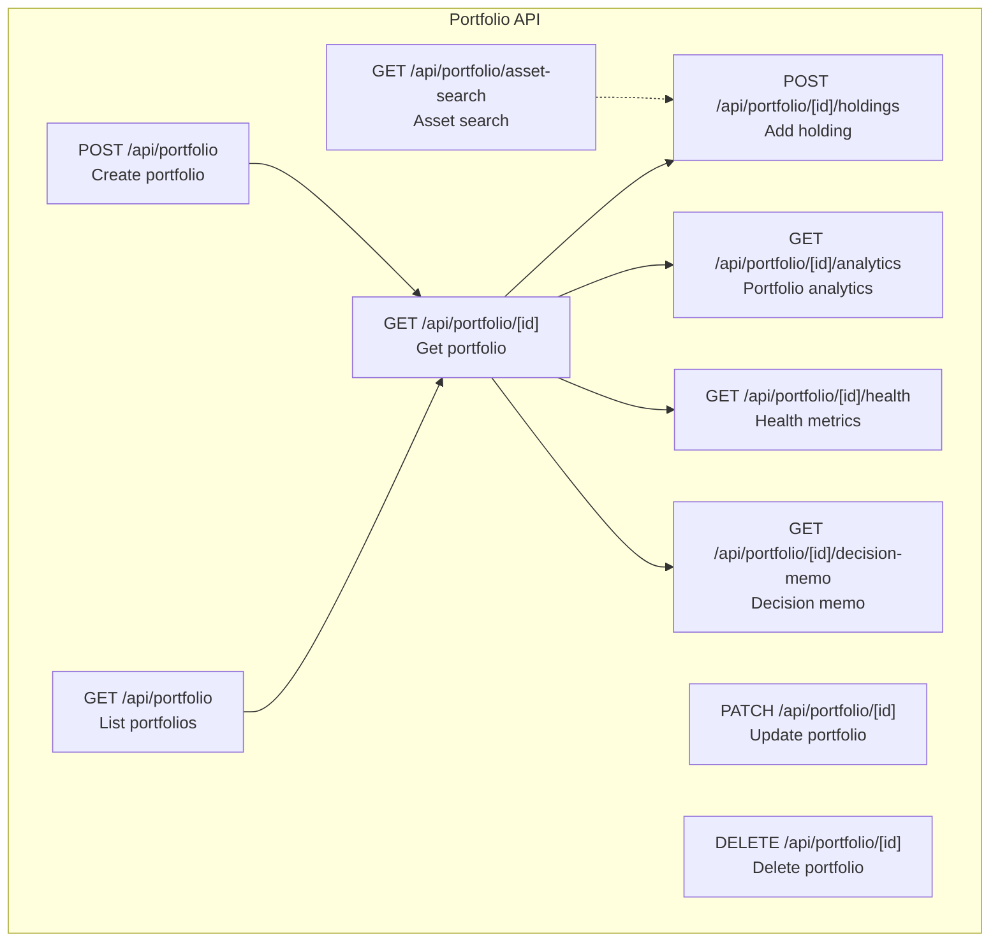

**Diagram sources**
- [route.ts:17-52](file://src/app/api/portfolio/route.ts#L17-L52)
- [[id]/route.ts](file://src/app/api/portfolio/[id]/route.ts#L15-L142)
- [[id]/holdings/route.ts](file://src/app/api/portfolio/[id]/holdings/route.ts#L22-L121)
- [[id]/analytics/route.ts](file://src/app/api/portfolio/[id]/analytics/route.ts#L20-L82)
- [[id]/health/route.ts](file://src/app/api/portfolio/[id]/health/route.ts#L17-L76)
- [[id]/decision-memo/route.ts](file://src/app/api/portfolio/[id]/decision-memo/route.ts#L61-L221)
- [asset-search/route.ts:13-76](file://src/app/api/portfolio/asset-search/route.ts#L13-L76)

**Section sources**
- [route.ts:1-102](file://src/app/api/portfolio/route.ts#L1-L102)
- [[id]/route.ts](file://src/app/api/portfolio/[id]/route.ts#L1-L142)
- [[id]/holdings/route.ts](file://src/app/api/portfolio/[id]/holdings/route.ts#L1-L121)
- [[id]/analytics/route.ts](file://src/app/api/portfolio/[id]/analytics/route.ts#L1-L82)
- [[id]/health/route.ts](file://src/app/api/portfolio/[id]/health/route.ts#L1-L76)
- [[id]/decision-memo/route.ts](file://src/app/api/portfolio/[id]/decision-memo/route.ts#L1-L221)
- [asset-search/route.ts:1-76](file://src/app/api/portfolio/asset-search/route.ts#L1-L76)

## Core Components
- Portfolio CRUD: Create, list, update, delete portfolios with region and currency constraints.
- Holdings Management: Add holdings with symbol normalization, region checks, and plan-based limits.
- Analytics: Portfolio analytics with caching and plan gating.
- Health Metrics: Real-time and refreshed health snapshots with caching and recomputation.
- Decision Memo: AI-generated decision memo with fallback logic and rate limiting.
- Asset Search: Cached asset search by symbol/name with region scoping.
- Broker Integration: Extensive schemas for broker integrations, normalization, and deduplication.

**Section sources**
- [route.ts:54-101](file://src/app/api/portfolio/route.ts#L54-L101)
- [[id]/holdings/route.ts](file://src/app/api/portfolio/[id]/holdings/route.ts#L22-L121)
- [[id]/analytics/route.ts](file://src/app/api/portfolio/[id]/analytics/route.ts#L20-L82)
- [[id]/health/route.ts](file://src/app/api/portfolio/[id]/health/route.ts#L17-L76)
- [[id]/decision-memo/route.ts](file://src/app/api/portfolio/[id]/decision-memo/route.ts#L61-L221)
- [asset-search/route.ts:13-76](file://src/app/api/portfolio/asset-search/route.ts#L13-L76)
- [schemas.ts:248-526](file://src/lib/schemas.ts#L248-L526)

## Architecture Overview
The portfolio API orchestrates data access via Prisma, enforces authentication and plan limits, computes portfolio intelligence offloaded to a service layer, and caches results for performance. Broker integration schemas define a normalized interface for third-party platforms.

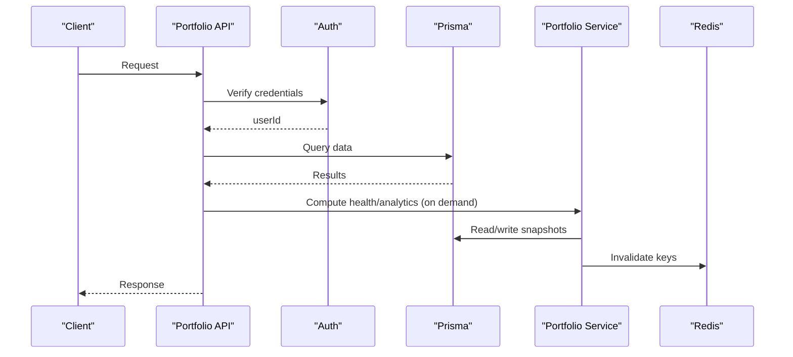

**Diagram sources**
- [route.ts:17-52](file://src/app/api/portfolio/route.ts#L17-L52)
- [[id]/holdings/route.ts](file://src/app/api/portfolio/[id]/holdings/route.ts#L32-L121)
- [[id]/analytics/route.ts](file://src/app/api/portfolio/[id]/analytics/route.ts#L48-L82)
- [[id]/health/route.ts](file://src/app/api/portfolio/[id]/health/route.ts#L38-L76)
- [portfolio.service.ts:169-318](file://src/lib/services/portfolio.service.ts#L169-L318)

## Detailed Component Analysis

### Portfolio CRUD Endpoints
- Base path: `/api/portfolio`
- Methods:
  - GET: List portfolios for the authenticated user, optionally filtered by region. Includes counts and latest health snapshot metadata.
  - POST: Create a new portfolio with name, description, currency, and region. Enforces plan-based portfolio count limits and uniqueness constraints.

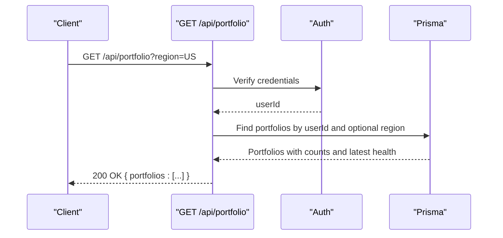

**Diagram sources**
- [route.ts:17-52](file://src/app/api/portfolio/route.ts#L17-L52)

**Section sources**
- [route.ts:17-52](file://src/app/api/portfolio/route.ts#L17-L52)
- [schemas.ts:215-247](file://src/lib/schemas.ts#L215-L247)

### Portfolio CRUD Endpoints
- Path: `/api/portfolio/[id]`
- Methods:
  - GET: Retrieve a portfolio by ID with holdings and latest health snapshot.
  - PATCH: Update portfolio name/description.
  - DELETE: Remove a portfolio.

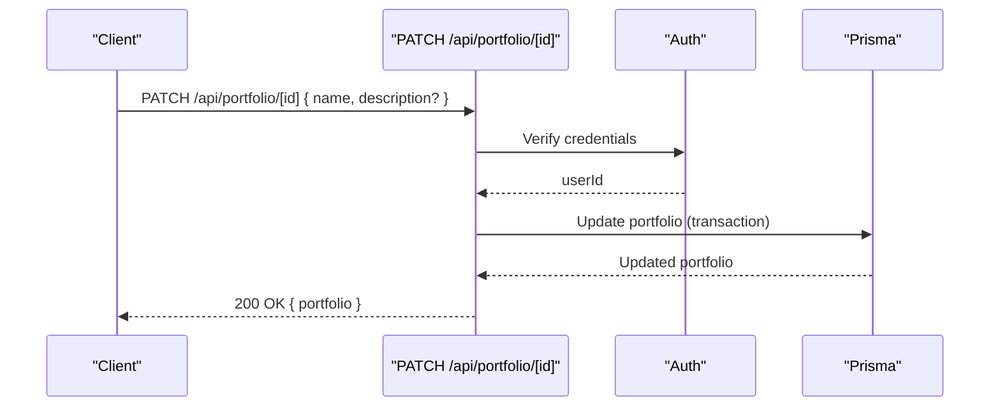

**Diagram sources**
- [[id]/route.ts](file://src/app/api/portfolio/[id]/route.ts#L73-L110)

**Section sources**
- [[id]/route.ts](file://src/app/api/portfolio/[id]/route.ts#L15-L142)
- [schemas.ts:222-225](file://src/lib/schemas.ts#L222-L225)

### Holdings Management
- Path: `/api/portfolio/[id]/holdings`
- POST: Add or update a holding. Performs:
  - Symbol normalization and asset lookup
  - Region validation (global assets allowed across regions)
  - Plan-based holdings limit enforcement
  - Upsert holding with computed currency and price fields
  - Triggers health recomputation and cache invalidation

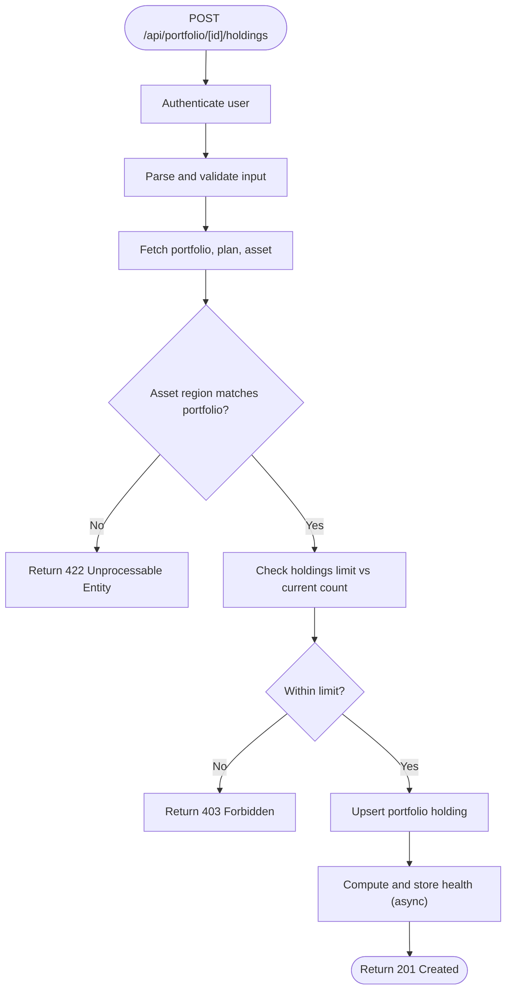

**Diagram sources**
- [[id]/holdings/route.ts](file://src/app/api/portfolio/[id]/holdings/route.ts#L22-L121)

**Section sources**
- [[id]/holdings/route.ts](file://src/app/api/portfolio/[id]/holdings/route.ts#L22-L121)
- [schemas.ts:227-236](file://src/lib/schemas.ts#L227-L236)

### Analytics Endpoint
- Path: `/api/portfolio/[id]/analytics`
- GET: Returns latest health snapshot fields (scores, risk metrics, regime) with caching and plan gating. Starter users receive a gated response.

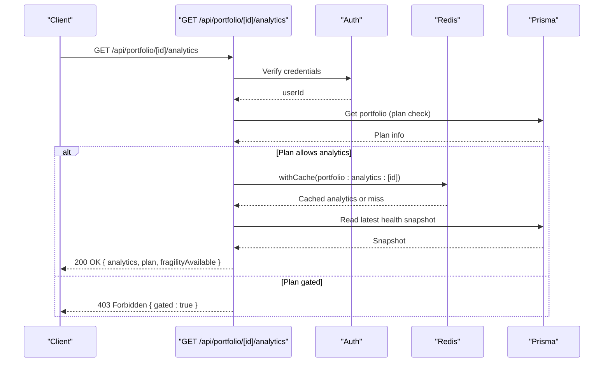

**Diagram sources**
- [[id]/analytics/route.ts](file://src/app/api/portfolio/[id]/analytics/route.ts#L20-L82)

**Section sources**
- [[id]/analytics/route.ts](file://src/app/api/portfolio/[id]/analytics/route.ts#L20-L82)

### Health Metrics Endpoint
- Path: `/api/portfolio/[id]/health`
- GET: Returns latest health snapshot with caching. Supports forced refresh by deleting cache and recomputing.

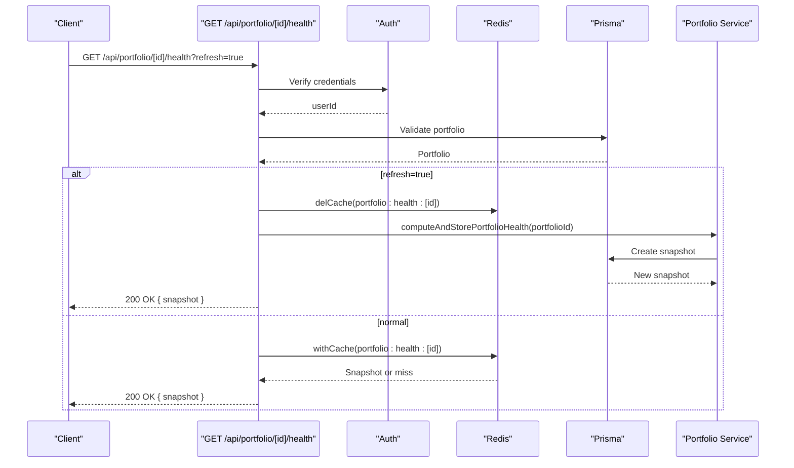

**Diagram sources**
- [[id]/health/route.ts](file://src/app/api/portfolio/[id]/health/route.ts#L17-L76)
- [portfolio.service.ts:169-318](file://src/lib/services/portfolio.service.ts#L169-L318)

**Section sources**
- [[id]/health/route.ts](file://src/app/api/portfolio/[id]/health/route.ts#L17-L76)
- [portfolio.service.ts:169-318](file://src/lib/services/portfolio.service.ts#L169-L318)

### Decision Memo Endpoint
- Path: `/api/portfolio/[id]/decision-memo`
- GET: Generates a concise decision memo using AI with fallback logic, rate limiting, and caching keyed by portfolio state and daily briefing.

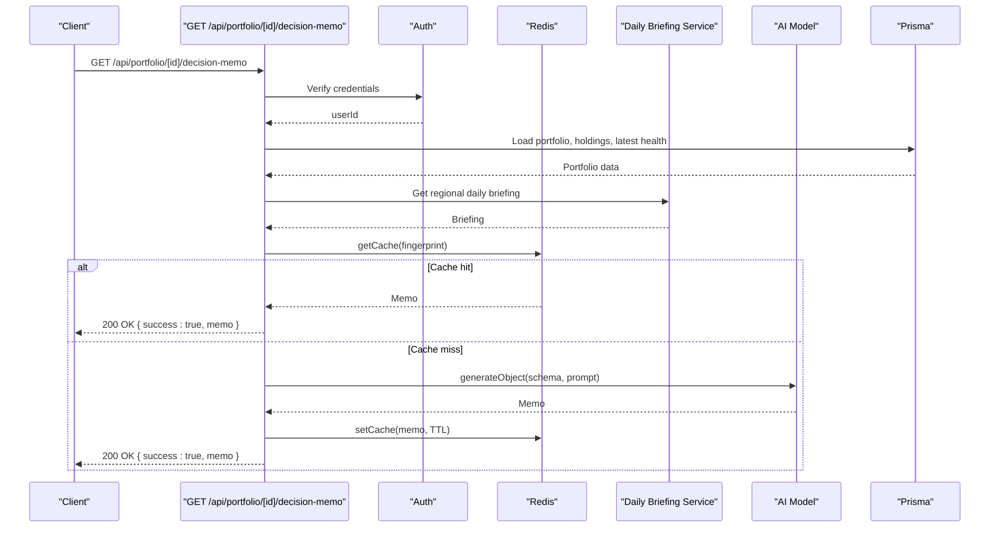

**Diagram sources**
- [[id]/decision-memo/route.ts](file://src/app/api/portfolio/[id]/decision-memo/route.ts#L61-L221)

**Section sources**
- [[id]/decision-memo/route.ts](file://src/app/api/portfolio/[id]/decision-memo/route.ts#L61-L221)

### Asset Search Endpoint
- Path: `/api/portfolio/asset-search`
- GET: Searches assets by symbol or name with region scoping and caching.

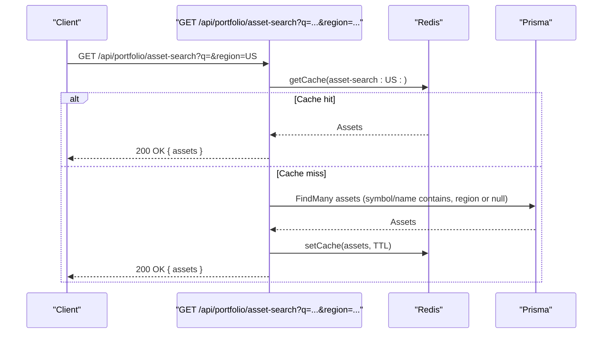

**Diagram sources**
- [asset-search/route.ts:13-76](file://src/app/api/portfolio/asset-search/route.ts#L13-L76)

**Section sources**
- [asset-search/route.ts:13-76](file://src/app/api/portfolio/asset-search/route.ts#L13-L76)

### Broker Integration Schemas
Extensive schemas define broker integration matrices, normalized holdings/positions/transactions, deduplication results, and field mappings for consistent ingestion across providers.

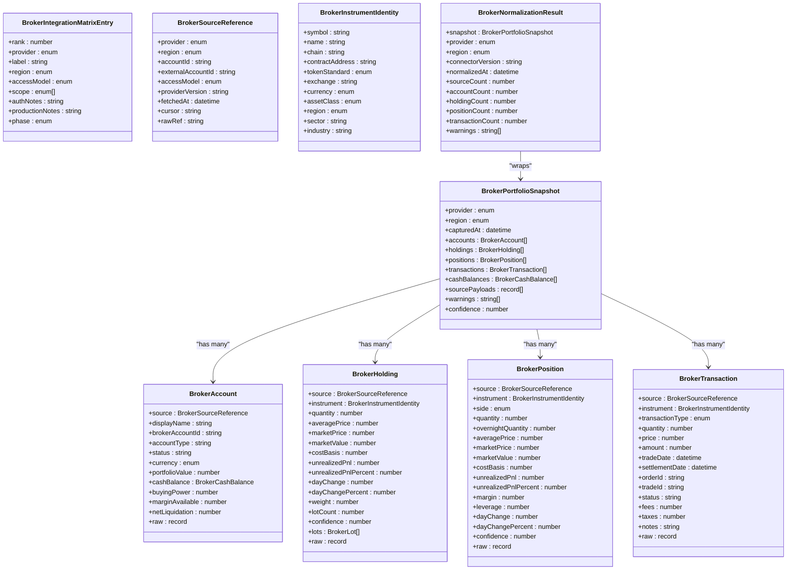

**Diagram sources**
- [schemas.ts:248-526](file://src/lib/schemas.ts#L248-L526)

**Section sources**
- [schemas.ts:248-526](file://src/lib/schemas.ts#L248-L526)

## Dependency Analysis
- Authentication: All endpoints require a valid user session.
- Authorization: Endpoints filter resources by userId to prevent cross-user access.
- Data Access: Prisma client handles reads/writes with transactions for atomicity.
- Caching: Redis caches are used for analytics, health snapshots, and asset search to reduce latency and load.
- Intelligence Engines: Health computation and risk metrics are computed by a dedicated service layer and persisted as snapshots.

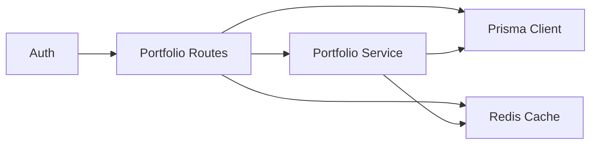

**Diagram sources**
- [route.ts:17-52](file://src/app/api/portfolio/route.ts#L17-L52)
- [[id]/holdings/route.ts](file://src/app/api/portfolio/[id]/holdings/route.ts#L32-L121)
- [[id]/analytics/route.ts](file://src/app/api/portfolio/[id]/analytics/route.ts#L48-L82)
- [[id]/health/route.ts](file://src/app/api/portfolio/[id]/health/route.ts#L38-L76)
- [portfolio.service.ts:169-318](file://src/lib/services/portfolio.service.ts#L169-L318)

**Section sources**
- [route.ts:17-52](file://src/app/api/portfolio/route.ts#L17-L52)
- [[id]/holdings/route.ts](file://src/app/api/portfolio/[id]/holdings/route.ts#L32-L121)
- [[id]/analytics/route.ts](file://src/app/api/portfolio/[id]/analytics/route.ts#L48-L82)
- [[id]/health/route.ts](file://src/app/api/portfolio/[id]/health/route.ts#L38-L76)
- [portfolio.service.ts:169-318](file://src/lib/services/portfolio.service.ts#L169-L318)

## Performance Considerations
- Caching: Analytics and health endpoints use short TTLs to balance freshness and performance.
- Batch Computation: Health recomputation supports batch processing to scale across portfolios.
- Concurrency: Health computation batches use controlled concurrency to avoid overload.
- Indexing: Prisma queries leverage selective includes and ordering to minimize overhead.

[No sources needed since this section provides general guidance]

## Troubleshooting Guide
Common issues and resolutions:
- Unauthorized: Ensure a valid session is present; endpoints return 401 when missing.
- Portfolio not found: Verify the portfolio ID belongs to the authenticated user; returns 404 otherwise.
- Region mismatch: Adding a holding fails if the asset’s region differs from the portfolio’s region (unless asset region is null/global).
- Limits exceeded: Plan-based limits restrict portfolio count and holdings per portfolio; returns 403 with limit details.
- Asset not found: Asset search/add holding requires the asset to exist in the universe.
- Health recomputation failures: Non-fatal failures are logged and do not block requests; use refresh to trigger recomputation.

**Section sources**
- [route.ts:19-21](file://src/app/api/portfolio/route.ts#L19-L21)
- [[id]/holdings/route.ts](file://src/app/api/portfolio/[id]/holdings/route.ts#L55-L68)
- [[id]/health/route.ts](file://src/app/api/portfolio/[id]/health/route.ts#L34-L36)
- [[id]/decision-memo/route.ts](file://src/app/api/portfolio/[id]/decision-memo/route.ts#L78-L80)

## Conclusion
The portfolio API provides a robust, authenticated, and scalable foundation for managing portfolios, holdings, analytics, and health metrics. It integrates with caching and a service layer to deliver timely insights and supports plan-based gating and region-aware constraints. Broker integration schemas enable consistent ingestion from multiple providers.

[No sources needed since this section summarizes without analyzing specific files]

## Appendices

### API Definitions and Examples

- List Portfolios
  - Method: GET
  - Path: `/api/portfolio`
  - Query parameters:
    - region: Optional region filter (US or IN)
  - Example request:
    - GET /api/portfolio?region=US
  - Example response:
    - 200 OK with an object containing a portfolios array

- Create Portfolio
  - Method: POST
  - Path: `/api/portfolio`
  - Request body:
    - name: Required string (1–100 chars)
    - description: Optional string (≤500 chars)
    - currency: Enum USD or INR
    - region: Enum US or IN
  - Example request:
    - POST /api/portfolio with JSON body
  - Example response:
    - 201 Created with portfolio object

- Get Portfolio
  - Method: GET
  - Path: `/api/portfolio/[id]`
  - Example request:
    - GET /api/portfolio/:id
  - Example response:
    - 200 OK with portfolio object including holdings and health snapshot

- Update Portfolio
  - Method: PATCH
  - Path: `/api/portfolio/[id]`
  - Request body:
    - name: Optional string (1–100 chars)
    - description: Optional string (≤500 chars)
  - Example request:
    - PATCH /api/portfolio/:id with JSON body
  - Example response:
    - 200 OK with updated portfolio

- Delete Portfolio
  - Method: DELETE
  - Path: `/api/portfolio/[id]`
  - Example request:
    - DELETE /api/portfolio/:id
  - Example response:
    - 200 OK with deleted: true

- Add Holding
  - Method: POST
  - Path: `/api/portfolio/[id]/holdings`
  - Request body:
    - symbol: Required string (1–20 chars, alphanumeric and allowed special characters)
    - quantity: Required positive number
    - avgPrice: Required positive number
  - Example request:
    - POST /api/portfolio/:id/holdings with JSON body
  - Example response:
    - 201 Created with holding object

- Portfolio Analytics
  - Method: GET
  - Path: `/api/portfolio/[id]/analytics`
  - Example request:
    - GET /api/portfolio/:id/analytics
  - Example response:
    - 200 OK with analytics snapshot and plan info

- Health Metrics
  - Method: GET
  - Path: `/api/portfolio/[id]/health`
  - Query parameters:
    - refresh: Optional boolean to force recomputation
  - Example request:
    - GET /api/portfolio/:id/health?refresh=true
  - Example response:
    - 200 OK with snapshot object

- Decision Memo
  - Method: GET
  - Path: `/api/portfolio/[id]/decision-memo`
  - Example request:
    - GET /api/portfolio/:id/decision-memo
  - Example response:
    - 200 OK with memo object

- Asset Search
  - Method: GET
  - Path: `/api/portfolio/asset-search`
  - Query parameters:
    - q: Required search term (trimmed, uppercase)
    - region: Optional region (US or IN)
  - Example request:
    - GET /api/portfolio/asset-search?q=AAPL&region=US
  - Example response:
    - 200 OK with assets array

**Section sources**
- [route.ts:17-101](file://src/app/api/portfolio/route.ts#L17-L101)
- [[id]/route.ts](file://src/app/api/portfolio/[id]/route.ts#L15-L142)
- [[id]/holdings/route.ts](file://src/app/api/portfolio/[id]/holdings/route.ts#L22-L121)
- [[id]/analytics/route.ts](file://src/app/api/portfolio/[id]/analytics/route.ts#L20-L82)
- [[id]/health/route.ts](file://src/app/api/portfolio/[id]/health/route.ts#L17-L76)
- [[id]/decision-memo/route.ts](file://src/app/api/portfolio/[id]/decision-memo/route.ts#L61-L221)
- [asset-search/route.ts:13-76](file://src/app/api/portfolio/asset-search/route.ts#L13-L76)
- [portfolio-e2e.spec.ts:72-120](file://e2e/portfolio-e2e.spec.ts#L72-L120)