# Real-time Features API

<cite>
**Referenced Files in This Document**
- [supabase-realtime.ts](file://src/lib/supabase-realtime.ts)
- [live-chat-widget.tsx](file://src/components/dashboard/live-chat-widget.tsx)
- [admin-support-page.tsx](file://src/app/admin/support/page.tsx)
- [conversations.route.ts](file://src/app/api/support/conversations/route.ts)
- [messages.route.ts](file://src/app/api/support/messages/route.ts)
- [public-chat.route.ts](file://src/app/api/support/public-chat/route.ts)
- [stream.route.ts](file://src/app/api/support/stream/route.ts)
- [voice-session.route.ts](file://src/app/api/support/voice-session/route.ts)
- [notifications-send.route.ts](file://src/app/api/notifications/send/route.ts)
- [notifications-subscribe.route.ts](file://src/app/api/notifications/subscribe/route.ts)
- [use-push-notifications.ts](file://src/hooks/use-push-notifications.ts)
- [intelligence-notifications.service.ts](file://src/lib/services/intelligence-notifications.service.ts)
</cite>

## Table of Contents
1. [Introduction](#introduction)
2. [Project Structure](#project-structure)
3. [Core Components](#core-components)
4. [Architecture Overview](#architecture-overview)
5. [Detailed Component Analysis](#detailed-component-analysis)
6. [Dependency Analysis](#dependency-analysis)
7. [Performance Considerations](#performance-considerations)
8. [Troubleshooting Guide](#troubleshooting-guide)
9. [Conclusion](#conclusion)
10. [Appendices](#appendices)

## Introduction
This document provides comprehensive API documentation for real-time communication features in the platform. It covers:
- Live chat functionality for authenticated users
- Public chat streams
- Support chat streams with moderation and caching
- Voice session management via OpenAI Realtime
- Notification delivery via Web Push and email

It details WebSocket connection handling, message formatting, event types, real-time data synchronization, authentication, connection management, error handling, and scalability considerations. Practical examples are included for implementing real-time chat and notification subscriptions.

## Project Structure
The real-time features span backend API routes, frontend widgets, and notification utilities:
- Backend APIs under src/app/api support live chat, public chat, streaming, voice sessions, and notifications
- Frontend widgets integrate Supabase Realtime for live updates
- Notification services handle push and email delivery with deduplication and preference filtering

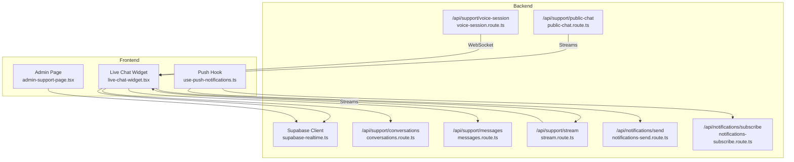

**Diagram sources**
- [supabase-realtime.ts:1-9](file://src/lib/supabase-realtime.ts#L1-L9)
- [live-chat-widget.tsx:68-294](file://src/components/dashboard/live-chat-widget.tsx#L68-L294)
- [admin-support-page.tsx:50-105](file://src/app/admin/support/page.tsx#L50-L105)
- [conversations.route.ts:1-68](file://src/app/api/support/conversations/route.ts#L1-L68)
- [messages.route.ts:1-64](file://src/app/api/support/messages/route.ts#L1-L64)
- [public-chat.route.ts:1-150](file://src/app/api/support/public-chat/route.ts#L1-L150)
- [stream.route.ts:1-176](file://src/app/api/support/stream/route.ts#L1-L176)
- [voice-session.route.ts:1-202](file://src/app/api/support/voice-session/route.ts#L1-L202)
- [notifications-send.route.ts:1-75](file://src/app/api/notifications/send/route.ts#L1-L75)
- [notifications-subscribe.route.ts:1-61](file://src/app/api/notifications/subscribe/route.ts#L1-L61)
- [use-push-notifications.ts:1-108](file://src/hooks/use-push-notifications.ts#L1-L108)

**Section sources**
- [supabase-realtime.ts:1-9](file://src/lib/supabase-realtime.ts#L1-L9)
- [live-chat-widget.tsx:68-294](file://src/components/dashboard/live-chat-widget.tsx#L68-L294)
- [admin-support-page.tsx:50-105](file://src/app/admin/support/page.tsx#L50-L105)
- [conversations.route.ts:1-68](file://src/app/api/support/conversations/route.ts#L1-L68)
- [messages.route.ts:1-64](file://src/app/api/support/messages/route.ts#L1-L64)
- [public-chat.route.ts:1-150](file://src/app/api/support/public-chat/route.ts#L1-L150)
- [stream.route.ts:1-176](file://src/app/api/support/stream/route.ts#L1-L176)
- [voice-session.route.ts:1-202](file://src/app/api/support/voice-session/route.ts#L1-L202)
- [notifications-send.route.ts:1-75](file://src/app/api/notifications/send/route.ts#L1-L75)
- [notifications-subscribe.route.ts:1-61](file://src/app/api/notifications/subscribe/route.ts#L1-L61)
- [use-push-notifications.ts:1-108](file://src/hooks/use-push-notifications.ts#L1-L108)

## Core Components
- Supabase Realtime client for live Postgres change events
- Live Chat Widget for authenticated support chat with optimistic UI and Supabase channel listeners
- Admin dashboard integration using Supabase channels for live updates
- Support Conversations API for fetching and creating conversations
- Support Messages API for sending user messages with guardrails
- Public Chat API for anonymous users with rate limits and caching
- Support Stream API for agent-assisted streaming with caching and rate limits
- Voice Session API for ephemeral tokens and WebSocket connections
- Notifications Subscribe/ Send APIs for Web Push subscriptions and delivery
- Frontend hook for browser push subscription lifecycle
- Intelligence Notifications service for multi-channel delivery and deduplication

**Section sources**
- [supabase-realtime.ts:1-9](file://src/lib/supabase-realtime.ts#L1-L9)
- [live-chat-widget.tsx:68-294](file://src/components/dashboard/live-chat-widget.tsx#L68-L294)
- [admin-support-page.tsx:50-105](file://src/app/admin/support/page.tsx#L50-L105)
- [conversations.route.ts:1-68](file://src/app/api/support/conversations/route.ts#L1-L68)
- [messages.route.ts:1-64](file://src/app/api/support/messages/route.ts#L1-L64)
- [public-chat.route.ts:1-150](file://src/app/api/support/public-chat/route.ts#L1-L150)
- [stream.route.ts:1-176](file://src/app/api/support/stream/route.ts#L1-L176)
- [voice-session.route.ts:1-202](file://src/app/api/support/voice-session/route.ts#L1-L202)
- [notifications-subscribe.route.ts:1-61](file://src/app/api/notifications/subscribe/route.ts#L1-L61)
- [notifications-send.route.ts:1-75](file://src/app/api/notifications/send/route.ts#L1-L75)
- [use-push-notifications.ts:1-108](file://src/hooks/use-push-notifications.ts#L1-L108)
- [intelligence-notifications.service.ts:1-312](file://src/lib/services/intelligence-notifications.service.ts#L1-L312)

## Architecture Overview
The real-time architecture combines:
- Supabase Realtime for server-sent events on database changes
- Streaming endpoints for AI-assisted chat
- WebSocket endpoints for voice sessions
- Web Push for asynchronous notifications

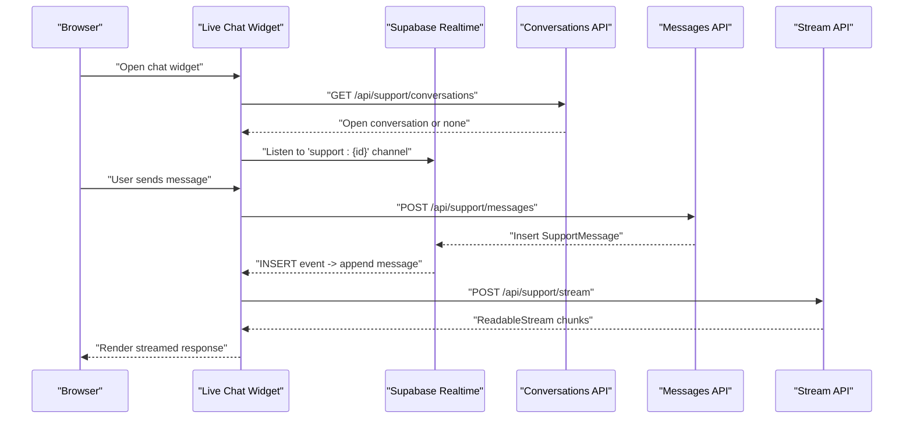

**Diagram sources**
- [live-chat-widget.tsx:163-294](file://src/components/dashboard/live-chat-widget.tsx#L163-L294)
- [conversations.route.ts:17-36](file://src/app/api/support/conversations/route.ts#L17-L36)
- [messages.route.ts:13-63](file://src/app/api/support/messages/route.ts#L13-L63)
- [stream.route.ts:31-175](file://src/app/api/support/stream/route.ts#L31-L175)
- [supabase-realtime.ts:1-9](file://src/lib/supabase-realtime.ts#L1-L9)

## Detailed Component Analysis

### Live Chat Widget (Authenticated Support)
The widget manages conversation lifecycle, optimistic rendering, and Supabase channel subscriptions for real-time updates.

Key behaviors:
- Fetches or creates an open conversation per user
- Optimistically appends user messages
- Subscribes to a Supabase channel scoped to the conversation
- Skips displaying agent typing while streaming is active
- Triggers unread indicators when minimized

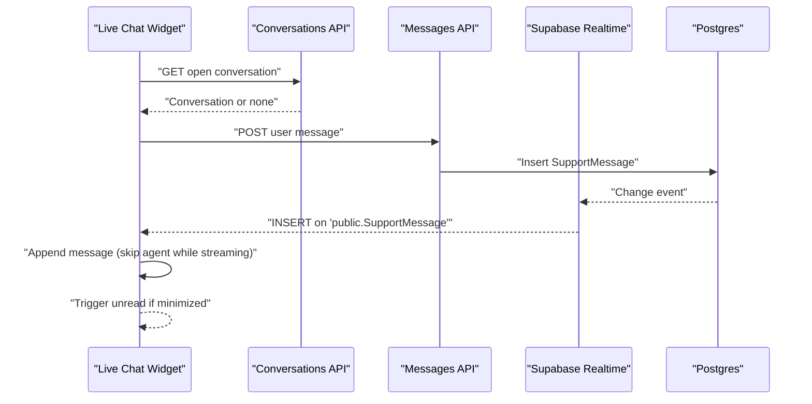

**Diagram sources**
- [live-chat-widget.tsx:163-210](file://src/components/dashboard/live-chat-widget.tsx#L163-L210)
- [conversations.route.ts:17-36](file://src/app/api/support/conversations/route.ts#L17-L36)
- [messages.route.ts:13-63](file://src/app/api/support/messages/route.ts#L13-L63)
- [supabase-realtime.ts:1-9](file://src/lib/supabase-realtime.ts#L1-L9)

**Section sources**
- [live-chat-widget.tsx:68-294](file://src/components/dashboard/live-chat-widget.tsx#L68-L294)
- [conversations.route.ts:1-68](file://src/app/api/support/conversations/route.ts#L1-L68)
- [messages.route.ts:1-64](file://src/app/api/support/messages/route.ts#L1-L64)

### Admin Dashboard Real-time Updates
The admin page listens for new support conversations and new messages for a selected conversation using Supabase channels.

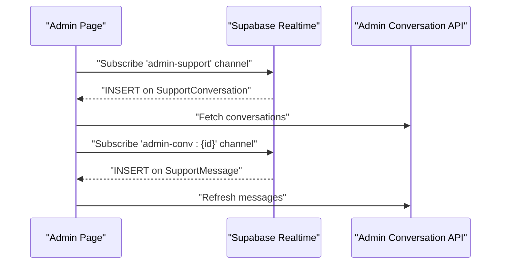

**Diagram sources**
- [admin-support-page.tsx:50-105](file://src/app/admin/support/page.tsx#L50-L105)
- [supabase-realtime.ts:1-9](file://src/lib/supabase-realtime.ts#L1-L9)

**Section sources**
- [admin-support-page.tsx:50-105](file://src/app/admin/support/page.tsx#L50-L105)
- [supabase-realtime.ts:1-9](file://src/lib/supabase-realtime.ts#L1-L9)

### Support Conversations API
- GET: Returns the user’s open support conversation if eligible (PRO/ELITE/ENTERPRISE)
- POST: Creates a new conversation with optional subject and user context

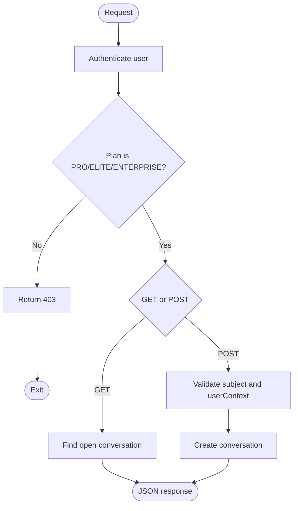

**Diagram sources**
- [conversations.route.ts:17-67](file://src/app/api/support/conversations/route.ts#L17-L67)

**Section sources**
- [conversations.route.ts:1-68](file://src/app/api/support/conversations/route.ts#L1-L68)

### Support Messages API
- Validates presence of conversationId and content
- Prevents AGENT senderRole from being used by clients
- Guardrails: prompt injection detection and PII scrubbing
- Inserts message into database and triggers real-time updates

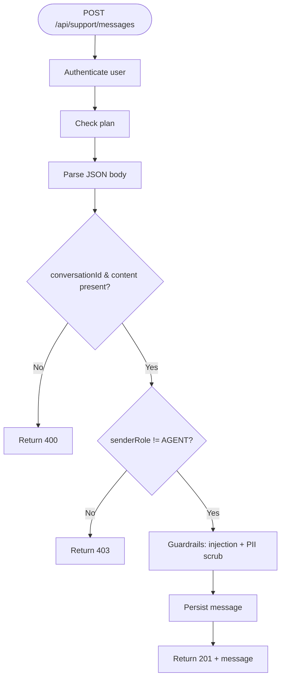

**Diagram sources**
- [messages.route.ts:13-63](file://src/app/api/support/messages/route.ts#L13-L63)

**Section sources**
- [messages.route.ts:1-64](file://src/app/api/support/messages/route.ts#L1-L64)

### Public Chat Streams (Anonymous)
- Two-tier rate limiting: burst limiter and plan-based daily cap
- Input validation and PII scrubbing
- Static replies and response caching for FAQs
- Streaming with readable stream and caching on completion

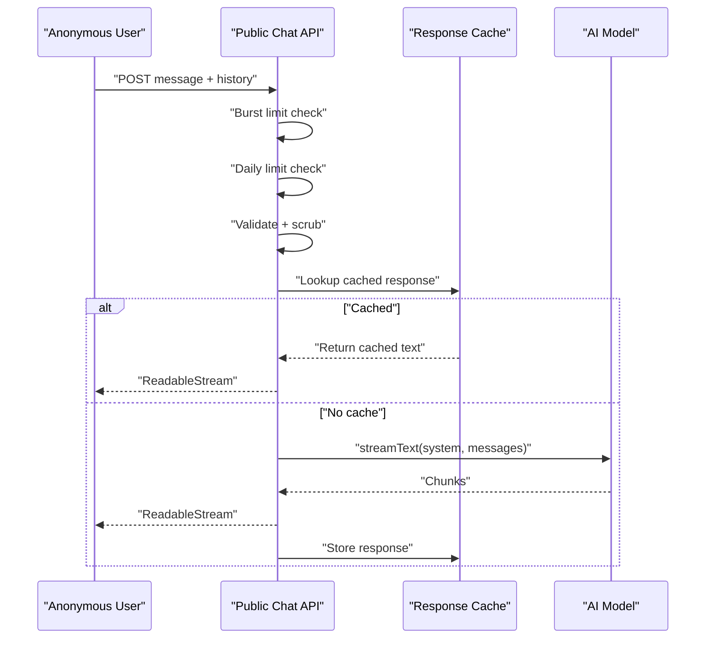

**Diagram sources**
- [public-chat.route.ts:24-149](file://src/app/api/support/public-chat/route.ts#L24-L149)

**Section sources**
- [public-chat.route.ts:1-150](file://src/app/api/support/public-chat/route.ts#L1-L150)

### Support Stream API (Authenticated)
- Enforces plan eligibility and rate limits
- Validates prompt injection and conversation status
- Builds contextual prompt and caches responses
- Streams agent replies and persists messages after completion

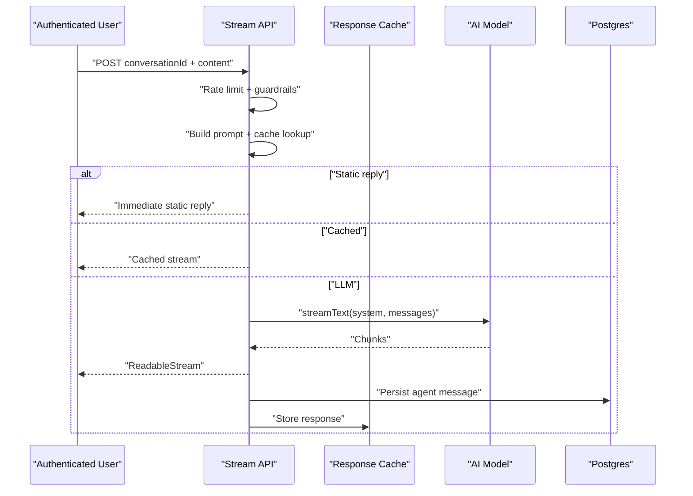

**Diagram sources**
- [stream.route.ts:31-175](file://src/app/api/support/stream/route.ts#L31-L175)

**Section sources**
- [stream.route.ts:1-176](file://src/app/api/support/stream/route.ts#L1-L176)

### Voice Session Management
- Issues ephemeral tokens from OpenAI Realtime
- Enforces per-user concurrency with Redis
- Builds contextual voice instructions from user data and knowledge base
- Returns WebSocket URL and model configuration for client-side connection

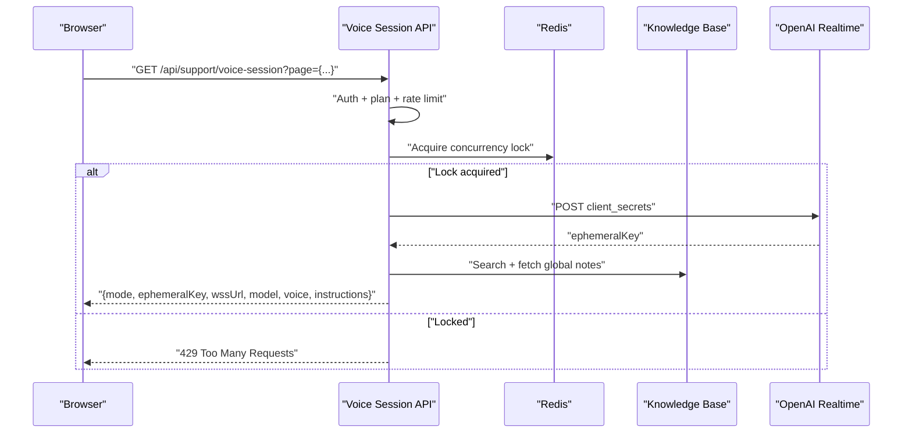

**Diagram sources**
- [voice-session.route.ts:26-201](file://src/app/api/support/voice-session/route.ts#L26-L201)

**Section sources**
- [voice-session.route.ts:1-202](file://src/app/api/support/voice-session/route.ts#L1-L202)

### Notifications: Subscribe and Send
- Subscribe endpoint stores or removes push subscription and toggles enablement
- Send endpoint validates subscription, sends Web Push, logs notification, and handles stale subscriptions
- Frontend hook manages browser permissions, subscription lifecycle, and server sync

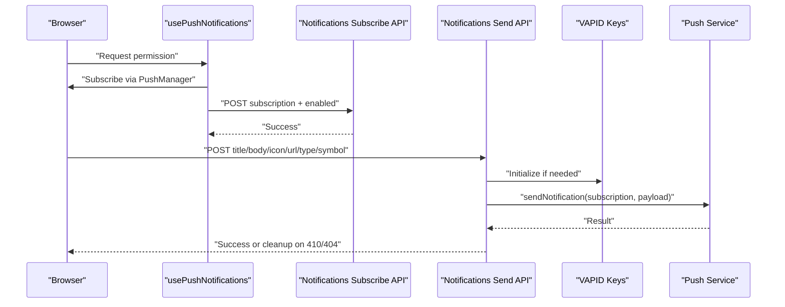

**Diagram sources**
- [use-push-notifications.ts:48-104](file://src/hooks/use-push-notifications.ts#L48-L104)
- [notifications-subscribe.route.ts:9-41](file://src/app/api/notifications/subscribe/route.ts#L9-L41)
- [notifications-send.route.ts:27-74](file://src/app/api/notifications/send/route.ts#L27-L74)

**Section sources**
- [use-push-notifications.ts:1-108](file://src/hooks/use-push-notifications.ts#L1-L108)
- [notifications-subscribe.route.ts:1-61](file://src/app/api/notifications/subscribe/route.ts#L1-L61)
- [notifications-send.route.ts:1-75](file://src/app/api/notifications/send/route.ts#L1-L75)

### Intelligence Notifications Service
- Builds notification events from dashboard/home data
- Respects user preferences and cadence rules
- Deduplicates events using Redis TTL keys
- Sends Web Push and/or email via Brevo, returning delivery results

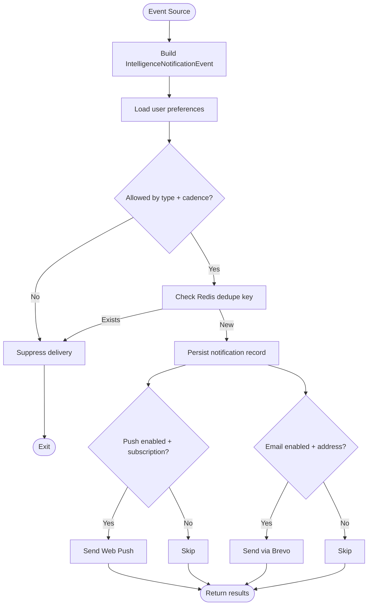

**Diagram sources**
- [intelligence-notifications.service.ts:217-311](file://src/lib/services/intelligence-notifications.service.ts#L217-L311)

**Section sources**
- [intelligence-notifications.service.ts:1-312](file://src/lib/services/intelligence-notifications.service.ts#L1-L312)

## Dependency Analysis
- Supabase Realtime is a shared dependency used by the live chat widget and admin page for server-sent events
- Support APIs depend on authentication, plan gating, rate limiting, guardrails, and persistence
- Voice session API depends on OpenAI ephemeral tokens and Redis for concurrency
- Notification APIs depend on VAPID configuration and external push services
- Intelligence notifications service integrates Prisma, Redis, and Brevo

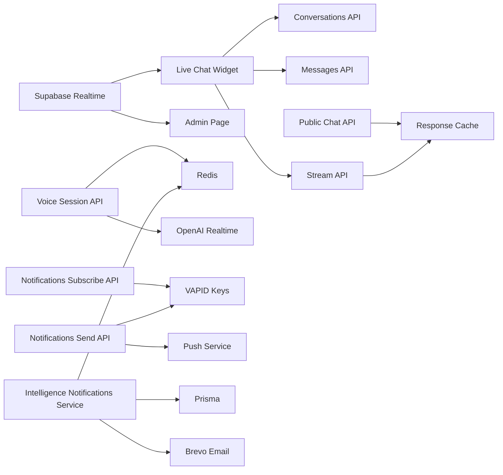

**Diagram sources**
- [supabase-realtime.ts:1-9](file://src/lib/supabase-realtime.ts#L1-L9)
- [live-chat-widget.tsx:180-210](file://src/components/dashboard/live-chat-widget.tsx#L180-L210)
- [admin-support-page.tsx:50-105](file://src/app/admin/support/page.tsx#L50-L105)
- [conversations.route.ts:1-68](file://src/app/api/support/conversations/route.ts#L1-L68)
- [messages.route.ts:1-64](file://src/app/api/support/messages/route.ts#L1-L64)
- [stream.route.ts:1-176](file://src/app/api/support/stream/route.ts#L1-L176)
- [public-chat.route.ts:1-150](file://src/app/api/support/public-chat/route.ts#L1-L150)
- [voice-session.route.ts:1-202](file://src/app/api/support/voice-session/route.ts#L1-L202)
- [notifications-subscribe.route.ts:1-61](file://src/app/api/notifications/subscribe/route.ts#L1-L61)
- [notifications-send.route.ts:1-75](file://src/app/api/notifications/send/route.ts#L1-L75)
- [intelligence-notifications.service.ts:1-312](file://src/lib/services/intelligence-notifications.service.ts#L1-L312)

**Section sources**
- [supabase-realtime.ts:1-9](file://src/lib/supabase-realtime.ts#L1-L9)
- [live-chat-widget.tsx:180-210](file://src/components/dashboard/live-chat-widget.tsx#L180-L210)
- [admin-support-page.tsx:50-105](file://src/app/admin/support/page.tsx#L50-L105)
- [stream.route.ts:1-176](file://src/app/api/support/stream/route.ts#L1-L176)
- [voice-session.route.ts:1-202](file://src/app/api/support/voice-session/route.ts#L1-L202)
- [notifications-send.route.ts:1-75](file://src/app/api/notifications/send/route.ts#L1-L75)
- [intelligence-notifications.service.ts:1-312](file://src/lib/services/intelligence-notifications.service.ts#L1-L312)

## Performance Considerations
- Streaming endpoints set explicit max durations and preferred regions to optimize cold starts and edge routing
- Public and authenticated chat endpoints implement dual rate limiting to mitigate abuse and control cost
- Response caching reduces LLM calls for repeated prompts
- Supabase channels minimize polling and provide immediate updates
- Voice session concurrency lock prevents unbounded audio sessions
- Web Push delivery is fire-and-forget with cleanup for stale subscriptions

[No sources needed since this section provides general guidance]

## Troubleshooting Guide
Common issues and resolutions:
- Unauthorized or insufficient plan: Ensure authentication and plan checks pass before calling chat or voice endpoints
- Rate limit exceeded: Respect burst and daily caps; implement client-side backoff
- Prompt injection detected: Sanitized inputs are rejected; validate and scrub content upstream
- Stale push subscription: On 410/404, remove local subscription and re-subscribe
- Voice session concurrency: Only one active session per user; wait for the current session to finish
- Supabase channel errors: Ensure the client is initialized and channels are unsubscribed on unmount

**Section sources**
- [stream.route.ts:31-45](file://src/app/api/support/stream/route.ts#L31-L45)
- [public-chat.route.ts:24-40](file://src/app/api/support/public-chat/route.ts#L24-L40)
- [messages.route.ts:36-41](file://src/app/api/support/messages/route.ts#L36-L41)
- [notifications-send.route.ts:62-70](file://src/app/api/notifications/send/route.ts#L62-L70)
- [voice-session.route.ts:44-49](file://src/app/api/support/voice-session/route.ts#L44-L49)
- [live-chat-widget.tsx:180-210](file://src/components/dashboard/live-chat-widget.tsx#L180-L210)

## Conclusion
The platform provides a robust real-time communication stack:
- Live chat with optimistic UI and Supabase channels
- Public and authenticated streaming with guardrails and caching
- Voice sessions with ephemeral tokens and concurrency control
- Web Push and email notifications with deduplication and preference-aware delivery

These components are designed for scalability, security, and maintainability, with clear separation of concerns across backend APIs, frontend widgets, and notification services.

[No sources needed since this section summarizes without analyzing specific files]

## Appendices

### API Reference Summary

- Support Conversations
  - GET /api/support/conversations
    - Auth: required
    - Plan: PRO/ELITE/ENTERPRISE
    - Response: open conversation or none
  - POST /api/support/conversations
    - Auth: required
    - Plan: PRO/ELITE/ENTERPRISE
    - Body: subject (optional), userContext (optional)
    - Response: created conversation

- Support Messages
  - POST /api/support/messages
    - Auth: required
    - Plan: PRO/ELITE/ENTERPRISE
    - Body: conversationId, content, senderRole (must not be AGENT)
    - Response: created message

- Public Chat Streams
  - POST /api/support/public-chat
    - Auth: optional
    - Body: message, history (optional)
    - Response: text/plain stream
    - Rate limits: burst + daily

- Support Stream (Agent-assisted)
  - POST /api/support/stream
    - Auth: required
    - Plan: PRO/ELITE/ENTERPRISE
    - Body: conversationId, content
    - Response: text/plain stream
    - Rate limits: per plan

- Voice Session
  - GET /api/support/voice-session
    - Auth: required
    - Plan: PRO/ELITE/ENTERPRISE
    - Query: page (optional)
    - Response: { mode, ephemeralKey, wssUrl, model, voice, instructions }
    - Concurrency: per-user lock

- Notifications Subscribe
  - POST /api/notifications/subscribe
    - Auth: required
    - Body: subscription (JSON), enabled (boolean)
    - Response: success
  - DELETE /api/notifications/subscribe
    - Auth: required
    - Response: success

- Notifications Send
  - POST /api/notifications/send
    - Auth: required
    - Body: title, body, icon (optional), url (optional), type (optional), symbol (optional)
    - Response: success or cleanup on stale subscription

**Section sources**
- [conversations.route.ts:1-68](file://src/app/api/support/conversations/route.ts#L1-L68)
- [messages.route.ts:1-64](file://src/app/api/support/messages/route.ts#L1-L64)
- [public-chat.route.ts:1-150](file://src/app/api/support/public-chat/route.ts#L1-L150)
- [stream.route.ts:1-176](file://src/app/api/support/stream/route.ts#L1-L176)
- [voice-session.route.ts:1-202](file://src/app/api/support/voice-session/route.ts#L1-L202)
- [notifications-subscribe.route.ts:1-61](file://src/app/api/notifications/subscribe/route.ts#L1-L61)
- [notifications-send.route.ts:1-75](file://src/app/api/notifications/send/route.ts#L1-L75)