# User Management API

<cite>
**Referenced Files in This Document**
- [balance/route.ts](file://src/app/api/user/credits/balance/route.ts)
- [purchase/route.ts](file://src/app/api/user/credits/purchase/route.ts)
- [route.ts](file://src/app/api/user/notifications/route.ts)
- [route.ts](file://src/app/api/user/onboarding/route.ts)
- [route.ts](file://src/app/api/user/plan/route.ts)
- [route.ts](file://src/app/api/user/preferences/route.ts)
- [route.ts](file://src/app/api/user/preferences/notifications/route.ts)
- [route.ts](file://src/app/api/user/preferences/blog/route.ts)
- [route.ts](file://src/app/api/user/preferences/dashboard-mode/route.ts)
- [route.ts](file://src/app/api/user/profile/route.ts)
- [route.ts](file://src/app/api/user/session/route.ts)
- [route.ts](file://src/app/api/user/watchlist/route.ts)
- [route.ts](file://src/app/api/user/watchlist/drift-alert/route.ts)
- [route.ts](file://src/app/api/user/weekly-report/route.ts)
</cite>

## Table of Contents
1. [Introduction](#introduction)
2. [Project Structure](#project-structure)
3. [Core Components](#core-components)
4. [Architecture Overview](#architecture-overview)
5. [Detailed Component Analysis](#detailed-component-analysis)
6. [Dependency Analysis](#dependency-analysis)
7. [Performance Considerations](#performance-considerations)
8. [Troubleshooting Guide](#troubleshooting-guide)
9. [Conclusion](#conclusion)

## Introduction
This document provides comprehensive API documentation for user management endpoints. It covers credit balance and purchase operations, notification preferences, onboarding progress tracking, subscription plan management, user preferences, profile updates, session management, watchlist operations, and weekly report generation. For each endpoint, we describe authentication requirements, request/response schemas, validation rules, error handling, and practical examples for CRUD operations on user data and credit transactions.

## Project Structure
User management APIs are organized under the Next.js App Router at:
- src/app/api/user/*

Key areas covered:
- Credits: balance and purchase
- Notifications: listing and marking as read
- Onboarding: fetching and updating progress
- Plan: retrieving plan and credits
- Preferences: general, notifications, blog, dashboard mode
- Profile: fetching and updating user profile
- Session: managing sessions and activity events
- Watchlist: CRUD operations and drift alert
- Weekly Report: generating personalized intelligence report

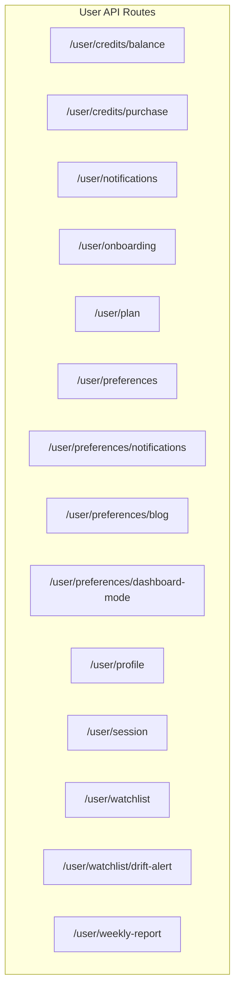

**Diagram sources**
- [balance/route.ts:1-24](file://src/app/api/user/credits/balance/route.ts#L1-L24)
- [purchase/route.ts:1-107](file://src/app/api/user/credits/purchase/route.ts#L1-L107)
- [route.ts:1-79](file://src/app/api/user/notifications/route.ts#L1-L79)
- [route.ts:1-78](file://src/app/api/user/onboarding/route.ts#L1-L78)
- [route.ts:1-42](file://src/app/api/user/plan/route.ts#L1-L42)
- [route.ts:1-119](file://src/app/api/user/preferences/route.ts#L1-L119)
- [route.ts:1-53](file://src/app/api/user/preferences/notifications/route.ts#L1-L53)
- [route.ts:1-52](file://src/app/api/user/preferences/blog/route.ts#L1-L52)
- [route.ts:1-50](file://src/app/api/user/preferences/dashboard-mode/route.ts#L1-L50)
- [route.ts:1-128](file://src/app/api/user/profile/route.ts#L1-L128)
- [route.ts:1-115](file://src/app/api/user/session/route.ts#L1-L115)
- [route.ts:1-162](file://src/app/api/user/watchlist/route.ts#L1-L162)
- [route.ts:1-53](file://src/app/api/user/watchlist/drift-alert/route.ts#L1-L53)
- [route.ts:1-29](file://src/app/api/user/weekly-report/route.ts#L1-L29)

**Section sources**
- [balance/route.ts:1-24](file://src/app/api/user/credits/balance/route.ts#L1-L24)
- [purchase/route.ts:1-107](file://src/app/api/user/credits/purchase/route.ts#L1-L107)
- [route.ts:1-79](file://src/app/api/user/notifications/route.ts#L1-L79)
- [route.ts:1-78](file://src/app/api/user/onboarding/route.ts#L1-L78)
- [route.ts:1-42](file://src/app/api/user/plan/route.ts#L1-L42)
- [route.ts:1-119](file://src/app/api/user/preferences/route.ts#L1-L119)
- [route.ts:1-53](file://src/app/api/user/preferences/notifications/route.ts#L1-L53)
- [route.ts:1-52](file://src/app/api/user/preferences/blog/route.ts#L1-L52)
- [route.ts:1-50](file://src/app/api/user/preferences/dashboard-mode/route.ts#L1-L50)
- [route.ts:1-128](file://src/app/api/user/profile/route.ts#L1-L128)
- [route.ts:1-115](file://src/app/api/user/session/route.ts#L1-L115)
- [route.ts:1-162](file://src/app/api/user/watchlist/route.ts#L1-L162)
- [route.ts:1-53](file://src/app/api/user/watchlist/drift-alert/route.ts#L1-L53)
- [route.ts:1-29](file://src/app/api/user/weekly-report/route.ts#L1-L29)

## Core Components
- Authentication: All user endpoints require a valid authenticated user context via an internal auth helper. Unauthorized requests receive a 401 response.
- Rate limiting: Several endpoints apply general rate limits keyed by userId to prevent abuse.
- Validation: Requests are validated using Zod schemas before processing.
- Error handling: Centralized error responses are returned with appropriate HTTP status codes and sanitized logs for diagnostics.
- Caching: Some endpoints leverage Redis caching for performance (e.g., watchlist drift alert).

**Section sources**
- [balance/route.ts:10-23](file://src/app/api/user/credits/balance/route.ts#L10-L23)
- [route.ts:22-60](file://src/app/api/user/notifications/route.ts#L22-L60)
- [route.ts:25-43](file://src/app/api/user/preferences/route.ts#L25-L43)
- [route.ts:18-52](file://src/app/api/user/watchlist/drift-alert/route.ts#L18-L52)

## Architecture Overview
The user management API follows a layered architecture:
- Route handlers enforce auth and rate limits, parse and validate requests, and delegate to domain services or database queries.
- Services encapsulate business logic (e.g., credit operations, preferences, weekly report generation).
- Data access uses Prisma ORM with PostgreSQL.
- External integrations include Clerk for identity and Stripe for payments.

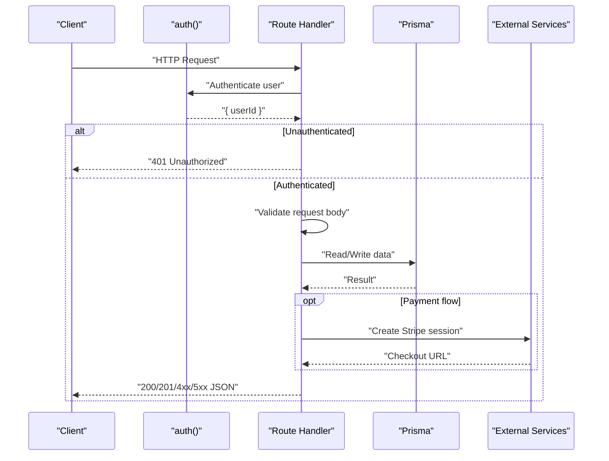

**Diagram sources**
- [purchase/route.ts:22-105](file://src/app/api/user/credits/purchase/route.ts#L22-L105)
- [route.ts:22-60](file://src/app/api/user/notifications/route.ts#L22-L60)
- [route.ts:45-118](file://src/app/api/user/preferences/route.ts#L45-L118)

## Detailed Component Analysis

### Credit Balance
- Endpoint: GET /api/user/credits/balance
- Authentication: Required
- Response: { credits: number }
- Notes: Returns the user’s current credit balance.

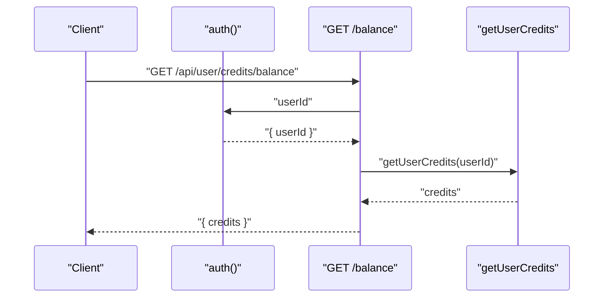

**Diagram sources**
- [balance/route.ts:10-23](file://src/app/api/user/credits/balance/route.ts#L10-L23)

**Section sources**
- [balance/route.ts:1-24](file://src/app/api/user/credits/balance/route.ts#L1-L24)

### Credit Purchase
- Endpoint: POST /api/user/credits/purchase
- Authentication: Required
- Request body:
  - packageId: string (required)
- Response:
  - success: boolean
  - checkoutUrl: string
  - sessionId: string
- Validation:
  - packageId must be present.
  - Credit package must exist and be active.
- Behavior:
  - Ensures a Stripe customer record exists for the user.
  - Creates a Stripe Checkout session with product metadata derived from the selected package.
  - Redirect URLs include query parameters indicating purchase outcome.
- Error codes:
  - 400: Missing packageId or invalid/inactive package.
  - 401: Unauthorized.
  - 500: Internal error.

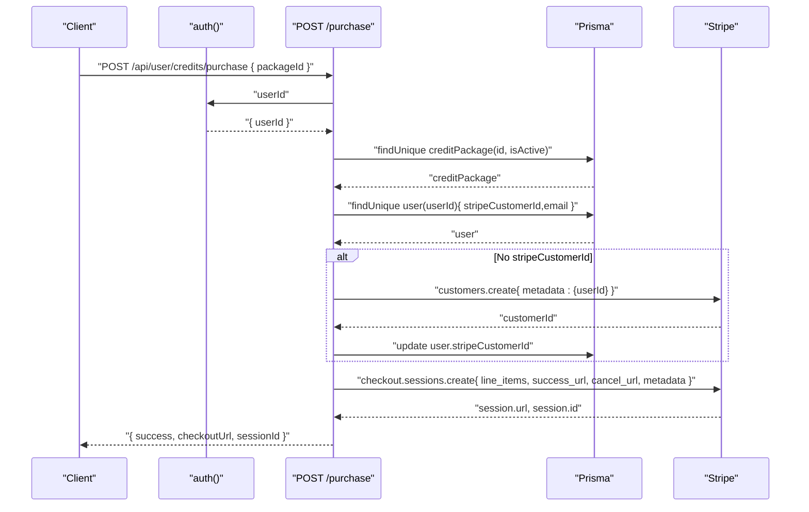

**Diagram sources**
- [purchase/route.ts:22-105](file://src/app/api/user/credits/purchase/route.ts#L22-L105)

**Section sources**
- [purchase/route.ts:1-107](file://src/app/api/user/credits/purchase/route.ts#L1-L107)

### Notifications
- Endpoint: GET /api/user/notifications
  - Returns recent notifications with computed href and severity metadata.
  - Response: { alerts: array of notifications, unreadCount: number }
- Endpoint: PATCH /api/user/notifications
  - Marks all unread notifications as read for the user.
  - Response: { success: true }
- Validation: None required for GET; PATCH accepts no body.
- Error codes: 401 Unauthorized, 500 Internal error.

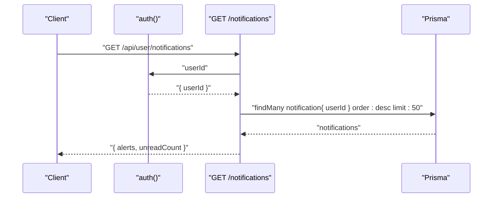

**Diagram sources**
- [route.ts:22-60](file://src/app/api/user/notifications/route.ts#L22-L60)

**Section sources**
- [route.ts:1-79](file://src/app/api/user/notifications/route.ts#L1-L79)

### Onboarding Progress
- Endpoint: GET /api/user/onboarding
  - Returns onboarding step, completion flags, and interests.
  - Response: { step: number, completed: boolean, skipped: boolean, interests: string[] }
- Endpoint: PATCH /api/user/onboarding
  - Accepts: { step?: number, skipped?: boolean, completed?: boolean }
  - Behavior:
    - Updates onboardingStep, onboardingCompleted, onboardingCompletedAt, and onboardingSkipped based on provided flags.
  - Response: { success: true, step: number, completed: boolean }
- Validation: Body is optional; numeric step is supported.
- Error codes: 401 Unauthorized, 500 Internal error.

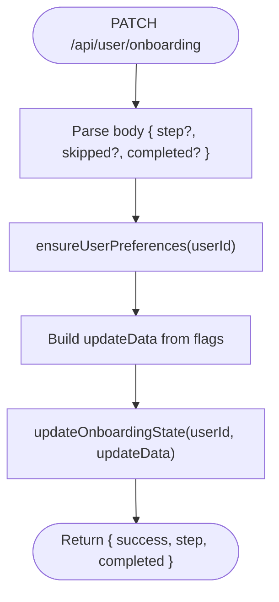

**Diagram sources**
- [route.ts:10-55](file://src/app/api/user/onboarding/route.ts#L10-L55)

**Section sources**
- [route.ts:1-78](file://src/app/api/user/onboarding/route.ts#L1-L78)

### Subscription Plan and Credits
- Endpoint: GET /api/user/plan
  - Returns plan tier, trial end date, and credits.
  - Response: { plan: string, trialEndsAt: string|null, credits: number }
  - Includes cache-control header to prevent caching in production.
- Behavior:
  - Normalizes plan tier.
  - Expires trial if needed.
  - Fetches credits via service.
- Error codes: 401 Unauthorized; on failure returns STARTER defaults.

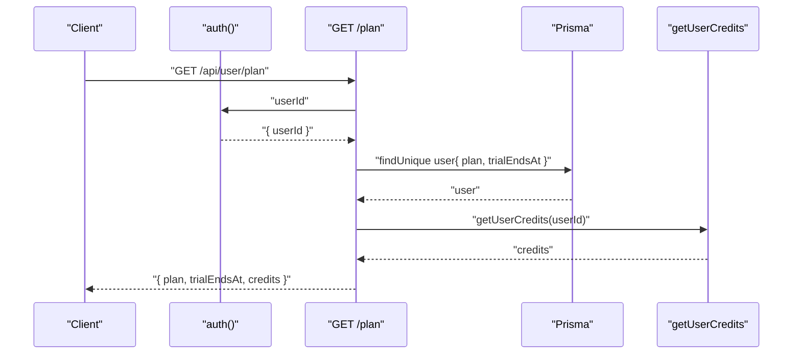

**Diagram sources**
- [route.ts:11-41](file://src/app/api/user/plan/route.ts#L11-L41)

**Section sources**
- [route.ts:1-42](file://src/app/api/user/plan/route.ts#L1-L42)

### User Preferences
- Endpoint: GET /api/user/preferences
  - Returns user preferences with rate limiting applied.
  - Response: { preferences: object }
  - Includes cache-control headers.
- Endpoint: PUT /api/user/preferences
  - Validates against a user preferences schema.
  - Upserts default preferences if missing, then updates specified fields.
  - Fields include preferredRegion, experienceLevel, dashboardMode, interests, onboardingCompleted, tourCompleted.
  - Response: { preferences: object }
- Validation: Zod schema enforced; invalid bodies return 400.
- Error codes: 401 Unauthorized, 400 Invalid request body, 500 Internal error.

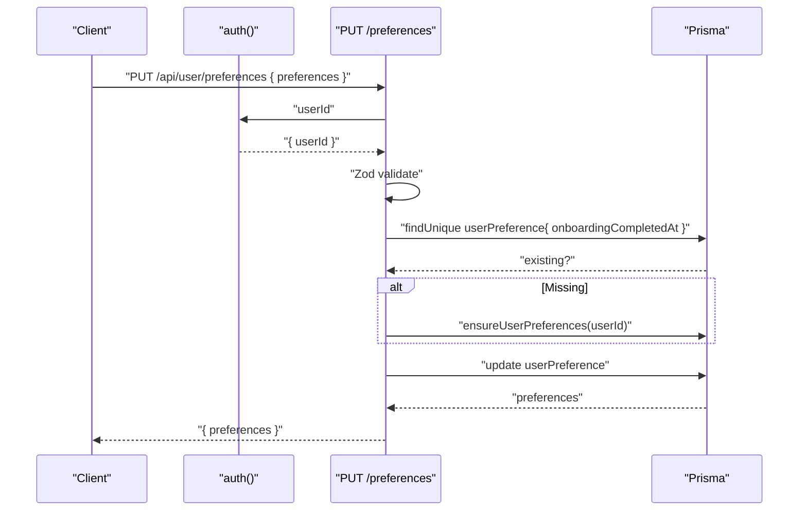

**Diagram sources**
- [route.ts:45-118](file://src/app/api/user/preferences/route.ts#L45-L118)

**Section sources**
- [route.ts:1-119](file://src/app/api/user/preferences/route.ts#L1-L119)

### Notification Preferences
- Endpoint: GET /api/user/preferences/notifications
  - Returns current notification preferences for the user.
  - Response: { notifications: object }
- Endpoint: PUT /api/user/preferences/notifications
  - Validates against a notification preferences schema.
  - Updates notification preferences.
  - Response: { notifications: object }
- Error codes: 401 Unauthorized, 400 Invalid request body, 500 Internal error.

**Section sources**
- [route.ts:1-53](file://src/app/api/user/preferences/notifications/route.ts#L1-L53)

### Blog Subscription Preference
- Endpoint: PUT /api/user/preferences/blog
  - Validates against a blog subscription schema.
  - Updates user’s blog subscription preference in the database.
  - Syncs with external email provider if user email exists.
  - Response: { success: true }
- Error codes: 401 Unauthorized, 400 Invalid request body, 500 Internal error.

**Section sources**
- [route.ts:1-52](file://src/app/api/user/preferences/blog/route.ts#L1-L52)

### Dashboard Mode Preference
- Endpoint: GET /api/user/preferences/dashboard-mode
  - Returns current dashboard mode; defaults to a safe value when unauthorized.
  - Response: { dashboardMode: "basic"|"advanced" }
- Endpoint: PUT /api/user/preferences/dashboard-mode
  - Validates dashboardMode against a schema.
  - Updates user’s dashboard mode preference.
  - Response: { dashboardMode: string }
- Error codes: 401 Unauthorized, 400 Invalid dashboardMode, 500 Internal error.

**Section sources**
- [route.ts:1-50](file://src/app/api/user/preferences/dashboard-mode/route.ts#L1-L50)

### Profile
- Endpoint: GET /api/user/profile
  - Returns profile, plan, and active subscription details.
  - Uses Clerk for profile data with DB fallback.
  - Response: { profile: object, plan: string, subscription: object|null }
- Endpoint: PUT /api/user/profile
  - Validates against a profile update schema.
  - Updates Clerk user profile (firstName, lastName).
  - Response: { profile: object }
- Rate limiting: Applied per operation.
- Error codes: 401 Unauthorized, 400 Invalid request body, 500 Internal error.

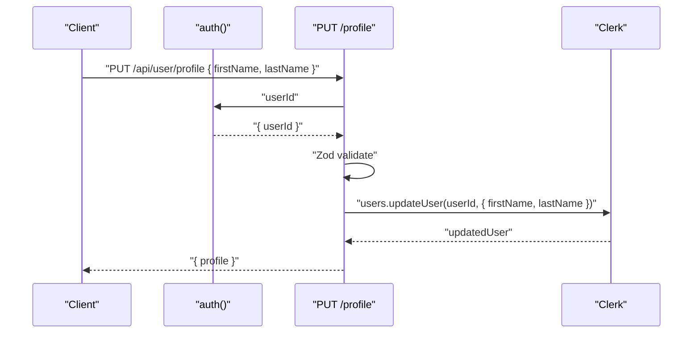

**Diagram sources**
- [route.ts:91-127](file://src/app/api/user/profile/route.ts#L91-L127)

**Section sources**
- [route.ts:1-128](file://src/app/api/user/profile/route.ts#L1-L128)

### Session Management
- Endpoint: POST /api/user/session
  - Actions:
    - start: Creates a new session and returns sessionId.
    - heartbeat: Updates lastActivityAt for the session.
    - end: Marks session as inactive and sets endedAt.
    - track: Records an activity event and optionally updates session heartbeat.
  - Request body:
    - action: "start"|"heartbeat"|"end"|"track"
    - sessionId: string (required for heartbeat, end, track)
    - eventType: string (optional, defaults to "page_view")
    - path: string (optional)
    - metadata: object (optional)
    - deviceInfo: string (optional)
    - ipAddress: string (optional)
  - Response: { sessionId?: string, success: boolean, hasActiveSession?: boolean }
- Endpoint: GET /api/user/session
  - Returns active session info for the user.
  - Response: { sessionId: string|null, hasActiveSession: boolean }
- Error codes: 400 Invalid action or missing sessionId, 401 Unauthorized, 500 Internal error.

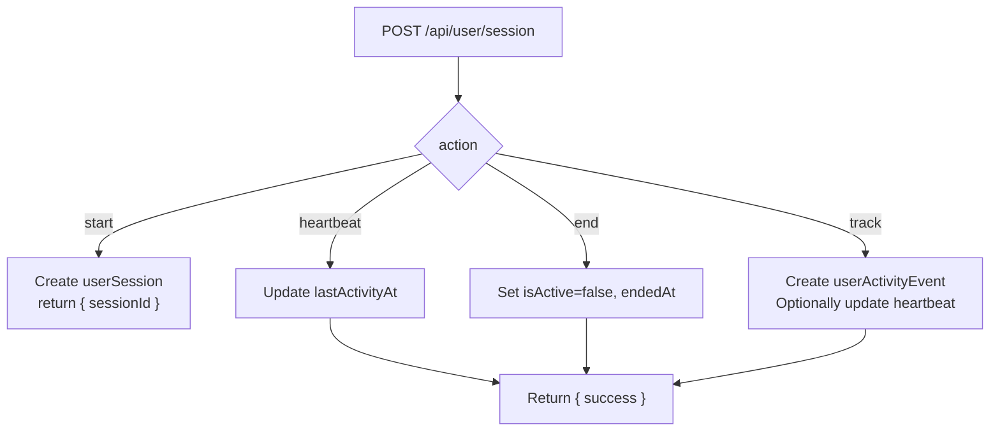

**Diagram sources**
- [route.ts:13-92](file://src/app/api/user/session/route.ts#L13-L92)

**Section sources**
- [route.ts:1-115](file://src/app/api/user/session/route.ts#L1-L115)

### Watchlist Operations
- Endpoint: GET /api/user/watchlist
  - Optional query param: region (US|IN)
  - Returns paginated watchlist items with asset details.
  - Response: { items: array of watchlist entries }
- Endpoint: POST /api/user/watchlist
  - Adds an asset to the watchlist.
  - Request body: { symbol: string, region?: "US"|"IN" }
  - Validates symbol length and region enum.
  - Response: { item: watchlist entry } with 201 status
- Endpoint: DELETE /api/user/watchlist
  - Removes an asset from the watchlist.
  - Request body: { symbol: string }
  - Validates symbol length.
  - Response: { success: true }
- Cache invalidation: Clears personal briefing and dashboard home caches after add/remove.
- Error codes: 400 Invalid request body, 401 Unauthorized, 404 Asset not found, 500 Internal error.

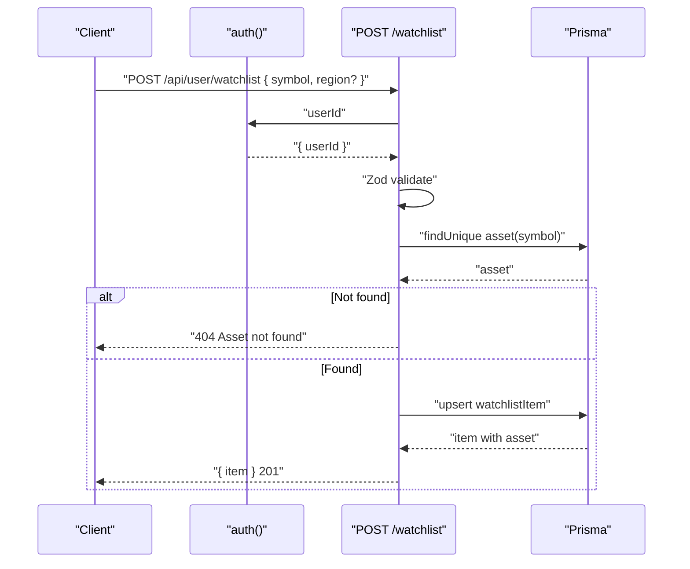

**Diagram sources**
- [route.ts:67-126](file://src/app/api/user/watchlist/route.ts#L67-L126)

**Section sources**
- [route.ts:1-162](file://src/app/api/user/watchlist/route.ts#L1-L162)

### Watchlist Drift Alert
- Endpoint: GET /api/user/watchlist/drift-alert
  - Counts watchlist assets with compatibilityScore < 40.
  - Response: { driftCount: number }
  - Uses Redis caching with 300-second TTL.
- Behavior:
  - Returns 0 for unauthenticated users.
  - Computes driftCount from stored watchlist items and caches the result.
- Error codes: 200 with fallback driftCount=0 on failure.

**Section sources**
- [route.ts:1-53](file://src/app/api/user/watchlist/drift-alert/route.ts#L1-L53)

### Weekly Report Generation
- Endpoint: GET /api/user/weekly-report
  - Query params:
    - region: "US"|"IN" (defaults to "US")
  - Returns a weekly intelligence report tailored to the user’s plan and region.
  - Response: { report: object }
- Error codes: 401 Unauthorized, 500 Internal error.

**Section sources**
- [route.ts:1-29](file://src/app/api/user/weekly-report/route.ts#L1-L29)

## Dependency Analysis
- Authentication: auth() is used across all endpoints to extract userId.
- Data access: Prisma client is used for reads/writes to user, preferences, watchlist, sessions, subscriptions, and notifications.
- External services:
  - Clerk: Identity and profile updates.
  - Stripe: Payment checkout sessions for credit purchases.
  - Email provider: Brevo for blog subscription sync.
- Caching: Redis is used for watchlist drift alert caching.

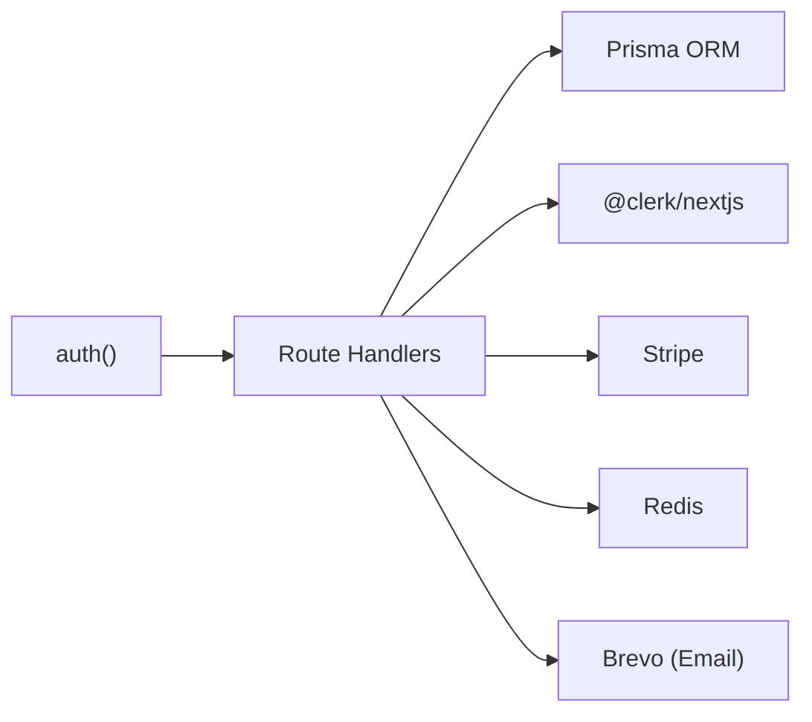

**Diagram sources**
- [purchase/route.ts:1-107](file://src/app/api/user/credits/purchase/route.ts#L1-L107)
- [route.ts:1-128](file://src/app/api/user/profile/route.ts#L1-L128)
- [route.ts:1-53](file://src/app/api/user/watchlist/drift-alert/route.ts#L1-L53)
- [route.ts:1-52](file://src/app/api/user/preferences/blog/route.ts#L1-L52)

**Section sources**
- [purchase/route.ts:1-107](file://src/app/api/user/credits/purchase/route.ts#L1-L107)
- [route.ts:1-128](file://src/app/api/user/profile/route.ts#L1-L128)
- [route.ts:1-53](file://src/app/api/user/watchlist/drift-alert/route.ts#L1-L53)
- [route.ts:1-52](file://src/app/api/user/preferences/blog/route.ts#L1-L52)

## Performance Considerations
- Caching:
  - Use Redis for frequently accessed lightweight computations (e.g., drift alert).
  - Prefer cache-control headers for preference retrieval to reduce DB load.
- Parallelization:
  - Use Promise.all for concurrent operations (e.g., session heartbeat and activity event creation).
- Indexes and queries:
  - Ensure proper indexing on userId, asset symbol, and watchlist composite keys to optimize lookups.
- Rate limiting:
  - Apply per-operation rate limits to protect sensitive endpoints (profile, preferences).

## Troubleshooting Guide
- 401 Unauthorized
  - Cause: Missing or invalid authentication context.
  - Resolution: Ensure the client sends a valid session or token recognized by the auth layer.
- 400 Bad Request
  - Causes:
    - Missing or invalid fields in request body (e.g., packageId, symbol, dashboardMode).
    - Invalid enum values (e.g., region, notification type).
  - Resolution: Validate request payload against documented schemas and retry.
- 404 Not Found
  - Cause: Asset not found when adding to watchlist or removing from watchlist.
  - Resolution: Verify symbol spelling and region; ensure asset exists.
- 500 Internal Error
  - Causes: Database failures, external service errors (Stripe/Clerk/Brevo), or unexpected exceptions.
  - Resolution: Check server logs for sanitized error details; retry after external service stability.

**Section sources**
- [purchase/route.ts:32-42](file://src/app/api/user/credits/purchase/route.ts#L32-L42)
- [route.ts:75-90](file://src/app/api/user/watchlist/route.ts#L75-L90)
- [route.ts:135-151](file://src/app/api/user/watchlist/route.ts#L135-L151)
- [route.ts:38-52](file://src/app/api/user/session/route.ts#L38-L52)
- [route.ts:38-41](file://src/app/api/user/preferences/dashboard-mode/route.ts#L38-L41)

## Conclusion
The user management API provides a cohesive set of endpoints for credit operations, preferences, profile management, session tracking, watchlist maintenance, and report generation. All endpoints enforce authentication, include robust validation, and handle errors gracefully. By leveraging caching, rate limiting, and external integrations, the API balances performance and reliability while maintaining clear request/response contracts.