# Utility & System API

<cite>
**Referenced Files in This Document**
- [route.ts](file://src/app/api/dashboard/home/route.ts)
- [route.ts](file://src/app/api/points/route.ts)
- [route.ts](file://src/app/api/referral/route.ts)
- [route.ts](file://src/app/api/waitlist/route.ts)
- [route.tsx](file://src/app/api/share/card/route.tsx)
- [route.ts](file://src/app/api/ux/cta-event/route.ts)
- [route.ts](file://src/app/api/ux/share-event/route.ts)
- [route.ts](file://src/app/api/credits/explore/route.ts)
- [route.ts](file://src/app/api/webhooks/clerk/route.ts)
- [route.ts](file://src/app/api/webhooks/stripe/route.ts)
- [route.ts](file://src/app/api/webhooks/razorpay/route.ts)
- [route.ts](file://src/app/api/webhooks/ami/route.ts)
- [route.ts](file://src/app/api/webhooks/stripe-credits/route.ts)
</cite>

## Table of Contents
1. [Introduction](#introduction)
2. [Project Structure](#project-structure)
3. [Core Components](#core-components)
4. [Architecture Overview](#architecture-overview)
5. [Detailed Component Analysis](#detailed-component-analysis)
6. [Dependency Analysis](#dependency-analysis)
7. [Performance Considerations](#performance-considerations)
8. [Troubleshooting Guide](#troubleshooting-guide)
9. [Conclusion](#conclusion)
10. [Appendices](#appendices)

## Introduction
This document provides comprehensive API documentation for utility and system endpoints in the LyraAlpha platform. It covers:
- Dashboard home data aggregation
- Points tracking and redemptions
- Referral program operations
- Waitlist management
- Sharing functionality (OG image generation)
- UX event tracking (CTA and share events)
- System webhooks for external integrations (Clerk, Stripe, Razorpay, AMI)
- Utility endpoints for credit exploration and system health considerations
- Operational patterns and integration examples

The goal is to enable developers and operators to integrate with and monitor the system effectively, with clear endpoint definitions, request/response characteristics, and operational notes.

## Project Structure
The API surface is organized under src/app/api with feature-based routing. Key areas include:
- Dashboard home aggregation
- Points and gamification
- Referral program
- Waitlist
- Sharing (OG image generation)
- UX event tracking
- Credit exploration
- Webhooks for Clerk, Stripe, Razorpay, and AMI

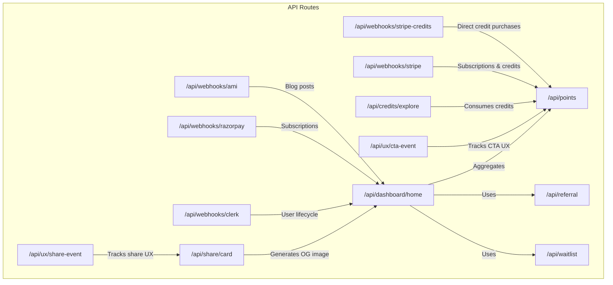

**Diagram sources**
- [route.ts:1-39](file://src/app/api/dashboard/home/route.ts#L1-L39)
- [route.ts:1-40](file://src/app/api/points/route.ts#L1-L40)
- [route.ts:1-31](file://src/app/api/referral/route.ts#L1-L31)
- [route.ts:1-47](file://src/app/api/waitlist/route.ts#L1-L47)
- [route.tsx:1-183](file://src/app/api/share/card/route.tsx#L1-L183)
- [route.ts:1-62](file://src/app/api/ux/cta-event/route.ts#L1-L62)
- [route.ts:1-86](file://src/app/api/ux/share-event/route.ts#L1-L86)
- [route.ts:1-41](file://src/app/api/credits/explore/route.ts#L1-L41)
- [route.ts:1-379](file://src/app/api/webhooks/clerk/route.ts#L1-L379)
- [route.ts:1-430](file://src/app/api/webhooks/stripe/route.ts#L1-L430)
- [route.ts:1-155](file://src/app/api/webhooks/razorpay/route.ts#L1-L155)
- [route.ts:1-278](file://src/app/api/webhooks/ami/route.ts#L1-L278)
- [route.ts:1-85](file://src/app/api/webhooks/stripe-credits/route.ts#L1-L85)

**Section sources**
- [route.ts:1-39](file://src/app/api/dashboard/home/route.ts#L1-L39)
- [route.ts:1-40](file://src/app/api/points/route.ts#L1-L40)
- [route.ts:1-31](file://src/app/api/referral/route.ts#L1-L31)
- [route.ts:1-47](file://src/app/api/waitlist/route.ts#L1-L47)
- [route.tsx:1-183](file://src/app/api/share/card/route.tsx#L1-L183)
- [route.ts:1-62](file://src/app/api/ux/cta-event/route.ts#L1-L62)
- [route.ts:1-86](file://src/app/api/ux/share-event/route.ts#L1-L86)
- [route.ts:1-41](file://src/app/api/credits/explore/route.ts#L1-L41)
- [route.ts:1-379](file://src/app/api/webhooks/clerk/route.ts#L1-L379)
- [route.ts:1-430](file://src/app/api/webhooks/stripe/route.ts#L1-L430)
- [route.ts:1-155](file://src/app/api/webhooks/razorpay/route.ts#L1-L155)
- [route.ts:1-278](file://src/app/api/webhooks/ami/route.ts#L1-L278)
- [route.ts:1-85](file://src/app/api/webhooks/stripe-credits/route.ts#L1-L85)

## Core Components
This section outlines the primary utility and system endpoints with their purpose, authentication, and notable behaviors.

- Dashboard Home Aggregation
  - Purpose: Serve personalized dashboard content with caching and regional filtering.
  - Authentication: Required (user context).
  - Parameters: region (US or IN).
  - Response: Aggregated home data with cache headers.
  - Notes: Uses service-layer aggregation and enforces region selection.

- Points Tracking
  - Purpose: Fetch user points balance, history, and redemption options.
  - Authentication: Required.
  - Response: Points summary and history; includes redemption options.
  - Notes: Returns with private, no-cache headers.

- Referral Program
  - Purpose: Create or retrieve referral code, stats, and shareable link.
  - Authentication: Required.
  - Response: Referral code, link, and statistics.
  - Notes: Generates a unique referral link per user.

- Waitlist Management
  - Purpose: Add or update a waitlist user entry.
  - Authentication: Not required (public endpoint).
  - Request: Email (required), optional firstName, lastName, source, notes.
  - Response: Success indicator and minimal user info.
  - Notes: Validates email format and applies basic sanitization.

- Sharing Functionality (OG Image Generation)
  - Purpose: Generate social share cards as images.
  - Authentication: Not required.
  - Request: Query params for eyebrow, title, takeaway, context, scoreLabel, scoreValue.
  - Response: ImageResponse (OG image).
  - Notes: Edge runtime; strict param limits and truncation.

- UX Event Tracking
  - CTA Event
    - Purpose: Log impression or click events with variants and action buckets.
    - Authentication: Optional (user ID may be attached).
    - Storage: Redis hashed counters with TTL; optional per-user keys.
    - Response: Acknowledgement.
  - Share Event
    - Purpose: Log share-related actions and normalize paths.
    - Authentication: Optional.
    - Storage: Redis hashed counters with TTL; optional per-user keys.
    - Response: Acknowledgement.

- Credit Exploration
  - Purpose: Deduct credits for asset or sector exploration.
  - Authentication: Required.
  - Request: action (ASSET or SECTOR), symbol or id.
  - Response: Success flag and remaining credits (X-Credits-Remaining header).
  - Notes: Enforces action validation and logs consumption.

- Webhooks
  - Clerk
    - Purpose: User lifecycle synchronization (created, updated, deleted).
    - Security: Signature verification via Svix; idempotency via Redis lock.
    - Effects: Upsert user, grant sign-up bonus credits, manage preferences, GDPR purge on delete.
  - Stripe
    - Purpose: Subscription lifecycle and billing events (checkout, invoices, disputes, refunds).
    - Security: Signature verification; idempotency via event recording.
    - Effects: Activate or renew subscriptions, update status, refund clawback, audit logs.
  - Razorpay
    - Purpose: Subscription lifecycle and payment capture/failure.
    - Security: Signature verification; idempotency via constructed event IDs.
    - Effects: Activate or update subscriptions, pending/halted/cancelled states.
  - AMI (Blog)
    - Purpose: Publish/update/archive blog posts and notify subscribers.
    - Security: HMAC signature verification; idempotency via Redis.
    - Effects: Sanitize content, upsert blog post, revalidate ISR paths, notify subscribers.
  - Stripe Credits
    - Purpose: Fulfill direct credit purchases via Stripe sessions.
    - Security: Signature verification; idempotency via reference ID.
    - Effects: Grant credits in a transactional context.

**Section sources**
- [route.ts:1-39](file://src/app/api/dashboard/home/route.ts#L1-L39)
- [route.ts:1-40](file://src/app/api/points/route.ts#L1-L40)
- [route.ts:1-31](file://src/app/api/referral/route.ts#L1-L31)
- [route.ts:1-47](file://src/app/api/waitlist/route.ts#L1-L47)
- [route.tsx:1-183](file://src/app/api/share/card/route.tsx#L1-L183)
- [route.ts:1-62](file://src/app/api/ux/cta-event/route.ts#L1-L62)
- [route.ts:1-86](file://src/app/api/ux/share-event/route.ts#L1-L86)
- [route.ts:1-41](file://src/app/api/credits/explore/route.ts#L1-L41)
- [route.ts:1-379](file://src/app/api/webhooks/clerk/route.ts#L1-L379)
- [route.ts:1-430](file://src/app/api/webhooks/stripe/route.ts#L1-L430)
- [route.ts:1-155](file://src/app/api/webhooks/razorpay/route.ts#L1-L155)
- [route.ts:1-278](file://src/app/api/webhooks/ami/route.ts#L1-L278)
- [route.ts:1-85](file://src/app/api/webhooks/stripe-credits/route.ts#L1-L85)

## Architecture Overview
The system integrates user-facing APIs with backend services and external providers. Webhooks ensure eventual consistency for user lifecycle, billing, and content ingestion.

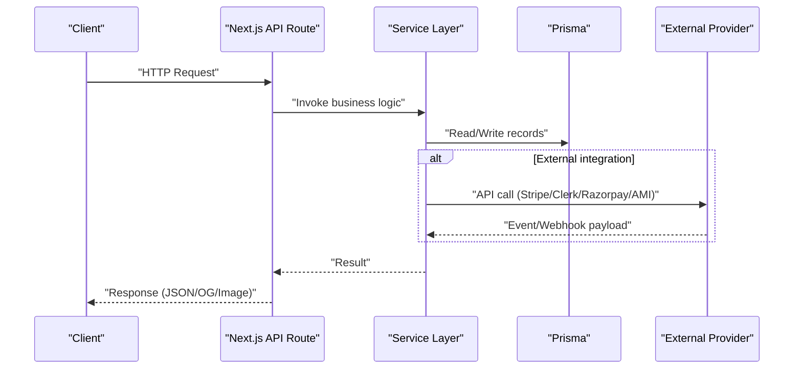

[No sources needed since this diagram shows conceptual workflow, not actual code structure]

## Detailed Component Analysis

### Dashboard Home Data Aggregation
- Endpoint: GET /api/dashboard/home
- Authentication: Required
- Query Parameters:
  - region: "US" or "IN" (default "US")
- Behavior:
  - Validates region
  - Retrieves user plan
  - Calls service to compute aggregated home data
  - Returns with cache-control headers
- Error Handling:
  - Unauthorized if no user
  - Invalid region returns error
  - Internal error logged and returned as 500

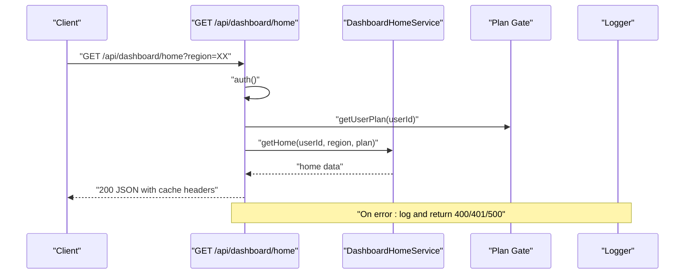

**Diagram sources**
- [route.ts:1-39](file://src/app/api/dashboard/home/route.ts#L1-L39)

**Section sources**
- [route.ts:1-39](file://src/app/api/dashboard/home/route.ts#L1-L39)

### Points Tracking
- Endpoint: GET /api/points
- Authentication: Required
- Behavior:
  - Fetches current points and history concurrently
  - Includes redemption options
  - Returns with private, no-cache headers
- Error Handling:
  - Unauthorized if no user
  - Internal error returns 500

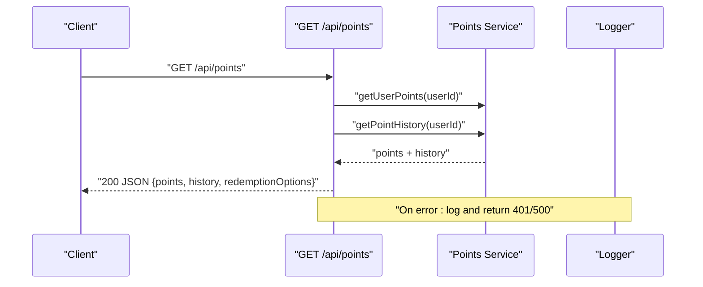

**Diagram sources**
- [route.ts:1-40](file://src/app/api/points/route.ts#L1-L40)

**Section sources**
- [route.ts:1-40](file://src/app/api/points/route.ts#L1-L40)

### Referral Program Operations
- Endpoint: GET /api/referral
- Authentication: Required
- Behavior:
  - Creates or retrieves a referral code for the user
  - Computes stats
  - Builds a shareable referral link
- Error Handling:
  - Unauthorized if no user
  - Internal error returns 500

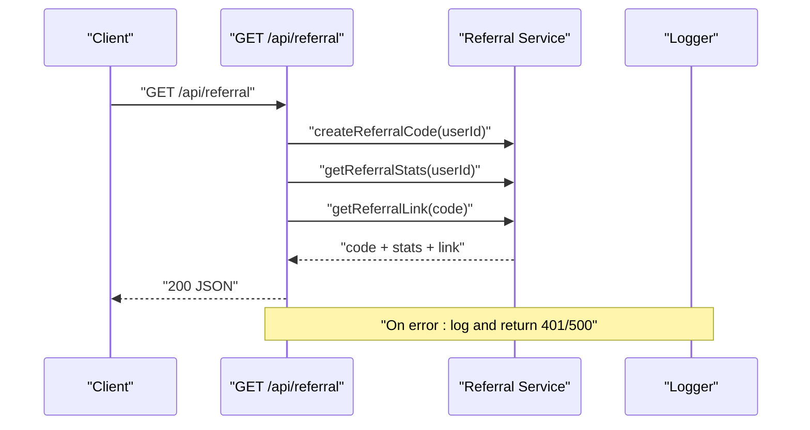

**Diagram sources**
- [route.ts:1-31](file://src/app/api/referral/route.ts#L1-L31)

**Section sources**
- [route.ts:1-31](file://src/app/api/referral/route.ts#L1-L31)

### Waitlist Management
- Endpoint: POST /api/waitlist
- Authentication: Not required
- Request Body:
  - email (required)
  - firstName, lastName, source, notes (optional)
- Behavior:
  - Validates email format
  - Upserts waitlist user with provided attributes
  - Returns minimal user info and success flag
- Error Handling:
  - Invalid email returns 400
  - Internal error returns 500

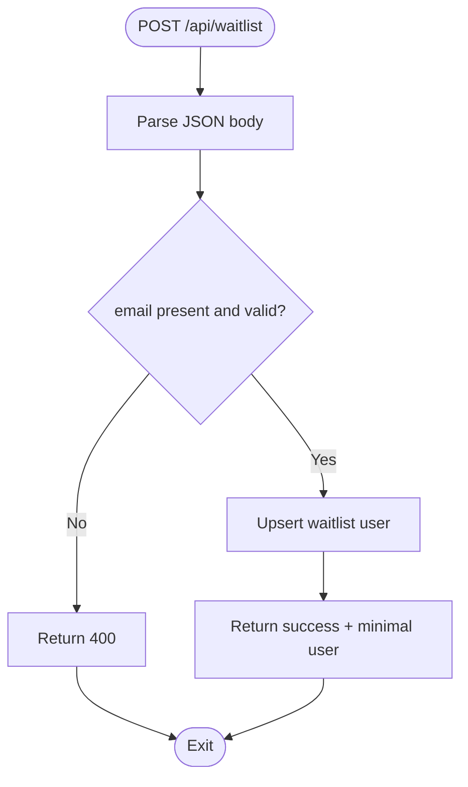

**Diagram sources**
- [route.ts:1-47](file://src/app/api/waitlist/route.ts#L1-L47)

**Section sources**
- [route.ts:1-47](file://src/app/api/waitlist/route.ts#L1-L47)

### Sharing Functionality (OG Image Generation)
- Endpoint: GET /api/share/card
- Authentication: Not required
- Query Parameters:
  - eyebrow, title, takeaway, context (strings)
  - scoreLabel, scoreValue (optional)
- Behavior:
  - Renders an OG image using Next.js ImageResponse
  - Applies strict length limits and truncation
  - Returns image with fixed dimensions
- Notes:
  - Runtime: Edge
  - No authentication required

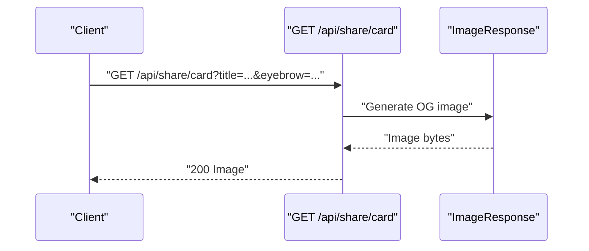

**Diagram sources**
- [route.tsx:1-183](file://src/app/api/share/card/route.tsx#L1-L183)

**Section sources**
- [route.tsx:1-183](file://src/app/api/share/card/route.tsx#L1-L183)

### UX Event Tracking
- CTA Event
  - Endpoint: POST /api/ux/cta-event
  - Payload: source, eventType (impression/click), actionCount, actionBucket, variant, ts
  - Storage: Redis hash counters keyed by day; optional per-user key
  - Response: { ok: true }
- Share Event
  - Endpoint: POST /api/ux/share-event
  - Payload: action (enumerated), kind, mode, path, ts
  - Path normalization: strips query params and normalizes admin/dashboard paths
  - Storage: Redis hash counters keyed by day; optional per-user key
  - Response: { ok: true }

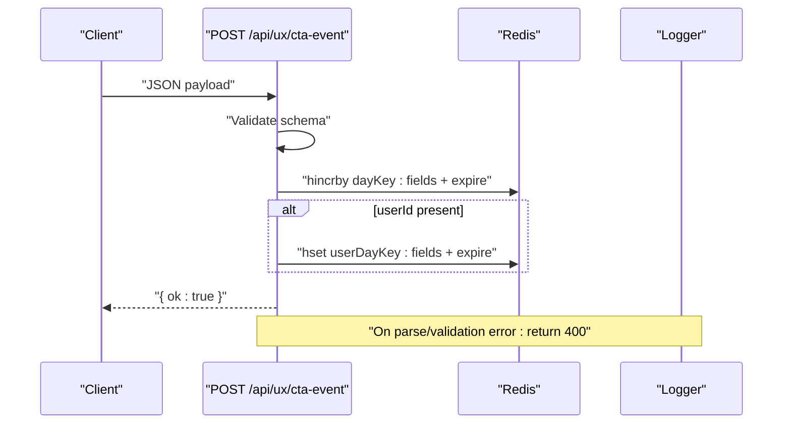

**Diagram sources**
- [route.ts:1-62](file://src/app/api/ux/cta-event/route.ts#L1-L62)

**Section sources**
- [route.ts:1-62](file://src/app/api/ux/cta-event/route.ts#L1-L62)
- [route.ts:1-86](file://src/app/api/ux/share-event/route.ts#L1-L86)

### Credit Exploration
- Endpoint: POST /api/credits/explore
- Authentication: Required
- Request Body:
  - action: "ASSET" | "SECTOR"
  - symbol or id (as applicable)
- Behavior:
  - Validates action
  - Consumes 1 credit for exploration
  - Returns success and remaining credits in X-Credits-Remaining header
- Error Handling:
  - Unauthorized if no user
  - Invalid action returns 400
  - Internal error returns 500

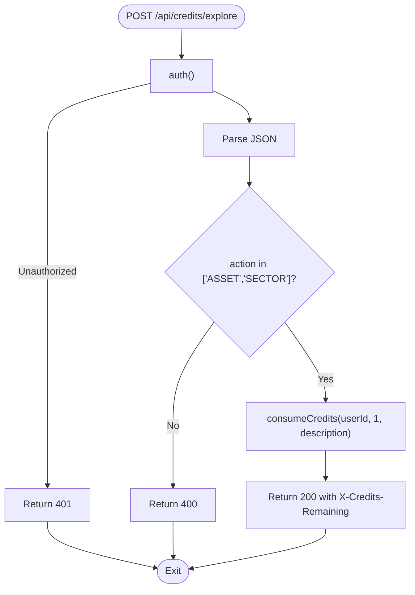

**Diagram sources**
- [route.ts:1-41](file://src/app/api/credits/explore/route.ts#L1-L41)

**Section sources**
- [route.ts:1-41](file://src/app/api/credits/explore/route.ts#L1-L41)

### Webhooks: Clerk
- Endpoint: POST /api/webhooks/clerk
- Security:
  - Verifies Svix signature
  - Idempotency via Redis lock keyed by svix-id
- Events:
  - user.created: upsert user, grant sign-up bonus credits (idempotent), send welcome email, set preferences
  - user.updated: upsert user (preserve ELITE/admin plan), grant sign-up bonus if needed
  - user.deleted: GDPR anonymization and content purge in a transaction
- Notes:
  - Uses Prisma transactions for atomicity
  - Invalid signatures return 400
  - Missing headers return 400
  - Misconfiguration returns 500

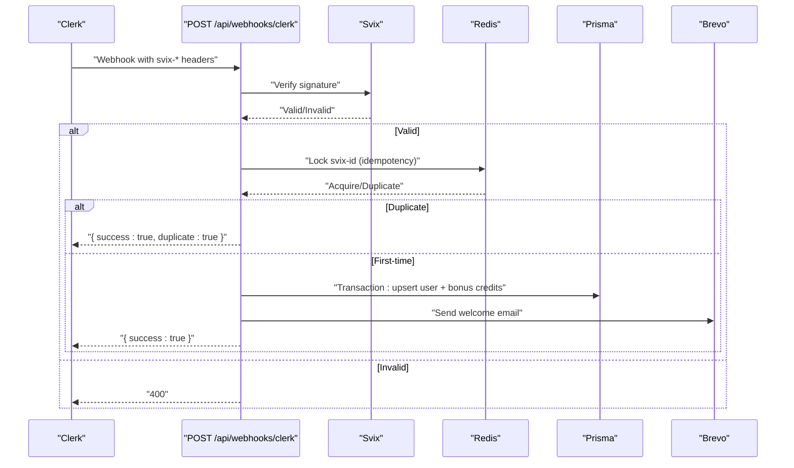

**Diagram sources**
- [route.ts:1-379](file://src/app/api/webhooks/clerk/route.ts#L1-L379)

**Section sources**
- [route.ts:1-379](file://src/app/api/webhooks/clerk/route.ts#L1-L379)

### Webhooks: Stripe
- Endpoint: POST /api/webhooks/stripe
- Security:
  - Verifies webhook signature
  - Idempotency via event recording
- Events:
  - checkout.session.completed: activate subscription (idempotent), fulfill credit packages
  - invoice.paid: provision/renew subscription
  - invoice.payment_failed: mark past_due
  - customer.subscription.*: handle plan changes, cancellations, pending states
  - charge.refunded: claw back credits and log audit
  - charge.dispute.created: log audit
- Notes:
  - Resolves userId via metadata or DB/customer lookup
  - Uses Prisma transactions for subscription activation
  - Invalid signatures return 400
  - Misconfiguration returns 500

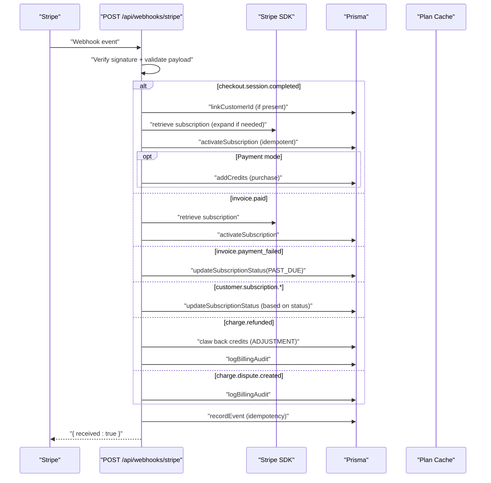

**Diagram sources**
- [route.ts:1-430](file://src/app/api/webhooks/stripe/route.ts#L1-L430)

**Section sources**
- [route.ts:1-430](file://src/app/api/webhooks/stripe/route.ts#L1-L430)

### Webhooks: Razorpay
- Endpoint: POST /api/webhooks/razorpay
- Security:
  - Verifies webhook signature
  - Constructs event ID from entity IDs for idempotency
- Events:
  - subscription.activated, subscription.charged: activate or renew subscription
  - subscription.pending: mark past_due
  - subscription.halted, subscription.cancelled: mark canceled
  - payment.captured, payment.failed: log status
- Notes:
  - Links customer to user via metadata if available
  - Resolves userId via metadata or DB lookup
  - Invalid signatures return 400
  - Misconfiguration returns 500

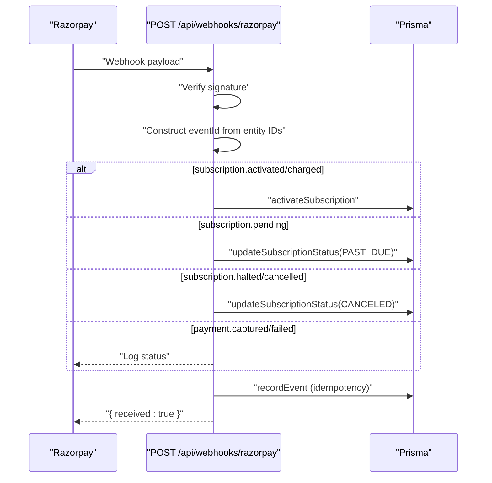

**Diagram sources**
- [route.ts:1-155](file://src/app/api/webhooks/razorpay/route.ts#L1-L155)

**Section sources**
- [route.ts:1-155](file://src/app/api/webhooks/razorpay/route.ts#L1-L155)

### Webhooks: AMI (Blog)
- Endpoint: POST /api/webhooks/ami
- Security:
  - Verifies HMAC signature
  - Idempotency via Redis key
- Events:
  - blog_post.published, blog_post.updated: sanitize content, upsert blog post, revalidate ISR paths, notify subscribers
  - blog_post.archived: archive post and revalidate paths
- Notes:
  - Content sanitized against XSS and prompt injection patterns
  - Slug resolution handles collisions
  - Subscriber notifications sent asynchronously
  - Invalid signatures return 401
  - Invalid JSON/payload returns 400
  - Misconfiguration returns 500

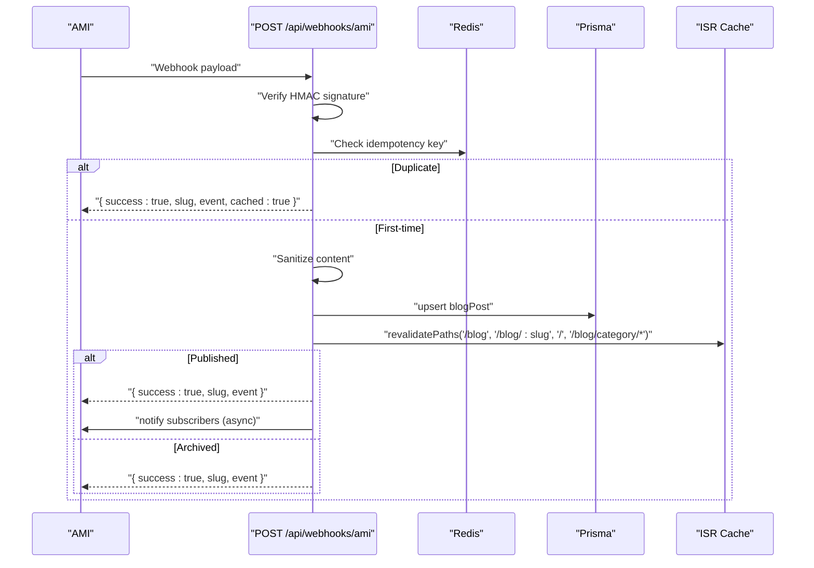

**Diagram sources**
- [route.ts:1-278](file://src/app/api/webhooks/ami/route.ts#L1-L278)

**Section sources**
- [route.ts:1-278](file://src/app/api/webhooks/ami/route.ts#L1-L278)

### Webhooks: Stripe Credits
- Endpoint: POST /api/webhooks/stripe-credits
- Security:
  - Verifies Stripe signature
  - Idempotency via referenceId (checkout session id)
- Behavior:
  - On checkout.session.completed, grants credits for a purchase
  - Skips if metadata missing or already processed
- Notes:
  - Transactional credit grant
  - Invalid signatures return 400
  - Misconfiguration returns 500

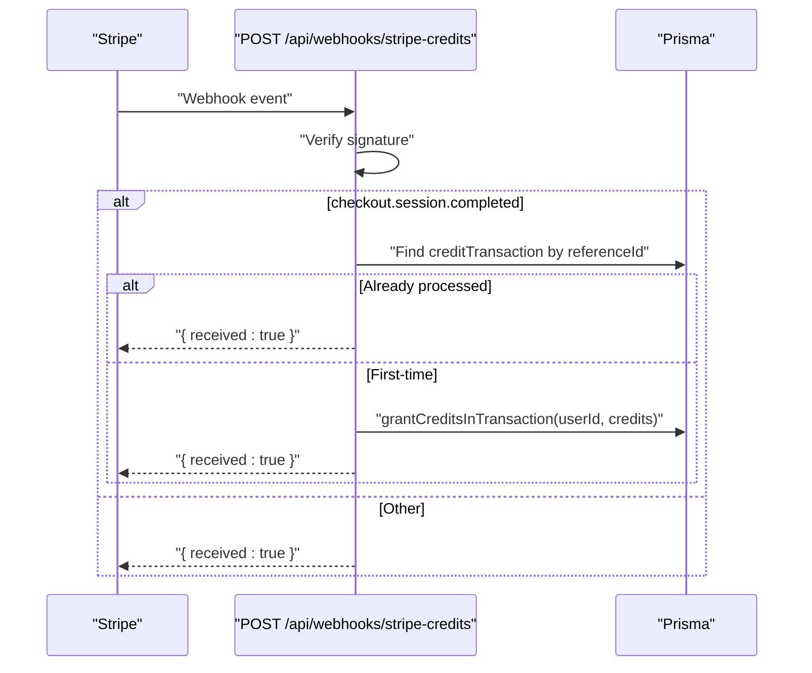

**Diagram sources**
- [route.ts:1-85](file://src/app/api/webhooks/stripe-credits/route.ts#L1-L85)

**Section sources**
- [route.ts:1-85](file://src/app/api/webhooks/stripe-credits/route.ts#L1-L85)

## Dependency Analysis
- Authentication:
  - Most endpoints rely on an auth() function to extract userId.
- Services:
  - DashboardHomeService, points.service, referral.service, waitlist.service, credit.service
- External Integrations:
  - Clerk (user lifecycle), Stripe (billing/subscriptions), Razorpay (subscriptions), AMI (blog)
- Storage:
  - Prisma for relational data; Redis for idempotency and UX event counters
- Logging:
  - Centralized logger with error sanitization

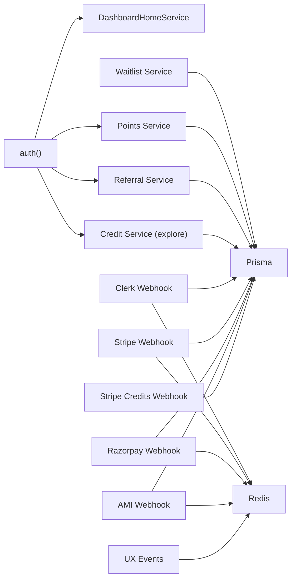

**Diagram sources**
- [route.ts:1-39](file://src/app/api/dashboard/home/route.ts#L1-L39)
- [route.ts:1-40](file://src/app/api/points/route.ts#L1-L40)
- [route.ts:1-31](file://src/app/api/referral/route.ts#L1-L31)
- [route.ts:1-47](file://src/app/api/waitlist/route.ts#L1-L47)
- [route.ts:1-41](file://src/app/api/credits/explore/route.ts#L1-L41)
- [route.ts:1-379](file://src/app/api/webhooks/clerk/route.ts#L1-L379)
- [route.ts:1-430](file://src/app/api/webhooks/stripe/route.ts#L1-L430)
- [route.ts:1-155](file://src/app/api/webhooks/razorpay/route.ts#L1-L155)
- [route.ts:1-278](file://src/app/api/webhooks/ami/route.ts#L1-L278)
- [route.ts:1-85](file://src/app/api/webhooks/stripe-credits/route.ts#L1-L85)

**Section sources**
- [route.ts:1-39](file://src/app/api/dashboard/home/route.ts#L1-L39)
- [route.ts:1-40](file://src/app/api/points/route.ts#L1-L40)
- [route.ts:1-31](file://src/app/api/referral/route.ts#L1-L31)
- [route.ts:1-47](file://src/app/api/waitlist/route.ts#L1-L47)
- [route.ts:1-41](file://src/app/api/credits/explore/route.ts#L1-L41)
- [route.ts:1-379](file://src/app/api/webhooks/clerk/route.ts#L1-L379)
- [route.ts:1-430](file://src/app/api/webhooks/stripe/route.ts#L1-L430)
- [route.ts:1-155](file://src/app/api/webhooks/razorpay/route.ts#L1-L155)
- [route.ts:1-278](file://src/app/api/webhooks/ami/route.ts#L1-L278)
- [route.ts:1-85](file://src/app/api/webhooks/stripe-credits/route.ts#L1-L85)

## Performance Considerations
- Caching:
  - Dashboard home uses cache-control headers to reduce load.
  - Points endpoint uses private, no-cache headers to avoid stale data.
- Asynchronous Notifications:
  - Welcome emails and blog subscriber notifications are fire-and-forget to avoid blocking requests.
- Batched Operations:
  - Blog subscriber notifications are streamed and batched to limit outbound requests.
- Idempotency:
  - Webhooks implement idempotency via Redis locks or event IDs to tolerate retries.
- Edge Runtime:
  - OG image generation runs in Edge runtime for low-latency image rendering.

[No sources needed since this section provides general guidance]

## Troubleshooting Guide
- Unauthorized Access
  - Symptom: 401 responses from protected endpoints.
  - Cause: Missing or invalid authentication context.
  - Action: Ensure auth() resolves a valid userId.

- Invalid Payload or Signature
  - Symptom: 400/401 responses from webhooks.
  - Cause: Missing or invalid headers/signatures.
  - Action: Verify webhook secrets and signature verification logic.

- Duplicate Processing
  - Symptom: Webhook appears to be processed multiple times.
  - Cause: Missing idempotency or retry storm.
  - Action: Confirm Redis idempotency keys and TTLs; inspect event recording.

- Missing Metadata
  - Symptom: Stripe credits webhook skips fulfillment.
  - Cause: Missing userId or credits in session metadata.
  - Action: Ensure checkout session metadata includes required fields.

- Redis Unavailable
  - Symptom: Webhook handler proceeds despite Redis failures.
  - Cause: Idempotency checks fail open.
  - Action: Monitor Redis availability; consider circuit breaker patterns.

**Section sources**
- [route.ts:1-379](file://src/app/api/webhooks/clerk/route.ts#L1-L379)
- [route.ts:1-430](file://src/app/api/webhooks/stripe/route.ts#L1-L430)
- [route.ts:1-155](file://src/app/api/webhooks/razorpay/route.ts#L1-L155)
- [route.ts:1-278](file://src/app/api/webhooks/ami/route.ts#L1-L278)
- [route.ts:1-85](file://src/app/api/webhooks/stripe-credits/route.ts#L1-L85)

## Conclusion
The Utility & System API suite provides robust capabilities for dashboard aggregation, points and gamification, referrals, waitlists, sharing, UX tracking, and secure webhooks for Clerk, Stripe, Razorpay, and AMI. The design emphasizes idempotency, transactional integrity, and asynchronous operations to ensure reliability and scalability. Integrators should focus on proper authentication, signature verification, and idempotency handling to achieve seamless operation.

[No sources needed since this section summarizes without analyzing specific files]

## Appendices

### API Definitions Summary
- Dashboard Home
  - Method: GET
  - Path: /api/dashboard/home
  - Query: region (US|IN)
  - Auth: Required
  - Headers: Cache-Control (private, max-age=60, stale-while-revalidate=120)
- Points
  - Method: GET
  - Path: /api/points
  - Auth: Required
  - Headers: Cache-Control (private, no-cache)
- Referral
  - Method: GET
  - Path: /api/referral
  - Auth: Required
- Waitlist
  - Method: POST
  - Path: /api/waitlist
  - Body: { email, firstName?, lastName?, source?, notes? }
  - Auth: Not required
- Share Card
  - Method: GET
  - Path: /api/share/card
  - Query: eyebrow, title, takeaway, context, scoreLabel?, scoreValue?
  - Auth: Not required
- CTA Event
  - Method: POST
  - Path: /api/ux/cta-event
  - Body: { source, eventType, actionCount, actionBucket, variant, ts? }
  - Auth: Optional
- Share Event
  - Method: POST
  - Path: /api/ux/share-event
  - Body: { action, kind, mode, path, ts? }
  - Auth: Optional
- Explore Credits
  - Method: POST
  - Path: /api/credits/explore
  - Body: { action, symbol?, id? }
  - Auth: Required
  - Headers: X-Credits-Remaining

### Webhook Endpoints
- Clerk
  - Method: POST
  - Path: /api/webhooks/clerk
  - Security: Svix signature verification, Redis idempotency lock
- Stripe
  - Method: POST
  - Path: /api/webhooks/stripe
  - Security: Signature verification, event recording idempotency
- Razorpay
  - Method: POST
  - Path: /api/webhooks/razorpay
  - Security: Signature verification, constructed event ID
- AMI
  - Method: POST
  - Path: /api/webhooks/ami
  - Security: HMAC signature verification, Redis idempotency key
- Stripe Credits
  - Method: POST
  - Path: /api/webhooks/stripe-credits
  - Security: Signature verification, referenceId idempotency

[No sources needed since this section aggregates previously cited information]