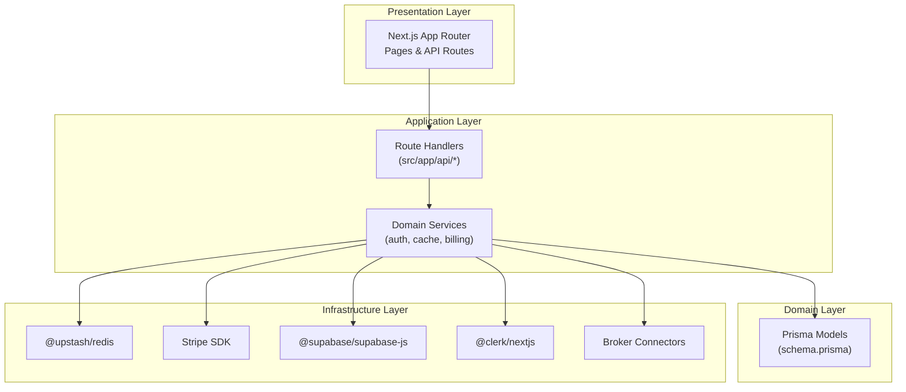
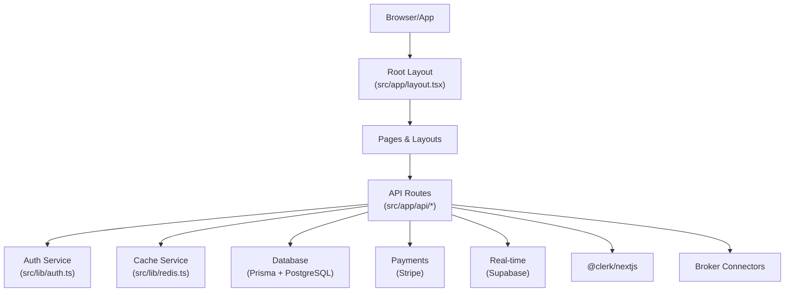
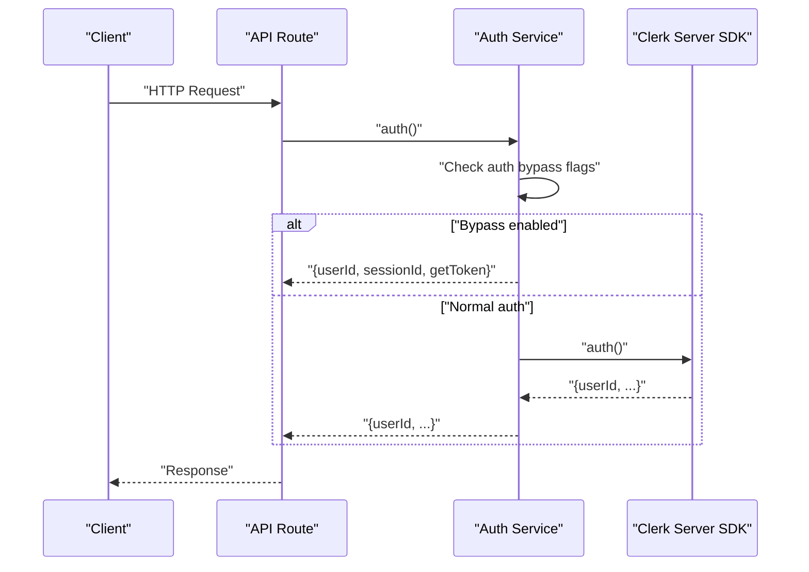
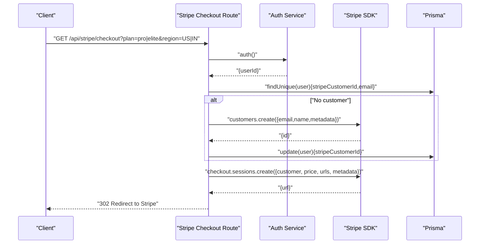
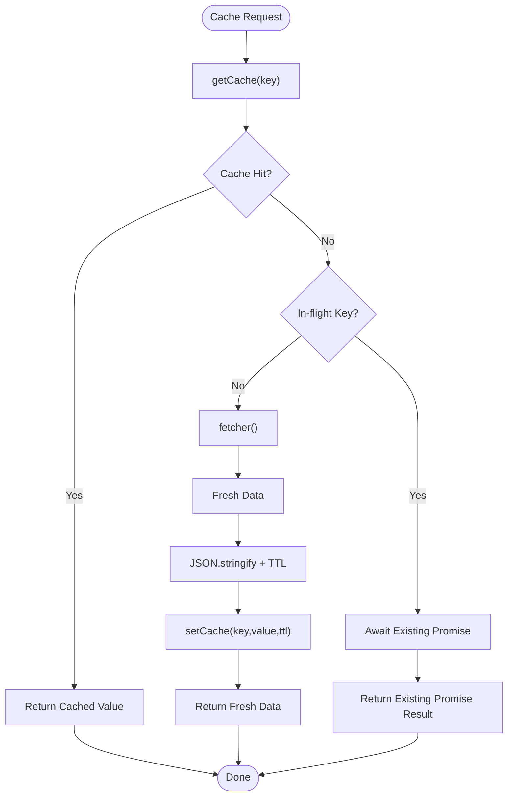
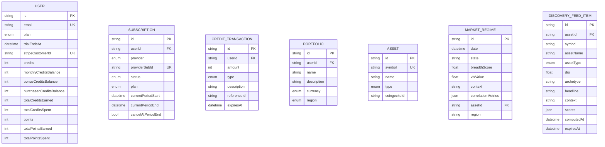
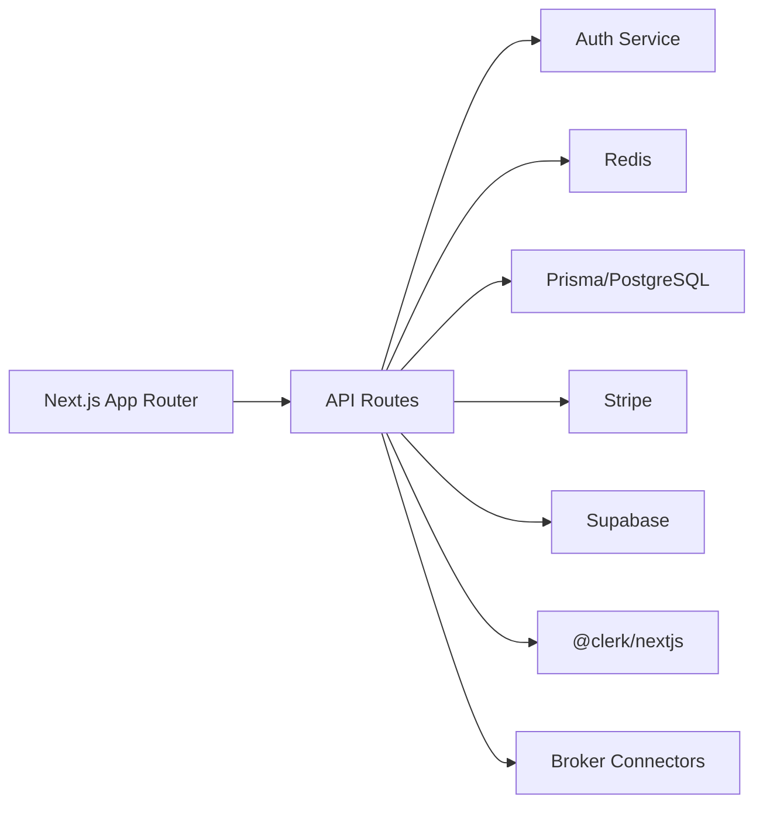

# Architecture & Design

<cite>
**Referenced Files in This Document**
- [package.json](file://package.json)
- [next.config.ts](file://next.config.ts)
- [prisma/schema.prisma](file://prisma/schema.prisma)
- [src/app/layout.tsx](file://src/app/layout.tsx)
- [src/lib/config.ts](file://src/lib/config.ts)
- [src/lib/auth.ts](file://src/lib/auth.ts)
- [src/lib/prisma.ts](file://src/lib/prisma.ts)
- [src/lib/redis.ts](file://src/lib/redis.ts)
- [src/lib/cache.ts](file://src/lib/cache.ts)
- [src/lib/cache-keys.ts](file://src/lib/cache-keys.ts)
- [src/lib/schemas.ts](file://src/lib/schemas.ts)
- [src/lib/supabase-realtime.ts](file://src/lib/supabase-realtime.ts)
- [src/lib/connectors/index.ts](file://src/lib/connectors/index.ts)
- [src/app/api/stripe/checkout/route.ts](file://src/app/api/stripe/checkout/route.ts)
</cite>

## Table of Contents
1. [Introduction](#introduction)
2. [Project Structure](#project-structure)
3. [Core Components](#core-components)
4. [Architecture Overview](#architecture-overview)
5. [Detailed Component Analysis](#detailed-component-analysis)
6. [Dependency Analysis](#dependency-analysis)
7. [Performance Considerations](#performance-considerations)
8. [Security Considerations](#security-considerations)
9. [Scalability Patterns](#scalability-patterns)
10. [Troubleshooting Guide](#troubleshooting-guide)
11. [Conclusion](#conclusion)

## Introduction
This document describes the system architecture of LyraAlpha, focusing on the frontend built with Next.js App Router, backend services, database layer, and external integrations. It explains the clean architecture pattern across presentation, application, domain, and infrastructure layers, and documents component relationships, data flows, and integration points. The technology stack includes TypeScript, Prisma ORM, PostgreSQL, Redis caching, Clerk authentication, Stripe payments, and Supabase real-time features.

## Project Structure
LyraAlpha follows a layered architecture:
- Presentation layer: Next.js App Router pages and API routes
- Application layer: Route handlers and service orchestrators
- Domain layer: Prisma models and business entities
- Infrastructure layer: Clients for Redis, Stripe, Supabase, and broker connectors

**Diagram sources**
- [src/app/layout.tsx:1-198](file://src/app/layout.tsx#L1-L198)
- [src/app/api/stripe/checkout/route.ts:1-108](file://src/app/api/stripe/checkout/route.ts#L1-L108)
- [prisma/schema.prisma:1-1046](file://prisma/schema.prisma#L1-L1046)
- [src/lib/redis.ts:1-455](file://src/lib/redis.ts#L1-L455)
- [src/lib/prisma.ts:1-69](file://src/lib/prisma.ts#L1-L69)
- [src/lib/supabase-realtime.ts:1-9](file://src/lib/supabase-realtime.ts#L1-L9)
- [src/lib/auth.ts:1-89](file://src/lib/auth.ts#L1-L89)
- [src/lib/connectors/index.ts:1-34](file://src/lib/connectors/index.ts#L1-L34)

**Section sources**
- [src/app/layout.tsx:1-198](file://src/app/layout.tsx#L1-L198)
- [next.config.ts:1-232](file://next.config.ts#L1-L232)

## Core Components
- Frontend (Next.js App Router): Provides pages, layouts, and client-side providers for theme, auth, and PWA.
- Backend services (API routes): Implement business capabilities such as Stripe checkout, user management, and data retrieval.
- Database layer (Prisma): Type-safe ORM mapping to PostgreSQL with models for users, subscriptions, credits, portfolios, and market data.
- Caching (Redis): High-performance caching with in-flight deduplication, stale-while-revalidate, and metrics.
- Authentication (Clerk): Server-side auth with development bypass and admin allowlist.
- Payments (Stripe): Checkout session creation and customer management.
- Real-time (Supabase): Optional real-time client initialization for browser-side subscriptions.
- Broker integrations: Pluggable connectors for exchanges and DEXs.

**Section sources**
- [package.json:1-125](file://package.json#L1-L125)
- [prisma/schema.prisma:1-1046](file://prisma/schema.prisma#L1-L1046)
- [src/lib/redis.ts:1-455](file://src/lib/redis.ts#L1-L455)
- [src/lib/auth.ts:1-89](file://src/lib/auth.ts#L1-L89)
- [src/lib/prisma.ts:1-69](file://src/lib/prisma.ts#L1-L69)
- [src/lib/supabase-realtime.ts:1-9](file://src/lib/supabase-realtime.ts#L1-L9)
- [src/lib/connectors/index.ts:1-34](file://src/lib/connectors/index.ts#L1-L34)

## Architecture Overview
LyraAlpha employs a clean architecture:
- Presentation: Next.js App Router pages and API routes
- Application: Route handlers orchestrate domain actions and coordinate infrastructure
- Domain: Prisma models define entities and relationships
- Infrastructure: Redis, Stripe, Supabase, Clerk, and broker connectors

**Diagram sources**
- [src/app/layout.tsx:1-198](file://src/app/layout.tsx#L1-L198)
- [src/app/api/stripe/checkout/route.ts:1-108](file://src/app/api/stripe/checkout/route.ts#L1-L108)
- [src/lib/auth.ts:1-89](file://src/lib/auth.ts#L1-L89)
- [src/lib/redis.ts:1-455](file://src/lib/redis.ts#L1-L455)
- [src/lib/prisma.ts:1-69](file://src/lib/prisma.ts#L1-L69)
- [src/lib/supabase-realtime.ts:1-9](file://src/lib/supabase-realtime.ts#L1-L9)
- [src/lib/connectors/index.ts:1-34](file://src/lib/connectors/index.ts#L1-L34)

## Detailed Component Analysis

### Authentication and Authorization (Clerk)
- Server-side auth with optional development bypass and admin allowlist caching.
- Auth context resolution supports explicit user ID and plan-based seeding for E2E tests.

**Diagram sources**
- [src/lib/auth.ts:1-89](file://src/lib/auth.ts#L1-L89)

**Section sources**
- [src/lib/auth.ts:1-89](file://src/lib/auth.ts#L1-L89)

### Payments (Stripe Checkout)
- Creates Stripe checkout sessions for subscription upgrades, manages customer records, and persists customer IDs to the database.

**Diagram sources**
- [src/app/api/stripe/checkout/route.ts:1-108](file://src/app/api/stripe/checkout/route.ts#L1-L108)

**Section sources**
- [src/app/api/stripe/checkout/route.ts:1-108](file://src/app/api/stripe/checkout/route.ts#L1-L108)

### Caching Strategy (Redis)
- Centralized caching with automatic serialization/deserialization, date revival, in-flight request deduplication, and stale-while-revalidate.
- Metrics recording and pipeline health tracking.

**Diagram sources**
- [src/lib/redis.ts:142-373](file://src/lib/redis.ts#L142-L373)

**Section sources**
- [src/lib/redis.ts:1-455](file://src/lib/redis.ts#L1-L455)
- [src/lib/cache-keys.ts:1-36](file://src/lib/cache-keys.ts#L1-L36)
- [src/lib/cache.ts:1-21](file://src/lib/cache.ts#L1-L21)

### Database Layer (Prisma + PostgreSQL)
- Strongly-typed models for users, subscriptions, credits, portfolios, market regimes, and discovery feeds.
- Connection pooling optimized for serverless with separate adapters for pooled and direct connections.

**Diagram sources**
- [prisma/schema.prisma:1-1046](file://prisma/schema.prisma#L1-L1046)

**Section sources**
- [prisma/schema.prisma:1-1046](file://prisma/schema.prisma#L1-L1046)
- [src/lib/prisma.ts:1-69](file://src/lib/prisma.ts#L1-L69)

### Real-time Integrations (Supabase)
- Optional Supabase client initialization for real-time features in the browser.

**Section sources**
- [src/lib/supabase-realtime.ts:1-9](file://src/lib/supabase-realtime.ts#L1-L9)

### Broker Integrations
- Pluggable connector registry for exchanges and DEXs with standardized schemas for normalization and deduplication.

**Section sources**
- [src/lib/connectors/index.ts:1-34](file://src/lib/connectors/index.ts#L1-L34)
- [src/lib/schemas.ts:248-539](file://src/lib/schemas.ts#L248-L539)

## Dependency Analysis
- Frontend depends on Next.js App Router and providers for theme, auth, and PWA.
- API routes depend on auth, cache, Prisma, Stripe, and optional Supabase.
- Prisma models define domain entities and relationships.
- Redis provides caching and metrics.
- Clerk manages authentication.
- Stripe handles payments.
- Supabase enables real-time features.
- Broker connectors encapsulate external APIs.

**Diagram sources**
- [src/app/layout.tsx:1-198](file://src/app/layout.tsx#L1-L198)
- [src/app/api/stripe/checkout/route.ts:1-108](file://src/app/api/stripe/checkout/route.ts#L1-L108)
- [src/lib/redis.ts:1-455](file://src/lib/redis.ts#L1-L455)
- [src/lib/prisma.ts:1-69](file://src/lib/prisma.ts#L1-L69)
- [src/lib/supabase-realtime.ts:1-9](file://src/lib/supabase-realtime.ts#L1-L9)
- [src/lib/auth.ts:1-89](file://src/lib/auth.ts#L1-L89)
- [src/lib/connectors/index.ts:1-34](file://src/lib/connectors/index.ts#L1-L34)

**Section sources**
- [package.json:1-125](file://package.json#L1-L125)
- [next.config.ts:1-232](file://next.config.ts#L1-L232)

## Performance Considerations
- Connection pooling: Prisma uses a pooled adapter for serverless concurrency and a direct adapter for migrations/scripts, with SSL configuration for Supabase.
- Caching: Redis with in-flight deduplication, stale-while-revalidate, and metrics to reduce latency and thundering herds.
- Serialization: Consistent JSON serialization/deserialization and date revival to avoid parsing overhead.
- Route-level caching: Next.js cache strategy for high-latency database queries with tags and TTL.
- CDN and cache headers: Next.js headers configuration enforces no-store for user-scoped data and selective caching for public endpoints.

**Section sources**
- [src/lib/prisma.ts:1-69](file://src/lib/prisma.ts#L1-L69)
- [src/lib/redis.ts:1-455](file://src/lib/redis.ts#L1-L455)
- [src/lib/cache.ts:1-21](file://src/lib/cache.ts#L1-L21)
- [next.config.ts:152-214](file://next.config.ts#L152-L214)

## Security Considerations
- Environment validation at startup to prevent misconfiguration.
- Strict CSP and security headers enforced via Next.js headers configuration.
- Allowed origins for server actions during development and production hardening.
- Clerk-managed authentication with optional development bypass for E2E tests.
- Rate limiting and idempotency considerations for Redis-backed deduplication and webhook handling.

**Section sources**
- [src/app/layout.tsx:1-198](file://src/app/layout.tsx#L1-L198)
- [next.config.ts:17-45](file://next.config.ts#L17-L45)
- [src/lib/auth.ts:1-89](file://src/lib/auth.ts#L1-L89)
- [src/lib/redis.ts:218-245](file://src/lib/redis.ts#L218-L245)

## Scalability Patterns
- Serverless-first design with Prisma pooling and Redis caching.
- In-flight request deduplication to prevent thundering herds under load.
- Pipeline metrics and cache statistics for observability.
- CDN and cache headers to minimize origin load.
- Modular connector architecture for extensibility across brokerages and DEXs.

**Section sources**
- [src/lib/prisma.ts:1-69](file://src/lib/prisma.ts#L1-L69)
- [src/lib/redis.ts:328-373](file://src/lib/redis.ts#L328-L373)
- [next.config.ts:152-214](file://next.config.ts#L152-L214)
- [src/lib/connectors/index.ts:1-34](file://src/lib/connectors/index.ts#L1-L34)

## Troubleshooting Guide
- Redis initialization failures: The client falls back to a no-op implementation and logs warnings; verify UPSTASH_REDIS_REST_URL and UPSTASH_REDIS_REST_TOKEN.
- Stripe checkout session creation: Ensure STRIPE_SECRET_KEY is present and environment-specific price IDs are configured; customer creation and persistence are handled with logging.
- Prisma connection issues: Verify DATABASE_URL/DIRECT_URL and SSL settings; adjust pool sizes according to Supabase usage.
- Clerk auth bypass: Confirm environment flags and seeded user plan availability; fallback to sentinel user ID if needed.
- Supabase real-time: Ensure NEXT_PUBLIC_SUPABASE_URL and NEXT_PUBLIC_SUPABASE_ANON_KEY are set; client is conditionally initialized.

**Section sources**
- [src/lib/redis.ts:49-67](file://src/lib/redis.ts#L49-L67)
- [src/app/api/stripe/checkout/route.ts:12-17](file://src/app/api/stripe/checkout/route.ts#L12-L17)
- [src/lib/prisma.ts:23-42](file://src/lib/prisma.ts#L23-L42)
- [src/lib/auth.ts:38-86](file://src/lib/auth.ts#L38-L86)
- [src/lib/supabase-realtime.ts:1-9](file://src/lib/supabase-realtime.ts#L1-L9)

## Conclusion
LyraAlpha’s architecture cleanly separates concerns across presentation, application, domain, and infrastructure layers. The system leverages Next.js App Router for the frontend, robust backend services for business logic, Prisma for type-safe data access, Redis for performance, Clerk for authentication, Stripe for payments, and Supabase for real-time features. The modular connector architecture and caching strategies support scalability and maintainability.