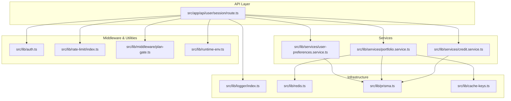
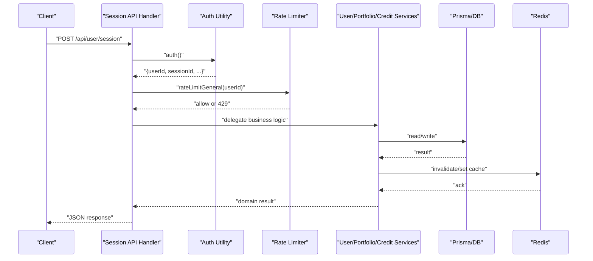
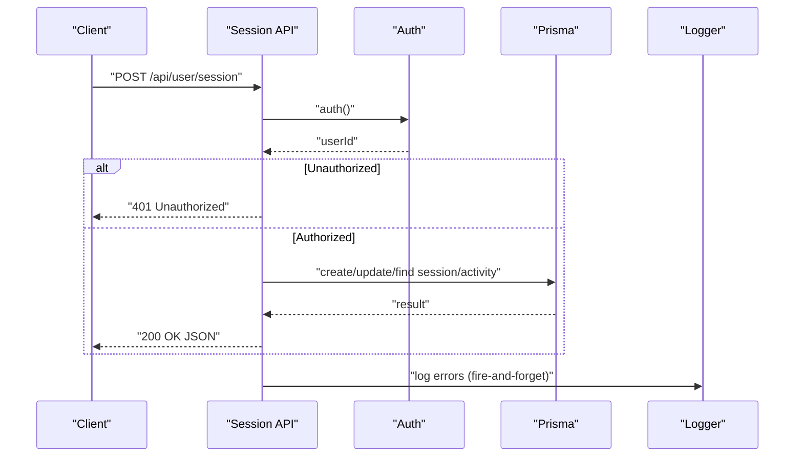
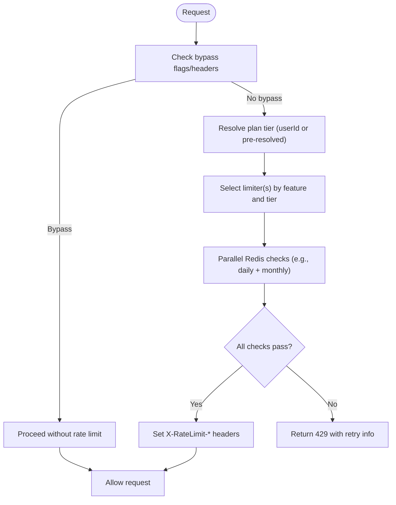
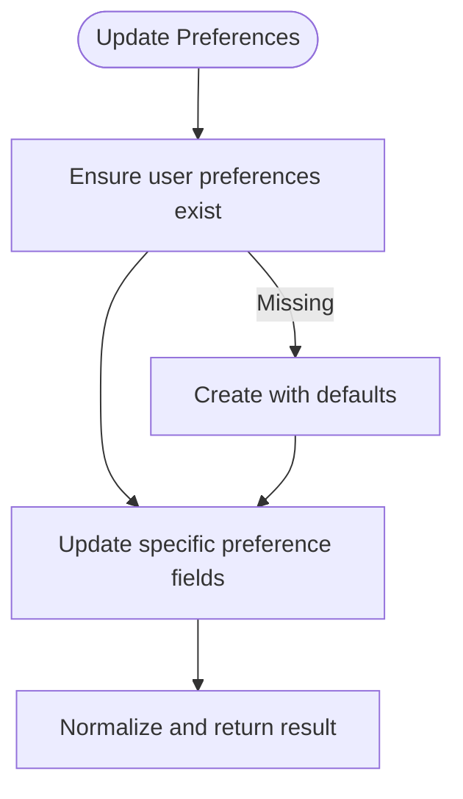
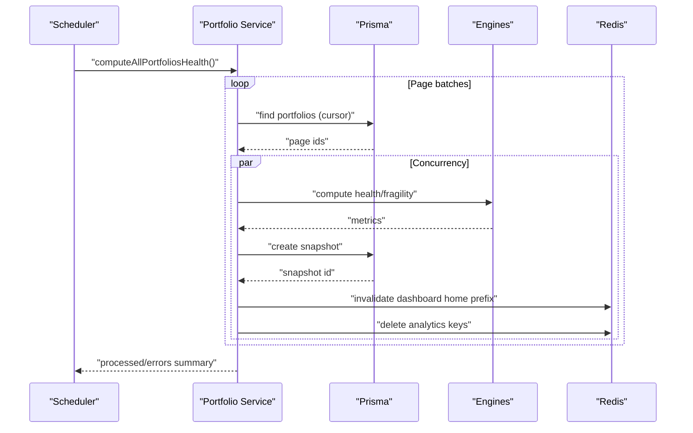
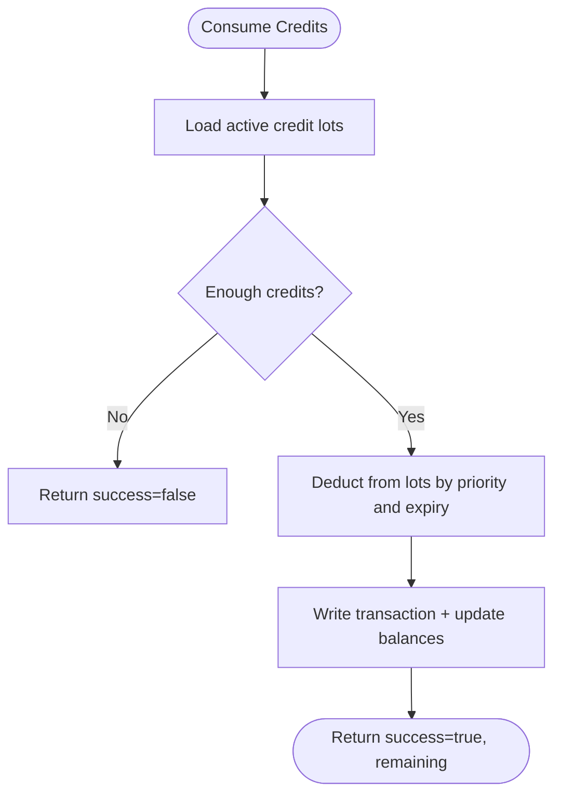
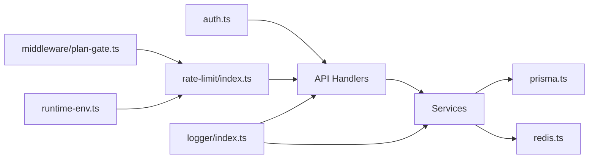

# Backend Services

<cite>
**Referenced Files in This Document**
- [src/lib/auth.ts](file://src/lib/auth.ts)
- [src/lib/services/user-preferences.service.ts](file://src/lib/services/user-preferences.service.ts)
- [src/lib/services/portfolio.service.ts](file://src/lib/services/portfolio.service.ts)
- [src/lib/services/credit.service.ts](file://src/lib/services/credit.service.ts)
- [src/lib/rate-limit/index.ts](file://src/lib/rate-limit/index.ts)
- [src/lib/logger/index.ts](file://src/lib/logger/index.ts)
- [src/app/api/user/session/route.ts](file://src/app/api/user/session/route.ts)
- [src/lib/api-response.ts](file://src/lib/api-response.ts)
- [src/lib/fire-and-forget.ts](file://src/lib/fire-and-forget.ts)
- [src/lib/cache-keys.ts](file://src/lib/cache-keys.ts)
- [src/lib/redis.ts](file://src/lib/redis.ts)
- [src/lib/prisma.ts](file://src/lib/prisma.ts)
- [src/lib/schemas.ts](file://src/lib/schemas.ts)
- [src/lib/validation.ts](file://src/lib/validation.ts)
- [src/lib/utils.ts](file://src/lib/utils.ts)
- [src/lib/telemetry.ts](file://src/lib/telemetry.ts)
- [src/lib/runtime-env.ts](file://src/lib/runtime-env.ts)
- [src/lib/middleware/plan-gate.ts](file://src/lib/middleware/plan-gate.ts)
- [src/lib/engines/portfolio-health.ts](file://src/lib/engines/portfolio-health.ts)
- [src/lib/engines/portfolio-fragility.ts](file://src/lib/engines/portfolio-fragility.ts)
- [src/lib/engines/portfolio-intelligence.ts](file://src/lib/engines/portfolio-intelligence.ts)
- [src/lib/engines/portfolio-utils.ts](file://src/lib/engines/portfolio-utils.ts)
- [src/lib/plans/facts.ts](file://src/lib/plans/facts.ts)
- [src/lib/credits/cost.ts](file://src/lib/credits/cost.ts)
- [src/lib/notification-preferences.ts](file://src/lib/notification-preferences.ts)
- [src/lib/utils/ensure-user.ts](file://src/lib/utils/ensure-user.ts)
- [src/lib/logger/utils.ts](file://src/lib/logger/utils.ts)
</cite>

## Table of Contents
1. [Introduction](#introduction)
2. [Project Structure](#project-structure)
3. [Core Components](#core-components)
4. [Architecture Overview](#architecture-overview)
5. [Detailed Component Analysis](#detailed-component-analysis)
6. [Dependency Analysis](#dependency-analysis)
7. [Performance Considerations](#performance-considerations)
8. [Troubleshooting Guide](#troubleshooting-guide)
9. [Conclusion](#conclusion)

## Introduction
This document describes LyraAlpha’s backend services architecture with a focus on the service layer pattern, API endpoint organization, middleware stack, authentication and authorization, session management, business logic, error handling, request/response processing, rate limiting, logging, caching, and scalability. It synthesizes the codebase’s modular services, robust middleware, and pragmatic engineering choices to provide a clear understanding for both technical and non-technical readers.

## Project Structure
LyraAlpha’s backend is primarily implemented as Next.js App Router API handlers under src/app/api, backed by a service layer in src/lib/services. Supporting libraries provide authentication, rate limiting, logging, caching, database access, and telemetry. The structure emphasizes separation of concerns:
- Authentication and authorization: centralized in a single auth utility
- Business logic: encapsulated in domain-specific services
- API endpoints: thin handlers delegating to services
- Middleware: rate limiting, plan gating, and environment-aware toggles
- Observability: structured logging, telemetry, and fire-and-forget error reporting

**Diagram sources**
- [src/app/api/user/session/route.ts:1-115](file://src/app/api/user/session/route.ts#L1-L115)
- [src/lib/services/user-preferences.service.ts:1-177](file://src/lib/services/user-preferences.service.ts#L1-L177)
- [src/lib/services/portfolio.service.ts:1-364](file://src/lib/services/portfolio.service.ts#L1-L364)
- [src/lib/services/credit.service.ts:1-455](file://src/lib/services/credit.service.ts#L1-L455)
- [src/lib/auth.ts:1-89](file://src/lib/auth.ts#L1-L89)
- [src/lib/rate-limit/index.ts:1-372](file://src/lib/rate-limit/index.ts#L1-L372)
- [src/lib/middleware/plan-gate.ts](file://src/lib/middleware/plan-gate.ts)
- [src/lib/runtime-env.ts](file://src/lib/runtime-env.ts)
- [src/lib/logger/index.ts:1-91](file://src/lib/logger/index.ts#L1-L91)
- [src/lib/redis.ts](file://src/lib/redis.ts)
- [src/lib/prisma.ts](file://src/lib/prisma.ts)
- [src/lib/cache-keys.ts](file://src/lib/cache-keys.ts)

**Section sources**
- [src/app/api/user/session/route.ts:1-115](file://src/app/api/user/session/route.ts#L1-L115)
- [src/lib/auth.ts:1-89](file://src/lib/auth.ts#L1-L89)
- [src/lib/rate-limit/index.ts:1-372](file://src/lib/rate-limit/index.ts#L1-L372)
- [src/lib/logger/index.ts:1-91](file://src/lib/logger/index.ts#L1-L91)

## Core Components
- Authentication and Authorization
  - Centralized auth utility wraps Clerk-based auth with optional development bypass and admin allowlist caching.
  - Provides privileged email checks and deterministic test user resolution for e2e/dev scenarios.
- Service Layer
  - User Preferences: defaults, normalization, CRUD for notification and dashboard preferences.
  - Portfolio: computes health, fragility, and intelligence metrics; persists snapshots; invalidates caches.
  - Credits: multi-bucket credit accounting, expiry, grants, consumption, and package retrieval with caching.
- Middleware Stack
  - Rate limiting: per-feature windows with timeouts and fail-open/fail-close policies; supports plan-based tiers and bypass mechanisms.
  - Plan gating: resolves user plan for rate-limiting and feature access.
  - Environment toggles: auth bypass and rate limit bypass via environment and headers.
- Logging and Observability
  - Structured logging with redaction and environment-aware formatting.
  - Telemetry helpers for timing operations.
  - Fire-and-forget error logging for non-fatal background tasks.
- Request/Response Processing
  - Standardized API error responses and consistent HTTP semantics across endpoints.
- Caching and Persistence
  - Redis-backed cache keys and invalidation helpers.
  - Prisma client for relational data access and transactions.

**Section sources**
- [src/lib/auth.ts:1-89](file://src/lib/auth.ts#L1-L89)
- [src/lib/services/user-preferences.service.ts:1-177](file://src/lib/services/user-preferences.service.ts#L1-L177)
- [src/lib/services/portfolio.service.ts:1-364](file://src/lib/services/portfolio.service.ts#L1-L364)
- [src/lib/services/credit.service.ts:1-455](file://src/lib/services/credit.service.ts#L1-L455)
- [src/lib/rate-limit/index.ts:1-372](file://src/lib/rate-limit/index.ts#L1-L372)
- [src/lib/logger/index.ts:1-91](file://src/lib/logger/index.ts#L1-L91)
- [src/lib/api-response.ts](file://src/lib/api-response.ts)
- [src/lib/fire-and-forget.ts](file://src/lib/fire-and-forget.ts)
- [src/lib/cache-keys.ts](file://src/lib/cache-keys.ts)
- [src/lib/redis.ts](file://src/lib/redis.ts)
- [src/lib/prisma.ts](file://src/lib/prisma.ts)
- [src/lib/telemetry.ts](file://src/lib/telemetry.ts)
- [src/lib/middleware/plan-gate.ts](file://src/lib/middleware/plan-gate.ts)
- [src/lib/runtime-env.ts](file://src/lib/runtime-env.ts)

## Architecture Overview
The backend follows a layered architecture:
- API handlers orchestrate requests, enforce auth and rate limits, and delegate to services.
- Services encapsulate domain logic, coordinate external integrations, and manage persistence.
- Middleware provides cross-cutting concerns like rate limiting and plan-based access.
- Infrastructure libraries supply logging, caching, database access, and telemetry.

**Diagram sources**
- [src/app/api/user/session/route.ts:1-115](file://src/app/api/user/session/route.ts#L1-L115)
- [src/lib/auth.ts:1-89](file://src/lib/auth.ts#L1-L89)
- [src/lib/rate-limit/index.ts:1-372](file://src/lib/rate-limit/index.ts#L1-L372)
- [src/lib/services/user-preferences.service.ts:1-177](file://src/lib/services/user-preferences.service.ts#L1-L177)
- [src/lib/services/portfolio.service.ts:1-364](file://src/lib/services/portfolio.service.ts#L1-L364)
- [src/lib/services/credit.service.ts:1-455](file://src/lib/services/credit.service.ts#L1-L455)
- [src/lib/prisma.ts](file://src/lib/prisma.ts)
- [src/lib/redis.ts](file://src/lib/redis.ts)

## Detailed Component Analysis

### Authentication and Session Management
- Authentication
  - Wraps Clerk server auth with optional bypass for e2e/dev using environment variables and plan-based seeding.
  - Admin allowlist is cached with TTL for performance and refresh on change.
- Session API
  - Supports start, heartbeat, end, and track actions for user sessions and activity events.
  - Enforces ownership via userId and performs parallel updates for activity tracking.
  - Uses standardized API error responses and sanitized logging.

**Diagram sources**
- [src/app/api/user/session/route.ts:1-115](file://src/app/api/user/session/route.ts#L1-L115)
- [src/lib/auth.ts:1-89](file://src/lib/auth.ts#L1-L89)
- [src/lib/logger/index.ts:1-91](file://src/lib/logger/index.ts#L1-L91)
- [src/lib/fire-and-forget.ts](file://src/lib/fire-and-forget.ts)

**Section sources**
- [src/lib/auth.ts:1-89](file://src/lib/auth.ts#L1-L89)
- [src/app/api/user/session/route.ts:1-115](file://src/app/api/user/session/route.ts#L1-L115)

### Rate Limiting Pipeline
- Strategy
  - Per-feature rate limiters with configurable windows and plan-based tiers.
  - Parallel Redis checks for daily and monthly chat limits; short bursts for public chat.
  - Timeout protection with fail-open for UX on timeouts; fail-close for availability.
  - Bypass via environment and headers; auth bypass attempts restricted separately.
- Implementation highlights
  - Discriminated union for plan argument to avoid ambiguity.
  - Telemetry around limiter operations.
  - Dedicated info endpoint for admin/debug.

**Diagram sources**
- [src/lib/rate-limit/index.ts:1-372](file://src/lib/rate-limit/index.ts#L1-L372)
- [src/lib/middleware/plan-gate.ts](file://src/lib/middleware/plan-gate.ts)
- [src/lib/runtime-env.ts](file://src/lib/runtime-env.ts)

**Section sources**
- [src/lib/rate-limit/index.ts:1-372](file://src/lib/rate-limit/index.ts#L1-L372)

### User Preferences Service
- Responsibilities
  - Ensures user preferences exist with defaults and normalizes notification preferences.
  - Updates notification preferences, dashboard mode, blog subscription, and onboarding state.
  - Handles missing preference records gracefully with retries.
- Data Access
  - Uses Prisma client with targeted selects and normalized updates.

**Diagram sources**
- [src/lib/services/user-preferences.service.ts:1-177](file://src/lib/services/user-preferences.service.ts#L1-L177)

**Section sources**
- [src/lib/services/user-preferences.service.ts:1-177](file://src/lib/services/user-preferences.service.ts#L1-L177)

### Portfolio Intelligence Service
- Responsibilities
  - Computes health, fragility, and intelligence metrics from portfolio holdings.
  - Builds risk metrics including regime alignment and sector concentration.
  - Persists health snapshots and prunes older ones.
  - Invalidates dashboard home cache and clears analytics cache.
  - Batch processes portfolios with concurrency and error accumulation.
- Data Flow
  - Loads portfolio with holdings and asset scores.
  - Transforms inputs for engine computations.
  - Aggregates results and writes snapshots with Prisma.
  - Triggers cache invalidation and cleanup.

**Diagram sources**
- [src/lib/services/portfolio.service.ts:1-364](file://src/lib/services/portfolio.service.ts#L1-L364)
- [src/lib/engines/portfolio-health.ts](file://src/lib/engines/portfolio-health.ts)
- [src/lib/engines/portfolio-fragility.ts](file://src/lib/engines/portfolio-fragility.ts)
- [src/lib/engines/portfolio-intelligence.ts](file://src/lib/engines/portfolio-intelligence.ts)
- [src/lib/engines/portfolio-utils.ts](file://src/lib/engines/portfolio-utils.ts)
- [src/lib/cache-keys.ts](file://src/lib/cache-keys.ts)
- [src/lib/redis.ts](file://src/lib/redis.ts)
- [src/lib/prisma.ts](file://src/lib/prisma.ts)

**Section sources**
- [src/lib/services/portfolio.service.ts:1-364](file://src/lib/services/portfolio.service.ts#L1-L364)

### Credits Service
- Responsibilities
  - Multi-bucket credit accounting (monthly, bonus, purchased) with expiry rules.
  - Consumes credits respecting bucket priority and expiry; grants credits atomically.
  - Resets monthly credits per plan; reads credit packages with caching.
  - Provides read-only balance checks for hot-path gates.
- Data Model Concepts
  - CreditLot: per-lot remaining amount, bucket, expiry.
  - CreditTransaction: audit trail of grants/spends.
  - User aggregates: denormalized balances persisted via transactions.

**Diagram sources**
- [src/lib/services/credit.service.ts:1-455](file://src/lib/services/credit.service.ts#L1-L455)
- [src/lib/plans/facts.ts](file://src/lib/plans/facts.ts)
- [src/lib/credits/cost.ts](file://src/lib/credits/cost.ts)
- [src/lib/prisma.ts](file://src/lib/prisma.ts)
- [src/lib/redis.ts](file://src/lib/redis.ts)

**Section sources**
- [src/lib/services/credit.service.ts:1-455](file://src/lib/services/credit.service.ts#L1-L455)

### Logging and Error Handling
- Logging
  - Pino-based logger with environment-aware formatting and sensitive field redaction.
  - Child loggers per service for contextual tracing.
- Error Handling
  - Standardized API error responses for HTTP semantics.
  - Fire-and-forget error logging for non-critical background tasks.
  - Sanitized error payloads for observability without leaking secrets.

**Section sources**
- [src/lib/logger/index.ts:1-91](file://src/lib/logger/index.ts#L1-L91)
- [src/lib/api-response.ts](file://src/lib/api-response.ts)
- [src/lib/fire-and-forget.ts](file://src/lib/fire-and-forget.ts)
- [src/lib/logger/utils.ts](file://src/lib/logger/utils.ts)

### Request/Response Processing
- API handlers consistently:
  - Authenticate requests.
  - Parse and validate bodies.
  - Delegate to services.
  - Return JSON responses with appropriate status codes.
  - Log errors and return standardized error responses.

**Section sources**
- [src/app/api/user/session/route.ts:1-115](file://src/app/api/user/session/route.ts#L1-L115)
- [src/lib/api-response.ts](file://src/lib/api-response.ts)
- [src/lib/validation.ts](file://src/lib/validation.ts)
- [src/lib/schemas.ts](file://src/lib/schemas.ts)

## Dependency Analysis
- Cohesion and Coupling
  - Services are cohesive around domains (preferences, portfolio, credits) and depend on Prisma and Redis.
  - API handlers depend on auth and rate limiting, and delegate to services.
  - Middleware utilities are reused across handlers for plan-based logic and environment toggles.
- External Dependencies
  - Clerk for authentication.
  - Redis for rate limiting and caching.
  - Prisma for relational data access and transactions.
- Potential Circularities
  - No evident circular imports among services; handlers import services and utilities.

**Diagram sources**
- [src/lib/auth.ts:1-89](file://src/lib/auth.ts#L1-L89)
- [src/lib/rate-limit/index.ts:1-372](file://src/lib/rate-limit/index.ts#L1-L372)
- [src/lib/middleware/plan-gate.ts](file://src/lib/middleware/plan-gate.ts)
- [src/lib/runtime-env.ts](file://src/lib/runtime-env.ts)
- [src/lib/logger/index.ts:1-91](file://src/lib/logger/index.ts#L1-L91)
- [src/lib/prisma.ts](file://src/lib/prisma.ts)
- [src/lib/redis.ts](file://src/lib/redis.ts)

**Section sources**
- [src/lib/auth.ts:1-89](file://src/lib/auth.ts#L1-L89)
- [src/lib/rate-limit/index.ts:1-372](file://src/lib/rate-limit/index.ts#L1-L372)
- [src/lib/logger/index.ts:1-91](file://src/lib/logger/index.ts#L1-L91)

## Performance Considerations
- Concurrency and Batching
  - Portfolio service batches portfolio IDs and processes in controlled concurrency to avoid memory pressure and improve throughput.
- Caching and Cache Invalidation
  - Redis cache keys and invalidation helpers minimize repeated computation and stale data exposure.
  - Credit packages are cached with TTL to reduce DB load.
- Transactions and Atomicity
  - Credit operations and snapshot creation use database transactions to maintain consistency.
- Telemetry and Monitoring
  - Timing wrappers around rate limiter operations aid in diagnosing latency hotspots.
- Environment-aware Behavior
  - Admin allowlist caching and auth bypass enable efficient local development and e2e testing without compromising production safeguards.

**Section sources**
- [src/lib/services/portfolio.service.ts:320-364](file://src/lib/services/portfolio.service.ts#L320-L364)
- [src/lib/cache-keys.ts](file://src/lib/cache-keys.ts)
- [src/lib/redis.ts](file://src/lib/redis.ts)
- [src/lib/services/credit.service.ts:444-455](file://src/lib/services/credit.service.ts#L444-L455)
- [src/lib/telemetry.ts](file://src/lib/telemetry.ts)
- [src/lib/auth.ts:8-30](file://src/lib/auth.ts#L8-L30)

## Troubleshooting Guide
- Authentication Issues
  - Verify auth bypass environment variables and headers; confirm admin allowlist cache refresh.
- Rate Limiting Problems
  - Check bypass flags and headers; inspect limiter timeouts and plan tiers.
  - Use the rate limit info endpoint for diagnostics.
- Session API Errors
  - Confirm userId binding and ownership checks; review activity tracking and heartbeat updates.
- Credit Consumption Failures
  - Inspect bucket priorities and expiries; verify sufficient balance and transaction isolation.
- Logging and Observability
  - Review structured logs for sanitized error payloads; ensure redaction paths are effective.

**Section sources**
- [src/lib/auth.ts:32-88](file://src/lib/auth.ts#L32-L88)
- [src/lib/rate-limit/index.ts:22-80](file://src/lib/rate-limit/index.ts#L22-L80)
- [src/app/api/user/session/route.ts:13-92](file://src/app/api/user/session/route.ts#L13-L92)
- [src/lib/services/credit.service.ts:332-385](file://src/lib/services/credit.service.ts#L332-L385)
- [src/lib/logger/index.ts:1-91](file://src/lib/logger/index.ts#L1-L91)

## Conclusion
LyraAlpha’s backend employs a clean service layer pattern with robust middleware, strong authentication and authorization controls, and pragmatic caching and transactional strategies. The architecture balances developer productivity (e2e/dev bypass, environment toggles) with operational reliability (rate limiting, logging, telemetry). The documented components and flows provide a foundation for extending features, optimizing performance, and maintaining scalability.