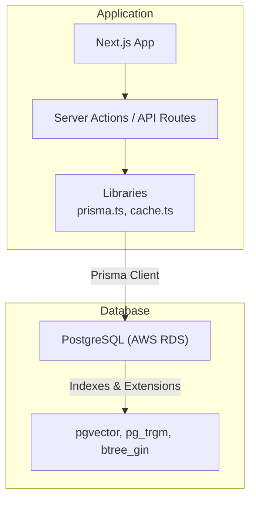
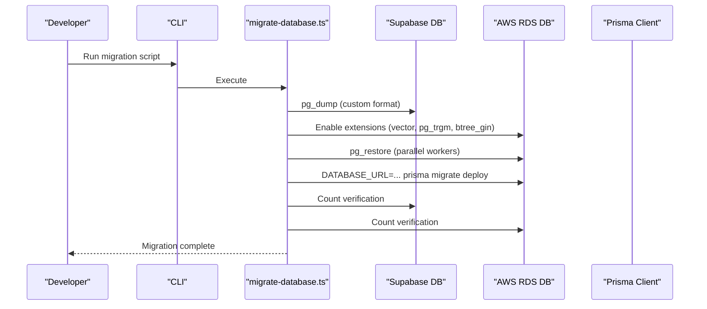
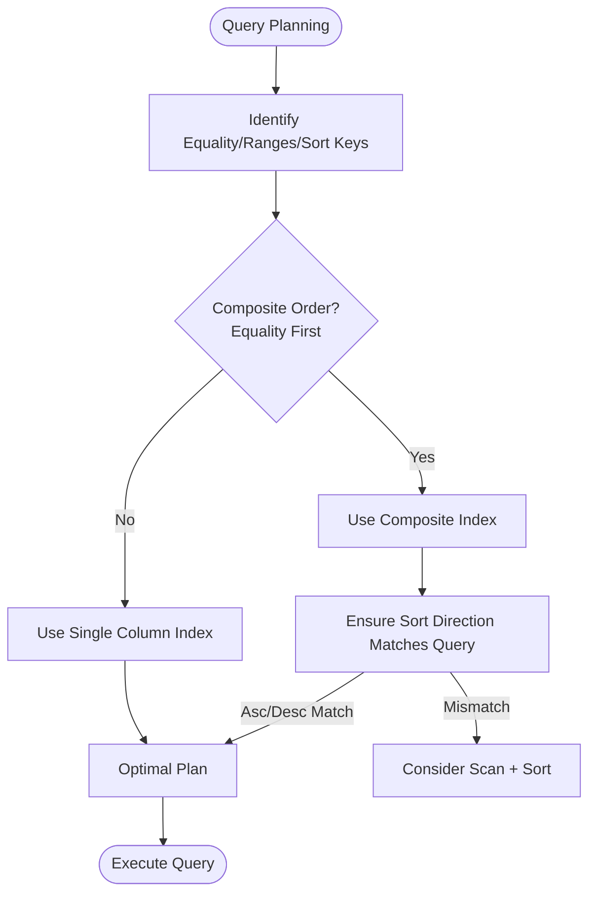
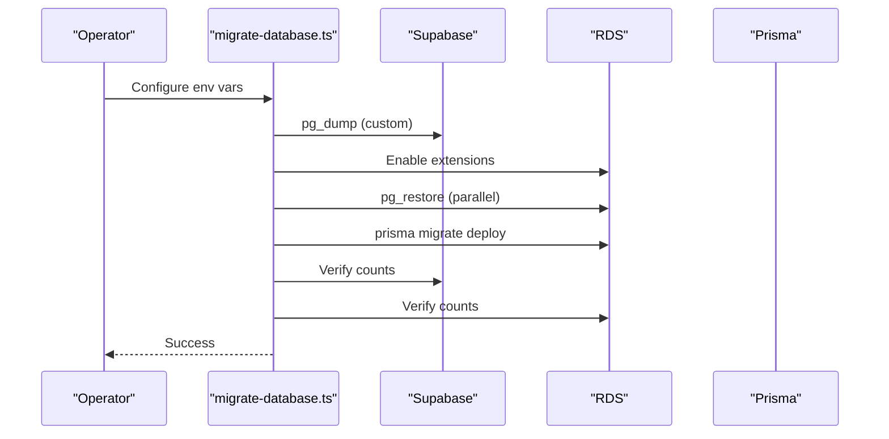
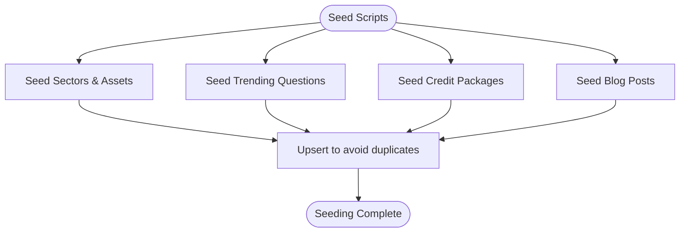
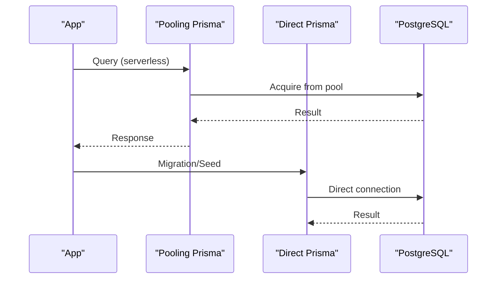
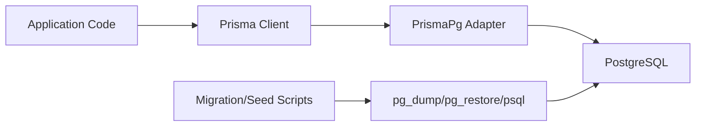

# Database Design

<cite>
**Referenced Files in This Document**
- [schema.prisma](file://prisma/schema.prisma)
- [prisma.ts](file://src/lib/prisma.ts)
- [seed.ts](file://prisma/seed.ts)
- [seed-credits.ts](file://prisma/seed-credits.ts)
- [seed-questions.ts](file://prisma/seed-questions.ts)
- [migrate-database.ts](file://scripts/migrate-database.ts)
- [migration_lock.toml](file://prisma/migrations/migration_lock.toml)
- [v27.sql](file://prisma/manual/v27.sql)
- [rebaseline-reconcile.sql](file://prisma/manual/rebaseline-reconcile.sql)
- [bonus_credits.sql](file://prisma/manual/bonus_credits.sql)
- [cache.ts](file://src/lib/cache.ts)
</cite>

## Table of Contents
1. [Introduction](#introduction)
2. [Project Structure](#project-structure)
3. [Core Components](#core-components)
4. [Architecture Overview](#architecture-overview)
5. [Detailed Component Analysis](#detailed-component-analysis)
6. [Dependency Analysis](#dependency-analysis)
7. [Performance Considerations](#performance-considerations)
8. [Troubleshooting Guide](#troubleshooting-guide)
9. [Conclusion](#conclusion)
10. [Appendices](#appendices)

## Introduction
This document describes LyraAlpha’s database design and data architecture with a focus on the Prisma ORM implementation, schema definitions, entity relationships, migration and seeding strategies, indexing and query optimization, data integrity constraints, connection management, transaction handling, caching integration, and operational patterns for data lifecycle and schema evolution.

## Project Structure
The database layer is centered around:
- Prisma schema defining models, enums, relations, and indexes
- Prisma client initialization with connection pooling and SSL configuration
- Seeding scripts for static content and initial datasets
- Migration orchestration for zero-downtime schema evolution
- Manual SQL patches for targeted adjustments and performance tuning
- Application-level caching integration for high-latency reads

**Diagram sources**
- [prisma.ts:1-69](file://src/lib/prisma.ts#L1-L69)
- [schema.prisma:1-120](file://prisma/schema.prisma#L1-L120)

**Section sources**
- [prisma.ts:1-69](file://src/lib/prisma.ts#L1-L69)
- [schema.prisma:1-120](file://prisma/schema.prisma#L1-L120)

## Core Components
- Prisma schema defines entities (models), enums, relations, and indexes. It also declares vector embeddings and JSON fields for AI and analytics workloads.
- Prisma client is configured with:
  - Pooling adapter for serverless environments (Supavisor port 6543)
  - Direct adapter for migrations/scripts (port 5432)
  - SSL with rejectUnauthorized disabled for Supabase self-signed certs
  - Environment-controlled pool sizes and logging levels
- Seeding scripts populate sectors, assets, trending questions, and blog posts using upsert patterns to avoid duplication.
- Migration pipeline supports:
  - pg_dump/pg_restore for bulk migration
  - Prisma migration deployment
  - Post-migration verification and extension setup
- Manual SQL scripts handle targeted schema adjustments and index creation.

**Section sources**
- [schema.prisma:1-120](file://prisma/schema.prisma#L1-L120)
- [prisma.ts:1-69](file://src/lib/prisma.ts#L1-L69)
- [seed.ts:1-392](file://prisma/seed.ts#L1-L392)
- [seed-credits.ts:1-29](file://prisma/seed-credits.ts#L1-L29)
- [seed-questions.ts:1-75](file://prisma/seed-questions.ts#L1-L75)
- [migrate-database.ts:1-272](file://scripts/migrate-database.ts#L1-L272)

## Architecture Overview
The system uses Prisma ORM to manage schema, relations, and migrations, with PostgreSQL as the primary datastore and optional vector embeddings for AI features. Connection pooling is tuned for serverless concurrency, and migrations are executed via a robust script that leverages native PostgreSQL tools.

**Diagram sources**
- [migrate-database.ts:1-272](file://scripts/migrate-database.ts#L1-L272)

**Section sources**
- [migrate-database.ts:1-272](file://scripts/migrate-database.ts#L1-L272)

## Detailed Component Analysis

### Prisma Schema and Entities
Key entities include Users, Assets, Market Regimes, Discovery Feed Items, Gamification and XP systems, Portfolios, Watchlists, Payments, and Notifications. Relations are defined with foreign keys and referential actions (Cascade, SetNull). Enums define statuses and types consistently across models.

```mermaid
erDiagram
USER {
string id PK
string email UK
string stripeCustomerId UK
int credits
int points
timestamp createdAt
timestamp updatedAt
}
ASSET {
string id PK
string symbol UK
string name
enum type
float price
float changePercent
timestamp lastPriceUpdate
string region
string coingeckoId
}
ASSET_SCORE {
string id PK
string assetId FK
enum type
float value
timestamp date
}
MARKET_REGIME {
string id PK
string assetId FK
date date
string state
string region
}
DISCOVERY_FEED_ITEM {
string id PK
string assetId FK
string symbol
string headline
float drs
boolean isEliteOnly
boolean isSuppressed
timestamp computedAt
timestamp expiresAt
}
PORTFOLIO {
string id PK
string userId FK
string name
string region
boolean isDefault
timestamp createdAt
timestamp updatedAt
}
PORTFOLIO_HOLDING {
string id PK
string portfolioId FK
string assetId FK
float quantity
float costBasis
}
WATCHLIST_ITEM {
string id PK
string userId FK
string assetId FK
string symbol
string region
timestamp createdAt
}
SUBSCRIPTION {
string id PK
string userId FK
enum provider
string providerSubId UK
enum status
enum plan
timestamp currentPeriodStart
timestamp currentPeriodEnd
}
PAYMENT_EVENT {
string id PK
enum provider
string eventId UK
string eventType
string userId FK
string status
json payload
timestamp processedAt
}
NOTIFICATION {
string id PK
string userId FK
string type
string title
string body
boolean read
timestamp createdAt
}
USER_PREFERENCE {
string id PK
string userId UK
enum preferredRegion
enum experienceLevel
}
CREDIT_TRANSACTION {
string id PK
string userId FK
int amount
enum type
timestamp createdAt
}
CREDIT_LOT {
string id PK
string userId FK
string transactionId FK
enum bucket
int originalAmount
int remainingAmount
timestamp expiresAt
}
CREDIT_PACKAGE {
string id PK
string name
int credits
int bonusCredits
float priceUsd
string stripePriceId
boolean isPopular
boolean isActive
int sortOrder
}
XP_TRANSACTION {
string id PK
string userId FK
int amount
string action
timestamp createdAt
}
POINT_TRANSACTION {
string id PK
string userId FK
int amount
enum source
enum redemption
timestamp createdAt
}
SUPPORT_CONVERSATION {
string id PK
string userId FK
string status
timestamp createdAt
}
KNOWLEDGE_DOC {
string id PK
string content
json metadata
vector embedding
timestamp createdAt
}
AI_REQUEST_LOG {
string id PK
string userId FK
string promptId FK
string inputQuery
string outputResponse
int tokensUsed
enum embeddingStatus
timestamp createdAt
}
PROMPT_DEFINITION {
string id PK
string version UK
string systemPrompt
string safetyPrompt
boolean isActive
}
USER_SESSION {
string id PK
string userId FK
string deviceInfo
string ipAddress
timestamp startedAt
timestamp lastActivityAt
timestamp endedAt
boolean isActive
}
USER_ACTIVITY_EVENT {
string id PK
string userId FK
string sessionId
string eventType
string path
json metadata
timestamp createdAt
}
USER_MEMORY_NOTE {
string id PK
string userId FK
string source
string scope
string text
timestamp createdAt
timestamp updatedAt
}
USER_PROGRESS {
string id PK
string userId UK
int totalXp
int level
int streak
float xpMultiplier
}
USER_BADGE {
string id PK
string userId FK
string badgeSlug
timestamp earnedAt
}
SECTOR {
string id PK
string slug UK
string name
boolean isPremium
timestamp createdAt
timestamp updatedAt
}
ASSET_SECTOR {
string id PK
string assetId FK
string sectorId FK
float relevanceScore
float eligibilityScore
boolean isActive
timestamp firstIncludedAt
}
TRENDS_QUESTION {
string id PK
string question
string category
int displayOrder
boolean isActive
int clickCount
timestamp createdAt
timestamp updatedAt
}
HISTORICAL_ANALOG {
string id PK
string region
timestamp windowStart
timestamp windowEnd
string regimeState
float breadthScore
float volatilityLevel
vector embedding
timestamp createdAt
}
PRICE_HISTORY {
string id PK
string assetId FK
date date
float open
float high
float low
float close
float volume
}
MULTI_HORISON_REGIME {
string id PK
date date
json current
json shortTerm
json mediumTerm
json longTerm
float transitionProbability
string transitionDirection
json leadingIndicators
string region
}
LYRA_ANALYSIS {
string id PK
date date
string title
string content
string type
json metadata
}
LYRA_FEEDBACK {
string id PK
string userId FK
string answerId
int vote
string query
string responseSnippet
string symbol
string queryTier
string model
timestamp createdAt
}
EVIDENCE {
string id PK
string assetId FK
string sourceUrl
string sourceName
string summary
date publishedAt
float sentimentScore
timestamp createdAt
}
INSTITUTIONAL_EVENT {
string id PK
string assetId FK
string type
string title
string description
string severity
date date
json metadata
}
USER_PREFERENCE }|--|| USER : "has one"
ASSET_SCORE }|--|| ASSET : "belongs to"
MARKET_REGIME }|--|| ASSET : "belongs to"
DISCOVERY_FEED_ITEM }|--|| ASSET : "belongs to"
PORTFOLIO_HOLDING }|--|| PORTFOLIO : "belongs to"
PORTFOLIO_HOLDING }|--|| ASSET : "belongs to"
WATCHLIST_ITEM }|--|| USER : "belongs to"
WATCHLIST_ITEM }|--|| ASSET : "belongs to"
SUBSCRIPTION }|--|| USER : "belongs to"
PAYMENT_EVENT }|--|| USER : "belongs to"
NOTIFICATION }|--|| USER : "belongs to"
CREDIT_TRANSACTION }|--|| USER : "belongs to"
CREDIT_LOT }|--|| USER : "belongs to"
CREDIT_LOT }|--|| CREDIT_TRANSACTION : "belongs to"
XP_TRANSACTION }|--|| USER : "belongs to"
POINT_TRANSACTION }|--|| USER : "belongs to"
SUPPORT_CONVERSATION }|--|| USER : "belongs to"
AI_REQUEST_LOG }|--|| USER : "belongs to"
AI_REQUEST_LOG }|--|| PROMPT_DEFINITION : "belongs to"
USER_SESSION }|--|| USER : "belongs to"
USER_ACTIVITY_EVENT }|--|| USER : "belongs to"
USER_MEMORY_NOTE }|--|| USER : "belongs to"
USER_PROGRESS }|--|| USER : "belongs to"
USER_BADGE }|--|| USER : "belongs to"
ASSET_SECTOR }|--|| ASSET : "belongs to"
ASSET_SECTOR }|--|| SECTOR : "belongs to"
EVIDENCE }|--|| ASSET : "belongs to"
INSTITUTIONAL_EVENT }|--|| ASSET : "belongs to"
```

**Diagram sources**
- [schema.prisma:23-794](file://prisma/schema.prisma#L23-L794)

**Section sources**
- [schema.prisma:23-794](file://prisma/schema.prisma#L23-L794)

### Indexing Strategy and Query Optimization
Indexes are strategically placed to optimize frequent queries:
- User-centric lookups: indexes on user identifiers and timestamps
- Asset analytics: composite indexes on region/type/lastPriceUpdate and compatibility metrics
- Discovery feed: multi-column indexes filtering by suppression, type, and computedAt
- Scores and regimes: indexes ordered by date desc for “latest” queries
- Embeddings: vector indexes for similarity search
- JSON and arrays: GIN indexes for fast filtering and containment
- Partial indexes: restrict to relevant subsets (e.g., unread notifications)
- Concurrent index creation: used during migrations to avoid blocking

**Diagram sources**
- [schema.prisma:117-123](file://prisma/schema.prisma#L117-L123)
- [schema.prisma:226-227](file://prisma/schema.prisma#L226-L227)
- [schema.prisma:378-379](file://prisma/schema.prisma#L378-L379)
- [v27.sql:16-24](file://prisma/manual/v27.sql#L16-L24)
- [rebaseline-reconcile.sql:1-6](file://prisma/manual/rebaseline-reconcile.sql#L1-L6)

**Section sources**
- [schema.prisma:117-123](file://prisma/schema.prisma#L117-L123)
- [schema.prisma:226-227](file://prisma/schema.prisma#L226-L227)
- [schema.prisma:378-379](file://prisma/schema.prisma#L378-L379)
- [v27.sql:16-24](file://prisma/manual/v27.sql#L16-L24)
- [rebaseline-reconcile.sql:1-6](file://prisma/manual/rebaseline-reconcile.sql#L1-L6)

### Migration Strategy
LyraAlpha employs a hybrid migration approach:
- Bulk migration using pg_dump/custom format and pg_restore with parallel workers
- Extension provisioning (vector, pg_trgm, btree_gin) on target RDS
- Prisma migration history deployment to align migration lock and schema state
- Row-count verification across tables to ensure data integrity
- Dry-run mode for validation prior to execution

**Diagram sources**
- [migrate-database.ts:1-272](file://scripts/migrate-database.ts#L1-L272)

**Section sources**
- [migrate-database.ts:1-272](file://scripts/migrate-database.ts#L1-L272)
- [migration_lock.toml:1-3](file://prisma/migrations/migration_lock.toml#L1-L3)

### Seeding Processes
Seeding is performed via dedicated scripts:
- Initial discovery universe: sectors, assets, and sector mappings using upserts
- Trending questions: curated list seeded with upserts
- Credit packages: predefined tiers with bonus credits and pricing
- Blog posts: static content upserted into the database for content management

**Diagram sources**
- [seed.ts:242-381](file://prisma/seed.ts#L242-L381)
- [seed-credits.ts:4-24](file://prisma/seed-credits.ts#L4-L24)
- [seed-questions.ts:36-60](file://prisma/seed-questions.ts#L36-L60)

**Section sources**
- [seed.ts:242-381](file://prisma/seed.ts#L242-L381)
- [seed-credits.ts:4-24](file://prisma/seed-credits.ts#L4-L24)
- [seed-questions.ts:36-60](file://prisma/seed-questions.ts#L36-L60)

### Data Integrity Constraints
- Unique constraints on identifiers (e.g., user email, stripe customer id, provider subscription id, prompt version)
- Composite unique constraints for regime snapshots and asset-sector mappings
- Not-null defaults for critical fields and enums
- Foreign keys with cascading deletes for child records and set-null for optional relations
- Vector embedding columns with explicit dimensions for similarity search
- JSON fields for flexible analytics and metadata storage

**Section sources**
- [schema.prisma:397-436](file://prisma/schema.prisma#L397-L436)
- [schema.prisma:259-261](file://prisma/schema.prisma#L259-L261)
- [schema.prisma:376-379](file://prisma/schema.prisma#L376-L379)
- [schema.prisma:42-48](file://prisma/schema.prisma#L42-L48)

### Business Rule Enforcement
- Credits and XP/points accounting with transaction logs and lot expiration
- Subscription lifecycle with status tracking and period boundaries
- Gamification mechanics with badges, XP transactions, and point redemptions
- Portfolio holdings with cost basis and quantity tracking
- Discovery feed suppression and eligibility controls
- Embedding status tracking for AI request logs

**Section sources**
- [schema.prisma:568-602](file://prisma/schema.prisma#L568-L602)
- [schema.prisma:701-726](file://prisma/schema.prisma#L701-L726)
- [schema.prisma:660-672](file://prisma/schema.prisma#L660-L672)
- [schema.prisma:499-517](file://prisma/schema.prisma#L499-L517)
- [schema.prisma:745-774](file://prisma/schema.prisma#L745-L774)
- [schema.prisma:23-57](file://prisma/schema.prisma#L23-L57)

### Database Connection Management and Transactions
- Two Prisma clients:
  - Pooling client for application logic (Supavisor port 6543) with configurable pool size
  - Direct client for migrations/scripts (port 5432) with smaller pool
- SSL configuration with rejectUnauthorized disabled for Supabase self-signed certificates
- Logging controlled by NODE_ENV
- Transactions are used implicitly by Prisma for upserts and batch operations; application-level transactions can be introduced as needed

**Diagram sources**
- [prisma.ts:29-65](file://src/lib/prisma.ts#L29-L65)

**Section sources**
- [prisma.ts:1-69](file://src/lib/prisma.ts#L1-L69)

### Caching Integration
Application-level caching is integrated to reduce database load for high-latency reads:
- Next.js unstable_cache wrapper with TTL and tags for revalidation
- Suitable for dashboard analytics, discovery feeds, and other periodic reads

**Section sources**
- [cache.ts:1-20](file://src/lib/cache.ts#L1-L20)

### Manual SQL Adjustments
Targeted schema changes and performance tuning are applied via manual SQL:
- Adding materialized analytics columns to Asset and creating supporting indexes
- Creating composite indexes for DiscoveryFeedItem and Portfolio
- Backfilling nullable columns and enforcing NOT NULL constraints

**Section sources**
- [v27.sql:1-31](file://prisma/manual/v27.sql#L1-L31)
- [rebaseline-reconcile.sql:1-6](file://prisma/manual/rebaseline-reconcile.sql#L1-L6)
- [bonus_credits.sql:1-42](file://prisma/manual/bonus_credits.sql#L1-L42)

## Dependency Analysis
- Application code depends on Prisma-generated client types and runtime
- Prisma client depends on PostgreSQL and configured adapters
- Migration scripts depend on native PostgreSQL tools (pg_dump, pg_restore, psql)
- Seeding scripts depend on Prisma direct client and static content sources

**Diagram sources**
- [prisma.ts:1-69](file://src/lib/prisma.ts#L1-L69)
- [migrate-database.ts:1-272](file://scripts/migrate-database.ts#L1-L272)

**Section sources**
- [prisma.ts:1-69](file://src/lib/prisma.ts#L1-L69)
- [migrate-database.ts:1-272](file://scripts/migrate-database.ts#L1-L272)

## Performance Considerations
- Connection pooling tuned for serverless concurrency; adjust pool sizes based on observed usage
- Parallel pg_restore for bulk migrations; ensure sufficient RDS resources
- Use composite indexes to match query filters and sort directions
- Prefer partial indexes for filtered subsets
- Leverage vector indexes for similarity search; maintain embedding status and retry logic
- Cache expensive reads with TTL and tags; invalidate on data changes
- Monitor slow queries and add missing indexes; use EXPLAIN/ANALYZE for tuning

[No sources needed since this section provides general guidance]

## Troubleshooting Guide
- Migration failures:
  - Verify environment variables for source/target databases
  - Confirm PostgreSQL tools availability and permissions
  - Review pg_restore warnings and resolve conflicts
  - Re-run Prisma migration deployment if schema drift occurs
- Connection issues:
  - Ensure SSL configuration matches Supabase requirements
  - Validate pool sizes and idle timeouts
  - Check for connection exhaustion under load
- Index performance:
  - Confirm index usage with EXPLAIN/ANALYZE
  - Recreate missing indexes or adjust composite ordering
- Data integrity:
  - Use upsert patterns to avoid duplicates
  - Enforce NOT NULL defaults and unique constraints
  - Validate row counts post-migration

**Section sources**
- [migrate-database.ts:232-272](file://scripts/migrate-database.ts#L232-L272)
- [prisma.ts:23-27](file://src/lib/prisma.ts#L23-L27)

## Conclusion
LyraAlpha’s database design leverages Prisma ORM for strong typing and migrations, PostgreSQL for reliability and vector extensions, and a robust migration pipeline using native PostgreSQL tools. Strategic indexing, connection pooling, and application-level caching deliver performance at scale. The combination of automated seeding and manual SQL adjustments enables precise control over schema evolution and data quality.

[No sources needed since this section summarizes without analyzing specific files]

## Appendices
- Operational checklist for migrations and schema changes
- Index naming conventions and maintenance procedures
- Backup and disaster recovery procedures

[No sources needed since this section provides general guidance]