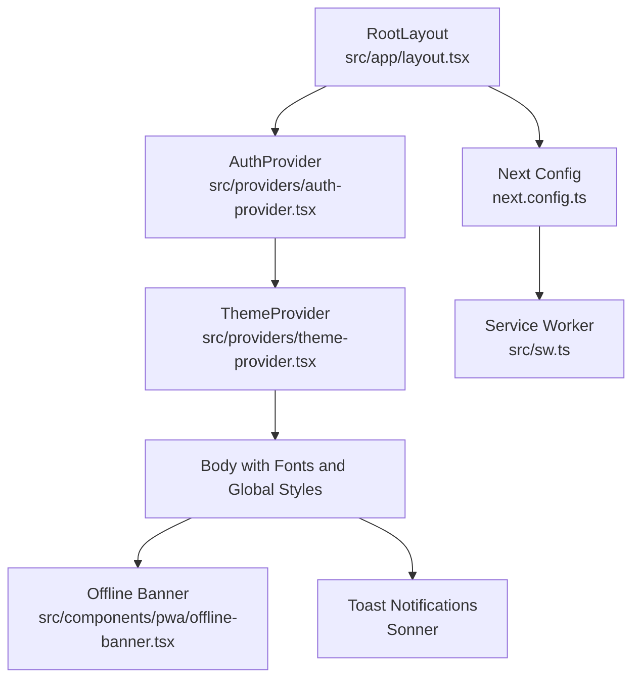
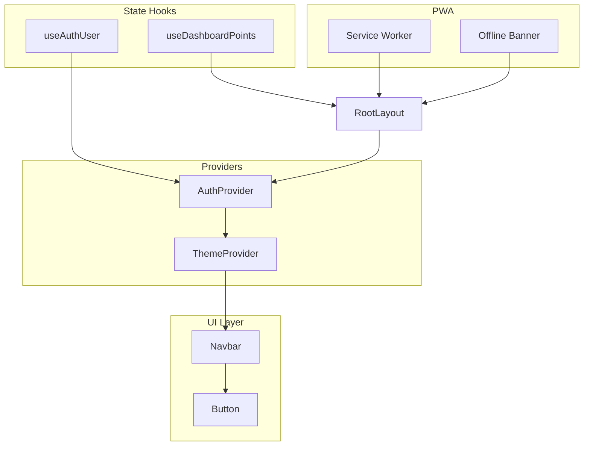
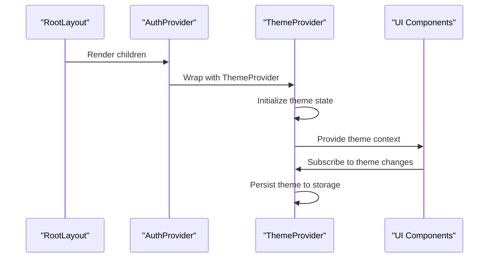
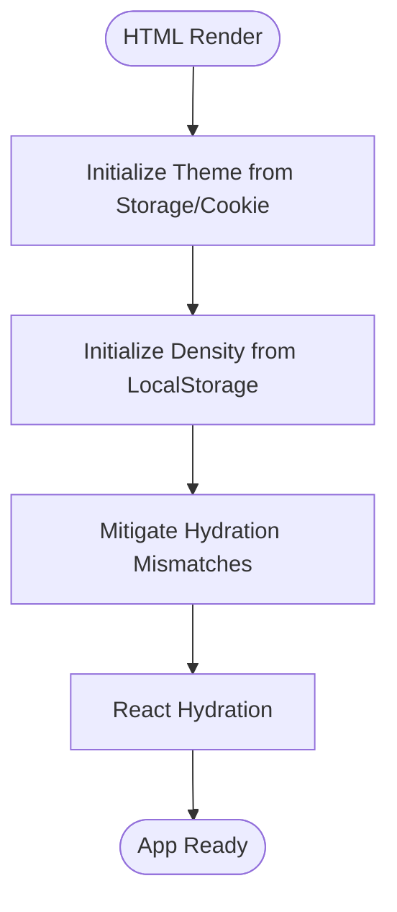
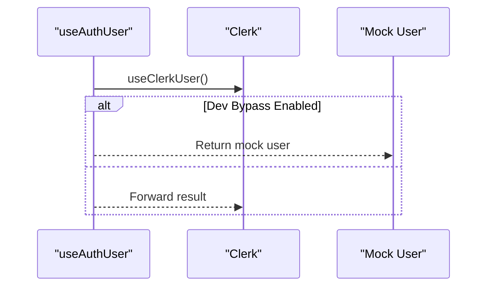
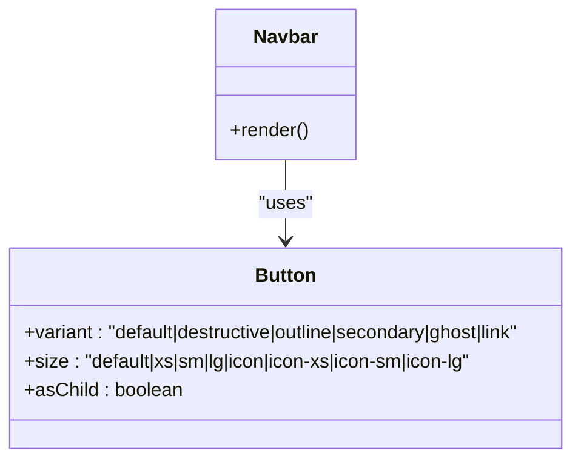
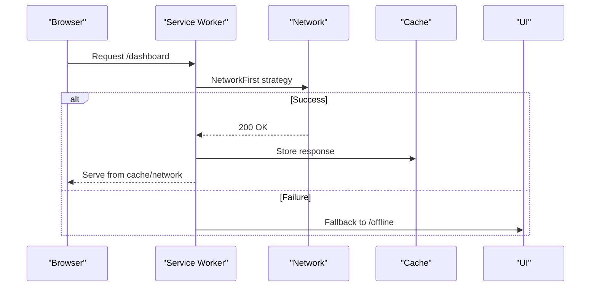
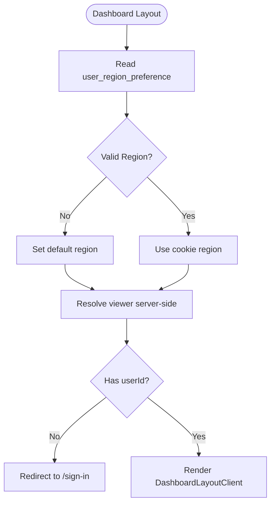
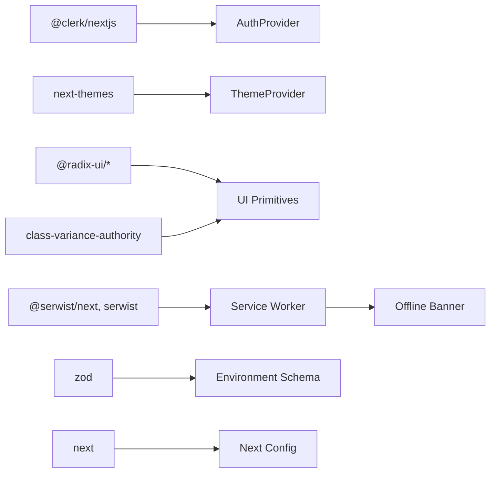

# Frontend Architecture

<cite>
**Referenced Files in This Document**
- [layout.tsx](file://src/app/layout.tsx)
- [auth-provider.tsx](file://src/providers/auth-provider.tsx)
- [theme-provider.tsx](file://src/providers/theme-provider.tsx)
- [next.config.ts](file://next.config.ts)
- [package.json](file://package.json)
- [sw.ts](file://src/sw.ts)
- [offline-banner.tsx](file://src/components/pwa/offline-banner.tsx)
- [use-auth-user.ts](file://src/hooks/use-auth-user.ts)
- [use-dashboard-points.ts](file://src/hooks/use-dashboard-points.ts)
- [schema.ts](file://src/lib/env/schema.ts)
- [button.tsx](file://src/components/ui/button.tsx)
- [Navbar.tsx](file://src/components/layout/Navbar.tsx)
- [layout.tsx](file://src/app/dashboard/layout.tsx)
- [cache.ts](file://src/lib/cache.ts)
</cite>

## Table of Contents
1. [Introduction](#introduction)
2. [Project Structure](#project-structure)
3. [Core Components](#core-components)
4. [Architecture Overview](#architecture-overview)
5. [Detailed Component Analysis](#detailed-component-analysis)
6. [Dependency Analysis](#dependency-analysis)
7. [Performance Considerations](#performance-considerations)
8. [Troubleshooting Guide](#troubleshooting-guide)
9. [Conclusion](#conclusion)

## Introduction
This document describes the frontend architecture of LyraAlpha’s Next.js application. It focuses on the App Router implementation, provider system, component hierarchy, state management patterns, design system, typography, responsive design, hydration handling, PWA capabilities, offline support, and performance optimizations including code splitting, lazy loading, and caching strategies.

## Project Structure
The application follows Next.js App Router conventions with a strict file-based routing model under src/app. Providers wrap the application shell to supply authentication and theme state globally. The UI library is built with Radix UI primitives and Tailwind CSS, while Clerk manages authentication. PWA and offline support are implemented via Serwist (workbox-like) service worker and a client-side offline banner.

**Diagram sources**
- [layout.tsx:79-197](file://src/app/layout.tsx#L79-L197)
- [auth-provider.tsx:5-11](file://src/providers/auth-provider.tsx#L5-L11)
- [theme-provider.tsx:19-29](file://src/providers/theme-provider.tsx#L19-L29)
- [next.config.ts:218-231](file://next.config.ts#L218-L231)
- [sw.ts:25-68](file://src/sw.ts#L25-L68)
- [offline-banner.tsx:7-46](file://src/components/pwa/offline-banner.tsx#L7-L46)

**Section sources**
- [layout.tsx:1-198](file://src/app/layout.tsx#L1-L198)
- [next.config.ts:1-232](file://next.config.ts#L1-L232)

## Core Components
- Root layout initializes environment validation, fonts, metadata, PWA manifests/icons, and global providers.
- AuthProvider wraps the app with Clerk for authentication.
- ThemeProvider persists and switches themes across sessions.
- OfflineBanner displays a transient offline indicator using Framer Motion animations.
- UI primitives (e.g., Button) use class variance authority and Radix UI slots for composability.
- Dashboard layout enforces authentication and region preferences via server-side logic.

**Section sources**
- [layout.tsx:1-198](file://src/app/layout.tsx#L1-L198)
- [auth-provider.tsx:1-12](file://src/providers/auth-provider.tsx#L1-L12)
- [theme-provider.tsx:1-30](file://src/providers/theme-provider.tsx#L1-L30)
- [offline-banner.tsx:1-47](file://src/components/pwa/offline-banner.tsx#L1-L47)
- [button.tsx:1-65](file://src/components/ui/button.tsx#L1-L65)
- [layout.tsx:1-50](file://src/app/dashboard/layout.tsx#L1-L50)

## Architecture Overview
The frontend architecture centers on:
- App Router with nested layouts and metadata.
- Provider chain: AuthProvider -> ThemeProvider -> Children.
- Hook-based state for authentication and dashboard points.
- Environment validation at startup.
- PWA and offline support via Serwist and a client-side banner.
- Caching strategies: SWR for client data, Next.js unstable_cache for server data, and Next.js headers for cache policies.

**Diagram sources**
- [layout.tsx:79-197](file://src/app/layout.tsx#L79-L197)
- [auth-provider.tsx:5-11](file://src/providers/auth-provider.tsx#L5-L11)
- [theme-provider.tsx:19-29](file://src/providers/theme-provider.tsx#L19-L29)
- [Navbar.tsx:9-53](file://src/components/layout/Navbar.tsx#L9-L53)
- [button.tsx:41-64](file://src/components/ui/button.tsx#L41-L64)
- [use-auth-user.ts:34-68](file://src/hooks/use-auth-user.ts#L34-L68)
- [use-dashboard-points.ts:59-81](file://src/hooks/use-dashboard-points.ts#L59-L81)
- [sw.ts:25-68](file://src/sw.ts#L25-L68)
- [offline-banner.tsx:7-46](file://src/components/pwa/offline-banner.tsx#L7-L46)

## Detailed Component Analysis

### Provider System: AuthProvider and ThemeProvider
- AuthProvider wraps the app with Clerk, configuring post-sign-out behavior and local Clerk JS path. This ensures authentication state is available to all client components.
- ThemeProvider integrates next-themes, persisting theme selection to localStorage and cookies, and controlling system preference behavior. A dedicated persistence component writes theme state on change.

**Diagram sources**
- [layout.tsx:159-193](file://src/app/layout.tsx#L159-L193)
- [auth-provider.tsx:5-11](file://src/providers/auth-provider.tsx#L5-L11)
- [theme-provider.tsx:19-29](file://src/providers/theme-provider.tsx#L19-L29)

**Section sources**
- [auth-provider.tsx:1-12](file://src/providers/auth-provider.tsx#L1-L12)
- [theme-provider.tsx:1-30](file://src/providers/theme-provider.tsx#L1-L30)
- [layout.tsx:159-193](file://src/app/layout.tsx#L159-L193)

### Hydration Handling and Density Initialization
- The root layout injects scripts to initialize theme and density preferences before React hydrates. A mitigation script removes extension-injected attributes to prevent hydration mismatches.
- The body uses a font variable class and accessibility skip-link targeting main content.

**Diagram sources**
- [layout.tsx:85-158](file://src/app/layout.tsx#L85-L158)

**Section sources**
- [layout.tsx:85-158](file://src/app/layout.tsx#L85-L158)

### Hook-Based State Management
- useAuthUser abstracts Clerk’s user state and supports a development bypass mode for local testing, returning a mock user when enabled.
- useDashboardPoints integrates SWR for data fetching with mounted guards, focus revalidation throttling, dedupe intervals, and keepPreviousData behavior.

**Diagram sources**
- [use-auth-user.ts:34-44](file://src/hooks/use-auth-user.ts#L34-L44)

**Section sources**
- [use-auth-user.ts:1-69](file://src/hooks/use-auth-user.ts#L1-L69)
- [use-dashboard-points.ts:1-82](file://src/hooks/use-dashboard-points.ts#L1-L82)

### Component Composition Patterns
- UI primitives (e.g., Button) use class variance authority and Radix UI slots to compose variants and sizes declaratively.
- Navbar composes links, branding, and auth controls into a cohesive surface component.

**Diagram sources**
- [button.tsx:41-64](file://src/components/ui/button.tsx#L41-L64)
- [Navbar.tsx:9-53](file://src/components/layout/Navbar.tsx#L9-L53)

**Section sources**
- [button.tsx:1-65](file://src/components/ui/button.tsx#L1-L65)
- [Navbar.tsx:1-54](file://src/components/layout/Navbar.tsx#L1-L54)

### Design System, Typography, and Responsive Approach
- Typography relies on Inter and Fira Code fonts loaded via next/font-google with CSS variables for swapping.
- Responsive design leverages Tailwind utilities and media queries; components adapt across breakpoints (e.g., logo variants for mobile/desktop).
- UI primitives expose consistent variants and sizes for predictable composition.

**Section sources**
- [layout.tsx:13-23](file://src/app/layout.tsx#L13-L23)
- [button.tsx:1-65](file://src/components/ui/button.tsx#L1-L65)
- [Navbar.tsx:1-54](file://src/components/layout/Navbar.tsx#L1-L54)

### PWA Capabilities and Offline Support
- Service worker is integrated via Serwist during production builds. It:
  - Skips caching for API routes and sensitive data.
  - Uses NetworkFirst strategy for dashboard pages with a short network timeout and success-response filtering.
  - Falls back to an offline page for document requests.
- Client-side OfflineBanner shows a transient offline indicator using Framer Motion.

**Diagram sources**
- [next.config.ts:223-231](file://next.config.ts#L223-L231)
- [sw.ts:30-68](file://src/sw.ts#L30-L68)
- [offline-banner.tsx:7-46](file://src/components/pwa/offline-banner.tsx#L7-L46)

**Section sources**
- [next.config.ts:218-231](file://next.config.ts#L218-L231)
- [sw.ts:1-119](file://src/sw.ts#L1-L119)
- [offline-banner.tsx:1-47](file://src/components/pwa/offline-banner.tsx#L1-L47)

### Authentication Gate and Server-Side Preferences
- The dashboard layout reads a user region preference from cookies, validates it against allowed regions, and redirects unauthenticated users to sign-in.
- Viewer information (plan, onboarding completion, user ID) is resolved server-side and passed to the client layout.

**Diagram sources**
- [layout.tsx:24-49](file://src/app/dashboard/layout.tsx#L24-L49)

**Section sources**
- [layout.tsx:1-50](file://src/app/dashboard/layout.tsx#L1-L50)

### Environment Validation and Security Headers
- Environment variables are validated at startup using Zod, ensuring required keys are present and formatted correctly.
- Next.js headers enforce strict CSP, HSTS in production, referrer policy, permissions policy, and tailored cache-control rules for API and dashboard routes.

**Section sources**
- [schema.ts:160-176](file://src/lib/env/schema.ts#L160-L176)
- [next.config.ts:17-45](file://next.config.ts#L17-L45)
- [next.config.ts:152-214](file://next.config.ts#L152-L214)

### Caching Strategies
- Client data caching uses SWR with deduplication, focus throttling, and keepPreviousData.
- Server data caching uses Next.js unstable_cache with TTL and tags for revalidation.
- Next.js headers define cache-control policies for API endpoints and dashboard pages.

**Section sources**
- [use-dashboard-points.ts:59-81](file://src/hooks/use-dashboard-points.ts#L59-L81)
- [cache.ts:10-20](file://src/lib/cache.ts#L10-L20)
- [next.config.ts:176-214](file://next.config.ts#L176-L214)

## Dependency Analysis
- Providers depend on Clerk and next-themes; UI components depend on Radix UI and class variance authority.
- PWA relies on Serwist and Next.js integration for production builds.
- Environment validation depends on Zod; Next config defines image hosts and security policies.

**Diagram sources**
- [auth-provider.tsx:3-11](file://src/providers/auth-provider.tsx#L3-L11)
- [theme-provider.tsx:4-29](file://src/providers/theme-provider.tsx#L4-L29)
- [button.tsx:2-6](file://src/components/ui/button.tsx#L2-L6)
- [sw.ts:2-4](file://src/sw.ts#L2-L4)
- [offline-banner.tsx:1-1](file://src/components/pwa/offline-banner.tsx#L1-L1)
- [schema.ts:6-149](file://src/lib/env/schema.ts#L6-L149)
- [next.config.ts:1-232](file://next.config.ts#L1-L232)

**Section sources**
- [package.json:34-94](file://package.json#L34-L94)
- [next.config.ts:1-232](file://next.config.ts#L1-L232)

## Performance Considerations
- Code splitting and lazy loading:
  - Next.js experimental optimizePackageImports reduces bundle size for large libraries.
  - Serwist handles static asset caching and navigation preload.
- Caching:
  - SWR for client data with deduplication and throttled focus revalidation.
  - Next.js unstable_cache for server data with TTL and tags.
  - Strategic cache-control headers for API and dashboard routes.
- Rendering:
  - Font swapping via CSS variables for Inter and Fira Code.
  - Minimal hydration overhead with pre-initialized theme and density scripts.

[No sources needed since this section provides general guidance]

## Troubleshooting Guide
- Hydration warnings:
  - Verify theme and density initialization scripts are present and executed before hydration.
  - Confirm the mitigation script runs to remove extension-injected attributes.
- Authentication issues:
  - Ensure Clerk keys are configured and environment validation passes.
  - Check useAuthUser behavior in development bypass mode.
- PWA and offline:
  - Confirm Serwist integration in production builds.
  - Validate service worker runtime caching rules and fallbacks.
- Cache problems:
  - Review SWR configuration and focus throttling.
  - Check Next.js cache tags and TTL settings.

**Section sources**
- [layout.tsx:85-158](file://src/app/layout.tsx#L85-L158)
- [schema.ts:160-176](file://src/lib/env/schema.ts#L160-L176)
- [use-auth-user.ts:16-32](file://src/hooks/use-auth-user.ts#L16-L32)
- [sw.ts:25-68](file://src/sw.ts#L25-L68)
- [use-dashboard-points.ts:63-72](file://src/hooks/use-dashboard-points.ts#L63-L72)

## Conclusion
LyraAlpha’s frontend leverages Next.js App Router with a robust provider system, hook-based state management, and a scalable UI primitive library. The architecture emphasizes accessibility, responsive design, and strong security through environment validation and CSP. PWA and offline support are implemented with Serwist and a client-side banner, while caching strategies across SWR, Next.js cache APIs, and HTTP headers ensure optimal performance.