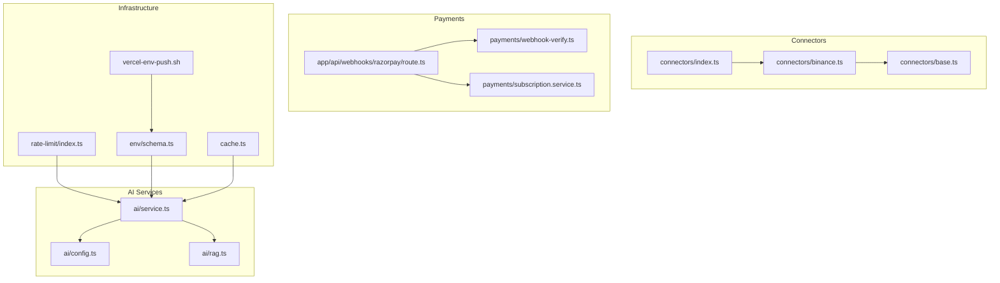
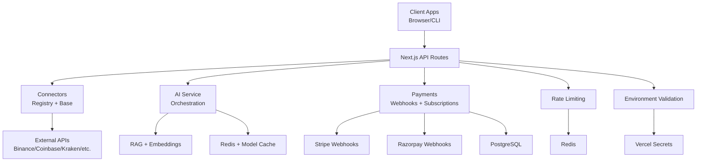
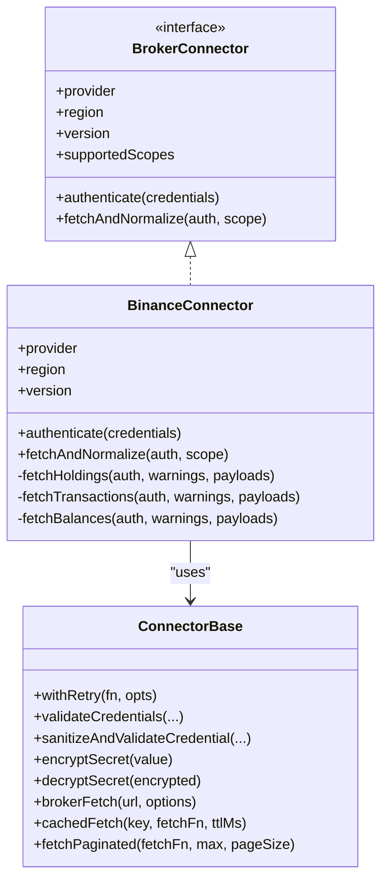
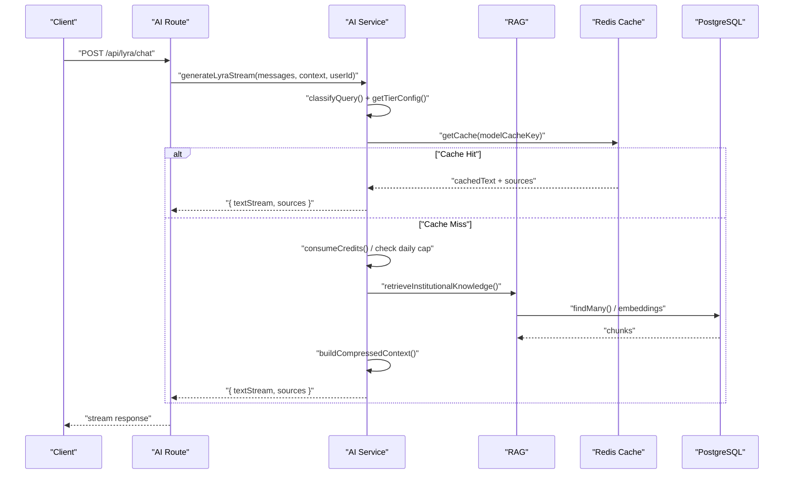
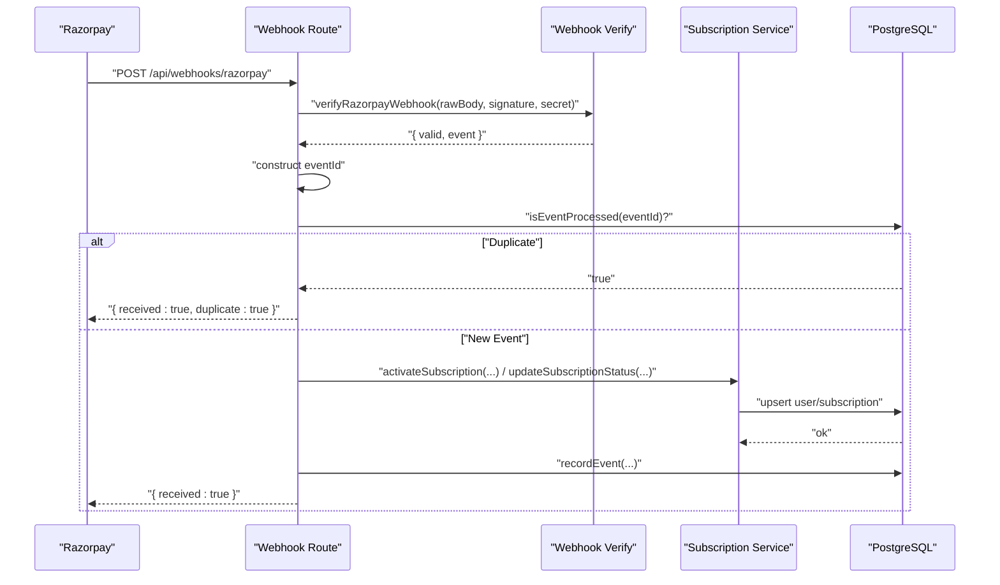
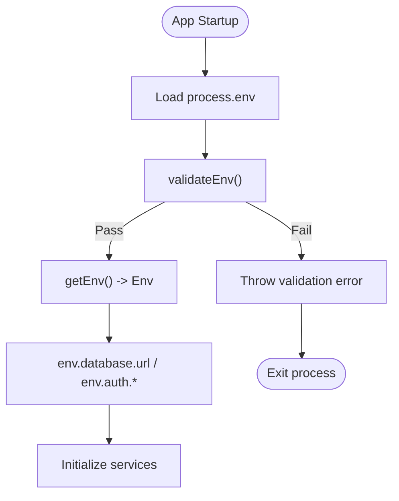
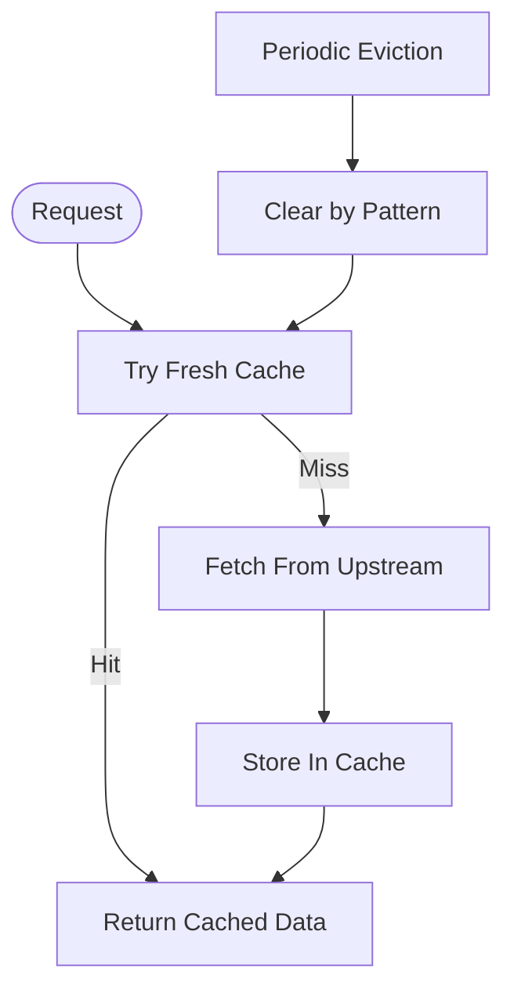
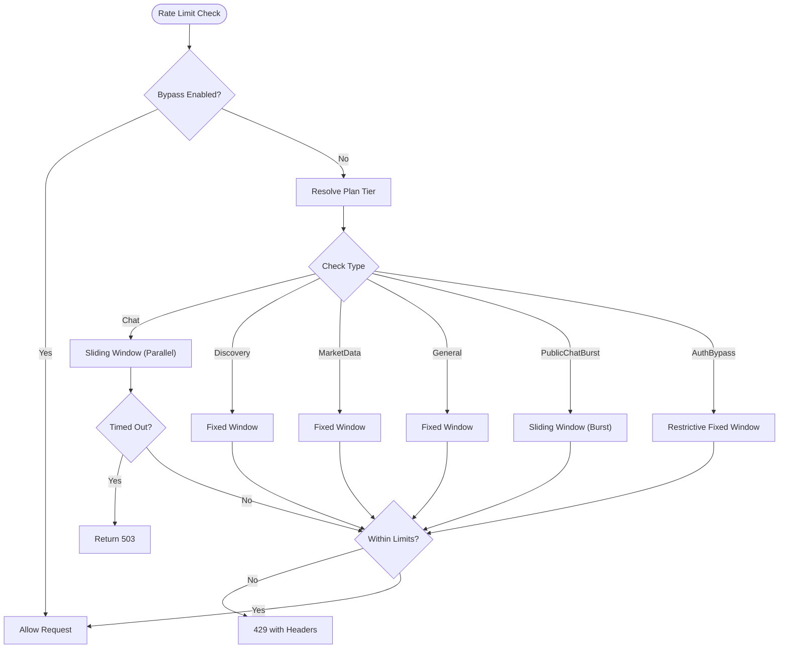
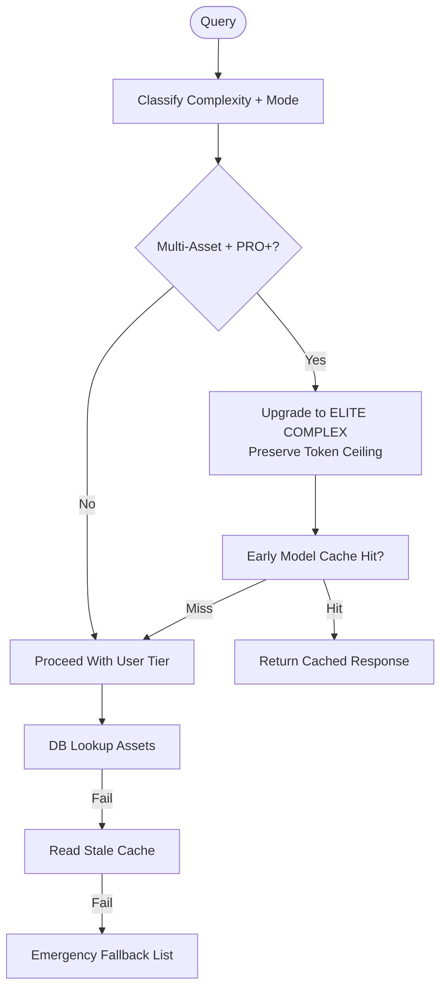
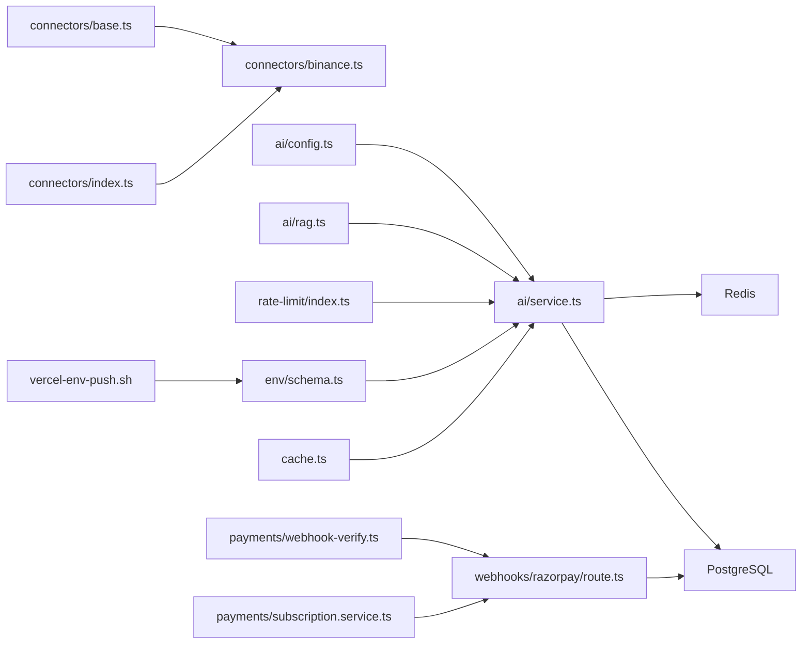

# Integration Patterns

<cite>
**Referenced Files in This Document**
- [base.ts](file://src/lib/connectors/base.ts)
- [index.ts](file://src/lib/connectors/index.ts)
- [binance.ts](file://src/lib/connectors/binance.ts)
- [config.ts](file://src/lib/config.ts)
- [service.ts](file://src/lib/ai/service.ts)
- [config.ts](file://src/lib/ai/config.ts)
- [rag.ts](file://src/lib/ai/rag.ts)
- [route.ts](file://src/app/api/webhooks/razorpay/route.ts)
- [webhook-verify.ts](file://src/lib/payments/webhook-verify.ts)
- [subscription.service.ts](file://src/lib/payments/subscription.service.ts)
- [rate-limit/index.ts](file://src/lib/rate-limit/index.ts)
- [schema.ts](file://src/lib/env/schema.ts)
- [.vercel-env-push.sh](file://.vercel-env-push.sh)
- [cache.ts](file://src/lib/cache.ts)
</cite>

## Table of Contents
1. [Introduction](#introduction)
2. [Project Structure](#project-structure)
3. [Core Components](#core-components)
4. [Architecture Overview](#architecture-overview)
5. [Detailed Component Analysis](#detailed-component-analysis)
6. [Dependency Analysis](#dependency-analysis)
7. [Performance Considerations](#performance-considerations)
8. [Troubleshooting Guide](#troubleshooting-guide)
9. [Conclusion](#conclusion)

## Introduction
This document describes LyraAlpha’s integration patterns for third-party services. It focuses on the connector pattern for external APIs, AI service abstractions, payment processor integrations, configuration management, environment variable handling, caching strategies, rate limiting, fallback mechanisms, webhook handling, and event-driven flows. The goal is to provide a practical guide for extending integrations safely and efficiently.

## Project Structure
LyraAlpha organizes integration concerns across several layers:
- Connectors: Provider-agnostic base with provider-specific implementations for brokerages and DEXs.
- AI Services: Orchestration, RAG, cost control, and caching layers.
- Payments: Webhook verification, idempotent event processing, and subscription lifecycle management.
- Infrastructure: Rate limiting, environment validation, and caching utilities.

**Diagram sources**
- [base.ts:1-420](file://src/lib/connectors/base.ts#L1-L420)
- [index.ts:1-34](file://src/lib/connectors/index.ts#L1-L34)
- [binance.ts:1-252](file://src/lib/connectors/binance.ts#L1-L252)
- [service.ts:1-800](file://src/lib/ai/service.ts#L1-L800)
- [config.ts:1-389](file://src/lib/ai/config.ts#L1-L389)
- [rag.ts:1-200](file://src/lib/ai/rag.ts#L1-L200)
- [route.ts:1-154](file://src/app/api/webhooks/razorpay/route.ts#L1-L154)
- [webhook-verify.ts:1-149](file://src/lib/payments/webhook-verify.ts#L1-L149)
- [subscription.service.ts:1-200](file://src/lib/payments/subscription.service.ts#L1-L200)
- [rate-limit/index.ts:1-372](file://src/lib/rate-limit/index.ts#L1-L372)
- [schema.ts:1-201](file://src/lib/env/schema.ts#L1-L201)
- [.vercel-env-push.sh:1-72](file://.vercel-env-push.sh#L1-L72)
- [cache.ts:1-21](file://src/lib/cache.ts#L1-L21)

**Section sources**
- [base.ts:1-420](file://src/lib/connectors/base.ts#L1-L420)
- [index.ts:1-34](file://src/lib/connectors/index.ts#L1-L34)
- [binance.ts:1-252](file://src/lib/connectors/binance.ts#L1-L252)
- [service.ts:1-800](file://src/lib/ai/service.ts#L1-L800)
- [config.ts:1-389](file://src/lib/ai/config.ts#L1-L389)
- [rag.ts:1-200](file://src/lib/ai/rag.ts#L1-L200)
- [route.ts:1-154](file://src/app/api/webhooks/razorpay/route.ts#L1-L154)
- [webhook-verify.ts:1-149](file://src/lib/payments/webhook-verify.ts#L1-L149)
- [subscription.service.ts:1-200](file://src/lib/payments/subscription.service.ts#L1-L200)
- [rate-limit/index.ts:1-372](file://src/lib/rate-limit/index.ts#L1-L372)
- [schema.ts:1-201](file://src/lib/env/schema.ts#L1-L201)
- [.vercel-env-push.sh:1-72](file://.vercel-env-push.sh#L1-L72)
- [cache.ts:1-21](file://src/lib/cache.ts#L1-L21)

## Core Components
- Connector Pattern
  - Base utilities for retries, credential validation, encryption/decryption, HTTP fetch, pagination, and in-memory caching.
  - Provider registry and specific implementations (e.g., Binance) demonstrate the pattern for external broker APIs.
- AI Service Abstraction
  - Centralized configuration for model deployments, tiered routing, and cost control.
  - RAG and memory systems with caching and quality scoring.
  - Streaming with mid-stream credit refunds and daily token caps.
- Payment Processor Integrations
  - Stripe and Razorpay webhook verification and idempotent processing.
  - Subscription lifecycle management with plan mapping and audit logging.
- Configuration Management
  - Zod-based environment validation and typed accessors.
  - Vercel environment push script to synchronize secrets.
- Caching Strategy
  - Next.js cache wrapper for server actions and database queries.
  - In-memory connector cache and Redis-backed caches for assets, memory, and model results.
- Rate Limiting
  - Sliding/fixed window implementations per plan tier with timeouts and fail-open/fail-close policies.
- Fallback Mechanisms
  - Emergency asset fallback list, stale cache fallback, and tiered upgrades for multi-asset modes.

**Section sources**
- [base.ts:1-420](file://src/lib/connectors/base.ts#L1-L420)
- [index.ts:1-34](file://src/lib/connectors/index.ts#L1-L34)
- [binance.ts:1-252](file://src/lib/connectors/binance.ts#L1-L252)
- [config.ts:1-83](file://src/lib/config.ts#L1-L83)
- [service.ts:1-800](file://src/lib/ai/service.ts#L1-L800)
- [config.ts:1-389](file://src/lib/ai/config.ts#L1-L389)
- [rag.ts:1-200](file://src/lib/ai/rag.ts#L1-L200)
- [route.ts:1-154](file://src/app/api/webhooks/razorpay/route.ts#L1-L154)
- [webhook-verify.ts:1-149](file://src/lib/payments/webhook-verify.ts#L1-L149)
- [subscription.service.ts:1-200](file://src/lib/payments/subscription.service.ts#L1-L200)
- [rate-limit/index.ts:1-372](file://src/lib/rate-limit/index.ts#L1-L372)
- [schema.ts:1-201](file://src/lib/env/schema.ts#L1-L201)
- [.vercel-env-push.sh:1-72](file://.vercel-env-push.sh#L1-L72)
- [cache.ts:1-21](file://src/lib/cache.ts#L1-L21)

## Architecture Overview
The integration architecture separates concerns into modular layers:
- Provider integrations use a connector registry and base utilities to normalize data.
- AI services orchestrate model selection, RAG, and cost control with caching and fallbacks.
- Payment integrations enforce security via signature verification and idempotency.
- Infrastructure layers provide robust configuration, caching, and rate limiting.

**Diagram sources**
- [index.ts:1-34](file://src/lib/connectors/index.ts#L1-L34)
- [base.ts:1-420](file://src/lib/connectors/base.ts#L1-L420)
- [service.ts:1-800](file://src/lib/ai/service.ts#L1-L800)
- [rag.ts:1-200](file://src/lib/ai/rag.ts#L1-L200)
- [route.ts:1-154](file://src/app/api/webhooks/razorpay/route.ts#L1-L154)
- [webhook-verify.ts:1-149](file://src/lib/payments/webhook-verify.ts#L1-L149)
- [subscription.service.ts:1-200](file://src/lib/payments/subscription.service.ts#L1-L200)
- [rate-limit/index.ts:1-372](file://src/lib/rate-limit/index.ts#L1-L372)
- [schema.ts:1-201](file://src/lib/env/schema.ts#L1-L201)

## Detailed Component Analysis

### Connector Pattern Implementation
The connector pattern encapsulates provider-specific logic behind a shared interface and base utilities:
- Retry policy with exponential backoff and jitter.
- Credential validation and secure storage via encryption/decryption.
- HTTP fetch with standardized error mapping and timeouts.
- Pagination helper for paginated upstream APIs.
- In-memory connector cache keyed by TTL.

**Diagram sources**
- [base.ts:1-420](file://src/lib/connectors/base.ts#L1-L420)
- [binance.ts:1-252](file://src/lib/connectors/binance.ts#L1-L252)

**Section sources**
- [base.ts:1-420](file://src/lib/connectors/base.ts#L1-L420)
- [binance.ts:1-252](file://src/lib/connectors/binance.ts#L1-L252)
- [index.ts:1-34](file://src/lib/connectors/index.ts#L1-L34)
- [config.ts:1-83](file://src/lib/config.ts#L1-L83)

### AI Service Provider Abstraction and Cost Control
The AI service orchestrates model routing, RAG, and cost control:
- Shared AI SDK client and deployment mapping for multi-model orchestration.
- Tiered routing configuration per plan and query complexity.
- Daily token caps and Redis-backed counters with atomic increments.
- Early model cache and educational cache for low-cost responses.
- Streaming with mid-stream credit refunds and idempotent conversation logging.

**Diagram sources**
- [service.ts:383-700](file://src/lib/ai/service.ts#L383-L700)
- [config.ts:1-389](file://src/lib/ai/config.ts#L1-L389)
- [rag.ts:1-200](file://src/lib/ai/rag.ts#L1-L200)

**Section sources**
- [service.ts:1-800](file://src/lib/ai/service.ts#L1-L800)
- [config.ts:1-389](file://src/lib/ai/config.ts#L1-L389)
- [rag.ts:1-200](file://src/lib/ai/rag.ts#L1-L200)

### Payment Processor Integrations and Webhooks
Webhook handling enforces security and idempotency:
- Signature verification for Stripe and Razorpay with replay protection.
- Idempotent event processing using database records.
- Subscription lifecycle management with plan mapping and audit logging.

**Diagram sources**
- [route.ts:1-154](file://src/app/api/webhooks/razorpay/route.ts#L1-L154)
- [webhook-verify.ts:1-149](file://src/lib/payments/webhook-verify.ts#L1-L149)
- [subscription.service.ts:1-200](file://src/lib/payments/subscription.service.ts#L1-L200)

**Section sources**
- [route.ts:1-154](file://src/app/api/webhooks/razorpay/route.ts#L1-L154)
- [webhook-verify.ts:1-149](file://src/lib/payments/webhook-verify.ts#L1-L149)
- [subscription.service.ts:1-200](file://src/lib/payments/subscription.service.ts#L1-L200)

### Configuration Management and Environment Variables
Environment validation and typed accessors ensure correctness:
- Zod schema validates required variables and provides type-safe getters.
- Vercel environment push script synchronizes secrets with safeguards.

**Diagram sources**
- [schema.ts:160-190](file://src/lib/env/schema.ts#L160-L190)
- [.vercel-env-push.sh:18-72](file://.vercel-env-push.sh#L18-L72)

**Section sources**
- [schema.ts:1-201](file://src/lib/env/schema.ts#L1-L201)
- [.vercel-env-push.sh:1-72](file://.vercel-env-push.sh#L1-L72)

### Caching Strategy for External Data
Caching reduces latency and cost:
- Next.js cache wrapper for server actions and database queries.
- In-memory connector cache with TTL and pattern-based eviction.
- Redis-backed caches for assets, memory, and model results with hot/cold variants.

**Diagram sources**
- [cache.ts:1-21](file://src/lib/cache.ts#L1-L21)
- [base.ts:327-388](file://src/lib/connectors/base.ts#L327-L388)
- [service.ts:224-256](file://src/lib/ai/service.ts#L224-L256)

**Section sources**
- [cache.ts:1-21](file://src/lib/cache.ts#L1-L21)
- [base.ts:327-388](file://src/lib/connectors/base.ts#L327-L388)
- [service.ts:224-256](file://src/lib/ai/service.ts#L224-L256)

### Rate Limiting Implementations and Fallbacks
Rate limiting protects infrastructure with timeouts and fail-open/fail-close policies:
- Sliding window for chat, fixed windows for discovery/market data/general.
- Public chat burst limiter layered on top of daily limits.
- Auth bypass attempts restricted separately.
- Timeouts wrap Redis calls; failures are handled per endpoint policy.

**Diagram sources**
- [rate-limit/index.ts:94-314](file://src/lib/rate-limit/index.ts#L94-L314)

**Section sources**
- [rate-limit/index.ts:1-372](file://src/lib/rate-limit/index.ts#L1-L372)

### Fallback Mechanisms and Cost Optimization Strategies
Fallbacks and optimizations ensure resilience and cost-efficiency:
- Emergency asset fallback list for degraded DB/cache.
- Stale cache fallback for asset symbols.
- Tiered upgrades for multi-asset modes with token ceilings preserved.
- Educational cache for Starter/PRO SIMPLE queries.
- Daily token caps and Redis-backed counters.

**Diagram sources**
- [service.ts:488-500](file://src/lib/ai/service.ts#L488-L500)
- [service.ts:224-256](file://src/lib/ai/service.ts#L224-L256)
- [service.ts:618-636](file://src/lib/ai/service.ts#L618-L636)

**Section sources**
- [service.ts:116-123](file://src/lib/ai/service.ts#L116-L123)
- [service.ts:224-256](file://src/lib/ai/service.ts#L224-L256)
- [service.ts:488-500](file://src/lib/ai/service.ts#L488-L500)
- [service.ts:618-636](file://src/lib/ai/service.ts#L618-L636)

## Dependency Analysis
The integration layer exhibits clear separation of concerns with minimal coupling:
- Connectors depend on base utilities and provider endpoints.
- AI service depends on configuration, RAG, and Redis.
- Payment webhooks depend on verification and subscription services.
- Rate limiting depends on Redis and plan gates.
- Environment validation is a central dependency for all services.

**Diagram sources**
- [base.ts:1-420](file://src/lib/connectors/base.ts#L1-L420)
- [index.ts:1-34](file://src/lib/connectors/index.ts#L1-L34)
- [binance.ts:1-252](file://src/lib/connectors/binance.ts#L1-L252)
- [config.ts:1-389](file://src/lib/ai/config.ts#L1-L389)
- [service.ts:1-800](file://src/lib/ai/service.ts#L1-L800)
- [rag.ts:1-200](file://src/lib/ai/rag.ts#L1-L200)
- [webhook-verify.ts:1-149](file://src/lib/payments/webhook-verify.ts#L1-L149)
- [route.ts:1-154](file://src/app/api/webhooks/razorpay/route.ts#L1-L154)
- [subscription.service.ts:1-200](file://src/lib/payments/subscription.service.ts#L1-L200)
- [rate-limit/index.ts:1-372](file://src/lib/rate-limit/index.ts#L1-L372)
- [schema.ts:1-201](file://src/lib/env/schema.ts#L1-L201)
- [.vercel-env-push.sh:1-72](file://.vercel-env-push.sh#L1-L72)
- [cache.ts:1-21](file://src/lib/cache.ts#L1-L21)

**Section sources**
- [base.ts:1-420](file://src/lib/connectors/base.ts#L1-L420)
- [index.ts:1-34](file://src/lib/connectors/index.ts#L1-L34)
- [binance.ts:1-252](file://src/lib/connectors/binance.ts#L1-L252)
- [config.ts:1-389](file://src/lib/ai/config.ts#L1-L389)
- [service.ts:1-800](file://src/lib/ai/service.ts#L1-L800)
- [rag.ts:1-200](file://src/lib/ai/rag.ts#L1-L200)
- [webhook-verify.ts:1-149](file://src/lib/payments/webhook-verify.ts#L1-L149)
- [route.ts:1-154](file://src/app/api/webhooks/razorpay/route.ts#L1-L154)
- [subscription.service.ts:1-200](file://src/lib/payments/subscription.service.ts#L1-L200)
- [rate-limit/index.ts:1-372](file://src/lib/rate-limit/index.ts#L1-L372)
- [schema.ts:1-201](file://src/lib/env/schema.ts#L1-L201)
- [.vercel-env-push.sh:1-72](file://.vercel-env-push.sh#L1-L72)
- [cache.ts:1-21](file://src/lib/cache.ts#L1-L21)

## Performance Considerations
- Prefer early cache hits and educational cache for low-cost responses.
- Use tiered routing to balance latency and cost; preserve token ceilings for multi-asset upgrades.
- Parallelize independent retrievals (RAG, web search, asset enrichment) to reduce latency.
- Apply strict daily token caps and Redis-backed counters to prevent runaway costs.
- Use in-memory connector cache for frequent small reads; tune TTLs per data volatility.
- Employ Next.js cache wrapper for expensive database queries with appropriate TTLs.

[No sources needed since this section provides general guidance]

## Troubleshooting Guide
Common issues and resolutions:
- Connector authentication failures
  - Validate credentials and encryption key; ensure sanitized and safe strings.
  - Check provider endpoints and timeouts.
- Webhook verification failures
  - Confirm signatures and timestamps; verify replay protection logic.
  - Ensure idempotency keys are constructed deterministically.
- Rate limit timeouts
  - Inspect Redis availability and timeouts; adjust per-endpoint limits.
  - Consider fail-open vs fail-close policies for user experience.
- Environment validation errors
  - Review required variables and schema constraints.
  - Use the Vercel push script to synchronize secrets.

**Section sources**
- [base.ts:106-145](file://src/lib/connectors/base.ts#L106-L145)
- [route.ts:30-75](file://src/app/api/webhooks/razorpay/route.ts#L30-L75)
- [webhook-verify.ts:14-71](file://src/lib/payments/webhook-verify.ts#L14-L71)
- [rate-limit/index.ts:46-79](file://src/lib/rate-limit/index.ts#L46-L79)
- [schema.ts:160-190](file://src/lib/env/schema.ts#L160-L190)
- [.vercel-env-push.sh:18-72](file://.vercel-env-push.sh#L18-L72)

## Conclusion
LyraAlpha’s integration patterns emphasize modularity, safety, and performance:
- The connector pattern cleanly isolates provider specifics and provides robust retry, caching, and normalization.
- AI services combine orchestration, RAG, and cost control with resilient fallbacks and caching.
- Payment integrations enforce security and idempotency with plan-aware lifecycle management.
- Infrastructure layers deliver validated configuration, efficient caching, and adaptive rate limiting.
These patterns enable scalable extension to new providers, AI backends, and payment processors while maintaining reliability and cost discipline.