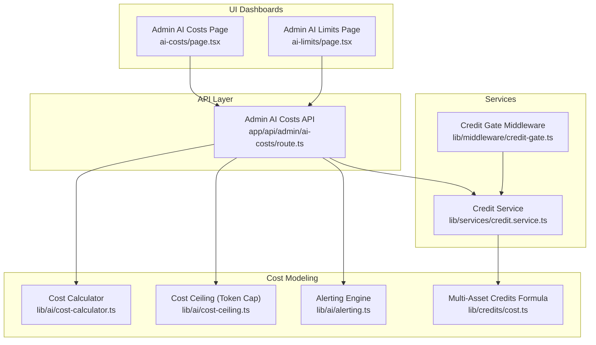
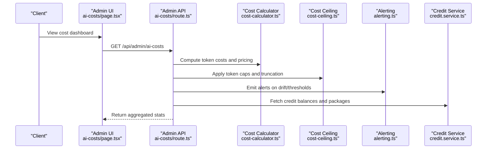
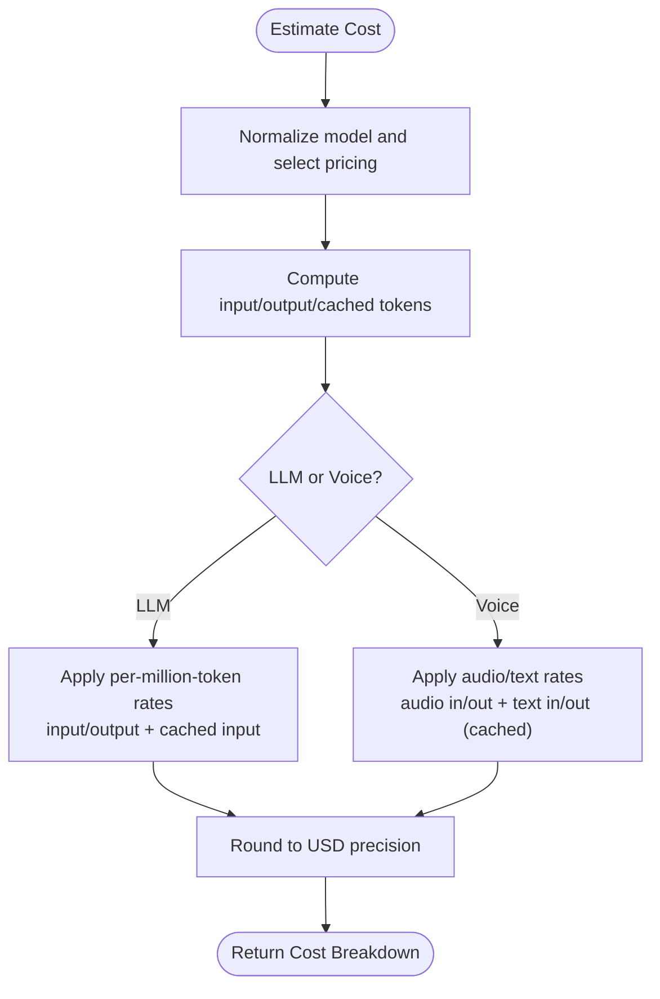
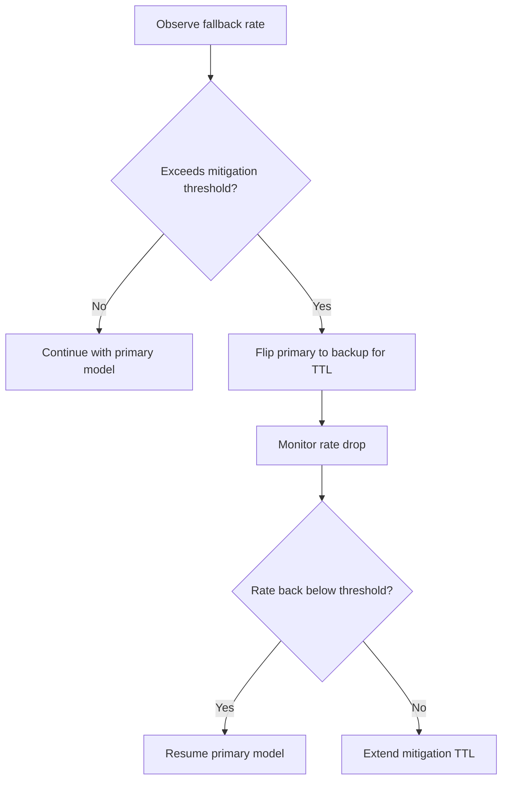
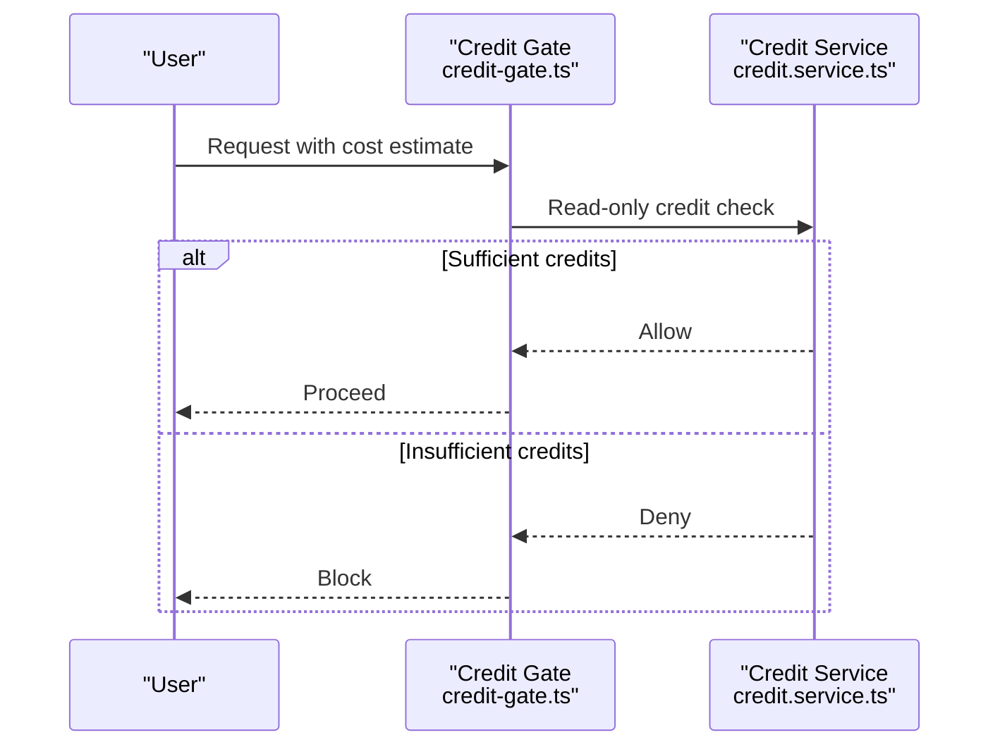
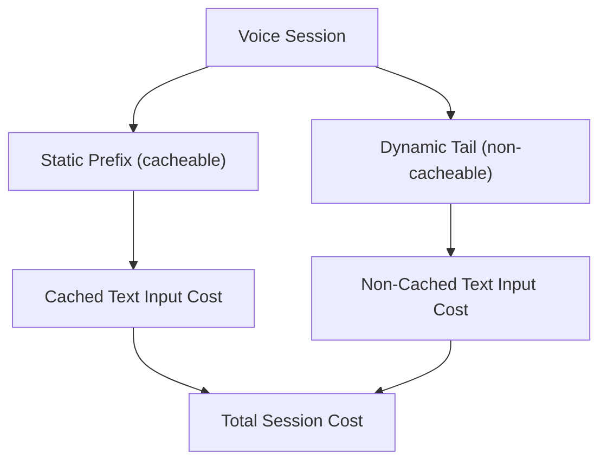
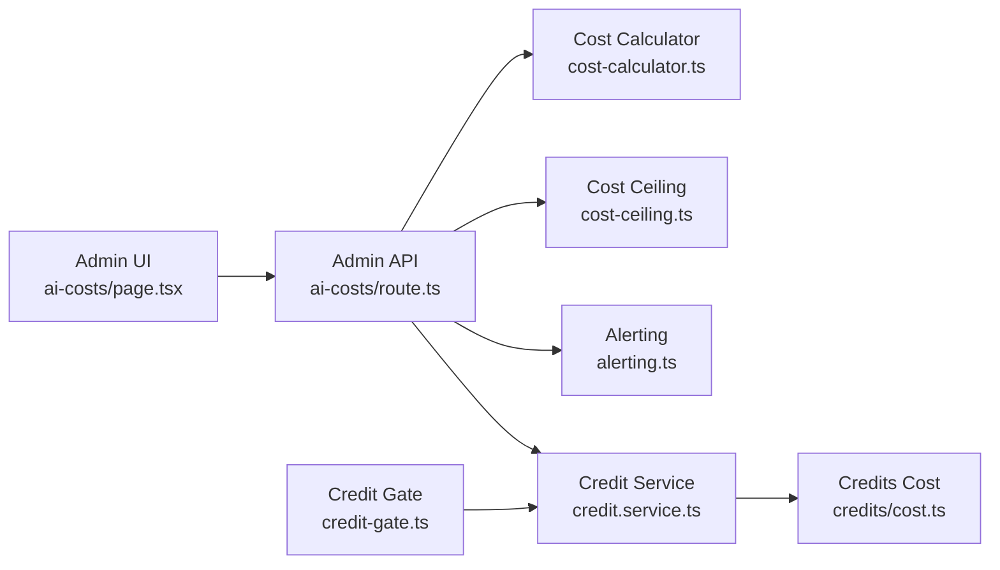

# AI Cost Management

<cite>
**Referenced Files in This Document**
- [cost-calculator.ts](file://src/lib/ai/cost-calculator.ts)
- [cost-ceiling.ts](file://src/lib/ai/cost-ceiling.ts)
- [alerting.ts](file://src/lib/ai/alerting.ts)
- [credit.service.ts](file://src/lib/services/credit.service.ts)
- [credit-gate.ts](file://src/lib/middleware/credit-gate.ts)
- [credits/cost.ts](file://src/lib/credits/cost.ts)
- [ai-costs/page.tsx](file://src/app/admin/ai-costs/page.tsx)
- [ai-limits/page.tsx](file://src/app/admin/ai-limits/page.tsx)
- [ai-costs/route.ts](file://src/app/api/admin/ai-costs/route.ts)
- [cost-calculator-voice.test.ts](file://src/lib/ai/__tests__/cost-calculator-voice.test.ts)
</cite>

## Table of Contents
1. [Introduction](#introduction)
2. [Project Structure](#project-structure)
3. [Core Components](#core-components)
4. [Architecture Overview](#architecture-overview)
5. [Detailed Component Analysis](#detailed-component-analysis)
6. [Dependency Analysis](#dependency-analysis)
7. [Performance Considerations](#performance-considerations)
8. [Troubleshooting Guide](#troubleshooting-guide)
9. [Conclusion](#conclusion)
10. [Appendices](#appendices)

## Introduction
This document explains the AI cost management and optimization strategies implemented in the system. It covers cost tracking mechanisms, provider cost comparison, budget allocation systems, automatic provider switching based on cost efficiency, usage monitoring, and spending limits. It also documents caching strategies for cost reduction, batch processing optimizations, token usage optimization, examples of cost calculation formulas, provider selection algorithms, performance vs. cost trade-offs, administrative dashboards, reporting capabilities, alerting systems for cost anomalies, and integrations with credit systems, usage quotas, and subscription-based cost controls.

## Project Structure
The AI cost management system spans several layers:
- Cost modeling and estimation utilities
- Middleware and service layers for credits and quotas
- Administrative dashboards and APIs for monitoring and tuning
- Tests validating cost calculations and voice session estimations

**Diagram sources**
- [ai-costs/page.tsx:94-444](file://src/app/admin/ai-costs/page.tsx#L94-L444)
- [ai-limits/page.tsx:353-452](file://src/app/admin/ai-limits/page.tsx#L353-L452)
- [ai-costs/route.ts:1-23](file://src/app/api/admin/ai-costs/route.ts#L1-L23)
- [credit.service.ts:1-455](file://src/lib/services/credit.service.ts#L1-L455)
- [credit-gate.ts:1-37](file://src/lib/middleware/credit-gate.ts#L1-L37)
- [cost-calculator.ts:1-313](file://src/lib/ai/cost-calculator.ts#L1-L313)
- [cost-ceiling.ts:1-174](file://src/lib/ai/cost-ceiling.ts#L1-L174)
- [alerting.ts:62-93](file://src/lib/ai/alerting.ts#L62-L93)
- [credits/cost.ts:1-5](file://src/lib/credits/cost.ts#L1-L5)

**Section sources**
- [ai-costs/page.tsx:94-444](file://src/app/admin/ai-costs/page.tsx#L94-L444)
- [ai-limits/page.tsx:353-452](file://src/app/admin/ai-limits/page.tsx#L353-L452)
- [ai-costs/route.ts:1-23](file://src/app/api/admin/ai-costs/route.ts#L1-L23)
- [credit.service.ts:1-455](file://src/lib/services/credit.service.ts#L1-L455)
- [credit-gate.ts:1-37](file://src/lib/middleware/credit-gate.ts#L1-L37)
- [cost-calculator.ts:1-313](file://src/lib/ai/cost-calculator.ts#L1-L313)
- [cost-ceiling.ts:1-174](file://src/lib/ai/cost-ceiling.ts#L1-L174)
- [alerting.ts:62-93](file://src/lib/ai/alerting.ts#L62-L93)
- [credits/cost.ts:1-5](file://src/lib/credits/cost.ts#L1-L5)

## Core Components
- Cost Calculator: Provides token-based cost estimation for LLMs and voice sessions, including cached vs. non-cached input pricing and per-million-token rates.
- Cost Ceiling: Enforces per-request token ceilings per plan tier to prevent runaway costs, with graceful truncation and estimation drift monitoring.
- Credit Service: Manages credit buckets (monthly, bonus, purchased), expiration, ordering, and consumption with transactional guarantees.
- Credit Gate: Fast, read-only credit check for hot paths, with plan-tier exceptions.
- Credits Cost Utilities: Provides formula for multi-asset analysis credit allocation.
- Admin Dashboards: Visualizes daily spend, token usage, cache efficiency, fallback rates, model routing, and voice agent cost references.
- Alerting Engine: Emits cost anomaly alerts via webhook with cooldowns and severity.

**Section sources**
- [cost-calculator.ts:26-313](file://src/lib/ai/cost-calculator.ts#L26-L313)
- [cost-ceiling.ts:22-174](file://src/lib/ai/cost-ceiling.ts#L22-L174)
- [credit.service.ts:82-455](file://src/lib/services/credit.service.ts#L82-L455)
- [credit-gate.ts:11-37](file://src/lib/middleware/credit-gate.ts#L11-L37)
- [credits/cost.ts:1-5](file://src/lib/credits/cost.ts#L1-L5)
- [ai-costs/page.tsx:94-444](file://src/app/admin/ai-costs/page.tsx#L94-L444)
- [alerting.ts:62-93](file://src/lib/ai/alerting.ts#L62-L93)

## Architecture Overview
The system integrates cost modeling, quota enforcement, and observability into a cohesive pipeline:
- Cost Estimation: Token counting and pricing applied before requests.
- Quota Enforcement: Credits and token caps gate expensive operations.
- Monitoring: Admin dashboards and alerting surfaces anomalies and trends.
- Optimization: Caching reduces effective token usage; fallback mitigation switches models under duress.

**Diagram sources**
- [ai-costs/page.tsx:94-444](file://src/app/admin/ai-costs/page.tsx#L94-L444)
- [ai-costs/route.ts:1-23](file://src/app/api/admin/ai-costs/route.ts#L1-L23)
- [cost-calculator.ts:293-313](file://src/lib/ai/cost-calculator.ts#L293-L313)
- [cost-ceiling.ts:116-174](file://src/lib/ai/cost-ceiling.ts#L116-L174)
- [alerting.ts:62-93](file://src/lib/ai/alerting.ts#L62-L93)
- [credit.service.ts:285-330](file://src/lib/services/credit.service.ts#L285-L330)

## Detailed Component Analysis

### Cost Calculation and Provider Comparison
- Token-based cost model supports:
  - LLM input/output pricing per model family (e.g., gpt-5.4, gpt-5.4-mini, gpt-5.4-nano)
  - Cached input pricing to reflect retrieval-augmented caching savings
  - Voice session pricing for audio/text modalities with per-million-token rates
- Provider comparison:
  - Use model-specific pricing maps to compare per-request costs across models.
  - Compare cached vs. non-cached input portions to quantify savings potential.
- Examples of formulas:
  - LLM cost breakdown: inputCost + cachedInputCost + outputCost
  - Voice session cost breakdown: audioInputCost + cachedAudioInputCost + audioOutputCost + textInputCost + cachedTextInputCost + textOutputCost
  - Token estimation: character-based estimation with adaptive ratios for dense/prose content

**Diagram sources**
- [cost-calculator.ts:106-147](file://src/lib/ai/cost-calculator.ts#L106-L147)
- [cost-calculator.ts:293-313](file://src/lib/ai/cost-calculator.ts#L293-L313)
- [cost-calculator.ts:192-223](file://src/lib/ai/cost-calculator.ts#L192-L223)

**Section sources**
- [cost-calculator.ts:26-313](file://src/lib/ai/cost-calculator.ts#L26-L313)
- [cost-calculator-voice.test.ts:1-483](file://src/lib/ai/__tests__/cost-calculator-voice.test.ts#L1-L483)

### Automatic Provider Switching Based on Cost Efficiency
- Fallback mitigation:
  - When fallback rate exceeds a configured threshold, the system automatically flips the primary model to a backup for a bounded period.
  - Admins can adjust thresholds and observe mitigation status in the runtime ops panel.
- Provider selection algorithm:
  - Select the least-cost model per query complexity and plan tier.
  - Prefer cached inputs to minimize non-cached token charges.
  - Route to smaller models (nano) for simple queries; scale up to mini/full models for complex prompts.

**Diagram sources**
- [ai-limits/page.tsx:175-351](file://src/app/admin/ai-limits/page.tsx#L175-L351)
- [alerting.ts:62-93](file://src/lib/ai/alerting.ts#L62-L93)

**Section sources**
- [ai-limits/page.tsx:161-351](file://src/app/admin/ai-limits/page.tsx#L161-L351)

### Usage Monitoring and Spending Limits
- Daily token caps:
  - Per-plan ceilings prevent runaway context from inflating costs.
  - Graceful truncation of context preserves request viability while bounding tokens.
- Credit-based quotas:
  - Credits are allocated across monthly, bonus, and purchased buckets with distinct expirations.
  - Consumption respects bucket priority and expiration order.
- Admin dashboards:
  - Live spend bar, cache efficiency, fallback rate, model routing, and top users by token usage.
  - Voice agent cost reference table for planning and budgeting.

**Diagram sources**
- [credit-gate.ts:11-37](file://src/lib/middleware/credit-gate.ts#L11-L37)
- [credit.service.ts:299-305](file://src/lib/services/credit.service.ts#L299-L305)

**Section sources**
- [cost-ceiling.ts:22-174](file://src/lib/ai/cost-ceiling.ts#L22-L174)
- [credit-gate.ts:11-37](file://src/lib/middleware/credit-gate.ts#L11-L37)
- [credit.service.ts:82-455](file://src/lib/services/credit.service.ts#L82-L455)
- [ai-costs/page.tsx:94-444](file://src/app/admin/ai-costs/page.tsx#L94-L444)

### Caching Strategies for Cost Reduction
- Static prompt caching:
  - Voice sessions benefit from caching a static prefix, dramatically reducing effective text input cost.
- Token estimation drift monitoring:
  - Tracks estimation accuracy and emits alerts when drift exceeds thresholds, enabling model/pricing adjustments.
- Cache efficiency metrics:
  - Admin dashboard displays cached input share and reasoning tokens to guide optimization.

**Diagram sources**
- [cost-calculator.ts:259-291](file://src/lib/ai/cost-calculator.ts#L259-L291)
- [cost-calculator.ts:313-313](file://src/lib/ai/cost-calculator.ts#L313-L313)

**Section sources**
- [cost-calculator.ts:55-105](file://src/lib/ai/cost-calculator.ts#L55-L105)
- [cost-calculator.ts:259-291](file://src/lib/ai/cost-calculator.ts#L259-L291)
- [cost-ceiling.ts:79-110](file://src/lib/ai/cost-ceiling.ts#L79-L110)

### Batch Processing Optimizations and Token Usage Optimization
- Character-based token estimation:
  - Fast estimation for truncation decisions, with adaptive ratios for dense financial content.
- Truncation strategy:
  - Largest context blocks truncated first (knowledge > web > history) to preserve intent.
- Batch-friendly designs:
  - Admin APIs cache responses to reduce repeated computation overhead.

**Section sources**
- [cost-ceiling.ts:45-56](file://src/lib/ai/cost-ceiling.ts#L45-L56)
- [cost-ceiling.ts:116-174](file://src/lib/ai/cost-ceiling.ts#L116-L174)
- [ai-costs/route.ts:17-18](file://src/app/api/admin/ai-costs/route.ts#L17-L18)

### Administrative Dashboards, Reporting, and Alerting
- Admin AI Costs dashboard:
  - KPI cards, token mix, efficiency metrics, model route share, embedding pipeline health, daily charts, top users, model cost breakdown, voice cost reference, and plan × model breakdown.
- Admin AI Limits dashboard:
  - Daily token caps editor, alert thresholds editor, runtime ops snapshot, fallback mitigation status, web-search circuit, per-deployment fallback rates, and cron LLM jobs.
- Alerting:
  - Webhook delivery with cooldowns; supports daily cost spikes, token estimator drift, fallback rates, and other operational signals.

**Section sources**
- [ai-costs/page.tsx:94-444](file://src/app/admin/ai-costs/page.tsx#L94-L444)
- [ai-limits/page.tsx:353-452](file://src/app/admin/ai-limits/page.tsx#L353-L452)
- [alerting.ts:62-93](file://src/lib/ai/alerting.ts#L62-L93)

### Integration with Credits, Quotas, and Subscription Controls
- Credit buckets and expiration:
  - Monthly, bonus, and purchased buckets with distinct TTLs; consumed in priority order and expiration order.
- Credit cost calculation:
  - Query complexity maps to credit cost; multi-asset analysis credits computed via a simple formula.
- Package management:
  - Credit packages cached for performance; retrieved via service layer.

**Section sources**
- [credit.service.ts:82-123](file://src/lib/services/credit.service.ts#L82-L123)
- [credit.service.ts:438-455](file://src/lib/services/credit.service.ts#L438-L455)
- [credits/cost.ts:1-5](file://src/lib/credits/cost.ts#L1-L5)

## Dependency Analysis
The following diagram highlights key dependencies among cost management components:

**Diagram sources**
- [ai-costs/page.tsx:94-444](file://src/app/admin/ai-costs/page.tsx#L94-L444)
- [ai-costs/route.ts:1-23](file://src/app/api/admin/ai-costs/route.ts#L1-L23)
- [cost-calculator.ts:1-313](file://src/lib/ai/cost-calculator.ts#L1-L313)
- [cost-ceiling.ts:1-174](file://src/lib/ai/cost-ceiling.ts#L1-L174)
- [alerting.ts:62-93](file://src/lib/ai/alerting.ts#L62-L93)
- [credit.service.ts:1-455](file://src/lib/services/credit.service.ts#L1-L455)
- [credit-gate.ts:1-37](file://src/lib/middleware/credit-gate.ts#L1-L37)
- [credits/cost.ts:1-5](file://src/lib/credits/cost.ts#L1-L5)

**Section sources**
- [ai-costs/page.tsx:94-444](file://src/app/admin/ai-costs/page.tsx#L94-L444)
- [ai-costs/route.ts:1-23](file://src/app/api/admin/ai-costs/route.ts#L1-L23)
- [credit.service.ts:1-455](file://src/lib/services/credit.service.ts#L1-L455)

## Performance Considerations
- Lazy initialization of token encoders to avoid cold-start penalties.
- Character-based estimation for truncation decisions to minimize tokenizer overhead.
- Caching of admin API responses and credit packages to reduce database and network load.
- Transactional credit operations to maintain consistency under concurrent loads.
- Efficient sorting and bucketing of credit lots to minimize DB scans.

[No sources needed since this section provides general guidance]

## Troubleshooting Guide
- Cost estimation drift:
  - Investigate drift alerts and review estimation accuracy logs; adjust content-aware ratios if models evolve.
- Fallback mitigation:
  - Confirm thresholds and mitigation TTL; inspect per-deployment fallback rates to localize issues.
- Credit exhaustion:
  - Verify bucket balances and expirations; ensure monthly resets align with plan changes.
- Admin dashboard anomalies:
  - Check API response caching headers and retry logic; validate webhook delivery for alerts.

**Section sources**
- [cost-ceiling.ts:79-110](file://src/lib/ai/cost-ceiling.ts#L79-L110)
- [ai-limits/page.tsx:175-351](file://src/app/admin/ai-limits/page.tsx#L175-L351)
- [credit.service.ts:332-385](file://src/lib/services/credit.service.ts#L332-L385)
- [ai-costs/route.ts:17-18](file://src/app/api/admin/ai-costs/route.ts#L17-L18)
- [alerting.ts:62-93](file://src/lib/ai/alerting.ts#L62-L93)

## Conclusion
The system combines precise token-based cost modeling, strict quota enforcement via credits and token caps, and robust observability through dashboards and alerting. It leverages caching and adaptive estimation to reduce costs, supports automatic model fallback for resilience, and provides administrators with powerful tools to monitor, tune, and control AI spending across plans and models.

[No sources needed since this section summarizes without analyzing specific files]

## Appendices

### Example Cost Calculation Formulas
- LLM cost breakdown:
  - inputCost = nonCachedInputTokens / 1,000,000 × inputPerMillion
  - cachedInputCost = cachedInputTokens / 1,000,000 × cachedInputPerMillion
  - outputCost = outputTokens / 1,000,000 × outputPerMillion
  - totalCost = inputCost + cachedInputCost + outputCost
- Voice session cost breakdown:
  - audioInputCost = audioInputTokens / 1,000,000 × audioInputPerMillion
  - cachedAudioInputCost = cachedAudioInputTokens / 1,000,000 × cachedAudioInputPerMillion
  - audioOutputCost = audioOutputTokens / 1,000,000 × audioOutputPerMillion
  - textInputCost = nonCachedTextInputTokens / 1,000,000 × textInputPerMillion
  - cachedTextInputCost = cachedTextInputTokens / 1,000,000 × cachedTextInputPerMillion
  - textOutputCost = textOutputTokens / 1,000,000 × textOutputPerMillion
  - totalCost = sum of all components

**Section sources**
- [cost-calculator.ts:293-313](file://src/lib/ai/cost-calculator.ts#L293-L313)
- [cost-calculator.ts:192-223](file://src/lib/ai/cost-calculator.ts#L192-L223)