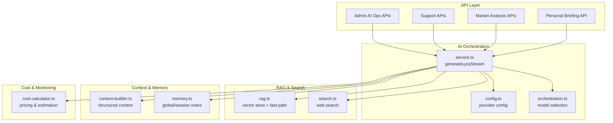
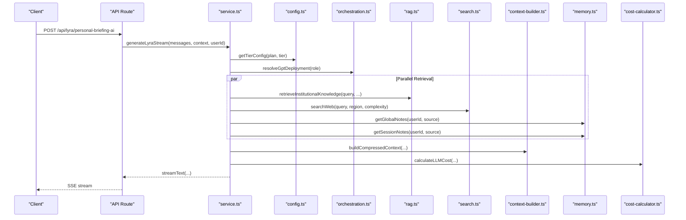
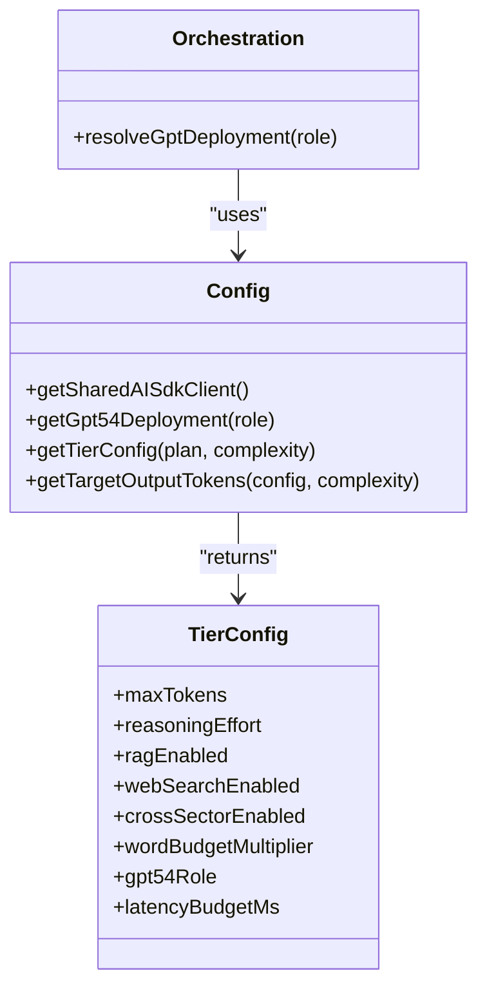
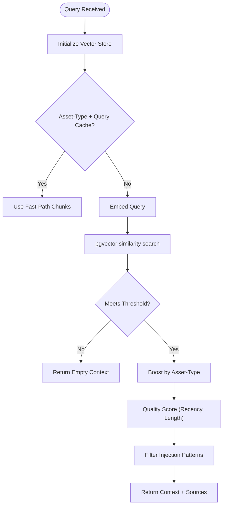
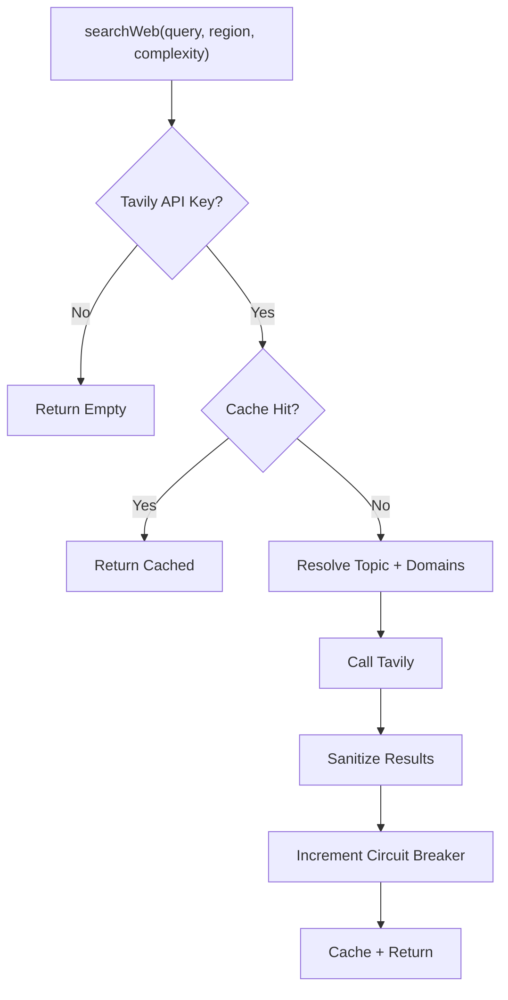
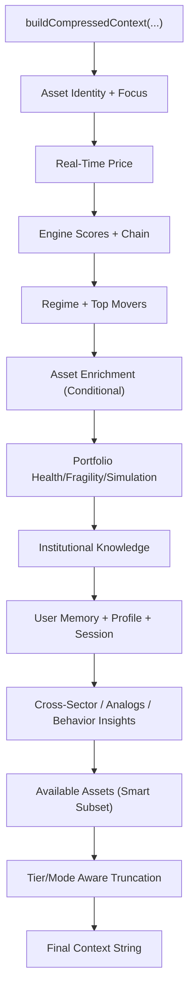
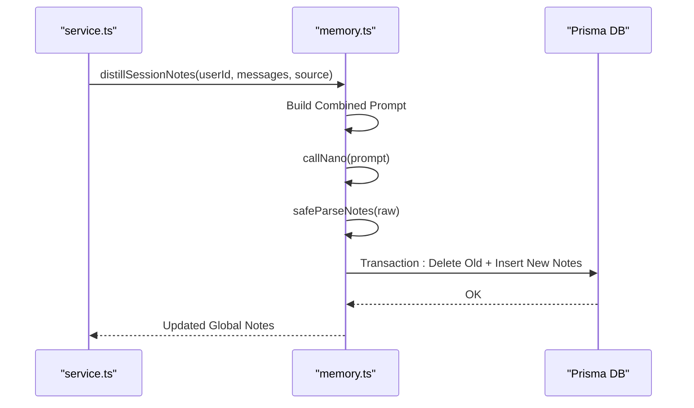
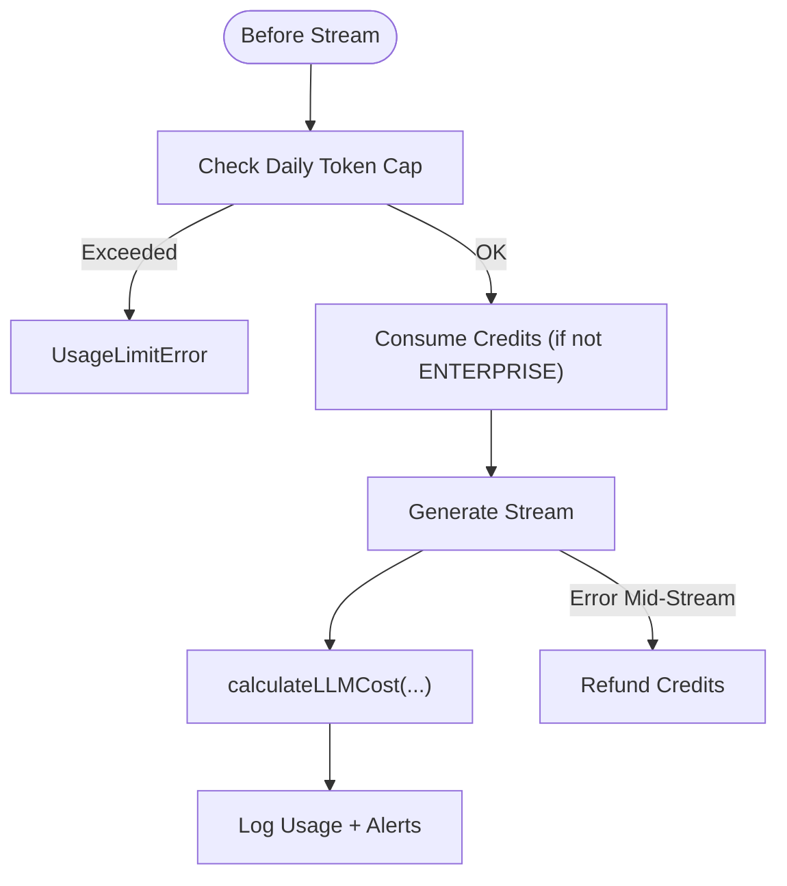
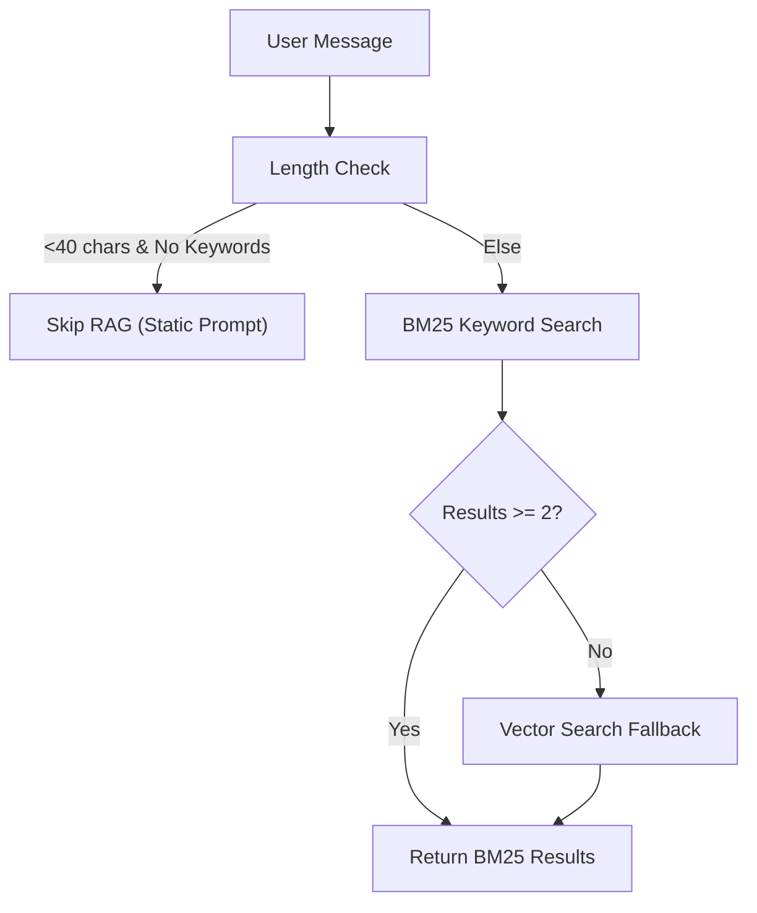
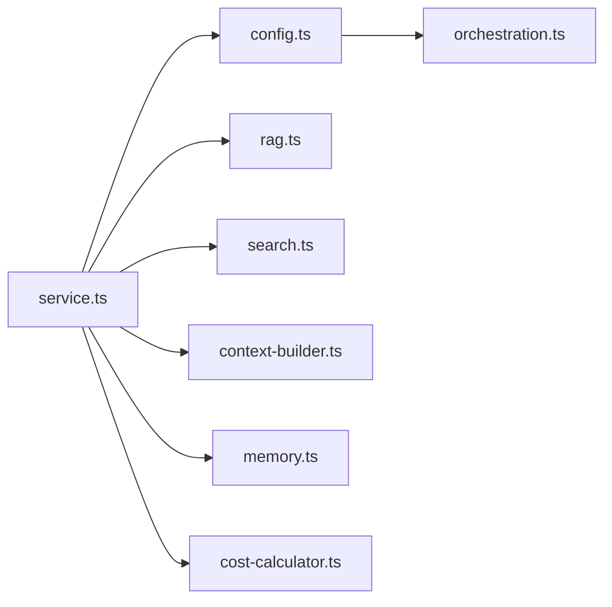

# AI Services Integration

<cite>
**Referenced Files in This Document**
- [service.ts](file://src/lib/ai/service.ts)
- [config.ts](file://src/lib/ai/config.ts)
- [orchestration.ts](file://src/lib/ai/orchestration.ts)
- [rag.ts](file://src/lib/ai/rag.ts)
- [search.ts](file://src/lib/ai/search.ts)
- [context-builder.ts](file://src/lib/ai/context-builder.ts)
- [memory.ts](file://src/lib/ai/memory.ts)
- [cost-calculator.ts](file://src/lib/ai/cost-calculator.ts)
- [types.ts](file://src/lib/ai/types.ts)
- [ai-responder.ts](file://src/lib/support/ai-responder.ts)
- [route.ts](file://src/app/api/lyra/personal-briefing-ai/route.ts)
- [route.ts](file://src/app/api/lyra/personal-briefing/route.ts)
- [route.ts](file://src/app/api/cron/daily-briefing/route.ts)
- [route.ts](file://src/app/api/cron/trending-questions/route.ts)
- [route.ts](file://src/app/api/support/public-chat/route.ts)
- [route.ts](file://src/app/api/support/messages/route.ts)
- [route.ts](file://src/app/api/support/conversations/route.ts)
- [route.ts](file://src/app/api/support/stream/route.ts)
- [route.ts](file://src/app/api/support/voice-session/route.ts)
- [route.ts](file://src/app/api/lyra/briefing/route.ts)
- [route.ts](file://src/app/api/lyra/history/route.ts)
- [route.ts](file://src/app/api/lyra/feedback/route.ts)
- [route.ts](file://src/app/api/lyra/explain-signal/route.ts)
- [route.ts](file://src/app/api/lyra/related/route.ts)
- [route.ts](file://src/app/api/lyra/whats-changed/route.ts)
- [route.ts](file://src/app/api/discovery/search/route.ts)
- [route.ts](file://src/app/api/discovery/feed/route.ts)
- [route.ts](file://src/app/api/discovery/explain/route.ts)
- [route.ts](file://src/app/api/market/factor-rotation/route.ts)
- [route.ts](file://src/app/api/market/regime-multi-horizon/route.ts)
- [route.ts](file://src/app/api/market/volatility-structure/route.ts)
- [route.ts](file://src/app/api/market/breadth/route.ts)
- [route.ts](file://src/app/api/market/correlation-stress/route.ts)
- [route.ts](file://src/app/api/intelligence/feed/route.ts)
- [route.ts](file://src/app/api/intelligence/analog/route.ts)
- [route.ts](file://src/app/api/intelligence/calendars/route.ts)
- [route.ts](file://src/app/api/portfolio/route.ts)
- [route.ts](file://src/app/api/portfolio/[id]/route.ts)
- [route.ts](file://src/app/api/portfolio/asset-search/route.ts)
- [route.ts](file://src/app/api/user/plan/route.ts)
- [route.ts](file://src/app/api/user/preferences/route.ts)
- [route.ts](file://src/app/api/user/profile/route.ts)
- [route.ts](file://src/app/api/user/session/route.ts)
- [route.ts](file://src/app/api/user/watchlist/route.ts)
- [route.ts](file://src/app/api/user/weekly-report/route.ts)
- [route.ts](file://src/app/api/user/credits/route.ts)
- [route.ts](file://src/app/api/user/notifications/route.ts)
- [route.ts](file://src/app/api/user/onboarding/route.ts)
- [route.ts](file://src/app/api/admin/ai-costs/route.ts)
- [route.ts](file://src/app/api/admin/ai-limits/route.ts)
- [route.ts](file://src/app/api/admin/ai-ops/route.ts)
- [route.ts](file://src/app/api/admin/analytics/route.ts)
- [route.ts](file://src/app/api/admin/usage/route.ts)
- [route.ts](file://src/app/api/admin/users/route.ts)
- [route.ts](file://src/app/api/admin/waitlist/route.ts)
- [route.ts](file://src/app/api/admin/revenue/route.ts)
- [route.ts](file://src/app/api/admin/billing/route.ts)
- [route.ts](file://src/app/api/admin/credits/route.ts)
- [route.ts](file://src/app/api/admin/cache-stats/route.ts)
- [route.ts](file://src/app/api/admin/infrastructure/route.ts)
- [route.ts](file://src/app/api/admin/myra/route.ts)
- [route.ts](file://src/app/api/admin/regime/route.ts)
- [route.ts](file://src/app/api/admin/overview/route.ts)
- [route.ts](file://src/app/api/admin/crypto-data/route.ts)
- [route.ts](file://src/app/api/admin/engines/route.ts)
- [route.ts](file://src/app/api/admin/growth/route.ts)
- [route.ts](file://src/app/api/admin/revenue/route.ts)
- [route.ts](file://src/app/api/admin/support/conversations/route.ts)
- [route.ts](file://src/app/api/admin/support/messages/route.ts)
- [route.ts](file://src/app/api/admin/support/public-chat/route.ts)
- [route.ts](file://src/app/api/admin/support/stream/route.ts)
- [route.ts](file://src/app/api/admin/support/voice-session/route.ts)
- [route.ts](file://src/app/api/admin/support/retention/route.ts)
- [route.ts](file://src/app/api/admin/support/weekly-report/route.ts)
- [route.ts](file://src/app/api/admin/support/whats-changed/route.ts)
- [route.ts](file://src/app/api/admin/support/related/route.ts)
- [route.ts](file://src/app/api/admin/support/explain-signal/route.ts)
- [route.ts](file://src/app/api/admin/support/history/route.ts)
- [route.ts](file://src/app/api/admin/support/briefing/route.ts)
- [route.ts](file://src/app/api/admin/support/feedback/route.ts)
- [route.ts](file://src/app/api/admin/support/personal-briefing/route.ts)
- [route.ts](file://src/app/api/admin/support/personal-briefing-ai/route.ts)
- [route.ts](file://src/app/api/admin/support/discovery/search/route.ts)
- [route.ts](file://src/app/api/admin/support/discovery/feed/route.ts)
- [route.ts](file://src/app/api/admin/support/discovery/explain/route.ts)
- [route.ts](file://src/app/api/admin/support/market/factor-rotation/route.ts)
- [route.ts](file://src/app/api/admin/support/market/regime-multi-horizon/route.ts)
- [route.ts](file://src/app/api/admin/support/market/volatility-structure/route.ts)
- [route.ts](file://src/app/api/admin/support/market/breadth/route.ts)
- [route.ts](file://src/app/api/admin/support/market/correlation-stress/route.ts)
- [route.ts](file://src/app/api/admin/support/intelligence/feed/route.ts)
- [route.ts](file://src/app/api/admin/support/intelligence/analog/route.ts)
- [route.ts](file://src/app/api/admin/support/intelligence/calendars/route.ts)
- [route.ts](file://src/app/api/admin/support/portfolio/route.ts)
- [route.ts](file://src/app/api/admin/support/portfolio/[id]/route.ts)
- [route.ts](file://src/app/api/admin/support/portfolio/asset-search/route.ts)
- [route.ts](file://src/app/api/admin/support/user/plan/route.ts)
- [route.ts](file://src/app/api/admin/support/user/preferences/route.ts)
- [route.ts](file://src/app/api/admin/support/user/profile/route.ts)
- [route.ts](file://src/app/api/admin/support/user/session/route.ts)
- [route.ts](file://src/app/api/admin/support/user/watchlist/route.ts)
- [route.ts](file://src/app/api/admin/support/user/weekly-report/route.ts)
- [route.ts](file://src/app/api/admin/support/user/credits/route.ts)
- [route.ts](file://src/app/api/admin/support/user/notifications/route.ts)
- [route.ts](file://src/app/api/admin/support/user/onboarding/route.ts)
- [route.ts](file://src/app/api/admin/support/admin/analytics/route.ts)
- [route.ts](file://src/app/api/admin/support/admin/usage/route.ts)
- [route.ts](file://src/app/api/admin/support/admin/users/route.ts)
- [route.ts](file://src/app/api/admin/support/admin/waitlist/route.ts)
- [route.ts](file://src/app/api/admin/support/admin/revenue/route.ts)
- [route.ts](file://src/app/api/admin/support/admin/billing/route.ts)
- [route.ts](file://src/app/api/admin/support/admin/credits/route.ts)
- [route.ts](file://src/app/api/admin/support/admin/cache-stats/route.ts)
- [route.ts](file://src/app/api/admin/support/admin/infrastructure/route.ts)
- [route.ts](file://src/app/api/admin/support/admin/myra/route.ts)
- [route.ts](file://src/app/api/admin/support/admin/regime/route.ts)
- [route.ts](file://src/app/api/admin/support/admin/overview/route.ts)
- [route.ts](file://src/app/api/admin/support/admin/crypto-data/route.ts)
- [route.ts](file://src/app/api/admin/support/admin/engines/route.ts)
- [route.ts](file://src/app/api/admin/support/admin/growth/route.ts)
- [route.ts](file://src/app/api/admin/support/admin/revenue/route.ts)
</cite>

## Table of Contents
1. [Introduction](#introduction)
2. [Project Structure](#project-structure)
3. [Core Components](#core-components)
4. [Architecture Overview](#architecture-overview)
5. [Detailed Component Analysis](#detailed-component-analysis)
6. [Dependency Analysis](#dependency-analysis)
7. [Performance Considerations](#performance-considerations)
8. [Troubleshooting Guide](#troubleshooting-guide)
9. [Conclusion](#conclusion)
10. [Appendices](#appendices)

## Introduction
This document explains the AI Services Integration for LyraAlpha, focusing on personal briefing AI, market analysis AI, support AI system, and Retrieval-Augmented Generation (RAG). It covers the AI provider abstraction, cost optimization strategies, fallback mechanisms, multi-model orchestration, RAG implementation for knowledge access and semantic search, contextual AI responses, configuration and provider switching, performance monitoring, interaction patterns, cost management, and AI-powered content generation workflows.

## Project Structure
The AI system is implemented primarily under src/lib/ai with orchestration entry points in src/app/api routes. Key areas:
- AI orchestration and streaming: src/lib/ai/service.ts
- Provider abstraction and model routing: src/lib/ai/config.ts, src/lib/ai/orchestration.ts
- RAG and knowledge access: src/lib/ai/rag.ts
- Web search and grounding: src/lib/ai/search.ts
- Context building and compression: src/lib/ai/context-builder.ts
- User memory and long-term context: src/lib/ai/memory.ts
- Cost estimation and billing: src/lib/ai/cost-calculator.ts
- Support AI responder with RAG and BM25: src/lib/support/ai-responder.ts
- API endpoints for personal briefing, market analysis, support, and admin controls: src/app/api/...

**Diagram sources**
- [service.ts:383-700](file://src/lib/ai/service.ts#L383-L700)
- [config.ts:124-389](file://src/lib/ai/config.ts#L124-L389)
- [orchestration.ts:1-8](file://src/lib/ai/orchestration.ts#L1-L8)
- [rag.ts:186-800](file://src/lib/ai/rag.ts#L186-L800)
- [search.ts:167-337](file://src/lib/ai/search.ts#L167-L337)
- [context-builder.ts:80-618](file://src/lib/ai/context-builder.ts#L80-L618)
- [memory.ts:174-347](file://src/lib/ai/memory.ts#L174-L347)
- [cost-calculator.ts:293-313](file://src/lib/ai/cost-calculator.ts#L293-L313)

**Section sources**
- [service.ts:383-700](file://src/lib/ai/service.ts#L383-L700)
- [config.ts:124-389](file://src/lib/ai/config.ts#L124-L389)

## Core Components
- AI Provider Abstraction and Multi-Model Orchestration
  - Centralized provider configuration and model selection via Azure OpenAI deployments with role-based routing.
  - Tiered routing controls token budgets, reasoning effort, and feature flags per plan tier.
- RAG and Semantic Search
  - Vector store with pgvector-backed chunked knowledge, tier-aware similarity thresholds, and fast-path caches.
  - Query-aware and asset-type caches reduce latency and cost.
- Web Search and Fresh Evidence
  - Tavily integration with topic detection, regional domain steering, and circuit-breaker resilience.
- Context Building and Compression
  - Structured, token-efficient context assembly with response-mode and tier-aware truncation.
- User Memory and Long-Term Personalization
  - Global/session notes distilled via a nano model with injection guards and distributed locking.
- Cost Management and Monitoring
  - Token-based cost calculation, daily token caps, credit checks, and alerts for cost overrun and outages.

**Section sources**
- [config.ts:124-389](file://src/lib/ai/config.ts#L124-L389)
- [rag.ts:18-800](file://src/lib/ai/rag.ts#L18-L800)
- [search.ts:167-337](file://src/lib/ai/search.ts#L167-L337)
- [context-builder.ts:80-618](file://src/lib/ai/context-builder.ts#L80-L618)
- [memory.ts:174-347](file://src/lib/ai/memory.ts#L174-L347)
- [cost-calculator.ts:293-313](file://src/lib/ai/cost-calculator.ts#L293-L313)

## Architecture Overview
The AI pipeline orchestrates multiple data sources and models to produce contextual, grounded, and cost-controlled responses. The flow integrates:
- Input classification and plan-based tier selection
- Parallel retrieval: RAG, web search, asset enrichment, memory, cross-sector context
- Structured context compression and optional behavioral coaching
- Streaming generation with cost estimation and daily cap enforcement
- Optional fallbacks and graceful degradation

**Diagram sources**
- [service.ts:383-700](file://src/lib/ai/service.ts#L383-L700)
- [config.ts:379-389](file://src/lib/ai/config.ts#L379-L389)
- [orchestration.ts:1-8](file://src/lib/ai/orchestration.ts#L1-L8)
- [rag.ts:1033-1049](file://src/lib/ai/rag.ts#L1033-L1049)
- [search.ts:170-337](file://src/lib/ai/search.ts#L170-L337)
- [context-builder.ts:80-618](file://src/lib/ai/context-builder.ts#L80-L618)
- [memory.ts:277-338](file://src/lib/ai/memory.ts#L277-L338)
- [cost-calculator.ts:293-313](file://src/lib/ai/cost-calculator.ts#L293-L313)

## Detailed Component Analysis

### AI Provider Abstraction and Multi-Model Orchestration
- Provider abstraction
  - Shared AI SDK client and lazy-initialized embedding client for Azure OpenAI.
  - Centralized deployment configuration and environment-driven feature flags.
- Multi-model orchestration
  - Role-based deployment selection (lyra-full, lyra-mini, lyra-nano, myra) with graceful fallback.
  - Tiered routing defines max tokens, reasoning effort, RAG/web search/cross-sector flags, and latency budgets per plan tier.
- Model selection
  - resolveGptDeployment chooses the appropriate deployment for a single-model call.

**Diagram sources**
- [config.ts:124-389](file://src/lib/ai/config.ts#L124-L389)
- [orchestration.ts:1-8](file://src/lib/ai/orchestration.ts#L1-L8)

**Section sources**
- [config.ts:124-389](file://src/lib/ai/config.ts#L124-L389)
- [orchestration.ts:1-8](file://src/lib/ai/orchestration.ts#L1-L8)

### RAG Implementation and Semantic Search
- Vector store and chunking
  - Knowledge base is chunked Markdown files hydrated into KnowledgeDoc with embeddings.
  - Boot-level hydration lock prevents concurrent instances from embedding simultaneously.
- Fast-path caches
  - Pre-warmed asset-type caches and query-aware fast-path caches reduce latency and cost.
- Similarity thresholds and quality scoring
  - Tier-aware thresholds and recency-weighted quality scoring improve relevance.
- Injection guards and normalization
  - Unicode normalization and injection pattern filtering protect against poisoned chunks.
- Embedding resilience
  - Retries and graceful degradation return empty arrays to continue without RAG.

**Diagram sources**
- [rag.ts:186-800](file://src/lib/ai/rag.ts#L186-L800)

**Section sources**
- [rag.ts:18-800](file://src/lib/ai/rag.ts#L18-L800)

### Web Search and Fresh Evidence
- Topic detection and regional domain steering
  - Finance/news/general topics guide Tavily search and domain lists.
- Circuit breaker and graceful degradation
  - Consecutive failures tracked in Redis; degraded behavior on outages.
- Snippet sanitization
  - Injection pattern filtering and Unicode normalization prevent prompt injection.

**Diagram sources**
- [search.ts:167-337](file://src/lib/ai/search.ts#L167-L337)

**Section sources**
- [search.ts:167-337](file://src/lib/ai/search.ts#L167-L337)

### Context Building and Compression
- Structured context assembly
  - Asset identity, price, engine scores, regime, top movers, region, enrichment, portfolio context, comparison cards, available assets.
- Response-mode and tier-aware truncation
  - Truncates at sentence boundaries to preserve coherence and fit token budgets.
- Behavioral coaching
  - Optional mentoring message injected for MODERATE/COMPLEX tiers.

**Diagram sources**
- [context-builder.ts:80-618](file://src/lib/ai/context-builder.ts#L80-L618)

**Section sources**
- [context-builder.ts:80-618](file://src/lib/ai/context-builder.ts#L80-L618)

### User Memory and Long-Term Personalization
- Distillation and consolidation
  - Single nano call extracts durable notes and merges with global notes.
- Injection guards and schema validation
  - Zod schema validates outputs; injection patterns filtered at ingestion and read time.
- Distributed locking
  - Redis SET NX prevents concurrent writes across instances.

**Diagram sources**
- [memory.ts:174-347](file://src/lib/ai/memory.ts#L174-L347)

**Section sources**
- [memory.ts:174-347](file://src/lib/ai/memory.ts#L174-L347)

### Cost Management and Billing
- Token-based cost calculation
  - Pricing tiers for gpt-5.4, gpt-5.4-mini, gpt-5.4-nano; cached input costs discounted.
- Daily token caps and credit checks
  - Redis-based counters and per-plan caps; ENTERPRISE bypasses credits.
- Refund on stream errors
  - Mid-stream failures trigger credit refunds to avoid charging broken streams.

**Diagram sources**
- [service.ts:656-700](file://src/lib/ai/service.ts#L656-L700)
- [cost-calculator.ts:293-313](file://src/lib/ai/cost-calculator.ts#L293-L313)

**Section sources**
- [service.ts:656-700](file://src/lib/ai/service.ts#L656-L700)
- [cost-calculator.ts:293-313](file://src/lib/ai/cost-calculator.ts#L293-L313)

### Support AI System with RAG and BM25
- RAG skip heuristic
  - Short definitional questions (<40 chars) without specific keywords bypass RAG.
- BM25-based search
  - PostgreSQL tsvector-based keyword matching for the support knowledge base; fast (<10ms), zero API calls, with fallback to vector search if results are insufficient.
- Deduplication and quality
  - Duplicate content deduplication and pattern-based filtering.

**Diagram sources**
- [ai-responder.ts:222-277](file://src/lib/support/ai-responder.ts#L222-L277)
- [ai-responder.ts:264-277](file://src/lib/support/ai-responder.ts#L264-L277)

**Section sources**
- [ai-responder.ts:222-277](file://src/lib/support/ai-responder.ts#L222-L277)
- [ai-responder.ts:264-277](file://src/lib/support/ai-responder.ts#L264-L277)

### Personal Briefing AI and Market Analysis AI
- Personal briefing AI
  - Endpoint routes under src/app/api/lyra/personal-briefing-ai and related personal-briefing endpoints integrate the AI pipeline for tailored daily insights.
- Market analysis AI
  - Market, discovery, intelligence, and portfolio endpoints leverage the same orchestration for contextual analysis and synthesis.

**Section sources**
- [route.ts](file://src/app/api/lyra/personal-briefing-ai/route.ts)
- [route.ts](file://src/app/api/lyra/personal-briefing/route.ts)
- [route.ts](file://src/app/api/cron/daily-briefing/route.ts)
- [route.ts](file://src/app/api/discovery/search/route.ts)
- [route.ts](file://src/app/api/discovery/feed/route.ts)
- [route.ts](file://src/app/api/discovery/explain/route.ts)
- [route.ts](file://src/app/api/market/factor-rotation/route.ts)
- [route.ts](file://src/app/api/market/regime-multi-horizon/route.ts)
- [route.ts](file://src/app/api/market/volatility-structure/route.ts)
- [route.ts](file://src/app/api/market/breadth/route.ts)
- [route.ts](file://src/app/api/market/correlation-stress/route.ts)
- [route.ts](file://src/app/api/intelligence/feed/route.ts)
- [route.ts](file://src/app/api/intelligence/analog/route.ts)
- [route.ts](file://src/app/api/intelligence/calendars/route.ts)
- [route.ts](file://src/app/api/portfolio/route.ts)
- [route.ts](file://src/app/api/portfolio/[id]/route.ts)
- [route.ts](file://src/app/api/portfolio/asset-search/route.ts)

### Admin Operations and Monitoring
- Admin endpoints for AI costs, limits, and operations expose controls for daily token caps, cost monitoring, and operational dashboards.
- Monitoring hooks for model cache events, retrieval metrics, and context budget metrics.

**Section sources**
- [route.ts](file://src/app/api/admin/ai-costs/route.ts)
- [route.ts](file://src/app/api/admin/ai-limits/route.ts)
- [route.ts](file://src/app/api/admin/ai-ops/route.ts)
- [route.ts](file://src/app/api/admin/analytics/route.ts)
- [route.ts](file://src/app/api/admin/usage/route.ts)

## Dependency Analysis
- Cohesion and coupling
  - service.ts orchestrates tightly with config.ts, rag.ts, search.ts, context-builder.ts, memory.ts, and cost-calculator.ts.
  - Low coupling via typed interfaces (e.g., LyraMessage, Source) and shared types (e.g., COMMON_WORDS, AssetEnrichment).
- External dependencies
  - Azure OpenAI (AI SDK and embeddings), Tavily for web search, Prisma/pgvector for RAG, Redis for caching and coordination.
- Potential circular dependencies
  - None observed among the analyzed modules; orchestration depends on config, not vice versa.

**Diagram sources**
- [service.ts:1-50](file://src/lib/ai/service.ts#L1-L50)
- [config.ts:1-25](file://src/lib/ai/config.ts#L1-L25)
- [orchestration.ts:1-8](file://src/lib/ai/orchestration.ts#L1-L8)
- [rag.ts:1-15](file://src/lib/ai/rag.ts#L1-L15)
- [search.ts:1-10](file://src/lib/ai/search.ts#L1-L10)
- [context-builder.ts:1-5](file://src/lib/ai/context-builder.ts#L1-L5)
- [memory.ts:1-10](file://src/lib/ai/memory.ts#L1-L10)
- [cost-calculator.ts:1-10](file://src/lib/ai/cost-calculator.ts#L1-L10)

**Section sources**
- [service.ts:1-50](file://src/lib/ai/service.ts#L1-L50)
- [config.ts:1-25](file://src/lib/ai/config.ts#L1-L25)

## Performance Considerations
- Latency optimization
  - Early model cache, educational cache, asset-type fast-path, and BM25 for support KB minimize API calls and latency.
- Throughput and cost control
  - Tiered routing, daily token caps, and credit checks prevent runaway usage.
- Resilience
  - Embedding retries, circuit-breaker for web search, and graceful degradation ensure availability under partial outages.

[No sources needed since this section provides general guidance]

## Troubleshooting Guide
- Mid-stream LLM failures
  - Credits are refunded automatically to avoid charging broken streams.
- Web search outages
  - Circuit-breaker increments and degraded behavior; alerts triggered after threshold breaches.
- RAG poisoning or low-quality results
  - Injection pattern filtering and quality scoring reduce risk; embedding failures degrade gracefully.
- Daily token cap exceeded
  - UsageLimitError thrown with reset timestamp for midnight UTC.

**Section sources**
- [service.ts:63-89](file://src/lib/ai/service.ts#L63-L89)
- [search.ts:306-337](file://src/lib/ai/search.ts#L306-L337)
- [rag.ts:389-412](file://src/lib/ai/rag.ts#L389-L412)
- [service.ts:656-676](file://src/lib/ai/service.ts#L656-L676)

## Conclusion
The AI Services Integration provides a robust, cost-conscious, and resilient system for personal briefing, market analysis, and support. It leverages multi-model orchestration, RAG with fast-path caches, web search, structured context building, and long-term user memory to deliver contextual, grounded, and efficient AI responses. Built-in cost controls, fallbacks, and monitoring ensure reliability and sustainability at scale.

[No sources needed since this section summarizes without analyzing specific files]

## Appendices

### AI Interaction Patterns
- Personal briefing AI
  - Route: POST /api/lyra/personal-briefing-ai
  - Pattern: Streamed response with RAG, web search, and asset enrichment; tiered cost control.
- Market analysis AI
  - Routes: /api/discovery/*, /api/market/*, /api/intelligence/*
  - Pattern: Contextual synthesis with cross-sector and portfolio data; mode-aware truncation.
- Support AI
  - Routes: /api/support/*
  - Pattern: BM25 for KB, RAG fallback, and injection guards; public chat and voice session variants.

**Section sources**
- [route.ts](file://src/app/api/lyra/personal-briefing-ai/route.ts)
- [route.ts](file://src/app/api/discovery/search/route.ts)
- [route.ts](file://src/app/api/market/factor-rotation/route.ts)
- [route.ts](file://src/app/api/support/public-chat/route.ts)
- [route.ts](file://src/app/api/support/voice-session/route.ts)

### Configuration and Provider Switching
- Environment variables
  - AZURE_OPENAI_API_KEY, AZURE_OPENAI_ENDPOINT, AZURE_OPENAI_CHAT_DEPLOYMENT, AZURE_OPENAI_EMBEDDING_DEPLOYMENT, AZURE_RESPONSES_API_ENABLED, AZURE_NATIVE_WEB_SEARCH_ENABLED.
- Deployment keys
  - AZURE_OPENAI_DEPLOYMENT_LYRA_FULL, LYRA_MINI, LYRA_NANO, MYRA.
- Hot-patchable daily token caps via Redis hash.

**Section sources**
- [config.ts:64-122](file://src/lib/ai/config.ts#L64-L122)
- [config.ts:33-62](file://src/lib/ai/config.ts#L33-L62)
- [service.ts:143-156](file://src/lib/ai/service.ts#L143-L156)

### Cost Management Examples
- Estimating cost
  - calculateLLMCost(inputTokens, outputTokens, cachedInputTokens, model) returns input, cached input, output, and total cost.
- Daily token cap enforcement
  - getEffectiveDailyTokenCaps merges defaults with Redis overrides; incrementDailyTokens and getDailyTokensUsed manage counters.

**Section sources**
- [cost-calculator.ts:293-313](file://src/lib/ai/cost-calculator.ts#L293-L313)
- [service.ts:143-206](file://src/lib/ai/service.ts#L143-L206)

### AI-Powered Content Generation Workflows
- Personal briefing
  - Classify query complexity, resolve plan tier, assemble context (RAG, web, memory, enrichment), stream response, log usage, and enforce cost caps.
- Market narrative tracker
  - Combine institutional knowledge, cross-sector context, and portfolio signals for narrative synthesis.
- Support responder
  - Detect trivial queries, BM25 search, RAG fallback, and injection guards before generating contextual answers.

**Section sources**
- [service.ts:455-700](file://src/lib/ai/service.ts#L455-L700)
- [rag.ts:1033-1049](file://src/lib/ai/rag.ts#L1033-L1049)
- [ai-responder.ts:222-277](file://src/lib/support/ai-responder.ts#L222-L277)