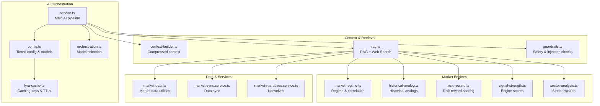
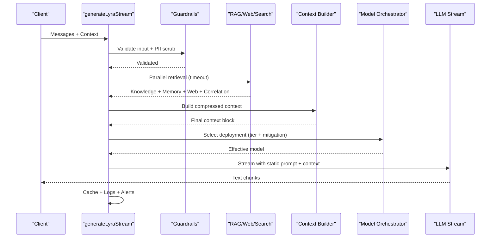
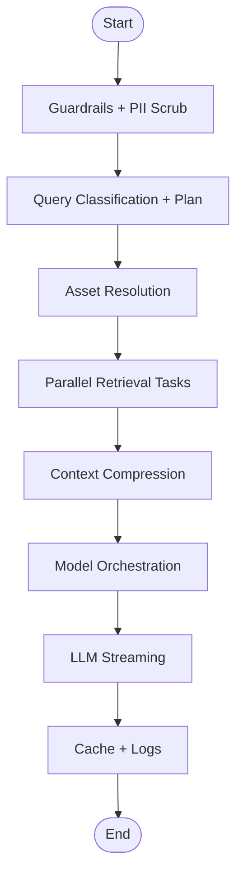
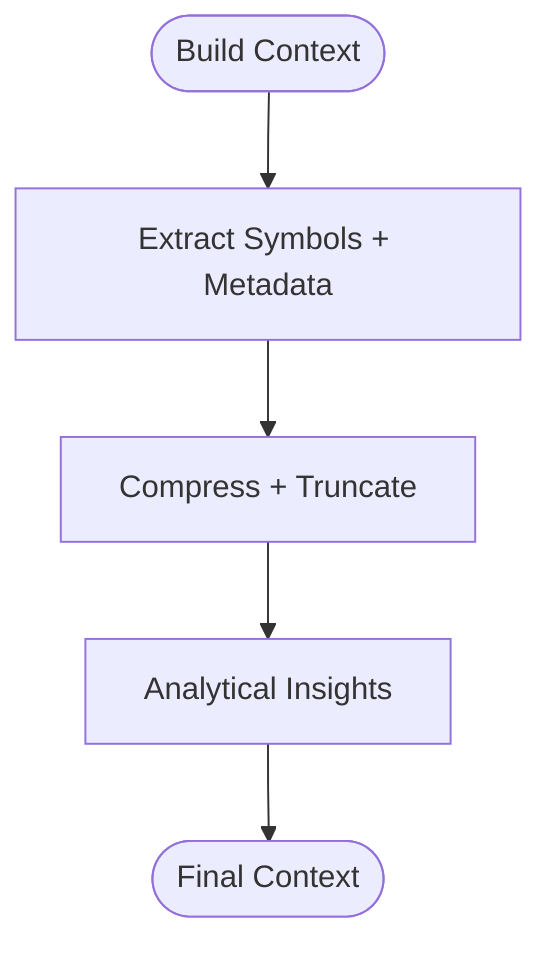
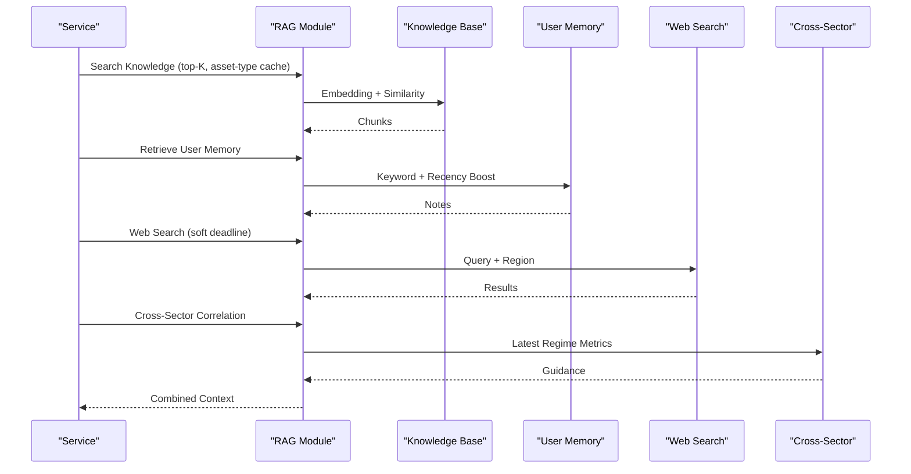
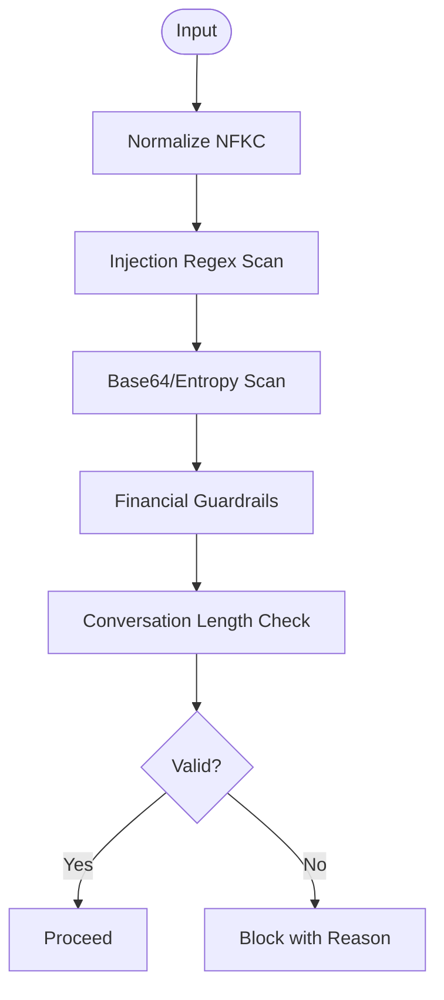
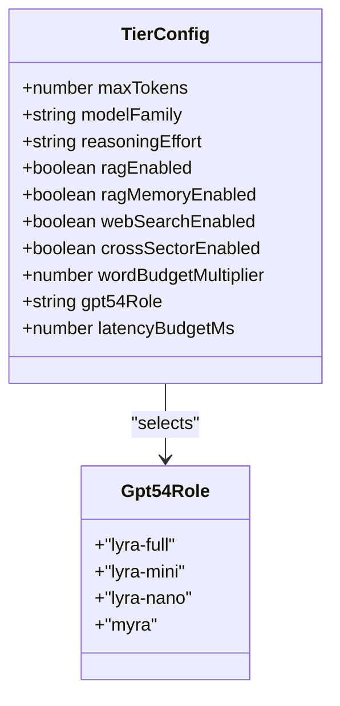
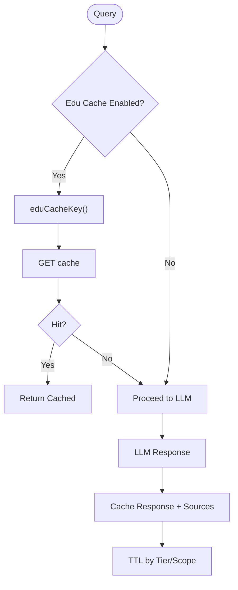
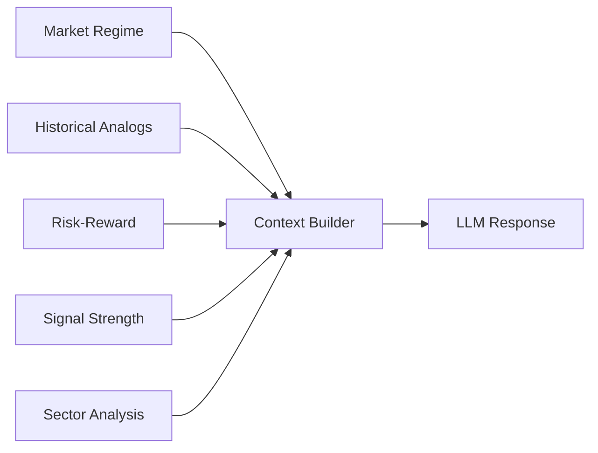
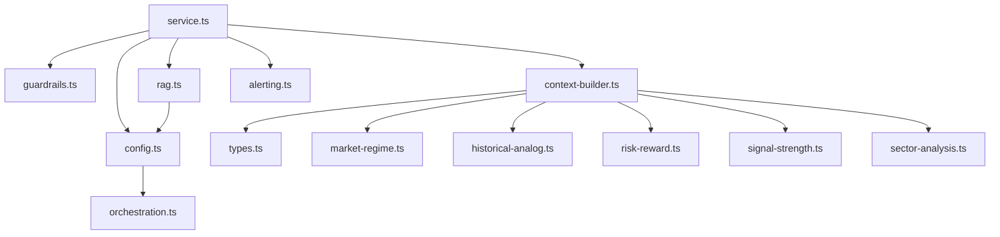

# Market Analysis AI

<cite>
**Referenced Files in This Document**
- [service.ts](file://src/lib/ai/service.ts)
- [context-builder.ts](file://src/lib/ai/context-builder.ts)
- [rag.ts](file://src/lib/ai/rag.ts)
- [guardrails.ts](file://src/lib/ai/guardrails.ts)
- [config.ts](file://src/lib/ai/config.ts)
- [lyra-cache.ts](file://src/lib/ai/lyra-cache.ts)
- [alerting.ts](file://src/lib/ai/alerting.ts)
- [orchestration.ts](file://src/lib/ai/orchestration.ts)
- [types.ts](file://src/lib/ai/types.ts)
- [market-data.ts](file://src/lib/market-data.ts)
- [market-regime.ts](file://src/lib/engines/market-regime.ts)
- [historical-analog.ts](file://src/lib/engines/historical-analog.ts)
- [risk-reward.ts](file://src/lib/engines/risk-reward.ts)
- [signal-strength.ts](file://src/lib/engines/signal-strength.ts)
- [sector-analysis.ts](file://src/lib/engines/sector-analysis.ts)
- [market-sync.service.ts](file://src/lib/services/market-sync.service.ts)
- [market-narratives.service.ts](file://src/lib/services/market-narratives.service.ts)
</cite>

## Table of Contents
1. [Introduction](#introduction)
2. [Project Structure](#project-structure)
3. [Core Components](#core-components)
4. [Architecture Overview](#architecture-overview)
5. [Detailed Component Analysis](#detailed-component-analysis)
6. [Dependency Analysis](#dependency-analysis)
7. [Performance Considerations](#performance-considerations)
8. [Troubleshooting Guide](#troubleshooting-guide)
9. [Conclusion](#conclusion)

## Introduction
This document describes the Market Analysis AI system that powers LyraAlpha's AI-driven market intelligence. It analyzes market signals, interprets technical indicators, and generates contextual commentary grounded in real-time market data, institutional knowledge, and user behavior. The system integrates with market data feeds, performs real-time analysis, and automates insight generation while enforcing explainable AI, signal validation, and confidence scoring. It also includes robust guardrails, injection prevention, content safety, performance optimization, caching strategies, and multi-model coordination.

## Project Structure
The Market Analysis AI is implemented primarily in the `src/lib/ai` directory and integrates with market engines, services, and data utilities. Key areas include:
- AI orchestration and streaming responses
- Context building and compression
- Retrieval Augmented Generation (RAG) with knowledge and memory
- Guardrails and safety validation
- Tiered configuration and model orchestration
- Caching and alerting systems
- Market engines for regime, analogs, risk-reward, and signals
- Market data integration and narrative services

**Diagram sources**
- [service.ts:383-1599](file://src/lib/ai/service.ts#L383-L1599)
- [config.ts:130-387](file://src/lib/ai/config.ts#L130-L387)
- [context-builder.ts:80-618](file://src/lib/ai/context-builder.ts#L80-L618)
- [rag.ts:676-800](file://src/lib/ai/rag.ts#L676-L800)
- [guardrails.ts:1-259](file://src/lib/ai/guardrails.ts#L1-L259)
- [lyra-cache.ts:1-90](file://src/lib/ai/lyra-cache.ts#L1-L90)
- [market-regime.ts](file://src/lib/engines/market-regime.ts)
- [historical-analog.ts](file://src/lib/engines/historical-analog.ts)
- [risk-reward.ts](file://src/lib/engines/risk-reward.ts)
- [signal-strength.ts](file://src/lib/engines/signal-strength.ts)
- [sector-analysis.ts](file://src/lib/engines/sector-analysis.ts)
- [market-data.ts](file://src/lib/market-data.ts)
- [market-sync.service.ts](file://src/lib/services/market-sync.service.ts)
- [market-narratives.service.ts](file://src/lib/services/market-narratives.service.ts)

**Section sources**
- [service.ts:383-1599](file://src/lib/ai/service.ts#L383-L1599)
- [config.ts:130-387](file://src/lib/ai/config.ts#L130-L387)
- [context-builder.ts:80-618](file://src/lib/ai/context-builder.ts#L80-L618)
- [rag.ts:676-800](file://src/lib/ai/rag.ts#L676-L800)
- [guardrails.ts:1-259](file://src/lib/ai/guardrails.ts#L1-L259)
- [lyra-cache.ts:1-90](file://src/lib/ai/lyra-cache.ts#L1-L90)

## Core Components
- AI Orchestration and Streaming: The main pipeline orchestrates safety checks, context building, retrieval, and LLM streaming with tiered configurations and model orchestration.
- Context Builder: Produces a compact, structured context block from market data, user memory, and institutional knowledge, with sentence-aware truncation and analytical chain-of-thought.
- Retrieval-Augmented Generation (RAG): Implements knowledge retrieval, user memory retrieval, web search, and cross-sector correlation, with fast-path caching and post-retrieval injection scanning.
- Guardrails and Safety: Validates inputs for prompt injection, financial advice prohibition, and base64-encoded injection attempts; enforces conversation length limits and PII scrubbing.
- Tiered Configuration and Model Orchestration: Defines plan-specific tiers (STARTER, PRO, ELITE, ENTERPRISE) with model families, token budgets, reasoning effort, and latency budgets; selects optimal GPT-5.4 deployments.
- Caching and Model Keys: Provides educational cache, model response cache, and asset symbol cache with TTLs and hashing strategies.
- Market Engines: Integrates regime analysis, historical analogs, risk-reward scoring, signal strength, and sector rotation to enrich context.
- Market Data Integration: Connects to market data utilities, sync services, and narrative services for real-time feeds and structured market commentary.

**Section sources**
- [service.ts:383-1599](file://src/lib/ai/service.ts#L383-L1599)
- [context-builder.ts:80-618](file://src/lib/ai/context-builder.ts#L80-L618)
- [rag.ts:1-200](file://src/lib/ai/rag.ts#L1-L200)
- [guardrails.ts:1-259](file://src/lib/ai/guardrails.ts#L1-L259)
- [config.ts:130-387](file://src/lib/ai/config.ts#L130-L387)
- [lyra-cache.ts:1-90](file://src/lib/ai/lyra-cache.ts#L1-L90)
- [market-regime.ts](file://src/lib/engines/market-regime.ts)
- [historical-analog.ts](file://src/lib/engines/historical-analog.ts)
- [risk-reward.ts](file://src/lib/engines/risk-reward.ts)
- [signal-strength.ts](file://src/lib/engines/signal-strength.ts)
- [sector-analysis.ts](file://src/lib/engines/sector-analysis.ts)
- [market-data.ts](file://src/lib/market-data.ts)
- [market-sync.service.ts](file://src/lib/services/market-sync.service.ts)
- [market-narratives.service.ts](file://src/lib/services/market-narratives.service.ts)

## Architecture Overview
The system follows a tiered, cache-aware orchestration:
- Input safety and classification drive tier selection and model family.
- Parallel retrieval tasks (RAG, memory, web search, cross-sector) are executed with timeouts and soft deadlines.
- Context is compressed and truncated to fit token budgets.
- LLM streaming uses a static system prompt plus a dynamic context message, with cache keys differentiated by plan, tier, asset type, symbol, and response mode.
- Outputs are validated, cached, and monitored for cost, latency, and quality.

**Diagram sources**
- [service.ts:427-1599](file://src/lib/ai/service.ts#L427-L1599)
- [guardrails.ts:232-259](file://src/lib/ai/guardrails.ts#L232-L259)
- [rag.ts:842-1004](file://src/lib/ai/rag.ts#L842-L1004)
- [context-builder.ts:80-618](file://src/lib/ai/context-builder.ts#L80-L618)
- [orchestration.ts:1-8](file://src/lib/ai/orchestration.ts#L1-L8)

**Section sources**
- [service.ts:427-1599](file://src/lib/ai/service.ts#L427-L1599)
- [guardrails.ts:232-259](file://src/lib/ai/guardrails.ts#L232-L259)
- [rag.ts:842-1004](file://src/lib/ai/rag.ts#L842-L1004)
- [context-builder.ts:80-618](file://src/lib/ai/context-builder.ts#L80-L618)
- [orchestration.ts:1-8](file://src/lib/ai/orchestration.ts#L1-L8)

## Detailed Component Analysis

### AI Orchestration Pipeline
- Safety and PII scrubbing: Validates inputs, conversation length, and scrubs PII before any LLM exposure.
- Query classification: Determines tier (SIMPLE/MODERATE/COMPLEX) and chat mode (compare, stress-test, portfolio, macro-research).
- Asset resolution: Auto-detects symbols from query or context; resolves asset type and region.
- Parallel retrieval: Executes RAG, memory, web search, cross-sector correlation, and historical analogs with timeouts and soft deadlines.
- Context compression: Uses sentence-aware truncation and analytical chain-of-thought for score patterns.
- Model orchestration: Selects GPT-5.4 deployment based on tier and fallback mitigation.
- Streaming and caching: Streams LLM responses, caches model outputs and sources, and logs conversation logs.

**Diagram sources**
- [service.ts:427-1599](file://src/lib/ai/service.ts#L427-L1599)

**Section sources**
- [service.ts:427-1599](file://src/lib/ai/service.ts#L427-L1599)

### Context Building and Compression
- Structured context: Builds a compact, token-efficient context combining asset data, engine scores, regime, performance, and external sources.
- Sentence-aware truncation: Ensures clean cuts at sentence boundaries to preserve readability.
- Analytical chain-of-thought: Precomputes insights from score dynamics for non-SIMPLE tiers.
- Smart asset list: Limits available assets to current symbol, mentioned symbols, and curated benchmarks.

**Diagram sources**
- [context-builder.ts:80-618](file://src/lib/ai/context-builder.ts#L80-L618)

**Section sources**
- [context-builder.ts:80-618](file://src/lib/ai/context-builder.ts#L80-L618)

### Retrieval-Augmented Generation (RAG)
- Knowledge search: Embedding-based similarity search with tier-aware thresholds, pre-cached asset-type chunks, and query-aware fast-path caching.
- Memory retrieval: User memory and global/session notes with keyword extraction and recency boosting.
- Web search: Soft deadline with region inference and relevance tuning.
- Cross-sector correlation: Market regime metrics for macro/global queries.
- Historical analogs: Risk-reward scoring and analog context for ELITE/ENTERPRISE users.
- Security: Post-retrieval injection scanning to filter poisoned chunks.

**Diagram sources**
- [rag.ts:676-800](file://src/lib/ai/rag.ts#L676-L800)
- [service.ts:842-1084](file://src/lib/ai/service.ts#L842-L1084)

**Section sources**
- [rag.ts:676-800](file://src/lib/ai/rag.ts#L676-L800)
- [service.ts:842-1084](file://src/lib/ai/service.ts#L842-L1084)

### Guardrails and Safety
- Injection detection: Regex patterns for role hijacking and instruction overrides; Unicode normalization to prevent homoglyph evasion.
- Financial guardrails: Blocks prohibited phrases and intent-aware checks for advice and predictions.
- Base64 scanning: Detects high-entropy encoded content indicative of injection attempts.
- Conversation caps: Enforces maximum conversation length to prevent context-window overflow.

**Diagram sources**
- [guardrails.ts:103-259](file://src/lib/ai/guardrails.ts#L103-L259)

**Section sources**
- [guardrails.ts:103-259](file://src/lib/ai/guardrails.ts#L103-L259)

### Tiered Configuration and Model Orchestration
- Tier configuration: Defines max tokens, reasoning effort, RAG/web search flags, cross-sector enablement, word budget multiplier, and latency budgets per plan.
- Model orchestration: Selects GPT-5.4 deployments (nano, mini, full) with graceful fallback to primary deployment.
- Fallback mitigation: Automatically switches to nano when fallback rate exceeds threshold.

**Diagram sources**
- [config.ts:136-147](file://src/lib/ai/config.ts#L136-L147)
- [config.ts:31-49](file://src/lib/ai/config.ts#L31-L49)
- [orchestration.ts:1-8](file://src/lib/ai/orchestration.ts#L1-L8)

**Section sources**
- [config.ts:130-387](file://src/lib/ai/config.ts#L130-L387)
- [orchestration.ts:1-8](file://src/lib/ai/orchestration.ts#L1-L8)

### Caching Strategies
- Educational cache: Caches simplified responses for Starter/PRO SIMPLE queries with stop-word normalization and scoping.
- Model response cache: Caches LLM outputs keyed by plan, tier, asset type, symbol, and response mode; TTL varies by tier and market-level vs asset-level.
- Asset symbols cache: Maintains fresh and stale caches for asset lists with extended stale TTL.
- Fast-path RAG: Query-aware and asset-type caches reduce embedding and vector search costs.

**Diagram sources**
- [lyra-cache.ts:36-90](file://src/lib/ai/lyra-cache.ts#L36-L90)
- [service.ts:1416-1599](file://src/lib/ai/service.ts#L1416-L1599)

**Section sources**
- [lyra-cache.ts:1-90](file://src/lib/ai/lyra-cache.ts#L1-L90)
- [service.ts:1416-1599](file://src/lib/ai/service.ts#L1416-L1599)

### Market Engines and Signals
- Market regime: Provides regime state, risk, volatility, breadth, and cross-sector correlation metrics.
- Historical analogs: Identifies analogous periods and computes risk-reward asymmetry for context.
- Risk-reward scoring: Calculates risk-reward metrics using price, 52-week range, and analyst targets.
- Signal strength: Engine scores (trend, momentum, volatility, liquidity, sentiment, trust) with dynamics and layers.
- Sector analysis: Sector rotation and factor alignment for macro queries.

**Diagram sources**
- [market-regime.ts](file://src/lib/engines/market-regime.ts)
- [historical-analog.ts](file://src/lib/engines/historical-analog.ts)
- [risk-reward.ts](file://src/lib/engines/risk-reward.ts)
- [signal-strength.ts](file://src/lib/engines/signal-strength.ts)
- [sector-analysis.ts](file://src/lib/engines/sector-analysis.ts)
- [context-builder.ts:134-153](file://src/lib/ai/context-builder.ts#L134-L153)

**Section sources**
- [market-regime.ts](file://src/lib/engines/market-regime.ts)
- [historical-analog.ts](file://src/lib/engines/historical-analog.ts)
- [risk-reward.ts](file://src/lib/engines/risk-reward.ts)
- [signal-strength.ts](file://src/lib/engines/signal-strength.ts)
- [sector-analysis.ts](file://src/lib/engines/sector-analysis.ts)
- [context-builder.ts:134-153](file://src/lib/ai/context-builder.ts#L134-L153)

### Market Data Integration and Narratives
- Market data utilities: Provide helpers for market data handling and formatting.
- Market sync service: Coordinates synchronization of market data feeds.
- Market narratives service: Generates structured narratives for market pulses and trends.

**Section sources**
- [market-data.ts](file://src/lib/market-data.ts)
- [market-sync.service.ts](file://src/lib/services/market-sync.service.ts)
- [market-narratives.service.ts](file://src/lib/services/market-narratives.service.ts)

## Dependency Analysis
The AI system exhibits strong modularity with clear separation of concerns:
- service.ts depends on config.ts, guardrails.ts, context-builder.ts, rag.ts, and market engines.
- rag.ts depends on knowledge base hydration, embedding client, and Redis for caching.
- context-builder.ts depends on types.ts and market engines for enriched data.
- config.ts and orchestration.ts coordinate model selection and deployment.
- alerting.ts monitors cost, latency, validation, and fallback rates.

**Diagram sources**
- [service.ts:383-1599](file://src/lib/ai/service.ts#L383-L1599)
- [config.ts:130-387](file://src/lib/ai/config.ts#L130-L387)
- [guardrails.ts:1-259](file://src/lib/ai/guardrails.ts#L1-L259)
- [context-builder.ts:1-80](file://src/lib/ai/context-builder.ts#L1-L80)
- [rag.ts:1-100](file://src/lib/ai/rag.ts#L1-L100)
- [orchestration.ts:1-8](file://src/lib/ai/orchestration.ts#L1-L8)
- [alerting.ts:1-100](file://src/lib/ai/alerting.ts#L1-L100)
- [types.ts:1-69](file://src/lib/ai/types.ts#L1-L69)

**Section sources**
- [service.ts:383-1599](file://src/lib/ai/service.ts#L383-L1599)
- [config.ts:130-387](file://src/lib/ai/config.ts#L130-L387)
- [guardrails.ts:1-259](file://src/lib/ai/guardrails.ts#L1-L259)
- [context-builder.ts:1-80](file://src/lib/ai/context-builder.ts#L1-L80)
- [rag.ts:1-100](file://src/lib/ai/rag.ts#L1-L100)
- [orchestration.ts:1-8](file://src/lib/ai/orchestration.ts#L1-L8)
- [alerting.ts:1-100](file://src/lib/ai/alerting.ts#L1-L100)
- [types.ts:1-69](file://src/lib/ai/types.ts#L1-L69)

## Performance Considerations
- Parallel retrieval with timeouts and soft deadlines prevents LLM delays.
- Sentence-aware truncation and analytical chain-of-thought reduce token waste.
- Tiered token budgets and latency budgets ensure predictable performance.
- Caching strategies (educational, model response, asset symbols, RAG fast-path) minimize redundant work.
- Cost ceiling estimation and monitoring prevent runaway spending.
- Fallback mitigation automatically switches to nano when primary model degrades.

[No sources needed since this section provides general guidance]

## Troubleshooting Guide
Common issues and mitigations:
- Daily token cap exceeded: Check Redis counters and admin overrides; review reset timing.
- Insufficient credits: Verify user plan and credit balance; ensure SKIP_CREDITS is not enabled in production.
- RAG zero-result rate elevated: Investigate knowledge base hydration and embedding drift; monitor similarity thresholds.
- Web search outages: Monitor consecutive failure alerts and circuit breaker behavior.
- Output validation failures: Review section validation rules and content structure.
- Fallback rate elevated: Check deployment health and enable fallback mitigation to switch to nano.
- Latency budget violations: Tune tier latency budgets and model selection; monitor streaming performance.

**Section sources**
- [alerting.ts:85-356](file://src/lib/ai/alerting.ts#L85-L356)
- [service.ts:656-700](file://src/lib/ai/service.ts#L656-L700)

## Conclusion
The Market Analysis AI system combines robust safety, explainable context construction, and multi-source retrieval to deliver accurate, real-time market insights. Its tiered configuration, caching strategies, and alerting mechanisms ensure reliability, performance, and cost control. By integrating market engines and real-time data feeds, it provides automated, confident, and contextual market commentary suitable for traders and analysts across plan tiers.