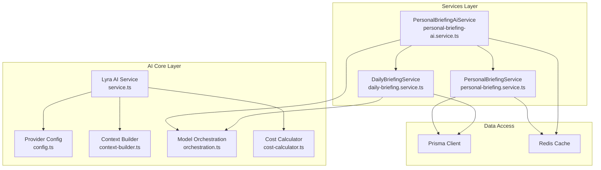
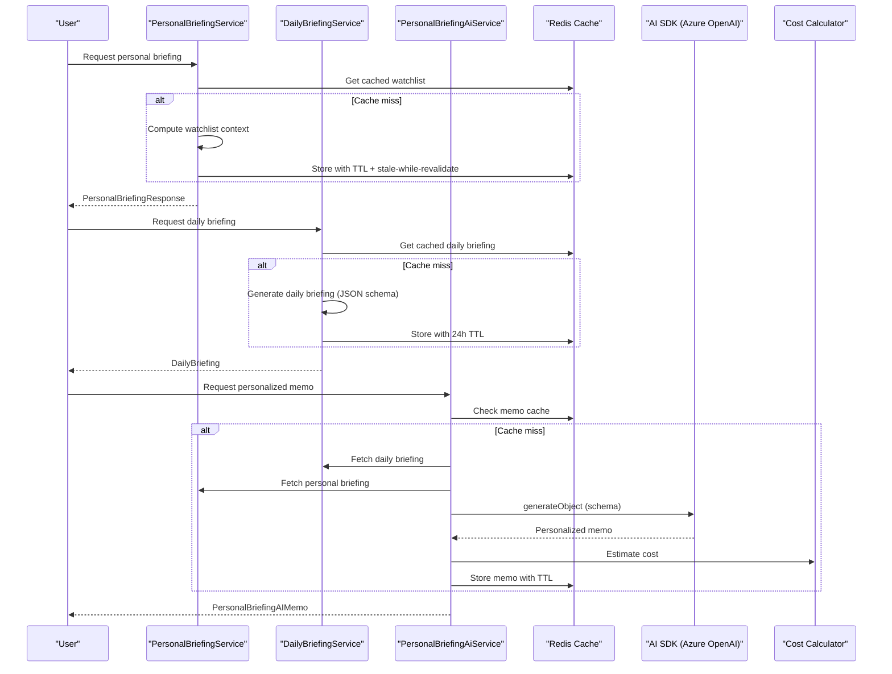
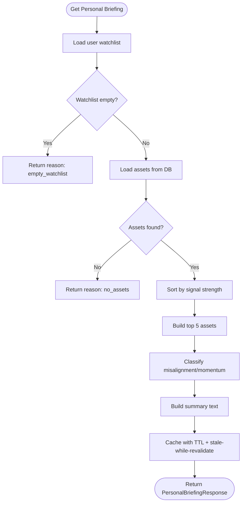
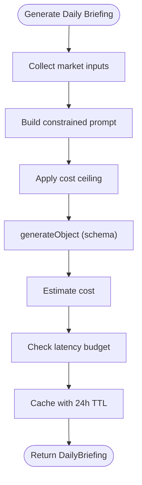
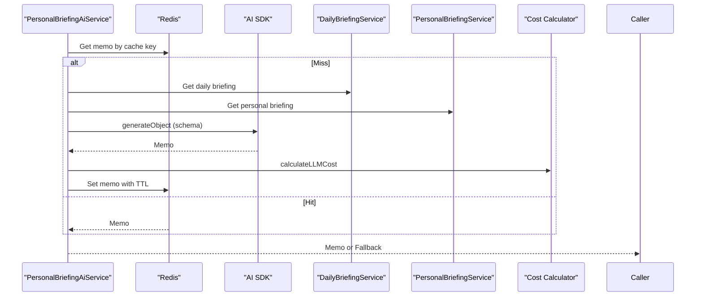
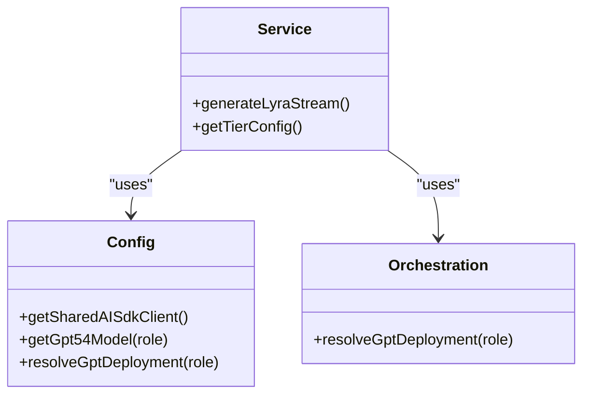
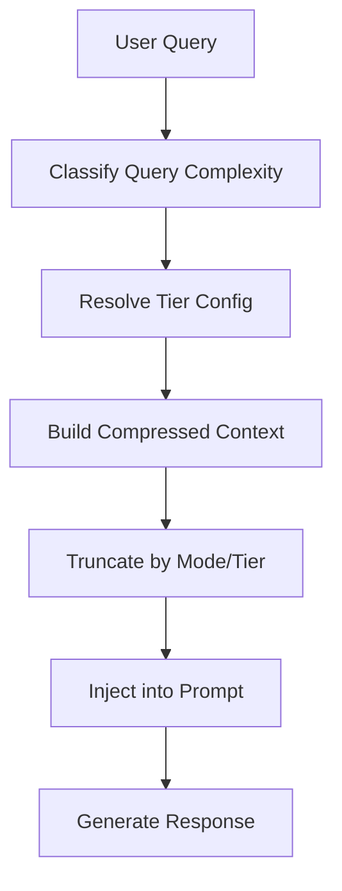
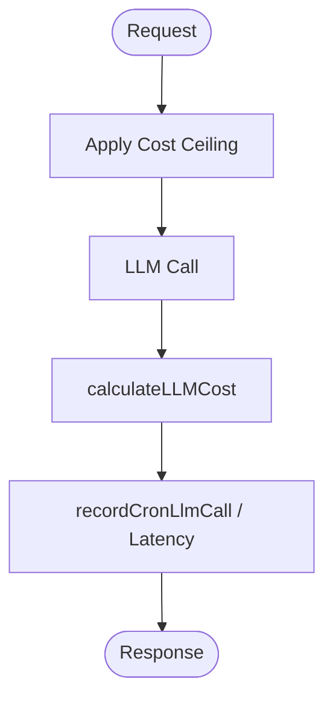
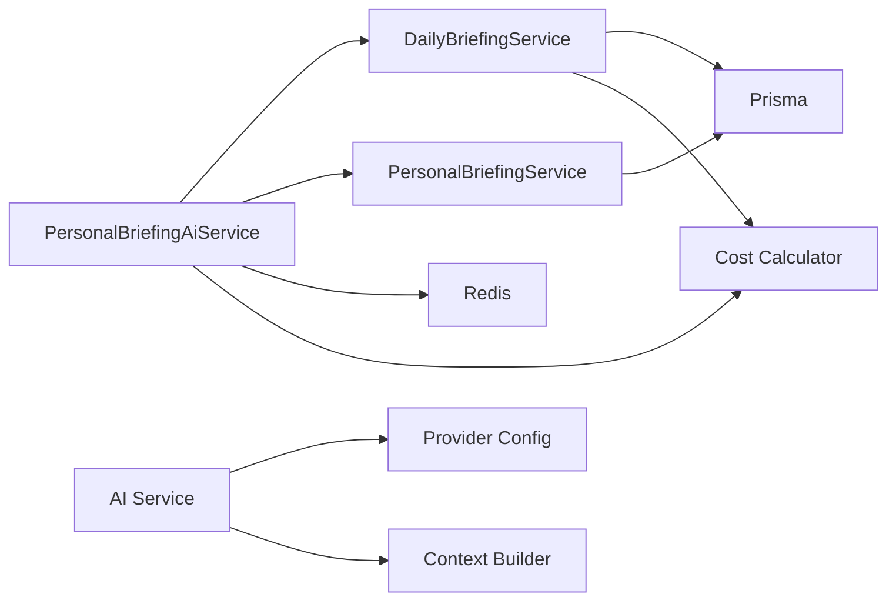

# Personal Briefing AI

<cite>
**Referenced Files in This Document**
- [personal-briefing-ai.service.ts](file://src/lib/services/personal-briefing-ai.service.ts)
- [personal-briefing.service.ts](file://src/lib/services/personal-briefing.service.ts)
- [daily-briefing.service.ts](file://src/lib/services/daily-briefing.service.ts)
- [service.ts](file://src/lib/ai/service.ts)
- [config.ts](file://src/lib/ai/config.ts)
- [context-builder.ts](file://src/lib/ai/context-builder.ts)
- [orchestration.ts](file://src/lib/ai/orchestration.ts)
- [cost-calculator.ts](file://src/lib/ai/cost-calculator.ts)
</cite>

## Table of Contents
1. [Introduction](#introduction)
2. [Project Structure](#project-structure)
3. [Core Components](#core-components)
4. [Architecture Overview](#architecture-overview)
5. [Detailed Component Analysis](#detailed-component-analysis)
6. [Dependency Analysis](#dependency-analysis)
7. [Performance Considerations](#performance-considerations)
8. [Troubleshooting Guide](#troubleshooting-guide)
9. [Conclusion](#conclusion)

## Introduction
This document describes the Personal Briefing AI system, which synthesizes a user's personalized watchlist context with a daily market regime overview to produce a concise, actionable morning memo. It covers the AI service architecture, provider abstraction for Azure OpenAI (via the AI SDK), the briefing generation workflow, user context processing, cost optimization strategies, fallback mechanisms, performance monitoring, and safety controls. It also outlines API endpoints, request/response schemas, and authentication requirements for the relevant routes.

## Project Structure
The Personal Briefing AI spans three primary layers:
- Services: Orchestrate data collection, context assembly, and AI generation.
- AI Core: Provide provider abstraction, context building, cost calculation, and safety controls.
- Data Access: Retrieve user watchlists, assets, and market regime data.

**Diagram sources**
- [personal-briefing.service.ts:141-155](file://src/lib/services/personal-briefing.service.ts#L141-L155)
- [personal-briefing-ai.service.ts:178-205](file://src/lib/services/personal-briefing-ai.service.ts#L178-L205)
- [daily-briefing.service.ts:352-550](file://src/lib/services/daily-briefing.service.ts#L352-L550)
- [service.ts:211-223](file://src/lib/ai/service.ts#L211-L223)
- [config.ts:16-24](file://src/lib/ai/config.ts#L16-L24)
- [context-builder.ts:80-618](file://src/lib/ai/context-builder.ts#L80-L618)
- [orchestration.ts:1-8](file://src/lib/ai/orchestration.ts#L1-L8)
- [cost-calculator.ts:293-313](file://src/lib/ai/cost-calculator.ts#L293-L313)

**Section sources**
- [personal-briefing.service.ts:1-155](file://src/lib/services/personal-briefing.service.ts#L1-L155)
- [personal-briefing-ai.service.ts:1-205](file://src/lib/services/personal-briefing-ai.service.ts#L1-L205)
- [daily-briefing.service.ts:1-550](file://src/lib/services/daily-briefing.service.ts#L1-L550)
- [service.ts:211-223](file://src/lib/ai/service.ts#L211-L223)
- [config.ts:16-24](file://src/lib/ai/config.ts#L16-L24)
- [context-builder.ts:80-618](file://src/lib/ai/context-builder.ts#L80-L618)
- [orchestration.ts:1-8](file://src/lib/ai/orchestration.ts#L1-L8)
- [cost-calculator.ts:293-313](file://src/lib/ai/cost-calculator.ts#L293-L313)

## Core Components
- PersonalBriefingService: Builds a user's personalized watchlist snapshot, computes top assets, alignment, and momentum, and caches it with stale-while-revalidate semantics.
- DailyBriefingService: Produces a daily market regime overview for a region, with JSON-schema constrained generation and cost/latency monitoring.
- PersonalBriefingAiService: Generates a concise, personalized morning memo by combining daily market context with the user's watchlist, with Redis caching and fallback logic.
- AI Service (service.ts): Provides provider abstraction, query classification, context building, safety rails, cost tracking, and performance monitoring.
- Provider Config (config.ts): Centralizes Azure OpenAI deployment mapping and tiered routing configuration.
- Context Builder (context-builder.ts): Constructs compact, structured context blocks tailored to query complexity and response mode.
- Model Orchestration (orchestration.ts): Resolves the effective deployment for a given role.
- Cost Calculator (cost-calculator.ts): Computes exact token costs for LLM usage.

**Section sources**
- [personal-briefing.service.ts:141-155](file://src/lib/services/personal-briefing.service.ts#L141-L155)
- [daily-briefing.service.ts:352-550](file://src/lib/services/daily-briefing.service.ts#L352-L550)
- [personal-briefing-ai.service.ts:178-205](file://src/lib/services/personal-briefing-ai.service.ts#L178-L205)
- [service.ts:211-223](file://src/lib/ai/service.ts#L211-L223)
- [config.ts:33-49](file://src/lib/ai/config.ts#L33-L49)
- [context-builder.ts:80-618](file://src/lib/ai/context-builder.ts#L80-L618)
- [orchestration.ts:1-8](file://src/lib/ai/orchestration.ts#L1-L8)
- [cost-calculator.ts:293-313](file://src/lib/ai/cost-calculator.ts#L293-L313)

## Architecture Overview
The Personal Briefing AI system integrates three services:
- DailyBriefingService generates a regional market overview and is cached for 24 hours.
- PersonalBriefingService builds a user's watchlist context and caches it with a short TTL and stale-while-revalidate.
- PersonalBriefingAiService orchestrates memo generation by combining both contexts, leveraging Redis caching and a robust fallback.

**Diagram sources**
- [personal-briefing.service.ts:141-155](file://src/lib/services/personal-briefing.service.ts#L141-L155)
- [daily-briefing.service.ts:352-550](file://src/lib/services/daily-briefing.service.ts#L352-L550)
- [personal-briefing-ai.service.ts:178-205](file://src/lib/services/personal-briefing-ai.service.ts#L178-L205)
- [service.ts:383-636](file://src/lib/ai/service.ts#L383-L636)
- [cost-calculator.ts:293-313](file://src/lib/ai/cost-calculator.ts#L293-L313)

## Detailed Component Analysis

### PersonalBriefingService
Responsibilities:
- Retrieve user watchlist and related assets.
- Compute top assets by signal strength, and derive misalignment and strong-momentum lists.
- Build a concise summary and cache results with TTL and stale-while-revalidate.

Key behaviors:
- Watchlist lookup via Prisma.
- Sorting by signal strength and slicing top 5 assets.
- Categorization of misalignment and momentum thresholds.
- Caching with withStaleWhileRevalidate for 5 minutes TTL and 10 minutes stale window.

**Diagram sources**
- [personal-briefing.service.ts:67-139](file://src/lib/services/personal-briefing.service.ts#L67-L139)

**Section sources**
- [personal-briefing.service.ts:67-155](file://src/lib/services/personal-briefing.service.ts#L67-L155)

### DailyBriefingService
Responsibilities:
- Assemble market regime, movers, events, and discovery items.
- Generate a concise JSON schema-backed daily briefing.
- Enforce cost ceilings and latency budgets for cron-triggered generation.

Key behaviors:
- Collect inputs from Prisma (regime, movers, events, discovery).
- Build a structured prompt with constraints.
- Apply cost ceiling truncation to bound context size.
- Record LLM call metrics and enforce latency budget.

**Diagram sources**
- [daily-briefing.service.ts:408-548](file://src/lib/services/daily-briefing.service.ts#L408-L548)
- [cost-calculator.ts:293-313](file://src/lib/ai/cost-calculator.ts#L293-L313)

**Section sources**
- [daily-briefing.service.ts:352-550](file://src/lib/services/daily-briefing.service.ts#L352-L550)
- [cost-calculator.ts:293-313](file://src/lib/ai/cost-calculator.ts#L293-L313)

### PersonalBriefingAiService
Responsibilities:
- Combine daily briefing and personal briefing into a personalized memo.
- Cache memo results keyed by input fingerprints.
- Fallback to a deterministic memo when AI generation fails.

Key behaviors:
- Build cache key from daily and personal briefing payloads.
- Attempt AI generation with schema validation.
- Record LLM call metrics and estimate cost.
- On failure, construct a fallback memo based on top assets and risks.

**Diagram sources**
- [personal-briefing-ai.service.ts:178-205](file://src/lib/services/personal-briefing-ai.service.ts#L178-L205)
- [cost-calculator.ts:293-313](file://src/lib/ai/cost-calculator.ts#L293-L313)

**Section sources**
- [personal-briefing-ai.service.ts:178-205](file://src/lib/services/personal-briefing-ai.service.ts#L178-L205)

### AI Service Abstraction and Provider Configuration
Provider abstraction:
- getSharedAISdkClient returns a singleton AI SDK client configured for Azure OpenAI.
- getGpt54Model resolves a specific deployment by role, with graceful fallback to primary deployment.
- resolveGptDeployment maps roles to deployments.

Tiered routing:
- Config defines tiered capabilities (SIMPLE/MODERATE/COMPLEX) per plan (STARTER/PRO/ELITE/ENTERPRISE).
- Controls include reasoning effort, RAG/web search/cross-sector toggles, token budgets, and latency budgets.

**Diagram sources**
- [config.ts:16-56](file://src/lib/ai/config.ts#L16-L56)
- [service.ts:211-223](file://src/lib/ai/service.ts#L211-L223)
- [orchestration.ts:1-8](file://src/lib/ai/orchestration.ts#L1-L8)

**Section sources**
- [config.ts:16-56](file://src/lib/ai/config.ts#L16-L56)
- [service.ts:211-223](file://src/lib/ai/service.ts#L211-L223)
- [orchestration.ts:1-8](file://src/lib/ai/orchestration.ts#L1-L8)

### Context Building and Personalization
Context builder:
- Compresses structured data into token-efficient blocks.
- Supports response modes (default, compare, stress-test, portfolio, macro-research).
- Applies sentence-aware truncation and smart asset list construction.

Personalization:
- Integrates daily market regime, top movers, and discovery highlights.
- Tailors messaging to user’s watchlist composition and alignment.

**Diagram sources**
- [context-builder.ts:80-618](file://src/lib/ai/context-builder.ts#L80-L618)
- [service.ts:455-502](file://src/lib/ai/service.ts#L455-L502)

**Section sources**
- [context-builder.ts:80-618](file://src/lib/ai/context-builder.ts#L80-L618)
- [service.ts:455-502](file://src/lib/ai/service.ts#L455-L502)

### Cost Optimization and Monitoring
Cost optimization:
- Cost calculator supports exact token counting and tiered pricing.
- Cost ceiling applies truncation to bound input size for expensive operations.
- Early model cache and educational cache reduce LLM usage.

Monitoring:
- Cron LLM call recording tracks cost and latency.
- Latency violations and daily token caps are enforced.
- Daily token counters use atomic Redis operations.

**Diagram sources**
- [daily-briefing.service.ts:466-522](file://src/lib/services/daily-briefing.service.ts#L466-L522)
- [cost-calculator.ts:293-313](file://src/lib/ai/cost-calculator.ts#L293-L313)
- [service.ts:656-676](file://src/lib/ai/service.ts#L656-L676)

**Section sources**
- [daily-briefing.service.ts:466-522](file://src/lib/services/daily-briefing.service.ts#L466-L522)
- [cost-calculator.ts:293-313](file://src/lib/ai/cost-calculator.ts#L293-L313)
- [service.ts:656-676](file://src/lib/ai/service.ts#L656-L676)

## Dependency Analysis
- PersonalBriefingAiService depends on DailyBriefingService and PersonalBriefingService for inputs and on Redis for caching.
- Both services rely on Prisma for data retrieval and Redis for caching.
- AI Service centralizes provider configuration and context building.
- Cost Calculator is used across services for accurate cost estimation.

**Diagram sources**
- [personal-briefing-ai.service.ts:178-205](file://src/lib/services/personal-briefing-ai.service.ts#L178-L205)
- [personal-briefing.service.ts:141-155](file://src/lib/services/personal-briefing.service.ts#L141-L155)
- [daily-briefing.service.ts:352-550](file://src/lib/services/daily-briefing.service.ts#L352-L550)
- [service.ts:211-223](file://src/lib/ai/service.ts#L211-L223)
- [config.ts:16-24](file://src/lib/ai/config.ts#L16-L24)
- [context-builder.ts:80-618](file://src/lib/ai/context-builder.ts#L80-L618)
- [cost-calculator.ts:293-313](file://src/lib/ai/cost-calculator.ts#L293-L313)

**Section sources**
- [personal-briefing-ai.service.ts:178-205](file://src/lib/services/personal-briefing-ai.service.ts#L178-L205)
- [personal-briefing.service.ts:141-155](file://src/lib/services/personal-briefing.service.ts#L141-L155)
- [daily-briefing.service.ts:352-550](file://src/lib/services/daily-briefing.service.ts#L352-L550)
- [service.ts:211-223](file://src/lib/ai/service.ts#L211-L223)
- [config.ts:16-24](file://src/lib/ai/config.ts#L16-L24)
- [context-builder.ts:80-618](file://src/lib/ai/context-builder.ts#L80-L618)
- [cost-calculator.ts:293-313](file://src/lib/ai/cost-calculator.ts#L293-L313)

## Performance Considerations
- Caching: PersonalBriefingService uses stale-while-revalidate to minimize DB load; DailyBriefingService caches for 24 hours; PersonalBriefingAiService caches memos for 6 hours.
- Early cache: AI Service supports early model cache reads to bypass heavy context building.
- Educational cache: Reduces repeated SIMPLE tier queries for starters/pro.
- Token budgeting: Tiered maxTokens and word budget multiplier constrain output sizes.
- Latency budgets: Cron jobs enforce strict latency budgets; violations are recorded.
- Atomic counters: Daily token usage employs atomic Redis operations to prevent race conditions.

[No sources needed since this section provides general guidance]

## Troubleshooting Guide
Common issues and mitigations:
- Redis failures: Caches are best-effort; failures do not block responses. Check connectivity and retry.
- AI generation failures: Fallback memo is generated using watchlist and daily risks.
- Daily token cap exceeded: Users receive a UsageLimitError with a midnight UTC reset timestamp.
- Mid-stream LLM errors: Credits are refunded to maintain fairness.
- Safety violations: Guardrails reject unsafe content; adjust prompts or inputs accordingly.

**Section sources**
- [personal-briefing-ai.service.ts:185-202](file://src/lib/services/personal-briefing-ai.service.ts#L185-L202)
- [service.ts:63-89](file://src/lib/ai/service.ts#L63-L89)
- [service.ts:656-676](file://src/lib/ai/service.ts#L656-L676)
- [service.ts:442-447](file://src/lib/ai/service.ts#L442-L447)

## Conclusion
The Personal Briefing AI system combines a daily market overview with personalized watchlist context to deliver concise, actionable insights. It leverages provider abstraction, robust caching, cost and latency controls, and safety measures to ensure reliability and efficiency. The modular design enables incremental enhancements, such as multi-model orchestration and expanded personalization features.