# RAG Knowledge Base

<cite>
**Referenced Files in This Document**
- [rag.ts](file://src/lib/ai/rag.ts)
- [chunker.ts](file://src/lib/ai/chunker.ts)
- [guardrails.ts](file://src/lib/ai/guardrails.ts)
- [context-builder.ts](file://src/lib/ai/context-builder.ts)
- [memory.ts](file://src/lib/ai/memory.ts)
- [seed-support-kb.ts](file://scripts/seed-support-kb.ts)
- [reingest-knowledge.ts](file://scripts/reingest-knowledge.ts)
- [migrate-embeddings.ts](file://scripts/migrate-embeddings.ts)
- [embed-memory/route.ts](file://src/app/api/cron/embed-memory/route.ts)
- [cron-auth.ts](file://src/lib/middleware/cron-auth.ts)
- [rag-optimizations.test.ts](file://src/lib/ai/__tests__/rag-optimizations.test.ts)
- [ai-responder.ts](file://src/lib/support/ai-responder.ts)
</cite>

## Table of Contents
1. [Introduction](#introduction)
2. [Project Structure](#project-structure)
3. [Core Components](#core-components)
4. [Architecture Overview](#architecture-overview)
5. [Detailed Component Analysis](#detailed-component-analysis)
6. [Dependency Analysis](#dependency-analysis)
7. [Performance Considerations](#performance-considerations)
8. [Troubleshooting Guide](#troubleshooting-guide)
9. [Conclusion](#conclusion)
10. [Appendices](#appendices)

## Introduction
This document describes the Retrieval-Augmented Generation (RAG) Knowledge Base system powering contextual answers and grounded responses. It covers the vector embedding architecture, pgvector integration, semantic search, knowledge document processing, chunking strategies, embedding generation, multi-level caching, similarity threshold tuning, quality scoring, relevance ranking, context injection, grounding techniques, vector store management, batch processing, background embedding jobs, and security measures including injection prevention and content validation.

## Project Structure
The RAG system spans several modules:
- Vector store and search: Prisma-backed pgvector with Redis caching
- Knowledge ingestion: Markdown chunking and embedding
- Memory: User conversation embedding and retrieval
- Context builder: Structured, token-efficient context injection
- Guardrails: Injection detection and content validation
- Cron jobs: Background embedding and cache warming

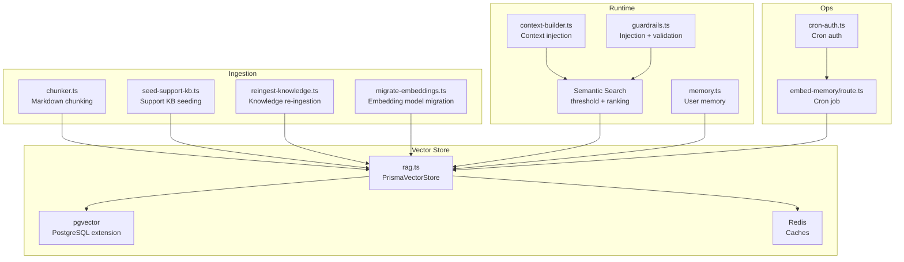

**Diagram sources**
- [rag.ts:187-989](file://src/lib/ai/rag.ts#L187-L989)
- [chunker.ts:62-110](file://src/lib/ai/chunker.ts#L62-L110)
- [seed-support-kb.ts:69-108](file://scripts/seed-support-kb.ts#L69-L108)
- [reingest-knowledge.ts:91-147](file://scripts/reingest-knowledge.ts#L91-L147)
- [migrate-embeddings.ts:25-74](file://scripts/migrate-embeddings.ts#L25-L74)
- [context-builder.ts:80-618](file://src/lib/ai/context-builder.ts#L80-L618)
- [guardrails.ts:44-259](file://src/lib/ai/guardrails.ts#L44-L259)
- [memory.ts:313-338](file://src/lib/ai/memory.ts#L313-L338)
- [embed-memory/route.ts:12-35](file://src/app/api/cron/embed-memory/route.ts#L12-L35)
- [cron-auth.ts:112-139](file://src/lib/middleware/cron-auth.ts#L112-L139)

**Section sources**
- [rag.ts:187-989](file://src/lib/ai/rag.ts#L187-L989)
- [chunker.ts:62-110](file://src/lib/ai/chunker.ts#L62-L110)
- [context-builder.ts:80-618](file://src/lib/ai/context-builder.ts#L80-L618)
- [guardrails.ts:44-259](file://src/lib/ai/guardrails.ts#L44-L259)
- [memory.ts:313-338](file://src/lib/ai/memory.ts#L313-L338)
- [seed-support-kb.ts:69-108](file://scripts/seed-support-kb.ts#L69-L108)
- [reingest-knowledge.ts:91-147](file://scripts/reingest-knowledge.ts#L91-L147)
- [migrate-embeddings.ts:25-74](file://scripts/migrate-embeddings.ts#L25-L74)
- [embed-memory/route.ts:12-35](file://src/app/api/cron/embed-memory/route.ts#L12-L35)
- [cron-auth.ts:112-139](file://src/lib/middleware/cron-auth.ts#L112-L139)

## Core Components
- PrismaVectorStore: Manages initialization, hydration, embedding generation, pgvector similarity search, and multi-level caching.
- Knowledge chunker: Splits markdown into semantically coherent chunks with metadata and asset-type targeting.
- Context builder: Produces compact, structured context blocks injected into prompts with mode-aware truncation.
- Guardrails: Regex-based injection detection, financial guardrails, and base64 entropy scanning.
- Memory: Stores conversation logs and queues embeddings for background processing.
- Cron jobs: Periodic embedding of conversation logs and cache warming.

**Section sources**
- [rag.ts:187-989](file://src/lib/ai/rag.ts#L187-L989)
- [chunker.ts:62-110](file://src/lib/ai/chunker.ts#L62-L110)
- [context-builder.ts:80-618](file://src/lib/ai/context-builder.ts#L80-L618)
- [guardrails.ts:44-259](file://src/lib/ai/guardrails.ts#L44-L259)
- [memory.ts:313-338](file://src/lib/ai/memory.ts#L313-L338)
- [embed-memory/route.ts:12-35](file://src/app/api/cron/embed-memory/route.ts#L12-L35)

## Architecture Overview
The system integrates three retrieval pathways:
- Knowledge base (pgvector): Chunked markdown with semantic boundaries and metadata.
- User memory (pgvector): Past conversations embedded and retrievable by similarity.
- Support KB (BM25): Small, static knowledge base using PostgreSQL full-text search.

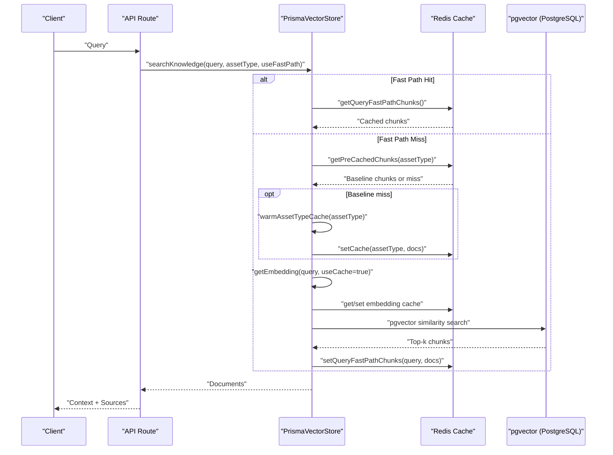

**Diagram sources**
- [rag.ts:677-823](file://src/lib/ai/rag.ts#L677-L823)
- [rag.ts:607-778](file://src/lib/ai/rag.ts#L607-L778)

**Section sources**
- [rag.ts:677-823](file://src/lib/ai/rag.ts#L677-L823)
- [rag.ts:607-778](file://src/lib/ai/rag.ts#L607-L778)

## Detailed Component Analysis

### Vector Store and pgvector Integration
- Initialization and hydration: Boot-level Redis lock prevents concurrent hydration; checks content hash to avoid re-embedding unchanged files; batch processes embeddings with retry/backoff.
- Embedding generation: Deterministic caching for query embeddings; batch embedding with exponential backoff; validates vector string shape before queries.
- Similarity search: Threshold-aware retrieval using pgvector inner product distance; merges pre-cached asset-type chunks; normalizes and deduplicates results; post-retrieval injection filtering.

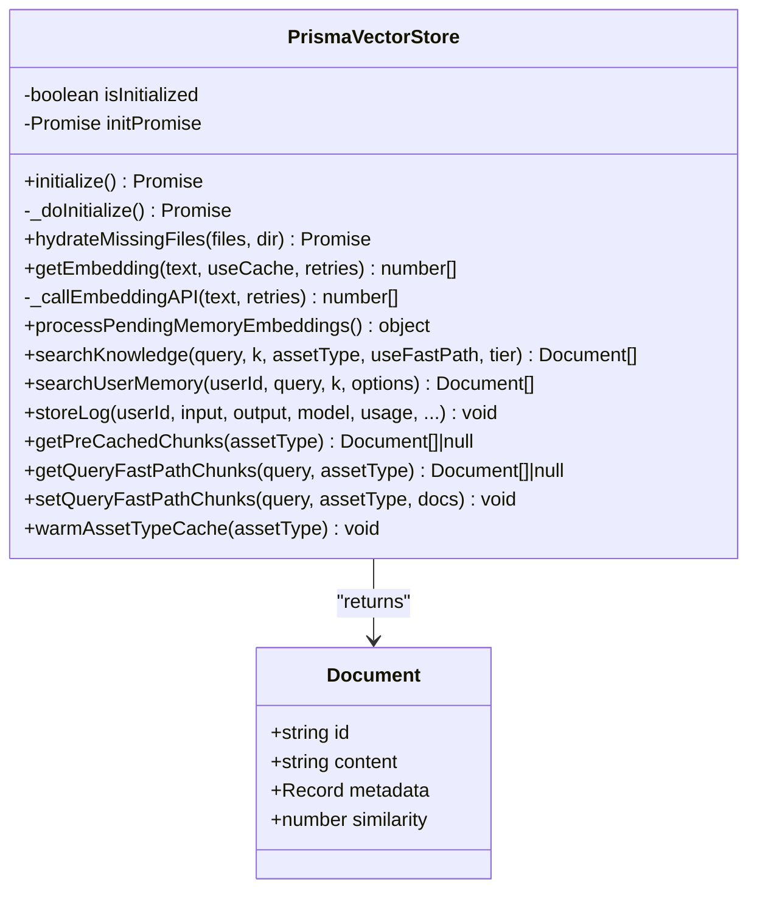

**Diagram sources**
- [rag.ts:187-989](file://src/lib/ai/rag.ts#L187-L989)

**Section sources**
- [rag.ts:191-271](file://src/lib/ai/rag.ts#L191-L271)
- [rag.ts:273-355](file://src/lib/ai/rag.ts#L273-L355)
- [rag.ts:374-439](file://src/lib/ai/rag.ts#L374-L439)
- [rag.ts:441-605](file://src/lib/ai/rag.ts#L441-L605)
- [rag.ts:677-823](file://src/lib/ai/rag.ts#L677-L823)
- [rag.ts:826-884](file://src/lib/ai/rag.ts#L826-L884)
- [rag.ts:889-983](file://src/lib/ai/rag.ts#L889-L983)

### Knowledge Document Processing Pipeline
- Chunking: Splits markdown by headers; enforces target/maximum/minimum chunk sizes; overlaps to preserve context; detects topics and asset types; assigns metadata.
- Seeding: Reads source markdown, chunks, computes embedding, writes to SupportKnowledgeDoc with metadata and vector.
- Reingestion: Detects missing or stale files by content hash; deletes old entries; embeds and stores in batches; supports force re-embedding.

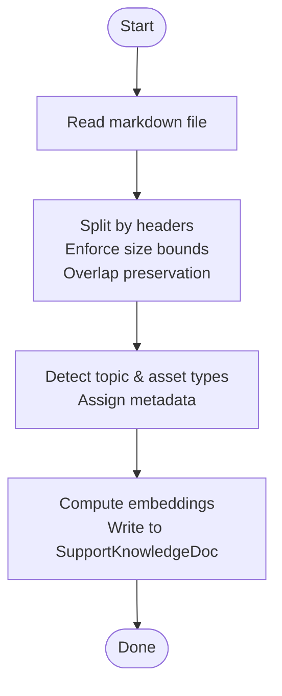

**Diagram sources**
- [chunker.ts:62-110](file://src/lib/ai/chunker.ts#L62-L110)
- [seed-support-kb.ts:69-108](file://scripts/seed-support-kb.ts#L69-L108)

**Section sources**
- [chunker.ts:62-110](file://src/lib/ai/chunker.ts#L62-L110)
- [seed-support-kb.ts:69-108](file://scripts/seed-support-kb.ts#L69-L108)
- [reingest-knowledge.ts:91-147](file://scripts/reingest-knowledge.ts#L91-L147)

### Multi-Level Caching System
- Query embedding cache: Redis cache keyed by hashed query to avoid redundant API calls.
- Query-aware fast-path cache: Per-query, per-asset-type cache of retrieved chunks for immediate reuse.
- Asset-type baseline cache: Pre-warmed cache of top chunks per asset type to accelerate first queries.
- Cache warming: Background warming of asset-type caches; triggered on misses; TTL-based eviction.

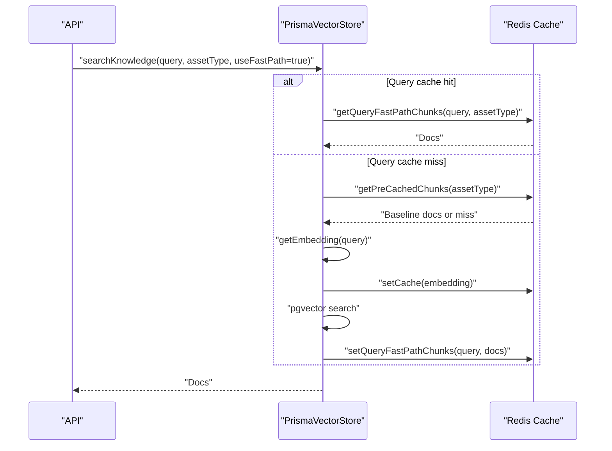

**Diagram sources**
- [rag.ts:607-778](file://src/lib/ai/rag.ts#L607-L778)
- [rag.ts:374-387](file://src/lib/ai/rag.ts#L374-L387)

**Section sources**
- [rag.ts:374-387](file://src/lib/ai/rag.ts#L374-L387)
- [rag.ts:607-778](file://src/lib/ai/rag.ts#L607-L778)
- [rag-optimizations.test.ts:149-277](file://src/lib/ai/__tests__/rag-optimizations.test.ts#L149-L277)

### Similarity Threshold Tuning and Quality Scoring
- Thresholds: Tier-aware thresholds (SIMPLE stricter, COMPLEX looser) with a default fallback; applied per query.
- Quality scoring: Boosts recent content, optimal-length chunks, and longer content for COMPLEX queries; caps at 1.0.
- Ranking: Sorts by similarity, optionally prioritizing asset-type relevance; merges baseline cache when needed.

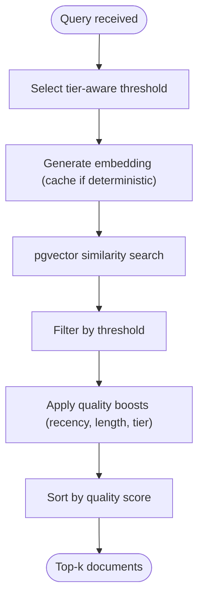

**Diagram sources**
- [rag.ts:82-87](file://src/lib/ai/rag.ts#L82-L87)
- [rag.ts:143-174](file://src/lib/ai/rag.ts#L143-L174)
- [rag.ts:727-735](file://src/lib/ai/rag.ts#L727-L735)

**Section sources**
- [rag.ts:82-87](file://src/lib/ai/rag.ts#L82-L87)
- [rag.ts:143-174](file://src/lib/ai/rag.ts#L143-L174)
- [rag.ts:727-786](file://src/lib/ai/rag.ts#L727-L786)

### Context Injection and Grounding Techniques
- Institutional knowledge: Injects KB chunks with inline citations ([KB: source > section]); deduplicates sources; trims by mode and tier.
- User memory: Injects session notes and global notes with mode-aware truncation; skips for SIMPLE tier.
- Cross-sector context: Optional macro/regime context injection.
- Grounding monitoring: Logs average similarity and triggers sliding-window alerts for sustained low grounding.

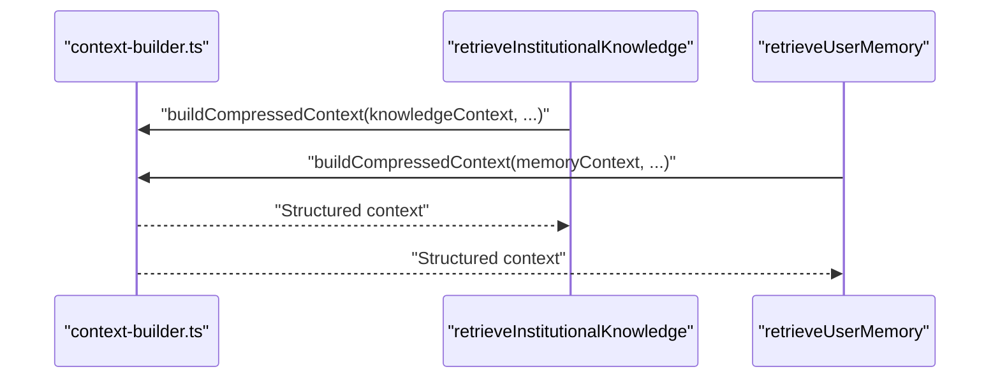

**Diagram sources**
- [context-builder.ts:462-518](file://src/lib/ai/context-builder.ts#L462-L518)
- [rag.ts:1033-1093](file://src/lib/ai/rag.ts#L1033-L1093)
- [rag.ts:1095-1125](file://src/lib/ai/rag.ts#L1095-L1125)

**Section sources**
- [context-builder.ts:462-518](file://src/lib/ai/context-builder.ts#L462-L518)
- [rag.ts:1033-1093](file://src/lib/ai/rag.ts#L1033-L1093)
- [rag.ts:1095-1125](file://src/lib/ai/rag.ts#L1095-L1125)

### Vector Store Management and Batch Processing
- Batch embedding: Splits chunks into configurable batches; retries with exponential backoff; logs per-batch metrics.
- Memory embedding pipeline: Stores conversation logs immediately; queues embeddings for background processing; uses optimistic concurrency and idempotency keys.
- Migration: Batch re-embeddings across the entire knowledge base with progress tracking.

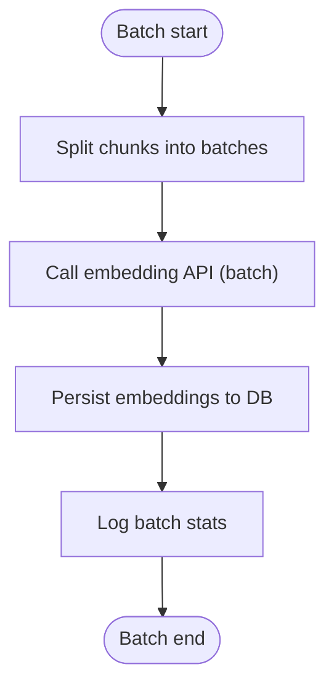

**Diagram sources**
- [rag.ts:291-355](file://src/lib/ai/rag.ts#L291-L355)
- [rag.ts:414-439](file://src/lib/ai/rag.ts#L414-L439)
- [migrate-embeddings.ts:44-74](file://scripts/migrate-embeddings.ts#L44-L74)

**Section sources**
- [rag.ts:291-355](file://src/lib/ai/rag.ts#L291-L355)
- [rag.ts:414-439](file://src/lib/ai/rag.ts#L414-L439)
- [migrate-embeddings.ts:44-74](file://scripts/migrate-embeddings.ts#L44-L74)

### Background Embedding Jobs
- Cron endpoint: Runs periodic embedding of conversation logs; guarded by cron authentication middleware; returns structured results.
- Concurrency and batching: Limits concurrent workers and batch sizes; tracks claimed, done, failed, and skipped items.

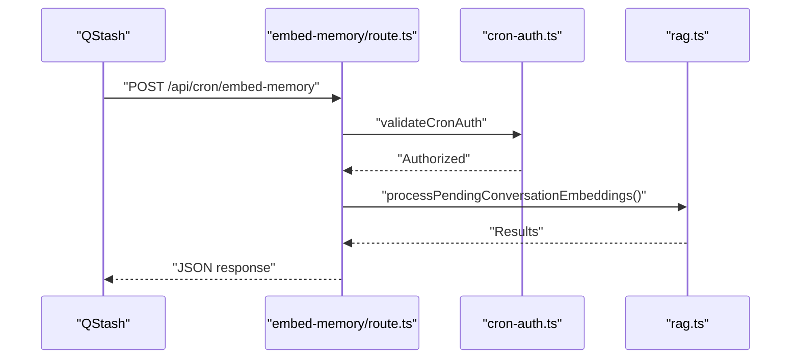

**Diagram sources**
- [embed-memory/route.ts:12-35](file://src/app/api/cron/embed-memory/route.ts#L12-L35)
- [cron-auth.ts:112-139](file://src/lib/middleware/cron-auth.ts#L112-L139)
- [rag.ts:441-605](file://src/lib/ai/rag.ts#L441-L605)

**Section sources**
- [embed-memory/route.ts:12-35](file://src/app/api/cron/embed-memory/route.ts#L12-L35)
- [cron-auth.ts:112-139](file://src/lib/middleware/cron-auth.ts#L112-L139)
- [rag.ts:441-605](file://src/lib/ai/rag.ts#L441-L605)

### Security Measures and Content Validation
- Injection prevention: Regex-based patterns for prompt-injection detection; Unicode normalization to defeat homoglyph evasion; base64 entropy scanning; post-retrieval filtering of chunks and memory.
- Content validation: Input length caps, normalized processing, and guardrail checks before context injection.
- Client-side voice injection detection: Lightweight pattern matching for voice transcripts.

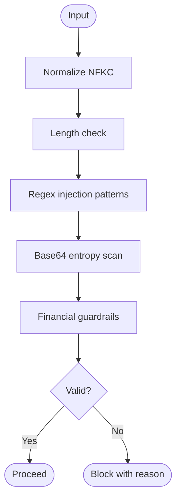

**Diagram sources**
- [guardrails.ts:103-118](file://src/lib/ai/guardrails.ts#L103-L118)
- [guardrails.ts:213-230](file://src/lib/ai/guardrails.ts#L213-L230)
- [guardrails.ts:232-258](file://src/lib/ai/guardrails.ts#L232-L258)

**Section sources**
- [guardrails.ts:44-259](file://src/lib/ai/guardrails.ts#L44-L259)
- [rag.ts:788-802](file://src/lib/ai/rag.ts#L788-L802)
- [memory.ts:323-332](file://src/lib/ai/memory.ts#L323-L332)

## Dependency Analysis
- Cohesion: PrismaVectorStore centralizes vector operations, caching, and search logic.
- Coupling: Relies on Prisma for ORM, Redis for caching, OpenAI embeddings client, and PostgreSQL with pgvector extension.
- External integrations: Cron scheduling via QStash, embedding provider via configured client.

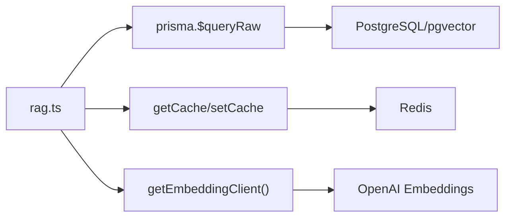

**Diagram sources**
- [rag.ts:1-16](file://src/lib/ai/rag.ts#L1-L16)
- [rag.ts:374-387](file://src/lib/ai/rag.ts#L374-L387)

**Section sources**
- [rag.ts:1-16](file://src/lib/ai/rag.ts#L1-L16)
- [rag.ts:374-387](file://src/lib/ai/rag.ts#L374-L387)

## Performance Considerations
- Caching: Query embedding cache and fast-path caches reduce API calls and DB latency.
- Batch processing: Larger batch sizes and controlled concurrency minimize overhead.
- Early termination: Boot-level hydration lock prevents redundant work across instances.
- Truncation: Mode-aware truncation reduces context size for cost and latency control.
- Indexing: pgvector inner-product index with appropriate thresholds improves search speed.

[No sources needed since this section provides general guidance]

## Troubleshooting Guide
- Knowledge search returns empty: Check similarity threshold tuning and embedding validity; verify vector string shape; review post-retrieval injection filtering.
- Embedding failures: Inspect retry/backoff behavior and embedding client configuration; validate dimensionality and vector string format.
- Memory embedding backlog: Review cron job status and worker concurrency; check idempotency and duplicate detection.
- Guardrail violations: Review regex patterns and normalization; ensure Unicode normalization is applied consistently.

**Section sources**
- [rag.ts:389-412](file://src/lib/ai/rag.ts#L389-L412)
- [rag.ts:180-184](file://src/lib/ai/rag.ts#L180-L184)
- [rag.ts:788-802](file://src/lib/ai/rag.ts#L788-L802)
- [embed-memory/route.ts:12-35](file://src/app/api/cron/embed-memory/route.ts#L12-L35)

## Conclusion
The RAG Knowledge Base combines robust chunking, pgvector-powered semantic search, and a multi-layer caching strategy to deliver fast, accurate, and secure contextual responses. Guardrails and validation ensure safety, while background jobs maintain freshness and performance. The system balances quality and cost through tier-aware thresholds, quality scoring, and truncation strategies.

[No sources needed since this section summarizes without analyzing specific files]

## Appendices

### Example Workflows

- Institutional knowledge retrieval with fast-path:
  - Query: “Explain the trend engine”
  - Fast-path: Query-aware cache hit for CRYPTO → return cached chunks
  - Else: Embed query → pgvector search → warm caches → return top-k

- User memory retrieval:
  - Query: “What did I ask about BTC last week?”
  - Embed query → pgvector search in AIRequestLog → score candidates → inject safe memory context

- Support KB search (BM25):
  - Query: “How do I reset my password?”
  - Tokenization and phrase matching → return top results without embeddings

**Section sources**
- [rag.ts:677-823](file://src/lib/ai/rag.ts#L677-L823)
- [rag.ts:826-884](file://src/lib/ai/rag.ts#L826-L884)
- [ai-responder.ts:264-277](file://src/lib/support/ai-responder.ts#L264-L277)