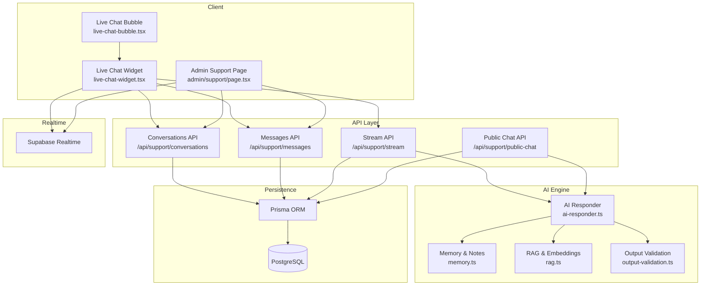
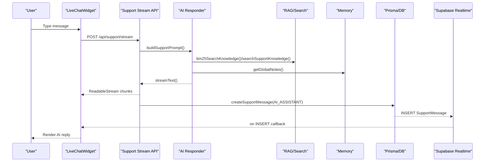
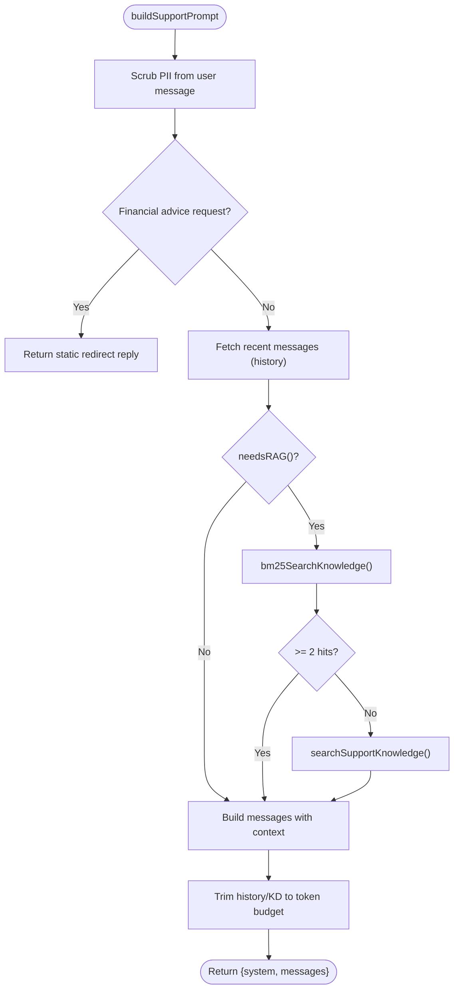
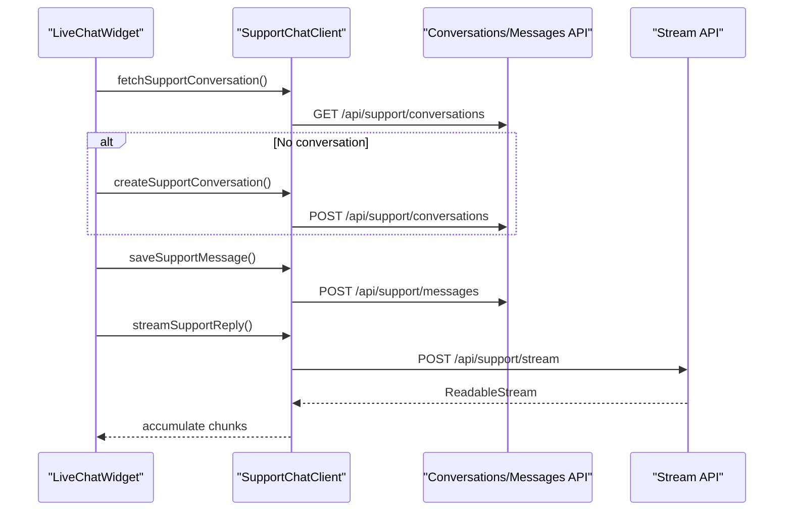
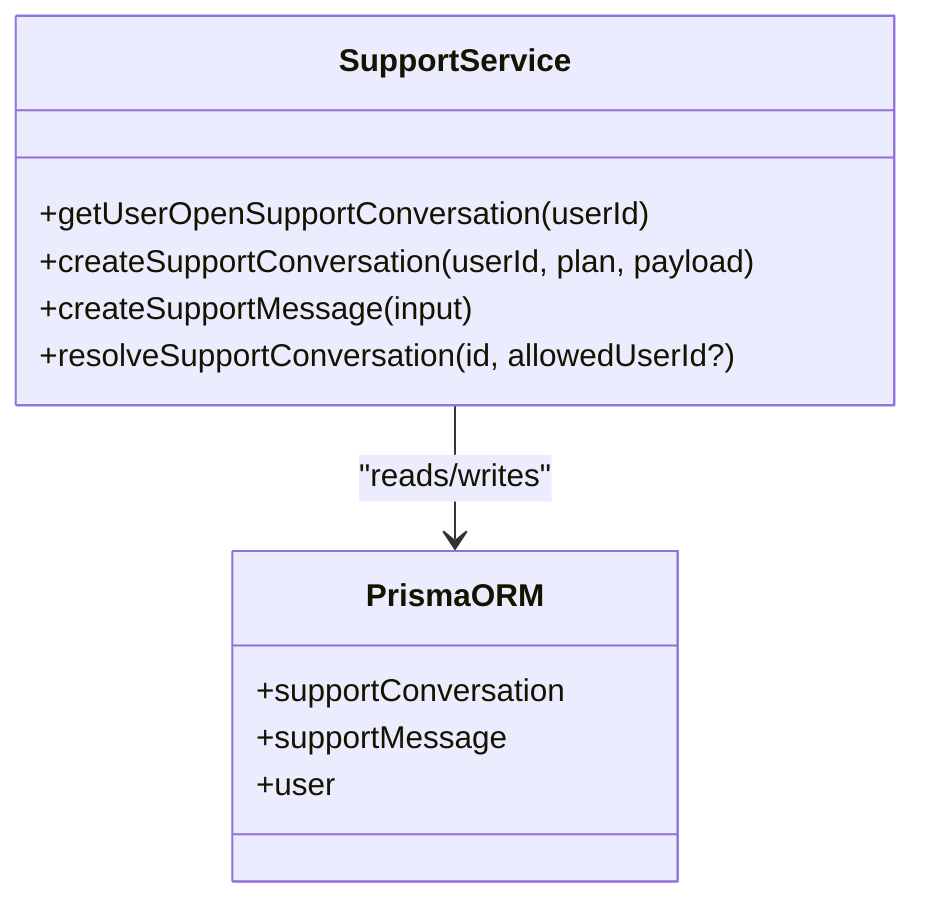
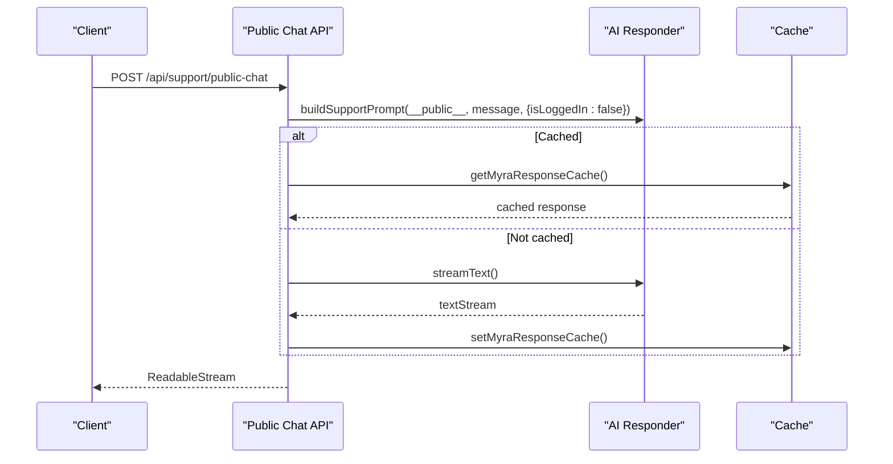
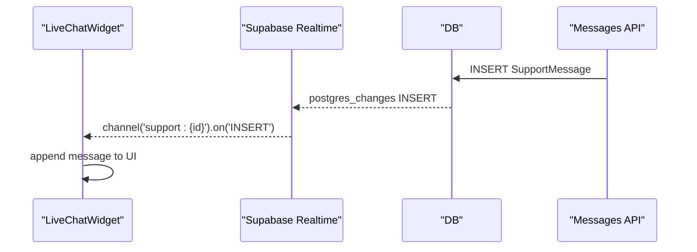
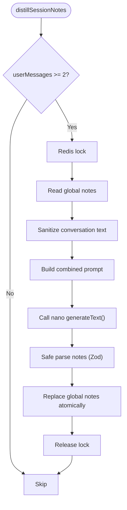
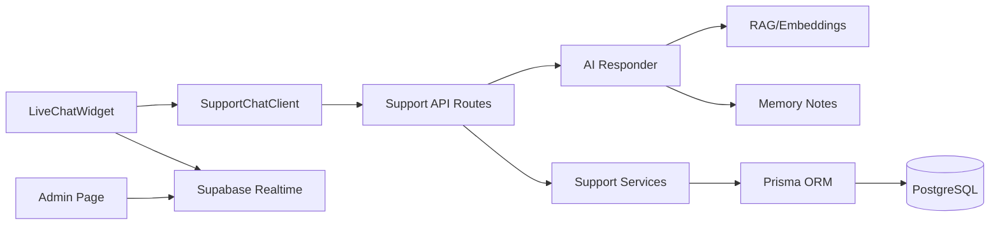

# Support AI System

<cite>
**Referenced Files in This Document**
- [ai-responder.ts](file://src/lib/support/ai-responder.ts)
- [support-chat-client.ts](file://src/lib/support-chat-client.ts)
- [support.service.ts](file://src/lib/services/support.service.ts)
- [route.ts](file://src/app/api/support/stream/route.ts)
- [route.ts](file://src/app/api/support/conversations/route.ts)
- [route.ts](file://src/app/api/support/messages/route.ts)
- [route.ts](file://src/app/api/support/public-chat/route.ts)
- [live-chat-widget.tsx](file://src/components/dashboard/live-chat-widget.tsx)
- [live-chat-bubble.tsx](file://src/components/dashboard/live-chat-bubble.tsx)
- [admin/support/page.tsx](file://src/app/admin/support/page.tsx)
- [memory.ts](file://src/lib/ai/memory.ts)
- [rag.ts](file://src/lib/ai/rag.ts)
- [output-validation.ts](file://src/lib/ai/output-validation.ts)
</cite>

## Table of Contents
1. [Introduction](#introduction)
2. [Project Structure](#project-structure)
3. [Core Components](#core-components)
4. [Architecture Overview](#architecture-overview)
5. [Detailed Component Analysis](#detailed-component-analysis)
6. [Dependency Analysis](#dependency-analysis)
7. [Performance Considerations](#performance-considerations)
8. [Troubleshooting Guide](#troubleshooting-guide)
9. [Conclusion](#conclusion)

## Introduction
This document describes the Support AI System that powers AI-powered customer support, automated response generation, and intelligent ticket routing. It covers the support chat integration, real-time conversation handling, multi-turn dialogue management, knowledge base integration, context preservation, conversation memory systems, AI responder architecture, response quality scoring, and escalation mechanisms. It also documents integrations with live chat widgets, conversation history, and support agent handoff procedures.

## Project Structure
The Support AI System spans client-side UI components, serverless API routes, and backend services:
- Frontend widgets and UI: live chat bubble, chat widget, and admin dashboard
- Backend APIs: conversations, messages, streaming responses, and public chat
- AI responder: prompt building, RAG, caching, and output validation
- Persistence: Prisma ORM-backed support conversations and messages
- Realtime: Supabase-based event streaming for live updates

**Diagram sources**
- [live-chat-bubble.tsx:38-69](file://src/components/dashboard/live-chat-bubble.tsx#L38-L69)
- [live-chat-widget.tsx:68-791](file://src/components/dashboard/live-chat-widget.tsx#L68-L791)
- [admin/support/page.tsx:1-50](file://src/app/admin/support/page.tsx#L1-L50)
- [route.ts:1-68](file://src/app/api/support/conversations/route.ts#L1-L68)
- [route.ts:1-64](file://src/app/api/support/messages/route.ts#L1-L64)
- [route.ts:1-176](file://src/app/api/support/stream/route.ts#L1-L176)
- [route.ts:1-150](file://src/app/api/support/public-chat/route.ts#L1-L150)
- [ai-responder.ts:1-581](file://src/lib/support/ai-responder.ts#L1-L581)
- [memory.ts:1-347](file://src/lib/ai/memory.ts#L1-L347)
- [rag.ts:1-200](file://src/lib/ai/rag.ts#L1-L200)
- [output-validation.ts:1-302](file://src/lib/ai/output-validation.ts#L1-L302)

**Section sources**
- [live-chat-bubble.tsx:38-69](file://src/components/dashboard/live-chat-bubble.tsx#L38-L69)
- [live-chat-widget.tsx:68-791](file://src/components/dashboard/live-chat-widget.tsx#L68-L791)
- [admin/support/page.tsx:1-50](file://src/app/admin/support/page.tsx#L1-L50)
- [route.ts:1-68](file://src/app/api/support/conversations/route.ts#L1-L68)
- [route.ts:1-64](file://src/app/api/support/messages/route.ts#L1-L64)
- [route.ts:1-176](file://src/app/api/support/stream/route.ts#L1-L176)
- [route.ts:1-150](file://src/app/api/support/public-chat/route.ts#L1-L150)
- [ai-responder.ts:1-581](file://src/lib/support/ai-responder.ts#L1-L581)
- [memory.ts:1-347](file://src/lib/ai/memory.ts#L1-L347)
- [rag.ts:1-200](file://src/lib/ai/rag.ts#L1-L200)
- [output-validation.ts:1-302](file://src/lib/ai/output-validation.ts#L1-L302)

## Core Components
- AI Responder: builds prompts, integrates RAG and user context, streams responses, caches answers, validates outputs, and manages memory distillation
- Support Chat Client: client-side helpers to fetch/create conversations, save messages, and stream replies
- Support Services: backend persistence for conversations, messages, and status transitions
- API Routes: secure endpoints for conversations, messages, streaming, and public chat
- Realtime Updates: Supabase channels for live message insertions
- Memory and RAG: persistent user memory notes and hybrid BM25/vector search over the knowledge base
- Output Validation: post-generation checks for plan/pricing accuracy and model disclosure avoidance

**Section sources**
- [ai-responder.ts:348-581](file://src/lib/support/ai-responder.ts#L348-L581)
- [support-chat-client.ts:1-83](file://src/lib/support-chat-client.ts#L1-L83)
- [support.service.ts:1-167](file://src/lib/services/support.service.ts#L1-L167)
- [route.ts:1-176](file://src/app/api/support/stream/route.ts#L1-L176)
- [route.ts:1-68](file://src/app/api/support/conversations/route.ts#L1-L68)
- [route.ts:1-64](file://src/app/api/support/messages/route.ts#L1-L64)
- [route.ts:1-150](file://src/app/api/support/public-chat/route.ts#L1-L150)
- [memory.ts:174-269](file://src/lib/ai/memory.ts#L174-L269)
- [rag.ts:258-307](file://src/lib/ai/rag.ts#L258-L307)
- [output-validation.ts:226-302](file://src/lib/ai/output-validation.ts#L226-L302)

## Architecture Overview
The system combines a client-side chat widget with serverless APIs and an AI responder powered by a hybrid RAG strategy. Responses are streamed to the client, persisted to the database, and published via Supabase for real-time updates. Memory notes are distilled from multi-turn sessions and injected into future prompts to preserve context.

**Diagram sources**
- [live-chat-widget.tsx:249-361](file://src/components/dashboard/live-chat-widget.tsx#L249-L361)
- [route.ts:126-175](file://src/app/api/support/stream/route.ts#L126-L175)
- [ai-responder.ts:348-468](file://src/lib/support/ai-responder.ts#L348-L468)
- [rag.ts:258-307](file://src/lib/ai/rag.ts#L258-L307)
- [memory.ts:277-305](file://src/lib/ai/memory.ts#L277-L305)
- [support.service.ts:107-146](file://src/lib/services/support.service.ts#L107-L146)

## Detailed Component Analysis

### AI Responder: Prompt Building, RAG, Caching, and Validation
- Prompt construction: builds system and message arrays, injects knowledge context, user context, and profile notes as a hidden system message to avoid leaking into user-role content
- RAG strategy: BM25 full-text search for speed and determinism; falls back to vector search when BM25 yields insufficient results
- Caching: response cache keyed by normalized query and plan; public and authenticated variants with different TTLs
- Output validation: post-generation checks for plan/pricing hallucinations and model disclosure; logs warnings without blocking
- Memory integration: distills durable notes from multi-turn sessions and persists them globally for future sessions

**Diagram sources**
- [ai-responder.ts:348-468](file://src/lib/support/ai-responder.ts#L348-L468)
- [rag.ts:258-307](file://src/lib/ai/rag.ts#L258-L307)

**Section sources**
- [ai-responder.ts:1-581](file://src/lib/support/ai-responder.ts#L1-L581)
- [rag.ts:1-200](file://src/lib/ai/rag.ts#L1-L200)

### Support Chat Client: Conversations, Messages, and Streaming
- Fetch or create a conversation scoped to the authenticated user
- Save user messages and stream AI replies incrementally
- Provides optimistic UI updates and handles conversation recreation if deleted

**Diagram sources**
- [support-chat-client.ts:22-83](file://src/lib/support-chat-client.ts#L22-L83)
- [route.ts:17-68](file://src/app/api/support/conversations/route.ts#L17-L68)
- [route.ts:13-64](file://src/app/api/support/messages/route.ts#L13-L64)
- [route.ts:54-175](file://src/app/api/support/stream/route.ts#L54-L175)

**Section sources**
- [support-chat-client.ts:1-83](file://src/lib/support-chat-client.ts#L1-L83)

### Backend Services: Persistence and Status Management
- Create or fetch a user’s open support conversation with enriched user context
- Persist user and AI messages with sender roles and optional status transitions
- Resolve or close conversations when appropriate

**Diagram sources**
- [support.service.ts:1-167](file://src/lib/services/support.service.ts#L1-L167)

**Section sources**
- [support.service.ts:1-167](file://src/lib/services/support.service.ts#L1-L167)

### API Routes: Secure Endpoints and Streaming
- Conversations endpoint: GET to fetch the latest open conversation; POST to create a new one with subject and user context
- Messages endpoint: POST to save user messages with guardrails and PII scrubbing
- Stream endpoint: POST to stream AI replies; enforces plan gating, rate limits, prompt injection checks, and status validation
- Public chat endpoint: POST to serve anonymous visitors with rate limiting, input validation, and caching

**Diagram sources**
- [route.ts:24-150](file://src/app/api/support/public-chat/route.ts#L24-L150)
- [ai-responder.ts:40-52](file://src/lib/support/ai-responder.ts#L40-L52)

**Section sources**
- [route.ts:1-68](file://src/app/api/support/conversations/route.ts#L1-L68)
- [route.ts:1-64](file://src/app/api/support/messages/route.ts#L1-L64)
- [route.ts:1-176](file://src/app/api/support/stream/route.ts#L1-L176)
- [route.ts:1-150](file://src/app/api/support/public-chat/route.ts#L1-L150)

### Real-time Updates and Admin Dashboard
- LiveChatWidget subscribes to Supabase channels for the active conversation to receive new AI messages as they are inserted
- Admin support page fetches conversations with pagination and filters, and listens to realtime events

**Diagram sources**
- [live-chat-widget.tsx:180-214](file://src/components/dashboard/live-chat-widget.tsx#L180-L214)
- [admin/support/page.tsx:45-50](file://src/app/admin/support/page.tsx#L45-L50)

**Section sources**
- [live-chat-widget.tsx:180-214](file://src/components/dashboard/live-chat-widget.tsx#L180-L214)
- [admin/support/page.tsx:1-50](file://src/app/admin/support/page.tsx#L1-L50)

### Conversation Memory and Context Preservation
- Memory distillation: extracts durable notes from multi-turn sessions and merges with existing global notes
- Session notes: temporary notes scoped to a session for immediate context
- Global notes: compact bullet string injected into prompts as [USER_PROFILE] to preserve long-term context

**Diagram sources**
- [memory.ts:184-269](file://src/lib/ai/memory.ts#L184-L269)

**Section sources**
- [memory.ts:1-347](file://src/lib/ai/memory.ts#L1-L347)

### Escalation Mechanisms and Quality Scoring
- Escalation: when context is missing or insufficient, the AI responds with guidance to the correct page or human support
- Output validation: post-generation checks for plan/pricing hallucinations and model disclosure; logs warnings and records validation metrics

**Section sources**
- [ai-responder.ts:142-151](file://src/lib/support/ai-responder.ts#L142-L151)
- [output-validation.ts:226-302](file://src/lib/ai/output-validation.ts#L226-L302)

## Dependency Analysis
- Client depends on SupportChatClient for network operations and on Supabase for live updates
- API routes depend on AI Responder for prompt building and streaming, and on Support Services for persistence
- AI Responder depends on RAG for knowledge retrieval and Memory for context notes
- Persistence uses Prisma ORM backed by PostgreSQL

**Diagram sources**
- [live-chat-widget.tsx:68-791](file://src/components/dashboard/live-chat-widget.tsx#L68-L791)
- [support-chat-client.ts:1-83](file://src/lib/support-chat-client.ts#L1-L83)
- [route.ts:1-176](file://src/app/api/support/stream/route.ts#L1-L176)
- [ai-responder.ts:1-581](file://src/lib/support/ai-responder.ts#L1-L581)
- [memory.ts:1-347](file://src/lib/ai/memory.ts#L1-L347)
- [support.service.ts:1-167](file://src/lib/services/support.service.ts#L1-L167)

**Section sources**
- [live-chat-widget.tsx:68-791](file://src/components/dashboard/live-chat-widget.tsx#L68-L791)
- [support-chat-client.ts:1-83](file://src/lib/support-chat-client.ts#L1-L83)
- [route.ts:1-176](file://src/app/api/support/stream/route.ts#L1-L176)
- [ai-responder.ts:1-581](file://src/lib/support/ai-responder.ts#L1-L581)
- [memory.ts:1-347](file://src/lib/ai/memory.ts#L1-L347)
- [support.service.ts:1-167](file://src/lib/services/support.service.ts#L1-L167)

## Performance Considerations
- Streaming responses: server streams tokens to the client, enabling fast perceived latency
- Prompt caching: Azure prompt cache key improves throughput for repeated prompts
- Response caching: Myra response cache reduces LLM calls for frequently asked questions
- RAG optimization: BM25 search avoids embedding API calls for short definitional queries; vector search is reserved for ambiguous or low-recall cases
- Memory distillation: single nano call consolidates extraction and merging; distributed Redis lock prevents race conditions
- Rate limiting: tiered rate limits protect resources from abuse while allowing bursts for interactive UX

[No sources needed since this section provides general guidance]

## Troubleshooting Guide
- Unauthorized or forbidden: ensure the user meets plan requirements (PRO/ELITE/ENTERPRISE) for chat features
- Prompt injection detected: user input fails guardrails; review validation and scrubbing logic
- Conversation not found or closed: verify conversation ownership and status before sending messages
- Rate limit exceeded: implement backoff or defer actions; public chat has a burst limiter in addition to daily caps
- Stream errors: check API route error logging and ensure the stream is consumed properly on the client
- Memory distillation failures: inspect lock acquisition and DB transaction outcomes; logs record failures and outcomes

**Section sources**
- [route.ts:32-71](file://src/app/api/support/stream/route.ts#L32-L71)
- [route.ts:36-41](file://src/app/api/support/messages/route.ts#L36-L41)
- [route.ts:23-26](file://src/app/api/support/conversations/route.ts#L23-L26)
- [route.ts:33-40](file://src/app/api/support/public-chat/route.ts#L33-L40)
- [memory.ts:258-268](file://src/lib/ai/memory.ts#L258-L268)

## Conclusion
The Support AI System delivers a responsive, secure, and scalable support experience. It integrates a hybrid RAG strategy, persistent memory, and strict output validation to maintain quality and trust. Real-time updates and a polished chat UI enable smooth multi-turn conversations, while rate limiting and guardrails protect the system from abuse. The architecture supports both authenticated users and public visitors, with clear escalation paths and admin visibility.