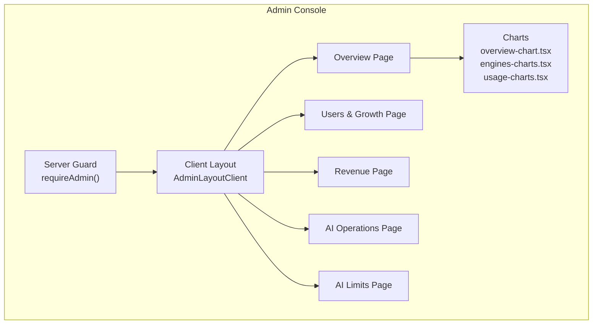
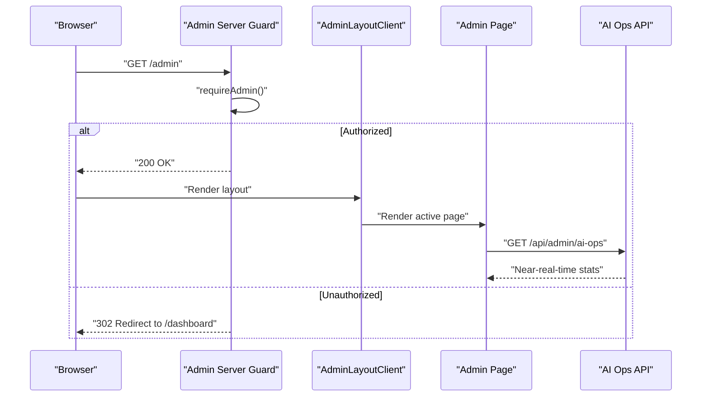
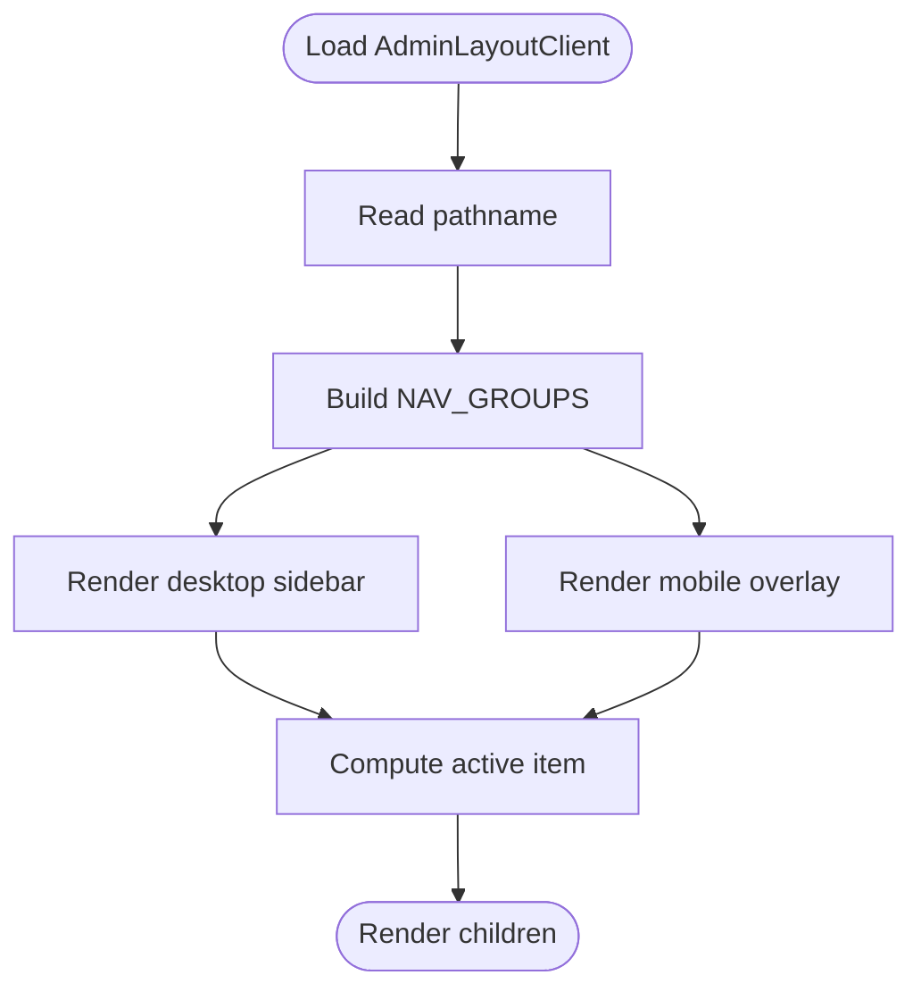
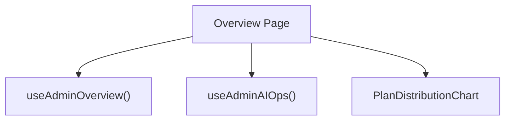
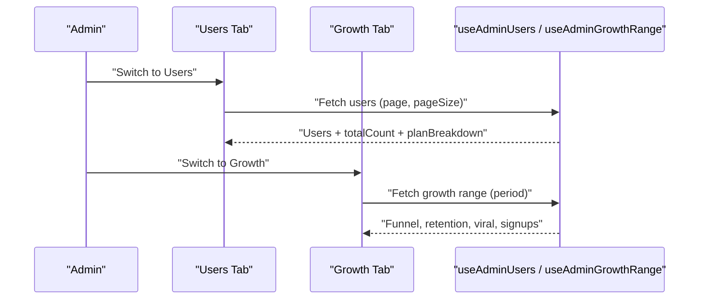
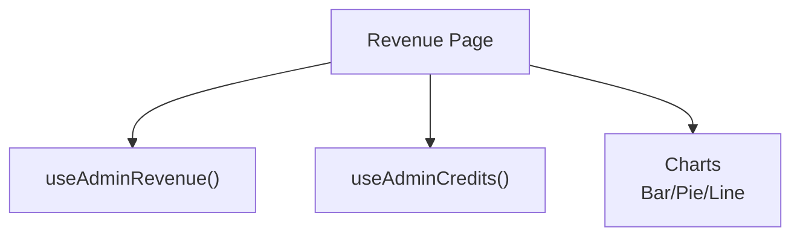
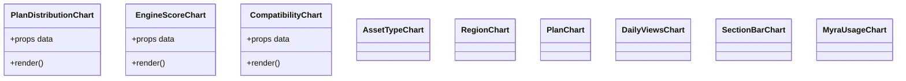
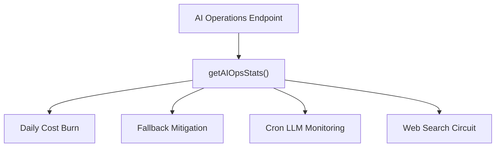
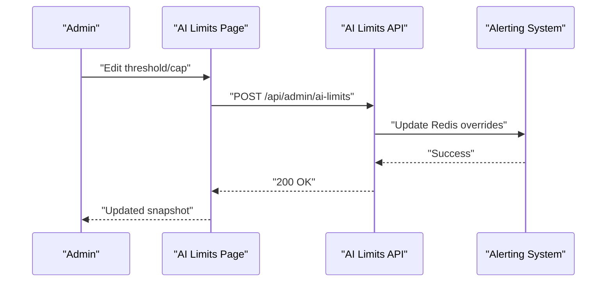
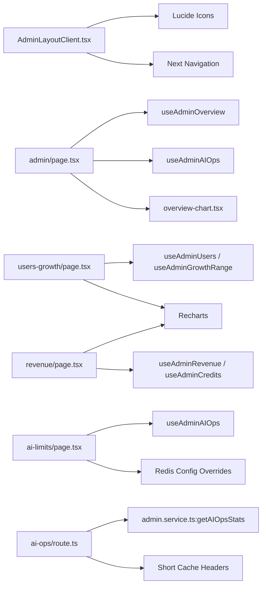

# Administrative Tools

<cite>
**Referenced Files in This Document**
- [layout.tsx](file://src/app/admin/layout.tsx)
- [AdminLayoutClient.tsx](file://src/app/admin/AdminLayoutClient.tsx)
- [page.tsx](file://src/app/admin/page.tsx)
- [overview-chart.tsx](file://src/app/admin/_charts/overview-chart.tsx)
- [engines-charts.tsx](file://src/app/admin/_charts/engines-charts.tsx)
- [usage-charts.tsx](file://src/app/admin/_charts/usage-charts.tsx)
- [users-growth/page.tsx](file://src/app/admin/users-growth/page.tsx)
- [revenue/page.tsx](file://src/app/admin/revenue/page.tsx)
- [ai-limits/page.tsx](file://src/app/admin/ai-limits/page.tsx)
- [ai-ops/route.ts](file://src/app/api/admin/ai-ops/route.ts)
- [ai-limits/route.ts](file://src/app/api/admin/ai-limits/route.ts)
- [use-admin.ts](file://src/hooks/use-admin.ts)
- [alerting.ts](file://src/lib/ai/alerting.ts)
- [admin.service.ts](file://src/lib/services/admin.service.ts)
</cite>

## Update Summary
**Changes Made**
- Added new AI Operations endpoint for comprehensive monitoring and alerting
- Enhanced AI Limits page with runtime operations snapshot and cron LLM monitoring
- Integrated cron-based LLM call observability with alerting capabilities
- Updated administrative analytics with enhanced monitoring for automated AI processes

## Table of Contents
1. [Introduction](#introduction)
2. [Project Structure](#project-structure)
3. [Core Components](#core-components)
4. [Architecture Overview](#architecture-overview)
5. [Detailed Component Analysis](#detailed-component-analysis)
6. [AI Operations Monitoring](#ai-operations-monitoring)
7. [Dependency Analysis](#dependency-analysis)
8. [Performance Considerations](#performance-considerations)
9. [Troubleshooting Guide](#troubleshooting-guide)
10. [Conclusion](#conclusion)

## Introduction
This document describes the Administrative Tools suite that powers analytics dashboards, user management, revenue tracking, support administration, and system monitoring. It explains admin analytics charts, user growth metrics, billing analytics, and support ticket management. It also documents administrative workflows, user diagnostics, system health monitoring, and operational reporting. Permissions, audit trails, and system maintenance tools are covered, with examples of administrative tasks, data visualizations, and operational management workflows.

**Updated** Added comprehensive AI operations monitoring with cron-based LLM call observability and enhanced alerting capabilities for automated AI processes.

## Project Structure
The Admin Console is a Next.js app router-based area under /admin with:
- A server-side guard that enforces admin-only access
- A client-side layout with navigation groups for Analytics, Operations, and Infrastructure
- Dedicated pages for Overview, Users & Growth, Revenue, Usage, AI Costs, Credits, Billing, Support, Engines & Regime, Crypto Data, AI Limits, AI Operations, and Waitlist
- Shared chart components for plan distribution, engine scores, compatibility, usage, and more

**Diagram sources**
- [layout.tsx:1-13](file://src/app/admin/layout.tsx#L1-L13)
- [AdminLayoutClient.tsx:1-189](file://src/app/admin/AdminLayoutClient.tsx#L1-L189)
- [page.tsx:1-353](file://src/app/admin/page.tsx#L1-L353)
- [users-growth/page.tsx:1-455](file://src/app/admin/users-growth/page.tsx#L1-L455)
- [revenue/page.tsx:1-383](file://src/app/admin/revenue/page.tsx#L1-L383)
- [ai-limits/page.tsx:1-453](file://src/app/admin/ai-limits/page.tsx#L1-L453)
- [overview-chart.tsx:1-37](file://src/app/admin/_charts/overview-chart.tsx#L1-L37)
- [engines-charts.tsx:1-50](file://src/app/admin/_charts/engines-charts.tsx#L1-L50)
- [usage-charts.tsx:1-114](file://src/app/admin/_charts/usage-charts.tsx#L1-L114)

**Section sources**
- [layout.tsx:1-13](file://src/app/admin/layout.tsx#L1-L13)
- [AdminLayoutClient.tsx:27-51](file://src/app/admin/AdminLayoutClient.tsx#L27-L51)

## Core Components
- Admin server guard ensures only authorized administrators can access the console.
- Admin client layout organizes navigation into Analytics, Operations, and Infrastructure sections with icons and active-state highlighting.
- Overview page aggregates revenue, user, and AI activity KPIs and displays plan distribution visuals.
- Users & Growth page provides user listing, filtering, onboarding funnels, retention proxies, and signup trends.
- Revenue page presents MRR/ARR, ARPU, subscription status, credit activity, churn, refunds, and recent payment events.
- AI Operations page monitors cron-based LLM calls, daily cost burn, fallback mitigations, and system health snapshots.
- AI Limits page manages daily token caps and alert thresholds with real-time overrides.
- Shared chart components encapsulate reusable visualizations for pie/bar/line charts and tooltips.

**Section sources**
- [layout.tsx:5-12](file://src/app/admin/layout.tsx#L5-L12)
- [AdminLayoutClient.tsx:27-51](file://src/app/admin/AdminLayoutClient.tsx#L27-L51)
- [page.tsx:166-272](file://src/app/admin/page.tsx#L166-L272)
- [users-growth/page.tsx:434-454](file://src/app/admin/users-growth/page.tsx#L434-L454)
- [revenue/page.tsx:57-91](file://src/app/admin/revenue/page.tsx#L57-L91)
- [ai-limits/page.tsx:353-390](file://src/app/admin/ai-limits/page.tsx#L353-L390)

## Architecture Overview
The Admin Console follows a client-server split:
- Server guard redirects unauthorized users to the dashboard.
- Client layout renders persistent navigation and active-link highlighting.
- Pages fetch data via hooks and render charts using Recharts.
- Charts are dynamically imported to avoid SSR overhead.
- AI Operations endpoint provides near-real-time monitoring data with short caching.

**Diagram sources**
- [layout.tsx:5-12](file://src/app/admin/layout.tsx#L5-L12)
- [AdminLayoutClient.tsx:53-128](file://src/app/admin/AdminLayoutClient.tsx#L53-L128)
- [ai-ops/route.ts:10-24](file://src/app/api/admin/ai-ops/route.ts#L10-L24)

## Detailed Component Analysis

### Admin Server Guard
- Enforces admin-only access by checking credentials and redirecting non-admins to the dashboard.
- Ensures that only users with appropriate roles can enter the Admin Console.

**Section sources**
- [layout.tsx:5-12](file://src/app/admin/layout.tsx#L5-L12)

### Admin Client Layout
- Provides three-level navigation groups: Analytics, Operations, and Infrastructure.
- Highlights active nav items based on current pathname.
- Supports desktop and mobile layouts with a collapsible menu.

**Diagram sources**
- [AdminLayoutClient.tsx:53-128](file://src/app/admin/AdminLayoutClient.tsx#L53-L128)

**Section sources**
- [AdminLayoutClient.tsx:27-51](file://src/app/admin/AdminLayoutClient.tsx#L27-L51)
- [AdminLayoutClient.tsx:53-128](file://src/app/admin/AdminLayoutClient.tsx#L53-L128)

### Overview Page
- Displays KPIs for Revenue (MRR, ARR, active subscriptions, conversion rate), Users (total, new signups, AI requests per user), and AI activity (today's requests, spend, 7-day totals).
- Renders plan distribution as a pie chart and a plan-mix breakdown.
- Shows platform health summary in a compact stats grid.
- Integrates AI Operations snapshot for daily cost monitoring and system health indicators.

**Diagram sources**
- [page.tsx:94-130](file://src/app/admin/page.tsx#L94-L130)
- [overview-chart.tsx:12-36](file://src/app/admin/_charts/overview-chart.tsx#L12-L36)

**Section sources**
- [page.tsx:166-272](file://src/app/admin/page.tsx#L166-L272)
- [overview-chart.tsx:12-36](file://src/app/admin/_charts/overview-chart.tsx#L12-L36)

### Users & Growth Page
- Tabs:
  - Users: paginated table with filters by plan and search; shows user attributes and counts.
  - Growth: retention proxies (DAU/WAU/MAU), onboarding funnel, viral metrics (referrals, K-factor), and signup trends.
- Uses Recharts for bar/line charts and funnel bars with percentage bars.

**Diagram sources**
- [users-growth/page.tsx:97-101](file://src/app/admin/users-growth/page.tsx#L97-L101)
- [users-growth/page.tsx:256-258](file://src/app/admin/users-growth/page.tsx#L256-L258)

**Section sources**
- [users-growth/page.tsx:434-454](file://src/app/admin/users-growth/page.tsx#L434-L454)
- [users-growth/page.tsx:256-431](file://src/app/admin/users-growth/page.tsx#L256-L431)

### Revenue Page
- Displays subscription-derived KPIs (MRR, ARR, ARPU, active subscriptions).
- Shows credit activity, churn, past-due subscriptions, and refunds with recent refund table.
- Visualizes plan distribution by subscriptions and revenue, subscription status pie, and user growth by month.
- Includes a plan revenue detail table and recent payment events.

**Diagram sources**
- [revenue/page.tsx:57-64](file://src/app/admin/revenue/page.tsx#L57-L64)
- [revenue/page.tsx:222-302](file://src/app/admin/revenue/page.tsx#L222-L302)

**Section sources**
- [revenue/page.tsx:57-91](file://src/app/admin/revenue/page.tsx#L57-L91)
- [revenue/page.tsx:222-383](file://src/app/admin/revenue/page.tsx#L222-L383)

### Shared Chart Components
- PlanDistributionChart: pie chart for plan distribution with tooltips and legend.
- EngineScoreChart and CompatibilityChart: bar charts for engine scores and asset compatibility.
- AssetTypeChart, RegionChart, PlanChart, DailyViewsChart, SectionBarChart, MyraUsageChart: reusable Recharts components for usage analytics.

**Diagram sources**
- [overview-chart.tsx:12-36](file://src/app/admin/_charts/overview-chart.tsx#L12-L36)
- [engines-charts.tsx:15-49](file://src/app/admin/_charts/engines-charts.tsx#L15-L49)
- [usage-charts.tsx:20-113](file://src/app/admin/_charts/usage-charts.tsx#L20-L113)

**Section sources**
- [overview-chart.tsx:12-36](file://src/app/admin/_charts/overview-chart.tsx#L12-L36)
- [engines-charts.tsx:15-49](file://src/app/admin/_charts/engines-charts.tsx#L15-L49)
- [usage-charts.tsx:20-113](file://src/app/admin/_charts/usage-charts.tsx#L20-L113)

## AI Operations Monitoring

### AI Operations Endpoint
The new AI Operations endpoint provides comprehensive monitoring for automated AI processes:
- Near-real-time statistics for daily cost burn, fallback mitigations, and system health
- Cron-based LLM call observability with failure tracking and latency monitoring
- Deployment-specific fallback rate analysis
- Web search circuit breaker status

**Diagram sources**
- [ai-ops/route.ts:10-24](file://src/app/api/admin/ai-ops/route.ts#L10-L24)
- [admin.service.ts:329](file://src/lib/services/admin.service.ts#L329)

### AI Limits Management
Enhanced AI Limits page with runtime operations snapshot:
- Real-time override of daily token caps and alert thresholds
- Per-deployment fallback rate monitoring
- Cron LLM job performance tracking
- Web search circuit breaker status
- Automated fallback mitigation system

**Diagram sources**
- [ai-limits/page.tsx:353-390](file://src/app/admin/ai-limits/page.tsx#L353-L390)
- [ai-limits/route.ts:55-107](file://src/app/api/admin/ai-limits/route.ts#L55-L107)

**Section sources**
- [ai-ops/route.ts:10-24](file://src/app/api/admin/ai-ops/route.ts#L10-L24)
- [ai-limits/page.tsx:353-390](file://src/app/admin/ai-limits/page.tsx#L353-L390)
- [ai-limits/route.ts:17-53](file://src/app/api/admin/ai-limits/route.ts#L17-L53)

## Dependency Analysis
- AdminLayoutClient depends on Lucide icons and Next.js routing to compute active nav items.
- Overview page depends on useAdminOverview and useAdminAIOps hooks and dynamically imports chart components.
- Users & Growth page depends on useAdminUsers and useAdminGrowthRange hooks and Recharts for visualization.
- Revenue page depends on useAdminRevenue and useAdminCredits hooks and Recharts for charts and tables.
- AI Operations endpoint depends on getAIOpsStats from admin.service.ts and provides near-real-time data.
- AI Limits page depends on useAdminAIOps hook for runtime snapshot and Redis for configuration overrides.

**Diagram sources**
- [AdminLayoutClient.tsx:7-25](file://src/app/admin/AdminLayoutClient.tsx#L7-L25)
- [page.tsx:4-26](file://src/app/admin/page.tsx#L4-L26)
- [users-growth/page.tsx:4-29](file://src/app/admin/users-growth/page.tsx#L4-L29)
- [revenue/page.tsx:4-19](file://src/app/admin/revenue/page.tsx#L4-L19)
- [ai-limits/page.tsx:6](file://src/app/admin/ai-limits/page.tsx#L6)
- [ai-ops/route.ts:3](file://src/app/api/admin/ai-ops/route.ts#L3)

**Section sources**
- [AdminLayoutClient.tsx:53-128](file://src/app/admin/AdminLayoutClient.tsx#L53-L128)
- [page.tsx:94-130](file://src/app/admin/page.tsx#L94-L130)
- [users-growth/page.tsx:97-101](file://src/app/admin/users-growth/page.tsx#L97-L101)
- [revenue/page.tsx:57-64](file://src/app/admin/revenue/page.tsx#L57-L64)
- [ai-limits/page.tsx:353-390](file://src/app/admin/ai-limits/page.tsx#L353-L390)

## Performance Considerations
- Dynamic imports of chart components reduce initial bundle size and avoid SSR rendering for heavy visualizations.
- Recharts components are responsive and optimized for small screens; ensure datasets are trimmed for long time-series.
- Pagination in the Users tab reduces payload sizes and improves responsiveness for large user lists.
- AI Operations endpoint uses short caching (10 seconds) for near-real-time data without overwhelming the system.
- Avoid unnecessary re-renders by memoizing computed values (e.g., percentages and color accents) in overview and revenue pages.
- Redis-based alerting system prevents blocking operations and maintains system stability during high-load periods.

## Troubleshooting Guide
- Access denied: If redirected to the dashboard, verify that the user has the required admin role in the identity provider.
- Data loading errors: Pages show explicit error states with actionable messages; check network tab and backend logs for hook failures.
- Empty charts: Ensure datasets are non-empty; many charts render a "no data" message when arrays are empty.
- Mobile navigation: Toggle the mobile menu icon to reveal navigation items on smaller screens.
- AI Operations data not updating: Check that the AI Operations endpoint is reachable and that Redis is properly configured for alerting.
- Alert threshold overrides not taking effect: Verify that Redis contains the expected override values and that the admin service is reading them correctly.
- Cron LLM monitoring showing no data: Ensure that cron jobs are calling the recordCronLlmCall function and that Redis is accessible.

**Section sources**
- [layout.tsx:7-12](file://src/app/admin/layout.tsx#L7-L12)
- [page.tsx:116-127](file://src/app/admin/page.tsx#L116-L127)
- [users-growth/page.tsx:103-105](file://src/app/admin/users-growth/page.tsx#L103-L105)
- [revenue/page.tsx:61-63](file://src/app/admin/revenue/page.tsx#L61-L63)
- [ai-ops/route.ts:20-23](file://src/app/api/admin/ai-ops/route.ts#L20-L23)

## Conclusion
The Administrative Tools provide a comprehensive, permission-protected interface for monitoring platform health, managing users, tracking revenue, and operating systems. The modular layout, reusable charts, and structured pages enable efficient operational workflows, while dynamic imports and pagination keep performance strong. Administrators can rely on clear KPIs, visualizations, and tables to drive decisions and maintain system integrity.

**Updated** The enhanced AI Operations monitoring provides unprecedented visibility into automated AI processes, enabling proactive management of cron-based LLM calls, cost control, and system health. The AI Limits page offers real-time overrides for critical thresholds, while the AI Operations dashboard delivers comprehensive monitoring of daily cost burn, fallback mitigations, and automated alerting systems. These additions significantly strengthen the administrative toolkit for managing complex AI-powered platforms.