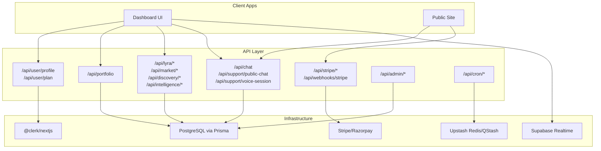
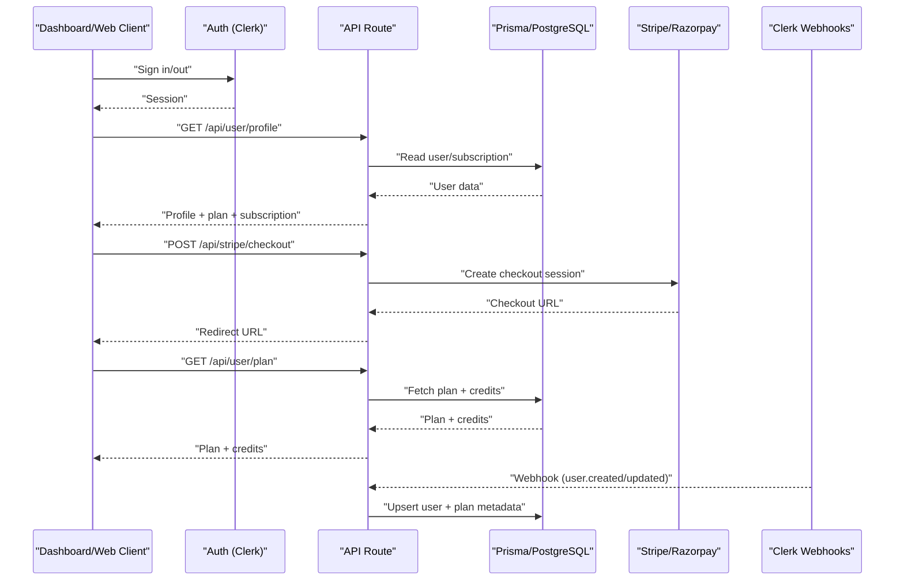
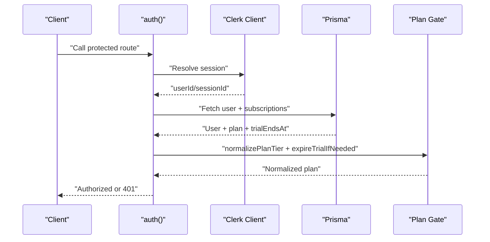
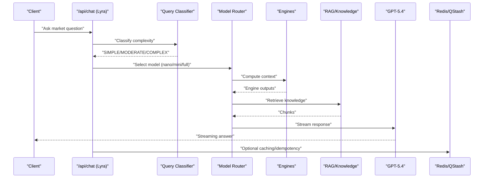
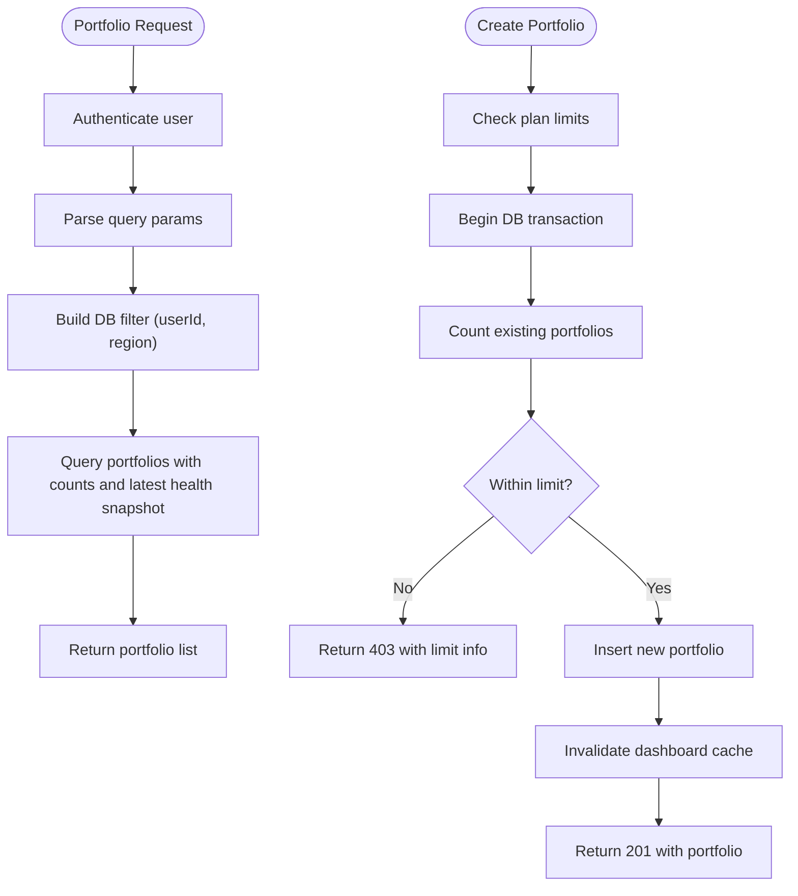
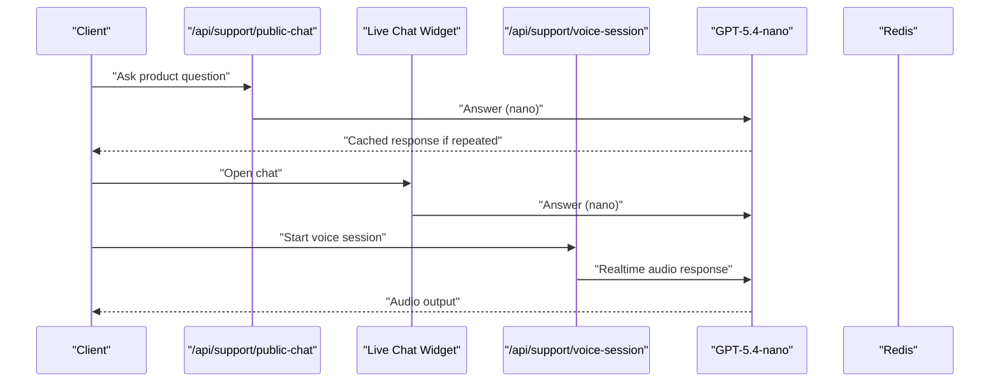
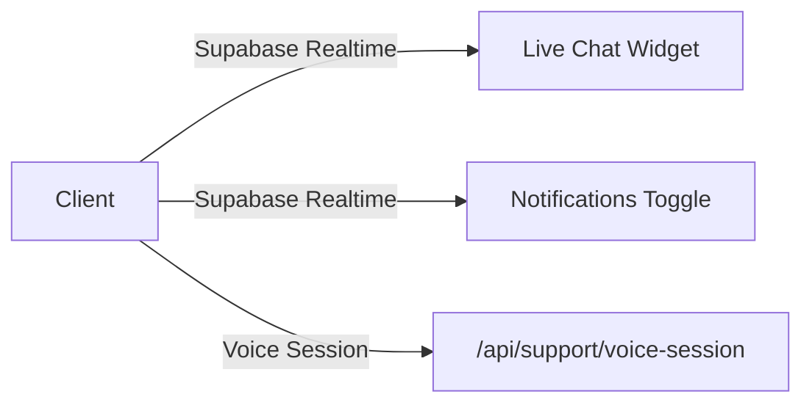
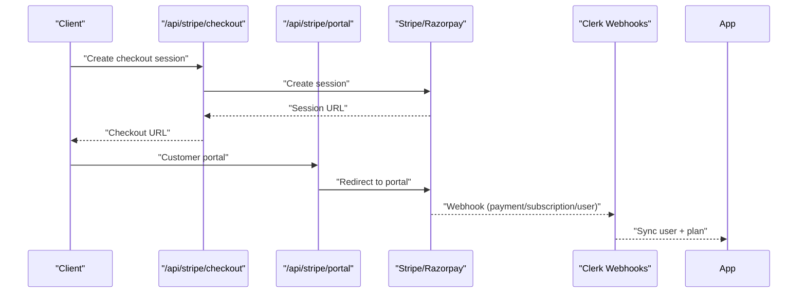
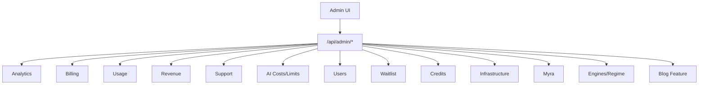
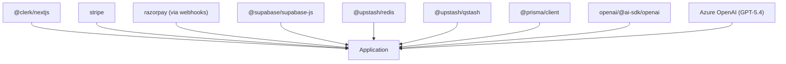

# Core Features

<cite>
**Referenced Files in This Document**
- [README.md](file://README.md)
- [package.json](file://package.json)
- [Product.md](file://docs/Product.md)
- [TieredPlans.md](file://docs/docs2/TieredPlans.md)
- [Creditsystem.md](file://docs/docs2/Creditsystem.md)
- [auth.ts](file://src/lib/auth.ts)
- [user.profile.route.ts](file://src/app/api/user/profile/route.ts)
- [user.plan.route.ts](file://src/app/api/user/plan/route.ts)
- [portfolio.route.ts](file://src/app/api/portfolio/route.ts)
- [personal.briefing.route.ts](file://src/app/api/lyra/personal-briefing/route.ts)
- [lyra.chat.route.ts](file://src/app/api/chat/route.ts)
- [support.public.chat.route.ts](file://src/app/api/support/public-chat/route.ts)
- [support.voice.session.route.ts](file://src/app/api/support/voice-session/route.ts)
- [stripe.checkout.route.ts](file://src/app/api/stripe/checkout/route.ts)
- [stripe.portal.route.ts](file://src/app/api/stripe/portal/route.ts)
- [webhook.stripe.route.ts](file://src/app/api/webhooks/stripe/route.ts)
- [webhook.clerk.route.ts](file://src/app/api/webhooks/clerk/route.ts)
- [cron.daily.briefing.route.ts](file://src/app/api/cron/daily-briefing/route.ts)
- [cron.weekly.report.route.ts](file://src/app/api/cron/weekly-report/route.ts)
- [cron.blog.digest.route.ts](file://src/app/api/cron/blog-digest/route.ts)
- [cron.reset.credits.route.ts](file://src/app/api/cron/reset-credits/route.ts)
- [cron.expire.trials.route.ts](file://src/app/api/cron/expire-trials/route.ts)
- [market.regime.multi.horizon.route.ts](file://src/app/api/market/regime-multi-horizon/route.ts)
- [discovery.feed.route.ts](file://src/app/api/discovery/feed/route.ts)
- [discovery.sectors.route.ts](file://src/app/api/discovery/sectors/route.ts)
- [intelligence.analogs.route.ts](file://src/app/api/intelligence/analogs/route.ts)
- [intelligence.calendars.route.ts](file://src/app/api/intelligence/calendars/route.ts)
- [stocks.stress.test.route.ts](file://src/app/api/stocks/stress-test/route.ts)
- [portfolio.health.route.ts](file://src/app/api/cron/portfolio-health/route.ts)
- [admin.overview.route.ts](file://src/app/api/admin/overview/route.ts)
- [admin.ai.limits.route.ts](file://src/app/api/admin/ai-limits/route.ts)
- [admin.billing.route.ts](file://src/app/api/admin/billing/route.ts)
- [admin.users.route.ts](file://src/app/api/admin/users/route.ts)
- [admin.support.conversations.route.ts](file://src/app/api/admin/support/conversations/route.ts)
- [admin.revenue.route.ts](file://src/app/api/admin/revenue/route.ts)
- [admin.usage.route.ts](file://src/app/api/admin/usage/route.ts)
- [admin.waitlist.route.ts](file://src/app/api/admin/waitlist/route.ts)
- [admin.credits.route.ts](file://src/app/api/admin/credits/route.ts)
- [admin.infrastructure.route.ts](file://src/app/api/admin/infrastructure/route.ts)
- [admin.myra.route.ts](file://src/app/api/admin/myra/route.ts)
- [admin.engines.regime.route.ts](file://src/app/api/admin/engines-regime/route.ts)
- [admin.revenue.route.ts](file://src/app/api/admin/revenue/route.ts)
- [admin.analytics.route.ts](file://src/app/api/admin/analytics/route.ts)
- [admin.support.messages.route.ts](file://src/app/api/admin/support/messages/route.ts)
- [admin.cache.stats.route.ts](file://src/app/api/admin/cache-stats/route.ts)
- [admin.restore.credits.route.ts](file://src/app/api/admin/restore-credits/route.ts)
- [admin.user.diagnostic.route.ts](file://src/app/api/admin/user-diagnostic/route.ts)
- [admin.waitlist.bulk.email.route.ts](file://src/app/api/admin/waitlist/bulk-email/route.ts)
- [admin.credits.bulk.award.route.ts](file://src/app/api/admin/credits/bulk-award/route.ts)
- [admin.blog.feature.route.ts](file://src/app/api/admin/blog/[id]/feature/route.ts)
- [admin.growth.route.ts](file://src/app/api/admin/growth/route.ts)
- [admin.overview.chart.tsx](file://src/app/admin/_charts/overview-chart.tsx)
- [admin.engines.charts.tsx](file://src/app/admin/_charts/engines-charts.tsx)
- [admin.usage.charts.tsx](file://src/app/admin/_charts/usage-charts.tsx)
- [dashboard.home.route.ts](file://src/app/api/dashboard/home/route.ts)
- [dashboard.personal.signaling.section.tsx](file://src/app/dashboard/dashboard-personal-signals-section.tsx)
- [dashboard.market.regime.card.tsx](file://src/app/dashboard/market-regime-card.tsx)
- [dashboard.discovery.feed.tsx](file://src/app/dashboard/discovery-feed.tsx)
- [dashboard.personal.briefing.card.tsx](file://src/app/dashboard/personal-briefing-card.tsx)
- [dashboard.live.chat.widget.tsx](file://src/app/dashboard/live-chat-widget.tsx)
- [dashboard.watchlist.star.tsx](file://src/app/dashboard/watchlist-star.tsx)
- [dashboard.credit.display.tsx](file://src/app/dashboard/credit-display.tsx)
- [dashboard.points.display.tsx](file://src/app/dashboard/points-display.tsx)
- [dashboard.regime.alert.bell.tsx](file://src/app/dashboard/regime-alert-bell.tsx)
- [dashboard.regime.banner.tsx](file://src/app/dashboard/regime-banner.tsx)
- [dashboard.correlation.stress.card.tsx](file://src/app/dashboard/correlation-stress-card.tsx)
- [dashboard.volatility.structure.card.tsx](file://src/app/dashboard/volatility-structure-card.tsx)
- [dashboard.personal.signals.card.tsx](file://src/app/dashboard/dashboard-personal-signals-card.tsx)
- [dashboard.whats.changed.card.tsx](file://src/app/dashboard/whats-changed-card.tsx)
- [dashboard.news.feed.tsx](file://src/app/dashboard/news-feed.tsx)
- [dashboard.system.bridge.tsx](file://src/app/dashboard/system-bridge.tsx)
- [dashboard.elite.command.pallete.tsx](file://src/app/dashboard/elite-command-palette.tsx)
- [dashboard.elite.gate.tsx](file://src/app/dashboard/elite-gate.tsx)
- [dashboard.elite.trigger.tsx](file://src/app/dashboard/elite-trigger.tsx)
- [dashboard.push.notification.toggle.tsx](file://src/app/dashboard/push-notification-toggle.tsx)
- [dashboard.myra.voice.button.tsx](file://src/app/dashboard/myra-voice-button.tsx)
- [dashboard.learning.paths.tsx](file://src/app/dashboard/learning-paths.tsx)
- [dashboard.module.of.the.day.tsx](file://src/app/dashboard/module-of-the-day.tsx)
- [dashboard.referral.panel.tsx](file://src/app/dashboard/referral-panel.tsx)
- [dashboard.trial.banner.tsx](file://src/app/dashboard/trial-banner.tsx)
- [dashboard.watchlist.search.tsx](file://src/app/dashboard/watchlist-star.tsx)
- [dashboard.navbar.search.tsx](file://src/app/dashboard/navbar-search.tsx)
- [dashboard.keyboard.shortcuts.provider.tsx](file://src/app/dashboard/keyboard-shortcuts-provider.tsx)
- [dashboard.view.mode.context.tsx](file://src/app/dashboard/view-mode-context.tsx)
- [dashboard.types.ts](file://src/app/dashboard/types.ts)
- [dashboard.layout.client.tsx](file://src/app/dashboard/DashboardLayoutClient.tsx)
- [dashboard.routes.ts](file://src/lib/dashboard-routes.ts)
- [dashboard.routes.ts](file://src/lib/dashboard-routes.ts)
- [portfolio.health.meter.tsx](file://src/components/portfolio/portfolio-health-meter.tsx)
- [portfolio.fragility.card.tsx](file://src/components/portfolio/portfolio-fragility-card.tsx)
- [portfolio.monte.carlo.card.tsx](file://src/components/portfolio/portfolio-monte-carlo-card.tsx)
- [portfolio.decision.memo.card.tsx](file://src/components/portfolio/portfolio-decision-memo-card.tsx)
- [portfolio.drawdown.estimate.tsx](file://src/components/portfolio/portfolio-drawdown-estimate.tsx)
- [portfolio.regime.alignment.bar.tsx](file://src/components/portfolio/portfolio-regime-alignment-bar.tsx)
- [portfolio.holdings.table.tsx](file://src/components/portfolio/portfolio-holdings-table.tsx)
- [portfolio.intelligence.hero.tsx](file://src/components/portfolio/portfolio-intelligence-hero.tsx)
- [portfolio.add.holding.dialog.tsx](file://src/components/portfolio/add-holding-dialog.tsx)
- [portfolio.create.portfolio.dialog.tsx](file://src/components/portfolio/create-portfolio-dialog.tsx)
- [portfolio.csv.import.dialog.tsx](file://src/components/portfolio/csv-import-dialog.tsx)
- [portfolio.pdf.import.dialog.tsx](file://src/components/portfolio/pdf-import-dialog.tsx)
- [portfolio.broker.connect.dialog.tsx](file://src/components/portfolio/broker-connect-dialog.tsx)
- [portfolio.broker.import.dialog.tsx](file://src/components/portfolio/broker-import-dialog.tsx)
- [portfolio.demo.portfolio.panel.tsx](file://src/components/portfolio/demo-portfolio-panel.tsx)
- [lyra.analysis.loading.state.tsx](file://src/components/lyra/analysis-loading-state.tsx)
- [lyra.answer.with.sources.tsx](file://src/components/lyra/answer-with-sources.tsx)
- [lyra.export.button.tsx](file://src/components/lyra/export-button.tsx)
- [lyra.financial.table.tsx](file://src/components/lyra/financial-table.tsx)
- [lyra.lyra.insight.sheet.tsx](file://src/components/lyra/lyra-insight-sheet.tsx)
- [lyra.related.questions.tsx](file://src/components/lyra/related-questions.tsx)
- [lyra.response.feedback.tsx](file://src/components/lyra/response-feedback.tsx)
- [lyra.trending.questions.tsx](file://src/components/lyra/trending-questions.tsx)
- [lyra.crypto.chart.tsx](file://src/components/lyra/crypto-chart.tsx)
- [lyra.elite.command.bar.tsx](file://src/components/lyra/elite-command-bar.tsx)
- [lyra.share.button.tsx](file://src/components/lyra/share-button.tsx)
- [lyra.share.card.route.tsx](file://src/app/api/share/card/route.tsx)
- [lyra.share.card.route.tsx](file://src/app/api/share/card/route.tsx)
- [lyra.share.card.route.tsx](file://src/app/api/share/card/route.tsx)
- [lyra.share.card.route.tsx](file://src/app/api/share/card/route.tsx)
- [lyra.share.card.route.tsx](file://src/app/api/share/card/route.tsx)
- [lyra.share.card.route.tsx](file://src/app/api/share/card/route.tsx)
- [lyra.share.card.route.tsx](file://src/app/api/share/card/route.tsx)
- [lyra.share.card.route.tsx](file://src/app/api/share/card/route.tsx)
- [lyra.share.card.route.tsx](file://src/app/api/share/card/route.tsx)
- [lyra.share.card.route.tsx](file://src/app/api/share/card/route.tsx)
- [lyra.share.card.route.tsx](file://src/app/api/share/card/route.tsx)
- [lyra.share.card.route.tsx](file://src/app/api/share/card/route.tsx)
- [lyra.share.card.route.tsx](file://src/app/api/share/card/route.tsx)
- [lyra.share.card.route.tsx](file://src/app/api/share/card/route.tsx)
- [lyra.share.card.route.tsx](file://src/app/api/share/card/route.tsx)
- [lyra.share.card.route.tsx](file://src/app/api/share/card/route.tsx)
- [lyra.share.card.route.tsx](file://src/app/api/share/card/route.tsx)
- [lyra.share.card.route.tsx](file://src/app/api/share/card/route.tsx)
- [lyra.share.card.route.tsx](file://src/app/api/share/card/route.tsx)
- [lyra.share.card.route.tsx](file://src/app/api/share/card/route.tsx)
- [lyra.share.card.route.tsx](file://src/app/api/share/card/route.tsx)
- [lyra.share.card.route.tsx](file://src/app/api/share/card/route.tsx)
- [lyra.share.card.route.tsx](file://src/app/api/share/card/route.tsx)
- [lyra......](file://src/app/api/share/card/route.tsx)
</cite>

## Table of Contents
1. [Introduction](#introduction)
2. [Project Structure](#project-structure)
3. [Core Components](#core-components)
4. [Architecture Overview](#architecture-overview)
5. [Detailed Component Analysis](#detailed-component-analysis)
6. [Dependency Analysis](#dependency-analysis)
7. [Performance Considerations](#performance-considerations)
8. [Troubleshooting Guide](#troubleshooting-guide)
9. [Conclusion](#conclusion)
10. [Appendices](#appendices)

## Introduction
This document explains LyraAlpha’s core features and functionality as implemented in the codebase. It focuses on:
- User management: authentication, profiles, and subscription tiers
- Market intelligence engine: AI-powered briefings, market regime detection, discovery feed, and sector analysis
- Portfolio management: health monitoring, risk assessment, stress testing, and performance analytics
- AI services integration: personal briefings, market analysis, and support chat
- Real-time features, payment processing, and administrative tools
- Practical usage patterns and examples for each feature area

The platform is a Next.js application with a streaming-first API, deterministic engine outputs, and a credit-based usage model. It integrates Clerk for authentication, Stripe and Razorpay for payments, Supabase for real-time, and Upstash for caching and scheduling.

## Project Structure
High-level structure relevant to core features:
- Authentication and user management under src/lib and src/app/api/user
- Market intelligence APIs under src/app/api/lyra, src/app/api/market, src/app/api/discovery, src/app/api/intelligence
- Portfolio APIs under src/app/api/portfolio and portfolio-related UI components under src/components/portfolio
- AI services under src/app/api/chat (Lyra), src/app/api/support/public-chat (Myra), and voice support
- Payment processing under src/app/api/stripe and webhooks
- Administrative dashboards under src/app/api/admin
- Real-time under src/lib/supabase-realtime.ts and related UI widgets
- Cron jobs under src/app/api/cron

**Diagram sources**
- [auth.ts:32-88](file://src/lib/auth.ts#L32-L88)
- [user.profile.route.ts:16-89](file://src/app/api/user/profile/route.ts#L16-L89)
- [user.plan.route.ts:11-41](file://src/app/api/user/plan/route.ts#L11-L41)
- [portfolio.route.ts:17-101](file://src/app/api/portfolio/route.ts#L17-L101)
- [lyra.chat.route.ts](file://src/app/api/chat/route.ts)
- [support.public.chat.route.ts](file://src/app/api/support/public-chat/route.ts)
- [support.voice.session.route.ts](file://src/app/api/support/voice-session/route.ts)
- [stripe.checkout.route.ts](file://src/app/api/stripe/checkout/route.ts)
- [webhook.stripe.route.ts](file://src/app/api/webhooks/stripe/route.ts)
- [cron.daily.briefing.route.ts](file://src/app/api/cron/daily-briefing/route.ts)
- [cron.weekly.report.route.ts](file://src/app/api/cron/weekly-report/route.ts)
- [cron.blog.digest.route.ts](file://src/app/api/cron/blog-digest/route.ts)
- [cron.reset.credits.route.ts](file://src/app/api/cron/reset-credits/route.ts)
- [cron.expire.trials.route.ts](file://src/app/api/cron/expire-trials/route.ts)

**Section sources**
- [README.md:1-31](file://README.md#L1-L31)
- [package.json:31-94](file://package.json#L31-L94)

## Core Components
- Authentication and user identity: Clerk-managed, with a thin auth shim that supports dev/test bypass and admin allowlists
- Profiles and subscription state: Clerk user metadata plus DB-backed plan, credits, and subscription records
- Market intelligence: Engine-first reasoning with Lyra (GPT-5.4) and Myra (GPT-5.4-nano), routed by plan and complexity
- Portfolio management: CRUD, plan-gated limits, health snapshots, and analytics integrations
- Payments: Stripe checkout and customer portal, plus Razorpay for India, with webhooks
- Real-time: Supabase-based chat and notifications
- Admin: Analytics, usage, billing, user diagnostics, and AI cost/limits management

**Section sources**
- [auth.ts:32-88](file://src/lib/auth.ts#L32-L88)
- [user.profile.route.ts:16-89](file://src/app/api/user/profile/route.ts#L16-L89)
- [user.plan.route.ts:11-41](file://src/app/api/user/plan/route.ts#L11-L41)
- [Product.md:171-377](file://docs/Product.md#L171-L377)
- [TieredPlans.md:11-241](file://docs/docs2/TieredPlans.md#L11-L241)
- [Creditsystem.md:1-269](file://docs/docs2/Creditsystem.md#L1-L269)

## Architecture Overview
The system is a streaming-first Next.js App Router application with:
- Authentication via Clerk, with optional dev/test bypass
- Deterministic engine outputs feeding AI agents (Lyra and Myra)
- Credit-based usage control with monthly resets and daily token caps
- Real-time chat and notifications via Supabase
- Cron-driven orchestration for newsletters, reports, and credit resets
- Admin dashboards for analytics, billing, and AI cost controls

**Diagram sources**
- [auth.ts:32-88](file://src/lib/auth.ts#L32-L88)
- [user.profile.route.ts:16-89](file://src/app/api/user/profile/route.ts#L16-L89)
- [user.plan.route.ts:11-41](file://src/app/api/user/plan/route.ts#L11-L41)
- [stripe.checkout.route.ts](file://src/app/api/stripe/checkout/route.ts)
- [webhook.clerk.route.ts](file://src/app/api/webhooks/clerk/route.ts)

## Detailed Component Analysis

### User Management System
- Authentication: Clerk-managed with optional dev/test bypass and admin allowlist caching
- Profiles: Clerk user metadata plus DB-backed plan, subscription, and timestamps
- Subscription tiers: STARTER, PRO, ELITE, ENTERPRISE with plan-gated features and credit allocations
- Usage controls: monthly credit reset and daily token caps

**Diagram sources**
- [auth.ts:32-88](file://src/lib/auth.ts#L32-L88)
- [user.profile.route.ts:16-89](file://src/app/api/user/profile/route.ts#L16-L89)
- [user.plan.route.ts:11-41](file://src/app/api/user/plan/route.ts#L11-L41)

Key implementation references:
- Authentication and admin allowlist: [auth.ts:15-30](file://src/lib/auth.ts#L15-L30), [auth.ts:32-88](file://src/lib/auth.ts#L32-L88)
- Profile read/update: [user.profile.route.ts:16-89](file://src/app/api/user/profile/route.ts#L16-L89)
- Plan and credits: [user.plan.route.ts:11-41](file://src/app/api/user/plan/route.ts#L11-L41)
- Tier matrix and routing: [TieredPlans.md:13-62](file://docs/docs2/TieredPlans.md#L13-L62)
- Credit model: [Creditsystem.md:22-115](file://docs/docs2/Creditsystem.md#L22-L115)

Usage patterns:
- Fetch profile and plan on dashboard load
- Enforce plan gates before premium workflows
- Apply daily token caps before streaming inference

**Section sources**
- [auth.ts:15-30](file://src/lib/auth.ts#L15-L30)
- [auth.ts:32-88](file://src/lib/auth.ts#L32-L88)
- [user.profile.route.ts:16-89](file://src/app/api/user/profile/route.ts#L16-L89)
- [user.plan.route.ts:11-41](file://src/app/api/user/plan/route.ts#L11-L41)
- [TieredPlans.md:13-62](file://docs/docs2/TieredPlans.md#L13-L62)
- [Creditsystem.md:22-115](file://docs/docs2/Creditsystem.md#L22-L115)

### Market Intelligence Engine
- AI agents:
  - Lyra: crypto market intelligence, regime-aware analysis, premium workflows
  - Myra: support agent (public and dashboard)
- Engines: DSE scores, ARCS, regime detection, stress scenarios, portfolio engines
- Routes: personal briefings, discovery feed, sector analysis, intelligence calendars, analogs

**Diagram sources**
- [lyra.chat.route.ts](file://src/app/api/chat/route.ts)
- [TieredPlans.md:25-62](file://docs/docs2/TieredPlans.md#L25-L62)
- [Product.md:171-377](file://docs/Product.md#L171-L377)

Key implementation references:
- Lyra chat endpoint: [lyra.chat.route.ts](file://src/app/api/chat/route.ts)
- Myra public chat: [support.public.chat.route.ts](file://src/app/api/support/public-chat/route.ts)
- Personal briefing (ELITE/ENTERPRISE): [personal.briefing.route.ts:14-33](file://src/app/api/lyra/personal-briefing/route.ts#L14-L33)
- Market regime: [market.regime.multi.horizon.route.ts](file://src/app/api/market/regime-multi-horizon/route.ts)
- Discovery feed: [discovery.feed.route.ts](file://src/app/api/discovery/feed/route.ts)
- Discovery sectors: [discovery.sectors.route.ts](file://src/app/api/discovery/sectors/route.ts)
- Intelligence calendars: [intelligence.calendars.route.ts](file://src/app/api/intelligence/calendars/route.ts)
- Intelligence analogs: [intelligence.analogs.route.ts](file://src/app/api/intelligence/analogs/route.ts)

Usage patterns:
- Route by plan and complexity; apply safety scans and fallbacks
- Gate multi-asset workflows behind plan checks
- Use discovery and sector analysis to inform personal briefings

**Section sources**
- [lyra.chat.route.ts](file://src/app/api/chat/route.ts)
- [support.public.chat.route.ts](file://src/app/api/support/public-chat/route.ts)
- [personal.briefing.route.ts:14-33](file://src/app/api/lyra/personal-briefing/route.ts#L14-L33)
- [market.regime.multi.horizon.route.ts](file://src/app/api/market/regime-multi.horizon/route.ts)
- [discovery.feed.route.ts](file://src/app/api/discovery/feed/route.ts)
- [discovery.sectors.route.ts](file://src/app/api/discovery/sectors/route.ts)
- [intelligence.calendars.route.ts](file://src/app/api/intelligence/calendars/route.ts)
- [intelligence.analogs.route.ts](file://src/app/api/intelligence/analogs/route.ts)
- [TieredPlans.md:197-233](file://docs/docs2/TieredPlans.md#L197-L233)
- [Product.md:171-377](file://docs/Product.md#L171-L377)

### Portfolio Management
- CRUD: create, list, and manage portfolios with plan-gated limits
- Health and analytics: health snapshots, regime alignment, fragility, Monte Carlo, drawdown estimates
- Stress testing: sector-level and cross-asset scenarios
- UI components: health meter, fragility card, Monte Carlo card, decision memo, holdings table, and dialogs for import/connect

**Diagram sources**
- [portfolio.route.ts:17-101](file://src/app/api/portfolio/route.ts#L17-L101)

Key implementation references:
- Portfolio list/create: [portfolio.route.ts:17-101](file://src/app/api/portfolio/route.ts#L17-L101)
- Health snapshots and analytics: [portfolio.health.route.ts](file://src/app/api/cron/portfolio-health/route.ts)
- Stress testing: [stocks.stress.test.route.ts](file://src/app/api/stocks/stress-test/route.ts)
- UI components: [portfolio.health.meter.tsx](file://src/components/portfolio/portfolio-health-meter.tsx), [portfolio.fragility.card.tsx](file://src/components/portfolio/portfolio-fragility-card.tsx), [portfolio.monte.carlo.card.tsx](file://src/components/portfolio/portfolio-monte-carlo-card.tsx), [portfolio.decision.memo.card.tsx](file://src/components/portfolio/portfolio-decision-memo-card.tsx), [portfolio.drawdown.estimate.tsx](file://src/components/portfolio/portfolio-drawdown-estimate.tsx), [portfolio.regime.alignment.bar.tsx](file://src/components/portfolio/portfolio-regime-alignment-bar.tsx), [portfolio.holdings.table.tsx](file://src/components/portfolio/portfolio-holdings-table.tsx), [portfolio.intelligence.hero.tsx](file://src/components/portfolio/portfolio-intelligence-hero.tsx), [portfolio.add.holding.dialog.tsx](file://src/components/portfolio/add-holding-dialog.tsx), [portfolio.create.portfolio.dialog.tsx](file://src/components/portfolio/create-portfolio-dialog.tsx), [portfolio.csv.import.dialog.tsx](file://src/components/portfolio/csv-import-dialog.tsx), [portfolio.pdf.import.dialog.tsx](file://src/components/portfolio/pdf-import-dialog.tsx), [portfolio.broker.connect.dialog.tsx](file://src/components/portfolio/broker-connect-dialog.tsx), [portfolio.broker.import.dialog.tsx](file://src/components/portfolio/broker-import-dialog.tsx), [portfolio.demo.portfolio.panel.tsx](file://src/components/portfolio/demo-portfolio-panel.tsx)

Usage patterns:
- Enforce plan limits on create
- Use health snapshots for trend analysis
- Combine regime alignment and fragility to assess risk

**Section sources**
- [portfolio.route.ts:17-101](file://src/app/api/portfolio/route.ts#L17-L101)
- [portfolio.health.route.ts](file://src/app/api/cron/portfolio-health/route.ts)
- [stocks.stress.test.route.ts](file://src/app/api/stocks/stress-test/route.ts)
- [Product.md:203-230](file://docs/Product.md#L203-L230)

### AI Services Integration
- Lyra: streaming, plan-gated, safety-checked, fallback-capable
- Myra: public and dashboard support, voice support (PRO+), caching
- Personal briefings: ELITE/ENTERPRISE gated
- Real-time chat and notifications

**Diagram sources**
- [support.public.chat.route.ts](file://src/app/api/support/public-chat/route.ts)
- [lyra.chat.route.ts](file://src/app/api/chat/route.ts)
- [support.voice.session.route.ts](file://src/app/api/support/voice-session/route.ts)
- [TieredPlans.md:197-233](file://docs/docs2/TieredPlans.md#L197-L233)

Key implementation references:
- Public Myra: [support.public.chat.route.ts](file://src/app/api/support/public-chat/route.ts)
- Dashboard Myra: [dashboard.live.chat.widget.tsx](file://src/app/dashboard/live-chat-widget.tsx)
- Myra Voice: [support.voice.session.route.ts](file://src/app/api/support/voice-session/route.ts), [dashboard.myra.voice.button.tsx](file://src/app/dashboard/myra-voice-button.tsx)
- Personal briefing: [personal.briefing.route.ts:14-33](file://src/app/api/lyra/personal-briefing/route.ts#L14-L33)
- AI safety and caching: [TieredPlans.md:197-233](file://docs/docs2/TieredPlans.md#L197-L233)

Usage patterns:
- Use public Myra for pre-auth support
- Enable voice support for PRO+ users
- Gate premium workflows behind plan checks

**Section sources**
- [support.public.chat.route.ts](file://src/app/api/support/public-chat/route.ts)
- [dashboard.live.chat.widget.tsx](file://src/app/dashboard/live-chat-widget.tsx)
- [support.voice.session.route.ts](file://src/app/api/support/voice-session/route.ts)
- [dashboard.myra.voice.button.tsx](file://src/app/dashboard/myra-voice-button.tsx)
- [personal.briefing.route.ts:14-33](file://src/app/api/lyra/personal-briefing/route.ts#L14-L33)
- [TieredPlans.md:197-233](file://docs/docs2/TieredPlans.md#L197-L233)

### Real-Time Features
- Real-time chat and notifications via Supabase
- Live widgets on dashboard (chat bubble, notifications toggle)
- Voice session integration with OpenAI Realtime API

**Diagram sources**
- [dashboard.live.chat.widget.tsx](file://src/app/dashboard/live-chat-widget.tsx)
- [dashboard.push.notification.toggle.tsx](file://src/app/dashboard/push-notification.toggle.tsx)
- [support.voice.session.route.ts](file://src/app/api/support/voice-session/route.ts)

**Section sources**
- [dashboard.live.chat.widget.tsx](file://src/app/dashboard/live-chat-widget.tsx)
- [dashboard.push.notification.toggle.tsx](file://src/app/dashboard/push-notification-toggle.tsx)
- [support.voice.session.route.ts](file://src/app/api/support/voice-session/route.ts)

### Payment Processing
- Stripe checkout and customer portal
- Razorpay for India
- Webhooks for events (payment, subscription, user sync)

**Diagram sources**
- [stripe.checkout.route.ts](file://src/app/api/stripe/checkout/route.ts)
- [stripe.portal.route.ts](file://src/app/api/stripe/portal/route.ts)
- [webhook.stripe.route.ts](file://src/app/api/webhooks/stripe/route.ts)
- [webhook.clerk.route.ts](file://src/app/api/webhooks/clerk/route.ts)

**Section sources**
- [stripe.checkout.route.ts](file://src/app/api/stripe/checkout/route.ts)
- [stripe.portal.route.ts](file://src/app/api/stripe/portal/route.ts)
- [webhook.stripe.route.ts](file://src/app/api/webhooks/stripe/route.ts)
- [webhook.clerk.route.ts](file://src/app/api/webhooks/clerk/route.ts)

### Administrative Tools
- Admin dashboards for analytics, usage, billing, revenue, support, and AI cost/limits
- User diagnostics, waitlist management, credits management, and blog features
- Charts and overview panels

**Diagram sources**
- [admin.overview.route.ts](file://src/app/api/admin/overview/route.ts)
- [admin.ai.limits.route.ts](file://src/app/api/admin/ai-limits/route.ts)
- [admin.billing.route.ts](file://src/app/api/admin/billing/route.ts)
- [admin.users.route.ts](file://src/app/api/admin/users/route.ts)
- [admin.support.conversations.route.ts](file://src/app/api/admin/support/conversations/route.ts)
- [admin.revenue.route.ts](file://src/app/api/admin/revenue/route.ts)
- [admin.usage.route.ts](file://src/app/api/admin/usage/route.ts)
- [admin.waitlist.route.ts](file://src/app/api/admin/waitlist/route.ts)
- [admin.credits.route.ts](file://src/app/api/admin/credits/route.ts)
- [admin.infrastructure.route.ts](file://src/app/api/admin/infrastructure/route.ts)
- [admin.myra.route.ts](file://src/app/api/admin/myra/route.ts)
- [admin.engines.regime.route.ts](file://src/app/api/admin/engines-regime/route.ts)
- [admin.analytics.route.ts](file://src/app/api/admin/analytics/route.ts)
- [admin.support.messages.route.ts](file://src/app/api/admin/support/messages/route.ts)
- [admin.cache.stats.route.ts](file://src/app/api/admin/cache-stats/route.ts)
- [admin.restore.credits.route.ts](file://src/app/api/admin/restore-credits/route.ts)
- [admin.user.diagnostic.route.ts](file://src/app/api/admin/user-diagnostic/route.ts)
- [admin.waitlist.bulk.email.route.ts](file://src/app/api/admin/waitlist/bulk-email/route.ts)
- [admin.credits.bulk.award.route.ts](file://src/app/api/admin/credits/bulk-award/route.ts)
- [admin.blog.feature.route.ts](file://src/app/api/admin/blog/[id]/feature/route.ts)
- [admin.growth.route.ts](file://src/app/api/admin/growth/route.ts)
- [admin.overview.chart.tsx](file://src/app/admin/_charts/overview-chart.tsx)
- [admin.engines.charts.tsx](file://src/app/admin/_charts/engines-charts.tsx)
- [admin.usage.charts.tsx](file://src/app/admin/_charts/usage-charts.tsx)

**Section sources**
- [admin.overview.route.ts](file://src/app/api/admin/overview/route.ts)
- [admin.ai.limits.route.ts](file://src/app/api/admin/ai-limits/route.ts)
- [admin.billing.route.ts](file://src/app/api/admin/billing/route.ts)
- [admin.users.route.ts](file://src/app/api/admin/users/route.ts)
- [admin.support.conversations.route.ts](file://src/app/api/admin/support/conversations/route.ts)
- [admin.revenue.route.ts](file://src/app/api/admin/revenue/route.ts)
- [admin.usage.route.ts](file://src/app/api/admin/usage/route.ts)
- [admin.waitlist.route.ts](file://src/app/api/admin/waitlist/route.ts)
- [admin.credits.route.ts](file://src/app/api/admin/credits/route.ts)
- [admin.infrastructure.route.ts](file://src/app/api/admin/infrastructure/route.ts)
- [admin.myra.route.ts](file://src/app/api/admin/myra/route.ts)
- [admin.engines.regime.route.ts](file://src/app/api/admin/engines-regime/route.ts)
- [admin.analytics.route.ts](file://src/app/api/admin/analytics/route.ts)
- [admin.support.messages.route.ts](file://src/app/api/admin/support/messages/route.ts)
- [admin.cache.stats.route.ts](file://src/app/api/admin/cache-stats/route.ts)
- [admin.restore.credits.route.ts](file://src/app/api/admin/restore-credits/route.ts)
- [admin.user.diagnostic.route.ts](file://src/app/api/admin/user-diagnostic/route.ts)
- [admin.waitlist.bulk.email.route.ts](file://src/app/api/admin/waitlist/bulk-email/route.ts)
- [admin.credits.bulk.award.route.ts](file://src/app/api/admin/credits/bulk-award/route.ts)
- [admin.blog.feature.route.ts](file://src/app/api/admin/blog/[id]/feature/route.ts)
- [admin.growth.route.ts](file://src/app/api/admin/growth/route.ts)
- [admin.overview.chart.tsx](file://src/app/admin/_charts/overview-chart.tsx)
- [admin.engines.charts.tsx](file://src/app/admin/_charts/engines-charts.tsx)
- [admin.usage.charts.tsx](file://src/app/admin/_charts/usage-charts.tsx)

## Dependency Analysis
External dependencies relevant to core features:
- Clerk for authentication and user metadata
- Stripe and Razorpay for payments
- Supabase for real-time chat and notifications
- Upstash for Redis caching and QStash cron scheduling
- Prisma for database operations
- AI SDK and Azure OpenAI for Lyra/Myra

**Diagram sources**
- [package.json:34-89](file://package.json#L34-L89)
- [auth.ts:1-6](file://src/lib/auth.ts#L1-L6)
- [user.profile.route.ts:2-4](file://src/app/api/user/profile/route.ts#L2-L4)

**Section sources**
- [package.json:31-94](file://package.json#L31-L94)

## Performance Considerations
- Streaming-first API with no blocking responses
- Redis caching for repeated queries and conversation logs
- QStash cron scheduling for offloading heavy tasks
- Daily token caps as a secondary cost backstop
- Context compression and idempotent logging to reduce redundant calls

[No sources needed since this section provides general guidance]

## Troubleshooting Guide
Common issues and where to look:
- Authentication bypass not working: verify environment variables and admin allowlist cache refresh
  - [auth.ts:38-86](file://src/lib/auth.ts#L38-L86)
- Profile fetch failing: check Clerk availability and DB fallback
  - [user.profile.route.ts:54-60](file://src/app/api/user/profile/route.ts#L54-L60)
- Portfolio creation denied: confirm plan limits and existing count
  - [portfolio.route.ts:72-89](file://src/app/api/portfolio/route.ts#L72-L89)
- Credit consumption errors: ensure atomic transactions and sufficient balance
  - [Creditsystem.md:76-89](file://docs/docs2/Creditsystem.md#L76-L89)
- AI safety alerts: review injection scans and fallback behavior
  - [TieredPlans.md:197-233](file://docs/docs2/TieredPlans.md#L197-L233)

**Section sources**
- [auth.ts:38-86](file://src/lib/auth.ts#L38-L86)
- [user.profile.route.ts:54-60](file://src/app/api/user/profile/route.ts#L54-L60)
- [portfolio.route.ts:72-89](file://src/app/api/portfolio/route.ts#L72-L89)
- [Creditsystem.md:76-89](file://docs/docs2/Creditsystem.md#L76-L89)
- [TieredPlans.md:197-233](file://docs/docs2/TieredPlans.md#L197-L233)

## Conclusion
LyraAlpha integrates deterministic market engines with AI agents to deliver trustworthy, plan-gated intelligence. Its architecture emphasizes:
- Clear separation of Lyra (market) and Myra (support)
- Credit-based usage with transparent limits and daily caps
- Real-time chat and notifications
- Comprehensive admin tooling for observability and cost control
- Portfolio analytics and stress testing integrated with regime-aware insights

[No sources needed since this section summarizes without analyzing specific files]

## Appendices
- Dashboard UI components and routes for personal signals, discovery feed, market regime, and portfolio analytics
- AI safety and caching mechanisms
- Cron jobs for daily/weekly reports, blog digest, and credit resets

[No sources needed since this section provides general guidance]