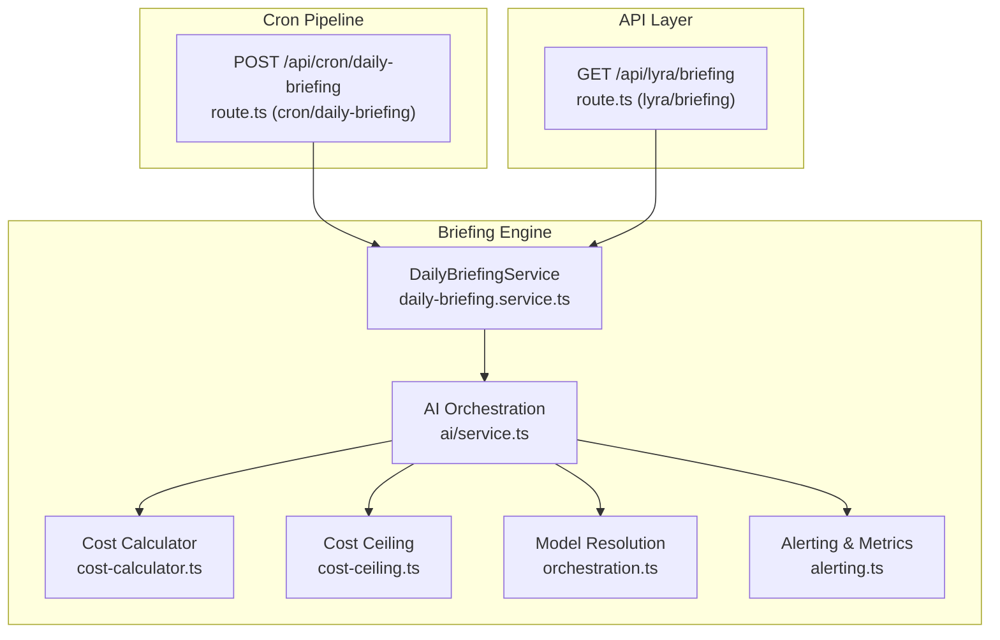
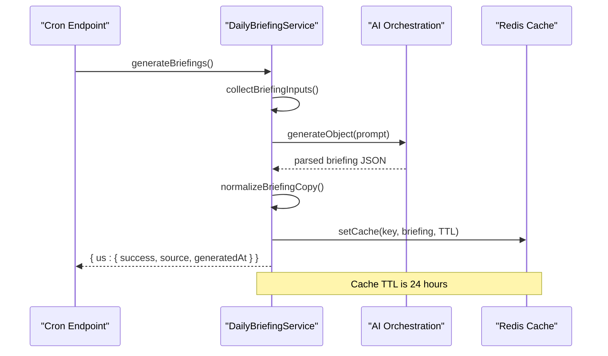
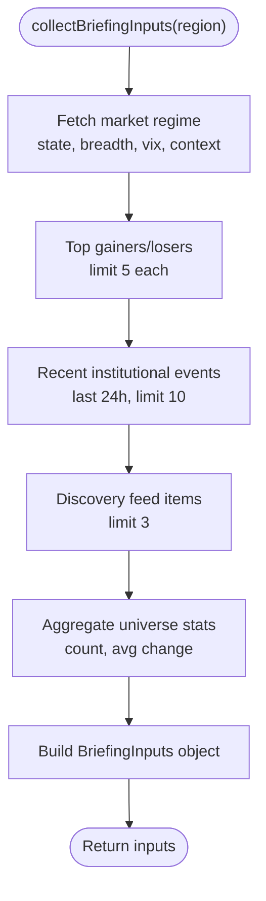
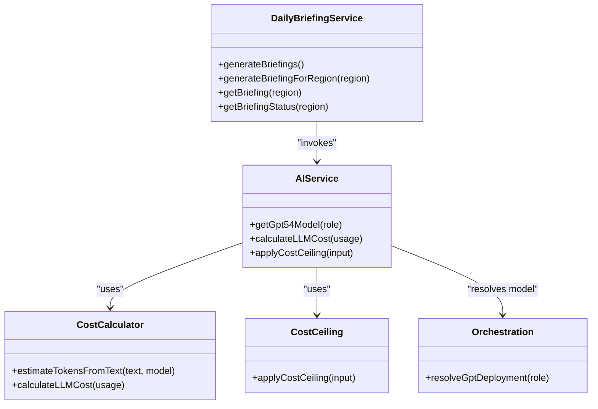
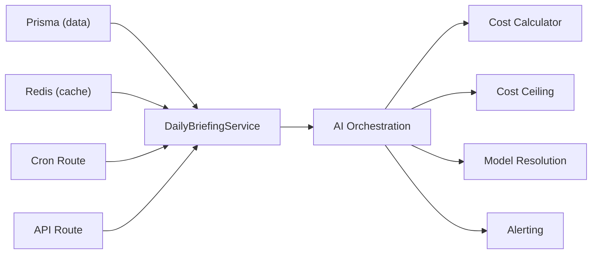

# Daily Briefing Service

<cite>
**Referenced Files in This Document**
- [daily-briefing.service.ts](file://src/lib/services/daily-briefing.service.ts)
- [route.ts (cron/daily-briefing)](file://src/app/api/cron/daily-briefing/route.ts)
- [route.ts (lyra/briefing)](file://src/app/api/lyra/briefing/route.ts)
- [service.ts (ai)](file://src/lib/ai/service.ts)
- [cost-calculator.ts](file://src/lib/ai/cost-calculator.ts)
- [cost-ceiling.ts](file://src/lib/ai/cost-ceiling.ts)
- [orchestration.ts](file://src/lib/ai/orchestration.ts)
- [alerting.ts](file://src/lib/ai/alerting.ts)
</cite>

## Table of Contents
1. [Introduction](#introduction)
2. [Project Structure](#project-structure)
3. [Core Components](#core-components)
4. [Architecture Overview](#architecture-overview)
5. [Detailed Component Analysis](#detailed-component-analysis)
6. [Dependency Analysis](#dependency-analysis)
7. [Performance Considerations](#performance-considerations)
8. [Troubleshooting Guide](#troubleshooting-guide)
9. [Conclusion](#conclusion)
10. [Appendices](#appendices)

## Introduction
The Daily Briefing Service is an AI-powered market intelligence pipeline that synthesizes crypto market conditions, top movers, discovery highlights, and institutional events into a concise, human-readable daily briefing. It runs as a scheduled cron job, caches results for 24 hours, and exposes a read endpoint for authenticated users. The system integrates OpenAI/Gemini models via a unified orchestration layer, enforces cost and latency budgets, and includes robust fallback and alerting mechanisms.

## Project Structure
The Daily Briefing Service spans three main areas:
- Data collection and orchestration: DailyBriefingService aggregates inputs from market regimes, top movers, discovery feed items, and institutional events.
- Cron pipeline: A serverless cron endpoint triggers generation and warming of related services.
- API endpoint: An authenticated endpoint serves cached briefings with cache-control headers.

**Diagram sources**
- [route.ts (cron/daily-briefing):15-49](file://src/app/api/cron/daily-briefing/route.ts#L15-L49)
- [daily-briefing.service.ts:352-548](file://src/lib/services/daily-briefing.service.ts#L352-L548)
- [service.ts (ai):211-219](file://src/lib/ai/service.ts#L211-L219)
- [cost-calculator.ts:293-312](file://src/lib/ai/cost-calculator.ts#L293-L312)
- [cost-ceiling.ts:116-173](file://src/lib/ai/cost-ceiling.ts#L116-L173)
- [orchestration.ts:5-7](file://src/lib/ai/orchestration.ts#L5-L7)
- [alerting.ts:399-474](file://src/lib/ai/alerting.ts#L399-L474)
- [route.ts (lyra/briefing):13-53](file://src/app/api/lyra/briefing/route.ts#L13-L53)

**Section sources**
- [route.ts (cron/daily-briefing):1-68](file://src/app/api/cron/daily-briefing/route.ts#L1-L68)
- [daily-briefing.service.ts:1-550](file://src/lib/services/daily-briefing.service.ts#L1-L550)
- [route.ts (lyra/briefing):1-54](file://src/app/api/lyra/briefing/route.ts#L1-L54)

## Core Components
- DailyBriefingService: Collects inputs, builds prompts, invokes the LLM, normalizes outputs, and manages caching and fallback.
- Cron endpoint: Triggers daily generation, warms related services, and reports status.
- API endpoint: Returns cached briefings with cache headers and contextual messages.
- AI orchestration: Resolves model deployments, tracks costs, and enforces budgets.
- Cost controls: Character-based token estimation, truncation, and cost calculation.
- Alerting: Latency, fallback, daily cost, and cron observability.

**Section sources**
- [daily-briefing.service.ts:352-548](file://src/lib/services/daily-briefing.service.ts#L352-L548)
- [route.ts (cron/daily-briefing):15-49](file://src/app/api/cron/daily-briefing/route.ts#L15-L49)
- [route.ts (lyra/briefing):13-53](file://src/app/api/lyra/briefing/route.ts#L13-L53)
- [service.ts (ai):211-219](file://src/lib/ai/service.ts#L211-L219)
- [cost-calculator.ts:293-312](file://src/lib/ai/cost-calculator.ts#L293-L312)
- [cost-ceiling.ts:116-173](file://src/lib/ai/cost-ceiling.ts#L116-L173)
- [alerting.ts:399-474](file://src/lib/ai/alerting.ts#L399-L474)

## Architecture Overview
The system follows a batch-and-cache architecture:
- Batch generation: Once daily, the cron endpoint collects market data, constructs a structured prompt, and calls the LLM to produce a normalized briefing. Costs and latencies are recorded for observability.
- Caching: Results are stored in Redis with a 24-hour TTL and normalized for readability.
- Live fallback: If cache is unavailable, a deterministic fallback is produced from the same inputs.
- API exposure: Authenticated users fetch briefings with cache-control headers to minimize origin calls.

**Diagram sources**
- [route.ts (cron/daily-briefing):19-48](file://src/app/api/cron/daily-briefing/route.ts#L19-L48)
- [daily-briefing.service.ts:385-406](file://src/lib/services/daily-briefing.service.ts#L385-L406)
- [daily-briefing.service.ts:408-548](file://src/lib/services/daily-briefing.service.ts#L408-L548)
- [service.ts (ai):211-219](file://src/lib/ai/service.ts#L211-L219)

## Detailed Component Analysis

### DailyBriefingService
Responsibilities:
- Data collection: Queries market regime, top gainers/losers, recent institutional events, discovery feed items, and aggregate stats.
- Prompt construction: Builds a structured prompt with regime context, breadth/volatility, correlation metrics, and top movers/events/discovery highlights.
- LLM invocation: Calls the AI SDK with a JSON schema to enforce output structure.
- Cost and latency controls: Applies a pre-call cost ceiling, measures latency, and records metrics.
- Normalization: Replaces symbols with friendly names, cleans text, and merges discovery highlights into the overview.
- Caching and fallback: Returns cached results if available; otherwise falls back to a deterministic live version.

Key behaviors:
- Inputs aggregation uses parallel queries to minimize latency.
- Cost ceiling truncates context to fit plan-specific limits.
- Latency budget is enforced for cron jobs (30 seconds).
- Outputs include optional advanced fields (e.g., regime transition probability, fragility alerts) for future enhancements.

**Diagram sources**
- [daily-briefing.service.ts:267-350](file://src/lib/services/daily-briefing.service.ts#L267-L350)

**Section sources**
- [daily-briefing.service.ts:352-548](file://src/lib/services/daily-briefing.service.ts#L352-L548)

### Cron Endpoint (/api/cron/daily-briefing)
- POST: Authenticates via cron middleware, triggers generation for regions, warms related services (narratives and macro research), and returns a success payload with timestamps.
- GET: Returns the current status of the briefing (cache availability, source, generation time, and debug stats).

Operational notes:
- maxDuration and preferredRegion are set for serverless execution.
- Fire-and-forget warming avoids blocking the cron response.

**Section sources**
- [route.ts (cron/daily-briefing):15-68](file://src/app/api/cron/daily-briefing/route.ts#L15-L68)

### API Endpoint (/api/lyra/briefing)
- GET: Requires authentication, supports region query parameter (US/IN), returns the cached briefing with cache-control headers, and a contextual message indicating whether a live fallback is being used.

**Section sources**
- [route.ts (lyra/briefing):13-53](file://src/app/api/lyra/briefing/route.ts#L13-L53)

### AI Integration and Orchestration
- Model selection: resolveGptDeployment chooses the appropriate deployment for a role, falling back to the primary model when unspecified.
- Cost tracking: calculateLLMCost computes input/output costs using model-specific pricing.
- Token estimation: estimateTokensFromText provides fast character-based estimates; exact counting uses tiktoken when needed.
- Cost ceiling: applyCostCeiling estimates total input tokens and truncates context to remain within plan-specific ceilings.

**Diagram sources**
- [daily-briefing.service.ts:408-548](file://src/lib/services/daily-briefing.service.ts#L408-L548)
- [service.ts (ai):211-219](file://src/lib/ai/service.ts#L211-L219)
- [cost-calculator.ts:153-167](file://src/lib/ai/cost-calculator.ts#L153-L167)
- [cost-calculator.ts:293-312](file://src/lib/ai/cost-calculator.ts#L293-L312)
- [cost-ceiling.ts:116-173](file://src/lib/ai/cost-ceiling.ts#L116-L173)
- [orchestration.ts:5-7](file://src/lib/ai/orchestration.ts#L5-L7)

**Section sources**
- [service.ts (ai):211-219](file://src/lib/ai/service.ts#L211-L219)
- [cost-calculator.ts:293-312](file://src/lib/ai/cost-calculator.ts#L293-L312)
- [cost-ceiling.ts:116-173](file://src/lib/ai/cost-ceiling.ts#L116-L173)
- [orchestration.ts:5-7](file://src/lib/ai/orchestration.ts#L5-L7)

### Cost Optimization Strategies
- Pre-call cost ceiling: Estimates total input tokens and truncates context to remain within plan-specific ceilings.
- Character-based estimation: Fast estimation (~4 chars/token) to avoid tokenizer overhead.
- Output schema enforcement: Reduces variability in output length and cost.
- Deployment resolution: Selects appropriate model roles to balance quality and cost.

**Section sources**
- [cost-ceiling.ts:116-173](file://src/lib/ai/cost-ceiling.ts#L116-L173)
- [cost-calculator.ts:153-167](file://src/lib/ai/cost-calculator.ts#L153-L167)
- [daily-briefing.service.ts:466-522](file://src/lib/services/daily-briefing.service.ts#L466-L522)

### Caching Mechanisms
- Cache key: lyra:daily-briefing:{region}
- TTL: 24 hours
- Normalization: Friendly symbol replacement and sentence casing applied before caching to improve readability.
- Live fallback: If cache is missing, a deterministic fallback is computed from the same inputs and returned with source = "live_fallback".

**Section sources**
- [daily-briefing.service.ts:31-32](file://src/lib/services/daily-briefing.service.ts#L31-L32)
- [daily-briefing.service.ts:352-366](file://src/lib/services/daily-briefing.service.ts#L352-L366)
- [daily-briefing.service.ts:197-265](file://src/lib/services/daily-briefing.service.ts#L197-L265)

### Briefing Structure
The briefing object includes:
- Market overview: Concise summary of what happened, why it matters, and what to watch next.
- Key insights: Up to three short, specific insights.
- Risks to watch: Up to two short, specific risks.
- Top movers: Top 3 gainers and losers with symbols, names, and percent changes.
- Discovery highlight: One short sentence about the most interesting discovery item, or null.
- Regime sentence: One short sentence explaining the current regime.
- Optional advanced fields: Regime transition probability, fragility alerts, narrative divergences, factor rotation signal.
- Metadata: Region, generatedAt, source, debug stats.

Normalization steps:
- Replace asset symbols with friendly names.
- Clean and sentence-case text.
- Merge discovery highlights into the overview when present.

**Section sources**
- [daily-briefing.service.ts:34-61](file://src/lib/services/daily-briefing.service.ts#L34-L61)
- [daily-briefing.service.ts:153-184](file://src/lib/services/daily-briefing.service.ts#L153-L184)

### Fallback System for Live Generation
If the cron generation fails or cache is unavailable, the service returns a live fallback:
- Deterministic composition from top movers, discovery items, and recent events.
- Includes regime context and correlation metrics for structural framing.
- Marked with source = "live_fallback" and debug stats for visibility.

**Section sources**
- [daily-briefing.service.ts:197-265](file://src/lib/services/daily-briefing.service.ts#L197-L265)
- [daily-briefing.service.ts:352-366](file://src/lib/services/daily-briefing.service.ts#L352-L366)

### Latency Monitoring and Error Handling
- Latency budget: Cron jobs use a 30-second budget; violations are recorded and alerted.
- Cron observability: Costs, latencies, and failures are tracked per job in hourly windows.
- Error logging: Structured logs with sanitized errors; API routes return 500 on failure.

**Section sources**
- [daily-briefing.service.ts:507-522](file://src/lib/services/daily-briefing.service.ts#L507-L522)
- [alerting.ts:299-329](file://src/lib/ai/alerting.ts#L299-L329)
- [alerting.ts:404-474](file://src/lib/ai/alerting.ts#L404-L474)
- [route.ts (lyra/briefing):49-52](file://src/app/api/lyra/briefing/route.ts#L49-L52)

### Examples of Briefing Generation Workflows
- Cron generation:
  - POST /api/cron/daily-briefing triggers generation, caches results, and warms related services.
- API retrieval:
  - GET /api/lyra/briefing?region=US returns cached briefing with cache-control headers and contextual message.

**Section sources**
- [route.ts (cron/daily-briefing):19-48](file://src/app/api/cron/daily-briefing/route.ts#L19-L48)
- [route.ts (lyra/briefing):17-48](file://src/app/api/lyra/briefing/route.ts#L17-L48)

### Configuration Options and Integration Patterns
- Regions: US and IN supported in the API; cron targets US.
- Cache-control: API responses include cache headers to leverage CDN/browser caching.
- Authentication: API endpoint requires authentication; cron endpoint uses internal auth.
- Integration patterns:
  - Personal briefing system can reuse the same inputs and normalization logic.
  - Related services (narratives, macro research) are warmed after cron completion.

**Section sources**
- [route.ts (lyra/briefing):24-32](file://src/app/api/lyra/briefing/route.ts#L24-L32)
- [route.ts (cron/daily-briefing):27-33](file://src/app/api/cron/daily-briefing/route.ts#L27-L33)

## Dependency Analysis
- Internal dependencies:
  - DailyBriefingService depends on Redis for caching, Prisma for data, and the AI orchestration layer for model selection and cost tracking.
  - Cron and API routes depend on middleware for authentication/logging.
- External integrations:
  - AI SDK for model calls and streaming.
  - Redis for caching and metrics.
  - Webhook-based alerting for anomalies.

**Diagram sources**
- [daily-briefing.service.ts:14-27](file://src/lib/services/daily-briefing.service.ts#L14-L27)
- [service.ts (ai):211-219](file://src/lib/ai/service.ts#L211-L219)
- [cost-calculator.ts:293-312](file://src/lib/ai/cost-calculator.ts#L293-L312)
- [cost-ceiling.ts:116-173](file://src/lib/ai/cost-ceiling.ts#L116-L173)
- [orchestration.ts:5-7](file://src/lib/ai/orchestration.ts#L5-L7)
- [alerting.ts:399-474](file://src/lib/ai/alerting.ts#L399-L474)
- [route.ts (cron/daily-briefing):1-14](file://src/app/api/cron/daily-briefing/route.ts#L1-L14)
- [route.ts (lyra/briefing):1-12](file://src/app/api/lyra/briefing/route.ts#L1-L12)

**Section sources**
- [daily-briefing.service.ts:14-27](file://src/lib/services/daily-briefing.service.ts#L14-L27)
- [service.ts (ai):211-219](file://src/lib/ai/service.ts#L211-L219)
- [route.ts (cron/daily-briefing):1-14](file://src/app/api/cron/daily-briefing/route.ts#L1-L14)
- [route.ts (lyra/briefing):1-12](file://src/app/api/lyra/briefing/route.ts#L1-L12)

## Performance Considerations
- Parallel data collection reduces end-to-end latency.
- Cost ceiling prevents runaway context sizes; truncation preserves quality.
- Early normalization and friendly symbol replacement reduce downstream processing.
- Cache TTL of 24 hours balances freshness with cost and latency.

## Troubleshooting Guide
Common issues and resolutions:
- Generation failures:
  - Check cron logs for errors and verify Redis connectivity.
  - Confirm AI model deployment and webhook alerting for cron failures.
- Cache misses:
  - Verify cache key and TTL; fallback logic will return a live version.
- Latency violations:
  - Review cost ceiling estimations and adjust plan-specific ceilings if needed.
- API errors:
  - Ensure authentication and region parameters are valid; inspect structured logs for sanitized errors.

**Section sources**
- [route.ts (cron/daily-briefing):40-46](file://src/app/api/cron/daily-briefing/route.ts#L40-L46)
- [route.ts (lyra/briefing):49-52](file://src/app/api/lyra/briefing/route.ts#L49-L52)
- [alerting.ts:404-474](file://src/lib/ai/alerting.ts#L404-L474)

## Conclusion
The Daily Briefing Service provides a robust, cost-aware, and observable pipeline for generating AI-powered market intelligence. By combining structured data ingestion, strict cost and latency controls, resilient caching, and comprehensive alerting, it delivers timely, readable briefings suitable for both automated distribution and user-facing consumption.

## Appendices
- Example endpoints:
  - POST /api/cron/daily-briefing
  - GET /api/lyra/briefing?region=US
- Key configuration:
  - Cache TTL: 24 hours
  - Cron latency budget: 30 seconds
  - Alert thresholds: configurable via environment variables