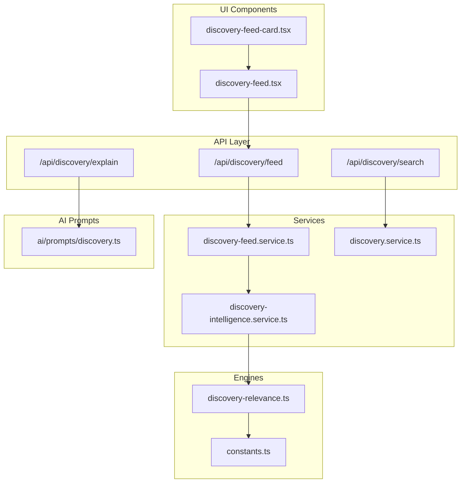
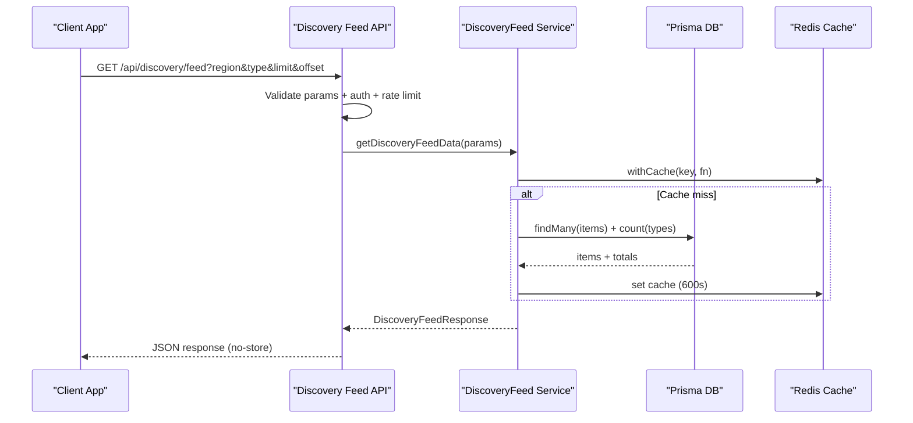
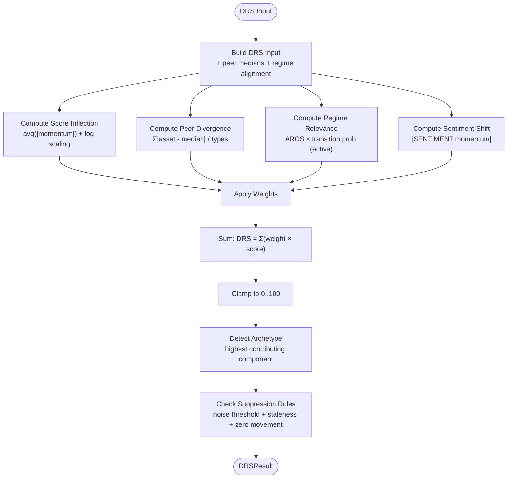
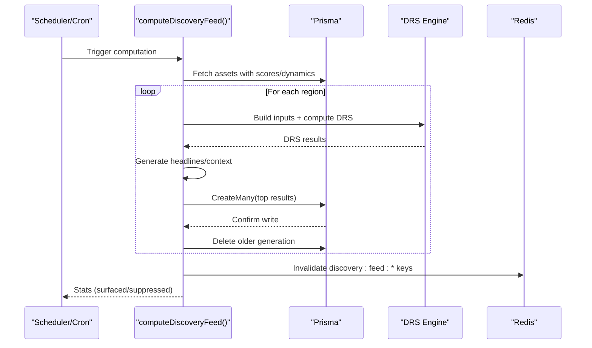
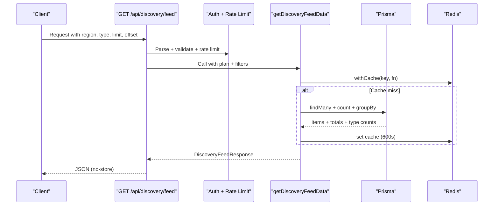
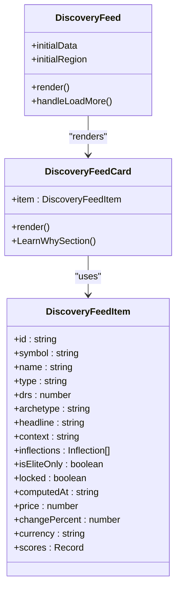
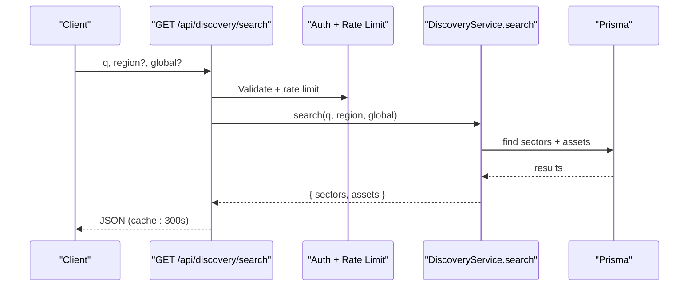
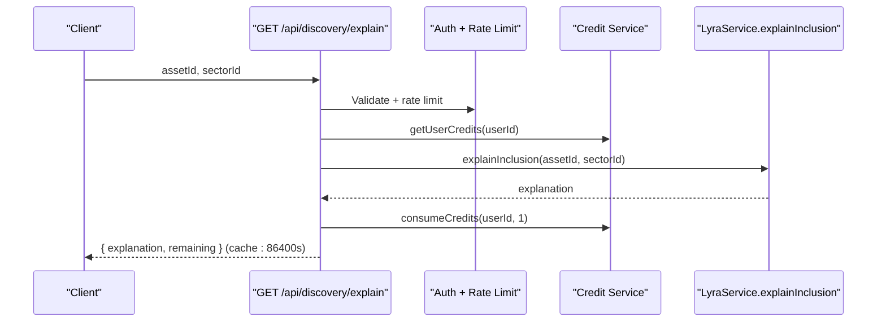
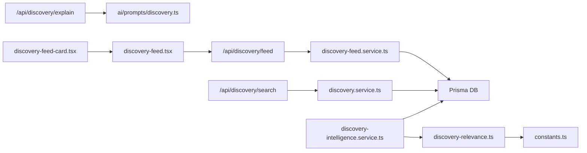

# Discovery Feed System

<cite>
**Referenced Files in This Document**
- [route.ts](file://src/app/api/discovery/feed/route.ts)
- [route.ts](file://src/app/api/discovery/search/route.ts)
- [discovery-feed.tsx](file://src/components/dashboard/discovery-feed.tsx)
- [discovery-feed-card.tsx](file://src/components/dashboard/discovery-feed-card.tsx)
- [discovery-feed.service.ts](file://src/lib/services/discovery-feed.service.ts)
- [discovery.service.ts](file://src/lib/services/discovery.service.ts)
- [discovery-intelligence.service.ts](file://src/lib/services/discovery-intelligence.service.ts)
- [discovery-relevance.ts](file://src/lib/engines/discovery-relevance.ts)
- [constants.ts](file://src/lib/engines/constants.ts)
- [discovery.ts](file://src/lib/ai/prompts/discovery.ts)
- [page.tsx](file://src/app/dashboard/discovery/page.tsx)
- [route.ts](file://src/app/api/discovery/explain/route.ts)
- [seed-discovery-feed.ts](file://scripts/seed-discovery-feed.ts)
</cite>

## Table of Contents
1. [Introduction](#introduction)
2. [Project Structure](#project-structure)
3. [Core Components](#core-components)
4. [Architecture Overview](#architecture-overview)
5. [Detailed Component Analysis](#detailed-component-analysis)
6. [Dependency Analysis](#dependency-analysis)
7. [Performance Considerations](#performance-considerations)
8. [Troubleshooting Guide](#troubleshooting-guide)
9. [Conclusion](#conclusion)

## Introduction
The Discovery Feed System is a real-time, AI-powered content curation engine designed to surface actionable market signals and anomalies across crypto assets. It computes a Discovery Relevance Score (DRS) for each asset, detects signal clusters, applies intelligent suppression rules, and exposes curated feeds through REST APIs and React components. The system integrates with market intelligence workflows to provide personalized, region-aware, and plan-tiered content recommendations.

## Project Structure
The Discovery Feed System spans API routes, service layers, UI components, and AI prompts. Key areas:
- API layer: `/api/discovery/feed`, `/api/discovery/search`, `/api/discovery/explain`
- Services: Discovery feed retrieval, discovery intelligence pipeline, discovery utilities
- UI: Discovery feed cards and feed container
- Engines: DRS computation, constants, and relevance scoring
- Scripts: One-off seeding of the discovery feed

**Diagram sources**
- [route.ts:1-63](file://src/app/api/discovery/feed/route.ts#L1-L63)
- [route.ts:1-62](file://src/app/api/discovery/search/route.ts#L1-L62)
- [route.ts:1-68](file://src/app/api/discovery/explain/route.ts#L1-L68)
- [discovery-feed.service.ts:1-200](file://src/lib/services/discovery-feed.service.ts#L1-L200)
- [discovery.service.ts:1-483](file://src/lib/services/discovery.service.ts#L1-L483)
- [discovery-intelligence.service.ts:1-401](file://src/lib/services/discovery-intelligence.service.ts#L1-L401)
- [discovery-feed.tsx:1-288](file://src/components/dashboard/discovery-feed.tsx#L1-L288)
- [discovery-feed-card.tsx:1-598](file://src/components/dashboard/discovery-feed-card.tsx#L1-L598)
- [discovery-relevance.ts:1-350](file://src/lib/engines/discovery-relevance.ts#L1-L350)
- [constants.ts:1-223](file://src/lib/engines/constants.ts#L1-L223)
- [discovery.ts:1-108](file://src/lib/ai/prompts/discovery.ts#L1-L108)

**Section sources**
- [route.ts:1-63](file://src/app/api/discovery/feed/route.ts#L1-L63)
- [route.ts:1-62](file://src/app/api/discovery/search/route.ts#L1-L62)
- [discovery-feed.tsx:1-288](file://src/components/dashboard/discovery-feed.tsx#L1-L288)
- [discovery-feed-card.tsx:1-598](file://src/components/dashboard/discovery-feed-card.tsx#L1-L598)
- [discovery-feed.service.ts:1-200](file://src/lib/services/discovery-feed.service.ts#L1-L200)
- [discovery.service.ts:1-483](file://src/lib/services/discovery.service.ts#L1-L483)
- [discovery-intelligence.service.ts:1-401](file://src/lib/services/discovery-intelligence.service.ts#L1-L401)
- [discovery-relevance.ts:1-350](file://src/lib/engines/discovery-relevance.ts#L1-L350)
- [constants.ts:1-223](file://src/lib/engines/constants.ts#L1-L223)
- [discovery.ts:1-108](file://src/lib/ai/prompts/discovery.ts#L1-L108)
- [page.tsx:1-57](file://src/app/dashboard/discovery/page.tsx#L1-L57)
- [route.ts:1-68](file://src/app/api/discovery/explain/route.ts#L1-L68)
- [seed-discovery-feed.ts:1-38](file://scripts/seed-discovery-feed.ts#L1-L38)

## Core Components
- Discovery Feed API: Validates parameters, enforces rate limits, authenticates users, and returns paginated discovery items with plan caps and region/type filters.
- Discovery Search API: Provides global and regional search across sectors and assets with caching and rate limiting.
- Discovery Intelligence Pipeline: Computes DRS per asset, generates headlines and context, applies suppression rules, and writes top results to the feed table.
- DRS Engine: Implements weighted relevance scoring combining score inflection, peer divergence, regime sensitivity, sentiment shift, and structural signals.
- Discovery Feed Service: Retrieves items from the database with locking for elite-only content, plan-based visibility, and pagination.
- UI Components: Render discovery cards with archetypal badges, DRS scores, contextual insights, and interactive “Learn Why” sections.
- AI Prompts: Structured prompts for explaining sector inclusion using institutional-grade reasoning.

**Section sources**
- [route.ts:19-62](file://src/app/api/discovery/feed/route.ts#L19-L62)
- [route.ts:15-61](file://src/app/api/discovery/search/route.ts#L15-L61)
- [discovery-intelligence.service.ts:27-207](file://src/lib/services/discovery-intelligence.service.ts#L27-L207)
- [discovery-relevance.ts:297-343](file://src/lib/engines/discovery-relevance.ts#L297-L343)
- [discovery-feed.service.ts:72-199](file://src/lib/services/discovery-feed.service.ts#L72-L199)
- [discovery-feed.tsx:50-283](file://src/components/dashboard/discovery-feed.tsx#L50-L283)
- [discovery-feed-card.tsx:197-598](file://src/components/dashboard/discovery-feed-card.tsx#L197-L598)
- [discovery.ts:6-22](file://src/lib/ai/prompts/discovery.ts#L6-L22)

## Architecture Overview
The system follows a layered architecture:
- Presentation: Next.js API routes and client-side React components
- Service: Orchestration of data fetching, computation, and persistence
- Engine: Deterministic scoring and suppression logic
- Data: Prisma ORM and Redis caching
- AI: Structured prompts for explainability

**Diagram sources**
- [route.ts:19-62](file://src/app/api/discovery/feed/route.ts#L19-L62)
- [discovery-feed.service.ts:72-199](file://src/lib/services/discovery-feed.service.ts#L72-L199)

## Detailed Component Analysis

### Discovery Relevance Score (DRS) Engine
The DRS engine computes a 0–100 relevance score per asset using weighted components:
- Score Inflection: Average momentum magnitude across engines (logarithmic scaling)
- Peer Divergence: Deviation from peer medians (z-score-like aggregation)
- Regime Sensitivity: ARCS × transition probability during active transitions
- Sentiment Shift: Delta in SENTIMENT engine score
- Structural Signal: Not applicable for crypto-only platform

Suppression rules filter out low-signal or stale items, with elite-only gating for cross-asset patterns.

**Diagram sources**
- [discovery-relevance.ts:297-343](file://src/lib/engines/discovery-relevance.ts#L297-L343)
- [constants.ts:187-207](file://src/lib/engines/constants.ts#L187-L207)

**Section sources**
- [discovery-relevance.ts:1-350](file://src/lib/engines/discovery-relevance.ts#L1-L350)
- [constants.ts:187-207](file://src/lib/engines/constants.ts#L187-L207)

### Discovery Intelligence Pipeline
The pipeline orchestrates DRS computation across supported regions, generates headlines and context, applies stratified selection for type diversity, and writes results to the feed table with expiration.

**Diagram sources**
- [discovery-intelligence.service.ts:27-207](file://src/lib/services/discovery-intelligence.service.ts#L27-L207)
- [discovery-relevance.ts:297-343](file://src/lib/engines/discovery-relevance.ts#L297-L343)

**Section sources**
- [discovery-intelligence.service.ts:1-401](file://src/lib/services/discovery-intelligence.service.ts#L1-L401)
- [seed-discovery-feed.ts:1-38](file://scripts/seed-discovery-feed.ts#L1-L38)

### Discovery Feed API and Service
The feed API validates parameters, enforces rate limits, authenticates users, and delegates to the discovery feed service. The service:
- Applies plan caps and elite-only locks
- Filters by region and type
- Normalizes inflection data
- Returns pagination metadata and type availability

**Diagram sources**
- [route.ts:19-62](file://src/app/api/discovery/feed/route.ts#L19-L62)
- [discovery-feed.service.ts:72-199](file://src/lib/services/discovery-feed.service.ts#L72-L199)

**Section sources**
- [route.ts:1-63](file://src/app/api/discovery/feed/route.ts#L1-L63)
- [discovery-feed.service.ts:1-200](file://src/lib/services/discovery-feed.service.ts#L1-L200)

### Discovery UI Components
The feed UI renders cards with:
- Archetypal badges and colors
- DRS score with tooltip
- Headline and context
- Score pills and price/change
- “Learn Why” expandable section with archetype-specific explanations
- Signal cluster banner highlighting simultaneous high-DRS signals

**Diagram sources**
- [discovery-feed.tsx:50-283](file://src/components/dashboard/discovery-feed.tsx#L50-L283)
- [discovery-feed-card.tsx:34-52](file://src/components/dashboard/discovery-feed-card.tsx#L34-L52)

**Section sources**
- [discovery-feed.tsx:1-288](file://src/components/dashboard/discovery-feed.tsx#L1-L288)
- [discovery-feed-card.tsx:1-598](file://src/components/dashboard/discovery-feed-card.tsx#L1-L598)

### Search Functionality
The search API supports:
- Global vs regional search
- Rate limiting and caching
- Deduplicated asset results per symbol
- Sector and asset suggestions

**Diagram sources**
- [route.ts:15-61](file://src/app/api/discovery/search/route.ts#L15-L61)
- [discovery.service.ts:381-481](file://src/lib/services/discovery.service.ts#L381-L481)

**Section sources**
- [route.ts:1-62](file://src/app/api/discovery/search/route.ts#L1-L62)
- [discovery.service.ts:381-481](file://src/lib/services/discovery.service.ts#L381-L481)

### AI-Powered Content Filtering and Explainability
The explain API:
- Requires authentication and credits
- Enforces rate limits
- Calls LyraService to explain inclusion
- Deducts credits upon successful generation
- Returns cached explanations with remaining credits

**Diagram sources**
- [route.ts:17-67](file://src/app/api/discovery/explain/route.ts#L17-L67)
- [discovery.ts:6-22](file://src/lib/ai/prompts/discovery.ts#L6-L22)

**Section sources**
- [route.ts:1-68](file://src/app/api/discovery/explain/route.ts#L1-L68)
- [discovery.ts:1-108](file://src/lib/ai/prompts/discovery.ts#L1-L108)

### Personalized Recommendations and Asset-Specific Feeds
- Region-aware filtering: Crypto assets are global and appear in all regions.
- Plan-based visibility: Elite-only items are locked behind plan gating.
- Type diversity: Stratified selection ensures varied asset types in the feed.
- Real-time updates: SWR-based infinite scroll with auto-load and scroll restoration.

**Section sources**
- [discovery-feed.service.ts:89-182](file://src/lib/services/discovery-feed.service.ts#L89-L182)
- [discovery-intelligence.service.ts:321-391](file://src/lib/services/discovery-intelligence.service.ts#L321-L391)
- [discovery-feed.tsx:50-283](file://src/components/dashboard/discovery-feed.tsx#L50-L283)

## Dependency Analysis
Key dependencies and relationships:
- API routes depend on auth, rate limiting, and plan gating
- Discovery feed service depends on Prisma and Redis caching
- Intelligence service depends on DRS engine and headline/context generators
- UI components depend on SWR for data fetching and local storage for UX metrics
- AI prompts define the structure for explainability

**Diagram sources**
- [route.ts:1-63](file://src/app/api/discovery/feed/route.ts#L1-L63)
- [route.ts:1-62](file://src/app/api/discovery/search/route.ts#L1-L62)
- [route.ts:1-68](file://src/app/api/discovery/explain/route.ts#L1-L68)
- [discovery-feed.service.ts:1-200](file://src/lib/services/discovery-feed.service.ts#L1-L200)
- [discovery.service.ts:1-483](file://src/lib/services/discovery.service.ts#L1-L483)
- [discovery-intelligence.service.ts:1-401](file://src/lib/services/discovery-intelligence.service.ts#L1-L401)
- [discovery-relevance.ts:1-350](file://src/lib/engines/discovery-relevance.ts#L1-L350)
- [constants.ts:1-223](file://src/lib/engines/constants.ts#L1-L223)
- [discovery.ts:1-108](file://src/lib/ai/prompts/discovery.ts#L1-L108)
- [discovery-feed.tsx:1-288](file://src/components/dashboard/discovery-feed.tsx#L1-L288)
- [discovery-feed-card.tsx:1-598](file://src/components/dashboard/discovery-feed-card.tsx#L1-L598)

**Section sources**
- [route.ts:1-63](file://src/app/api/discovery/feed/route.ts#L1-L63)
- [route.ts:1-62](file://src/app/api/discovery/search/route.ts#L1-L62)
- [discovery-feed.service.ts:1-200](file://src/lib/services/discovery-feed.service.ts#L1-L200)
- [discovery.service.ts:1-483](file://src/lib/services/discovery.service.ts#L1-L483)
- [discovery-intelligence.service.ts:1-401](file://src/lib/services/discovery-intelligence.service.ts#L1-L401)
- [discovery-relevance.ts:1-350](file://src/lib/engines/discovery-relevance.ts#L1-L350)
- [constants.ts:1-223](file://src/lib/engines/constants.ts#L1-L223)
- [discovery.ts:1-108](file://src/lib/ai/prompts/discovery.ts#L1-L108)
- [discovery-feed.tsx:1-288](file://src/components/dashboard/discovery-feed.tsx#L1-L288)
- [discovery-feed-card.tsx:1-598](file://src/components/dashboard/discovery-feed-card.tsx#L1-L598)

## Performance Considerations
- Caching: Redis caching for feed, search, and explanations reduces database load and latency.
- Pagination: Efficient limit/offset with deduplication prevents redundant rendering.
- Parallelization: Batched computations and parallel DB queries improve throughput.
- Rate limiting: Prevents abuse and protects downstream systems.
- Client-side hydration: Initial data hydration avoids extra network requests on first render.

[No sources needed since this section provides general guidance]

## Troubleshooting Guide
Common issues and resolutions:
- Empty feed: The warming message indicates insufficient sync cycles; run a market sync to populate the feed.
- Rate limit errors: Verify user ID/IP-based rate limiter and bypass checks for testing environments.
- Missing items: Check plan caps and elite-only locks; verify region filters and type filters.
- Stale data: Confirm last sync age thresholds and ensure the intelligence pipeline is running.

**Section sources**
- [discovery-feed.tsx:265-280](file://src/components/dashboard/discovery-feed.tsx#L265-L280)
- [route.ts:31-40](file://src/app/api/discovery/feed/route.ts#L31-L40)
- [discovery-feed.service.ts:85-87](file://src/lib/services/discovery-feed.service.ts#L85-L87)
- [discovery-relevance.ts:261-293](file://src/lib/engines/discovery-relevance.ts#L261-L293)

## Conclusion
The Discovery Feed System delivers intelligent, real-time content curation through a robust DRS engine, strict suppression rules, and plan-aware visibility. Its modular architecture integrates seamlessly with market intelligence workflows, enabling personalized, region-aware feeds and AI-driven explainability. The system’s caching, rate limiting, and stratified selection ensure scalability and a high-quality user experience.