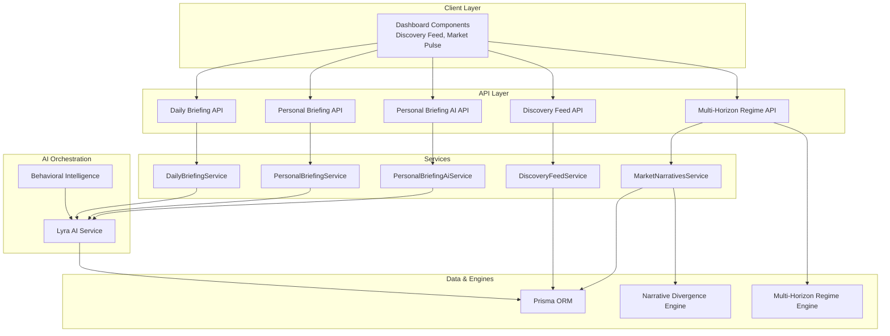
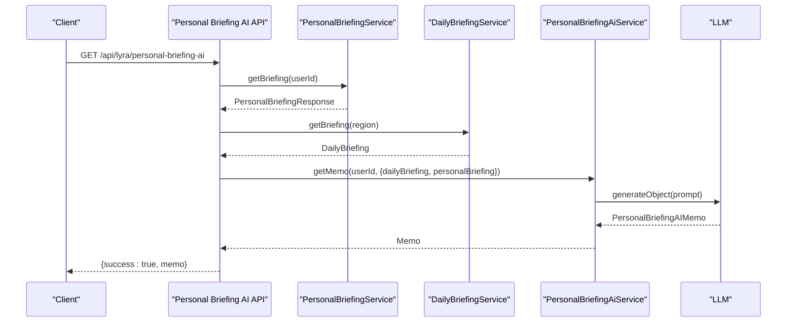
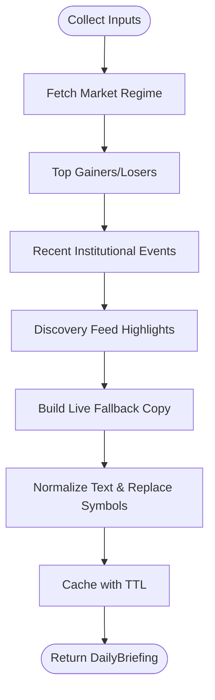
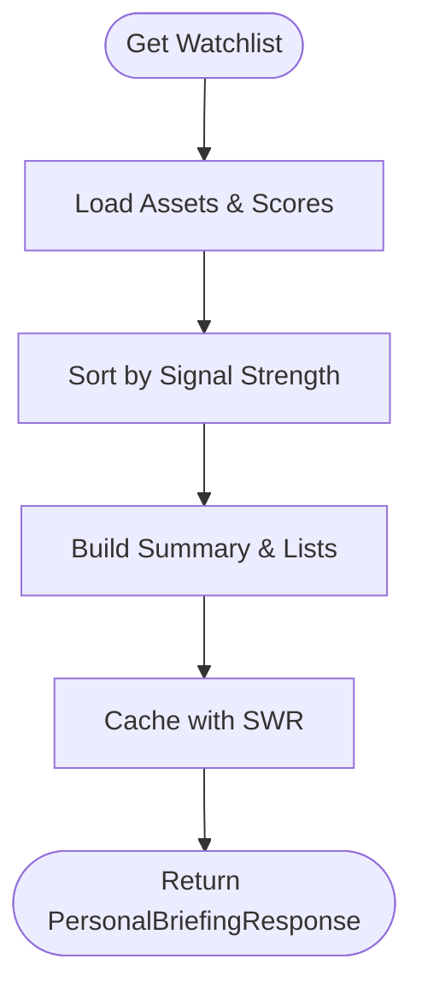
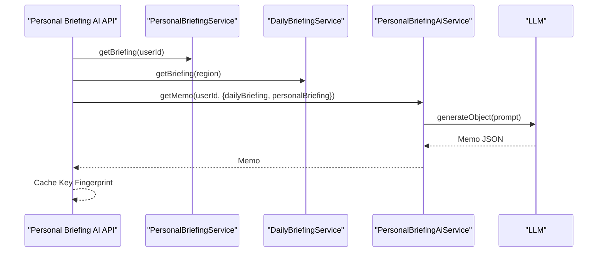
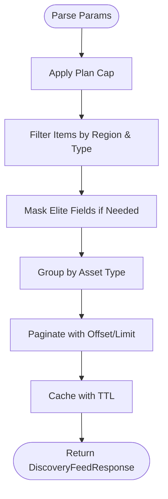
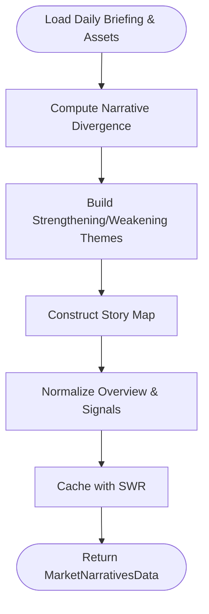
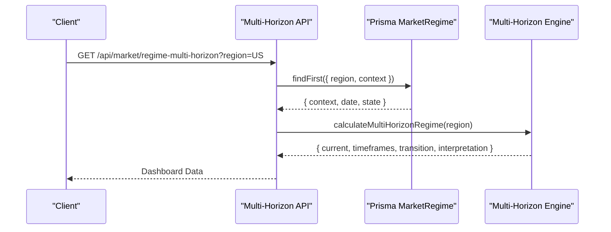
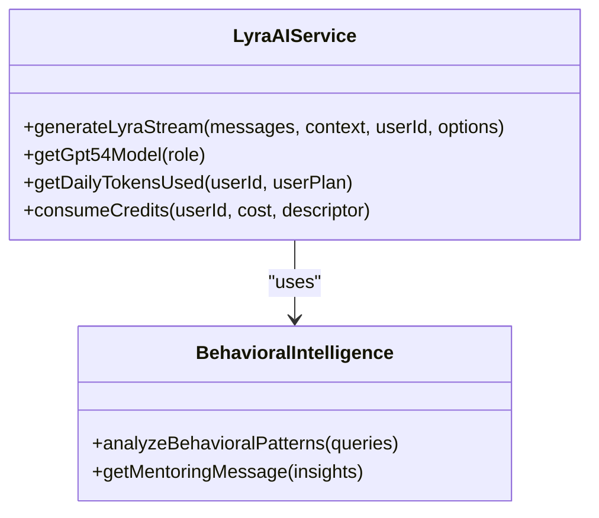
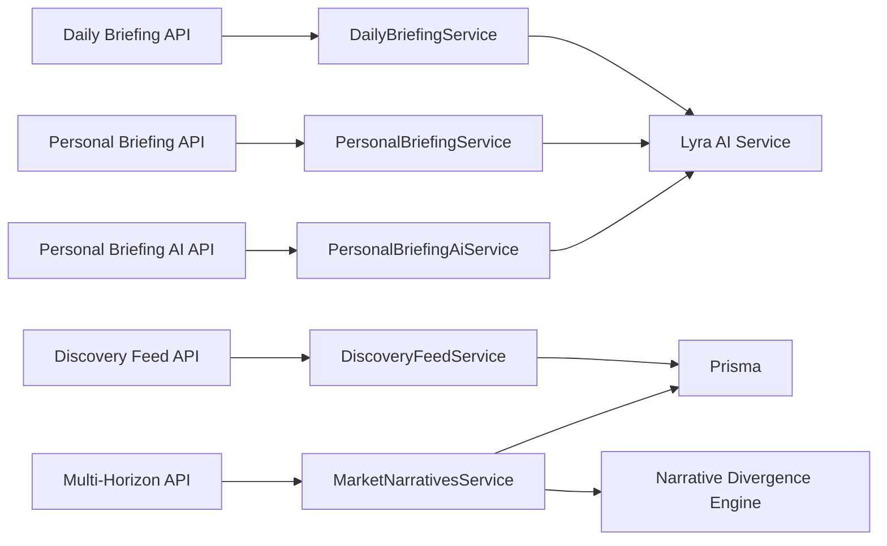

# Market Intelligence Engine

<cite>
**Referenced Files in This Document**
- [daily-briefing.service.ts](file://src/lib/services/daily-briefing.service.ts)
- [personal-briefing.service.ts](file://src/lib/services/personal-briefing.service.ts)
- [personal-briefing-ai.service.ts](file://src/lib/services/personal-briefing-ai.service.ts)
- [discovery-feed.service.ts](file://src/lib/services/discovery-feed.service.ts)
- [market-narratives.service.ts](file://src/lib/services/market-narratives.service.ts)
- [narrative-divergence.ts](file://src/lib/engines/narrative-divergence.ts)
- [multi-horizon-regime.route.ts](file://src/app/api/market/regime-multi-horizon/route.ts)
- [daily-briefing.cron.route.ts](file://src/app/api/cron/daily-briefing/route.ts)
- [personal-briefing.api.route.ts](file://src/app/api/lyra/personal-briefing/route.ts)
- [personal-briefing-ai.api.route.ts](file://src/app/api/lyra/personal-briefing-ai/route.ts)
- [discovery.feed.api.route.ts](file://src/app/api/discovery/feed/route.ts)
- [discovery-market-pulse.component.tsx](file://src/components/dashboard/discovery-market-pulse.tsx)
- [lyra.ai.service.ts](file://src/lib/ai/service.ts)
- [behavioral-intelligence.ts](file://src/lib/ai/behavioral-intelligence.ts)
- [backtest-engines.ts](file://src/scripts/backtest-engines.ts)
</cite>

## Table of Contents
1. [Introduction](#introduction)
2. [Project Structure](#project-structure)
3. [Core Components](#core-components)
4. [Architecture Overview](#architecture-overview)
5. [Detailed Component Analysis](#detailed-component-analysis)
6. [Dependency Analysis](#dependency-analysis)
7. [Performance Considerations](#performance-considerations)
8. [Troubleshooting Guide](#troubleshooting-guide)
9. [Conclusion](#conclusion)
10. [Appendices](#appendices)

## Introduction
The Market Intelligence Engine is an AI-powered system that synthesizes real-time market data, discovery signals, and macro narratives into actionable insights. It powers:
- Daily briefing service with AI-generated summaries and regime context
- Personal AI assistant for personalized watchlist memos
- Market pulse detection through narrative divergence and sector analysis
- Intelligent content curation via discovery feed algorithms
- Sector analysis tools and multi-horizon regime detection

The system integrates natural language processing, real-time data feeds, and curated content to deliver concise, high-impact intelligence tailored to user preferences and plan tiers.

## Project Structure
The engine spans backend services, APIs, AI orchestration, and frontend components:
- Services encapsulate domain logic for briefings, discovery, and market narratives
- APIs expose endpoints for client consumption with caching and rate limiting
- AI service orchestrates LLM interactions, context building, and cost controls
- Components visualize market pulse, discovery feed, and sector regimes

**Diagram sources**
- [daily-briefing.service.ts:352-550](file://src/lib/services/daily-briefing.service.ts#L352-L550)
- [personal-briefing.service.ts:141-155](file://src/lib/services/personal-briefing.service.ts#L141-L155)
- [personal-briefing-ai.service.ts:99-138](file://src/lib/services/personal-briefing-ai.service.ts#L99-L138)
- [discovery-feed.service.ts:72-200](file://src/lib/services/discovery-feed.service.ts#L72-L200)
- [market-narratives.service.ts:314-337](file://src/lib/services/market-narratives.service.ts#L314-L337)
- [lyra.ai.service.ts:383-793](file://src/lib/ai/service.ts#L383-L793)
- [behavioral-intelligence.ts:136-244](file://src/lib/ai/behavioral-intelligence.ts#L136-L244)
- [narrative-divergence.ts:22-141](file://src/lib/engines/narrative-divergence.ts#L22-L141)
- [multi-horizon-regime.route.ts:14-77](file://src/app/api/market/regime-multi-horizon/route.ts#L14-L77)

**Section sources**
- [daily-briefing.service.ts:1-550](file://src/lib/services/daily-briefing.service.ts#L1-L550)
- [personal-briefing.service.ts:1-155](file://src/lib/services/personal-briefing.service.ts#L1-L155)
- [personal-briefing-ai.service.ts:28-138](file://src/lib/services/personal-briefing-ai.service.ts#L28-L138)
- [discovery-feed.service.ts:1-200](file://src/lib/services/discovery-feed.service.ts#L1-L200)
- [market-narratives.service.ts:1-337](file://src/lib/services/market-narratives.service.ts#L1-L337)
- [lyra.ai.service.ts:383-793](file://src/lib/ai/service.ts#L383-L793)
- [behavioral-intelligence.ts:136-244](file://src/lib/ai/behavioral-intelligence.ts#L136-L244)
- [narrative-divergence.ts:1-141](file://src/lib/engines/narrative-divergence.ts#L1-L141)
- [multi-horizon-regime.route.ts:1-77](file://src/app/api/market/regime-multi-horizon/route.ts#L1-L77)

## Core Components
- Daily Briefing Service: Aggregates regime, movers, discovery highlights, and recent events into a concise AI-generated market overview with normalized copy and plan-aware outputs.
- Personal Briefing Service: Builds a personalized watchlist summary aligned to current market conditions and compatibility signals.
- Personal Briefing AI Service: Generates a human-friendly morning memo by combining the daily briefing with personal watchlist context.
- Discovery Feed Service: Curates cross-asset discovery items with inflection points, plan-tier limits, and visibility controls.
- Market Narratives Service: Computes narrative themes, divergence signals, and story maps linking regime, rotation, and discovery to asset-level sentiment.
- AI Orchestration: Manages query classification, context building, RAG/web search, streaming responses, and cost controls.
- Multi-Horizon Regime API: Provides short/medium/long-term regime snapshots and transition probabilities for strategic planning.

**Section sources**
- [daily-briefing.service.ts:34-61](file://src/lib/services/daily-briefing.service.ts#L34-L61)
- [personal-briefing.service.ts:9-34](file://src/lib/services/personal-briefing.service.ts#L9-L34)
- [personal-briefing-ai.service.ts:99-138](file://src/lib/services/personal-briefing-ai.service.ts#L99-L138)
- [discovery-feed.service.ts:14-43](file://src/lib/services/discovery-feed.service.ts#L14-L43)
- [market-narratives.service.ts:44-57](file://src/lib/services/market-narratives.service.ts#L44-L57)
- [lyra.ai.service.ts:383-793](file://src/lib/ai/service.ts#L383-L793)
- [multi-horizon-regime.route.ts:14-77](file://src/app/api/market/regime-multi-horizon/route.ts#L14-L77)

## Architecture Overview
The system follows a layered architecture:
- Presentation: Next.js app routes expose REST endpoints for briefings, discovery, and regime analysis.
- Domain Services: Business logic for data aggregation, normalization, and AI prompting.
- AI Orchestration: Centralized LLM interaction with context builder, RAG, web search, and cost controls.
- Data Access: Prisma ORM with Redis caching and stale-while-revalidate for performance.
- Engines: Narrative divergence and multi-horizon regime calculations.

**Diagram sources**
- [personal-briefing-ai.api.route.ts:16-45](file://src/app/api/lyra/personal-briefing-ai/route.ts#L16-L45)
- [personal-briefing.service.ts:141-155](file://src/lib/services/personal-briefing.service.ts#L141-L155)
- [daily-briefing.service.ts:352-383](file://src/lib/services/daily-briefing.service.ts#L352-L383)
- [personal-briefing-ai.service.ts:99-138](file://src/lib/services/personal-briefing-ai.service.ts#L99-L138)

**Section sources**
- [personal-briefing-ai.api.route.ts:1-45](file://src/app/api/lyra/personal-briefing-ai/route.ts#L1-L45)
- [personal-briefing-ai.service.ts:28-138](file://src/lib/services/personal-briefing-ai.service.ts#L28-L138)

## Detailed Component Analysis

### Daily Briefing Service
- Responsibilities:
  - Collects regime, movers, events, and discovery items
  - Builds normalized market overview, key insights, and risks
  - Generates fallback copy and computes debug metadata
  - Caches results with 24-hour TTL and supports cron regeneration
- AI Integration:
  - Uses structured prompts and schema-based JSON generation
  - Applies cost ceilings and latency budgets for cron jobs
  - Tracks LLM cost and performance via alerting hooks
- Real-time Data Analysis:
  - Aggregates top gainers/losers, correlation metrics, and breadth/volatility indicators
  - Normalizes asset symbols and cleans copy for readability

**Diagram sources**
- [daily-briefing.service.ts:267-350](file://src/lib/services/daily-briefing.service.ts#L267-L350)
- [daily-briefing.service.ts:197-265](file://src/lib/services/daily-briefing.service.ts#L197-L265)
- [daily-briefing.service.ts:153-184](file://src/lib/services/daily-briefing.service.ts#L153-L184)

**Section sources**
- [daily-briefing.service.ts:1-550](file://src/lib/services/daily-briefing.service.ts#L1-L550)

### Personal Briefing Service
- Responsibilities:
  - Retrieves user watchlist and related assets
  - Computes top assets by signal strength and momentum
  - Flags misaligned assets and builds a concise summary
  - Caches with stale-while-revalidate for freshness and performance
- Personalization:
  - Tailors insights to user’s holdings and current regime alignment
  - Supports reasons for empty watchlist/no assets scenarios

**Diagram sources**
- [personal-briefing.service.ts:67-139](file://src/lib/services/personal-briefing.service.ts#L67-L139)

**Section sources**
- [personal-briefing.service.ts:1-155](file://src/lib/services/personal-briefing.service.ts#L1-L155)

### Personal Briefing AI Service
- Responsibilities:
  - Builds a deterministic cache key from daily and personal briefings
  - Constructs a structured prompt combining market context and watchlist
  - Generates a concise, human-friendly memo with headline, bullets, and next actions
- Integration:
  - Used by the personal-briefing-ai API endpoint gated to ELITE/ENTERPRISE plans

**Diagram sources**
- [personal-briefing-ai.api.route.ts:30-40](file://src/app/api/lyra/personal-briefing-ai/route.ts#L30-L40)
- [personal-briefing-ai.service.ts:28-63](file://src/lib/services/personal-briefing-ai.service.ts#L28-L63)
- [personal-briefing-ai.service.ts:99-138](file://src/lib/services/personal-briefing-ai.service.ts#L99-L138)

**Section sources**
- [personal-briefing-ai.api.route.ts:1-45](file://src/app/api/lyra/personal-briefing-ai/route.ts#L1-L45)
- [personal-briefing-ai.service.ts:28-138](file://src/lib/services/personal-briefing-ai.service.ts#L28-L138)

### Discovery Feed Service
- Responsibilities:
  - Fetches discovery items with scores, inflections, and archetypes
  - Applies plan-tier limits and visibility rules (elite-only items)
  - Groups by asset type and paginates with hasMore flag
  - Caches with 10-minute TTL and supports region-aware filtering
- Algorithms:
  - Normalizes inflection data and enforces type filters
  - Masks sensitive fields for non-elite users

**Diagram sources**
- [discovery.feed.api.route.ts:27-48](file://src/app/api/discovery/feed/route.ts#L27-L48)
- [discovery-feed.service.ts:72-200](file://src/lib/services/discovery-feed.service.ts#L72-L200)

**Section sources**
- [discovery.feed.api.route.ts:1-63](file://src/app/api/discovery/feed/route.ts#L1-L63)
- [discovery-feed.service.ts:1-200](file://src/lib/services/discovery-feed.service.ts#L1-L200)

### Market Narratives Service
- Responsibilities:
  - Builds narrative themes from regime, rotation, and discovery signals
  - Computes narrative divergence between media sentiment and engine sentiment
  - Produces linked assets, story map nodes, and strengthening/weakening themes
  - Normalizes overview and signal text for consistent presentation
- Engines:
  - Uses narrative divergence engine to detect alignment/divergence and generate signals

**Diagram sources**
- [market-narratives.service.ts:89-312](file://src/lib/services/market-narratives.service.ts#L89-L312)
- [narrative-divergence.ts:22-141](file://src/lib/engines/narrative-divergence.ts#L22-L141)

**Section sources**
- [market-narratives.service.ts:1-337](file://src/lib/services/market-narratives.service.ts#L1-L337)
- [narrative-divergence.ts:1-141](file://src/lib/engines/narrative-divergence.ts#L1-L141)

### Multi-Horizon Regime API
- Responsibilities:
  - Reads the latest market regime context from the MarketRegime table
  - Calculates short/medium/long-term regime snapshots and transition probabilities
  - Interprets transitions and returns dashboard-ready data with caching headers
- Integration:
  - Consumed by dashboards and tools requiring horizon-aware regime analysis

**Diagram sources**
- [multi-horizon-regime.route.ts:20-67](file://src/app/api/market/regime-multi-horizon/route.ts#L20-L67)

**Section sources**
- [multi-horizon-regime.route.ts:1-77](file://src/app/api/market/regime-multi-horizon/route.ts#L1-L77)

### AI Integration Patterns and Natural Language Processing
- Query Classification and Tier Selection:
  - Classifies query complexity and selects appropriate model deployment and token budgets
- Context Building:
  - Compresses knowledge, enriches assets, and optionally performs RAG/web search
- Streaming Responses:
  - Streams LLM output with mid-stream error handling and credit refunds
- Cost Controls:
  - Daily token caps, plan-based credit consumption, and cost ceilings for cron jobs
- Behavioral Intelligence:
  - Detects behavioral patterns (e.g., FOMO) from query history and provides mentoring messages

**Diagram sources**
- [lyra.ai.service.ts:383-793](file://src/lib/ai/service.ts#L383-L793)
- [behavioral-intelligence.ts:136-244](file://src/lib/ai/behavioral-intelligence.ts#L136-L244)

**Section sources**
- [lyra.ai.service.ts:383-793](file://src/lib/ai/service.ts#L383-L793)
- [behavioral-intelligence.ts:136-244](file://src/lib/ai/behavioral-intelligence.ts#L136-L244)

### Discovery Feed Algorithms, Trend Identification, and Recommendations
- Discovery Feed:
  - Prioritizes items by DRS and computed time, masks elite-only content for lower tiers
  - Provides type grouping and pagination metadata
- Trend Identification:
  - Inflection points capture momentum/trend percentile ranks for actionable signals
- Personalized Recommendations:
  - Combine discovery highlights with personal watchlist to surface relevant opportunities

**Section sources**
- [discovery-feed.service.ts:14-43](file://src/lib/services/discovery-feed.service.ts#L14-L43)
- [discovery.feed.api.route.ts:19-63](file://src/app/api/discovery/feed/route.ts#L19-L63)

### Market Pulse Detection and Content Curation
- Market Pulse:
  - Sector regime cards and discovery market pulse components visualize regime scores and participation rates
- Narrative Pulse:
  - Market narratives service surfaces strengthening/weakening themes and divergence signals
- Content Curation:
  - Discovery items are filtered by suppression, region, and type; masked for non-elite users

**Section sources**
- [discovery-market-pulse.component.tsx:49-58](file://src/components/dashboard/discovery-market-pulse.tsx#L49-L58)
- [market-narratives.service.ts:14-57](file://src/lib/services/market-narratives.service.ts#L14-L57)

## Dependency Analysis
- Coupling:
  - Services depend on Prisma for data access and Redis for caching
  - AI service orchestrates external integrations (RAG, web search) and internal engines (divergence, multi-horizon)
- Cohesion:
  - Each service encapsulates a cohesive domain (briefing, discovery, narratives)
- External Dependencies:
  - LLM SDK, Redis, Prisma, and rate-limit utilities

**Diagram sources**
- [daily-briefing.service.ts:352-550](file://src/lib/services/daily-briefing.service.ts#L352-L550)
- [personal-briefing.service.ts:141-155](file://src/lib/services/personal-briefing.service.ts#L141-L155)
- [personal-briefing-ai.service.ts:99-138](file://src/lib/services/personal-briefing-ai.service.ts#L99-L138)
- [discovery-feed.service.ts:72-200](file://src/lib/services/discovery-feed.service.ts#L72-L200)
- [market-narratives.service.ts:314-337](file://src/lib/services/market-narratives.service.ts#L314-L337)
- [lyra.ai.service.ts:383-793](file://src/lib/ai/service.ts#L383-L793)
- [narrative-divergence.ts:22-141](file://src/lib/engines/narrative-divergence.ts#L22-L141)

**Section sources**
- [daily-briefing.service.ts:1-550](file://src/lib/services/daily-briefing.service.ts#L1-L550)
- [personal-briefing.service.ts:1-155](file://src/lib/services/personal-briefing.service.ts#L1-L155)
- [personal-briefing-ai.service.ts:1-138](file://src/lib/services/personal-briefing-ai.service.ts#L1-L138)
- [discovery-feed.service.ts:1-200](file://src/lib/services/discovery-feed.service.ts#L1-L200)
- [market-narratives.service.ts:1-337](file://src/lib/services/market-narratives.service.ts#L1-L337)
- [lyra.ai.service.ts:383-793](file://src/lib/ai/service.ts#L383-L793)
- [narrative-divergence.ts:1-141](file://src/lib/engines/narrative-divergence.ts#L1-L141)

## Performance Considerations
- Caching:
  - Daily briefing and market narratives use 24-hour cache and stale-while-revalidate for responsiveness
  - Discovery feed caches for 10 minutes with plan-aware visibility
- Rate Limiting:
  - Discovery feed API enforces rate limits per user/IP with bypass capability for tests
- Cost Controls:
  - Daily token caps and plan-based credit consumption prevent runaway usage
  - Cost ceilings applied to LLM prompts and latency budgets enforced for cron jobs
- Streaming:
  - Streamed responses reduce latency and enable mid-stream error handling with credit refunds

[No sources needed since this section provides general guidance]

## Troubleshooting Guide
- Daily Briefing Cron Failures:
  - Check cron status endpoint and logs for generation failures
  - Verify cache availability and debug metadata
- Personal Briefing Access:
  - Ensure ELITE/ENTERPRISE plan; API returns unauthorized for lower tiers
- Discovery Feed Issues:
  - Validate parameters and plan limits; confirm rate limit status
- AI Service Errors:
  - Inspect guardrail violations, daily token cap exceeded, or mid-stream LLM failures
  - Review credit consumption and refund logs for stream errors

**Section sources**
- [daily-briefing.cron.route.ts:51-67](file://src/app/api/cron/daily-briefing/route.ts#L51-L67)
- [personal-briefing.api.route.ts:14-34](file://src/app/api/lyra/personal-briefing/route.ts#L14-L34)
- [discovery.feed.api.route.ts:31-40](file://src/app/api/discovery/feed/route.ts#L31-L40)
- [lyra.ai.service.ts:63-89](file://src/lib/ai/service.ts#L63-L89)

## Conclusion
The Market Intelligence Engine delivers a robust, AI-enhanced market intelligence platform that combines real-time data, discovery signals, and narrative analysis into concise, personalized insights. Its modular architecture, strong AI orchestration, and performance-focused caching enables scalable, plan-aware delivery of market intelligence across diverse user needs.

[No sources needed since this section summarizes without analyzing specific files]

## Appendices

### Example Workflows and Interaction Patterns
- Daily Briefing Generation:
  - Collect inputs → Build fallback copy → Normalize text → Cache → Serve
- Personal Briefing AI Memo:
  - Fetch personal and daily briefings → Build memo prompt → Generate JSON → Cache key fingerprint
- Discovery Feed Consumption:
  - Parse params → Apply plan cap → Filter by region/type → Mask elite-only → Paginate → Cache
- Market Narratives:
  - Load daily briefing and assets → Compute divergence → Build themes → Construct story map → Cache

**Section sources**
- [daily-briefing.service.ts:197-265](file://src/lib/services/daily-briefing.service.ts#L197-L265)
- [personal-briefing-ai.service.ts:99-138](file://src/lib/services/personal-briefing-ai.service.ts#L99-L138)
- [discovery.feed.api.route.ts:27-48](file://src/app/api/discovery/feed/route.ts#L27-L48)
- [market-narratives.service.ts:89-312](file://src/lib/services/market-narratives.service.ts#L89-L312)

### Backtesting and Validation
- Engine backtests compute forward returns and engine metrics across horizons
- Useful for validating regime and discovery signals’ predictive power

**Section sources**
- [backtest-engines.ts:167-205](file://src/scripts/backtest-engines.ts#L167-L205)