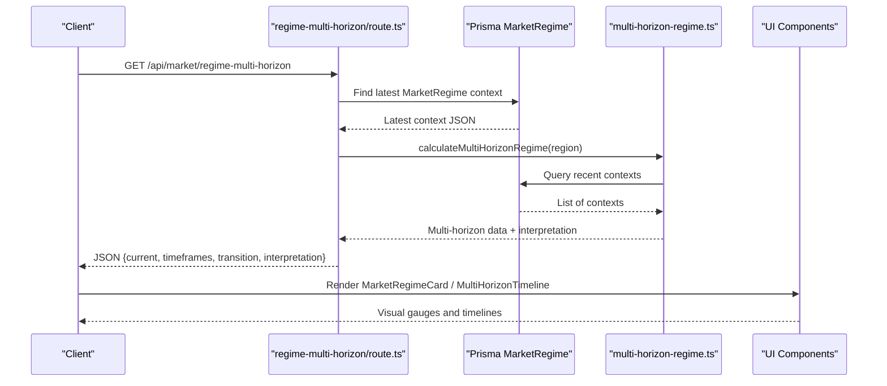
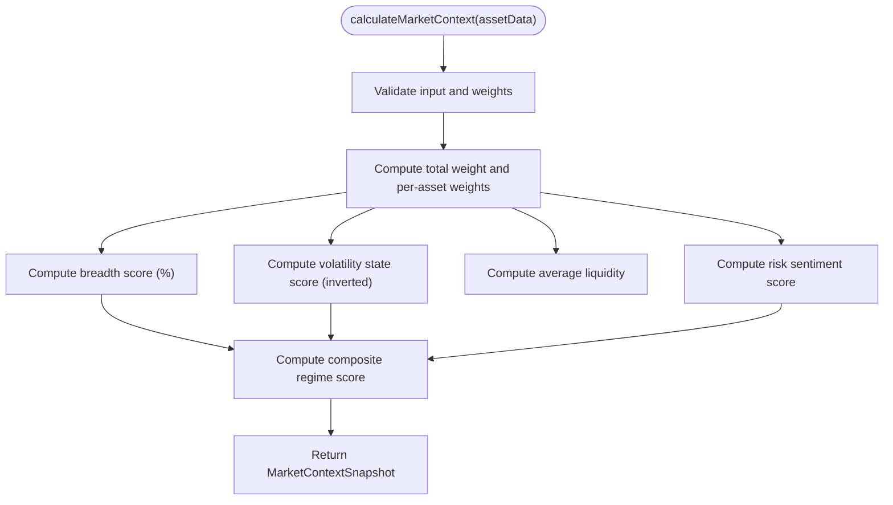
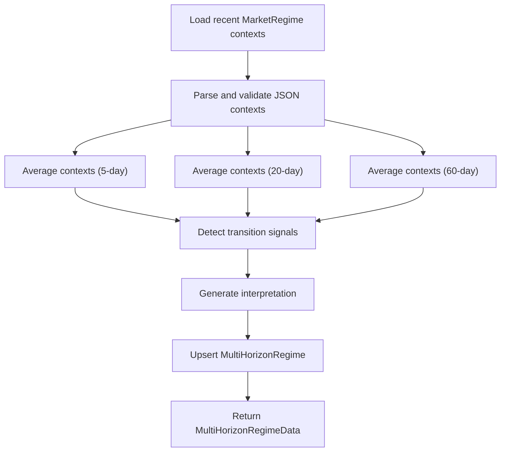
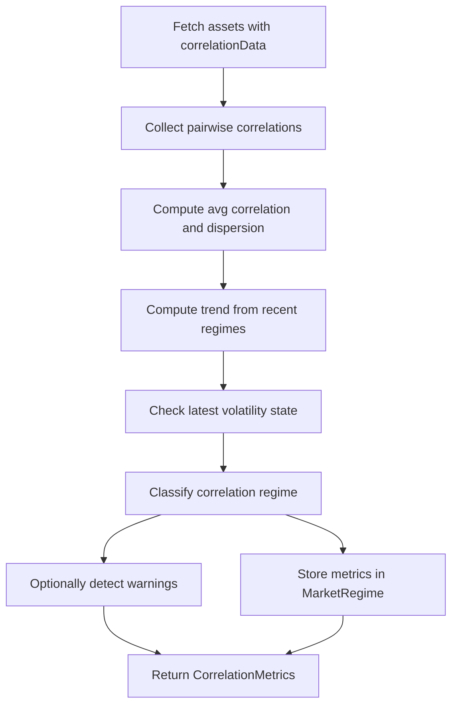
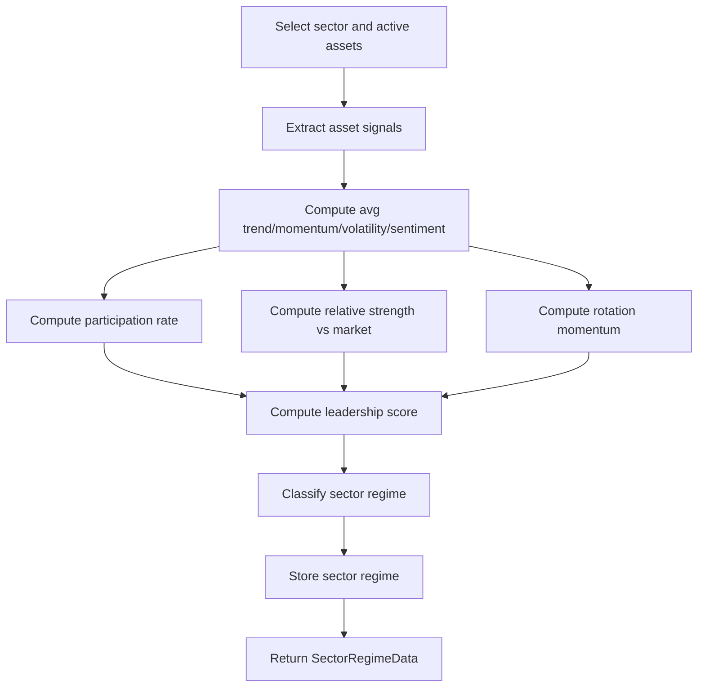
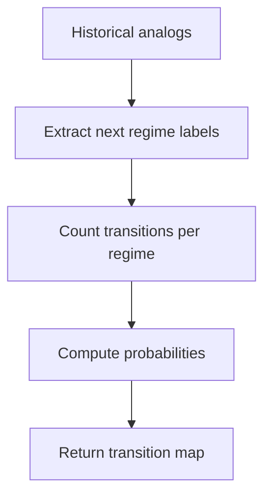
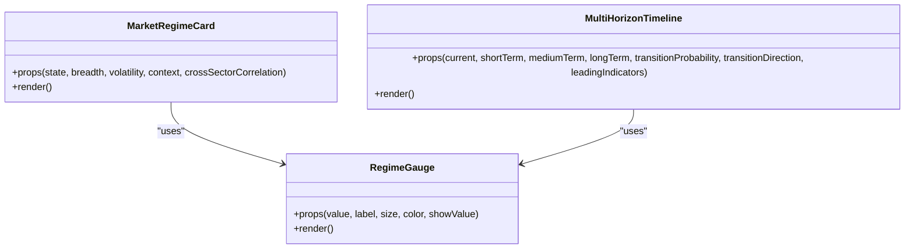
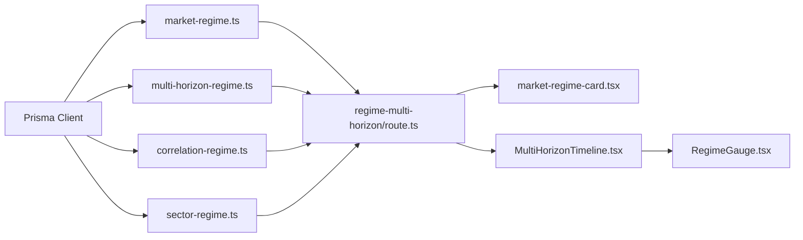

# Market Regime Detection

<cite>
**Referenced Files in This Document**
- [market-regime.ts](file://src/lib/engines/market-regime.ts)
- [multi-horizon-regime.ts](file://src/lib/engines/multi-horizon-regime.ts)
- [regime-transition.ts](file://src/lib/engines/regime-transition.ts)
- [correlation-regime.ts](file://src/lib/engines/correlation-regime.ts)
- [sector-regime.ts](file://src/lib/engines/sector-regime.ts)
- [route.ts](file://src/app/api/market/regime-multi-horizon/route.ts)
- [market-regime-card.tsx](file://src/components/dashboard/market-regime-card.tsx)
- [MultiHorizonTimeline.tsx](file://src/components/ui/MultiHorizonTimeline.tsx)
- [RegimeGauge.tsx](file://src/components/ui/RegimeGauge.tsx)
- [regime-transition.test.ts](file://src/lib/engines/__tests__/regime-transition.test.ts)
</cite>

## Table of Contents
1. [Introduction](#introduction)
2. [Project Structure](#project-structure)
3. [Core Components](#core-components)
4. [Architecture Overview](#architecture-overview)
5. [Detailed Component Analysis](#detailed-component-analysis)
6. [Dependency Analysis](#dependency-analysis)
7. [Performance Considerations](#performance-considerations)
8. [Troubleshooting Guide](#troubleshooting-guide)
9. [Conclusion](#conclusion)
10. [Appendices](#appendices)

## Introduction
This document describes the Market Regime Detection system that performs multi-horizon regime analysis and market state classification. It documents the regime detection algorithms for breadth scores, volatility measurements, correlation analysis, and liquidity assessments, along with integration points to market data providers, real-time regime updates, and historical tracking. It also covers visualization components, multi-timeframe analysis, and regime transition probability calculations, and provides practical examples of regime interpretation, market timing signals, and portfolio positioning strategies.

## Project Structure
The Market Regime system is implemented primarily in the engines layer and surfaced via API endpoints and UI components:
- Engines: core algorithms for market context, multi-horizon analysis, correlation regime, sector regime, and transition probability estimation
- API: endpoint to serve multi-horizon regime data enriched from historical context
- UI: visualization components for regime gauges, timelines, and cards

```mermaid
graph TB
subgraph "Engines"
MR["market-regime.ts"]
MHR["multi-horizon-regime.ts"]
CR["correlation-regime.ts"]
SR["sector-regime.ts"]
RT["regime-transition.ts"]
end
subgraph "API"
API["regime-multi-horizon/route.ts"]
end
subgraph "UI"
CARD["market-regime-card.tsx"]
TL["MultiHorizonTimeline.tsx"]
GAUGE["RegimeGauge.tsx"]
end
MR --> API
MHR --> API
CR --> API
SR --> API
RT --> API
API --> CARD
API --> TL
TL --> GAUGE
```

**Diagram sources**
- [market-regime.ts:116-276](file://src/lib/engines/market-regime.ts#L116-L276)
- [multi-horizon-regime.ts:49-129](file://src/lib/engines/multi-horizon-regime.ts#L49-L129)
- [correlation-regime.ts:44-200](file://src/lib/engines/correlation-regime.ts#L44-L200)
- [sector-regime.ts:29-161](file://src/lib/engines/sector-regime.ts#L29-L161)
- [regime-transition.ts:7-28](file://src/lib/engines/regime-transition.ts#L7-L28)
- [route.ts:14-76](file://src/app/api/market/regime-multi-horizon/route.ts#L14-L76)
- [market-regime-card.tsx:16-239](file://src/components/dashboard/market-regime-card.tsx#L16-L239)
- [MultiHorizonTimeline.tsx:33-359](file://src/components/ui/MultiHorizonTimeline.tsx#L33-L359)
- [RegimeGauge.tsx:16-120](file://src/components/ui/RegimeGauge.tsx#L16-L120)

**Section sources**
- [market-regime.ts:1-276](file://src/lib/engines/market-regime.ts#L1-L276)
- [multi-horizon-regime.ts:1-475](file://src/lib/engines/multi-horizon-regime.ts#L1-L475)
- [correlation-regime.ts:1-365](file://src/lib/engines/correlation-regime.ts#L1-L365)
- [sector-regime.ts:1-514](file://src/lib/engines/sector-regime.ts#L1-L514)
- [regime-transition.ts:1-29](file://src/lib/engines/regime-transition.ts#L1-L29)
- [route.ts:1-77](file://src/app/api/market/regime-multi-horizon/route.ts#L1-L77)
- [market-regime-card.tsx:1-239](file://src/components/dashboard/market-regime-card.tsx#L1-L239)
- [MultiHorizonTimeline.tsx:1-359](file://src/components/ui/MultiHorizonTimeline.tsx#L1-L359)
- [RegimeGauge.tsx:1-120](file://src/components/ui/RegimeGauge.tsx#L1-L120)

## Core Components
- Market Context Engine: computes a five-dimensional market context snapshot (regime, risk sentiment, volatility, breadth, liquidity) from asset-level signals and weights
- Multi-Horizon Regime Engine: aggregates historical contexts into short-, medium-, and long-term averages and detects transition signals with probability and leading indicators
- Correlation Regime Engine: measures cross-asset correlation to detect systemic stress, macro-driven, idiosyncratic, and transitioning environments
- Sector Regime Engine: computes sector-level participation, relative strength, rotation momentum, and leadership to identify rotation opportunities
- Regime Transition Probability: estimates transition probabilities from historical analogs
- API Endpoint: serves current context and multi-horizon enrichment with caching and fallbacks
- Visualization Components: regime cards, gauges, and timelines for intuitive interpretation

**Section sources**
- [market-regime.ts:116-276](file://src/lib/engines/market-regime.ts#L116-L276)
- [multi-horizon-regime.ts:49-129](file://src/lib/engines/multi-horizon-regime.ts#L49-L129)
- [correlation-regime.ts:44-200](file://src/lib/engines/correlation-regime.ts#L44-L200)
- [sector-regime.ts:29-161](file://src/lib/engines/sector-regime.ts#L29-L161)
- [regime-transition.ts:7-28](file://src/lib/engines/regime-transition.ts#L7-L28)
- [route.ts:14-76](file://src/app/api/market/regime-multi-horizon/route.ts#L14-L76)
- [market-regime-card.tsx:16-239](file://src/components/dashboard/market-regime-card.tsx#L16-L239)
- [MultiHorizonTimeline.tsx:33-359](file://src/components/ui/MultiHorizonTimeline.tsx#L33-L359)
- [RegimeGauge.tsx:16-120](file://src/components/ui/RegimeGauge.tsx#L16-L120)

## Architecture Overview
The system integrates engines with the API and UI layers. The API endpoint reads the latest market context from the database, optionally enriches it with multi-horizon analysis, and returns a unified payload. The UI renders gauges, timelines, and cards to visualize regime states and transition risks.



**Diagram sources**
- [route.ts:14-76](file://src/app/api/market/regime-multi-horizon/route.ts#L14-L76)
- [multi-horizon-regime.ts:49-129](file://src/lib/engines/multi-horizon-regime.ts#L49-L129)
- [market-regime-card.tsx:16-239](file://src/components/dashboard/market-regime-card.tsx#L16-L239)
- [MultiHorizonTimeline.tsx:33-359](file://src/components/ui/MultiHorizonTimeline.tsx#L33-L359)

## Detailed Component Analysis

### Market Context Engine
Computes a MarketContextSnapshot from weighted asset-level signals:
- Breadth score: percentage of assets with positive trend
- Volatility state: inverted average volatility (higher score = more suppressed/stable)
- Liquidity condition: average liquidity across assets
- Risk sentiment: composite of sentiment and high-momentum participation
- Regime score: weighted combination of breadth, volatility, and risk

Key behaviors:
- Weighted averaging with robust fallbacks
- Confidence scoring based on data availability
- In-memory caching with TTL and region-aware eviction



**Diagram sources**
- [market-regime.ts:116-276](file://src/lib/engines/market-regime.ts#L116-L276)

**Section sources**
- [market-regime.ts:116-276](file://src/lib/engines/market-regime.ts#L116-L276)

### Multi-Horizon Regime Engine
Generates multi-timeframe snapshots and transition signals:
- Reads recent MarketRegime rows and parses contexts
- Averages contexts for short-, medium-, and long-term windows
- Detects transition probability from divergence across dimensions
- Stores results via upsert keyed by date and region



**Diagram sources**
- [multi-horizon-regime.ts:49-129](file://src/lib/engines/multi-horizon-regime.ts#L49-L129)
- [multi-horizon-regime.ts:204-275](file://src/lib/engines/multi-horizon-regime.ts#L204-L275)

**Section sources**
- [multi-horizon-regime.ts:49-129](file://src/lib/engines/multi-horizon-regime.ts#L49-L129)
- [multi-horizon-regime.ts:204-275](file://src/lib/engines/multi-horizon-regime.ts#L204-L275)
- [multi-horizon-regime.ts:280-351](file://src/lib/engines/multi-horizon-regime.ts#L280-L351)
- [multi-horizon-regime.ts:431-473](file://src/lib/engines/multi-horizon-regime.ts#L431-L473)

### Correlation Regime Engine
Analyzes cross-asset correlations to infer macro-driven vs idiosyncratic environments:
- Computes average correlation and dispersion across pairwise correlations
- Detects trend from recent historical regimes
- Flags systemic stress when correlation and volatility are both elevated
- Provides sector correlation scores and warnings for extreme conditions



**Diagram sources**
- [correlation-regime.ts:44-200](file://src/lib/engines/correlation-regime.ts#L44-L200)
- [correlation-regime.ts:264-302](file://src/lib/engines/correlation-regime.ts#L264-L302)

**Section sources**
- [correlation-regime.ts:44-200](file://src/lib/engines/correlation-regime.ts#L44-L200)
- [correlation-regime.ts:264-302](file://src/lib/engines/correlation-regime.ts#L264-L302)
- [correlation-regime.ts:307-323](file://src/lib/engines/correlation-regime.ts#L307-L323)

### Sector Regime Engine
Computes sector-level metrics and rotation opportunities:
- Aggregates asset signals within sectors to compute participation, relative strength, rotation momentum, and leadership
- Classifies sector regime using weighted scores
- Supports cross-sector correlation analysis from return series to detect macro-driven vs sector-specific regimes



**Diagram sources**
- [sector-regime.ts:29-161](file://src/lib/engines/sector-regime.ts#L29-L161)
- [sector-regime.ts:299-513](file://src/lib/engines/sector-regime.ts#L299-L513)

**Section sources**
- [sector-regime.ts:29-161](file://src/lib/engines/sector-regime.ts#L29-L161)
- [sector-regime.ts:299-513](file://src/lib/engines/sector-regime.ts#L299-L513)

### Regime Transition Probability
Estimates transition probabilities from historical analogs:
- Counts transitions to each regime and normalizes by total analogs
- Returns a mapping of transition strings to probabilities



**Diagram sources**
- [regime-transition.ts:7-28](file://src/lib/engines/regime-transition.ts#L7-L28)

**Section sources**
- [regime-transition.ts:7-28](file://src/lib/engines/regime-transition.ts#L7-L28)
- [regime-transition.test.ts:5-25](file://src/lib/engines/__tests__/regime-transition.test.ts#L5-L25)

### Visualization Components
- MarketRegimeCard: displays regime state, breadth, volatility, optional cross-sector correlation, and contextual interpretation
- RegimeGauge: animated radial gauge rendering regime scores
- MultiHorizonTimeline: timeline of current and multi-horizon regimes with sparklines, alignment heatmap, transition probability, and leading indicators



**Diagram sources**
- [market-regime-card.tsx:16-239](file://src/components/dashboard/market-regime-card.tsx#L16-L239)
- [RegimeGauge.tsx:16-120](file://src/components/ui/RegimeGauge.tsx#L16-L120)
- [MultiHorizonTimeline.tsx:33-359](file://src/components/ui/MultiHorizonTimeline.tsx#L33-L359)

**Section sources**
- [market-regime-card.tsx:16-239](file://src/components/dashboard/market-regime-card.tsx#L16-L239)
- [RegimeGauge.tsx:16-120](file://src/components/ui/RegimeGauge.tsx#L16-L120)
- [MultiHorizonTimeline.tsx:33-359](file://src/components/ui/MultiHorizonTimeline.tsx#L33-L359)

## Dependency Analysis
- Engines depend on Prisma for persistence and on each other for derived insights (e.g., multi-horizon uses market context snapshots)
- API depends on engines and Prisma to assemble responses
- UI components depend on engine types and renderers for visualization



**Diagram sources**
- [market-regime.ts:58-98](file://src/lib/engines/market-regime.ts#L58-L98)
- [multi-horizon-regime.ts:8-34](file://src/lib/engines/multi-horizon-regime.ts#L8-L34)
- [correlation-regime.ts:6-10](file://src/lib/engines/correlation-regime.ts#L6-L10)
- [sector-regime.ts:6-12](file://src/lib/engines/sector-regime.ts#L6-L12)
- [route.ts:1-11](file://src/app/api/market/regime-multi-horizon/route.ts#L1-L11)

**Section sources**
- [market-regime.ts:58-98](file://src/lib/engines/market-regime.ts#L58-L98)
- [multi-horizon-regime.ts:8-34](file://src/lib/engines/multi-horizon-regime.ts#L8-L34)
- [correlation-regime.ts:6-10](file://src/lib/engines/correlation-regime.ts#L6-L10)
- [sector-regime.ts:6-12](file://src/lib/engines/sector-regime.ts#L6-L12)
- [route.ts:1-11](file://src/app/api/market/regime-multi-horizon/route.ts#L1-L11)

## Performance Considerations
- Context caching: Market context snapshots are cached in memory with TTL and region-aware eviction to reduce DB load and JSON parsing overhead
- Multi-horizon averaging: Efficient aggregation over recent contexts with graceful degradation when insufficient data is present
- Correlation caching: Global correlation metrics are cached with a one-hour TTL to avoid repeated computation
- UI memoization: Timeline and gauge components are memoized to prevent unnecessary re-renders
- Database queries: Selective fetching of required fields and capped lookback windows minimize IO

**Section sources**
- [market-regime.ts:50-98](file://src/lib/engines/market-regime.ts#L50-L98)
- [multi-horizon-regime.ts:134-199](file://src/lib/engines/multi-horizon-regime.ts#L134-L199)
- [correlation-regime.ts:35-52](file://src/lib/engines/correlation-regime.ts#L35-L52)
- [MultiHorizonTimeline.tsx:339-359](file://src/components/ui/MultiHorizonTimeline.tsx#L339-L359)
- [RegimeGauge.tsx:1-120](file://src/components/ui/RegimeGauge.tsx#L1-L120)

## Troubleshooting Guide
Common issues and remedies:
- Empty or invalid context JSON: API returns a message indicating awaiting data; ensure MarketRegime context is populated
- Parsing failures: Engine logs and sanitized errors indicate JSON parse failures; verify context structure and encoding
- Insufficient historical data: Multi-horizon engine returns null when fewer than minimum contexts are available; backfill historical regimes
- Cache inconsistencies: Use cache invalidation functions to refresh cached contexts when data changes
- Correlation data gaps: Correlation metrics fall back to baseline when insufficient assets or correlation data are present

**Section sources**
- [route.ts:28-41](file://src/app/api/market/regime-multi-horizon/route.ts#L28-L41)
- [multi-horizon-regime.ts:61-89](file://src/lib/engines/multi-horizon-regime.ts#L61-L89)
- [correlation-regime.ts:54-61](file://src/lib/engines/correlation-regime.ts#L54-L61)

## Conclusion
The Market Regime Detection system provides a robust, multi-dimensional view of market conditions through breadth, volatility, liquidity, and risk sentiment. It extends to multi-horizon analysis and transition probability estimation, and integrates correlation and sector-level insights. The API and UI components deliver real-time, region-aware regime updates with clear visualizations for interpretation and decision-making.

## Appendices

### Regime Interpretation Examples
- Strong Risk On: Broad participation with suppressed volatility; favorable for growth exposure
- Risk On: Positive trend structure with stable participation; balanced positioning
- Defensive: Narrowing breadth and cautious sentiment; rotate to defensive names
- Risk Off: Systemic trend breakdown with elevated stress; reduce risk exposure
- Transitioning: Structural divergence across timeframes; monitor leading indicators

**Section sources**
- [market-regime.ts:210-235](file://src/lib/engines/market-regime.ts#L210-L235)
- [multi-horizon-regime.ts:431-473](file://src/lib/engines/multi-horizon-regime.ts#L431-L473)

### Market Timing Signals and Positioning Strategies
- High transition probability toward Risk On: Consider increasing equity exposure and rotation into leading sectors
- High transition probability toward Risk Off: Reduce equity risk, hedge macro exposure, and increase cash
- Correlation approaching macro-driven: Focus on market timing; reduce sector concentration
- Sector leadership detected: Overweight leading sectors; monitor rotation momentum
- Idiosyncratic environment: Emphasize stock selection and sector diversification

**Section sources**
- [multi-horizon-regime.ts:431-473](file://src/lib/engines/multi-horizon-regime.ts#L431-L473)
- [sector-regime.ts:265-294](file://src/lib/engines/sector-regime.ts#L265-L294)
- [correlation-regime.ts:131-175](file://src/lib/engines/correlation-regime.ts#L131-L175)