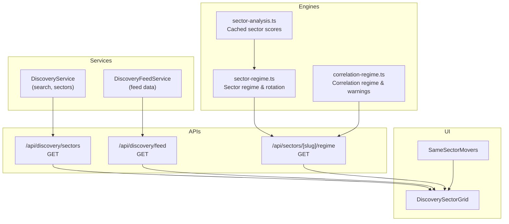
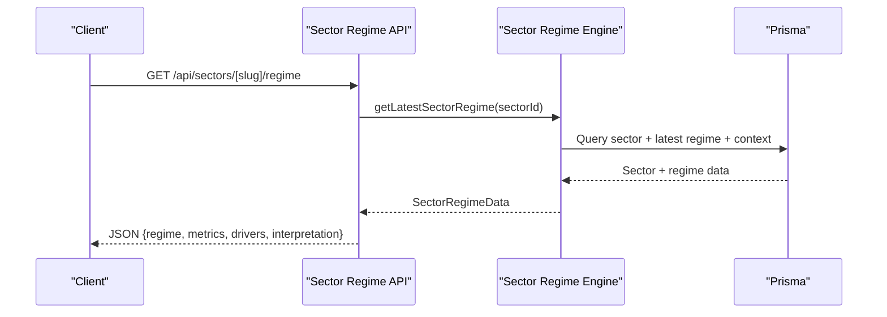
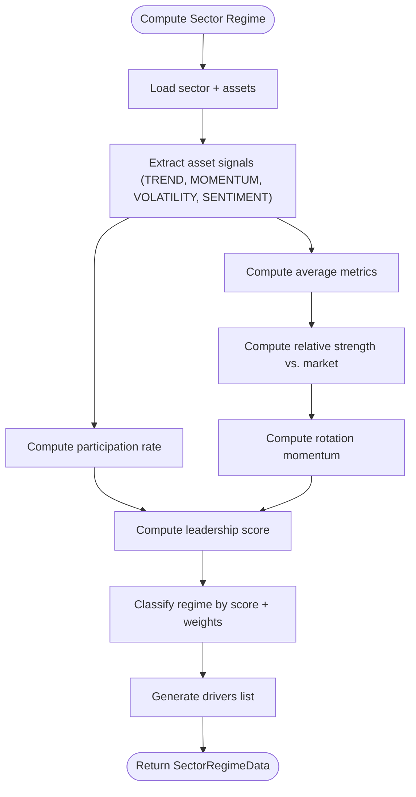
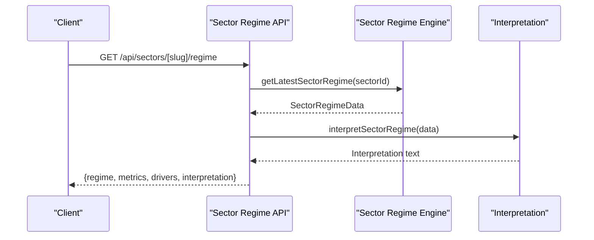
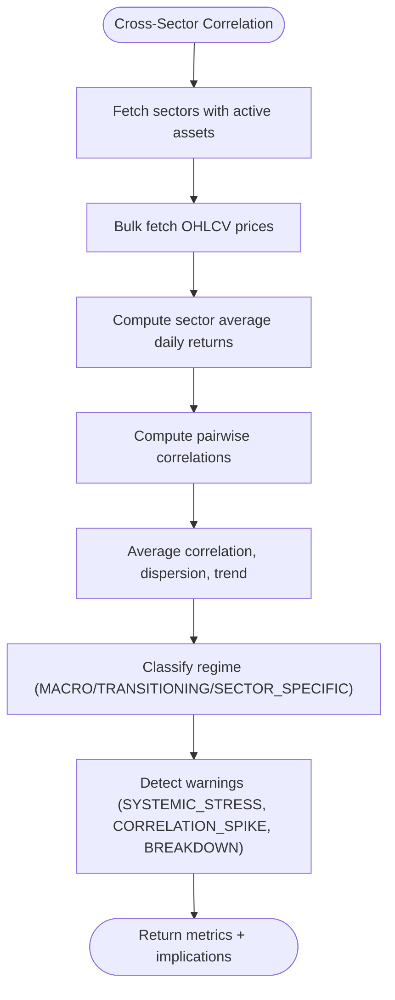
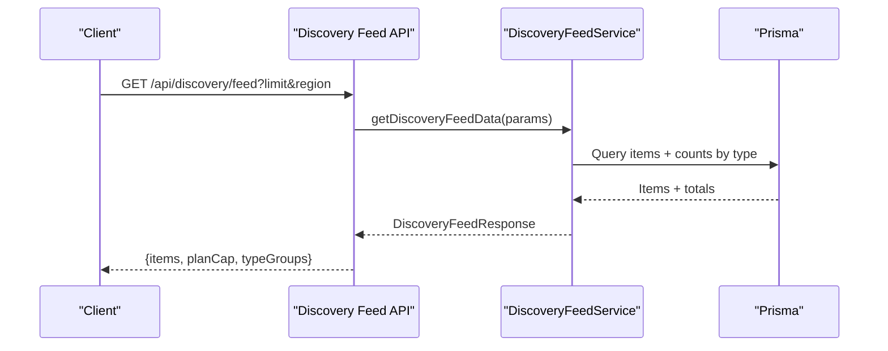
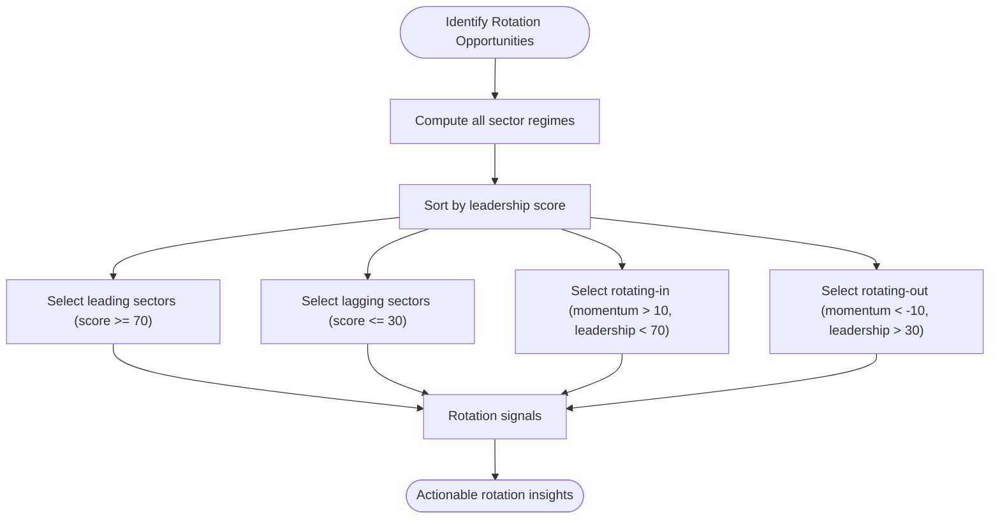
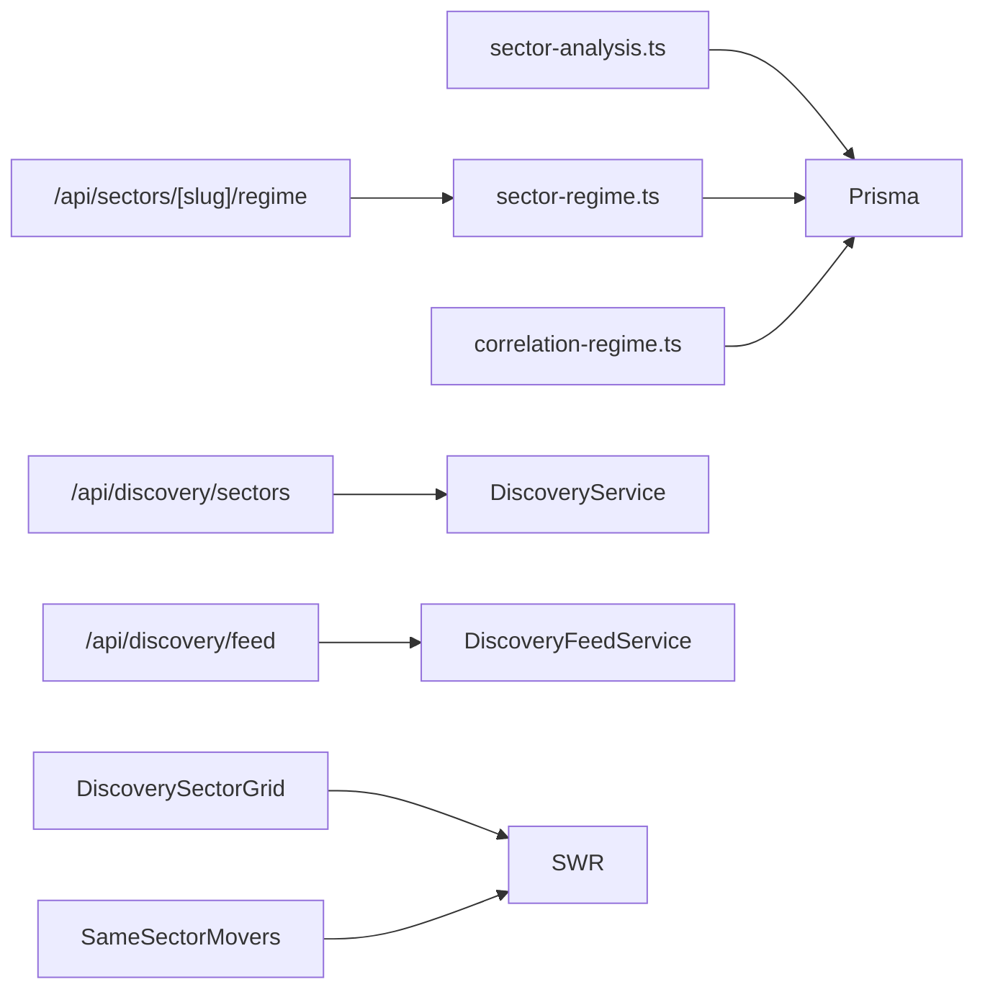

# Sector Analysis Tools

<cite>
**Referenced Files in This Document**
- [sector-analysis.ts](file://src/lib/engines/sector-analysis.ts)
- [sector-regime.ts](file://src/lib/engines/sector-regime.ts)
- [correlation-regime.ts](file://src/lib/engines/correlation-regime.ts)
- [route.ts](file://src/app/api/sectors/[slug]/regime/route.ts)
- [discovery-sector-grid.tsx](file://src/components/dashboard/discovery-sector-grid.tsx)
- [same-sector-movers.tsx](file://src/components/dashboard/same-sector-movers.tsx)
- [sector-playbooks.md](file://src/lib/ai/knowledge/sector-playbooks.md)
- [sector-rotation-basics.md](file://src/lib/learning/modules/intelligence/sector-rotation-basics.md)
- [route.ts](file://src/app/api/discovery/sectors/route.ts)
- [route.ts](file://src/app/api/discovery/feed/route.ts)
- [discovery-feed.service.ts](file://src/lib/services/discovery-feed.service.ts)
- [sector-grid.tsx](file://src/components/dashboard/discovery-sector-grid.tsx)
- [same-sector-movers.tsx](file://src/components/dashboard/same-sector-movers.tsx)
</cite>

## Table of Contents
1. [Introduction](#introduction)
2. [Project Structure](#project-structure)
3. [Core Components](#core-components)
4. [Architecture Overview](#architecture-overview)
5. [Detailed Component Analysis](#detailed-component-analysis)
6. [Dependency Analysis](#dependency-analysis)
7. [Performance Considerations](#performance-considerations)
8. [Troubleshooting Guide](#troubleshooting-guide)
9. [Conclusion](#conclusion)
10. [Appendices](#appendices)

## Introduction
This document describes the Sector Analysis Tools that power cross-sector performance analysis, comparative market intelligence, and actionable insights for traders and analysts. It covers the sector classification system, performance metrics computation, regime detection, correlation analysis, momentum tracking, discovery feeds, peer group analysis, and sector rotation signals. It also provides practical examples for sector allocation strategies, diversification insights, and sector-specific market timing signals grounded in the repository’s engines and UI components.

## Project Structure
The Sector Analysis Tools span backend engines, API endpoints, and frontend components:
- Engines: sector-level regime calculation, cross-sector correlation regime, and cached sector scoring
- APIs: sector regime endpoint and discovery endpoints for sectors and feeds
- UI: sector grid, same-sector movers, and related dashboards

**Diagram sources**
- [sector-analysis.ts:1-56](file://src/lib/engines/sector-analysis.ts#L1-L56)
- [sector-regime.ts:1-514](file://src/lib/engines/sector-regime.ts#L1-L514)
- [correlation-regime.ts:1-365](file://src/lib/engines/correlation-regime.ts#L1-L365)
- [route.ts:1-124](file://src/app/api/sectors/[slug]/regime/route.ts#L1-L124)
- [route.ts:1-43](file://src/app/api/discovery/sectors/route.ts#L1-L43)
- [route.ts:1-29](file://src/app/api/discovery/feed/route.ts#L1-L29)
- [discovery-feed.service.ts:72-147](file://src/lib/services/discovery-feed.service.ts#L72-L147)
- [discovery-sector-grid.tsx:1-304](file://src/components/dashboard/discovery-sector-grid.tsx#L1-L304)
- [same-sector-movers.tsx:1-115](file://src/components/dashboard/same-sector-movers.tsx#L1-L115)

**Section sources**
- [sector-analysis.ts:1-56](file://src/lib/engines/sector-analysis.ts#L1-L56)
- [sector-regime.ts:1-514](file://src/lib/engines/sector-regime.ts#L1-L514)
- [correlation-regime.ts:1-365](file://src/lib/engines/correlation-regime.ts#L1-L365)
- [route.ts:1-124](file://src/app/api/sectors/[slug]/regime/route.ts#L1-L124)
- [route.ts:1-43](file://src/app/api/discovery/sectors/route.ts#L1-L43)
- [route.ts:1-29](file://src/app/api/discovery/feed/route.ts#L1-L29)
- [discovery-feed.service.ts:72-147](file://src/lib/services/discovery-feed.service.ts#L72-L147)
- [discovery-sector-grid.tsx:1-304](file://src/components/dashboard/discovery-sector-grid.tsx#L1-L304)
- [same-sector-movers.tsx:1-115](file://src/components/dashboard/same-sector-movers.tsx#L1-L115)

## Core Components
- Sector Scoring Engine: Retrieves and caches sector-level asset scores (TREND, MOMENTUM, VOLATILITY, SENTIMENT, LIQUIDITY, TRUST) for analytics pages.
- Sector Regime Engine: Computes sector participation, relative strength vs. market, rotation momentum, leadership score, and classifies regime with drivers.
- Correlation Regime Engine: Analyzes cross-asset and cross-sector correlation to detect macro-driven, idiosyncratic, transitioning, or systemic stress regimes and emits warnings.
- Sector Discovery Feed: Provides curated signals and insights filtered by plan limits and region, enabling comparative market intelligence.
- Peer Group Analysis: Same-sector movers component surfaces peers for a given asset to support peer group analysis.
- Sector Grid UI: Visualizes sector regimes, scores, and key metrics for fast decision-making.

**Section sources**
- [sector-analysis.ts:11-56](file://src/lib/engines/sector-analysis.ts#L11-L56)
- [sector-regime.ts:29-161](file://src/lib/engines/sector-regime.ts#L29-L161)
- [correlation-regime.ts:44-200](file://src/lib/engines/correlation-regime.ts#L44-L200)
- [discovery-feed.service.ts:72-147](file://src/lib/services/discovery-feed.service.ts#L72-L147)
- [same-sector-movers.tsx:28-115](file://src/components/dashboard/same-sector-movers.tsx#L28-L115)
- [discovery-sector-grid.tsx:135-304](file://src/components/dashboard/discovery-sector-grid.tsx#L135-L304)

## Architecture Overview
The system integrates engines, APIs, services, and UI to deliver real-time sector intelligence:
- Engines compute metrics and store/update regime data.
- APIs expose sector regime and discovery endpoints with caching and rate limiting.
- Services handle feed composition, plan gating, and search.
- UI components render sector grids, movers, and related insights.

**Diagram sources**
- [route.ts:12-71](file://src/app/api/sectors/[slug]/regime/route.ts#L12-L71)
- [sector-regime.ts:230-261](file://src/lib/engines/sector-regime.ts#L230-L261)

**Section sources**
- [route.ts:12-71](file://src/app/api/sectors/[slug]/regime/route.ts#L12-L71)
- [sector-regime.ts:230-261](file://src/lib/engines/sector-regime.ts#L230-L261)

## Detailed Component Analysis

### Sector Classification System and Performance Metrics
- Sector classification: Based on regime score thresholds and weights for participation, volatility, and risk.
- Performance metrics:
  - Participation rate: % of assets in a sector trending up
  - Relative strength: sector average trend minus market average trend
  - Rotation momentum: deviation of average momentum from neutral
  - Leadership score: composite measure of participation, relative strength, and rotation momentum
- Drivers: Broad participation, out-/under-performance vs. market, leadership presence, and rotation momentum direction.

**Diagram sources**
- [sector-regime.ts:29-161](file://src/lib/engines/sector-regime.ts#L29-L161)

**Section sources**
- [sector-regime.ts:29-161](file://src/lib/engines/sector-regime.ts#L29-L161)

### Sector Regime Detection and Comparative Intelligence
- Regime classification: STRONG_RISK_ON, RISK_ON, DEFENSIVE, RISK_OFF, NEUTRAL
- Comparative intelligence: Relative strength and leadership score enable ranking and peer comparisons
- Human-readable interpretation: API endpoint composes a concise narrative from regime and metrics

**Diagram sources**
- [route.ts:76-123](file://src/app/api/sectors/[slug]/regime/route.ts#L76-L123)
- [sector-regime.ts:230-261](file://src/lib/engines/sector-regime.ts#L230-L261)

**Section sources**
- [route.ts:76-123](file://src/app/api/sectors/[slug]/regime/route.ts#L76-L123)
- [sector-regime.ts:230-261](file://src/lib/engines/sector-regime.ts#L230-L261)

### Cross-Sector Correlation Analysis and Macro Regime Detection
- Returns-based correlation: Computes sector average daily returns and pairwise Pearson correlations
- Trend detection: Compares early vs. late correlation windows to detect rising/falling trends
- Regime classification: MACRO_DRIVEN (high avg corr), TRANSITIONING (rising corr), SECTOR_SPECIFIC (low corr)
- Warnings: Detects systemic stress, correlation spikes, and breakdown conditions

**Diagram sources**
- [sector-regime.ts:349-513](file://src/lib/engines/sector-regime.ts#L349-L513)
- [correlation-regime.ts:264-302](file://src/lib/engines/correlation-regime.ts#L264-L302)

**Section sources**
- [sector-regime.ts:349-513](file://src/lib/engines/sector-regime.ts#L349-L513)
- [correlation-regime.ts:264-302](file://src/lib/engines/correlation-regime.ts#L264-L302)

### Sector-Specific Discovery Feeds and Peer Group Analysis
- Discovery feed: Curated items with DRS, archetypes, headlines, and scores; respects plan caps and region filtering
- Sector grid: Renders sector regimes, scores, participation, strength, momentum, leadership, and representative assets
- Same-sector movers: Lists peers for a given asset to support peer group analysis and rotation ideas

**Diagram sources**
- [route.ts:19-29](file://src/app/api/discovery/feed/route.ts#L19-L29)
- [discovery-feed.service.ts:72-147](file://src/lib/services/discovery-feed.service.ts#L72-L147)

**Section sources**
- [route.ts:19-29](file://src/app/api/discovery/feed/route.ts#L19-L29)
- [discovery-feed.service.ts:72-147](file://src/lib/services/discovery-feed.service.ts#L72-L147)
- [discovery-sector-grid.tsx:135-304](file://src/components/dashboard/discovery-sector-grid.tsx#L135-L304)
- [same-sector-movers.tsx:28-115](file://src/components/dashboard/same-sector-movers.tsx#L28-L115)

### Sector Rotation Signals and Strategies
- Rotation identification: Leading/lagging sectors and rotating-in/out based on leadership and rotation momentum thresholds
- Sector rotation basics: Understanding traditional rotation stages and interpreting the sector grid for emerging leaders and deteriorating sectors
- Sector playbooks: Sector-specific analytical frameworks to contextualize engine scores and performance

**Diagram sources**
- [sector-regime.ts:266-294](file://src/lib/engines/sector-regime.ts#L266-L294)
- [sector-rotation-basics.md:18-51](file://src/lib/learning/modules/intelligence/sector-rotation-basics.md#L18-L51)

**Section sources**
- [sector-regime.ts:266-294](file://src/lib/engines/sector-regime.ts#L266-L294)
- [sector-rotation-basics.md:18-51](file://src/lib/learning/modules/intelligence/sector-rotation-basics.md#L18-L51)

### Sector Allocation Strategies and Diversification Insights
- Sector allocation strategies: Use sector dispersion index and correlation regime to decide whether to overweight leaders or diversify across sectors
- Diversification insights: Segment portfolio by function (core/satellite/earning) and risk tier; account for regime sensitivity to tailor allocations

**Section sources**
- [sector-regime.ts:467-487](file://src/lib/engines/sector-regime.ts#L467-L487)
- [sector-playbooks.md:152-168](file://src/lib/ai/knowledge/sector-playbooks.md#L152-L168)

### Sector-Specific Market Timing Signals
- Timing context: Use correlation regime to understand whether timing matters more than sizing (macro-driven) or selection matters more (differentiated)
- Sector regime interpretation: Combine regime, participation, relative strength, and leadership to infer entry/exit cues

**Section sources**
- [correlation-regime.ts:264-302](file://src/lib/engines/correlation-regime.ts#L264-L302)
- [route.ts:76-123](file://src/app/api/sectors/[slug]/regime/route.ts#L76-L123)

## Dependency Analysis
The Sector Analysis Tools rely on:
- Prisma for sector, asset, price history, and regime data
- SWR for client-side caching and revalidation
- Rate limiting and plan gating for discovery endpoints
- Cache strategies for performance-sensitive computations

**Diagram sources**
- [sector-analysis.ts:1-56](file://src/lib/engines/sector-analysis.ts#L1-L56)
- [sector-regime.ts:1-514](file://src/lib/engines/sector-regime.ts#L1-L514)
- [correlation-regime.ts:1-365](file://src/lib/engines/correlation-regime.ts#L1-L365)
- [route.ts:1-124](file://src/app/api/sectors/[slug]/regime/route.ts#L1-L124)
- [route.ts:1-43](file://src/app/api/discovery/sectors/route.ts#L1-L43)
- [route.ts:1-29](file://src/app/api/discovery/feed/route.ts#L1-L29)
- [discovery-feed.service.ts:72-147](file://src/lib/services/discovery-feed.service.ts#L72-L147)
- [discovery-sector-grid.tsx:1-304](file://src/components/dashboard/discovery-sector-grid.tsx#L1-L304)
- [same-sector-movers.tsx:1-115](file://src/components/dashboard/same-sector-movers.tsx#L1-L115)

**Section sources**
- [sector-analysis.ts:1-56](file://src/lib/engines/sector-analysis.ts#L1-L56)
- [sector-regime.ts:1-514](file://src/lib/engines/sector-regime.ts#L1-L514)
- [correlation-regime.ts:1-365](file://src/lib/engines/correlation-regime.ts#L1-L365)
- [route.ts:1-124](file://src/app/api/sectors/[slug]/regime/route.ts#L1-L124)
- [route.ts:1-43](file://src/app/api/discovery/sectors/route.ts#L1-L43)
- [route.ts:1-29](file://src/app/api/discovery/feed/route.ts#L1-L29)
- [discovery-feed.service.ts:72-147](file://src/lib/services/discovery-feed.service.ts#L72-L147)
- [discovery-sector-grid.tsx:1-304](file://src/components/dashboard/discovery-sector-grid.tsx#L1-L304)
- [same-sector-movers.tsx:1-115](file://src/components/dashboard/same-sector-movers.tsx#L1-L115)

## Performance Considerations
- Caching: Sector scores use a 5-minute cache; correlation regime caches global metrics for 1 hour; discovery feed and sector grid use cache headers and plan caps
- Bulk data fetching: Engines fetch price history and asset scores in bulk to minimize round trips
- Asynchronous processing: Engines leverage Promise.all for concurrent calculations
- Client-side caching: SWR prevents redundant requests and enables background revalidation

[No sources needed since this section provides general guidance]

## Troubleshooting Guide
- Sector not found: API returns 404 when sector slug does not match a record
- Regime data unavailable: API returns 404 when no regime snapshot exists for the sector
- Cache invalidation: Sector grid and feed responses include cache headers; verify cache-control behavior in deployments
- Plan limits: Discovery feed respects plan caps; items may be redacted for locked content depending on plan tier
- Correlation regime warnings: Check for extremely high correlation or rising trends that may indicate systemic stress or transition

**Section sources**
- [route.ts:25-37](file://src/app/api/sectors/[slug]/regime/route.ts#L25-L37)
- [route.ts:19-29](file://src/app/api/discovery/feed/route.ts#L19-L29)
- [discovery-feed.service.ts:84-90](file://src/lib/services/discovery-feed.service.ts#L84-L90)
- [correlation-regime.ts:264-302](file://src/lib/engines/correlation-regime.ts#L264-L302)

## Conclusion
The Sector Analysis Tools integrate robust engines for sector regime detection, cross-sector correlation analysis, and comparative intelligence with performant APIs and UI components. They enable informed decisions around sector rotation, allocation, diversification, and timing by combining quantitative metrics with sector-specific context and plan-aware discovery feeds.

[No sources needed since this section summarizes without analyzing specific files]

## Appendices

### API Definitions
- Sector Regime Endpoint
  - Method: GET
  - Path: /api/sectors/[slug]/regime
  - Response fields: sector, regime, regimeScore, metrics, drivers, interpretation
  - Cache-Control: public, s-maxage=3600
- Discovery Sectors Endpoint
  - Method: GET
  - Path: /api/discovery/sectors
  - Query: region (optional)
  - Response: list of sectors with latest regime and counts
  - Cache-Control: public, s-maxage=3600, stale-while-revalidate=86400
- Discovery Feed Endpoint
  - Method: GET
  - Path: /api/discovery/feed
  - Query: type, region, limit, offset
  - Response: items, planCap, typeGroups
  - Rate-limited and plan-gated

**Section sources**
- [route.ts:12-71](file://src/app/api/sectors/[slug]/regime/route.ts#L12-L71)
- [route.ts:10-42](file://src/app/api/discovery/sectors/route.ts#L10-L42)
- [route.ts:19-29](file://src/app/api/discovery/feed/route.ts#L19-L29)
- [discovery-feed.service.ts:72-147](file://src/lib/services/discovery-feed.service.ts#L72-L147)