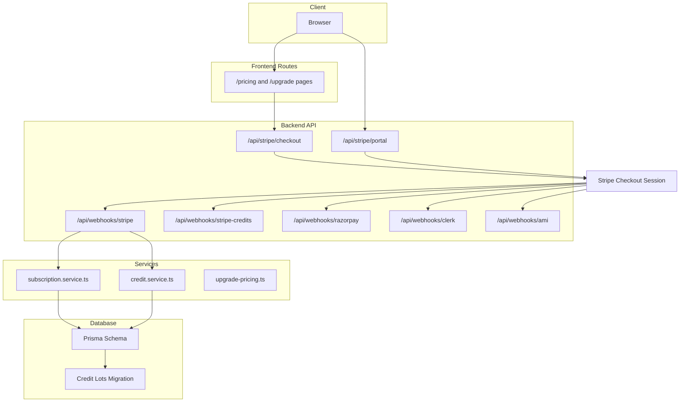
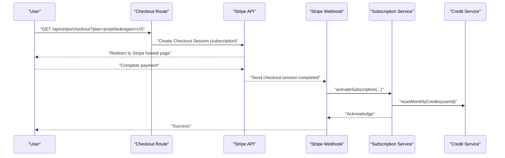
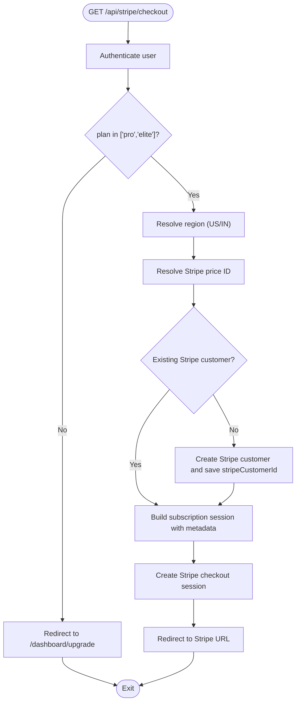
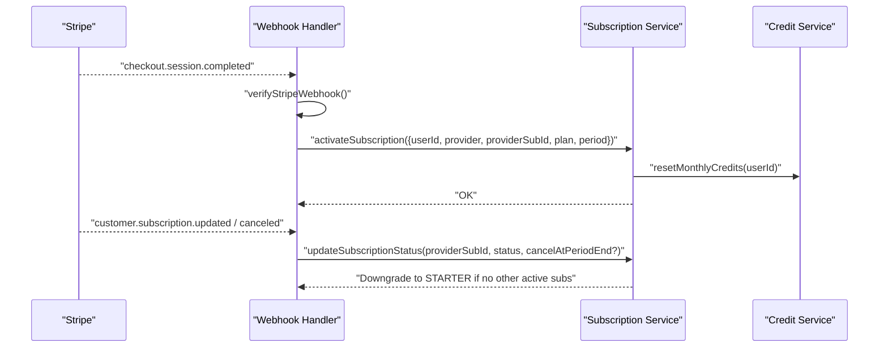
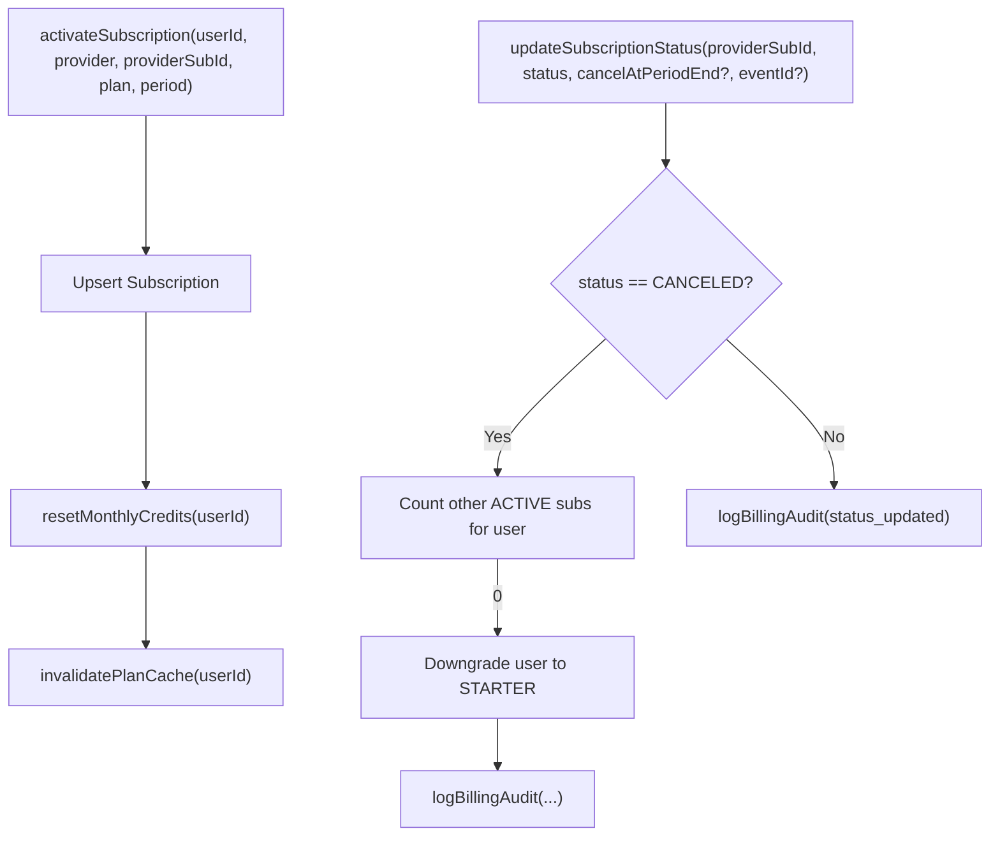
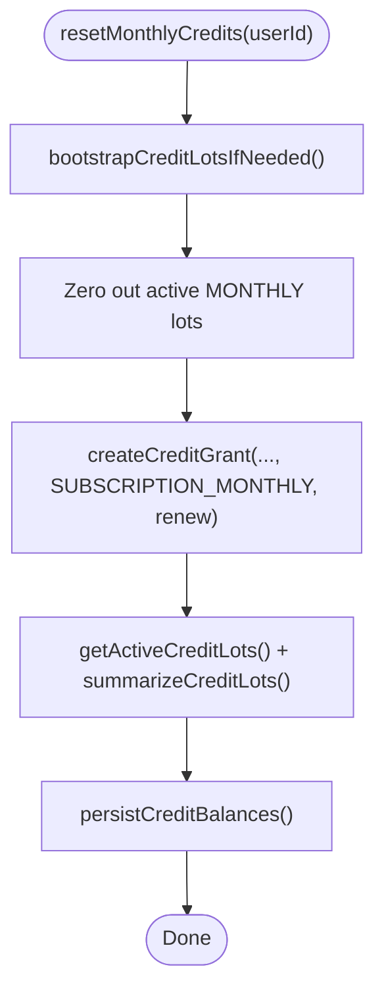
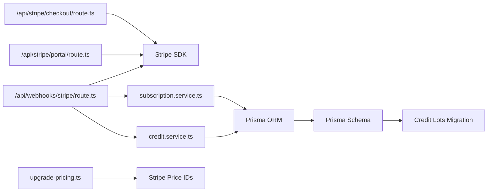

# Payment & Subscription System

<cite>
**Referenced Files in This Document**
- [route.ts](file://src/app/api/stripe/checkout/route.ts)
- [route.ts](file://src/app/api/stripe/portal/route.ts)
- [route.ts](file://src/app/api/webhooks/stripe/route.ts)
- [upgrade-pricing.ts](file://src/lib/billing/upgrade-pricing.ts)
- [subscription.service.ts](file://src/lib/services/subscription.service.ts)
- [credit.service.ts](file://src/lib/services/credit.service.ts)
- [schema.prisma](file://prisma/schema.prisma)
- [migration.sql](file://prisma/migrations/20260317210000_credit_lots/migration.sql)
- [migration.sql](file://prisma/migrations/20260220005734_add_stripe_price_id_to_credit_package/migration.sql)
- [route.ts](file://src/app/api/stripe/checkout/credits/route.ts)
- [route.ts](file://src/app/api/user/credits/balance/route.ts)
- [route.ts](file://src/app/api/user/credits/purchase/route.ts)
- [route.ts](file://src/app/api/credits/explore/route.ts)
- [route.ts](file://src/app/api/admin/credits/route.ts)
- [route.ts](file://src/app/api/admin/credits/bulk-award/route.ts)
- [route.ts](file://src/app/api/cron/reset-credits/route.ts)
- [route.ts](file://src/app/api/cron/expire-trials/route.ts)
- [page.tsx](file://src/app/admin/credits/page.tsx)
- [route.ts](file://src/app/api/webhooks/stripe-credits/route.ts)
- [route.ts](file://src/app/api/webhooks/razorpay/route.ts)
- [route.ts](file://src/app/api/webhooks/clerk/route.ts)
- [route.ts](file://src/app/api/webhooks/ami/route.ts)
- [route.ts](file://src/app/api/webhooks/stripe/route.test.ts)
- [route.ts](file://src/app/api/cron/cache-stats/route.ts)
- [route.ts](file://src/app/api/cron/daily-briefing/route.ts)
- [route.ts](file://src/app/api/cron/news-sync/route.ts)
- [route.ts](file://src/app/api/cron/portfolio-health/route.ts)
- [route.ts](file://src/app/api/cron/reengagement/route.ts)
- [route.ts](file://src/app/api/cron/support-retention/route.ts)
- [route.ts](file://src/app/api/cron/trending-questions/route.ts)
- [route.ts](file://src/app/api/cron/us-eod-crypto-sync/route.ts)
- [route.ts](file://src/app/api/cron/weekly-report/route.ts)
</cite>

## Table of Contents
1. [Introduction](#introduction)
2. [Project Structure](#project-structure)
3. [Core Components](#core-components)
4. [Architecture Overview](#architecture-overview)
5. [Detailed Component Analysis](#detailed-component-analysis)
6. [Dependency Analysis](#dependency-analysis)
7. [Performance Considerations](#performance-considerations)
8. [Troubleshooting Guide](#troubleshooting-guide)
9. [Conclusion](#conclusion)
10. [Appendices](#appendices)

## Introduction
This document describes the Payment & Subscription System, focusing on Stripe integration, subscription lifecycle management, credit-based access control, tiered pricing plans, billing cycles, payment processing, refunds, analytics, credit wallet management, usage-based billing, and premium feature gating. It synthesizes backend APIs, webhooks, cron jobs, and database models to present a complete picture of how payments and credits are handled end-to-end.

## Project Structure
The payment system spans several backend routes and services:
- Stripe checkout and billing portal endpoints
- Stripe webhook handlers for events like checkout.session.completed and subscription lifecycle events
- Subscription management service orchestrating plan activation, status updates, and analytics logging
- Credit service managing credit buckets, expirations, grants, resets, and usage ordering
- Database schema and migrations supporting subscriptions, credit transactions/lots, and credit packages
- Cron jobs for periodic credit resets and trial expirations
- Razorpay webhook for alternate payment provider
- Clerk and AMI webhooks for identity and engine integrations

**Diagram sources**
- [route.ts:1-108](file://src/app/api/stripe/checkout/route.ts#L1-L108)
- [route.ts:1-48](file://src/app/api/stripe/portal/route.ts#L1-L48)
- [route.ts:123-139](file://src/app/api/webhooks/stripe/route.ts#L123-L139)
- [route.ts](file://src/app/api/webhooks/stripe-credits/route.ts)
- [route.ts](file://src/app/api/webhooks/razorpay/route.ts)
- [route.ts](file://src/app/api/webhooks/clerk/route.ts)
- [route.ts](file://src/app/api/webhooks/ami/route.ts)
- [subscription.service.ts:151-224](file://src/lib/services/subscription.service.ts#L151-L224)
- [credit.service.ts:407-454](file://src/lib/services/credit.service.ts#L407-L454)
- [upgrade-pricing.ts:1-73](file://src/lib/billing/upgrade-pricing.ts#L1-L73)
- [schema.prisma:1-200](file://prisma/schema.prisma#L1-L200)
- [migration.sql:1-120](file://prisma/migrations/20260317210000_credit_lots/migration.sql#L1-L120)

**Section sources**
- [route.ts:1-108](file://src/app/api/stripe/checkout/route.ts#L1-L108)
- [route.ts:1-48](file://src/app/api/stripe/portal/route.ts#L1-L48)
- [route.ts:123-139](file://src/app/api/webhooks/stripe/route.ts#L123-L139)
- [subscription.service.ts:151-224](file://src/lib/services/subscription.service.ts#L151-L224)
- [credit.service.ts:407-454](file://src/lib/services/credit.service.ts#L407-L454)
- [upgrade-pricing.ts:1-73](file://src/lib/billing/upgrade-pricing.ts#L1-L73)
- [schema.prisma:1-200](file://prisma/schema.prisma#L1-L200)
- [migration.sql:1-120](file://prisma/migrations/20260317210000_credit_lots/migration.sql#L1-L120)

## Core Components
- Stripe checkout endpoint creates subscription sessions, persists customer IDs, and redirects to Stripe-hosted checkout.
- Stripe billing portal endpoint generates customer portal sessions for self-service management.
- Stripe webhook handler verifies signatures, processes checkout.session.completed to activate subscriptions, and handles subscription status changes.
- Subscription service manages plan activation, monthly credit resets, status transitions, downgrade logic, and billing audit logs.
- Credit service defines credit buckets (monthly, bonus, purchased), expiration policies, grant/reset logic, and usage ordering.
- Pricing module resolves localized prices and Stripe price IDs for plans and credit packs.
- Database schema and migrations define subscriptions, credit transactions/lots, and credit packages with Stripe price IDs.

**Section sources**
- [route.ts:19-107](file://src/app/api/stripe/checkout/route.ts#L19-L107)
- [route.ts:18-47](file://src/app/api/stripe/portal/route.ts#L18-L47)
- [route.ts:123-139](file://src/app/api/webhooks/stripe/route.ts#L123-L139)
- [subscription.service.ts:151-224](file://src/lib/services/subscription.service.ts#L151-L224)
- [credit.service.ts:407-454](file://src/lib/services/credit.service.ts#L407-L454)
- [upgrade-pricing.ts:20-72](file://src/lib/billing/upgrade-pricing.ts#L20-L72)
- [schema.prisma:1-200](file://prisma/schema.prisma#L1-L200)
- [migration.sql:1-120](file://prisma/migrations/20260317210000_credit_lots/migration.sql#L1-L120)

## Architecture Overview
The system integrates Stripe for recurring billing and customer portals, with webhooks driving subscription activation and status updates. Credits are managed separately via a bucketed ledger with expirations and resets aligned to billing cycles. Razorpay and Clerk/AMI webhooks support alternate payment methods and identity/engine integrations.

**Diagram sources**
- [route.ts:19-107](file://src/app/api/stripe/checkout/route.ts#L19-L107)
- [route.ts:123-139](file://src/app/api/webhooks/stripe/route.ts#L123-L139)
- [subscription.service.ts:151-161](file://src/lib/services/subscription.service.ts#L151-L161)
- [credit.service.ts:407-431](file://src/lib/services/credit.service.ts#L407-L431)

## Detailed Component Analysis

### Stripe Checkout Integration
- Validates user, constructs Stripe customer if needed, and creates a subscription-mode checkout session with promotion codes enabled.
- Persists Stripe customer ID to the user record for reliable webhook linking.
- Redirects to Stripe-hosted checkout and logs outcomes.

**Diagram sources**
- [route.ts:19-107](file://src/app/api/stripe/checkout/route.ts#L19-L107)

**Section sources**
- [route.ts:19-107](file://src/app/api/stripe/checkout/route.ts#L19-L107)

### Stripe Billing Portal
- Generates a billing portal session for the authenticated user’s Stripe customer, returning a session URL for self-service management.

**Section sources**
- [route.ts:18-47](file://src/app/api/stripe/portal/route.ts#L18-L47)

### Stripe Webhooks: Subscription Lifecycle
- Verifies webhook signatures and processes checkout.session.completed to activate subscriptions.
- Extracts plan from Stripe price ID, computes period bounds, and persists subscription state.
- Handles subscription status updates and cancellation with downgrade logic.

**Diagram sources**
- [route.ts:123-139](file://src/app/api/webhooks/stripe/route.ts#L123-L139)
- [route.ts:100-121](file://src/app/api/webhooks/stripe/route.ts#L100-L121)
- [subscription.service.ts:163-224](file://src/lib/services/subscription.service.ts#L163-L224)
- [credit.service.ts:407-431](file://src/lib/services/credit.service.ts#L407-L431)

**Section sources**
- [route.ts:123-139](file://src/app/api/webhooks/stripe/route.ts#L123-L139)
- [subscription.service.ts:163-224](file://src/lib/services/subscription.service.ts#L163-L224)

### Subscription Management Service
- Activates subscriptions with provider metadata and billing periods.
- Resets monthly credits upon activation and invalidates plan caches.
- Updates subscription status, enforces cancellations, and downgrades users when appropriate.
- Logs billing audit events for tracking.

**Diagram sources**
- [subscription.service.ts:151-161](file://src/lib/services/subscription.service.ts#L151-L161)
- [subscription.service.ts:163-224](file://src/lib/services/subscription.service.ts#L163-L224)

**Section sources**
- [subscription.service.ts:151-161](file://src/lib/services/subscription.service.ts#L151-L161)
- [subscription.service.ts:163-224](file://src/lib/services/subscription.service.ts#L163-L224)

### Credit Wallet Management
- Buckets: monthly (renewed), bonus (3-month expiry), purchased (1-year expiry).
- Expiration policy and bucket assignment per transaction type.
- Credit lot sorting prioritizes monthly > bonus > purchased and considers expiry/creation time.
- Monthly credit reset renews the plan’s base allocation and recalculates balances.

**Diagram sources**
- [credit.service.ts:407-431](file://src/lib/services/credit.service.ts#L407-L431)

**Section sources**
- [credit.service.ts:50-141](file://src/lib/services/credit.service.ts#L50-L141)
- [credit.service.ts:407-454](file://src/lib/services/credit.service.ts#L407-L454)
- [migration.sql:1-120](file://prisma/migrations/20260317210000_credit_lots/migration.sql#L1-L120)

### Tiered Pricing Plans and Credit Packages
- Pricing module resolves localized plan prices and Stripe price IDs for “pro” and “elite”.
- Credit packages include a Stripe price ID column for direct credit purchases.
- Credit pack pricing resolution supports region-aware keys and fallbacks.

**Section sources**
- [upgrade-pricing.ts:5-31](file://src/lib/billing/upgrade-pricing.ts#L5-L31)
- [migration.sql:1-11](file://prisma/migrations/20260220005734_add_stripe_price_id_to_credit_package/migration.sql#L1-L11)

### Credit Purchase and Usage Workflows
- Credit purchase via Stripe checkout with dedicated credits endpoint.
- Credit balance and usage endpoints expose user credit state.
- Explore and admin endpoints manage credit packages and bulk awards.

**Section sources**
- [route.ts](file://src/app/api/stripe/checkout/credits/route.ts)
- [route.ts](file://src/app/api/user/credits/balance/route.ts)
- [route.ts](file://src/app/api/user/credits/purchase/route.ts)
- [route.ts](file://src/app/api/credits/explore/route.ts)
- [route.ts](file://src/app/api/admin/credits/route.ts)
- [route.ts](file://src/app/api/admin/credits/bulk-award/route.ts)

### Promotional Pricing and Coupons
- Stripe checkout enables promotion codes for plan purchases.
- Stripe webhook verifies signatures and processes completed sessions.

**Section sources**
- [route.ts:90-91](file://src/app/api/stripe/checkout/route.ts#L90-L91)
- [route.ts:134-139](file://src/app/api/webhooks/stripe/route.ts#L134-L139)

### Refund Handling
- Stripe refunds are handled by Stripe; the system listens for subscription events and maintains audit logs. Specific refund logic is not implemented in the referenced files.

**Section sources**
- [route.ts:123-139](file://src/app/api/webhooks/stripe/route.ts#L123-L139)

### Subscription Analytics
- Billing audit logs record subscription events and state changes for reporting and reconciliation.

**Section sources**
- [subscription.service.ts:190-221](file://src/lib/services/subscription.service.ts#L190-L221)

### Premium Feature Access Control
- Plan tiers are enforced via user plan field and plan cache invalidation after subscription changes.
- Premium features gated by plan tier are enforced at the application level using plan checks.

**Section sources**
- [subscription.service.ts:159-160](file://src/lib/services/subscription.service.ts#L159-L160)

### Usage-Based Billing
- Credit usage is tracked per query complexity; costs are uniform across tiers, while premium features differ by plan.
- Credit lot sorting ensures oldest/sooner-to-expire credits are consumed first.

**Section sources**
- [credit.service.ts:438-442](file://src/lib/services/credit.service.ts#L438-L442)
- [credit.service.ts:106-123](file://src/lib/services/credit.service.ts#L106-L123)

### Plan Upgrades and Downgrades
- Upgrades occur through Stripe checkout sessions for “pro” and “elite”.
- Downgrades are triggered when a user cancels their last active subscription.

**Section sources**
- [route.ts:37-39](file://src/app/api/stripe/checkout/route.ts#L37-L39)
- [subscription.service.ts:190-203](file://src/lib/services/subscription.service.ts#L190-L203)

### Billing Cycles and Renewals
- Monthly credit resets align with subscription billing periods.
- Subscription periods are derived from Stripe subscription objects and stored for audit.

**Section sources**
- [route.ts:107-118](file://src/app/api/webhooks/stripe/route.ts#L107-L118)
- [credit.service.ts:407-431](file://src/lib/services/credit.service.ts#L407-L431)

### Additional Webhooks and Integrations
- Stripe credits webhook, Razorpay webhook, Clerk webhook, and AMI webhook integrate external systems for payments, identity, and engine events.

**Section sources**
- [route.ts](file://src/app/api/webhooks/stripe-credits/route.ts)
- [route.ts](file://src/app/api/webhooks/razorpay/route.ts)
- [route.ts](file://src/app/api/webhooks/clerk/route.ts)
- [route.ts](file://src/app/api/webhooks/ami/route.ts)

## Dependency Analysis
The system exhibits clear separation of concerns:
- API routes depend on Stripe SDK and Prisma ORM.
- Webhooks depend on Stripe webhook verification and call subscription/credit services.
- Services encapsulate domain logic and coordinate with the database.
- Database schema supports subscriptions, credit transactions/lots, and credit packages.

**Diagram sources**
- [route.ts:1-108](file://src/app/api/stripe/checkout/route.ts#L1-L108)
- [route.ts:1-48](file://src/app/api/stripe/portal/route.ts#L1-L48)
- [route.ts:123-139](file://src/app/api/webhooks/stripe/route.ts#L123-L139)
- [subscription.service.ts:151-224](file://src/lib/services/subscription.service.ts#L151-L224)
- [credit.service.ts:407-454](file://src/lib/services/credit.service.ts#L407-L454)
- [upgrade-pricing.ts:24-30](file://src/lib/billing/upgrade-pricing.ts#L24-L30)
- [schema.prisma:1-200](file://prisma/schema.prisma#L1-L200)
- [migration.sql:1-120](file://prisma/migrations/20260317210000_credit_lots/migration.sql#L1-L120)

**Section sources**
- [route.ts:1-108](file://src/app/api/stripe/checkout/route.ts#L1-L108)
- [route.ts:1-48](file://src/app/api/stripe/portal/route.ts#L1-L48)
- [route.ts:123-139](file://src/app/api/webhooks/stripe/route.ts#L123-L139)
- [subscription.service.ts:151-224](file://src/lib/services/subscription.service.ts#L151-L224)
- [credit.service.ts:407-454](file://src/lib/services/credit.service.ts#L407-L454)
- [upgrade-pricing.ts:24-30](file://src/lib/billing/upgrade-pricing.ts#L24-L30)
- [schema.prisma:1-200](file://prisma/schema.prisma#L1-L200)
- [migration.sql:1-120](file://prisma/migrations/20260317210000_credit_lots/migration.sql#L1-L120)

## Performance Considerations
- Webhook verification and event deduplication prevent redundant processing.
- Indexes on credit lot and credit transaction tables optimize queries for balances and expirations.
- Cache TTLs for credit packages reduce repeated database reads.
- Stripe customer creation and persistence minimize webhook race conditions.

[No sources needed since this section provides general guidance]

## Troubleshooting Guide
Common issues and resolutions:
- Missing Stripe webhook secret: handler returns server misconfiguration error.
- Webhook verification failure: logs warning and returns 400.
- Missing Stripe customer ID during portal session creation: returns 404.
- Subscription not found during status update: handled gracefully with warning.
- Checkout session creation failures: redirect to error state.

**Section sources**
- [route.ts:125-139](file://src/app/api/webhooks/stripe/route.ts#L125-L139)
- [route.ts:30-32](file://src/app/api/stripe/portal/route.ts#L30-L32)
- [subscription.service.ts:182-188](file://src/lib/services/subscription.service.ts#L182-L188)
- [route.ts:103-106](file://src/app/api/stripe/checkout/route.ts#L103-L106)

## Conclusion
The Payment & Subscription System integrates Stripe for subscription billing and customer portals, with robust webhook-driven lifecycle management. Credits are modeled as a bucketed ledger with explicit expirations and monthly resets, enabling usage-based access control and tiered feature gating. The architecture separates concerns across routes, services, and database models, with clear analytics and audit trails.

[No sources needed since this section summarizes without analyzing specific files]

## Appendices

### Cron Jobs and Maintenance
- Periodic jobs handle credit resets, trial expirations, and operational tasks.

**Section sources**
- [route.ts](file://src/app/api/cron/reset-credits/route.ts)
- [route.ts](file://src/app/api/cron/expire-trials/route.ts)
- [route.ts](file://src/app/api/cron/cache-stats/route.ts)
- [route.ts](file://src/app/api/cron/daily-briefing/route.ts)
- [route.ts](file://src/app/api/cron/news-sync/route.ts)
- [route.ts](file://src/app/api/cron/portfolio-health/route.ts)
- [route.ts](file://src/app/api/cron/reengagement/route.ts)
- [route.ts](file://src/app/api/cron/support-retention/route.ts)
- [route.ts](file://src/app/api/cron/trending-questions/route.ts)
- [route.ts](file://src/app/api/cron/us-eod-crypto-sync/route.ts)
- [route.ts](file://src/app/api/cron/weekly-report/route.ts)

### Admin Credit Management
- Admin endpoints support viewing and bulk awarding credits.

**Section sources**
- [page.tsx](file://src/app/admin/credits/page.tsx)
- [route.ts](file://src/app/api/admin/credits/route.ts)
- [route.ts](file://src/app/api/admin/credits/bulk-award/route.ts)