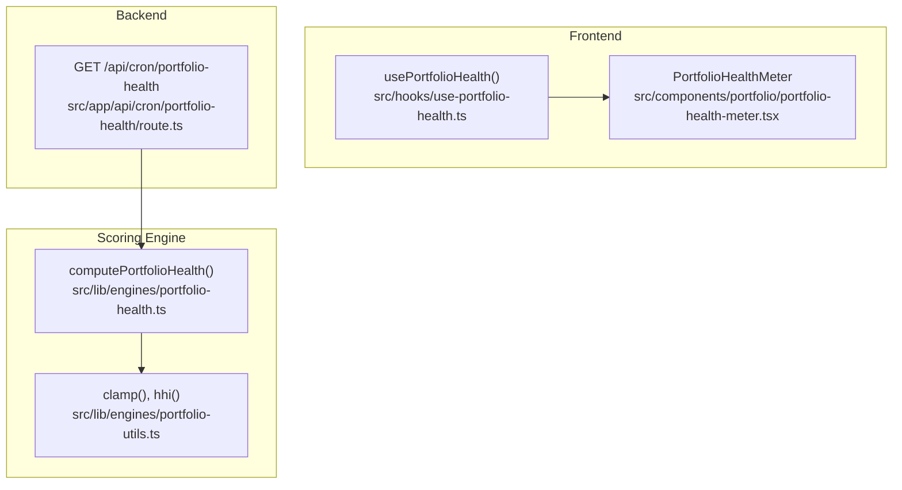
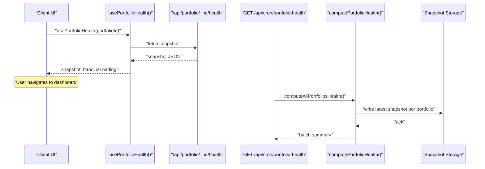
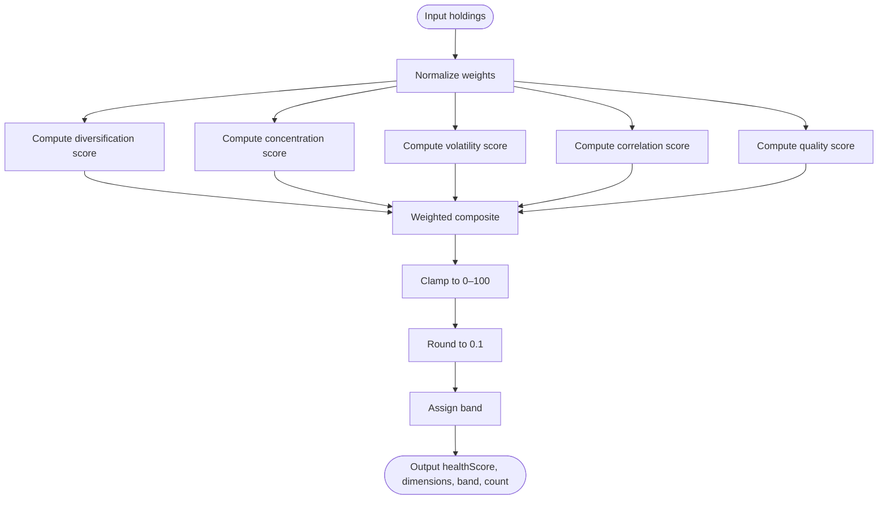
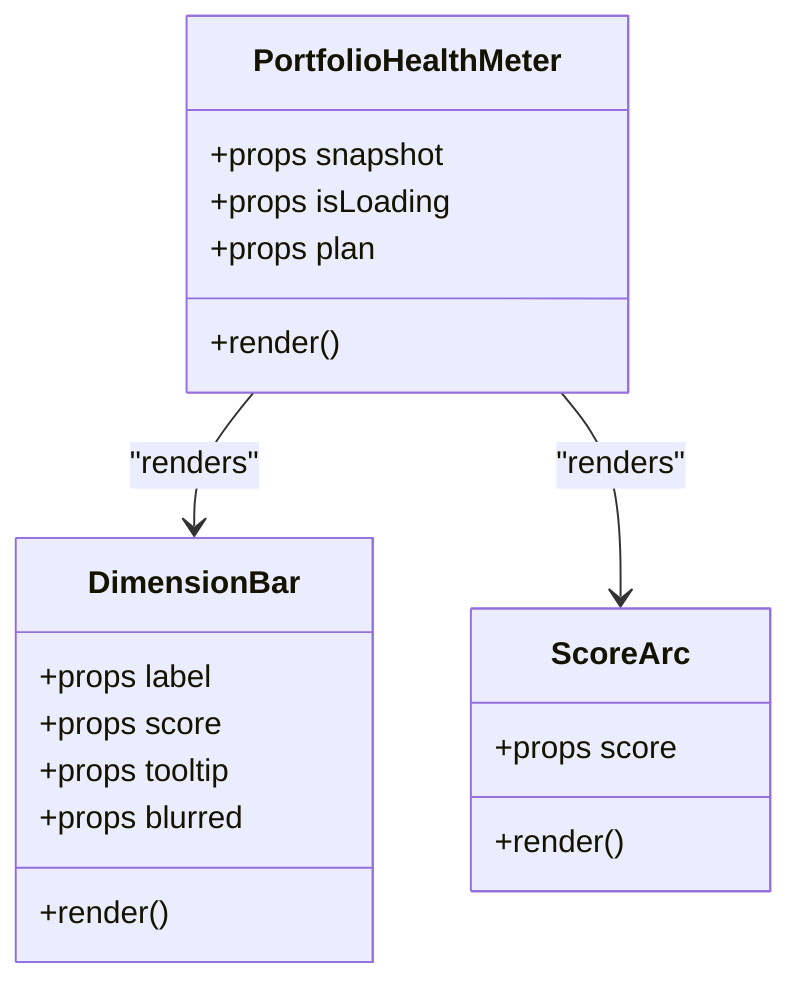
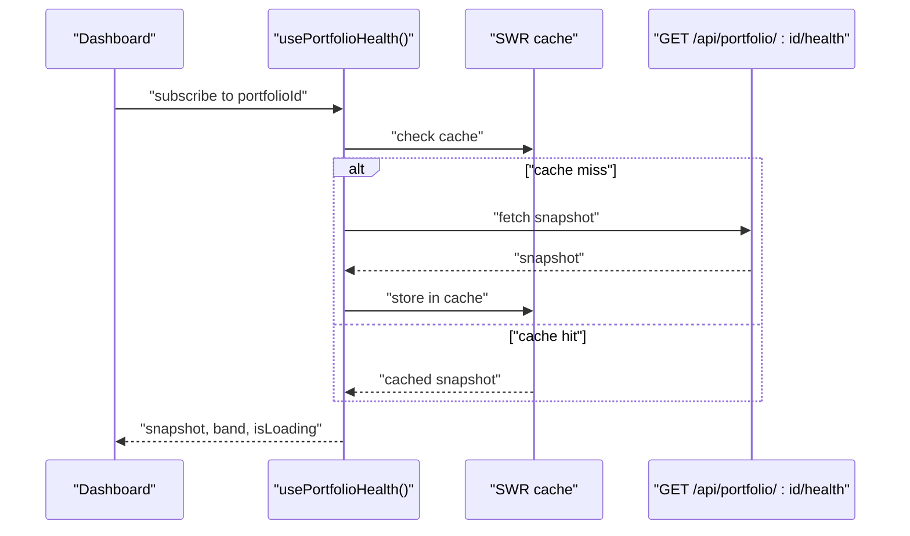
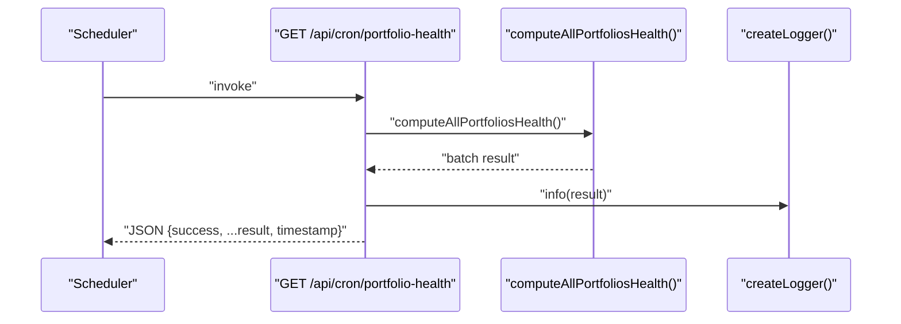
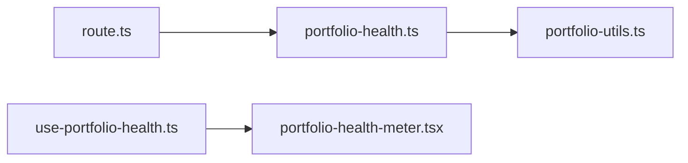

# Portfolio Health Monitoring

<cite>
**Referenced Files in This Document**
- [portfolio-health.ts](file://src/lib/engines/portfolio-health.ts)
- [portfolio-health-meter.tsx](file://src/components/portfolio/portfolio-health-meter.tsx)
- [use-portfolio-health.ts](file://src/hooks/use-portfolio-health.ts)
- [route.ts](file://src/app/api/cron/portfolio-health/route.ts)
- [portfolio-utils.ts](file://src/lib/engines/portfolio-utils.ts)
- [portfolio-health-explained.md](file://src/lib/learning/modules/portfolio/portfolio-health-explained.md)
- [portfolio-health.test.ts](file://src/lib/engines/__tests__/portfolio-health.test.ts)
- [portfolio-health-accuracy.test.ts](file://src/lib/engines/__tests__/portfolio-health-accuracy.test.ts)
</cite>

## Table of Contents
1. [Introduction](#introduction)
2. [Project Structure](#project-structure)
3. [Core Components](#core-components)
4. [Architecture Overview](#architecture-overview)
5. [Detailed Component Analysis](#detailed-component-analysis)
6. [Dependency Analysis](#dependency-analysis)
7. [Performance Considerations](#performance-considerations)
8. [Troubleshooting Guide](#troubleshooting-guide)
9. [Conclusion](#conclusion)
10. [Appendices](#appendices)

## Introduction
This document explains the portfolio health monitoring capabilities, focusing on the health scoring system, dimension analysis, health band classification, snapshot mechanism, real-time metrics, historical tracking, visualization, interpretation guidelines, alerts, and operational workflows. It synthesizes the scoring engine, frontend visualization, and backend batch processing to provide a complete understanding for both technical and non-technical users.

## Project Structure
The portfolio health system spans three layers:
- Scoring engine: computes health metrics from portfolio holdings
- Frontend visualization: renders the health meter and dimension breakdown
- Backend orchestration: runs periodic batch computations and exposes APIs

**Diagram sources**
- [portfolio-health.ts:152-200](file://src/lib/engines/portfolio-health.ts#L152-L200)
- [portfolio-utils.ts:11-24](file://src/lib/engines/portfolio-utils.ts#L11-L24)
- [use-portfolio-health.ts:40-61](file://src/hooks/use-portfolio-health.ts#L40-L61)
- [portfolio-health-meter.tsx:163-257](file://src/components/portfolio/portfolio-health-meter.tsx#L163-L257)
- [route.ts:14-29](file://src/app/api/cron/portfolio-health/route.ts#L14-L29)

**Section sources**
- [portfolio-health.ts:1-201](file://src/lib/engines/portfolio-health.ts#L1-L201)
- [portfolio-health-meter.tsx:1-258](file://src/components/portfolio/portfolio-health-meter.tsx#L1-L258)
- [use-portfolio-health.ts:1-82](file://src/hooks/use-portfolio-health.ts#L1-L82)
- [route.ts:1-30](file://src/app/api/cron/portfolio-health/route.ts#L1-L30)
- [portfolio-utils.ts:1-106](file://src/lib/engines/portfolio-utils.ts#L1-L106)

## Core Components
- Health scoring engine: computes a 0–100 health score from five dimensions with fixed weights and applies band thresholds
- Health meter UI: renders the health arc, band label, last computed date, and optional dimension bars
- SWR hook: fetches and caches snapshots with controlled refresh behavior
- Cron job: batch-computes and stores health for all portfolios
- Utility math helpers: clamp and HHI for consistent scoring

Key behaviors:
- Dimensions and weights: diversification (25%), concentration (20%), volatility (20%), correlation (15%), quality (20%)
- Bands: Strong (≥75), Balanced ([55,75), Fragile ([40,55), High Risk (<40)
- Normalization: input weights are normalized to sum to 1 before scoring
- Rounding: all scores are rounded to 0.1 precision

**Section sources**
- [portfolio-health.ts:37-50](file://src/lib/engines/portfolio-health.ts#L37-L50)
- [portfolio-health.ts:152-200](file://src/lib/engines/portfolio-health.ts#L152-L200)
- [use-portfolio-health.ts:24-29](file://src/hooks/use-portfolio-health.ts#L24-L29)
- [portfolio-health-meter.tsx:17-47](file://src/components/portfolio/portfolio-health-meter.tsx#L17-L47)

## Architecture Overview
The system integrates real-time and batch computation with a persistent snapshot model. The frontend consumes a cached snapshot via SWR, while the backend periodically recomputes and stores results.

**Diagram sources**
- [use-portfolio-health.ts:40-61](file://src/hooks/use-portfolio-health.ts#L40-L61)
- [route.ts:14-29](file://src/app/api/cron/portfolio-health/route.ts#L14-L29)
- [portfolio-health.ts:152-200](file://src/lib/engines/portfolio-health.ts#L152-L200)

## Detailed Component Analysis

### Health Scoring Engine
The engine accepts a list of holdings and produces:
- healthScore: weighted composite (0–100)
- dimensions: diversification, concentration, volatility, correlation, quality
- band: Strong, Balanced, Fragile, High Risk
- holdingCount: original count

Scoring pipeline:
1. Normalize weights so they sum to 1
2. Compute each dimension:
   - Diversification: HHI-based score across asset type and sector
   - Concentration: penalties for top1/top3/top5 weight thresholds
   - Volatility: weighted average volatility with diversification boost
   - Correlation: HHI-based score across type and sector
   - Quality: weighted trust and liquidity with asset-type penalty
3. Apply weights and clamp to 0–100
4. Round to 0.1 precision

**Diagram sources**
- [portfolio-health.ts:152-200](file://src/lib/engines/portfolio-health.ts#L152-L200)
- [portfolio-utils.ts:11-24](file://src/lib/engines/portfolio-utils.ts#L11-L24)

**Section sources**
- [portfolio-health.ts:10-33](file://src/lib/engines/portfolio-health.ts#L10-L33)
- [portfolio-health.ts:37-50](file://src/lib/engines/portfolio-health.ts#L37-L50)
- [portfolio-health.ts:52-150](file://src/lib/engines/portfolio-health.ts#L52-L150)
- [portfolio-health.ts:152-200](file://src/lib/engines/portfolio-health.ts#L152-L200)
- [portfolio-utils.ts:11-24](file://src/lib/engines/portfolio-utils.ts#L11-L24)

### Health Meter Visualization
The meter displays:
- Health arc with animated fill and ambient glow
- Band label with color-coded background
- Last computed date
- Optional dimension bars (feature-gated)
- Tooltips explaining each dimension

**Diagram sources**
- [portfolio-health-meter.tsx:163-257](file://src/components/portfolio/portfolio-health-meter.tsx#L163-L257)

**Section sources**
- [portfolio-health-meter.tsx:17-47](file://src/components/portfolio/portfolio-health-meter.tsx#L17-L47)
- [portfolio-health-meter.tsx:163-257](file://src/components/portfolio/portfolio-health-meter.tsx#L163-L257)

### Real-Time Metrics and Snapshot Fetching
The SWR-based hook fetches the latest snapshot and exposes:
- snapshot: current health data
- band: derived from healthScore
- isLoading: loading state
- mutate: cache refresh

**Diagram sources**
- [use-portfolio-health.ts:40-61](file://src/hooks/use-portfolio-health.ts#L40-L61)

**Section sources**
- [use-portfolio-health.ts:40-61](file://src/hooks/use-portfolio-health.ts#L40-L61)

### Historical Trend Tracking
Historical trends are supported by the snapshot model, which includes a date field. The UI surfaces “Last computed” to indicate freshness. The learning module also describes a separate historical tracking concept for portfolio intelligence.

**Section sources**
- [portfolio-health-meter.tsx:230-233](file://src/components/portfolio/portfolio-health-meter.tsx#L230-L233)
- [portfolio-health-explained.md:1-44](file://src/lib/learning/modules/portfolio/portfolio-health-explained.md#L1-L44)

### Health Alert Systems
There is no explicit alert subsystem in the analyzed code. Health bands can inform downstream alerting:
- High Risk (<40): potential trigger for warnings
- Fragile ([40,55)): cautionary threshold
- Balanced ([55,75)): stable baseline
- Strong (≥75): favorable condition

Teams can integrate external alerting by listening to band transitions or score drops.

[No sources needed since this section provides general guidance]

### Practical Examples and Strategies
- Example: Highly diversified portfolio with low volatility and strong quality typically yields a Strong band
- Example: Single-asset dominance triggers concentration penalties and lowers healthScore
- Improvement strategies:
  - Reduce top1 concentration below 25%
  - Increase sector/type diversity to raise diversification and correlation scores
  - Choose assets with higher trust and liquidity to improve quality
  - Select lower-volatility assets or hedge to reduce volatility exposure

**Section sources**
- [portfolio-health.test.ts:48-102](file://src/lib/engines/__tests__/portfolio-health.test.ts#L48-L102)
- [portfolio-health-accuracy.test.ts:103-154](file://src/lib/engines/__tests__/portfolio-health-accuracy.test.ts#L103-L154)
- [portfolio-health-accuracy.test.ts:158-197](file://src/lib/engines/__tests__/portfolio-health-accuracy.test.ts#L158-L197)
- [portfolio-health-accuracy.test.ts:201-254](file://src/lib/engines/__tests__/portfolio-health-accuracy.test.ts#L201-L254)

### Batch Processing Workflow
The cron endpoint triggers batch computation for all portfolios, logs completion, and returns a timestamped success payload.

**Diagram sources**
- [route.ts:14-29](file://src/app/api/cron/portfolio-health/route.ts#L14-L29)

**Section sources**
- [route.ts:14-29](file://src/app/api/cron/portfolio-health/route.ts#L14-L29)

### Cache Invalidation Strategies
- Dedupe interval: 60 seconds for health snapshots to avoid redundant fetches
- Revalidation on focus disabled to prevent excessive network requests
- Manual mutation: expose mutate to refresh cached data after batch updates

**Section sources**
- [use-portfolio-health.ts:47-48](file://src/hooks/use-portfolio-health.ts#L47-L48)

## Dependency Analysis
The engine depends on shared math utilities for clamping and HHI computation. The UI depends on the hook for data and band configuration. The backend cron invokes the engine and persists results.

**Diagram sources**
- [portfolio-health.ts](file://src/lib/engines/portfolio-health.ts#L8)
- [portfolio-utils.ts:11-24](file://src/lib/engines/portfolio-utils.ts#L11-L24)
- [use-portfolio-health.ts:1-82](file://src/hooks/use-portfolio-health.ts#L1-L82)
- [portfolio-health-meter.tsx:1-258](file://src/components/portfolio/portfolio-health-meter.tsx#L1-L258)
- [route.ts:1-30](file://src/app/api/cron/portfolio-health/route.ts#L1-L30)

**Section sources**
- [portfolio-health.ts](file://src/lib/engines/portfolio-health.ts#L8)
- [portfolio-utils.ts:11-24](file://src/lib/engines/portfolio-utils.ts#L11-L24)
- [use-portfolio-health.ts:1-82](file://src/hooks/use-portfolio-health.ts#L1-L82)
- [portfolio-health-meter.tsx:1-258](file://src/components/portfolio/portfolio-health-meter.tsx#L1-L258)
- [route.ts:1-30](file://src/app/api/cron/portfolio-health/route.ts#L1-L30)

## Performance Considerations
- Engine complexity: O(n) per holding for aggregation; acceptable for typical portfolio sizes
- Normalization cost: minimal overhead; performed once per computation
- Rendering: SVG arc and bars are lightweight; tooltips add negligible cost
- Caching: SWR reduces repeated network calls; tune dedupingInterval for balance
- Batch cadence: adjust cron frequency based on data volatility and storage capacity

[No sources needed since this section provides general guidance]

## Troubleshooting Guide
Common issues and resolutions:
- Empty portfolio: returns healthScore 0 and High Risk; ensure holdings are present
- Unexpected score drop: review recent concentration spikes or quality degradation
- Band not updating: call mutate to refresh cache after batch runs
- Incorrect weights: confirm input weights are normalized; the engine normalizes again if needed

Validation references:
- Zero-score baseline and band assignment
- Range checks for all dimension scores
- Weight normalization equivalence
- Band boundary consistency

**Section sources**
- [portfolio-health.test.ts:18-24](file://src/lib/engines/__tests__/portfolio-health.test.ts#L18-L24)
- [portfolio-health.test.ts:26-46](file://src/lib/engines/__tests__/portfolio-health.test.ts#L26-L46)
- [portfolio-health-accuracy.test.ts:26-50](file://src/lib/engines/__tests__/portfolio-health-accuracy.test.ts#L26-L50)
- [portfolio-health-accuracy.test.ts:282-334](file://src/lib/engines/__tests__/portfolio-health-accuracy.test.ts#L282-L334)

## Conclusion
The portfolio health monitoring system provides a deterministic, explainable, and regulator-safe composite score with clear dimension breakdowns. It supports real-time consumption via SWR and periodic batch recomputation for scalability. The meter offers intuitive visualization and actionable insights, enabling informed portfolio adjustments and risk-aware decision-making.

[No sources needed since this section summarizes without analyzing specific files]

## Appendices

### Health Score Interpretation Guidelines
- Strong (≥75): robust, diversified, and resilient
- Balanced ([55,75): stable with room for improvement
- Fragile ([40,55): warning signs; consider rebalancing
- High Risk (<40): high structural risk; immediate action recommended

**Section sources**
- [portfolio-health.ts:45-50](file://src/lib/engines/portfolio-health.ts#L45-L50)
- [portfolio-health-meter.tsx:33-40](file://src/components/portfolio/portfolio-health-meter.tsx#L33-L40)

### Dimension Definitions and Weightings
- Diversification (25%): type and sector spread via HHI-based scoring
- Concentration (20%): penalties for top1/top3/top5 thresholds
- Volatility (20%): weighted volatility with diversification boost
- Correlation (15%): HHI-based across type and sector
- Quality (20%): trust and liquidity composite with asset-type penalty

**Section sources**
- [portfolio-health.ts:37-43](file://src/lib/engines/portfolio-health.ts#L37-L43)
- [portfolio-health.ts:52-150](file://src/lib/engines/portfolio-health.ts#L52-L150)