# Portfolio Holdings Management

<cite>
**Referenced Files in This Document**
- [portfolio-holdings-table.tsx](file://src/components/portfolio/portfolio-holdings-table.tsx)
- [add-holding-dialog.tsx](file://src/components/portfolio/add-holding-dialog.tsx)
- [csv-import-dialog.tsx](file://src/components/portfolio/csv-import-dialog.tsx)
- [pdf-import-dialog.tsx](file://src/components/portfolio/pdf-import-dialog.tsx)
- [portfolio-api-route.ts](file://src/app/api/portfolio/route.ts)
- [portfolio-detail-route.ts](file://src/app/api/portfolio/[id]/route.ts)
- [holdings-detail-route.ts](file://src/app/api/portfolio/[id]/holdings/[hid]/route.ts)
- [pdf-import-route.ts](file://src/app/api/portfolio/[id]/pdf-import/route.ts)
- [use-portfolio-hooks.ts](file://src/hooks/use-portfolio.ts)
- [portfolio-alerts.ts](file://src/lib/portfolio-alerts.ts)
- [portfolio-e2e-tests.ts](file://e2e/portfolio-e2e.spec.ts)
</cite>

## Table of Contents
1. [Introduction](#introduction)
2. [Project Structure](#project-structure)
3. [Core Components](#core-components)
4. [Architecture Overview](#architecture-overview)
5. [Detailed Component Analysis](#detailed-component-analysis)
6. [Dependency Analysis](#dependency-analysis)
7. [Performance Considerations](#performance-considerations)
8. [Troubleshooting Guide](#troubleshooting-guide)
9. [Conclusion](#conclusion)

## Introduction
This document provides comprehensive documentation for portfolio holdings management, covering the end-to-end workflows for adding, removing, and modifying holdings. It explains the holdings table interface, real-time price updates, and holding weight calculations. It also documents drift detection mechanisms, portfolio alerts, automatic rebalancing triggers, CSV import functionality, broker integration for holdings import, and PDF import capabilities. Practical examples demonstrate adding holdings, setting drift thresholds, and managing holding distributions. Finally, it outlines portfolio alerts, performance tracking, and tax-loss harvesting support.

## Project Structure
The portfolio holdings management system spans UI components, API routes, and client-side hooks:
- UI components: Add holding dialog, CSV import dialog, PDF import dialog, and holdings table
- API routes: Portfolio CRUD, holdings CRUD, and PDF import handlers
- Hooks: Optimistic mutations and real-time portfolio data fetching

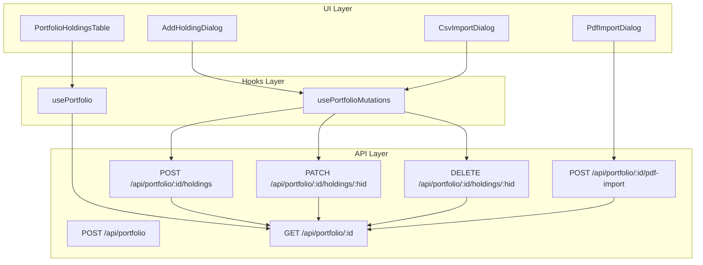

**Diagram sources**
- [add-holding-dialog.tsx:67-161](file://src/components/portfolio/add-holding-dialog.tsx#L67-L161)
- [csv-import-dialog.tsx:134-211](file://src/components/portfolio/csv-import-dialog.tsx#L134-L211)
- [pdf-import-dialog.tsx:47-145](file://src/components/portfolio/pdf-import-dialog.tsx#L47-L145)
- [portfolio-holdings-table.tsx:363-510](file://src/components/portfolio/portfolio-holdings-table.tsx#L363-L510)
- [use-portfolio-hooks.ts:141-352](file://src/hooks/use-portfolio.ts#L141-L352)
- [portfolio-api-route.ts:54-101](file://src/app/api/portfolio/route.ts#L54-L101)
- [portfolio-detail-route.ts:24-110](file://src/app/api/portfolio/[id]/route.ts#L24-L110)
- [holdings-detail-route.ts:14-91](file://src/app/api/portfolio/[id]/holdings/[hid]/route.ts#L14-L91)
- [pdf-import-route.ts:204-378](file://src/app/api/portfolio/[id]/pdf-import/route.ts#L204-L378)

**Section sources**
- [portfolio-holdings-table.tsx:1-511](file://src/components/portfolio/portfolio-holdings-table.tsx#L1-L511)
- [add-holding-dialog.tsx:1-330](file://src/components/portfolio/add-holding-dialog.tsx#L1-L330)
- [csv-import-dialog.tsx:1-454](file://src/components/portfolio/csv-import-dialog.tsx#L1-L454)
- [pdf-import-dialog.tsx:1-404](file://src/components/portfolio/pdf-import-dialog.tsx#L1-L404)
- [use-portfolio-hooks.ts:1-356](file://src/hooks/use-portfolio.ts#L1-L356)
- [portfolio-api-route.ts:1-102](file://src/app/api/portfolio/route.ts#L1-L102)
- [portfolio-detail-route.ts:24-122](file://src/app/api/portfolio/[id]/route.ts#L24-L122)
- [holdings-detail-route.ts:1-91](file://src/app/api/portfolio/[id]/holdings/[hid]/route.ts#L1-L91)
- [pdf-import-route.ts:1-379](file://src/app/api/portfolio/[id]/pdf-import/route.ts#L1-L379)

## Core Components
- Holdings table: Displays holdings with real-time price updates, P&L, weights, and DSE scores. Supports sorting, expansion, edit/remove actions, and optimistic UI updates.
- Add holding dialog: Provides asset search, validation, and submission to create new holdings.
- CSV import dialog: Parses CSV files, validates rows, and imports holdings in bulk.
- PDF import dialog: Uploads PDF statements, extracts holdings, resolves symbols, and imports results.
- Portfolio hooks: Manage optimistic mutations for add/update/remove operations and SWR-based portfolio data fetching.
- API routes: Handle portfolio CRUD, holdings CRUD, and PDF import with validation, symbol resolution, and health recomputation.

**Section sources**
- [portfolio-holdings-table.tsx:363-510](file://src/components/portfolio/portfolio-holdings-table.tsx#L363-L510)
- [add-holding-dialog.tsx:67-161](file://src/components/portfolio/add-holding-dialog.tsx#L67-L161)
- [csv-import-dialog.tsx:134-211](file://src/components/portfolio/csv-import-dialog.tsx#L134-L211)
- [pdf-import-dialog.tsx:47-145](file://src/components/portfolio/pdf-import-dialog.tsx#L47-L145)
- [use-portfolio-hooks.ts:141-352](file://src/hooks/use-portfolio.ts#L141-L352)
- [portfolio-api-route.ts:17-52](file://src/app/api/portfolio/route.ts#L17-L52)
- [portfolio-detail-route.ts:24-71](file://src/app/api/portfolio/[id]/route.ts#L24-L71)
- [holdings-detail-route.ts:14-91](file://src/app/api/portfolio/[id]/holdings/[hid]/route.ts#L14-L91)
- [pdf-import-route.ts:204-378](file://src/app/api/portfolio/[id]/pdf-import/route.ts#L204-L378)

## Architecture Overview
The system follows a client-driven mutation pattern with optimistic UI updates and server-side revalidation. Real-time price updates are reflected in the holdings table via asset snapshots returned by the API. PDF import uses a multi-pattern parser to detect holdings from broker statements and resolves them against the asset universe.

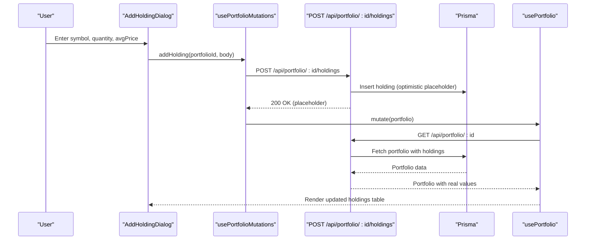

**Diagram sources**
- [add-holding-dialog.tsx:136-161](file://src/components/portfolio/add-holding-dialog.tsx#L136-L161)
- [use-portfolio-hooks.ts:181-226](file://src/hooks/use-portfolio.ts#L181-L226)
- [holdings-detail-route.ts:14-58](file://src/app/api/portfolio/[id]/holdings/[hid]/route.ts#L14-L58)
- [portfolio-detail-route.ts:24-66](file://src/app/api/portfolio/[id]/route.ts#L24-L66)

## Detailed Component Analysis

### Holdings Table Interface
The holdings table displays each holding with symbol, quantity, price, value, P&L, and weight. It computes total portfolio value, per-position weights, and sorts by configurable keys. Real-time price updates are shown via asset snapshots returned by the API. Users can expand rows to view DSE scores and compatibility labels.

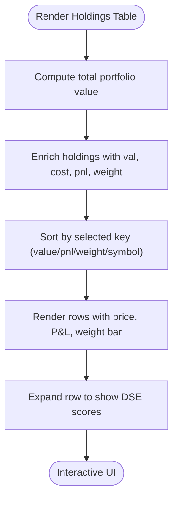

**Diagram sources**
- [portfolio-holdings-table.tsx:374-404](file://src/components/portfolio/portfolio-holdings-table.tsx#L374-L404)

**Section sources**
- [portfolio-holdings-table.tsx:363-510](file://src/components/portfolio/portfolio-holdings-table.tsx#L363-L510)

### Adding Holdings Workflow
The add holding dialog validates inputs, searches assets, and submits to the backend. The hook performs an optimistic insert, immediately rendering a placeholder row. On success, SWR revalidates to replace the placeholder with the authoritative data.

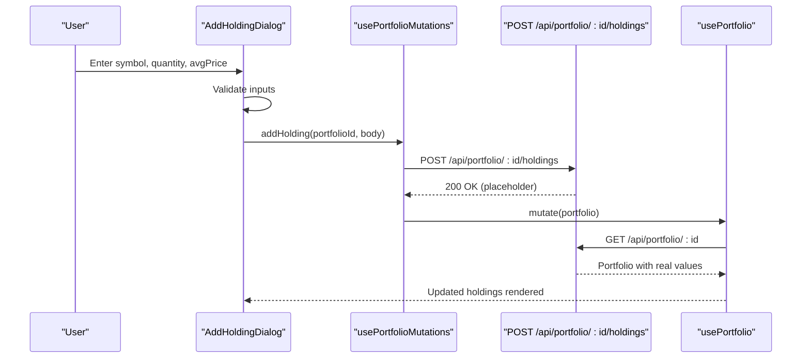

**Diagram sources**
- [add-holding-dialog.tsx:136-161](file://src/components/portfolio/add-holding-dialog.tsx#L136-L161)
- [use-portfolio-hooks.ts:181-226](file://src/hooks/use-portfolio.ts#L181-L226)
- [holdings-detail-route.ts:14-58](file://src/app/api/portfolio/[id]/holdings/[hid]/route.ts#L14-L58)
- [portfolio-detail-route.ts:24-66](file://src/app/api/portfolio/[id]/route.ts#L24-L66)

**Section sources**
- [add-holding-dialog.tsx:67-161](file://src/components/portfolio/add-holding-dialog.tsx#L67-L161)
- [use-portfolio-hooks.ts:181-226](file://src/hooks/use-portfolio.ts#L181-L226)
- [holdings-detail-route.ts:14-58](file://src/app/api/portfolio/[id]/holdings/[hid]/route.ts#L14-L58)

### Removing Holdings Workflow
The remove workflow uses optimistic deletion: the UI removes the row immediately, and the backend deletes the record. Health recomputation is triggered after deletion.

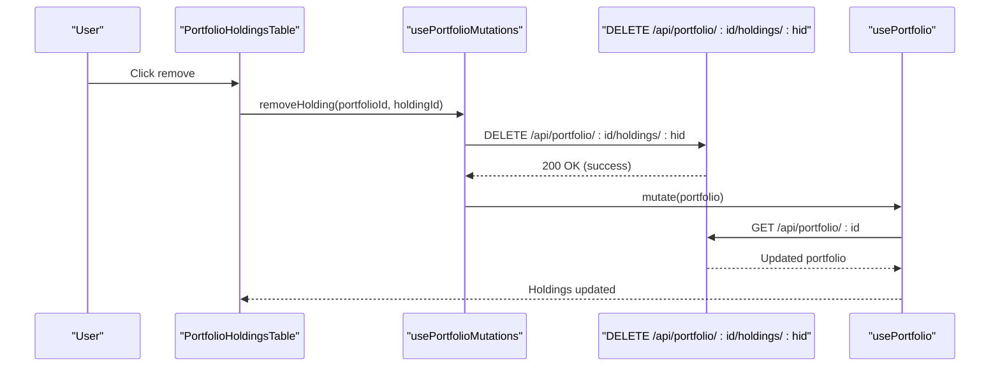

**Diagram sources**
- [portfolio-holdings-table.tsx:116-119](file://src/components/portfolio/portfolio-holdings-table.tsx#L116-L119)
- [use-portfolio-hooks.ts:228-266](file://src/hooks/use-portfolio.ts#L228-L266)
- [holdings-detail-route.ts:60-91](file://src/app/api/portfolio/[id]/holdings/[hid]/route.ts#L60-L91)
- [portfolio-detail-route.ts:24-66](file://src/app/api/portfolio/[id]/route.ts#L24-L66)

**Section sources**
- [portfolio-holdings-table.tsx:116-119](file://src/components/portfolio/portfolio-holdings-table.tsx#L116-L119)
- [use-portfolio-hooks.ts:228-266](file://src/hooks/use-portfolio.ts#L228-L266)
- [holdings-detail-route.ts:60-91](file://src/app/api/portfolio/[id]/holdings/[hid]/route.ts#L60-L91)

### Modifying Holdings Workflow
The edit action enables inline editing of quantity and average price. The hook optimistically updates the row and sends a PATCH request. After successful update, SWR revalidates to reflect the latest values.

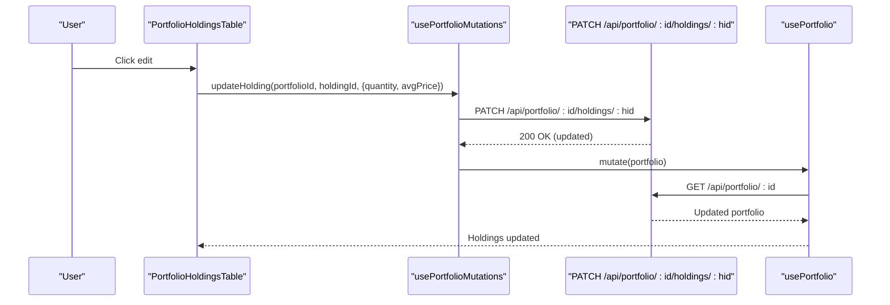

**Diagram sources**
- [portfolio-holdings-table.tsx:133-150](file://src/components/portfolio/portfolio-holdings-table.tsx#L133-L150)
- [use-portfolio-hooks.ts:268-321](file://src/hooks/use-portfolio.ts#L268-L321)
- [holdings-detail-route.ts:14-58](file://src/app/api/portfolio/[id]/holdings/[hid]/route.ts#L14-L58)
- [portfolio-detail-route.ts:24-66](file://src/app/api/portfolio/[id]/route.ts#L24-L66)

**Section sources**
- [portfolio-holdings-table.tsx:133-150](file://src/components/portfolio/portfolio-holdings-table.tsx#L133-L150)
- [use-portfolio-hooks.ts:268-321](file://src/hooks/use-portfolio.ts#L268-L321)
- [holdings-detail-route.ts:14-58](file://src/app/api/portfolio/[id]/holdings/[hid]/route.ts#L14-L58)

### CSV Import Functionality
The CSV import dialog parses uploaded files, normalizes headers, validates rows, and imports holdings. It supports drag-and-drop, previews invalid rows, and batches imports with optimistic UI updates.

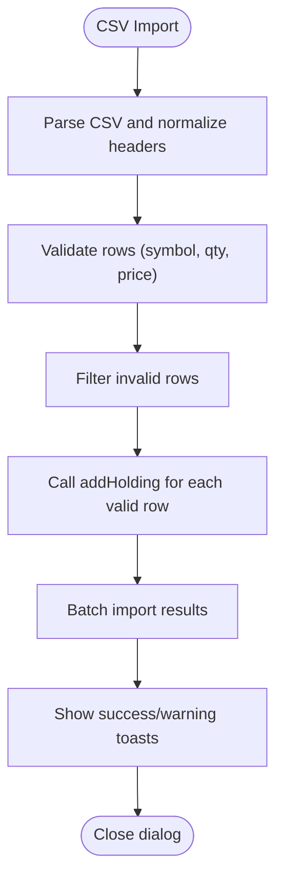

**Diagram sources**
- [csv-import-dialog.tsx:80-118](file://src/components/portfolio/csv-import-dialog.tsx#L80-L118)
- [csv-import-dialog.tsx:178-211](file://src/components/portfolio/csv-import-dialog.tsx#L178-L211)
- [use-portfolio-hooks.ts:181-226](file://src/hooks/use-portfolio.ts#L181-L226)

**Section sources**
- [csv-import-dialog.tsx:134-211](file://src/components/portfolio/csv-import-dialog.tsx#L134-L211)
- [csv-import-dialog.tsx:80-118](file://src/components/portfolio/csv-import-dialog.tsx#L80-L118)
- [use-portfolio-hooks.ts:181-226](file://src/hooks/use-portfolio.ts#L181-L226)

### PDF Import Capabilities
The PDF import dialog uploads PDF statements, extracts text, detects holdings using multiple patterns, resolves symbols against the asset universe, and imports results. It supports replacing existing holdings and provides detailed import summaries.

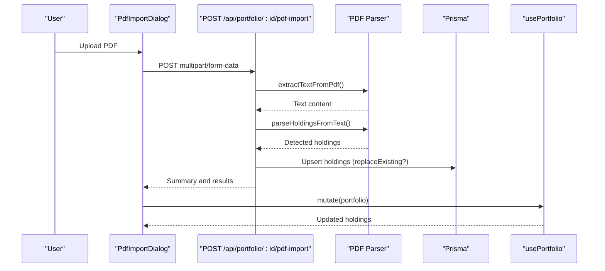

**Diagram sources**
- [pdf-import-dialog.tsx:90-145](file://src/components/portfolio/pdf-import-dialog.tsx#L90-L145)
- [pdf-import-route.ts:204-378](file://src/app/api/portfolio/[id]/pdf-import/route.ts#L204-L378)
- [pdf-import-route.ts:22-74](file://src/app/api/portfolio/[id]/pdf-import/route.ts#L22-L74)
- [pdf-import-route.ts:89-185](file://src/app/api/portfolio/[id]/pdf-import/route.ts#L89-L185)
- [use-portfolio-hooks.ts:323-352](file://src/hooks/use-portfolio.ts#L323-L352)
- [portfolio-detail-route.ts:24-66](file://src/app/api/portfolio/[id]/route.ts#L24-L66)

**Section sources**
- [pdf-import-dialog.tsx:47-145](file://src/components/portfolio/pdf-import-dialog.tsx#L47-L145)
- [pdf-import-route.ts:204-378](file://src/app/api/portfolio/[id]/pdf-import/route.ts#L204-L378)

### Drift Detection and Alerts
Drift detection compares current allocations to target weights. The portfolio health system computes health bands and generates alerts. While drift alerts are demonstrated for watchlists, portfolio drift can be monitored via weight bars and health metrics.

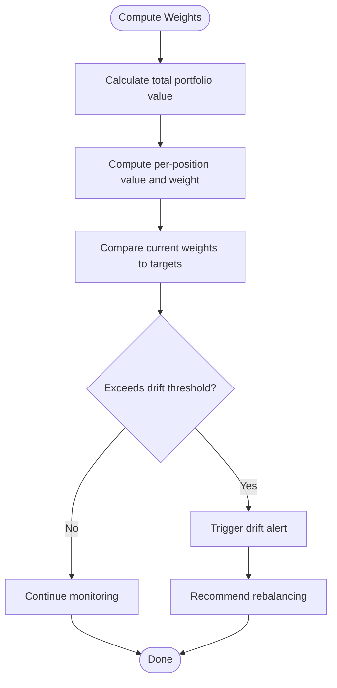

**Diagram sources**
- [portfolio-holdings-table.tsx:374-391](file://src/components/portfolio/portfolio-holdings-table.tsx#L374-L391)
- [portfolio-alerts.ts:32-72](file://src/lib/portfolio-alerts.ts#L32-L72)

**Section sources**
- [portfolio-holdings-table.tsx:374-391](file://src/components/portfolio/portfolio-holdings-table.tsx#L374-L391)
- [portfolio-alerts.ts:32-72](file://src/lib/portfolio-alerts.ts#L32-L72)

### Automatic Rebalancing Triggers
Automatic rebalancing can be triggered when drift exceeds a configured threshold. The system supports three approaches: sell/redistribute, buy-only, and tax-aware rebalancing. Tax-loss harvesting can align with rebalancing to optimize tax outcomes.

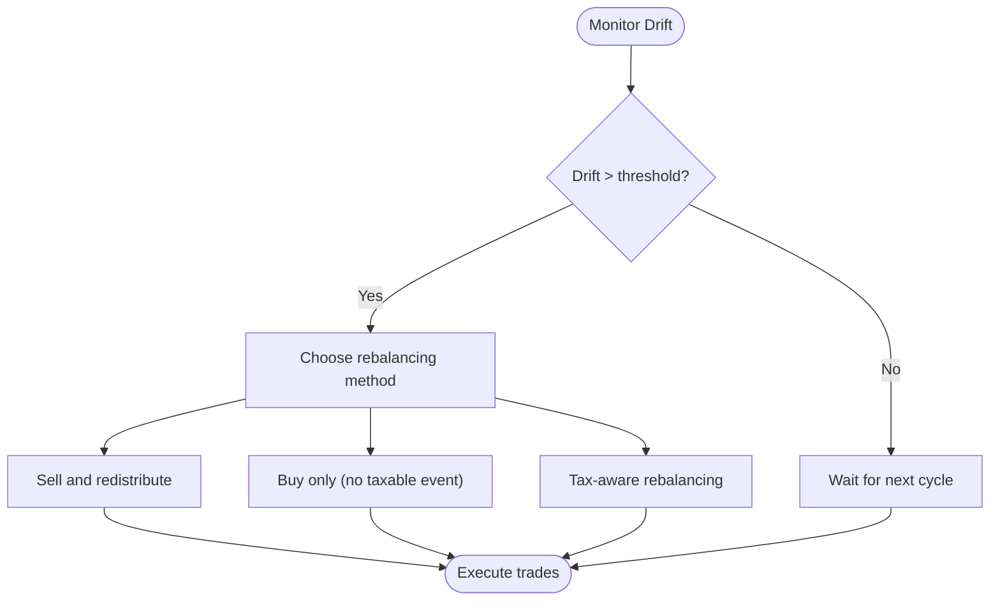

**Section sources**
- [portfolio-holdings-table.tsx:374-391](file://src/components/portfolio/portfolio-holdings-table.tsx#L374-L391)
- [portfolio-alerts.ts:32-72](file://src/lib/portfolio-alerts.ts#L32-L72)

### Portfolio Alerts System
The portfolio alerts system evaluates health scores, concentration, correlation, and fragility to produce a prioritized alert summary with tone and recommended actions.

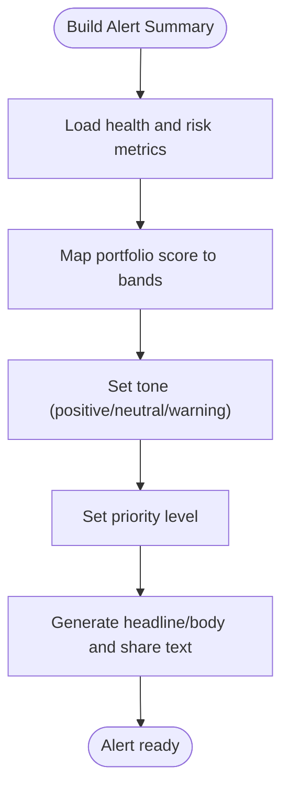

**Diagram sources**
- [portfolio-alerts.ts:40-72](file://src/lib/portfolio-alerts.ts#L40-L72)

**Section sources**
- [portfolio-alerts.ts:1-72](file://src/lib/portfolio-alerts.ts#L1-L72)

### Tax-Loss Harvesting Support
Tax-loss harvesting aligns with rebalancing to realize losses for tax benefits. The system supports strategies that prioritize selling appreciated positions with highest cost basis and align rebalancing with loss realizations to offset gains.

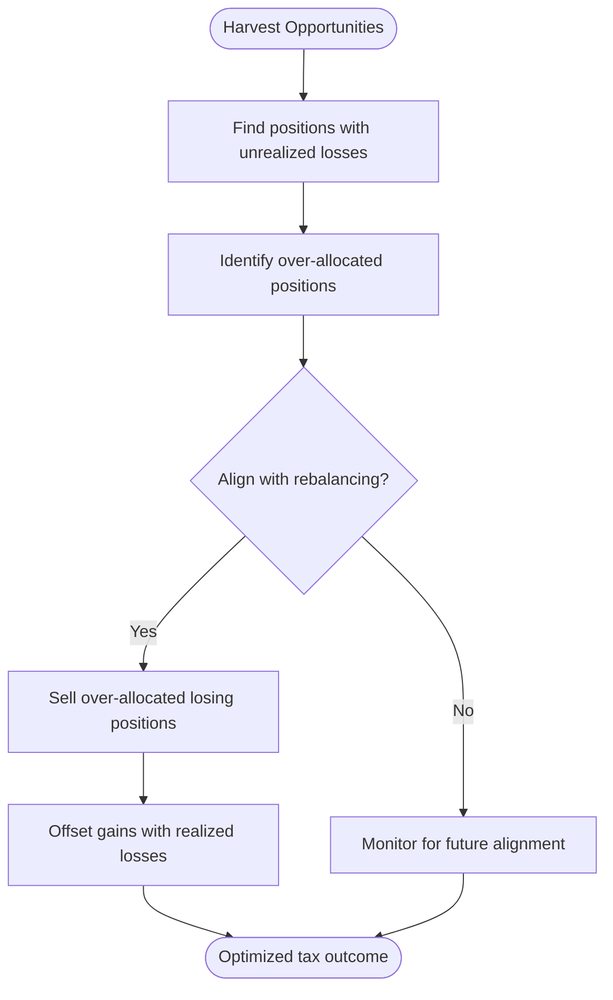

**Section sources**
- [portfolio-alerts.ts:32-72](file://src/lib/portfolio-alerts.ts#L32-L72)

## Dependency Analysis
The system exhibits clear separation of concerns:
- UI components depend on hooks for mutations and SWR for data
- Hooks encapsulate optimistic updates and coordinate with API routes
- API routes handle validation, symbol resolution, and health recomputation
- PDF import relies on a custom text extraction and multi-pattern parser

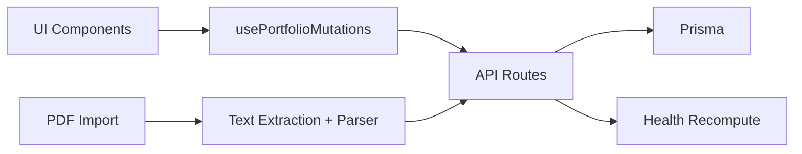

**Diagram sources**
- [use-portfolio-hooks.ts:141-352](file://src/hooks/use-portfolio.ts#L141-L352)
- [portfolio-api-route.ts:17-52](file://src/app/api/portfolio/route.ts#L17-L52)
- [pdf-import-route.ts:204-378](file://src/app/api/portfolio/[id]/pdf-import/route.ts#L204-L378)

**Section sources**
- [use-portfolio-hooks.ts:141-352](file://src/hooks/use-portfolio.ts#L141-L352)
- [portfolio-api-route.ts:17-52](file://src/app/api/portfolio/route.ts#L17-L52)
- [pdf-import-route.ts:204-378](file://src/app/api/portfolio/[id]/pdf-import/route.ts#L204-L378)

## Performance Considerations
- Optimistic UI updates reduce perceived latency for add/edit/remove operations
- Bulk PDF import uses a single transaction with concurrent upserts to minimize DB round trips
- Real-time price updates rely on asset snapshots returned by the API
- Sorting and weight computation are client-side for responsiveness

[No sources needed since this section provides general guidance]

## Troubleshooting Guide
Common issues and resolutions:
- Asset not found in universe: Ensure the symbol exists in the asset database for the selected region
- Region mismatch: Confirm the asset region matches the portfolio region
- Invalid CSV format: Use the accepted column aliases and ensure numeric values
- PDF import failures: Verify the PDF contains selectable text; scanned PDFs are not supported
- Drift alert not appearing: Confirm drift thresholds and health metrics are properly configured

**Section sources**
- [add-holding-dialog.tsx:151-158](file://src/components/portfolio/add-holding-dialog.tsx#L151-L158)
- [csv-import-dialog.tsx:352-373](file://src/components/portfolio/csv-import-dialog.tsx#L352-L373)
- [pdf-import-route.ts:251-270](file://src/app/api/portfolio/[id]/pdf-import/route.ts#L251-L270)
- [pdf-import-dialog.tsx:112-119](file://src/components/portfolio/pdf-import-dialog.tsx#L112-L119)

## Conclusion
The portfolio holdings management system provides a robust, user-friendly interface for managing holdings with real-time updates, comprehensive import capabilities, and integrated alerts. The optimistic mutation pattern ensures smooth UX, while backend validations and health recomputations maintain data integrity and portfolio insights. The system supports practical strategies for drift detection, rebalancing, and tax-loss harvesting to help users optimize their portfolios effectively.