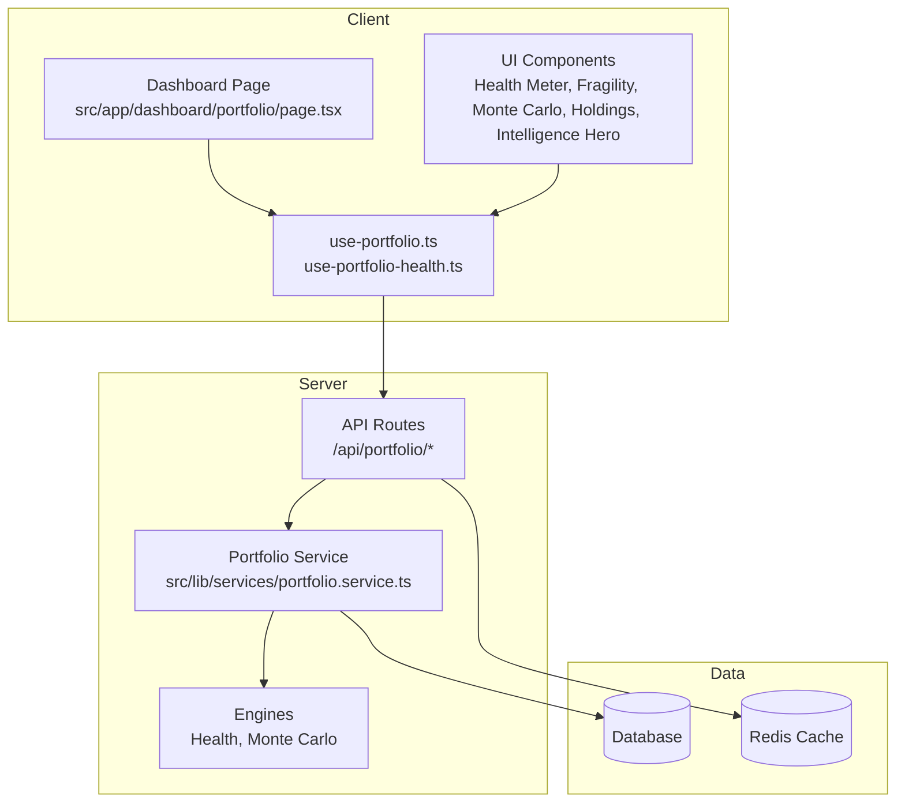
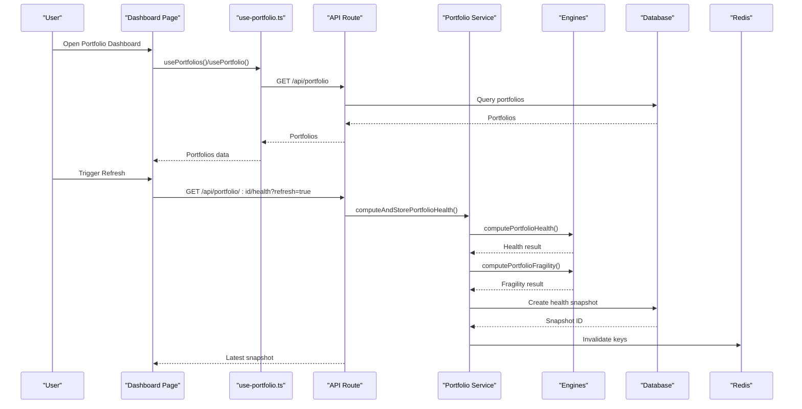
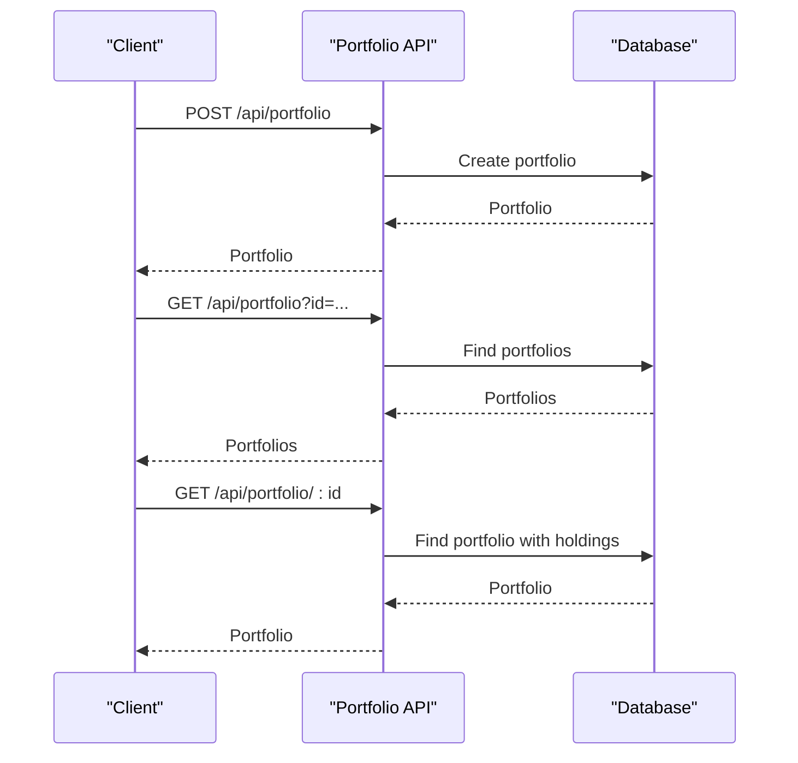
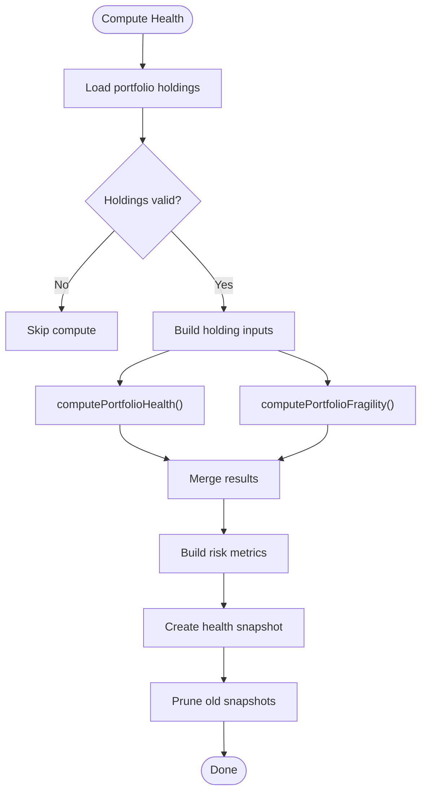
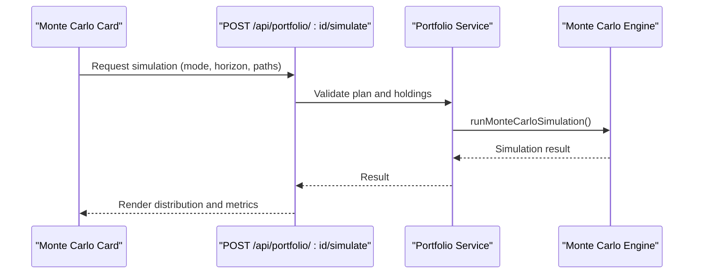
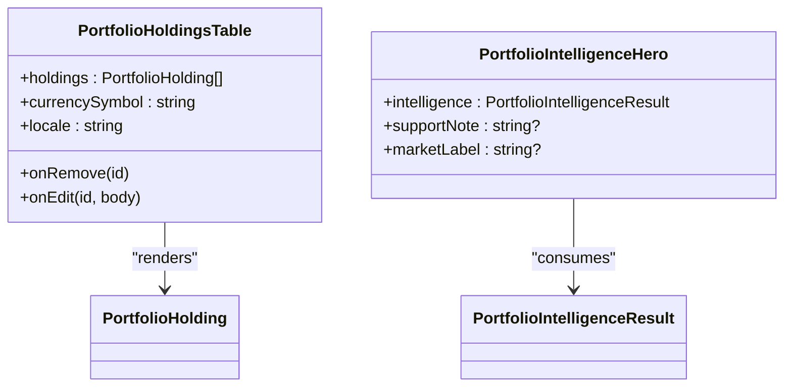
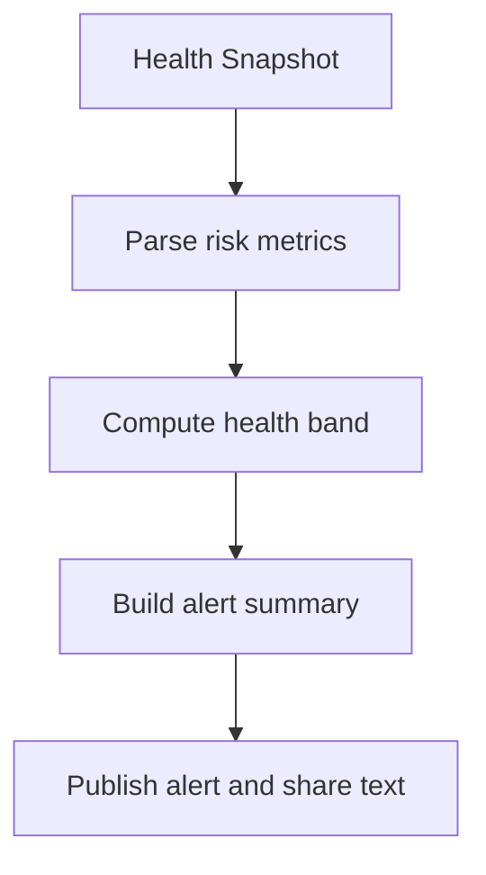
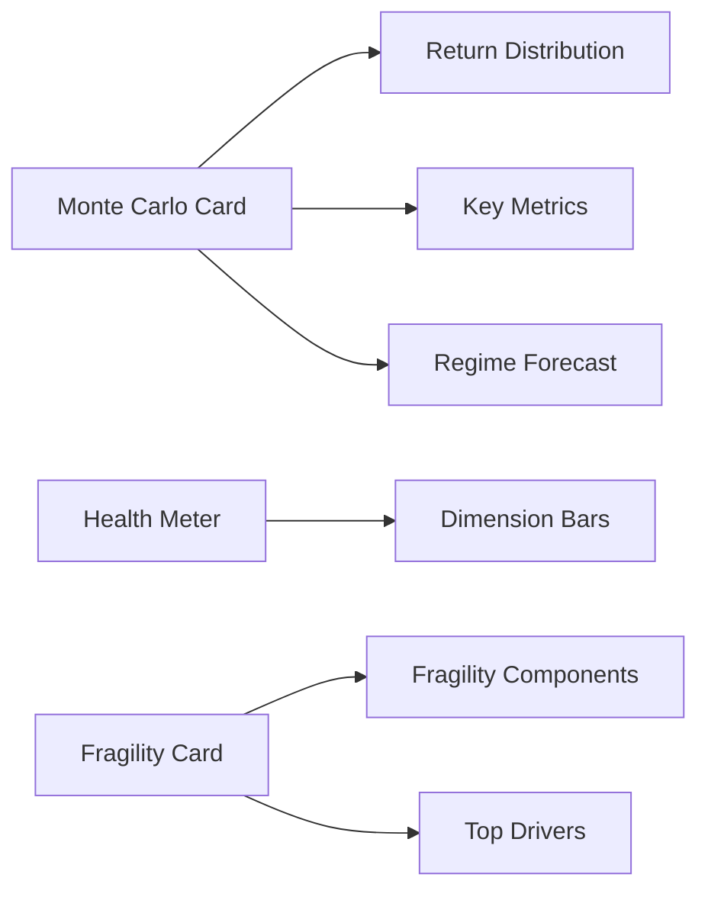
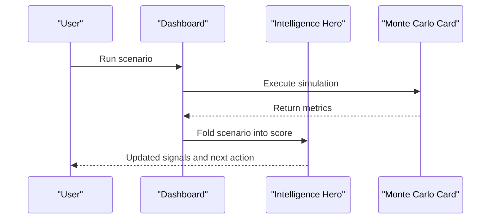
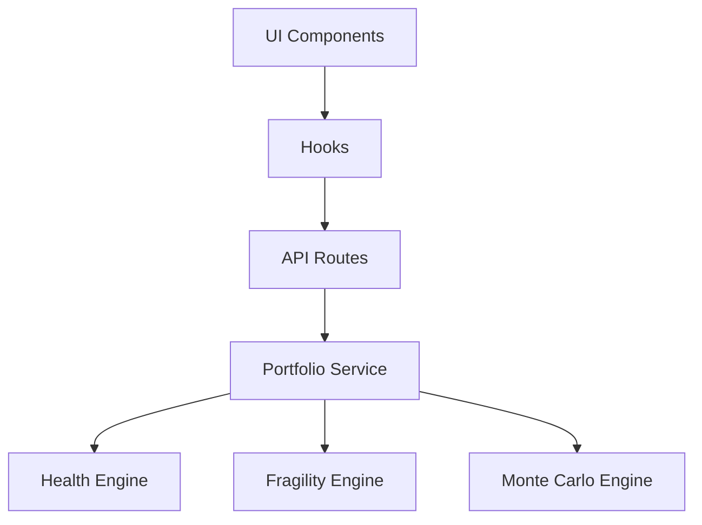

# Portfolio Management

<cite>
**Referenced Files in This Document**
- [src/app/api/portfolio/route.ts](file://src/app/api/portfolio/route.ts)
- [src/app/api/portfolio/[id]/route.ts](file://src/app/api/portfolio/[id]/route.ts)
- [src/app/api/portfolio/[id]/health/route.ts](file://src/app/api/portfolio/[id]/health/route.ts)
- [src/app/api/portfolio/[id]/simulate/route.ts](file://src/app/api/portfolio/[id]/simulate/route.ts)
- [src/app/dashboard/portfolio/page.tsx](file://src/app/dashboard/portfolio/page.tsx)
- [src/lib/services/portfolio.service.ts](file://src/lib/services/portfolio.service.ts)
- [src/hooks/use-portfolio.ts](file://src/hooks/use-portfolio.ts)
- [src/hooks/use-portfolio-health.ts](file://src/hooks/use-portfolio-health.ts)
- [src/components/portfolio/portfolio-health-meter.tsx](file://src/components/portfolio/portfolio-health-meter.tsx)
- [src/components/portfolio/portfolio-fragility-card.tsx](file://src/components/portfolio/portfolio-fragility-card.tsx)
- [src/components/portfolio/portfolio-monte-carlo-card.tsx](file://src/components/portfolio/portfolio-monte-carlo-card.tsx)
- [src/components/portfolio/portfolio-holdings-table.tsx](file://src/components/portfolio/portfolio-holdings-table.tsx)
- [src/components/portfolio/portfolio-intelligence-hero.tsx](file://src/components/portfolio/portfolio-intelligence-hero.tsx)
- [src/lib/engines/portfolio-health.ts](file://src/lib/engines/portfolio-health.ts)
- [src/lib/engines/portfolio-monte-carlo.ts](file://src/lib/engines/portfolio-monte-carlo.ts)
- [src/lib/portfolio-alerts.ts](file://src/lib/portfolio-alerts.ts)
</cite>

## Table of Contents
1. [Introduction](#introduction)
2. [Project Structure](#project-structure)
3. [Core Components](#core-components)
4. [Architecture Overview](#architecture-overview)
5. [Detailed Component Analysis](#detailed-component-analysis)
6. [Dependency Analysis](#dependency-analysis)
7. [Performance Considerations](#performance-considerations)
8. [Troubleshooting Guide](#troubleshooting-guide)
9. [Conclusion](#conclusion)
10. [Appendices](#appendices)

## Introduction
This document explains the Portfolio Management capabilities implemented in the codebase. It covers portfolio creation and lifecycle, health monitoring, risk assessment, Monte Carlo simulations, fragility analysis, real-time health metrics, alerts, drift detection, benchmark comparisons, performance analytics, optimization workflows, scenario analysis, and risk visualization. Practical examples demonstrate setup, monitoring dashboards, and decision support features.

## Project Structure
Portfolio Management spans API routes, server-side services, client hooks, and UI components:
- API routes expose CRUD operations for portfolios, health snapshots, and Monte Carlo simulations.
- Services orchestrate health computation, fragility analysis, and intelligence scoring.
- Hooks manage client-side caching, mutations, and SWR-driven revalidation.
- UI components visualize health, fragility, Monte Carlo results, holdings, and intelligence summaries.

**Diagram sources**
- [src/app/dashboard/portfolio/page.tsx:564-770](file://src/app/dashboard/portfolio/page.tsx#L564-L770)
- [src/hooks/use-portfolio.ts:70-99](file://src/hooks/use-portfolio.ts#L70-L99)
- [src/hooks/use-portfolio-health.ts:40-61](file://src/hooks/use-portfolio-health.ts#L40-L61)
- [src/app/api/portfolio/route.ts:17-52](file://src/app/api/portfolio/route.ts#L17-L52)
- [src/app/api/portfolio/[id]/health/route.ts](file://src/app/api/portfolio/[id]/health/route.ts#L17-L75)
- [src/app/api/portfolio/[id]/simulate/route.ts](file://src/app/api/portfolio/[id]/simulate/route.ts#L14-L100)
- [src/lib/services/portfolio.service.ts:169-318](file://src/lib/services/portfolio.service.ts#L169-L318)
- [src/lib/engines/portfolio-health.ts:152-200](file://src/lib/engines/portfolio-health.ts#L152-L200)
- [src/lib/engines/portfolio-monte-carlo.ts:212-336](file://src/lib/engines/portfolio-monte-carlo.ts#L212-L336)

**Section sources**
- [src/app/api/portfolio/route.ts:17-101](file://src/app/api/portfolio/route.ts#L17-L101)
- [src/app/api/portfolio/[id]/route.ts](file://src/app/api/portfolio/[id]/route.ts#L15-L142)
- [src/app/api/portfolio/[id]/health/route.ts](file://src/app/api/portfolio/[id]/health/route.ts#L17-L75)
- [src/app/api/portfolio/[id]/simulate/route.ts](file://src/app/api/portfolio/[id]/simulate/route.ts#L14-L100)
- [src/app/dashboard/portfolio/page.tsx:564-770](file://src/app/dashboard/portfolio/page.tsx#L564-L770)
- [src/lib/services/portfolio.service.ts:169-318](file://src/lib/services/portfolio.service.ts#L169-L318)
- [src/hooks/use-portfolio.ts:70-99](file://src/hooks/use-portfolio.ts#L70-L99)
- [src/hooks/use-portfolio-health.ts:40-61](file://src/hooks/use-portfolio-health.ts#L40-L61)
- [src/lib/engines/portfolio-health.ts:152-200](file://src/lib/engines/portfolio-health.ts#L152-L200)
- [src/lib/engines/portfolio-monte-carlo.ts:212-336](file://src/lib/engines/portfolio-monte-carlo.ts#L212-L336)

## Core Components
- Portfolio API: Create, list, update, delete portfolios; fetch details with holdings and latest health snapshot.
- Health API: Compute and cache health snapshots; supports forced refresh.
- Monte Carlo API: Run regime-aware simulations with four modes; gated by plan tiers.
- Services: Orchestrate health computation, fragility analysis, and intelligence scoring; prune health snapshots.
- Hooks: Manage SWR-backed queries, optimistic mutations, and cache invalidation.
- UI Components: Health meter, fragility card, Monte Carlo card, holdings table, and intelligence hero.

**Section sources**
- [src/app/api/portfolio/route.ts:17-101](file://src/app/api/portfolio/route.ts#L17-L101)
- [src/app/api/portfolio/[id]/route.ts](file://src/app/api/portfolio/[id]/route.ts#L15-L142)
- [src/app/api/portfolio/[id]/health/route.ts](file://src/app/api/portfolio/[id]/health/route.ts#L17-L75)
- [src/app/api/portfolio/[id]/simulate/route.ts](file://src/app/api/portfolio/[id]/simulate/route.ts#L14-L100)
- [src/lib/services/portfolio.service.ts:169-318](file://src/lib/services/portfolio.service.ts#L169-L318)
- [src/hooks/use-portfolio.ts:141-355](file://src/hooks/use-portfolio.ts#L141-L355)
- [src/hooks/use-portfolio-health.ts:40-81](file://src/hooks/use-portfolio-health.ts#L40-L81)
- [src/components/portfolio/portfolio-health-meter.tsx:163-257](file://src/components/portfolio/portfolio-health-meter.tsx#L163-L257)
- [src/components/portfolio/portfolio-fragility-card.tsx:135-273](file://src/components/portfolio/portfolio-fragility-card.tsx#L135-L273)
- [src/components/portfolio/portfolio-monte-carlo-card.tsx:175-448](file://src/components/portfolio/portfolio-monte-carlo-card.tsx#L175-L448)
- [src/components/portfolio/portfolio-holdings-table.tsx:363-510](file://src/components/portfolio/portfolio-holdings-table.tsx#L363-L510)
- [src/components/portfolio/portfolio-intelligence-hero.tsx:105-221](file://src/components/portfolio/portfolio-intelligence-hero.tsx#L105-L221)

## Architecture Overview
The system follows a layered architecture:
- Presentation: Next.js app pages and client components.
- Domain: Hooks and services encapsulate business logic.
- Infrastructure: API routes, engines, and persistence/cache.

**Diagram sources**
- [src/app/dashboard/portfolio/page.tsx:608-638](file://src/app/dashboard/portfolio/page.tsx#L608-L638)
- [src/app/api/portfolio/[id]/health/route.ts](file://src/app/api/portfolio/[id]/health/route.ts#L38-L53)
- [src/lib/services/portfolio.service.ts:169-318](file://src/lib/services/portfolio.service.ts#L169-L318)
- [src/lib/engines/portfolio-health.ts:152-200](file://src/lib/engines/portfolio-health.ts#L152-L200)
- [src/lib/engines/portfolio-monte-carlo.ts:212-336](file://src/lib/engines/portfolio-monte-carlo.ts#L212-L336)

## Detailed Component Analysis

### Portfolio Lifecycle API
- List and create portfolios with region and currency scoping.
- Retrieve detailed portfolio with holdings and latest health snapshot.
- Update and delete portfolios with transactional safety and cache invalidation.

**Diagram sources**
- [src/app/api/portfolio/route.ts:17-101](file://src/app/api/portfolio/route.ts#L17-L101)
- [src/app/api/portfolio/[id]/route.ts](file://src/app/api/portfolio/[id]/route.ts#L15-L71)

**Section sources**
- [src/app/api/portfolio/route.ts:17-101](file://src/app/api/portfolio/route.ts#L17-L101)
- [src/app/api/portfolio/[id]/route.ts](file://src/app/api/portfolio/[id]/route.ts#L15-L71)

### Health Monitoring and Real-Time Metrics
- Health computation aggregates five dimensions: diversification, concentration, volatility, correlation, and quality.
- Fragility analysis measures structural instability across volatility, correlation, liquidity, factor rotation, and concentration.
- Snapshots are cached and pruned to a fixed window; refresh supported with forced recomputation.

**Diagram sources**
- [src/lib/services/portfolio.service.ts:169-318](file://src/lib/services/portfolio.service.ts#L169-L318)
- [src/lib/engines/portfolio-health.ts:152-200](file://src/lib/engines/portfolio-health.ts#L152-L200)
- [src/lib/engines/portfolio-monte-carlo.ts:212-336](file://src/lib/engines/portfolio-monte-carlo.ts#L212-L336)

**Section sources**
- [src/app/api/portfolio/[id]/health/route.ts](file://src/app/api/portfolio/[id]/health/route.ts#L17-L75)
- [src/lib/services/portfolio.service.ts:169-318](file://src/lib/services/portfolio.service.ts#L169-L318)
- [src/hooks/use-portfolio-health.ts:40-61](file://src/hooks/use-portfolio-health.ts#L40-L61)
- [src/components/portfolio/portfolio-health-meter.tsx:163-257](file://src/components/portfolio/portfolio-health-meter.tsx#L163-L257)
- [src/components/portfolio/portfolio-fragility-card.tsx:135-273](file://src/components/portfolio/portfolio-fragility-card.tsx#L135-L273)

### Monte Carlo Simulation Engine
- Four modes: Stable Regime (A), Markov Switching (B), Stress Injection (C), Factor Shock (D).
- Regime-switching multivariate geometric Brownian motion with volatility, drift, correlation, and liquidity effects.
- Outputs include expected return, VaR/ES, drawdown statistics, regime forecast, and fragility metrics.

**Diagram sources**
- [src/components/portfolio/portfolio-monte-carlo-card.tsx:175-230](file://src/components/portfolio/portfolio-monte-carlo-card.tsx#L175-L230)
- [src/app/api/portfolio/[id]/simulate/route.ts](file://src/app/api/portfolio/[id]/simulate/route.ts#L14-L100)
- [src/lib/engines/portfolio-monte-carlo.ts:212-336](file://src/lib/engines/portfolio-monte-carlo.ts#L212-L336)

**Section sources**
- [src/app/api/portfolio/[id]/simulate/route.ts](file://src/app/api/portfolio/[id]/simulate/route.ts#L14-L100)
- [src/components/portfolio/portfolio-monte-carlo-card.tsx:175-448](file://src/components/portfolio/portfolio-monte-carlo-card.tsx#L175-L448)
- [src/lib/engines/portfolio-monte-carlo.ts:212-336](file://src/lib/engines/portfolio-monte-carlo.ts#L212-L336)

### Portfolio Composition Tracking and Analytics
- Holdings table displays quantities, prices, values, P&L, weights, and DSE scores; supports inline edit and expandable details.
- Portfolio Intelligence Hero summarizes score, band, signals, and next action.
- Allocation visualization shows sector/type exposure.

**Diagram sources**
- [src/components/portfolio/portfolio-holdings-table.tsx:363-510](file://src/components/portfolio/portfolio-holdings-table.tsx#L363-L510)
- [src/components/portfolio/portfolio-intelligence-hero.tsx:105-221](file://src/components/portfolio/portfolio-intelligence-hero.tsx#L105-L221)

**Section sources**
- [src/components/portfolio/portfolio-holdings-table.tsx:363-510](file://src/components/portfolio/portfolio-holdings-table.tsx#L363-L510)
- [src/components/portfolio/portfolio-intelligence-hero.tsx:105-221](file://src/components/portfolio/portfolio-intelligence-hero.tsx#L105-L221)
- [src/app/dashboard/portfolio/page.tsx:218-298](file://src/app/dashboard/portfolio/page.tsx#L218-L298)

### Alerts, Drift Detection, and Benchmark Comparisons
- Portfolio alerts derive headline/body and priority from health snapshots and risk metrics.
- Drift detection leverages DSE scores and compatibility labels to surface potential misalignment.
- Benchmark comparison card integrates with market regimes and sector alignment.

**Diagram sources**
- [src/lib/portfolio-alerts.ts:1-41](file://src/lib/portfolio-alerts.ts#L1-L41)
- [src/app/dashboard/portfolio/page.tsx:690-704](file://src/app/dashboard/portfolio/page.tsx#L690-L704)

**Section sources**
- [src/lib/portfolio-alerts.ts:1-41](file://src/lib/portfolio-alerts.ts#L1-L41)
- [src/app/dashboard/portfolio/page.tsx:690-704](file://src/app/dashboard/portfolio/page.tsx#L690-L704)

### Scenario Analysis and Risk Visualization Tools
- Monte Carlo visualization includes return distribution, VaR/ES, median, regime forecast, and fragility mean.
- Health meter and fragility card provide dimension-level insights and structural risk profiles.
- Regime alignment bar helps assess compatibility with current market backdrop.

**Diagram sources**
- [src/components/portfolio/portfolio-monte-carlo-card.tsx:61-173](file://src/components/portfolio/portfolio-monte-carlo-card.tsx#L61-L173)
- [src/components/portfolio/portfolio-health-meter.tsx:204-246](file://src/components/portfolio/portfolio-health-meter.tsx#L204-L246)
- [src/components/portfolio/portfolio-fragility-card.tsx:207-270](file://src/components/portfolio/portfolio-fragility-card.tsx#L207-L270)

**Section sources**
- [src/components/portfolio/portfolio-monte-carlo-card.tsx:61-173](file://src/components/portfolio/portfolio-monte-carlo-card.tsx#L61-L173)
- [src/components/portfolio/portfolio-health-meter.tsx:204-246](file://src/components/portfolio/portfolio-health-meter.tsx#L204-L246)
- [src/components/portfolio/portfolio-fragility-card.tsx:207-270](file://src/components/portfolio/portfolio-fragility-card.tsx#L207-L270)

### Optimization Workflows and Decision Support
- Intelligence hero highlights signals and next action derived from health and fragility.
- Monte Carlo results integrate into portfolio score when selected, enabling scenario-driven decisions.
- Broker import and CSV/PDF import dialogs streamline onboarding and optimization.

**Diagram sources**
- [src/app/dashboard/portfolio/page.tsx:708-737](file://src/app/dashboard/portfolio/page.tsx#L708-L737)
- [src/components/portfolio/portfolio-monte-carlo-card.tsx:175-230](file://src/components/portfolio/portfolio-monte-carlo-card.tsx#L175-L230)
- [src/components/portfolio/portfolio-intelligence-hero.tsx:105-221](file://src/components/portfolio/portfolio-intelligence-hero.tsx#L105-L221)

**Section sources**
- [src/app/dashboard/portfolio/page.tsx:708-737](file://src/app/dashboard/portfolio/page.tsx#L708-L737)
- [src/components/portfolio/portfolio-intelligence-hero.tsx:105-221](file://src/components/portfolio/portfolio-intelligence-hero.tsx#L105-L221)

## Dependency Analysis
- API routes depend on services and engines for computation and persistence.
- Services depend on engines for health and fragility computations.
- Hooks depend on API routes for data and mutations.
- UI components depend on hooks and services for rendering and interactivity.

**Diagram sources**
- [src/app/api/portfolio/[id]/health/route.ts](file://src/app/api/portfolio/[id]/health/route.ts#L7-L7)
- [src/lib/services/portfolio.service.ts:11-14](file://src/lib/services/portfolio.service.ts#L11-L14)
- [src/hooks/use-portfolio.ts:70-99](file://src/hooks/use-portfolio.ts#L70-L99)
- [src/components/portfolio/portfolio-health-meter.tsx:1-15](file://src/components/portfolio/portfolio-health-meter.tsx#L1-L15)

**Section sources**
- [src/lib/services/portfolio.service.ts:11-14](file://src/lib/services/portfolio.service.ts#L11-L14)
- [src/lib/engines/portfolio-health.ts:1-6](file://src/lib/engines/portfolio-health.ts#L1-L6)
- [src/lib/engines/portfolio-monte-carlo.ts:1-5](file://src/lib/engines/portfolio-monte-carlo.ts#L1-L5)

## Performance Considerations
- Batch processing: Health recomputation batches portfolios with concurrency control to avoid overload.
- Caching: Health and analytics are cached with TTL and invalidated on changes.
- Lazy engine loading: Monte Carlo engine is imported on demand to reduce cold start overhead.
- Auto-refresh: Client-side auto-refresh attempts once per day with local storage persistence.

**Section sources**
- [src/lib/services/portfolio.service.ts:324-363](file://src/lib/services/portfolio.service.ts#L324-L363)
- [src/app/api/portfolio/[id]/health/route.ts](file://src/app/api/portfolio/[id]/health/route.ts#L15-L15)
- [src/app/api/portfolio/[id]/simulate/route.ts](file://src/app/api/portfolio/[id]/simulate/route.ts#L91-L91)
- [src/app/dashboard/portfolio/page.tsx:640-671](file://src/app/dashboard/portfolio/page.tsx#L640-L671)

## Troubleshooting Guide
- Unauthorized access: API routes return 401 if unauthenticated.
- Validation errors: Invalid query/body returns 400 with error details.
- Portfolio limit reached: Creation returns 403 with plan limit details.
- Not found: Portfolio not found returns 404.
- Health recomputation failures: Non-fatal warnings logged; snapshot pruning runs fire-and-forget.
- Simulation gating: STARTER tier restricted; Elite required for advanced modes and higher path counts.

**Section sources**
- [src/app/api/portfolio/route.ts:17-101](file://src/app/api/portfolio/route.ts#L17-L101)
- [src/app/api/portfolio/[id]/route.ts](file://src/app/api/portfolio/[id]/route.ts#L73-L141)
- [src/app/api/portfolio/[id]/health/route.ts](file://src/app/api/portfolio/[id]/health/route.ts#L38-L53)
- [src/lib/services/portfolio.service.ts:283-291](file://src/lib/services/portfolio.service.ts#L283-L291)
- [src/app/api/portfolio/[id]/simulate/route.ts](file://src/app/api/portfolio/[id]/simulate/route.ts#L27-L49)

## Conclusion
The Portfolio Management system provides a robust foundation for portfolio creation, health monitoring, risk assessment, scenario analysis, and decision support. Its modular design separates concerns across API routes, services, engines, hooks, and UI components, enabling scalability, maintainability, and a rich user experience.

## Appendices

### Practical Examples
- Setup a portfolio: Use the create dialog to define name, description, currency, and region; confirm with cache invalidation.
- Monitor health: Use the health meter and fragility card to review dimension-level scores and structural risks.
- Run Monte Carlo: Select mode and horizon, then execute simulation; integrate results into intelligence scoring.
- Track holdings: Add, edit, and remove holdings via the holdings table; expand rows to inspect DSE scores and compatibility.
- Decision support: Review intelligence hero signals and next action; leverage alerts and drift detection insights.

**Section sources**
- [src/app/dashboard/portfolio/page.tsx:585-638](file://src/app/dashboard/portfolio/page.tsx#L585-L638)
- [src/components/portfolio/portfolio-monte-carlo-card.tsx:175-230](file://src/components/portfolio/portfolio-monte-carlo-card.tsx#L175-L230)
- [src/components/portfolio/portfolio-holdings-table.tsx:363-510](file://src/components/portfolio/portfolio-holdings-table.tsx#L363-L510)
- [src/components/portfolio/portfolio-intelligence-hero.tsx:105-221](file://src/components/portfolio/portfolio-intelligence-hero.tsx#L105-L221)