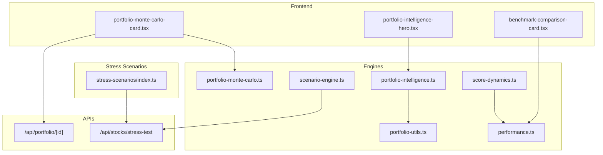
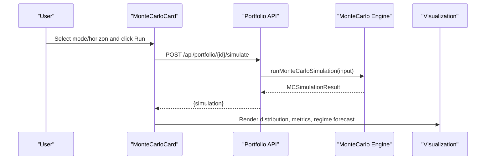
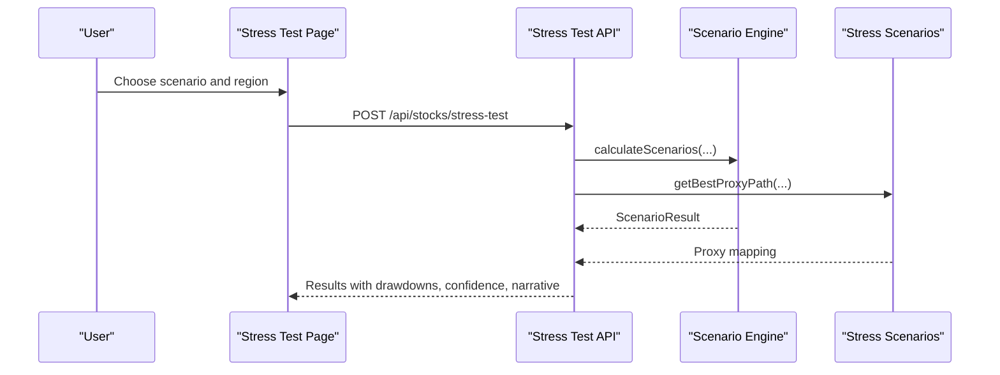
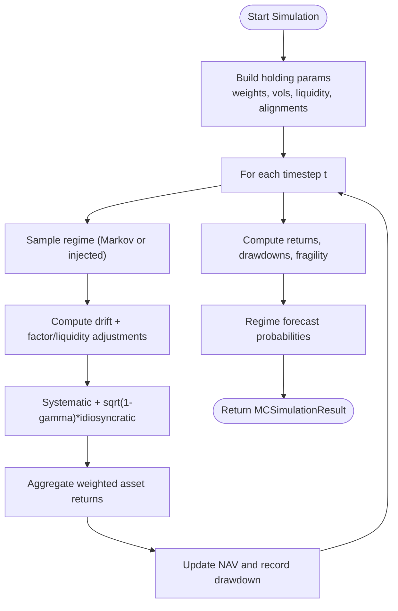
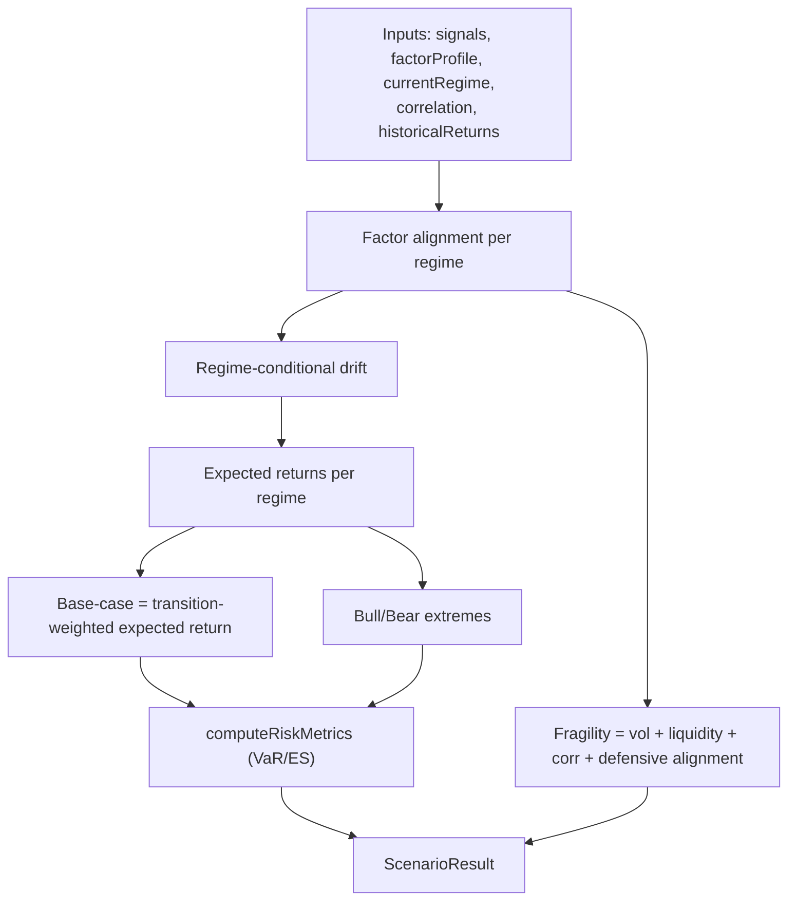
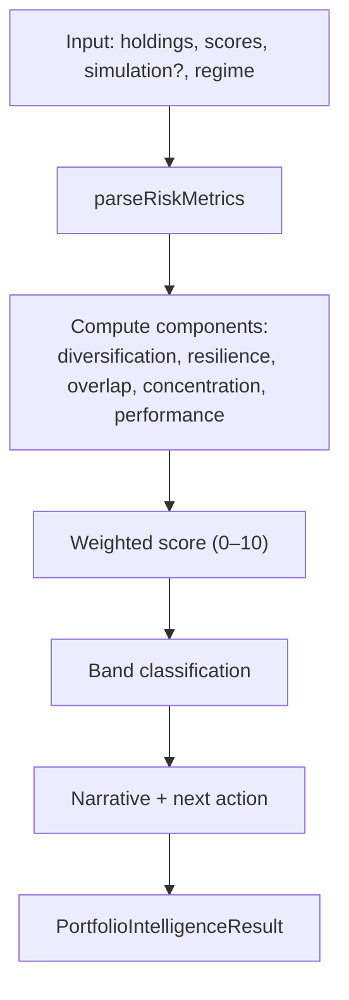
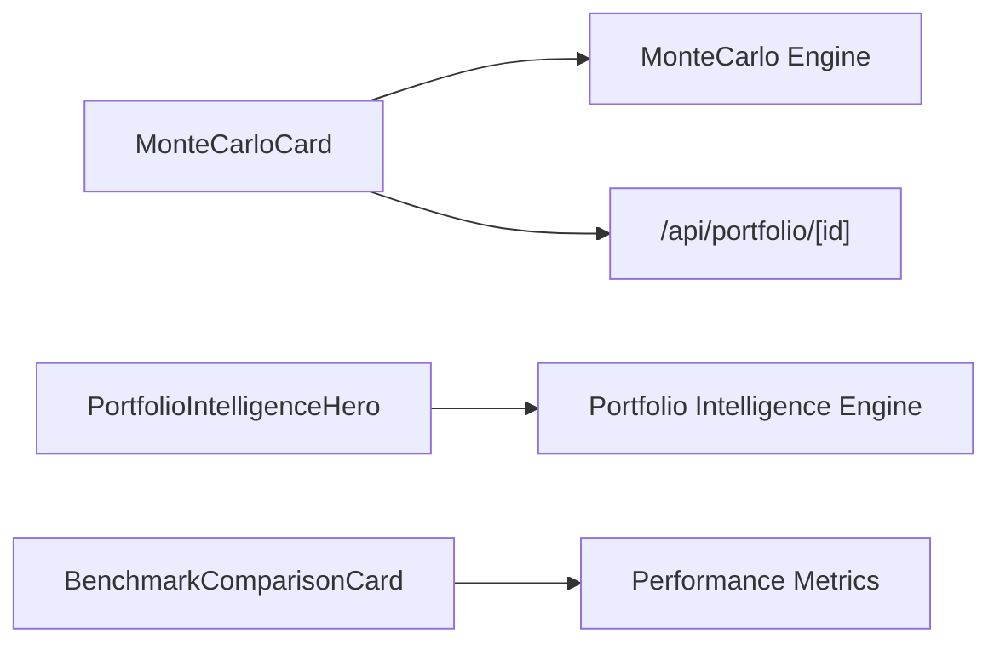
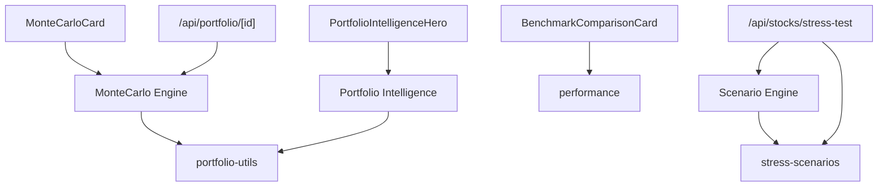

# Portfolio Performance Analytics

<cite>
**Referenced Files in This Document**
- [portfolio-monte-carlo.ts](file://src/lib/engines/portfolio-monte-carlo.ts)
- [portfolio-intelligence.ts](file://src/lib/engines/portfolio-intelligence.ts)
- [scenario-engine.ts](file://src/lib/engines/scenario-engine.ts)
- [portfolio-monte-carlo-card.tsx](file://src/components/portfolio/portfolio-monte-carlo-card.tsx)
- [portfolio-intelligence-hero.tsx](file://src/components/portfolio/portfolio-intelligence-hero.tsx)
- [benchmark-comparison-card.tsx](file://src/components/portfolio/benchmark-comparison-card.tsx)
- [portfolio-utils.ts](file://src/lib/engines/portfolio-utils.ts)
- [score-dynamics.ts](file://src/lib/engines/score-dynamics.ts)
- [performance.ts](file://src/lib/engines/performance.ts)
- [index.ts](file://src/lib/stress-scenarios/index.ts)
- [route.ts](file://src/app/api/portfolio/[id]/route.ts)
- [route.ts](file://src/app/api/stocks/stress-test/route.ts)
- [page.tsx](file://src/app/dashboard/stress-test/page.tsx)
- [page.tsx](file://src/app/dashboard/compare/page.tsx)
- [demo-portfolio-panel.tsx](file://src/components/portfolio/demo-portfolio-panel.tsx)
</cite>

## Table of Contents
1. [Introduction](#introduction)
2. [Project Structure](#project-structure)
3. [Core Components](#core-components)
4. [Architecture Overview](#architecture-overview)
5. [Detailed Component Analysis](#detailed-component-analysis)
6. [Dependency Analysis](#dependency-analysis)
7. [Performance Considerations](#performance-considerations)
8. [Troubleshooting Guide](#troubleshooting-guide)
9. [Conclusion](#conclusion)
10. [Appendices](#appendices)

## Introduction
This document explains the portfolio performance analytics system, focusing on Monte Carlo simulations, scenario analysis, performance attribution, and the portfolio intelligence engine. It covers the Monte Carlo regime-aware simulation model (RS-MGBM), stress testing and scenario-based risk assessment, performance visualization and benchmarking, and the scoring methodology that generates performance bands and actionable insights.

## Project Structure
The analytics stack spans backend engines, frontend visualization components, and API routes:
- Engines: Monte Carlo simulation, scenario modeling, performance attribution, score dynamics, and utilities
- Frontend: Interactive cards for Monte Carlo results, portfolio intelligence hero, and benchmark comparisons
- APIs: Portfolio CRUD, simulation triggers, and stress test calculations

**Diagram sources**
- [portfolio-monte-carlo.ts:1-337](file://src/lib/engines/portfolio-monte-carlo.ts#L1-L337)
- [scenario-engine.ts:1-465](file://src/lib/engines/scenario-engine.ts#L1-L465)
- [portfolio-intelligence.ts:1-355](file://src/lib/engines/portfolio-intelligence.ts#L1-L355)
- [portfolio-utils.ts:1-106](file://src/lib/engines/portfolio-utils.ts#L1-L106)
- [score-dynamics.ts:1-325](file://src/lib/engines/score-dynamics.ts#L1-L325)
- [performance.ts:1-44](file://src/lib/engines/performance.ts#L1-L44)
- [portfolio-monte-carlo-card.tsx:1-449](file://src/components/portfolio/portfolio-monte-carlo-card.tsx#L1-L449)
- [portfolio-intelligence-hero.tsx:1-222](file://src/components/portfolio/portfolio-intelligence-hero.tsx#L1-L222)
- [benchmark-comparison-card.tsx:1-208](file://src/components/portfolio/benchmark-comparison-card.tsx#L1-L208)
- [route.ts:1-142](file://src/app/api/portfolio/[id]/route.ts#L1-L142)
- [route.ts:273-470](file://src/app/api/stocks/stress-test/route.ts#L273-L470)
- [index.ts:1-94](file://src/lib/stress-scenarios/index.ts#L1-L94)

**Section sources**
- [portfolio-monte-carlo.ts:1-337](file://src/lib/engines/portfolio-monte-carlo.ts#L1-L337)
- [scenario-engine.ts:1-465](file://src/lib/engines/scenario-engine.ts#L1-L465)
- [portfolio-intelligence.ts:1-355](file://src/lib/engines/portfolio-intelligence.ts#L1-L355)
- [portfolio-utils.ts:1-106](file://src/lib/engines/portfolio-utils.ts#L1-L106)
- [score-dynamics.ts:1-325](file://src/lib/engines/score-dynamics.ts#L1-L325)
- [performance.ts:1-44](file://src/lib/engines/performance.ts#L1-L44)
- [portfolio-monte-carlo-card.tsx:1-449](file://src/components/portfolio/portfolio-monte-carlo-card.tsx#L1-L449)
- [portfolio-intelligence-hero.tsx:1-222](file://src/components/portfolio/portfolio-intelligence-hero.tsx#L1-L222)
- [benchmark-comparison-card.tsx:1-208](file://src/components/portfolio/benchmark-comparison-card.tsx#L1-L208)
- [route.ts:1-142](file://src/app/api/portfolio/[id]/route.ts#L1-L142)
- [route.ts:273-470](file://src/app/api/stocks/stress-test/route.ts#L273-L470)
- [index.ts:1-94](file://src/lib/stress-scenarios/index.ts#L1-L94)

## Core Components
- Monte Carlo Simulation Engine (RS-MGBM): Regime-switching multivariate geometric Brownian motion with volatility, drift, correlation, and liquidity adjustments; produces expected return, VaR/ES, drawdown statistics, and regime forecasts.
- Scenario Engine: Builds bull/base/bear cases under regime transitions, computes risk metrics and fragility scores.
- Portfolio Intelligence Engine: Aggregates components (diversification, resilience, overlap, concentration, performance) into a headline score and performance band with actionable signals.
- Visualization Components: Interactive Monte Carlo card, portfolio intelligence hero, and benchmark comparison card.
- APIs: Portfolio retrieval/update and stress test computation endpoints.

**Section sources**
- [portfolio-monte-carlo.ts:212-337](file://src/lib/engines/portfolio-monte-carlo.ts#L212-L337)
- [scenario-engine.ts:320-465](file://src/lib/engines/scenario-engine.ts#L320-L465)
- [portfolio-intelligence.ts:253-355](file://src/lib/engines/portfolio-intelligence.ts#L253-L355)
- [portfolio-monte-carlo-card.tsx:175-449](file://src/components/portfolio/portfolio-monte-carlo-card.tsx#L175-L449)
- [portfolio-intelligence-hero.tsx:105-222](file://src/components/portfolio/portfolio-intelligence-hero.tsx#L105-L222)
- [benchmark-comparison-card.tsx:112-208](file://src/components/portfolio/benchmark-comparison-card.tsx#L112-L208)
- [route.ts:15-71](file://src/app/api/portfolio/[id]/route.ts#L15-L71)
- [route.ts:273-470](file://src/app/api/stocks/stress-test/route.ts#L273-L470)

## Architecture Overview
The system integrates engines and UI components around two primary pathways:
- Monte Carlo Pathway: User selects simulation mode and horizon → API triggers engine → results rendered in interactive card
- Scenario/Stress Pathway: User selects scenario → API computes scenario outcomes and risk metrics → results displayed with narrative and confidence

**Diagram sources**
- [portfolio-monte-carlo-card.tsx:207-230](file://src/components/portfolio/portfolio-monte-carlo-card.tsx#L207-L230)
- [route.ts:15-71](file://src/app/api/portfolio/[id]/route.ts#L15-L71)
- [portfolio-monte-carlo.ts:212-337](file://src/lib/engines/portfolio-monte-carlo.ts#L212-L337)

**Diagram sources**
- [page.tsx:592-626](file://src/app/dashboard/stress-test/page.tsx#L592-L626)
- [route.ts:273-470](file://src/app/api/stocks/stress-test/route.ts#L273-L470)
- [scenario-engine.ts:320-465](file://src/lib/engines/scenario-engine.ts#L320-L465)
- [index.ts:32-58](file://src/lib/stress-scenarios/index.ts#L32-L58)

## Detailed Component Analysis

### Monte Carlo Simulation Engine (RS-MGBM)
- Purpose: Probabilistic portfolio risk assessment under regime uncertainty
- Key inputs: Holdings with weights, volatility, liquidity, compatibility; mode (A–D), horizon, paths, current regime
- Core mechanics:
  - Regime switching via Markov chain (modes B/C/D inject RISK_OFF or DEFENSIVE)
  - Drift tilt, volatility multiplier, systematic/idiosyncratic noise, and factor/liquidity penalties
  - Portfolio NAV path accumulation and drawdown computation
- Outputs: Expected return, percentiles, VaR/ES, max drawdown, regime forecast, fragility score

**Diagram sources**
- [portfolio-monte-carlo.ts:178-337](file://src/lib/engines/portfolio-monte-carlo.ts#L178-L337)

**Section sources**
- [portfolio-monte-carlo.ts:79-108](file://src/lib/engines/portfolio-monte-carlo.ts#L79-L108)
- [portfolio-monte-carlo.ts:212-337](file://src/lib/engines/portfolio-monte-carlo.ts#L212-L337)

### Scenario Engine and Stress Testing
- Purpose: Conditional forward distributions under structured regime shifts; computes VaR/ES and fragility
- Inputs: Asset signals, factor profile, current market regime, correlation to benchmark, historical returns
- Outputs: Bull/base/bear expected returns, regime probabilities, VaR/ES, fragility, metadata

**Diagram sources**
- [scenario-engine.ts:320-465](file://src/lib/engines/scenario-engine.ts#L320-L465)

**Section sources**
- [scenario-engine.ts:38-69](file://src/lib/engines/scenario-engine.ts#L38-L69)
- [scenario-engine.ts:320-465](file://src/lib/engines/scenario-engine.ts#L320-L465)
- [index.ts:32-86](file://src/lib/stress-scenarios/index.ts#L32-L86)

### Portfolio Intelligence Engine
- Purpose: Combine realized and simulated performance with risk metrics into a single score and performance band
- Inputs: Component scores (diversification, concentration, volatility, fragility), current return, optional simulation results, market regime
- Methodology:
  - Component scores derived from portfolio composition and risk metrics
  - Performance score combines realized return and simulated metrics with regime alignment boost
  - Final score weighted average; band mapping and narrative selection

**Diagram sources**
- [portfolio-intelligence.ts:253-355](file://src/lib/engines/portfolio-intelligence.ts#L253-L355)
- [portfolio-utils.ts:78-96](file://src/lib/engines/portfolio-utils.ts#L78-L96)

**Section sources**
- [portfolio-intelligence.ts:32-72](file://src/lib/engines/portfolio-intelligence.ts#L32-L72)
- [portfolio-intelligence.ts:143-166](file://src/lib/engines/portfolio-intelligence.ts#L143-L166)
- [portfolio-intelligence.ts:253-355](file://src/lib/engines/portfolio-intelligence.ts#L253-L355)
- [portfolio-utils.ts:46-96](file://src/lib/engines/portfolio-utils.ts#L46-L96)

### Visualization Components
- Monte Carlo Card: Interactive controls for mode and horizon, rendering return distribution, VaR/ES, drawdowns, fragility, and regime forecast
- Portfolio Intelligence Hero: Headline score, band, signals, and component breakdown with animated rings and bars
- Benchmark Comparison Card: Portfolio vs regional crypto benchmarks with difference bars and directional indicators

**Diagram sources**
- [portfolio-monte-carlo-card.tsx:175-449](file://src/components/portfolio/portfolio-monte-carlo-card.tsx#L175-L449)
- [portfolio-intelligence-hero.tsx:105-222](file://src/components/portfolio/portfolio-intelligence-hero.tsx#L105-L222)
- [benchmark-comparison-card.tsx:112-208](file://src/components/portfolio/benchmark-comparison-card.tsx#L112-L208)
- [performance.ts:25-44](file://src/lib/engines/performance.ts#L25-L44)

**Section sources**
- [portfolio-monte-carlo-card.tsx:175-449](file://src/components/portfolio/portfolio-monte-carlo-card.tsx#L175-L449)
- [portfolio-intelligence-hero.tsx:105-222](file://src/components/portfolio/portfolio-intelligence-hero.tsx#L105-L222)
- [benchmark-comparison-card.tsx:112-208](file://src/components/portfolio/benchmark-comparison-card.tsx#L112-L208)
- [performance.ts:1-44](file://src/lib/engines/performance.ts#L1-L44)

### Performance Attribution and Bands
- Overlap clarity penalizes weak compatibility and high mismatch; resilience blends diversification, fragility, and volatility; performance merges realized and simulated measures with regime alignment
- Bands: Exceptional (≥8.5), Strong (≥7), Balanced (≥5.5), Fragile (≥4), High Risk (<4)
- Signals: Resilience, Overlap clarity, Concentration, Performance, Monte Carlo, Market regime

**Section sources**
- [portfolio-intelligence.ts:127-166](file://src/lib/engines/portfolio-intelligence.ts#L127-L166)
- [portfolio-intelligence.ts:253-355](file://src/lib/engines/portfolio-intelligence.ts#L253-L355)

### Historical Performance Tracking and Benchmarking
- Historical returns and 52-week range metrics enable multi-horizon performance views
- Benchmark comparison computes portfolio vs benchmark differences and displays directionality and magnitude

**Section sources**
- [performance.ts:25-44](file://src/lib/engines/performance.ts#L25-L44)
- [benchmark-comparison-card.tsx:112-208](file://src/components/portfolio/benchmark-comparison-card.tsx#L112-L208)
- [page.tsx:575-608](file://src/app/dashboard/compare/page.tsx#L575-L608)

## Dependency Analysis
- Monte Carlo depends on regime transition matrices, volatility multipliers, and liquidity fragility
- Scenario Engine depends on factor preferences, volatility multipliers, and historical return series
- Portfolio Intelligence depends on risk metrics parsing and score normalization
- Visualization components depend on engine outputs and UI state
- APIs orchestrate engine calls and return structured results

**Diagram sources**
- [portfolio-monte-carlo.ts:1-337](file://src/lib/engines/portfolio-monte-carlo.ts#L1-L337)
- [scenario-engine.ts:1-465](file://src/lib/engines/scenario-engine.ts#L1-L465)
- [portfolio-intelligence.ts:1-355](file://src/lib/engines/portfolio-intelligence.ts#L1-L355)
- [portfolio-utils.ts:1-106](file://src/lib/engines/portfolio-utils.ts#L1-L106)
- [benchmark-comparison-card.tsx:1-208](file://src/components/portfolio/benchmark-comparison-card.tsx#L1-L208)
- [performance.ts:1-44](file://src/lib/engines/performance.ts#L1-L44)
- [route.ts:1-142](file://src/app/api/portfolio/[id]/route.ts#L1-L142)
- [route.ts:273-470](file://src/app/api/stocks/stress-test/route.ts#L273-L470)
- [index.ts:1-94](file://src/lib/stress-scenarios/index.ts#L1-L94)

**Section sources**
- [portfolio-monte-carlo.ts:1-337](file://src/lib/engines/portfolio-monte-carlo.ts#L1-L337)
- [scenario-engine.ts:1-465](file://src/lib/engines/scenario-engine.ts#L1-L465)
- [portfolio-intelligence.ts:1-355](file://src/lib/engines/portfolio-intelligence.ts#L1-L355)
- [portfolio-utils.ts:1-106](file://src/lib/engines/portfolio-utils.ts#L1-L106)
- [benchmark-comparison-card.tsx:1-208](file://src/components/portfolio/benchmark-comparison-card.tsx#L1-L208)
- [performance.ts:1-44](file://src/lib/engines/performance.ts#L1-L44)
- [route.ts:1-142](file://src/app/api/portfolio/[id]/route.ts#L1-L142)
- [route.ts:273-470](file://src/app/api/stocks/stress-test/route.ts#L273-L470)
- [index.ts:1-94](file://src/lib/stress-scenarios/index.ts#L1-L94)

## Performance Considerations
- Monte Carlo path counts scale with plan tier; elite plans increase paths for more precise estimates
- Regime switching and injected stress modes add computational overhead; use appropriate horizons and path counts
- Scenario engine uses empirical or normal risk metrics depending on sample size; ensure sufficient historical data for reliable VaR/ES
- Visualization animations and SWR polling should be throttled to reduce unnecessary re-renders

[No sources needed since this section provides general guidance]

## Troubleshooting Guide
Common issues and resolutions:
- No holdings provided: Simulation throws an error; ensure holdings are present before running
- Insufficient credits for stress tests: API returns insufficient credits; top up credits or reduce asset count
- Missing benchmark data: Quotes endpoint may return null; handle gracefully and retry
- Static score data: Score dynamics returns null when values are static; engine abstains from computing trends

**Section sources**
- [portfolio-monte-carlo.ts:215-217](file://src/lib/engines/portfolio-monte-carlo.ts#L215-L217)
- [route.ts:299-307](file://src/app/api/stocks/stress-test/route.ts#L299-L307)
- [benchmark-comparison-card.tsx:114-119](file://src/components/portfolio/benchmark-comparison-card.tsx#L114-L119)
- [score-dynamics.ts:46-59](file://src/lib/engines/score-dynamics.ts#L46-L59)

## Conclusion
The portfolio performance analytics system combines regime-aware Monte Carlo simulations, scenario-based stress testing, and a robust portfolio intelligence engine to deliver actionable insights. Users can visualize return distributions, assess downside risk, compare against benchmarks, and receive performance bands with targeted next actions. The modular architecture supports extensibility for additional factors, regimes, and visualization layers.

[No sources needed since this section summarizes without analyzing specific files]

## Appendices

### Practical Examples and Interpretation
- Monte Carlo simulation parameters:
  - Mode A: Stable Regime (paths: 2,000; horizon: 20–60 days)
  - Mode B: Markov Switching (paths: 2,000; stochastic regime transitions)
  - Mode C: Stress Injection (paths: 2,000; force RISK_OFF mid-simulation)
  - Mode D: Factor Shock (paths: 2,000; override factor preferences mid-path)
- Confidence intervals interpretation:
  - VaR (95%) indicates the maximum expected loss at the 5% tail under the chosen horizon
  - CVaR (95%) is the average loss in the worst 5% of outcomes
- Performance forecasting:
  - Expected return and median return inform long-term outlook
  - Max drawdown and fragility quantify downside risk and structural vulnerability

**Section sources**
- [portfolio-monte-carlo-card.tsx:19-31](file://src/components/portfolio/portfolio-monte-carlo-card.tsx#L19-L31)
- [portfolio-monte-carlo-card.tsx:207-230](file://src/components/portfolio/portfolio-monte-carlo-card.tsx#L207-L230)
- [portfolio-monte-carlo.ts:93-108](file://src/lib/engines/portfolio-monte-carlo.ts#L93-L108)

### Performance Bands and Actionable Insights
- Bands: Exceptional (>8.5), Strong (7–8.5), Balanced (5.5–7), Fragile (4–5.5), High Risk (<4)
- Signals: Resilience, Overlap clarity, Concentration, Performance, Monte Carlo, Market regime
- Next actions: Reduce concentration, verify overlap, rerun simulations, or adjust regime alignment

**Section sources**
- [portfolio-intelligence.ts:76-82](file://src/lib/engines/portfolio-intelligence.ts#L76-L82)
- [portfolio-intelligence.ts:296-337](file://src/lib/engines/portfolio-intelligence.ts#L296-L337)