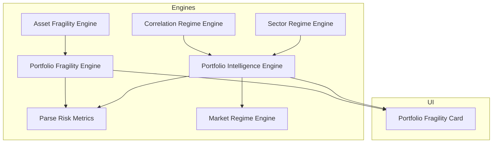
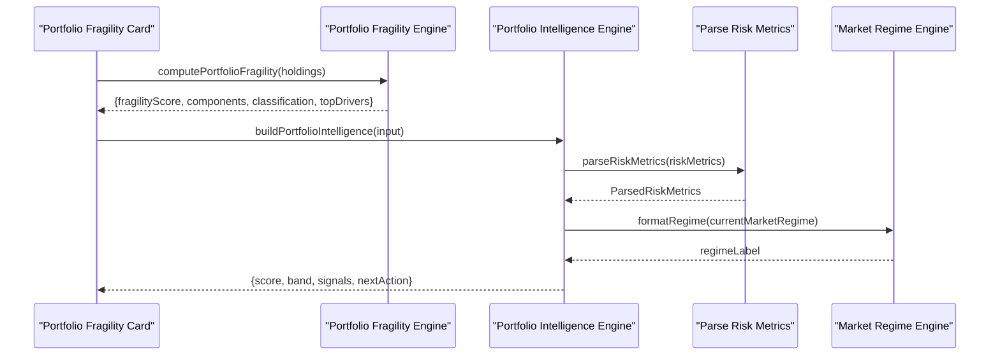
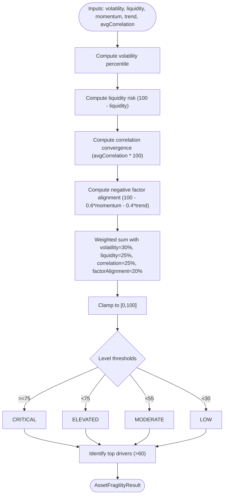
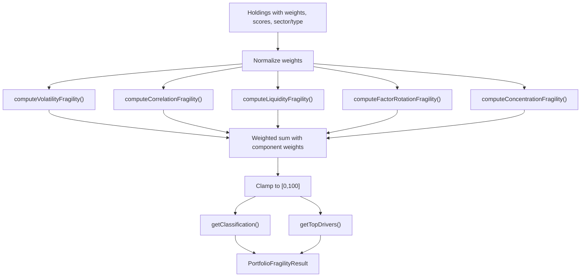
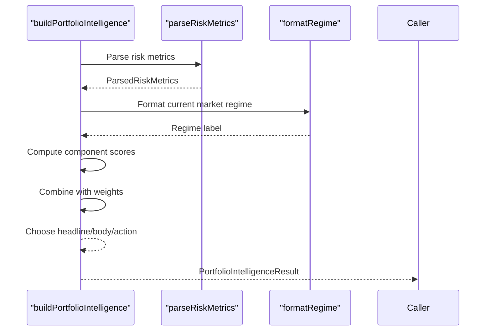
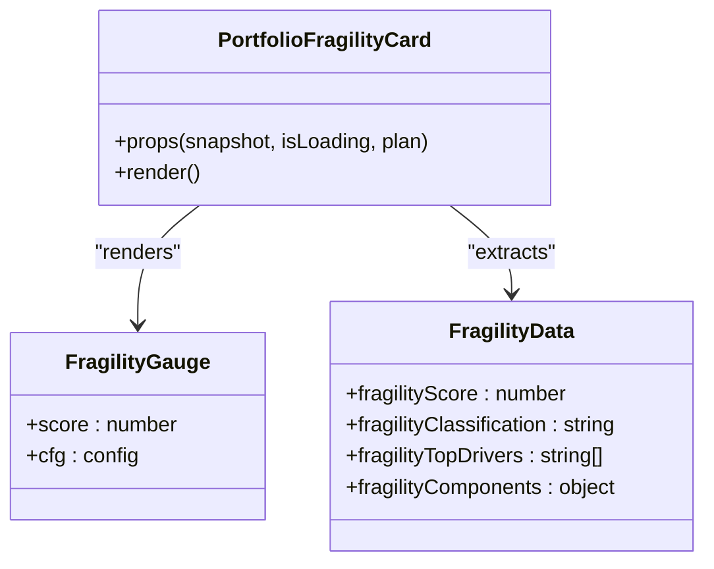
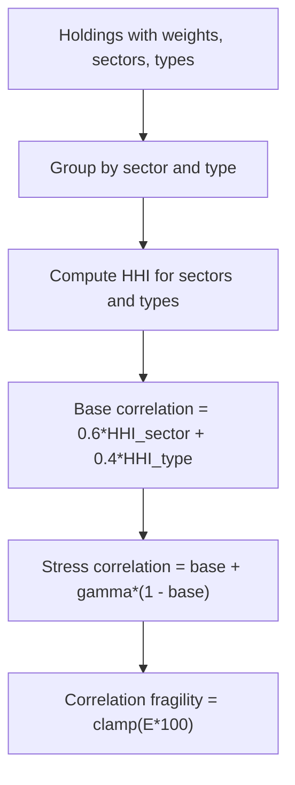
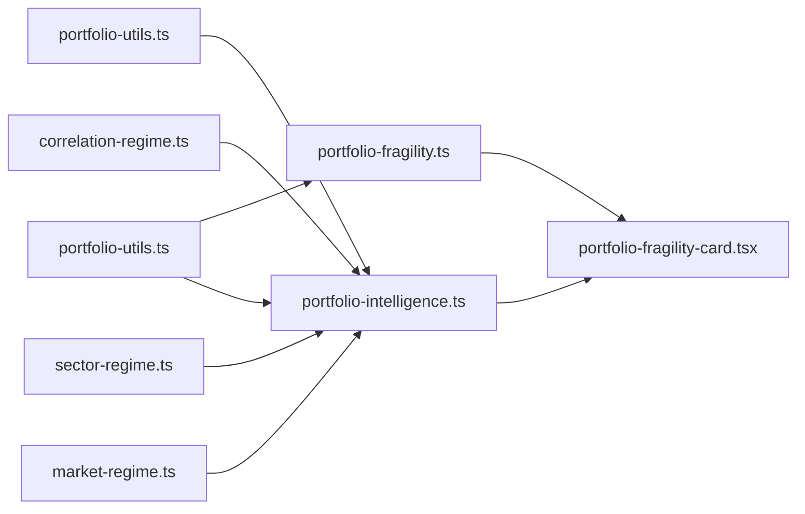

# Portfolio Risk Assessment

<cite>
**Referenced Files in This Document**
- [asset-fragility.ts](file://src/lib/engines/asset-fragility.ts)
- [portfolio-fragility.ts](file://src/lib/engines/portfolio-fragility.ts)
- [portfolio-intelligence.ts](file://src/lib/engines/portfolio-intelligence.ts)
- [portfolio-utils.ts](file://src/lib/engines/portfolio-utils.ts)
- [portfolio-fragility-card.tsx](file://src/components/portfolio/portfolio-fragility-card.tsx)
- [correlation-regime.ts](file://src/lib/engines/correlation-regime.ts)
- [sector-regime.ts](file://src/lib/engines/sector-regime.ts)
- [market-regime.ts](file://src/lib/engines/market-regime.ts)
- [scenario-engine.ts](file://src/lib/engines/scenario-engine.ts)
</cite>

## Table of Contents
1. [Introduction](#introduction)
2. [Project Structure](#project-structure)
3. [Core Components](#core-components)
4. [Architecture Overview](#architecture-overview)
5. [Detailed Component Analysis](#detailed-component-analysis)
6. [Dependency Analysis](#dependency-analysis)
7. [Performance Considerations](#performance-considerations)
8. [Troubleshooting Guide](#troubleshooting-guide)
9. [Conclusion](#conclusion)
10. [Appendices](#appendices)

## Introduction
This document explains the portfolio risk assessment system, focusing on fragility analysis, risk component evaluation, and vulnerability identification. It documents the fragility scoring system, risk drivers analysis, and fragility classification methodology. It also covers risk metrics computation including concentration risk, correlation risk, and sector concentration analysis, along with fragility card visualization, risk heatmaps, and vulnerability hotspots identification. Practical examples of fragility score interpretation, risk mitigation strategies, and portfolio rebalancing recommendations are included, alongside the buildPortfolioIntelligence function, compatibility score analysis, and regime mismatch detection mechanisms.

## Project Structure
The risk assessment system is composed of:
- Asset-level fragility engine for individual holdings
- Portfolio-level fragility engine aggregating multiple risk components
- Portfolio intelligence engine computing holistic portfolio health and recommendations
- Utilities for parsing risk metrics and mathematical helpers
- Visualization components rendering fragility insights
- Market regime engines for macro context and correlation analysis

**Diagram sources**
- [asset-fragility.ts:1-172](file://src/lib/engines/asset-fragility.ts#L1-L172)
- [portfolio-fragility.ts:1-186](file://src/lib/engines/portfolio-fragility.ts#L1-L186)
- [portfolio-intelligence.ts:1-355](file://src/lib/engines/portfolio-intelligence.ts#L1-L355)
- [portfolio-utils.ts:1-106](file://src/lib/engines/portfolio-utils.ts#L1-L106)
- [portfolio-fragility-card.tsx:1-274](file://src/components/portfolio/portfolio-fragility-card.tsx#L1-L274)
- [correlation-regime.ts:1-365](file://src/lib/engines/correlation-regime.ts#L1-L365)
- [sector-regime.ts:1-514](file://src/lib/engines/sector-regime.ts#L1-L514)
- [market-regime.ts:1-276](file://src/lib/engines/market-regime.ts#L1-L276)

**Section sources**
- [asset-fragility.ts:1-172](file://src/lib/engines/asset-fragility.ts#L1-L172)
- [portfolio-fragility.ts:1-186](file://src/lib/engines/portfolio-fragility.ts#L1-L186)
- [portfolio-intelligence.ts:1-355](file://src/lib/engines/portfolio-intelligence.ts#L1-L355)
- [portfolio-utils.ts:1-106](file://src/lib/engines/portfolio-utils.ts#L1-L106)
- [portfolio-fragility-card.tsx:1-274](file://src/components/portfolio/portfolio-fragility-card.tsx#L1-L274)
- [correlation-regime.ts:1-365](file://src/lib/engines/correlation-regime.ts#L1-L365)
- [sector-regime.ts:1-514](file://src/lib/engines/sector-regime.ts#L1-L514)
- [market-regime.ts:1-276](file://src/lib/engines/market-regime.ts#L1-L276)

## Core Components
- Asset Fragility Engine: Computes per-asset fragility from volatility percentile, liquidity risk, correlation convergence, and negative factor alignment. Produces a 0–100 score with level classification and drivers.
- Portfolio Fragility Engine: Aggregates weighted fragility across holdings considering volatility exposure, correlation convergence, liquidity contraction, factor rotation risk, and concentration risk. Returns a composite score and top drivers.
- Portfolio Intelligence Engine: Builds a holistic portfolio score integrating diversification, resilience, overlap clarity, concentration, and performance. Provides narrative, signals, and recommended actions.
- Risk Metrics Parser: Safely extracts and normalizes risk metrics for downstream engines and UI.
- Visualization: Renders fragility gauge, component bars, and top risk drivers in the portfolio fragility card.

**Section sources**
- [asset-fragility.ts:42-110](file://src/lib/engines/asset-fragility.ts#L42-L110)
- [portfolio-fragility.ts:135-185](file://src/lib/engines/portfolio-fragility.ts#L135-L185)
- [portfolio-intelligence.ts:253-354](file://src/lib/engines/portfolio-intelligence.ts#L253-L354)
- [portfolio-utils.ts:78-105](file://src/lib/engines/portfolio-utils.ts#L78-L105)
- [portfolio-fragility-card.tsx:135-274](file://src/components/portfolio/portfolio-fragility-card.tsx#L135-L274)

## Architecture Overview
The system integrates asset-level fragility with portfolio-level aggregation and macro context. Risk metrics are parsed centrally, and engines compute domain-specific insights. The UI composes these insights into actionable cards.

**Diagram sources**
- [portfolio-fragility.ts:135-185](file://src/lib/engines/portfolio-fragility.ts#L135-L185)
- [portfolio-intelligence.ts:253-354](file://src/lib/engines/portfolio-intelligence.ts#L253-L354)
- [portfolio-utils.ts:78-96](file://src/lib/engines/portfolio-utils.ts#L78-L96)
- [market-regime.ts:28-32](file://src/lib/engines/market-regime.ts#L28-L32)
- [portfolio-fragility-card.tsx:135-274](file://src/components/portfolio/portfolio-fragility-card.tsx#L135-L274)

## Detailed Component Analysis

### Asset Fragility Engine
Computes a per-asset fragility score combining:
- Volatility percentile (higher = more fragile)
- Liquidity risk (inverted: lower liquidity = higher risk)
- Correlation convergence (higher average correlation = higher fragility under stress)
- Negative factor alignment (weighted blend of momentum and trend; negative positioning increases fragility)

Scoring and classification:
- Weighted composite score clamped to 0–100
- Levels: LOW (<30), MODERATE (<55), ELEVATED (<75), CRITICAL (≥75)
- Drivers identified when components exceed 60

**Diagram sources**
- [asset-fragility.ts:42-110](file://src/lib/engines/asset-fragility.ts#L42-L110)

**Section sources**
- [asset-fragility.ts:10-110](file://src/lib/engines/asset-fragility.ts#L10-L110)

### Portfolio Fragility Engine
Aggregates fragility across holdings:
- Volatility fragility: weighted average of avgVolatilityScore, scaled by regime stress gamma
- Correlation fragility: HHI-based correlation risk across sectors and types, stressed by gamma
- Liquidity fragility: weighted illiquidity plus regime penalty
- Factor rotation fragility: weighted misalignment of compatibility scores
- Concentration fragility: HHI of portfolio weights

Composition:
- Weighted sum with volatility=25%, correlation=20%, liquidity=25%, factorRotation=15%, concentration=15%
- Final score clamped to 0–100, classified as Robust, Moderate, Fragile, Structurally Fragile

**Diagram sources**
- [portfolio-fragility.ts:135-185](file://src/lib/engines/portfolio-fragility.ts#L135-L185)

**Section sources**
- [portfolio-fragility.ts:53-118](file://src/lib/engines/portfolio-fragility.ts#L53-L118)
- [portfolio-fragility.ts:135-185](file://src/lib/engines/portfolio-fragility.ts#L135-L185)

### Portfolio Intelligence Engine
Builds a holistic portfolio score and narrative:
- Components: diversification (from health score), resilience (health × fragility × volatility), overlap clarity (compatibility minus penalties), concentration, performance (realized vs simulated)
- Weights: diversification 30%, resilience 25%, overlap 20%, concentration 15%, performance 10%
- Signals: resilience, overlap clarity, concentration, performance, optionally Monte Carlo and regime alignment
- Next action: tailored advice based on weakest dimension and regime context

**Diagram sources**
- [portfolio-intelligence.ts:253-354](file://src/lib/engines/portfolio-intelligence.ts#L253-L354)
- [portfolio-utils.ts:78-96](file://src/lib/engines/portfolio-utils.ts#L78-L96)
- [market-regime.ts:28-32](file://src/lib/engines/market-regime.ts#L28-L32)

**Section sources**
- [portfolio-intelligence.ts:60-166](file://src/lib/engines/portfolio-intelligence.ts#L60-L166)
- [portfolio-intelligence.ts:253-354](file://src/lib/engines/portfolio-intelligence.ts#L253-L354)

### Risk Metrics Parsing and Utilities
- Safe extraction of numeric and string arrays from risk metrics
- Clamping helpers for 0–100 and 0–10 scales
- HHI calculation for concentration risk
- Regime formatting and share-text normalization

**Section sources**
- [portfolio-utils.ts:11-24](file://src/lib/engines/portfolio-utils.ts#L11-L24)
- [portfolio-utils.ts:78-105](file://src/lib/engines/portfolio-utils.ts#L78-L105)

### Fragility Card Visualization
The portfolio fragility card renders:
- Fragility gauge with animated arc and glow
- Classification badge (Resilient/Moderate/Elevated/Critical)
- Top risk drivers list
- Component bars with icons indicating exposure direction

**Diagram sources**
- [portfolio-fragility-card.tsx:135-274](file://src/components/portfolio/portfolio-fragility-card.tsx#L135-L274)

**Section sources**
- [portfolio-fragility-card.tsx:1-274](file://src/components/portfolio/portfolio-fragility-card.tsx#L1-L274)

### Risk Metrics Computation: Concentration Risk, Correlation Risk, Sector Concentration
- Concentration risk: computed via HHI of portfolio weights; higher HHI indicates higher concentration fragility
- Correlation risk: derived from sector and type groupings; stressed under regime deterioration
- Sector concentration analysis: cross-sector correlation regime detects macro-driven vs idiosyncratic environments and identifies top/least correlated sector pairs

**Diagram sources**
- [portfolio-fragility.ts:65-84](file://src/lib/engines/portfolio-fragility.ts#L65-L84)
- [sector-regime.ts:424-487](file://src/lib/engines/sector-regime.ts#L424-L487)

**Section sources**
- [portfolio-fragility.ts:111-118](file://src/lib/engines/portfolio-fragility.ts#L111-L118)
- [sector-regime.ts:424-487](file://src/lib/engines/sector-regime.ts#L424-L487)

### Fragility Scoring System and Classification Methodology
- Asset-level: 0–100 with levels LOW/MODERATE/ELEVATED/CRITICAL
- Portfolio-level: 0–100 with classifications Robust/Moderate/Fragile/Structurally Fragile
- Drivers: top 3 contributors to fragility score
- Explanation: contextual reasoning based on dominant component

**Section sources**
- [asset-fragility.ts:75-129](file://src/lib/engines/asset-fragility.ts#L75-L129)
- [portfolio-fragility.ts:46-51](file://src/lib/engines/portfolio-fragility.ts#L46-L51)
- [portfolio-fragility.ts:120-133](file://src/lib/engines/portfolio-fragility.ts#L120-L133)

### Risk Drivers Analysis and Vulnerability Identification
- Drivers are identified when components exceed 60 and ranked by contribution
- Top drivers inform targeted mitigation strategies
- Vulnerability hotspots: sectors/types with high fragility components

**Section sources**
- [asset-fragility.ts:131-144](file://src/lib/engines/asset-fragility.ts#L131-L144)
- [portfolio-fragility.ts:120-133](file://src/lib/engines/portfolio-fragility.ts#L120-L133)

### Risk Heatmaps and Vulnerability Hotspots
- Sector correlation regime analysis provides top/least correlated sector pairs and regime classification
- Cross-sector correlation regime distinguishes macro-driven, transitioning, and sector-specific environments
- Use these insights to identify hotspots and adjust sector allocations accordingly

**Section sources**
- [sector-regime.ts:489-500](file://src/lib/engines/sector-regime.ts#L489-L500)
- [sector-regime.ts:485-487](file://src/lib/engines/sector-regime.ts#L485-L487)

### Practical Examples and Mitigation Strategies
- Example interpretation: Elevated fragility due to high volatility and correlation convergence suggests reducing position sizes and stress-testing drawdowns
- Mitigation strategies:
  - Reduce concentration risk by lowering HHI via rebalancing
  - Improve factor alignment by overweighting assets compatible with current regime
  - Diversify across sectors/types to lower correlation fragility
- Portfolio rebalancing recommendations:
  - Cut top concentration holdings and reallocate to lower-correlation, higher-liquidity assets
  - Rotate into sectors with positive leadership and rotation momentum
  - Hedge macro exposure when regime mismatch is high

[No sources needed since this section synthesizes guidance from earlier sections]

### buildPortfolioIntelligence Function
- Inputs include diversification, resilience, concentration, overlap, and performance metrics, plus optional simulation results and current market regime
- Outputs a narrative score, band, headline/body/action, and signals
- Compatibility and regime mismatch are considered to adjust overlap clarity and performance projections

**Section sources**
- [portfolio-intelligence.ts:253-354](file://src/lib/engines/portfolio-intelligence.ts#L253-L354)

### Compatibility Score Analysis and Regime Mismatch Detection
- Compatibility drives overlap clarity; higher compatibility improves clarity
- Penalties applied for weak compatibility and regime mismatch severity
- Regime mismatch detection influences performance projections and signals

**Section sources**
- [portfolio-intelligence.ts:127-141](file://src/lib/engines/portfolio-intelligence.ts#L127-L141)
- [portfolio-intelligence.ts:143-166](file://src/lib/engines/portfolio-intelligence.ts#L143-L166)

### Scenario Engine Integration
- Scenario engine computes regime-specific returns and stress regimes
- Risk metrics (VaR/ES) are derived from bear regime return and volatility
- Fragility is calculated using signals, factor profile, and correlation to benchmark

**Section sources**
- [scenario-engine.ts:404-425](file://src/lib/engines/scenario-engine.ts#L404-L425)

## Dependency Analysis
The engines depend on shared utilities and risk metrics parsing. The UI depends on the portfolio fragility engine and intelligence engine for rendering.

**Diagram sources**
- [portfolio-utils.ts:1-106](file://src/lib/engines/portfolio-utils.ts#L1-L106)
- [portfolio-fragility.ts:1-186](file://src/lib/engines/portfolio-fragility.ts#L1-L186)
- [portfolio-intelligence.ts:1-355](file://src/lib/engines/portfolio-intelligence.ts#L1-L355)
- [portfolio-fragility-card.tsx:1-274](file://src/components/portfolio/portfolio-fragility-card.tsx#L1-L274)
- [correlation-regime.ts:1-365](file://src/lib/engines/correlation-regime.ts#L1-L365)
- [sector-regime.ts:1-514](file://src/lib/engines/sector-regime.ts#L1-L514)
- [market-regime.ts:1-276](file://src/lib/engines/market-regime.ts#L1-L276)

**Section sources**
- [portfolio-fragility.ts:1-186](file://src/lib/engines/portfolio-fragility.ts#L1-L186)
- [portfolio-intelligence.ts:1-355](file://src/lib/engines/portfolio-intelligence.ts#L1-L355)
- [portfolio-utils.ts:1-106](file://src/lib/engines/portfolio-utils.ts#L1-L106)

## Performance Considerations
- Caching: correlation regime metrics and market context snapshots are cached to reduce DB load and computation overhead
- Normalization: portfolio weights are normalized to avoid skewing by absolute holdings
- Clamping: all scores are clamped to maintain bounded ranges and stable visualizations
- Batch processing: asset fragility supports batch computation for synchronization

[No sources needed since this section provides general guidance]

## Troubleshooting Guide
Common issues and resolutions:
- Missing risk metrics: ensure riskMetrics payload includes required fields; parser safely handles missing values
- Zero or unexpected fragility scores: verify holdings weights sum to positive values and scores are present
- High correlation fragility: review sector concentration and consider diversification across sectors/types
- Regime mismatch warnings: align holdings with current regime or reduce exposure to mismatched assets

**Section sources**
- [portfolio-utils.ts:78-105](file://src/lib/engines/portfolio-utils.ts#L78-L105)
- [portfolio-fragility.ts:151-155](file://src/lib/engines/portfolio-fragility.ts#L151-L155)
- [correlation-regime.ts:264-302](file://src/lib/engines/correlation-regime.ts#L264-L302)

## Conclusion
The portfolio risk assessment system combines asset-level fragility, portfolio-level aggregation, and macro context to deliver actionable insights. By interpreting fragility scores, identifying top risk drivers, and leveraging compatibility and regime mismatch analysis, investors can mitigate vulnerabilities, rebalance portfolios, and improve resilience across market cycles.

[No sources needed since this section summarizes without analyzing specific files]

## Appendices

### Appendix A: Fragility Score Interpretation Examples
- Low (<30): Resilient; stable volatility, strong liquidity, positive positioning
- Moderate (30–55): Monitor liquidity and correlation during stress
- Elevated (55–75): High volatility or liquidity constraints; stress-test sizing
- Critical (≥75): Highly vulnerable; consider hedging and reducing exposure

**Section sources**
- [asset-fragility.ts:112-129](file://src/lib/engines/asset-fragility.ts#L112-L129)

### Appendix B: Risk Mitigation Playbook
- Reduce concentration: lower HHI by trimming top holdings and reallocating
- Improve alignment: overweight assets with high compatibility and favorable factor profiles
- Diversify: increase exposure to underweighted sectors/types with lower correlation fragility
- Hedge macro risk: when regime mismatch is high, hedge or reduce directional exposure

**Section sources**
- [portfolio-fragility.ts:111-118](file://src/lib/engines/portfolio-fragility.ts#L111-L118)
- [portfolio-intelligence.ts:127-141](file://src/lib/engines/portfolio-intelligence.ts#L127-L141)