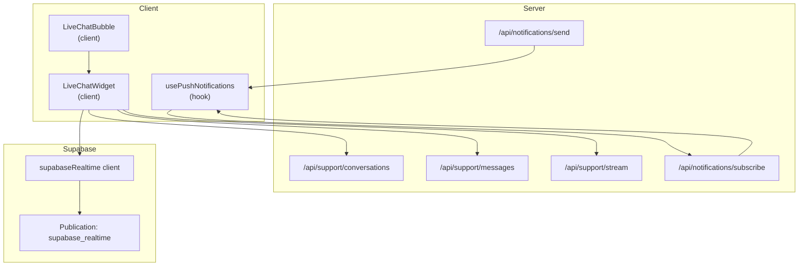
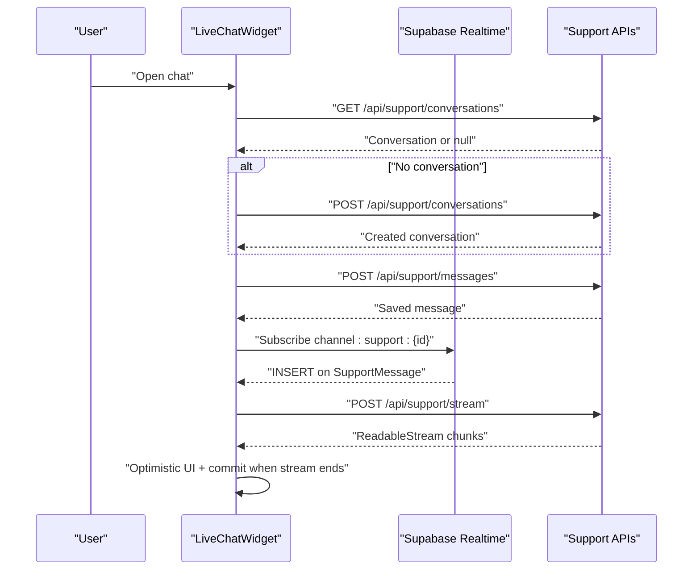
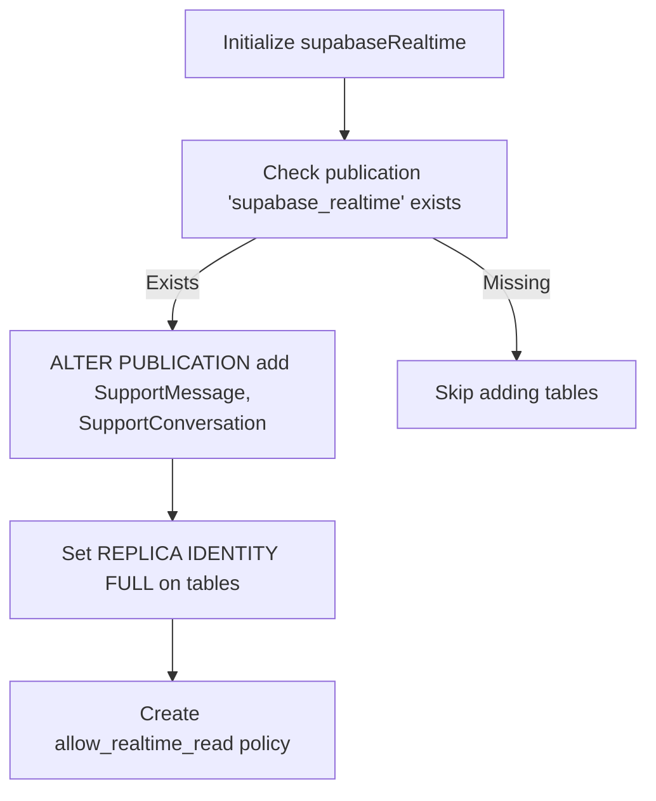
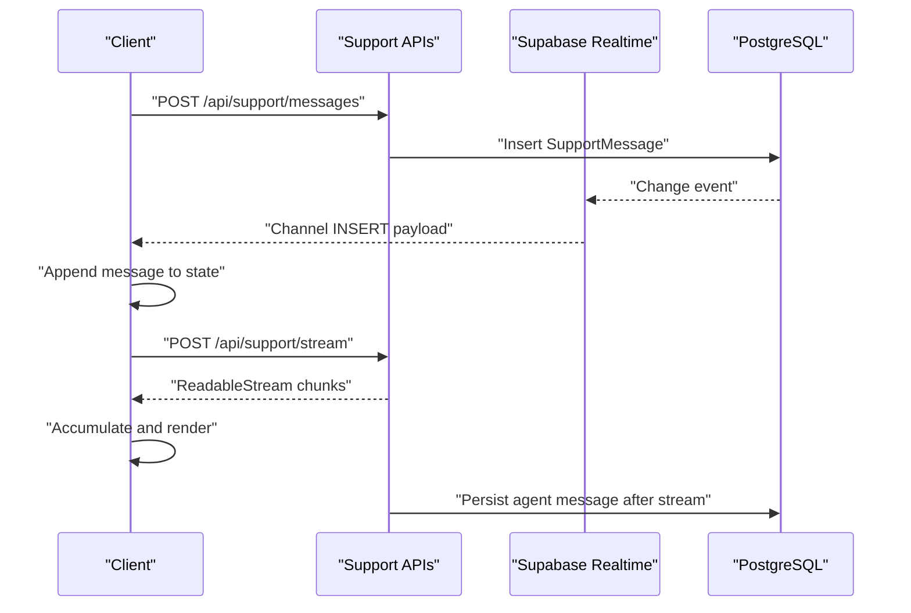
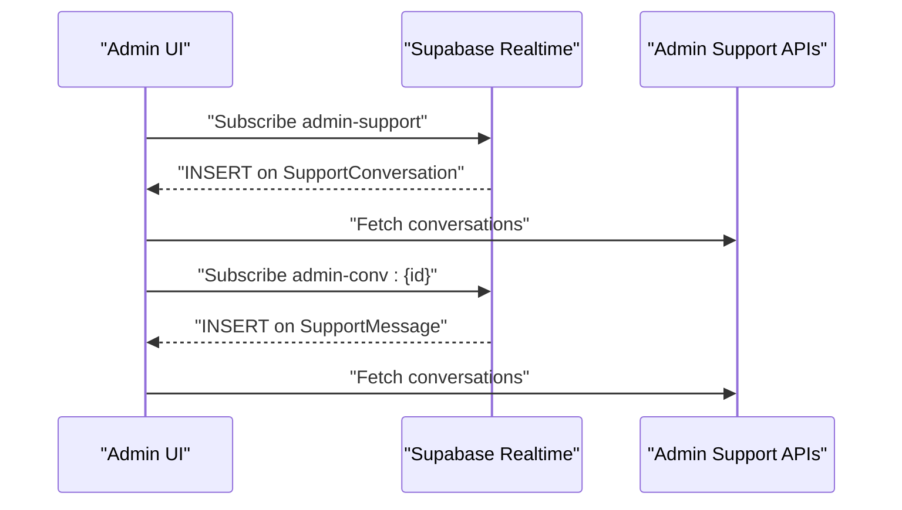
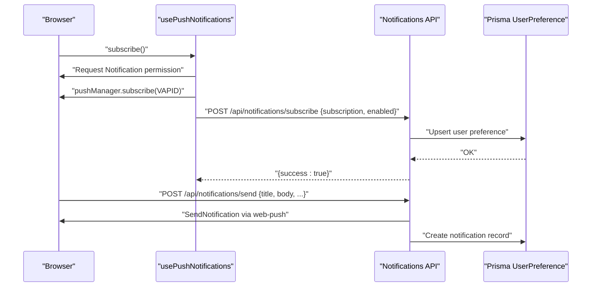
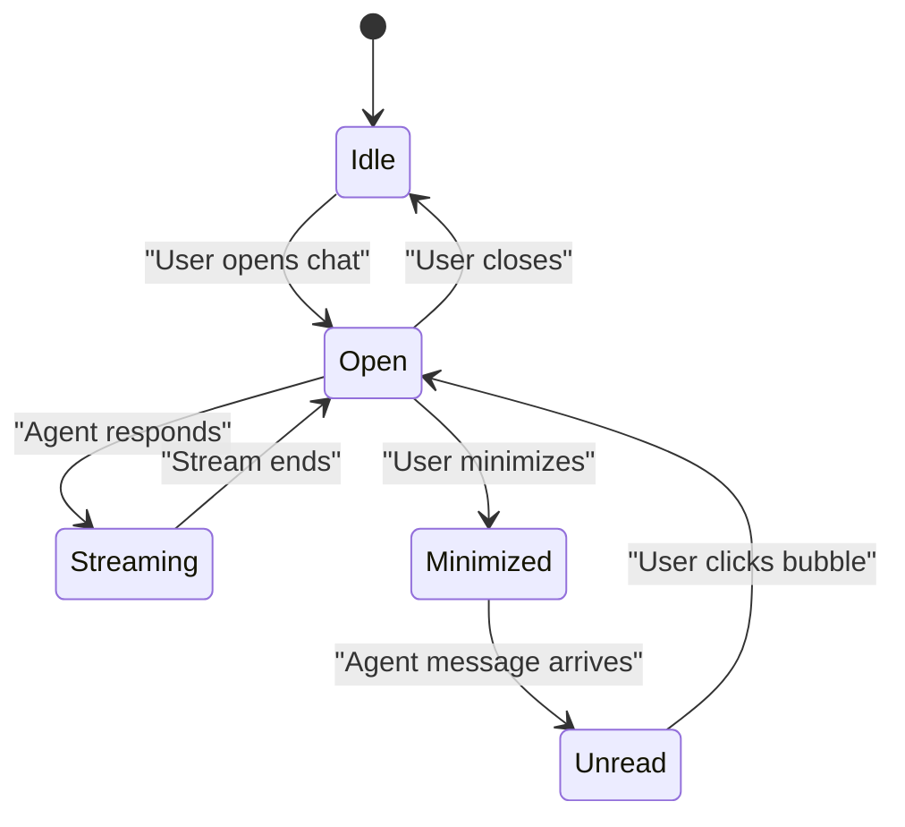
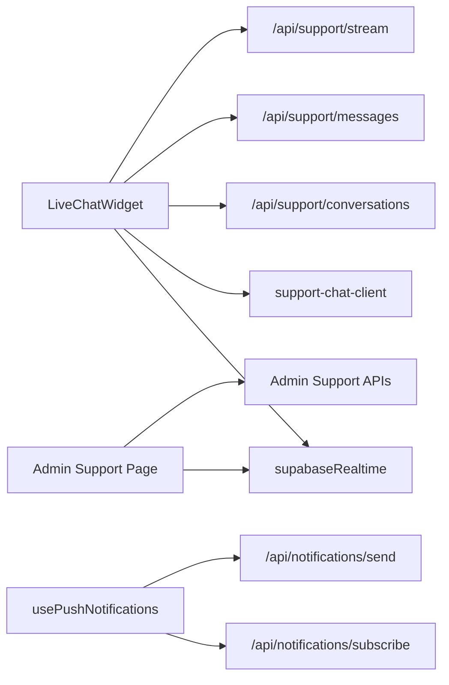

# Real-time Features

<cite>
**Referenced Files in This Document**
- [supabase-realtime.ts](file://src/lib/supabase-realtime.ts)
- [support-chat-client.ts](file://src/lib/support-chat-client.ts)
- [route.ts](file://src/app/api/support/conversations/route.ts)
- [route.ts](file://src/app/api/support/messages/route.ts)
- [route.ts](file://src/app/api/support/stream/route.ts)
- [live-chat-widget.tsx](file://src/components/dashboard/live-chat-widget.tsx)
- [live-chat-bubble.tsx](file://src/components/dashboard/live-chat-bubble.tsx)
- [page.tsx](file://src/app/admin/support/page.tsx)
- [use-push-notifications.ts](file://src/hooks/use-push-notifications.ts)
- [route.ts](file://src/app/api/notifications/subscribe/route.ts)
- [route.ts](file://src/app/api/notifications/send/route.ts)
- [market-data.ts](file://src/lib/market-data.ts)
- [20260219225243_enable_realtime_support_message/migration.sql](file://docs/archive/prisma-migrations-2026-03-17/20260219225243_enable_realtime_support_message/migration.sql)
- [20260219225409_support_message_realtime_full/migration.sql](file://docs/archive/prisma-migrations-2026-03-17/20260219225409_support_message_realtime_full/migration.sql)
</cite>

## Table of Contents
1. [Introduction](#introduction)
2. [Project Structure](#project-structure)
3. [Core Components](#core-components)
4. [Architecture Overview](#architecture-overview)
5. [Detailed Component Analysis](#detailed-component-analysis)
6. [Dependency Analysis](#dependency-analysis)
7. [Performance Considerations](#performance-considerations)
8. [Troubleshooting Guide](#troubleshooting-guide)
9. [Conclusion](#conclusion)

## Introduction
This document explains the real-time features implemented in the project, focusing on:
- Live chat support powered by Supabase Realtime and server-side streaming
- Push notification delivery via Web Push (VAPID)
- Real-time user presence indicators and unread signals
- Real-time state synchronization for chat and admin dashboards
- Practical interaction patterns and connection lifecycle management

Where applicable, the documentation references database migrations enabling Supabase publication for real-time events.

## Project Structure
The real-time stack spans client components, serverless API routes, and Supabase Realtime:
- Client-side chat widget and push notification hook
- Server routes for conversations, messages, and streaming AI replies
- Admin dashboard subscribing to real-time events
- Supabase client initialization and database migrations enabling real-time publications

**Diagram sources**
- [live-chat-widget.tsx:68-214](file://src/components/dashboard/live-chat-widget.tsx#L68-L214)
- [live-chat-bubble.tsx:32-91](file://src/components/dashboard/live-chat-bubble.tsx#L32-L91)
- [use-push-notifications.ts:27-107](file://src/hooks/use-push-notifications.ts#L27-L107)
- [route.ts:17-36](file://src/app/api/support/conversations/route.ts#L17-L36)
- [route.ts:13-63](file://src/app/api/support/messages/route.ts#L13-L63)
- [route.ts:31-175](file://src/app/api/support/stream/route.ts#L31-L175)
- [route.ts:9-41](file://src/app/api/notifications/subscribe/route.ts#L9-L41)
- [route.ts:27-74](file://src/app/api/notifications/send/route.ts#L27-L74)
- [supabase-realtime.ts:1-9](file://src/lib/supabase-realtime.ts#L1-L9)

**Section sources**
- [supabase-realtime.ts:1-9](file://src/lib/supabase-realtime.ts#L1-L9)
- [20260219225243_enable_realtime_support_message/migration.sql:1-10](file://docs/archive/prisma-migrations-2026-03-17/20260219225243_enable_realtime_support_message/migration.sql#L1-L10)
- [20260219225409_support_message_realtime_full/migration.sql:1-40](file://docs/archive/prisma-migrations-2026-03-17/20260219225409_support_message_realtime_full/migration.sql#L1-L40)

## Core Components
- Supabase Realtime client for PostgreSQL-based real-time events
- Live chat widget with optimistic UI, streaming replies, and Supabase channel subscriptions
- Push notification hook and server routes for subscription and delivery
- Admin dashboard with real-time updates for support conversations and messages
- Market data utilities for historical asset charts (non-realtime, but part of the data layer)

**Section sources**
- [supabase-realtime.ts:1-9](file://src/lib/supabase-realtime.ts#L1-L9)
- [live-chat-widget.tsx:68-214](file://src/components/dashboard/live-chat-widget.tsx#L68-L214)
- [use-push-notifications.ts:27-107](file://src/hooks/use-push-notifications.ts#L27-L107)
- [page.tsx:45-105](file://src/app/admin/support/page.tsx#L45-L105)
- [market-data.ts:23-112](file://src/lib/market-data.ts#L23-L112)

## Architecture Overview
The real-time architecture combines:
- Supabase Realtime for change-data-capture (CDC) on SupportConversation and SupportMessage tables
- Serverless API routes for chat orchestration and streaming
- Client components subscribing to Supabase channels and managing local state
- Web Push for browser notifications

**Diagram sources**
- [live-chat-widget.tsx:163-361](file://src/components/dashboard/live-chat-widget.tsx#L163-L361)
- [route.ts:17-67](file://src/app/api/support/conversations/route.ts#L17-L67)
- [route.ts:13-63](file://src/app/api/support/messages/route.ts#L13-L63)
- [route.ts:31-175](file://src/app/api/support/stream/route.ts#L31-L175)
- [supabase-realtime.ts:1-9](file://src/lib/supabase-realtime.ts#L1-L9)

## Detailed Component Analysis

### Supabase Realtime Integration
- Initializes a Supabase client using NEXT_PUBLIC_SUPABASE_URL and NEXT_PUBLIC_SUPABASE_ANON_KEY
- Enables real-time for SupportConversation and SupportMessage via database migrations that:
  - Add tables to the supabase_realtime publication
  - Set REPLICA IDENTITY to FULL
  - Enable row-level security and a policy allowing reads for real-time

**Diagram sources**
- [supabase-realtime.ts:1-9](file://src/lib/supabase-realtime.ts#L1-L9)
- [20260219225243_enable_realtime_support_message/migration.sql:1-10](file://docs/archive/prisma-migrations-2026-03-17/20260219225243_enable_realtime_support_message/migration.sql#L1-L10)
- [20260219225409_support_message_realtime_full/migration.sql:1-40](file://docs/archive/prisma-migrations-2026-03-17/20260219225409_support_message_realtime_full/migration.sql#L1-L40)

**Section sources**
- [supabase-realtime.ts:1-9](file://src/lib/supabase-realtime.ts#L1-L9)
- [20260219225243_enable_realtime_support_message/migration.sql:1-10](file://docs/archive/prisma-migrations-2026-03-17/20260219225243_enable_realtime_support_message/migration.sql#L1-L10)
- [20260219225409_support_message_realtime_full/migration.sql:1-40](file://docs/archive/prisma-migrations-2026-03-17/20260219225409_support_message_realtime_full/migration.sql#L1-L40)

### Live Chat Widget: Real-time Messaging and Streaming
- On mount, fetches or creates a user conversation
- Subscribes to a per-conversation Supabase channel for INSERT events on SupportMessage
- Implements optimistic UI: renders user messages immediately, replaces with persisted message after save
- Streams AI replies via a server route returning a streamed text response
- Skips rendering agent messages while streaming to avoid duplicates
- Provides typing indicators and voice transcription integration

**Diagram sources**
- [live-chat-widget.tsx:163-361](file://src/components/dashboard/live-chat-widget.tsx#L163-L361)
- [route.ts:13-63](file://src/app/api/support/messages/route.ts#L13-L63)
- [route.ts:31-175](file://src/app/api/support/stream/route.ts#L31-L175)
- [supabase-realtime.ts:1-9](file://src/lib/supabase-realtime.ts#L1-L9)

**Section sources**
- [live-chat-widget.tsx:68-214](file://src/components/dashboard/live-chat-widget.tsx#L68-L214)
- [support-chat-client.ts:22-82](file://src/lib/support-chat-client.ts#L22-L82)
- [route.ts:13-63](file://src/app/api/support/messages/route.ts#L13-L63)
- [route.ts:31-175](file://src/app/api/support/stream/route.ts#L31-L175)

### Admin Dashboard: Real-time Support Updates
- Subscribes to:
  - A global admin-support channel for new conversations
  - A per-conversation channel for new messages
- Uses Supabase channel filters to scope events to specific conversation IDs
- Fetches paginated conversations and merges new items as they arrive

**Diagram sources**
- [page.tsx:45-105](file://src/app/admin/support/page.tsx#L45-L105)
- [supabase-realtime.ts:1-9](file://src/lib/supabase-realtime.ts#L1-L9)

**Section sources**
- [page.tsx:45-105](file://src/app/admin/support/page.tsx#L45-L105)

### Push Notifications: Subscription and Delivery
- Browser hook:
  - Checks service worker and push manager availability
  - Requests permission and subscribes using VAPID public key
  - Sends subscription to server to enable notifications
- Server routes:
  - Subscribe: Upserts user preference with push subscription JSON and enabled flag
  - Send: Validates subscription, sends Web Push payload, records notification
- Environment:
  - Requires VAPID email, public, and private keys

**Diagram sources**
- [use-push-notifications.ts:27-107](file://src/hooks/use-push-notifications.ts#L27-L107)
- [route.ts:9-41](file://src/app/api/notifications/subscribe/route.ts#L9-L41)
- [route.ts:27-74](file://src/app/api/notifications/send/route.ts#L27-L74)

**Section sources**
- [use-push-notifications.ts:27-107](file://src/hooks/use-push-notifications.ts#L27-L107)
- [route.ts:9-41](file://src/app/api/notifications/subscribe/route.ts#L9-L41)
- [route.ts:27-74](file://src/app/api/notifications/send/route.ts#L27-L74)

### Real-time Presence and Unread Indicators
- The live chat bubble shows an unread indicator when minimized and an agent message arrives
- Admin UI highlights unread conversations and supports resolving them, reducing future unread counts

**Diagram sources**
- [live-chat-bubble.tsx:32-91](file://src/components/dashboard/live-chat-bubble.tsx#L32-L91)
- [live-chat-widget.tsx:180-214](file://src/components/dashboard/live-chat-widget.tsx#L180-L214)

**Section sources**
- [live-chat-bubble.tsx:32-91](file://src/components/dashboard/live-chat-bubble.tsx#L32-L91)
- [live-chat-widget.tsx:180-214](file://src/components/dashboard/live-chat-widget.tsx#L180-L214)

### Market Data Feeds (Non-realtime)
- Historical chart data retrieval for crypto assets using CoinGecko and Prisma-backed price history
- Not real-time; included here for completeness of the data layer

**Section sources**
- [market-data.ts:23-112](file://src/lib/market-data.ts#L23-L112)

## Dependency Analysis
- LiveChatWidget depends on:
  - Supabase Realtime client for channel subscriptions
  - Support chat client for conversation/message operations
  - Server routes for persistence and streaming
- Admin page depends on:
  - Supabase Realtime for live updates
  - Server routes for admin actions
- Push notification hook depends on:
  - Service worker and push manager
  - Server routes for subscription and delivery

**Diagram sources**
- [live-chat-widget.tsx:68-214](file://src/components/dashboard/live-chat-widget.tsx#L68-L214)
- [support-chat-client.ts:22-82](file://src/lib/support-chat-client.ts#L22-L82)
- [page.tsx:45-105](file://src/app/admin/support/page.tsx#L45-L105)
- [use-push-notifications.ts:27-107](file://src/hooks/use-push-notifications.ts#L27-L107)

**Section sources**
- [live-chat-widget.tsx:68-214](file://src/components/dashboard/live-chat-widget.tsx#L68-L214)
- [page.tsx:45-105](file://src/app/admin/support/page.tsx#L45-L105)
- [use-push-notifications.ts:27-107](file://src/hooks/use-push-notifications.ts#L27-L107)

## Performance Considerations
- Supabase Realtime
  - Use channel filters to reduce event volume (e.g., per conversationId)
  - Keep subscriptions minimal; remove channels on unmount
- Streaming AI Replies
  - Server streams tokens; client renders incrementally to minimize perceived latency
  - Abort previous streams when starting new ones to avoid race conditions
- Push Notifications
  - Validate and clean stale subscriptions (410/404) to prevent delivery failures
  - Batch or debounce frequent updates to reduce network overhead
- Client Rendering
  - Merge chronological arrays efficiently to avoid unnecessary sorts
  - Throttle scroll updates during streaming to maintain smooth UX

[No sources needed since this section provides general guidance]

## Troubleshooting Guide
- Supabase Realtime not receiving events
  - Verify supabase_realtime publication includes SupportConversation and SupportMessage
  - Confirm REPLICA IDENTITY FULL and allow_realtime_read policy are applied
- Chat does not reflect new messages
  - Ensure channel filters match conversationId
  - Check for exceptions during channel subscription and removal on unmount
- Push notifications fail
  - Confirm VAPID environment variables are set
  - Handle 410/404 responses by clearing stale subscriptions
- Rate limiting
  - Chat endpoints enforce plan-based limits; ensure users meet eligibility

**Section sources**
- [20260219225243_enable_realtime_support_message/migration.sql:1-10](file://docs/archive/prisma-migrations-2026-03-17/20260219225243_enable_realtime_support_message/migration.sql#L1-L10)
- [20260219225409_support_message_realtime_full/migration.sql:1-40](file://docs/archive/prisma-migrations-2026-03-17/20260219225409_support_message_realtime_full/migration.sql#L1-L40)
- [live-chat-widget.tsx:180-214](file://src/components/dashboard/live-chat-widget.tsx#L180-L214)
- [route.ts:61-70](file://src/app/api/notifications/send/route.ts#L61-L70)

## Conclusion
The project implements robust real-time capabilities centered on Supabase Realtime for chat updates, server-side streaming for AI replies, and Web Push for notifications. Client components manage optimistic UI and efficient state synchronization, while server routes enforce permissions, guardrails, and rate limits. Admin dashboards benefit from live updates through channel subscriptions. The documented patterns provide a blueprint for extending real-time features with minimal coupling and strong error handling.