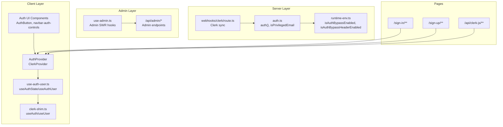
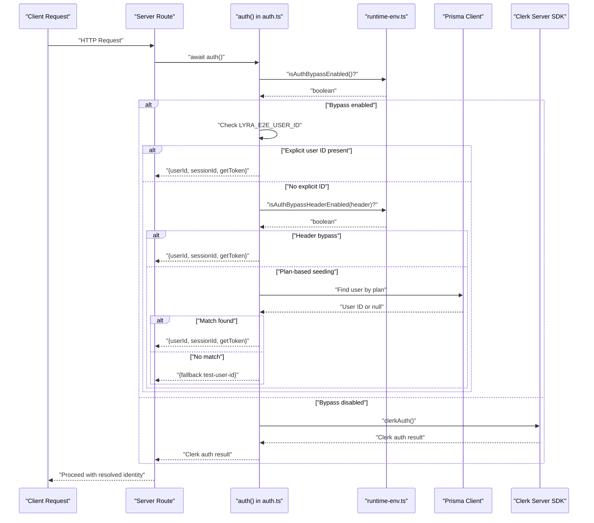
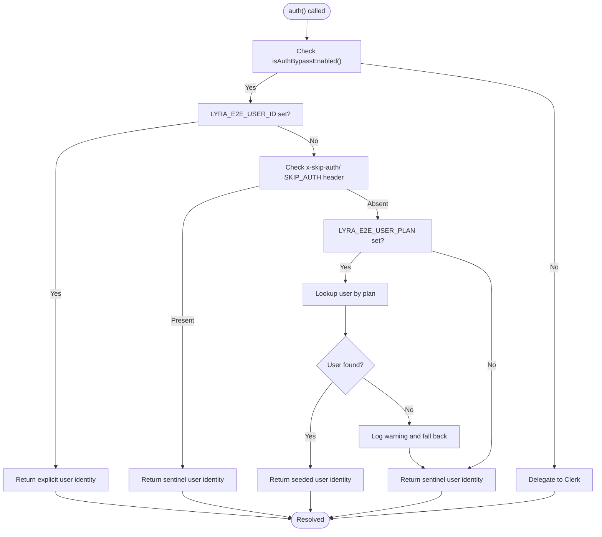
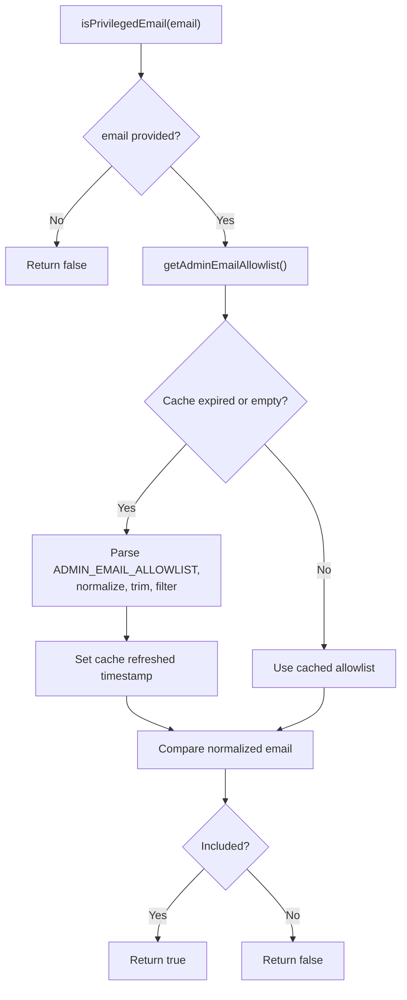
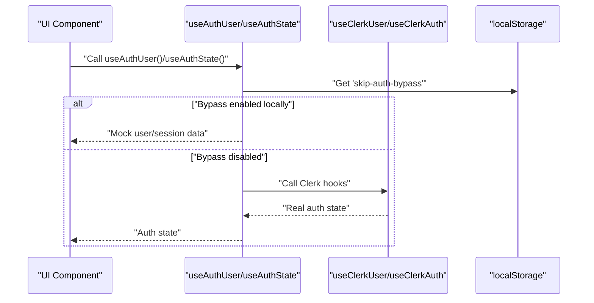
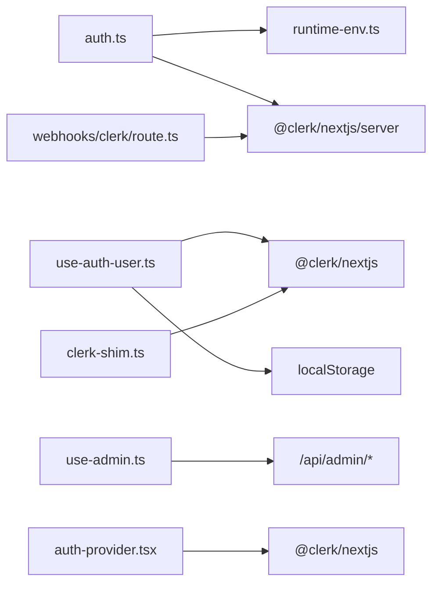

# Authentication & Authorization

<cite>
**Referenced Files in This Document**
- [src/lib/auth.ts](file://src/lib/auth.ts)
- [src/lib/clerk-shim.ts](file://src/lib/clerk-shim.ts)
- [src/providers/auth-provider.tsx](file://src/providers/auth-provider.tsx)
- [src/hooks/use-auth-user.ts](file://src/hooks/use-auth-user.ts)
- [src/hooks/use-admin.ts](file://src/hooks/use-admin.ts)
- [src/lib/runtime-env.ts](file://src/lib/runtime-env.ts)
- [src/app/api/clerk-js/route.ts](file://src/app/api/clerk-js/route.ts)
- [src/app/api/webhooks/clerk/route.ts](file://src/app/api/webhooks/clerk/route.ts)
- [src/app/api/admin/analytics/page.ts](file://src/app/api/admin/analytics/page.ts)
- [src/app/dashboard/layout.tsx](file://src/app/dashboard/layout.tsx)
- [src/app/admin/layout.tsx](file://src/app/admin/layout.tsx)
- [src/app/sign-in/[[...sign-in]]/page.tsx](file://src/app/sign-in/[[...sign-in]]/page.tsx)
- [src/app/sign-up/[[...sign-up]]/page.tsx](file://src/app/sign-up/[[...sign-up]]/page.tsx)
- [src/components/layout/AuthButton.tsx](file://src/components/layout/AuthButton.tsx)
- [src/components/layout/navbar-auth-controls.tsx](file://src/components/layout/navbar-auth-controls.tsx)
- [src/app/api/webhooks/clerk/__tests__/route.test.ts](file://src/app/api/webhooks/clerk/__tests__/route.test.ts)
- [e2e/auth-rate-limit-bypass.spec.ts](file://e2e/auth-rate-limit-bypass.spec.ts)
</cite>

## Table of Contents
1. [Introduction](#introduction)
2. [Project Structure](#project-structure)
3. [Core Components](#core-components)
4. [Architecture Overview](#architecture-overview)
5. [Detailed Component Analysis](#detailed-component-analysis)
6. [Dependency Analysis](#dependency-analysis)
7. [Performance Considerations](#performance-considerations)
8. [Troubleshooting Guide](#troubleshooting-guide)
9. [Conclusion](#conclusion)

## Introduction
This document explains the Authentication & Authorization system built on Clerk within this Next.js application. It covers session management, access control, the central auth() function, privileged email allowlist functionality, authentication bypass mechanisms for testing environments, and the memoized admin email cache system. Practical examples demonstrate authentication flows, session handling, and admin privilege verification, along with security considerations and configuration options for E2E testing and development.

## Project Structure
The authentication system spans several layers:
- Server-side authentication utilities and middleware integration
- Client-side Clerk provider and hooks
- Admin dashboard APIs and client hooks
- Webhook handlers for Clerk events
- Sign-in and sign-up pages
- Environment-driven bypass controls

**Diagram sources**
- [src/providers/auth-provider.tsx:1-12](file://src/providers/auth-provider.tsx#L1-L12)
- [src/hooks/use-auth-user.ts:1-69](file://src/hooks/use-auth-user.ts#L1-L69)
- [src/lib/clerk-shim.ts:1-33](file://src/lib/clerk-shim.ts#L1-L33)
- [src/lib/auth.ts:1-89](file://src/lib/auth.ts#L1-L89)
- [src/lib/runtime-env.ts:1-200](file://src/lib/runtime-env.ts#L1-L200)
- [src/app/api/webhooks/clerk/route.ts:1-200](file://src/app/api/webhooks/clerk/route.ts#L1-L200)
- [src/hooks/use-admin.ts:1-87](file://src/hooks/use-admin.ts#L1-L87)
- [src/app/api/admin/analytics/page.ts:1-200](file://src/app/api/admin/analytics/page.ts#L1-L200)
- [src/app/sign-in/[[...sign-in]]/page.tsx:1-200](file://src/app/sign-in/[[...sign-in]]/page.tsx#L1-L200)
- [src/app/sign-up/[[...sign-up]]/page.tsx:1-200](file://src/app/sign-up/[[...sign-up]]/page.tsx#L1-L200)
- [src/app/api/clerk-js/route.ts:1-200](file://src/app/api/clerk-js/route.ts#L1-L200)

**Section sources**
- [src/providers/auth-provider.tsx:1-12](file://src/providers/auth-provider.tsx#L1-L12)
- [src/lib/auth.ts:1-89](file://src/lib/auth.ts#L1-L89)
- [src/hooks/use-auth-user.ts:1-69](file://src/hooks/use-auth-user.ts#L1-L69)
- [src/lib/clerk-shim.ts:1-33](file://src/lib/clerk-shim.ts#L1-L33)
- [src/hooks/use-admin.ts:1-87](file://src/hooks/use-admin.ts#L1-L87)

## Core Components
- Central auth() function: Provides unified server-side authentication with Clerk or controlled bypass modes.
- Privileged email allowlist: Memoized admin email cache with TTL for role-based access checks.
- Client auth hooks: Clerk-based hooks with optional client-side bypass for local development.
- Admin dashboard hooks: SWR-based client hooks for admin analytics and operational data.
- Clerk provider and shim: Provider wrapper and client-facing convenience exports.
- Webhook handlers: Clerk event synchronization for user and session updates.

Key implementation references:
- [auth() function:32-88](file://src/lib/auth.ts#L32-L88)
- [isPrivilegedEmail() and memoized cache:15-30](file://src/lib/auth.ts#L15-L30)
- [Client auth hooks:34-68](file://src/hooks/use-auth-user.ts#L34-L68)
- [Admin SWR hooks:16-86](file://src/hooks/use-admin.ts#L16-L86)
- [Clerk provider:5-11](file://src/providers/auth-provider.tsx#L5-L11)
- [Clerk shim:15-32](file://src/lib/clerk-shim.ts#L15-L32)

**Section sources**
- [src/lib/auth.ts:15-88](file://src/lib/auth.ts#L15-L88)
- [src/hooks/use-auth-user.ts:16-68](file://src/hooks/use-auth-user.ts#L16-L68)
- [src/hooks/use-admin.ts:16-86](file://src/hooks/use-admin.ts#L16-L86)
- [src/providers/auth-provider.tsx:5-11](file://src/providers/auth-provider.tsx#L5-L11)
- [src/lib/clerk-shim.ts:15-32](file://src/lib/clerk-shim.ts#L15-L32)

## Architecture Overview
The system integrates Clerk for authentication while supporting controlled bypass modes for development and E2E testing. The auth() function orchestrates:
- Environment-driven bypass checks
- Plan-based user seeding via database lookup
- Deterministic user resolution for E2E stability
- Delegation to Clerk in normal operation

**Diagram sources**
- [src/lib/auth.ts:32-88](file://src/lib/auth.ts#L32-L88)
- [src/lib/runtime-env.ts:1-200](file://src/lib/runtime-env.ts#L1-L200)

## Detailed Component Analysis

### Central auth() Function
Responsibilities:
- Determine whether to bypass authentication based on environment flags and headers
- Resolve a deterministic user identity during bypass for E2E stability
- Optionally seed a user by plan via database lookup
- Delegate to Clerk in normal operation

Bypass priority order:
1. Explicit user ID via environment variable
2. Plan-based seeding via database lookup
3. Fallback sentinel user

Security considerations:
- Bypass mechanisms are gated by environment flags and headers
- Plan-based seeding requires explicit configuration and falls back safely
- Token and session identifiers returned during bypass are non-production values

**Diagram sources**
- [src/lib/auth.ts:32-88](file://src/lib/auth.ts#L32-L88)

**Section sources**
- [src/lib/auth.ts:32-88](file://src/lib/auth.ts#L32-L88)

### Privileged Email Allowlist and Memoized Admin Cache
The system supports role-based access control for administrative features by checking if a user’s email belongs to a privileged allowlist. To minimize repeated parsing and environment reads, the allowlist is cached with a time-to-live.

Key behaviors:
- Memoized allowlist with 5-minute TTL
- Case-normalized and trimmed entries
- Filtered empty entries
- O(1) membership checks against the allowlist

**Diagram sources**
- [src/lib/auth.ts:15-30](file://src/lib/auth.ts#L15-L30)

**Section sources**
- [src/lib/auth.ts:8-30](file://src/lib/auth.ts#L8-L30)

### Client-Side Authentication Hooks and Bypass
Client-side hooks wrap Clerk-provided hooks and optionally enable a local development bypass controlled by browser storage.

Highlights:
- Localhost detection and localStorage flag for enabling bypass
- Mock user object returned when bypass is active
- Graceful fallback to mock user if Clerk hook throws

**Diagram sources**
- [src/hooks/use-auth-user.ts:16-68](file://src/hooks/use-auth-user.ts#L16-L68)

**Section sources**
- [src/hooks/use-auth-user.ts:16-68](file://src/hooks/use-auth-user.ts#L16-L68)

### Clerk Provider and Shim
- Provider wraps the application with Clerk configuration and disables telemetry
- Shim re-exports Clerk components and convenience hooks for consistent imports

**Section sources**
- [src/providers/auth-provider.tsx:5-11](file://src/providers/auth-provider.tsx#L5-L11)
- [src/lib/clerk-shim.ts:15-32](file://src/lib/clerk-shim.ts#L15-L32)

### Admin Dashboard Access Control
Admin endpoints are protected and accessed via dedicated client hooks. The hooks use SWR for near-real-time data and structured error handling.

- Protected routes under admin dashboards
- Client hooks for analytics, usage, AI costs, and operational metrics
- Configurable refresh intervals optimized for admin workflows

**Section sources**
- [src/hooks/use-admin.ts:16-86](file://src/hooks/use-admin.ts#L16-L86)
- [src/app/admin/layout.tsx:1-200](file://src/app/admin/layout.tsx#L1-L200)

### Clerk Webhooks and Session Synchronization
Webhooks handle Clerk events to keep user and session state synchronized server-side. Tests validate webhook behavior.

**Section sources**
- [src/app/api/webhooks/clerk/route.ts:1-200](file://src/app/api/webhooks/clerk/route.ts#L1-L200)
- [src/app/api/webhooks/clerk/__tests__/route.test.ts:1-200](file://src/app/api/webhooks/clerk/__tests__/route.test.ts#L1-L200)

### Sign-In and Sign-Up Pages
Standard Clerk sign-in and sign-up pages integrate with the provider and redirect after authentication.

**Section sources**
- [src/app/sign-in/[[...sign-in]]/page.tsx:1-200](file://src/app/sign-in/[[...sign-in]]/page.tsx#L1-L200)
- [src/app/sign-up/[[...sign-up]]/page.tsx:1-200](file://src/app/sign-up/[[...sign-up]]/page.tsx#L1-L200)

## Dependency Analysis
The authentication system exhibits clear separation of concerns:
- Server utilities depend on environment configuration and Clerk SDK
- Client hooks depend on Clerk and local storage
- Admin hooks depend on server endpoints
- Webhooks depend on Clerk events and server-side persistence

**Diagram sources**
- [src/lib/auth.ts:1-89](file://src/lib/auth.ts#L1-L89)
- [src/lib/runtime-env.ts:1-200](file://src/lib/runtime-env.ts#L1-L200)
- [src/hooks/use-auth-user.ts:1-69](file://src/hooks/use-auth-user.ts#L1-L69)
- [src/hooks/use-admin.ts:1-87](file://src/hooks/use-admin.ts#L1-L87)
- [src/app/api/webhooks/clerk/route.ts:1-200](file://src/app/api/webhooks/clerk/route.ts#L1-L200)
- [src/providers/auth-provider.tsx:1-12](file://src/providers/auth-provider.tsx#L1-L12)
- [src/lib/clerk-shim.ts:1-33](file://src/lib/clerk-shim.ts#L1-L33)

**Section sources**
- [src/lib/auth.ts:1-89](file://src/lib/auth.ts#L1-L89)
- [src/hooks/use-auth-user.ts:1-69](file://src/hooks/use-auth-user.ts#L1-L69)
- [src/hooks/use-admin.ts:1-87](file://src/hooks/use-admin.ts#L1-L87)
- [src/providers/auth-provider.tsx:1-12](file://src/providers/auth-provider.tsx#L1-L12)
- [src/lib/clerk-shim.ts:1-33](file://src/lib/clerk-shim.ts#L1-L33)

## Performance Considerations
- Memoized admin email cache reduces repeated environment parsing and string normalization overhead
- Controlled bypass avoids unnecessary Clerk SDK calls in development and E2E scenarios
- Admin SWR hooks use tuned refresh intervals to balance freshness and load
- Webhook processing should remain lightweight to avoid blocking request handling

## Troubleshooting Guide
Common issues and resolutions:
- Authentication bypass not working:
  - Verify environment flags for bypass and header-based bypass
  - Confirm client-side localStorage flag for local development bypass
- Admin privilege not recognized:
  - Ensure ADMIN_EMAIL_ALLOWLIST is properly formatted and contains normalized emails
  - Check cache TTL and redeploy if necessary on platforms with immutable environment variables
- Clerk integration problems:
  - Review Clerk provider configuration and Clerk JS URL
  - Validate webhook endpoint and event delivery
- E2E testing anomalies:
  - Use explicit user ID or plan-based seeding for deterministic identities
  - Confirm rate limit bypass tests pass and environment is configured correctly

**Section sources**
- [src/lib/auth.ts:32-88](file://src/lib/auth.ts#L32-L88)
- [src/hooks/use-auth-user.ts:16-68](file://src/hooks/use-auth-user.ts#L16-L68)
- [src/lib/auth.ts:8-30](file://src/lib/auth.ts#L8-L30)
- [src/providers/auth-provider.tsx:5-11](file://src/providers/auth-provider.tsx#L5-L11)
- [src/app/api/webhooks/clerk/route.ts:1-200](file://src/app/api/webhooks/clerk/route.ts#L1-L200)
- [e2e/auth-rate-limit-bypass.spec.ts:1-200](file://e2e/auth-rate-limit-bypass.spec.ts#L1-L200)

## Conclusion
The authentication and authorization system combines Clerk for robust production-grade authentication with carefully scoped bypass mechanisms for development and E2E testing. The memoized admin email cache ensures efficient role-based access checks, while client-side hooks and admin SWR hooks provide a consistent developer experience. Security is maintained through explicit environment gating, deterministic fallbacks, and controlled delegation to Clerk in normal operation.