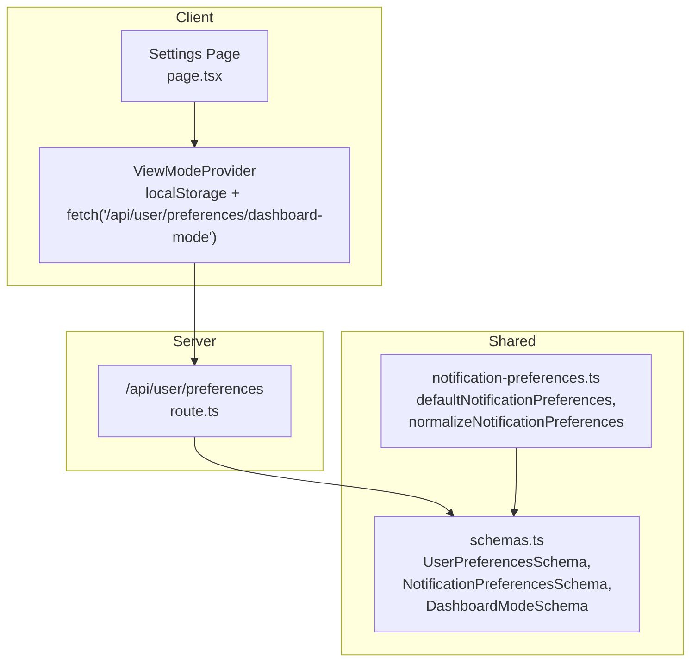
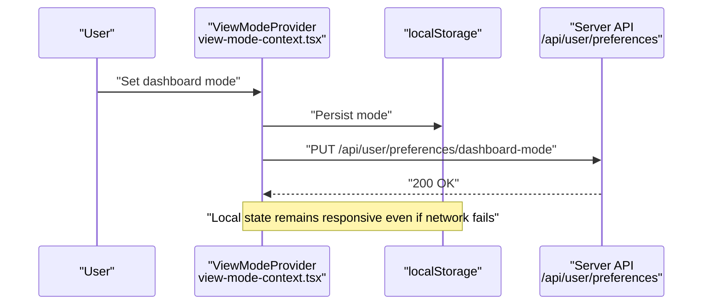
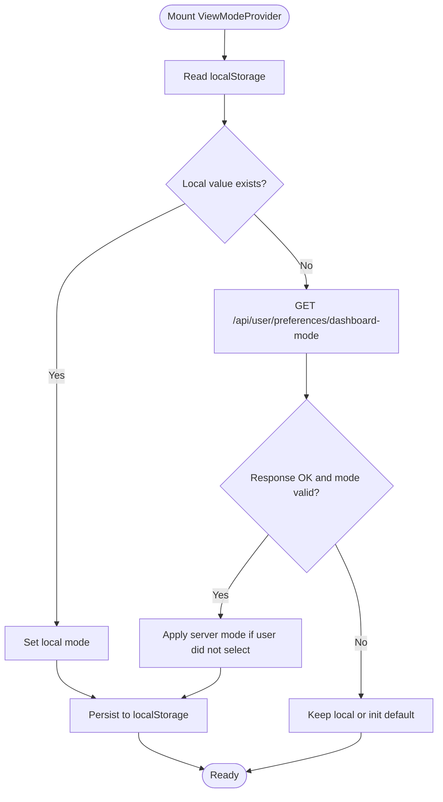
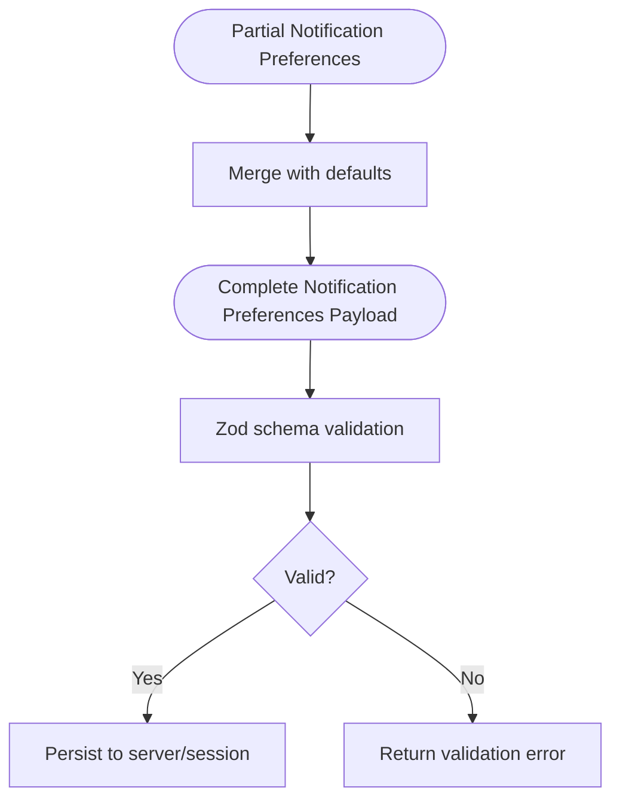
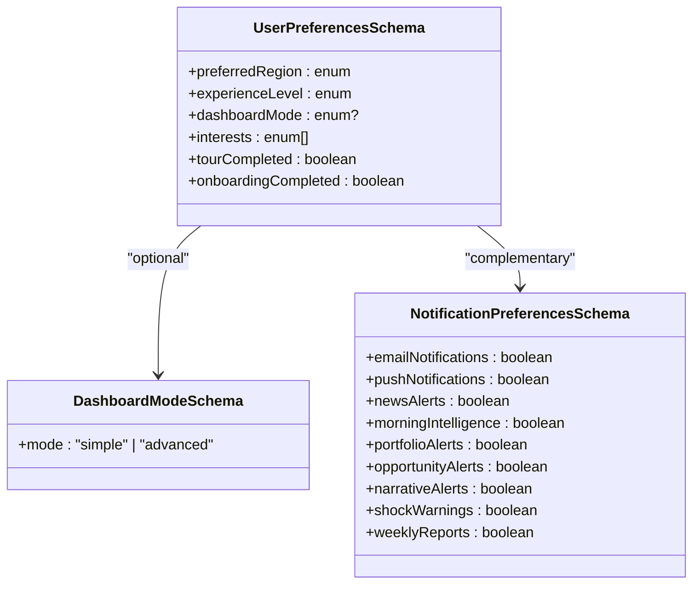
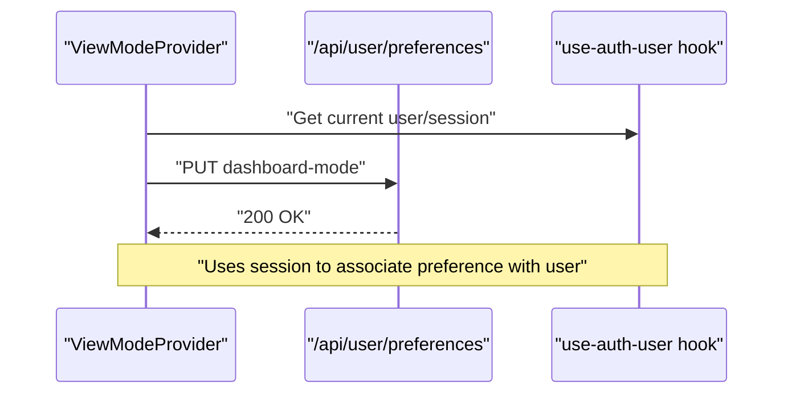
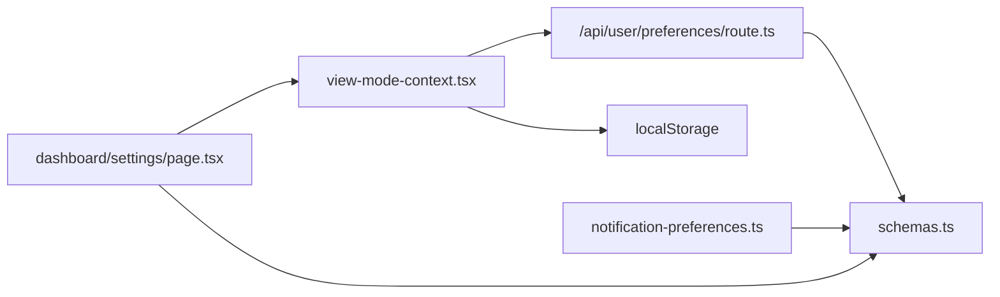

# Preferences & Settings

<cite>
**Referenced Files in This Document**
- [notification-preferences.ts](file://src/lib/notification-preferences.ts)
- [schemas.ts](file://src/lib/schemas.ts)
- [view-mode-context.tsx](file://src/components/dashboard/view-mode-context.tsx)
- [route.ts](file://src/app/api/user/preferences/route.ts)
- [page.tsx](file://src/app/dashboard/settings/page.tsx)
- [use-auth-user.ts](file://src/hooks/use-auth-user.ts)
</cite>

## Table of Contents
1. [Introduction](#introduction)
2. [Project Structure](#project-structure)
3. [Core Components](#core-components)
4. [Architecture Overview](#architecture-overview)
5. [Detailed Component Analysis](#detailed-component-analysis)
6. [Dependency Analysis](#dependency-analysis)
7. [Performance Considerations](#performance-considerations)
8. [Troubleshooting Guide](#troubleshooting-guide)
9. [Conclusion](#conclusion)

## Introduction
This document explains how user preferences and settings are modeled, validated, stored, and synchronized in the application. It focuses on:
- Preference categories: blog subscription, notification preferences, and dashboard mode
- Validation via schema-driven approaches
- Persistence across browser storage and server-side user preferences
- Synchronization with user sessions and default value handling
- Examples of preference updates and inheritance patterns

## Project Structure
The preferences system spans client-side contexts, server routes, and shared schemas:
- Client-side contexts manage user-facing preferences (e.g., dashboard view mode)
- Server routes persist preferences per user session
- Shared schemas define validation rules and defaults

**Diagram sources**
- [view-mode-context.tsx:1-122](file://src/components/dashboard/view-mode-context.tsx#L1-L122)
- [route.ts](file://src/app/api/user/preferences/route.ts)
- [schemas.ts:177-205](file://src/lib/schemas.ts#L177-L205)
- [notification-preferences.ts:1-35](file://src/lib/notification-preferences.ts#L1-L35)
- [page.tsx](file://src/app/dashboard/settings/page.tsx)

**Section sources**
- [view-mode-context.tsx:1-122](file://src/components/dashboard/view-mode-context.tsx#L1-L122)
- [route.ts](file://src/app/api/user/preferences/route.ts)
- [schemas.ts:177-205](file://src/lib/schemas.ts#L177-L205)
- [notification-preferences.ts:1-35](file://src/lib/notification-preferences.ts#L1-L35)
- [page.tsx](file://src/app/dashboard/settings/page.tsx)

## Core Components
- Dashboard view mode: A client-side context that reads/writes a simple preference and synchronizes with server-backed preferences.
- Notification preferences: Defaults and normalization logic for a set of toggles.
- User preferences schema: Centralized validation for user-facing preferences including dashboard mode, experience level, and interests.
- Settings page: Surface for updating preferences and observing current values.

**Section sources**
- [view-mode-context.tsx:1-122](file://src/components/dashboard/view-mode-context.tsx#L1-L122)
- [notification-preferences.ts:1-35](file://src/lib/notification-preferences.ts#L1-L35)
- [schemas.ts:177-205](file://src/lib/schemas.ts#L177-L205)
- [page.tsx](file://src/app/dashboard/settings/page.tsx)

## Architecture Overview
The preferences pipeline combines immediate client-side persistence with eventual server synchronization:
- Local-first UX: Values are persisted to localStorage immediately upon change
- Server sync: An API endpoint persists the preference server-side for future sessions
- Conflict resolution: If the user hasn’t explicitly changed the value during the session, the server’s value overrides the local one

**Diagram sources**
- [view-mode-context.tsx:32-56](file://src/components/dashboard/view-mode-context.tsx#L32-L56)
- [view-mode-context.tsx:73-100](file://src/components/dashboard/view-mode-context.tsx#L73-L100)
- [route.ts](file://src/app/api/user/preferences/route.ts)

## Detailed Component Analysis

### Dashboard Mode Preferences
- Purpose: Allow users to toggle between simple and advanced dashboard modes
- Storage:
  - Local: Stored in localStorage under a dedicated key
  - Server: Persisted via a dedicated API endpoint for the current user session
- Synchronization:
  - On mount, the provider loads the server preference if not overridden by the user
  - If the user has not explicitly selected a mode, the server value replaces the local one
- Defaults:
  - Initial mode is provided by the provider; otherwise defaults to a safe fallback

**Diagram sources**
- [view-mode-context.tsx:58-105](file://src/components/dashboard/view-mode-context.tsx#L58-L105)

**Section sources**
- [view-mode-context.tsx:1-122](file://src/components/dashboard/view-mode-context.tsx#L1-L122)

### Notification Preferences
- Defaults: A predefined set of toggles with sensible defaults
- Normalization: Merges partial updates with defaults to produce a complete payload
- Validation: A strict schema enforces boolean values for each toggle

**Diagram sources**
- [notification-preferences.ts:27-34](file://src/lib/notification-preferences.ts#L27-L34)
- [schemas.ts:195-205](file://src/lib/schemas.ts#L195-L205)

**Section sources**
- [notification-preferences.ts:1-35](file://src/lib/notification-preferences.ts#L1-L35)
- [schemas.ts:195-205](file://src/lib/schemas.ts#L195-L205)

### User Preferences Schema and Categories
- Categories covered:
  - Preferred region and experience level
  - Dashboard mode (optional)
  - Interests (validated enum array)
  - Tour and onboarding completion flags
- Validation ensures:
  - Enum constraints for regions, experience levels, and interest sets
  - Optional dashboard mode with a dedicated schema
  - Defaults for booleans and numeric limits

**Diagram sources**
- [schemas.ts:177-205](file://src/lib/schemas.ts#L177-L205)

**Section sources**
- [schemas.ts:177-205](file://src/lib/schemas.ts#L177-L205)

### Settings Page Integration
- The settings page serves as the primary surface for users to view and update preferences
- It integrates with the dashboard view mode context and other preference systems
- Uses the shared schemas for validation and rendering

**Section sources**
- [page.tsx](file://src/app/dashboard/settings/page.tsx)

### Session and API Integration
- The server route handles persistence of user preferences
- The client provider communicates with the route to synchronize preferences
- The auth hook provides the current user context for session-bound updates

**Diagram sources**
- [view-mode-context.tsx:32-56](file://src/components/dashboard/view-mode-context.tsx#L32-L56)
- [route.ts](file://src/app/api/user/preferences/route.ts)
- [use-auth-user.ts](file://src/hooks/use-auth-user.ts)

**Section sources**
- [view-mode-context.tsx:1-122](file://src/components/dashboard/view-mode-context.tsx#L1-L122)
- [route.ts](file://src/app/api/user/preferences/route.ts)
- [use-auth-user.ts](file://src/hooks/use-auth-user.ts)

## Dependency Analysis
- Client-side context depends on:
  - localStorage for immediate persistence
  - Server API for cross-session synchronization
- Server route depends on:
  - Authentication context to identify the user
  - Shared schemas for validation
- Shared schemas unify validation across client and server

**Diagram sources**
- [view-mode-context.tsx:1-122](file://src/components/dashboard/view-mode-context.tsx#L1-L122)
- [route.ts](file://src/app/api/user/preferences/route.ts)
- [schemas.ts:177-205](file://src/lib/schemas.ts#L177-L205)
- [notification-preferences.ts:1-35](file://src/lib/notification-preferences.ts#L1-L35)
- [page.tsx](file://src/app/dashboard/settings/page.tsx)

**Section sources**
- [view-mode-context.tsx:1-122](file://src/components/dashboard/view-mode-context.tsx#L1-L122)
- [route.ts](file://src/app/api/user/preferences/route.ts)
- [schemas.ts:177-205](file://src/lib/schemas.ts#L177-L205)
- [notification-preferences.ts:1-35](file://src/lib/notification-preferences.ts#L1-L35)
- [page.tsx](file://src/app/dashboard/settings/page.tsx)

## Performance Considerations
- Local-first UX: Immediate writes to localStorage avoid network latency and improve responsiveness
- Graceful degradation: Network failures do not block UI; local state remains usable
- Efficient server sync: PUT requests are small and idempotent, minimizing bandwidth
- Validation close to the boundary: Zod schemas prevent invalid data from entering the system

## Troubleshooting Guide
- Dashboard mode not sticking:
  - Verify localStorage availability and permissions
  - Confirm the server endpoint responds and returns a valid mode
  - Ensure the user has not explicitly selected a mode during the session
- Notification preferences not applying:
  - Check that the payload merges with defaults correctly
  - Validate against the notification preferences schema
- Settings page not reflecting server values:
  - Confirm the session is established and the auth hook returns the current user
  - Ensure the API route associates preferences with the active session

**Section sources**
- [view-mode-context.tsx:32-56](file://src/components/dashboard/view-mode-context.tsx#L32-L56)
- [view-mode-context.tsx:73-100](file://src/components/dashboard/view-mode-context.tsx#L73-L100)
- [notification-preferences.ts:27-34](file://src/lib/notification-preferences.ts#L27-L34)
- [schemas.ts:195-205](file://src/lib/schemas.ts#L195-L205)
- [use-auth-user.ts](file://src/hooks/use-auth-user.ts)

## Conclusion
The preferences system balances immediate user control with reliable server-side persistence. By combining client-side localStorage with server synchronization, it delivers a responsive and consistent experience. Centralized schemas ensure robust validation and predictable behavior across the application.