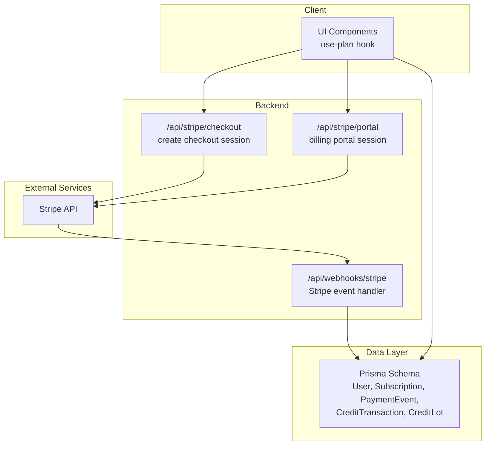
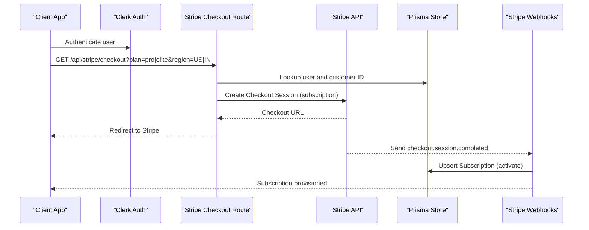
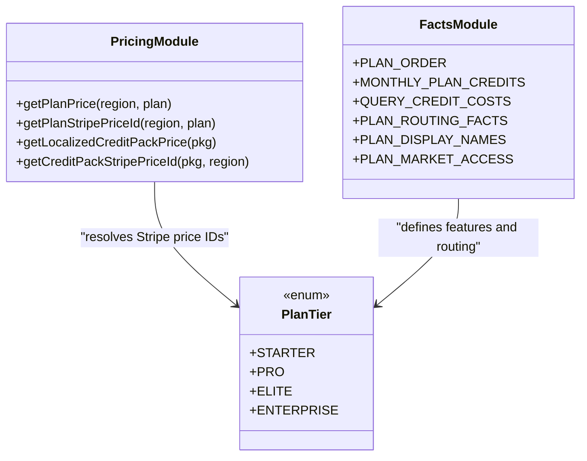
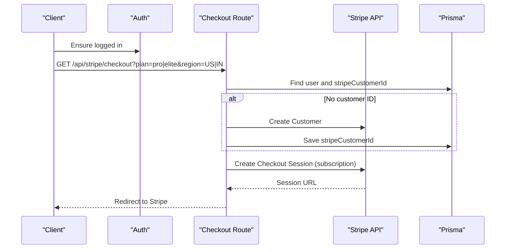
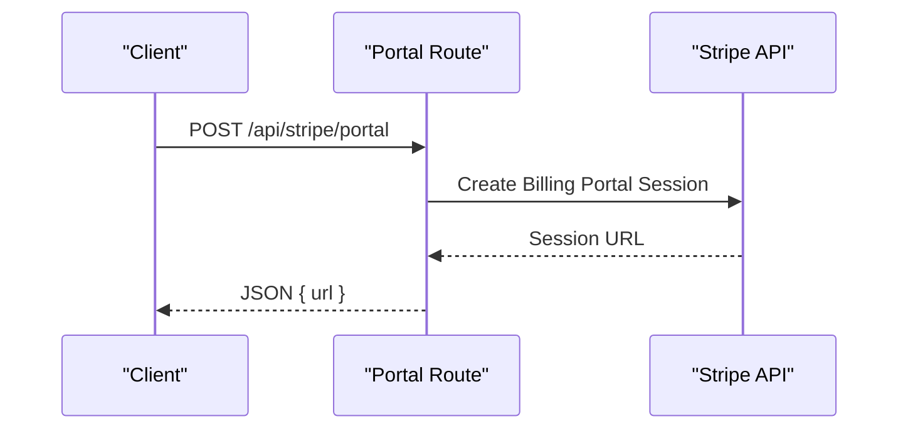
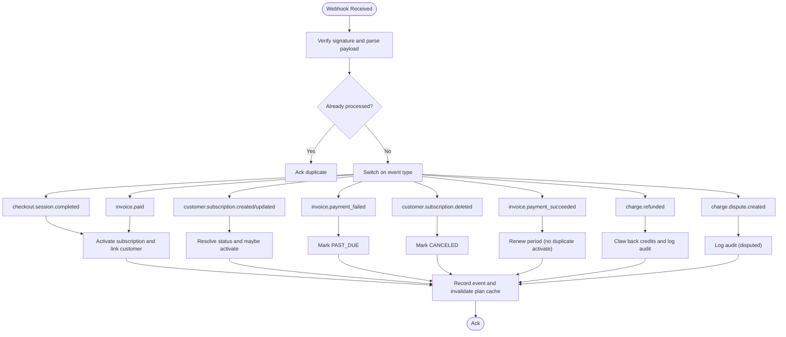
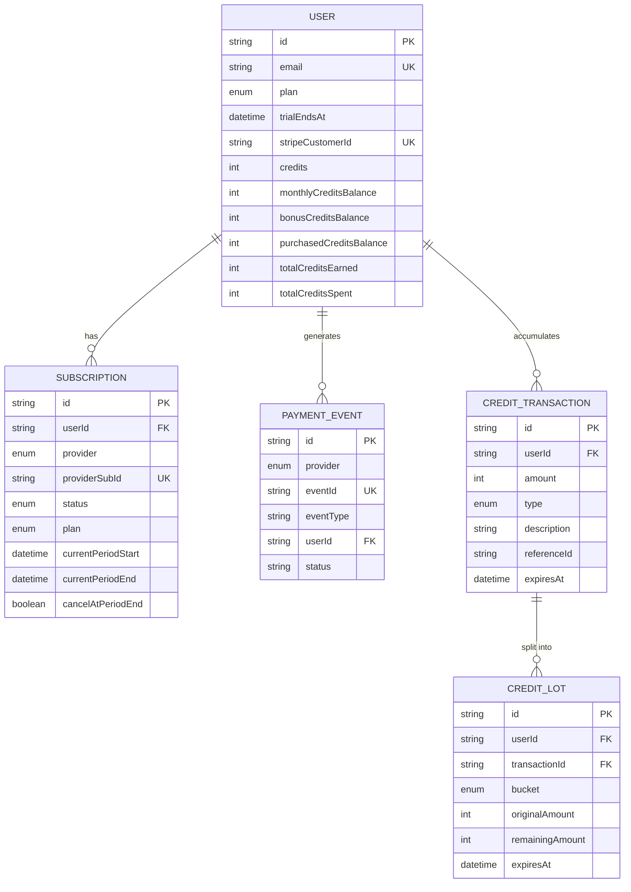
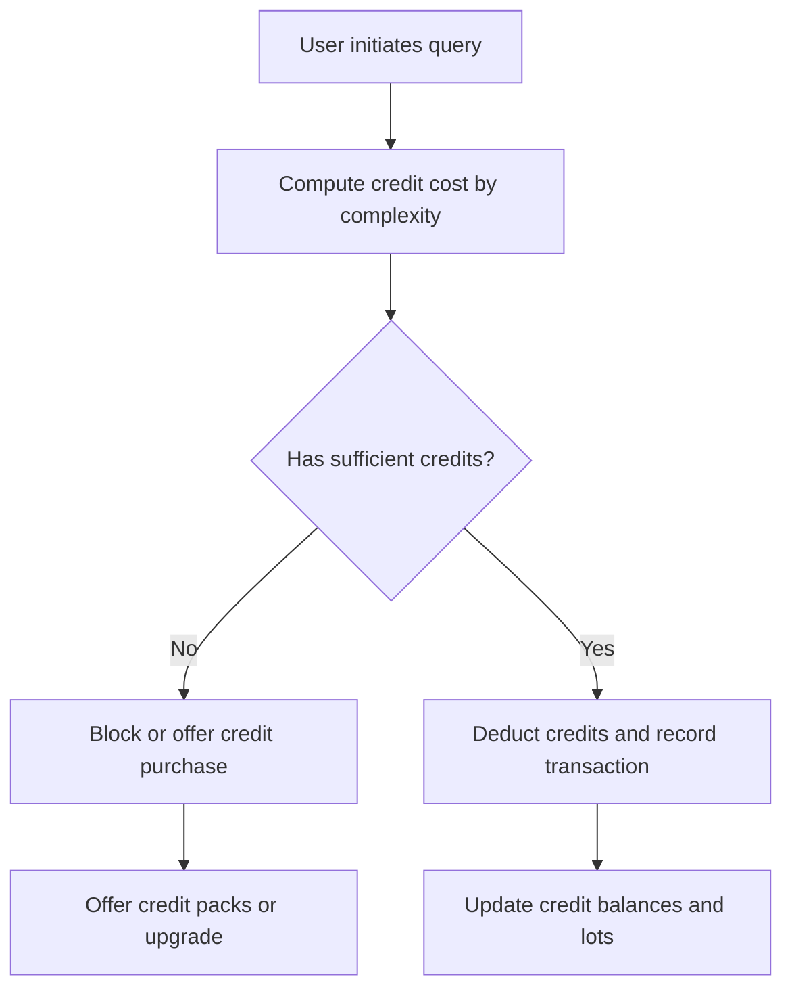
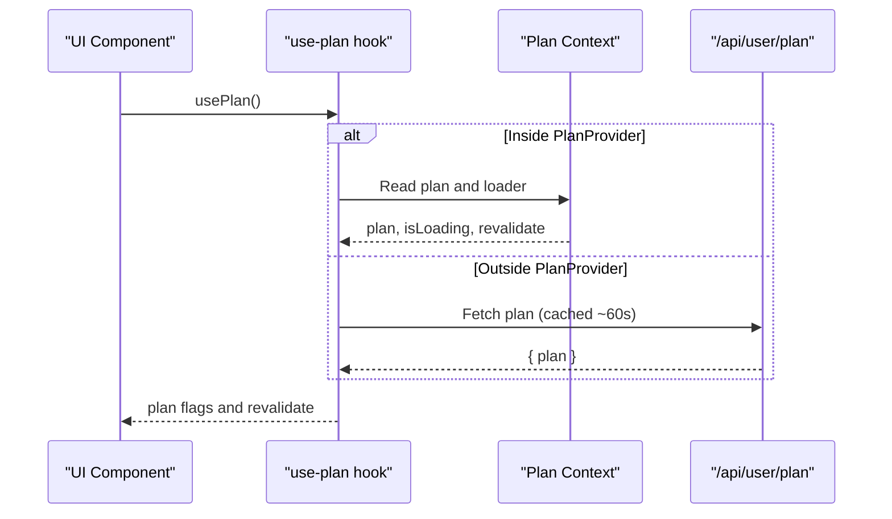
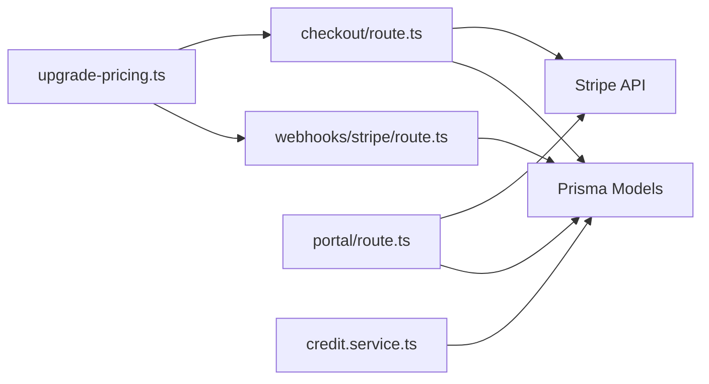

# Subscription Plans & Billing

<cite>
**Referenced Files in This Document**
- [TieredPlans.md](file://docs/docs2/TieredPlans.md)
- [schema.prisma](file://prisma/schema.prisma)
- [facts.ts](file://src/lib/plans/facts.ts)
- [upgrade-pricing.ts](file://src/lib/billing/upgrade-pricing.ts)
- [route.ts (Stripe Webhooks)](file://src/app/api/webhooks/stripe/route.ts)
- [route.ts (Stripe Checkout)](file://src/app/api/stripe/checkout/route.ts)
- [route.ts (Stripe Portal)](file://src/app/api/stripe/portal/route.ts)
- [credit.service.ts](file://src/lib/services/credit.service.ts)
- [use-plan.ts](file://src/hooks/use-plan.ts)
</cite>

## Table of Contents
1. [Introduction](#introduction)
2. [Project Structure](#project-structure)
3. [Core Components](#core-components)
4. [Architecture Overview](#architecture-overview)
5. [Detailed Component Analysis](#detailed-component-analysis)
6. [Dependency Analysis](#dependency-analysis)
7. [Performance Considerations](#performance-considerations)
8. [Troubleshooting Guide](#troubleshooting-guide)
9. [Conclusion](#conclusion)

## Introduction
This document explains the subscription plan management and billing integration for the platform. It covers plan tiers (Starter, Pro, Elite, Enterprise), Stripe payment processing, subscription lifecycle management, plan switching workflows, billing portal integration, and the credit-based access system. It also documents plan features, pricing structures, and billing automation patterns, with references to the authoritative implementation.

## Project Structure
The subscription and billing system spans documentation, Prisma models, client hooks, and backend APIs:
- Plan definitions and pricing are defined in TypeScript modules and documented in Markdown.
- Prisma models define plan tiers, subscriptions, payment events, and credit accounting.
- Stripe integration consists of a checkout session creator, a billing portal session creator, and a webhook handler.
- Credit usage and reset logic is centralized in a dedicated service.

**Diagram sources**
- [route.ts (Stripe Checkout):1-108](file://src/app/api/stripe/checkout/route.ts#L1-L108)
- [route.ts (Stripe Portal):1-48](file://src/app/api/stripe/portal/route.ts#L1-L48)
- [route.ts (Stripe Webhooks):1-430](file://src/app/api/webhooks/stripe/route.ts#L1-L430)
- [schema.prisma:396-533](file://prisma/schema.prisma#L396-L533)

**Section sources**
- [TieredPlans.md:1-241](file://docs/docs2/TieredPlans.md#L1-L241)
- [schema.prisma:396-533](file://prisma/schema.prisma#L396-L533)

## Core Components
- Plan tiers and feature matrix: documented in Markdown and backed by runtime constants and routing facts.
- Pricing and Stripe price IDs: resolved via a pricing module with environment-driven overrides.
- Subscription lifecycle: modeled in Prisma and orchestrated by Stripe webhooks.
- Credit system: monthly credits, query costs, and credit packages tracked via transactions and lots.
- Client-facing plan access: exposed via a React hook that reads plan state from context or API.

**Section sources**
- [TieredPlans.md:11-241](file://docs/docs2/TieredPlans.md#L11-L241)
- [facts.ts:1-115](file://src/lib/plans/facts.ts#L1-L115)
- [upgrade-pricing.ts:1-73](file://src/lib/billing/upgrade-pricing.ts#L1-L73)
- [schema.prisma:396-616](file://prisma/schema.prisma#L396-L616)
- [use-plan.ts:1-46](file://src/hooks/use-plan.ts#L1-L46)

## Architecture Overview
The billing architecture integrates Clerk-managed identity with Stripe for payments and subscriptions, and Prisma for durable state. The flow:
- Users initiate checkout via the Stripe checkout route, which creates a Stripe Checkout session and persists a Stripe customer ID.
- Stripe sends webhook events to the webhook handler, which idempotently updates subscription and credit state.
- The billing portal route generates a customer billing portal session for managing payment methods and subscriptions.
- The client reads plan state via a hook that either consumes a plan context or polls the user plan endpoint.

**Diagram sources**
- [route.ts (Stripe Checkout):1-108](file://src/app/api/stripe/checkout/route.ts#L1-L108)
- [route.ts (Stripe Webhooks):163-238](file://src/app/api/webhooks/stripe/route.ts#L163-L238)
- [schema.prisma:499-517](file://prisma/schema.prisma#L499-L517)

## Detailed Component Analysis

### Plan Tiers, Features, and Pricing
- Plan tiers: STARTER, PRO, ELITE, ENTERPRISE.
- Feature matrix and model routing are documented and enforced by runtime logic.
- Pricing is region- and plan-specific; Stripe price IDs are resolved from environment variables with fallbacks.
- Credit packs are available for one-time credit purchases; pricing is localized for display.

**Diagram sources**
- [upgrade-pricing.ts:1-73](file://src/lib/billing/upgrade-pricing.ts#L1-L73)
- [facts.ts:1-115](file://src/lib/plans/facts.ts#L1-L115)
- [TieredPlans.md:11-241](file://docs/docs2/TieredPlans.md#L11-L241)

**Section sources**
- [TieredPlans.md:11-241](file://docs/docs2/TieredPlans.md#L11-L241)
- [facts.ts:1-115](file://src/lib/plans/facts.ts#L1-L115)
- [upgrade-pricing.ts:1-73](file://src/lib/billing/upgrade-pricing.ts#L1-L73)

### Stripe Checkout Integration
- Validates user auth, constructs a Stripe Checkout session for a selected plan and region, and redirects to Stripe.
- Persists a Stripe customer ID on the user record to enable billing portal and webhook resolution.
- Supports promotion codes and automatic billing address collection.

**Diagram sources**
- [route.ts (Stripe Checkout):19-107](file://src/app/api/stripe/checkout/route.ts#L19-L107)

**Section sources**
- [route.ts (Stripe Checkout):1-108](file://src/app/api/stripe/checkout/route.ts#L1-L108)

### Stripe Billing Portal Integration
- Generates a customer billing portal session for managing payment methods, subscriptions, and invoices.
- Returns a URL that the client navigates to.

**Diagram sources**
- [route.ts (Stripe Portal):18-47](file://src/app/api/stripe/portal/route.ts#L18-L47)

**Section sources**
- [route.ts (Stripe Portal):1-48](file://src/app/api/stripe/portal/route.ts#L1-L48)

### Stripe Webhook Lifecycle Management
- Verifies webhook signatures and enforces idempotency.
- Handles key events:
  - checkout.session.completed: activate subscription and link customer to user
  - invoice.paid: provision subscription for renewals
  - invoice.payment_failed: mark subscription as past_due
  - customer.subscription.*: handle creation, updates, cancellation, and trial end
  - invoice.payment_succeeded: edge-case renewal tracking
  - charge.refunded: claw back credits and log audit
  - charge.dispute.created: log audit and require action
- Updates plan caches and records billing audit logs.

**Diagram sources**
- [route.ts (Stripe Webhooks):123-429](file://src/app/api/webhooks/stripe/route.ts#L123-L429)

**Section sources**
- [route.ts (Stripe Webhooks):1-430](file://src/app/api/webhooks/stripe/route.ts#L1-L430)

### Subscription Data Model
Prisma models capture plan tiers, subscription status, payment events, and credit accounting. Key entities:
- User: plan, trialEndsAt, stripeCustomerId, credit balances
- Subscription: provider, providerSubId, status, plan, period dates
- PaymentEvent: provider, eventId, eventType, payload
- CreditTransaction and CreditLot: credit buckets, expirations, and usage tracking

**Diagram sources**
- [schema.prisma:396-616](file://prisma/schema.prisma#L396-L616)

**Section sources**
- [schema.prisma:396-616](file://prisma/schema.prisma#L396-L616)

### Credit-Based Access System
- Monthly credits reset per plan tier and are consumed by queries based on complexity.
- Credit packages can be purchased as one-time payments; credits are recorded with reference IDs for audit and refund handling.
- Credit lots track bucketed credits (monthly, bonus, purchased) and expirations.

**Diagram sources**
- [TieredPlans.md:66-127](file://docs/docs2/TieredPlans.md#L66-L127)
- [credit.service.ts](file://src/lib/services/credit.service.ts)

**Section sources**
- [TieredPlans.md:66-127](file://docs/docs2/TieredPlans.md#L66-L127)
- [schema.prisma:604-616](file://prisma/schema.prisma#L604-L616)

### Client Plan Access Hook
- Provides plan state to UI components, preferring a plan context when available or fetching via SWR otherwise.
- Revalidates periodically to reflect subscription changes.

**Diagram sources**
- [use-plan.ts:19-45](file://src/hooks/use-plan.ts#L19-L45)

**Section sources**
- [use-plan.ts:1-46](file://src/hooks/use-plan.ts#L1-L46)

## Dependency Analysis
- Pricing depends on environment variables for Stripe price IDs and region-specific labels.
- Webhooks depend on Stripe secret keys and webhook secrets; they enforce idempotency and update Prisma models.
- Checkout depends on Clerk for user context and Prisma to persist customer IDs.
- Credit logic depends on Prisma credit transactions and lots.

**Diagram sources**
- [upgrade-pricing.ts:1-73](file://src/lib/billing/upgrade-pricing.ts#L1-L73)
- [route.ts (Stripe Checkout):1-108](file://src/app/api/stripe/checkout/route.ts#L1-L108)
- [route.ts (Stripe Webhooks):1-430](file://src/app/api/webhooks/stripe/route.ts#L1-L430)
- [route.ts (Stripe Portal):1-48](file://src/app/api/stripe/portal/route.ts#L1-L48)
- [schema.prisma:396-616](file://prisma/schema.prisma#L396-L616)

**Section sources**
- [upgrade-pricing.ts:1-73](file://src/lib/billing/upgrade-pricing.ts#L1-L73)
- [route.ts (Stripe Checkout):1-108](file://src/app/api/stripe/checkout/route.ts#L1-L108)
- [route.ts (Stripe Webhooks):1-430](file://src/app/api/webhooks/stripe/route.ts#L1-L430)
- [route.ts (Stripe Portal):1-48](file://src/app/api/stripe/portal/route.ts#L1-L48)
- [schema.prisma:396-616](file://prisma/schema.prisma#L396-L616)

## Performance Considerations
- Webhook idempotency prevents redundant provisioning and reduces load.
- Periodic plan polling (60s) balances freshness with client-side caching.
- Credit resets and daily token caps act as secondary safeguards against runaway costs.
- Stripe API calls are minimized by expanding subscription data where available and falling back only when necessary.

[No sources needed since this section provides general guidance]

## Troubleshooting Guide
Common issues and resolutions:
- Missing Stripe price IDs: Ensure environment variables are set for the selected region and plan.
- Webhook verification failures: Confirm webhook secret and signature header are configured.
- Duplicate events: Idempotency prevents double-processing; inspect recorded events for duplicates.
- Refunds: Credits are clawed back using the original reference ID; verify credit transactions and audit logs.
- Billing portal errors: Confirm the user has a Stripe customer ID and the portal session is created with the correct return URL.

**Section sources**
- [route.ts (Stripe Checkout):44-47](file://src/app/api/stripe/checkout/route.ts#L44-L47)
- [route.ts (Stripe Webhooks):134-139](file://src/app/api/webhooks/stripe/route.ts#L134-L139)
- [route.ts (Stripe Webhooks):151-155](file://src/app/api/webhooks/stripe/route.ts#L151-L155)
- [route.ts (Stripe Webhooks):364-382](file://src/app/api/webhooks/stripe/route.ts#L364-L382)
- [route.ts (Stripe Portal):30-32](file://src/app/api/stripe/portal/route.ts#L30-L32)

## Conclusion
The subscription and billing system combines Clerk identity, Stripe checkout and webhooks, and Prisma state to deliver a robust, auditable, and scalable plan management solution. Plan features, pricing, and credit usage are governed by explicit documentation and runtime modules, while webhook handlers ensure accurate lifecycle tracking and automated renewal. The client-facing plan hook and billing portal integrate seamlessly to provide a smooth user experience across plan upgrades, switching, and account management.