# User Management System

<cite>
**Referenced Files in This Document**
- [auth.ts](file://src/lib/auth.ts)
- [admin-guard.ts](file://src/lib/middleware/admin-guard.ts)
- [plan-gate.ts](file://src/lib/middleware/plan-gate.ts)
- [use-auth-user.ts](file://src/hooks/use-auth-user.ts)
- [mock-clerk-provider.tsx](file://src/providers/mock-clerk-provider.tsx)
- [clerk-shim.ts](file://src/lib/clerk-shim.ts)
- [route.ts](file://src/app/api/user/preferences/route.ts)
- [user-preferences.service.ts](file://src/lib/services/user-preferences.service.ts)
- [route.ts](file://src/app/api/user/profile/route.ts)
- [route.ts](file://src/app/api/user/plan/route.ts)
- [route.ts](file://src/app/api/user/session/route.ts)
- [route.ts](file://src/app/api/webhooks/clerk/route.ts)
- [route.ts](file://src/app/api/clerk-js/route.ts)
- [runtime-env.ts](file://src/lib/runtime-env.ts)
- [onboarding.spec.ts](file://e2e/onboarding.spec.ts)
- [legal-documents.ts](file://src/lib/legal-documents.ts)
- [Privacypolicy.md](file://docs/doctemp/Privacypolicy.md)
</cite>

## Table of Contents
1. [Introduction](#introduction)
2. [Project Structure](#project-structure)
3. [Core Components](#core-components)
4. [Architecture Overview](#architecture-overview)
5. [Detailed Component Analysis](#detailed-component-analysis)
6. [Dependency Analysis](#dependency-analysis)
7. [Performance Considerations](#performance-considerations)
8. [Troubleshooting Guide](#troubleshooting-guide)
9. [Conclusion](#conclusion)

## Introduction
This document describes the User Management System, focusing on authentication, authorization, user profiles, preferences, session management, role-based access control, privileged email allowlists, and subscription tier management. It explains Clerk integration, admin controls, testing bypass mechanisms, and user data protection measures. Practical examples illustrate authentication patterns, session handling, and profile customization workflows.

## Project Structure
The system is built with Next.js and integrates Clerk for authentication. Key areas:
- Authentication and authorization: Clerk integration, admin guard, privileged email allowlist
- User data: Profiles, preferences, onboarding state, sessions
- Subscription and plan management: Plan tiers, trial handling, caching
- Admin operations: Admin-only routes protected by role metadata
- Testing and development: Auth bypass for local and E2E environments
- Data protection: Privacy policies and data handling practices

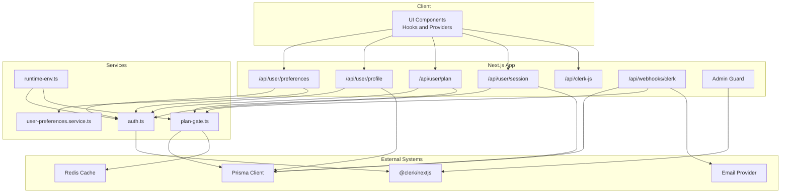

**Diagram sources**
- [route.ts:1-119](file://src/app/api/user/preferences/route.ts#L1-L119)
- [route.ts:1-128](file://src/app/api/user/profile/route.ts#L1-L128)
- [route.ts:1-42](file://src/app/api/user/plan/route.ts#L1-L42)
- [route.ts:1-115](file://src/app/api/user/session/route.ts#L1-L115)
- [route.ts:1-48](file://src/app/api/clerk-js/route.ts#L1-L48)
- [route.ts:1-379](file://src/app/api/webhooks/clerk/route.ts#L1-L379)
- [auth.ts:1-89](file://src/lib/auth.ts#L1-L89)
- [plan-gate.ts:1-240](file://src/lib/middleware/plan-gate.ts#L1-L240)
- [user-preferences.service.ts:1-177](file://src/lib/services/user-preferences.service.ts#L1-L177)
- [runtime-env.ts:1-59](file://src/lib/runtime-env.ts#L1-L59)

**Section sources**
- [auth.ts:1-89](file://src/lib/auth.ts#L1-L89)
- [plan-gate.ts:1-240](file://src/lib/middleware/plan-gate.ts#L1-L240)
- [route.ts:1-119](file://src/app/api/user/preferences/route.ts#L1-L119)
- [route.ts:1-128](file://src/app/api/user/profile/route.ts#L1-L128)
- [route.ts:1-42](file://src/app/api/user/plan/route.ts#L1-L42)
- [route.ts:1-115](file://src/app/api/user/session/route.ts#L1-L115)
- [route.ts:1-379](file://src/app/api/webhooks/clerk/route.ts#L1-L379)
- [route.ts:1-48](file://src/app/api/clerk-js/route.ts#L1-L48)
- [runtime-env.ts:1-59](file://src/lib/runtime-env.ts#L1-L59)

## Core Components
- Authentication and Clerk integration: Centralized auth wrapper supports Clerk in production and deterministic bypass in development/E2E.
- Admin guard: Enforces admin-only access using Clerk public metadata role.
- Plan and tier management: Resolves effective plan tier, enforces trial expiration, caches plan state.
- User preferences: CRUD for preferences with defaults and validation.
- Profile management: Synchronizes Clerk and database for profile data.
- Session management: Tracks sessions, heartbeats, and activity events.
- Webhooks: Clerk user lifecycle events for onboarding, credits, and GDPR-compliant deletion.
- Testing bypass: Local and E2E-friendly auth bypass with optional plan seeding.

**Section sources**
- [auth.ts:32-89](file://src/lib/auth.ts#L32-L89)
- [admin-guard.ts:17-55](file://src/lib/middleware/admin-guard.ts#L17-L55)
- [plan-gate.ts:82-164](file://src/lib/middleware/plan-gate.ts#L82-L164)
- [route.ts:25-118](file://src/app/api/user/preferences/route.ts#L25-L118)
- [route.ts:16-89](file://src/app/api/user/profile/route.ts#L16-L89)
- [route.ts:13-115](file://src/app/api/user/session/route.ts#L13-L115)
- [route.ts:95-379](file://src/app/api/webhooks/clerk/route.ts#L95-L379)
- [runtime-env.ts:15-31](file://src/lib/runtime-env.ts#L15-L31)

## Architecture Overview
The system orchestrates Clerk-managed identity with server-side persistence and caching. Admin access is enforced via Clerk public metadata. Plan tiers are resolved from the database with caching and trial expiration logic. Webhooks maintain user state and onboarding.

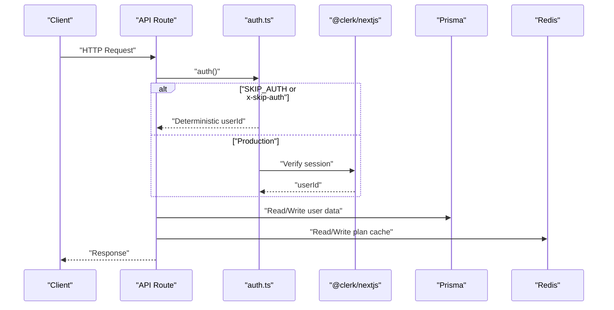

**Diagram sources**
- [auth.ts:32-89](file://src/lib/auth.ts#L32-L89)
- [plan-gate.ts:92-112](file://src/lib/middleware/plan-gate.ts#L92-L112)

**Section sources**
- [auth.ts:1-89](file://src/lib/auth.ts#L1-L89)
- [plan-gate.ts:1-240](file://src/lib/middleware/plan-gate.ts#L1-L240)

## Detailed Component Analysis

### Authentication and Clerk Integration
- Central auth wrapper:
  - In production, delegates to Clerk server SDK.
  - In development/E2E, resolves a deterministic userId with optional plan seeding from environment variables.
- Privileged email allowlist:
  - Maintains an in-memory cache of admin emails with TTL.
  - Used to grant elevated privileges to specific users.
- Client-side hooks:
  - Provides mocked Clerk context for testing and local development.
  - Exposes Clerk-like APIs for user and auth state.

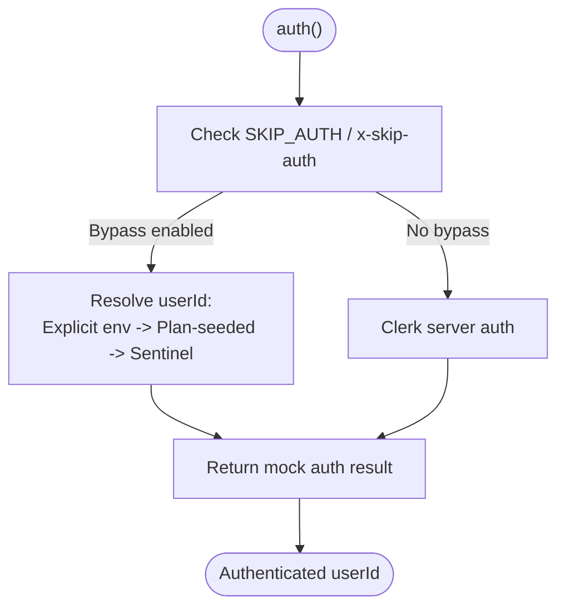

**Diagram sources**
- [auth.ts:32-89](file://src/lib/auth.ts#L32-L89)

**Section sources**
- [auth.ts:1-89](file://src/lib/auth.ts#L1-L89)
- [use-auth-user.ts:16-68](file://src/hooks/use-auth-user.ts#L16-L68)
- [mock-clerk-provider.tsx:1-44](file://src/providers/mock-clerk-provider.tsx#L1-L44)
- [clerk-shim.ts:1-33](file://src/lib/clerk-shim.ts#L1-L33)

### Admin Guard and Role-Based Access Control
- Enforces admin-only access by checking Clerk user public metadata role.
- Supports development bypass controlled by environment flags.
- Returns JSON errors with appropriate status codes on failure.

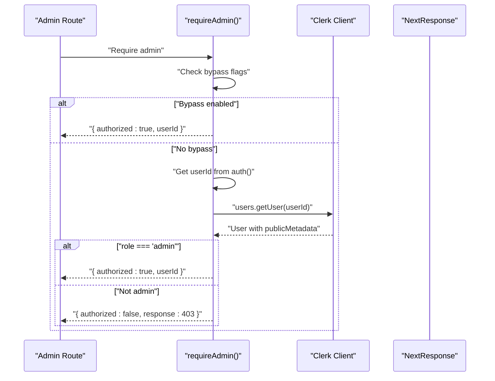

**Diagram sources**
- [admin-guard.ts:17-55](file://src/lib/middleware/admin-guard.ts#L17-L55)

**Section sources**
- [admin-guard.ts:1-55](file://src/lib/middleware/admin-guard.ts#L1-L55)

### Plan and Tier Management
- Plan resolution:
  - Normalizes plan tiers and handles trial expiration atomically.
  - Elevates users with privileged emails to ELITE.
  - Supports plan caching with stale-while-revalidate and cache invalidation.
- Gating helpers:
  - Provides limits per feature and plan, plus convenience checks for access levels.

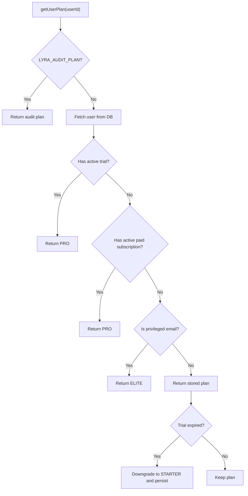

**Diagram sources**
- [plan-gate.ts:82-164](file://src/lib/middleware/plan-gate.ts#L82-L164)

**Section sources**
- [plan-gate.ts:1-240](file://src/lib/middleware/plan-gate.ts#L1-L240)
- [route.ts:11-42](file://src/app/api/user/plan/route.ts#L11-L42)

### User Preferences
- CRUD endpoints:
  - GET returns user preferences with caching headers.
  - PUT validates payload, ensures preferences exist, and updates fields.
- Defaults and normalization:
  - Builds default preferences and normalizes notification preferences.
  - Handles missing rows gracefully with upserts.

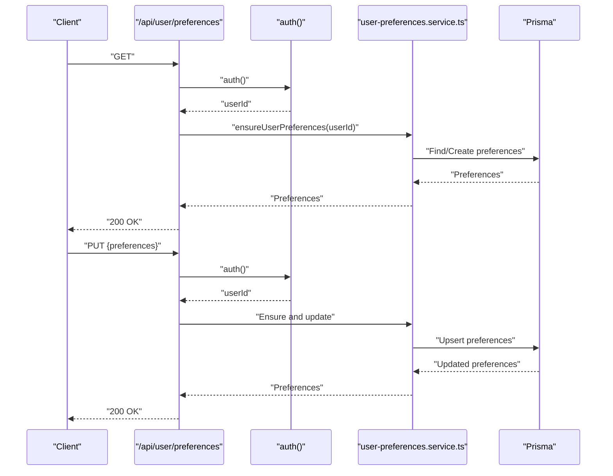

**Diagram sources**
- [route.ts:25-118](file://src/app/api/user/preferences/route.ts#L25-L118)
- [user-preferences.service.ts:26-177](file://src/lib/services/user-preferences.service.ts#L26-L177)

**Section sources**
- [route.ts:1-119](file://src/app/api/user/preferences/route.ts#L1-L119)
- [user-preferences.service.ts:1-177](file://src/lib/services/user-preferences.service.ts#L1-L177)

### Profile Management
- GET merges Clerk user data with database fields (plan, subscriptions) and falls back to DB when Clerk is unavailable.
- PUT updates Clerk user profile fields and returns the updated profile.

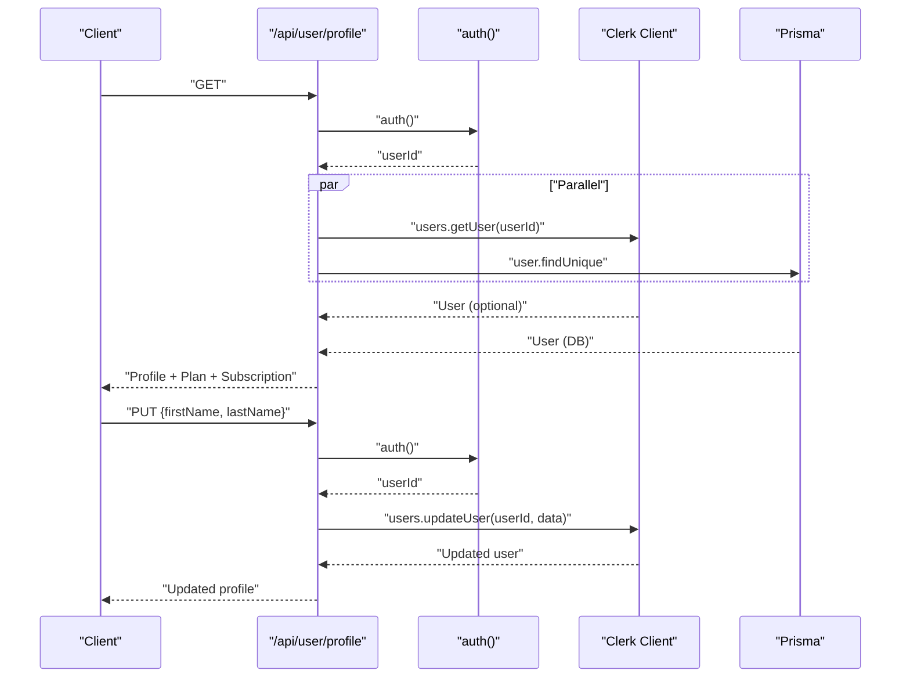

**Diagram sources**
- [route.ts:16-127](file://src/app/api/user/profile/route.ts#L16-L127)

**Section sources**
- [route.ts:1-128](file://src/app/api/user/profile/route.ts#L1-L128)

### Session Management
- POST supports actions:
  - start: creates a new session record.
  - heartbeat: updates last activity timestamp.
  - end: marks session inactive with end time.
  - track: records an activity event and updates heartbeat.
- GET returns the active session for the user.

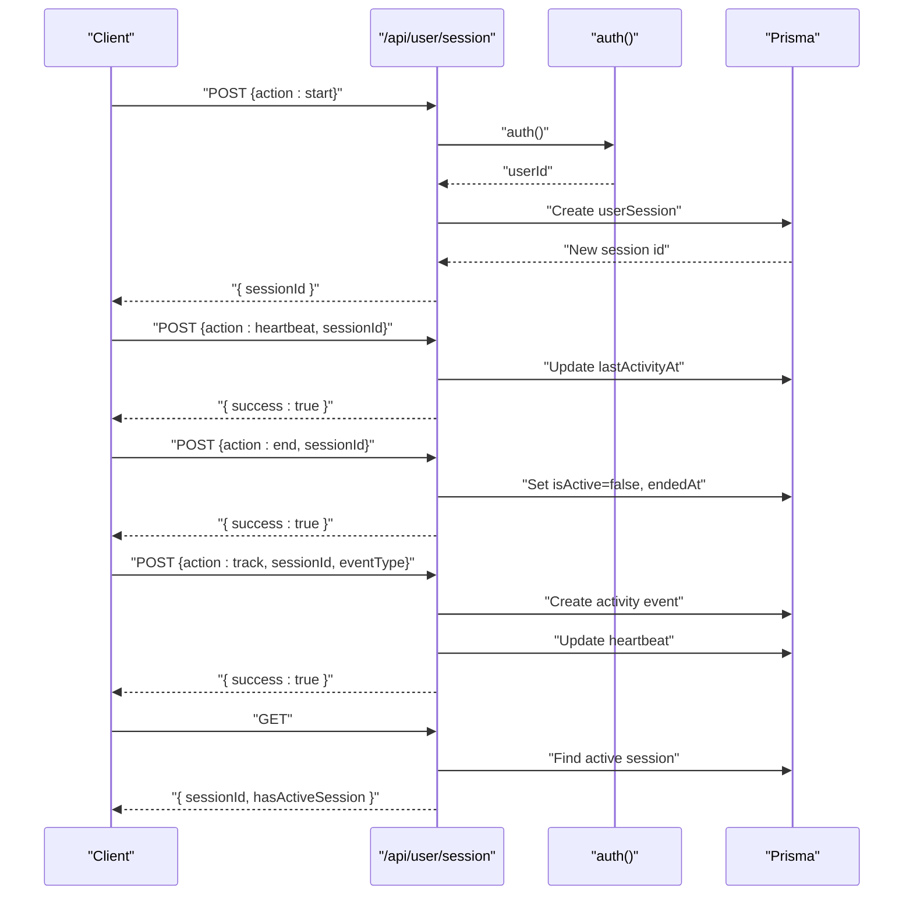

**Diagram sources**
- [route.ts:13-115](file://src/app/api/user/session/route.ts#L13-L115)

**Section sources**
- [route.ts:1-115](file://src/app/api/user/session/route.ts#L1-L115)

### Clerk Webhooks and Onboarding
- user.created:
  - Upserts user with ELITE plan, grants sign-up bonus credits atomically, and sends welcome email.
  - Creates default user preferences.
- user.updated:
  - Ensures user exists, preserves ELITE/admin plan, and grants sign-up bonus if missing.
  - Invalidates plan cache.
- user.deleted:
  - GDPR-compliant anonymization and content purge across multiple tables in a transaction.

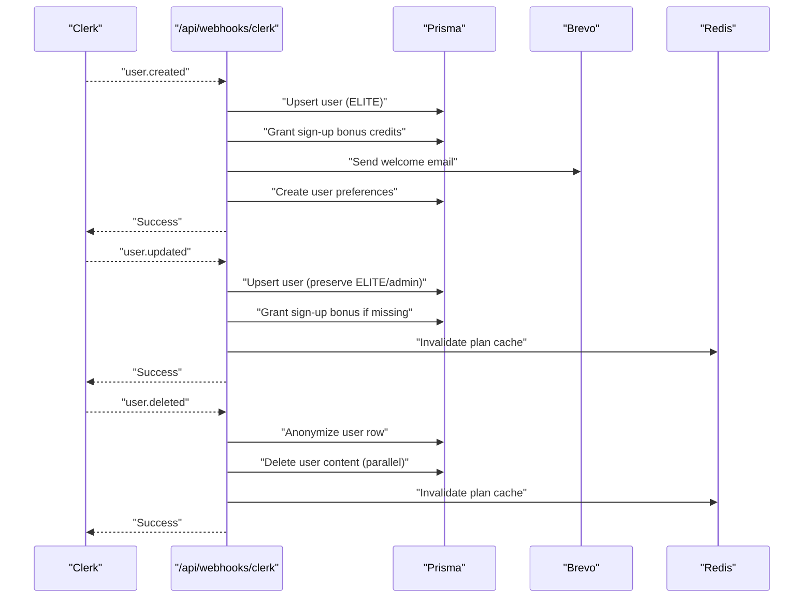

**Diagram sources**
- [route.ts:95-379](file://src/app/api/webhooks/clerk/route.ts#L95-L379)

**Section sources**
- [route.ts:1-379](file://src/app/api/webhooks/clerk/route.ts#L1-L379)

### Authentication Bypass Mechanisms for Testing
- Environment-driven bypass:
  - SKIP_AUTH and SKIP_RATE_LIMIT enable auth bypass in development/E2E.
  - x-skip-auth header supported for programmatic control.
  - Explicit user selection via LYRA_E2E_USER_ID or plan-based seeding via LYRA_E2E_USER_PLAN.
- Client-side bypass:
  - Localhost detection and localStorage toggle allow UI-level auth bypass in development.

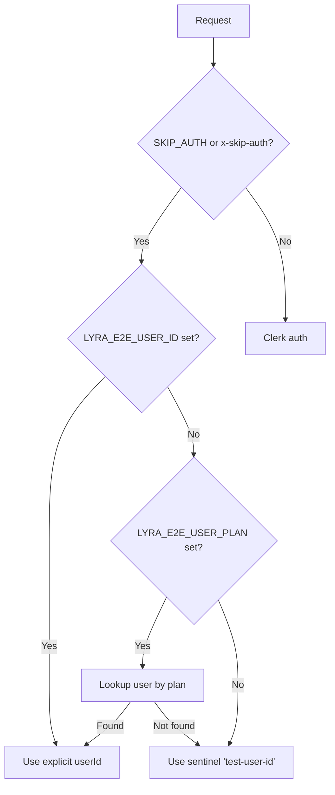

**Diagram sources**
- [auth.ts:38-86](file://src/lib/auth.ts#L38-L86)
- [runtime-env.ts:15-31](file://src/lib/runtime-env.ts#L15-L31)
- [use-auth-user.ts:16-32](file://src/hooks/use-auth-user.ts#L16-L32)

**Section sources**
- [auth.ts:1-89](file://src/lib/auth.ts#L1-L89)
- [runtime-env.ts:1-59](file://src/lib/runtime-env.ts#L1-L59)
- [use-auth-user.ts:1-68](file://src/hooks/use-auth-user.ts#L1-L68)

### Admin User Controls
- Admin-only pages:
  - Layout enforces requireAdmin() and redirects unauthenticated users.
  - Multiple admin API endpoints for usage, revenue, credits, and users.
- Client-side admin hooks:
  - SWR-based admin dashboards with caching and refresh intervals.

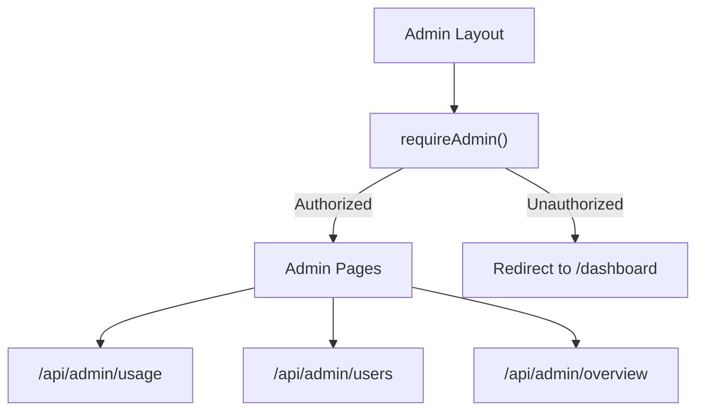

**Diagram sources**
- [admin-guard.ts:1-12](file://src/lib/middleware/admin-guard.ts#L1-L12)
- [layout.tsx:1-12](file://src/app/admin/layout.tsx#L1-L12)
- [route.ts:1-33](file://src/app/api/admin/usage/route.ts#L1-L33)
- [route.ts:1-27](file://src/app/api/admin/users/route.ts#L1-L27)
- [route.ts:1-23](file://src/app/api/admin/overview/route.ts#L1-L23)

**Section sources**
- [admin-guard.ts:1-55](file://src/lib/middleware/admin-guard.ts#L1-L55)
- [layout.tsx:1-12](file://src/app/admin/layout.tsx#L1-L12)
- [route.ts:1-33](file://src/app/api/admin/usage/route.ts#L1-L33)
- [route.ts:1-27](file://src/app/api/admin/users/route.ts#L1-L27)
- [route.ts:1-23](file://src/app/api/admin/overview/route.ts#L1-L23)

### User Data Protection Measures
- Privacy policies:
  - Data sharing with trusted processors, retention periods, rights of access and deletion, and international transfers.
- Webhook-driven GDPR deletion:
  - Atomic anonymization and content purge on user deletion.

**Section sources**
- [legal-documents.ts:65-127](file://src/lib/legal-documents.ts#L65-L127)
- [Privacypolicy.md:54-100](file://docs/doctemp/Privacypolicy.md#L54-L100)
- [route.ts:301-364](file://src/app/api/webhooks/clerk/route.ts#L301-L364)

## Dependency Analysis
- Clerk integration:
  - Server SDK used for auth and user operations.
  - Frontend bundle proxied via a dedicated route.
- Persistence:
  - Prisma client for user, preferences, sessions, activity, and subscription data.
- Caching:
  - Redis for plan cache with stale-while-revalidate semantics.
- Email:
  - Brevo integration for onboarding and welcome emails.

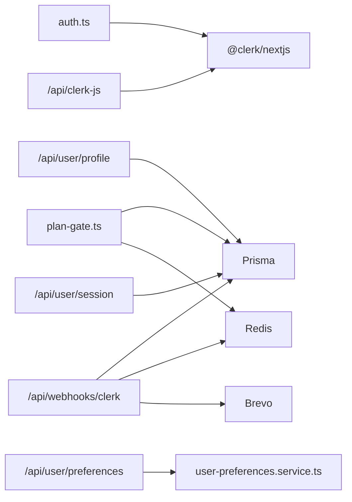

**Diagram sources**
- [auth.ts:1-89](file://src/lib/auth.ts#L1-L89)
- [plan-gate.ts:1-240](file://src/lib/middleware/plan-gate.ts#L1-L240)
- [route.ts:1-119](file://src/app/api/user/preferences/route.ts#L1-L119)
- [user-preferences.service.ts:1-177](file://src/lib/services/user-preferences.service.ts#L1-L177)
- [route.ts:1-128](file://src/app/api/user/profile/route.ts#L1-L128)
- [route.ts:1-115](file://src/app/api/user/session/route.ts#L1-L115)
- [route.ts:1-379](file://src/app/api/webhooks/clerk/route.ts#L1-L379)
- [route.ts:1-48](file://src/app/api/clerk-js/route.ts#L1-L48)

**Section sources**
- [auth.ts:1-89](file://src/lib/auth.ts#L1-L89)
- [plan-gate.ts:1-240](file://src/lib/middleware/plan-gate.ts#L1-L240)
- [route.ts:1-119](file://src/app/api/user/preferences/route.ts#L1-L119)
- [user-preferences.service.ts:1-177](file://src/lib/services/user-preferences.service.ts#L1-L177)
- [route.ts:1-128](file://src/app/api/user/profile/route.ts#L1-L128)
- [route.ts:1-115](file://src/app/api/user/session/route.ts#L1-L115)
- [route.ts:1-379](file://src/app/api/webhooks/clerk/route.ts#L1-L379)
- [route.ts:1-48](file://src/app/api/clerk-js/route.ts#L1-L48)

## Performance Considerations
- Plan caching:
  - Stale-while-revalidate reduces latency and DB load for plan queries.
  - Cache invalidation on plan changes ensures consistency.
- Rate limiting:
  - Per-endpoint rate limits protect against abuse while allowing normal usage.
- Idempotent webhooks:
  - Redis-based idempotency keys prevent duplicate processing across retries.
- Parallel operations:
  - Session tracking updates heartbeat and activity in parallel to reduce latency.

[No sources needed since this section provides general guidance]

## Troubleshooting Guide
- Authentication bypass not working:
  - Verify SKIP_AUTH or x-skip-auth headers are set appropriately and runtime allows bypass.
  - Confirm LYRA_E2E_USER_ID or LYRA_E2E_USER_PLAN environment variables if using plan seeding.
- Admin access denied:
  - Ensure Clerk user has publicMetadata.role set to "admin".
  - Check that development bypass is not masking the issue.
- Plan not updating:
  - Confirm plan cache is invalidated after Stripe/Clerk webhooks.
  - Verify trial expiration logic and that user has active subscription if applicable.
- Profile updates failing:
  - Check Clerk user permissions and network connectivity.
  - Validate request payload against schema.
- Session tracking issues:
  - Ensure sessionId is provided for heartbeat and end actions.
  - Confirm database connectivity and Prisma client initialization.

**Section sources**
- [runtime-env.ts:15-31](file://src/lib/runtime-env.ts#L15-L31)
- [admin-guard.ts:17-55](file://src/lib/middleware/admin-guard.ts#L17-L55)
- [plan-gate.ts:191-213](file://src/lib/middleware/plan-gate.ts#L191-L213)
- [route.ts:91-127](file://src/app/api/user/profile/route.ts#L91-L127)
- [route.ts:13-92](file://src/app/api/user/session/route.ts#L13-L92)

## Conclusion
The User Management System integrates Clerk for robust authentication, enforces admin-only access via metadata, and manages user preferences, profiles, sessions, and plan tiers with caching and webhooks. Development and E2E environments benefit from safe, deterministic auth bypass mechanisms, while production relies on secure Clerk-based identity. Data protection is addressed through privacy policies and GDPR-compliant deletion workflows.