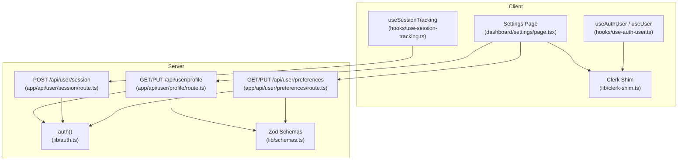
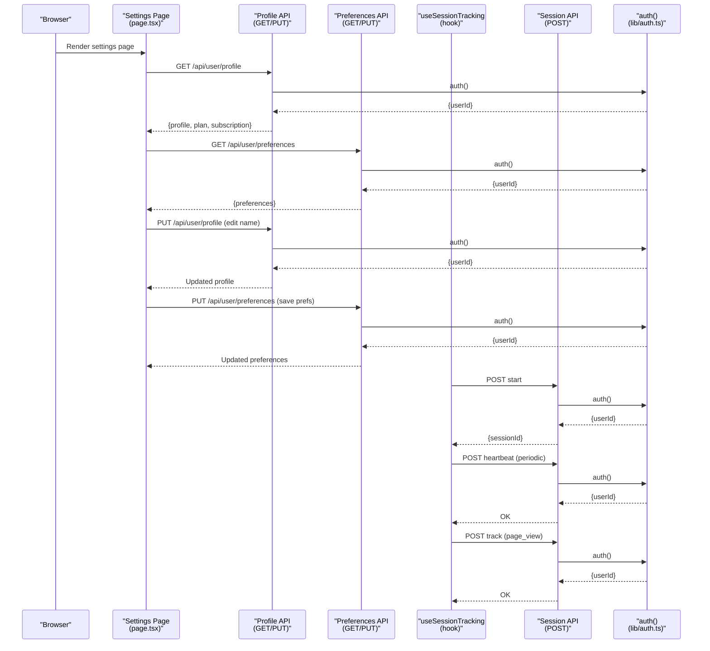
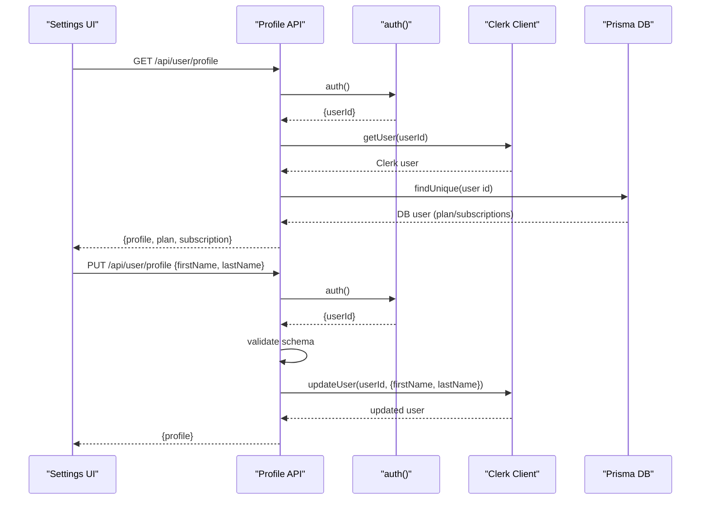
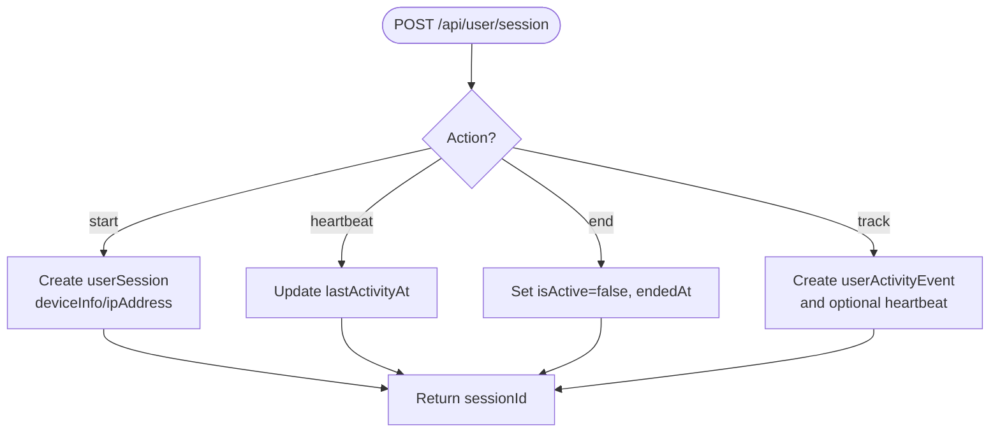
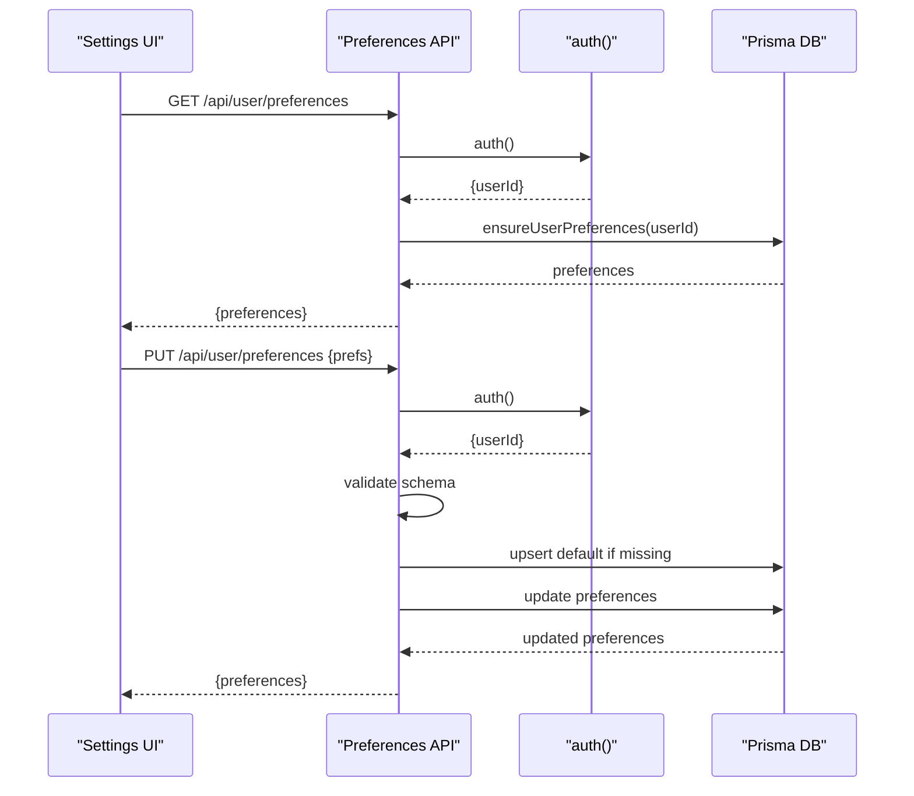
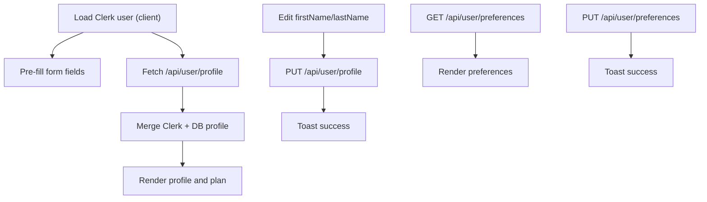
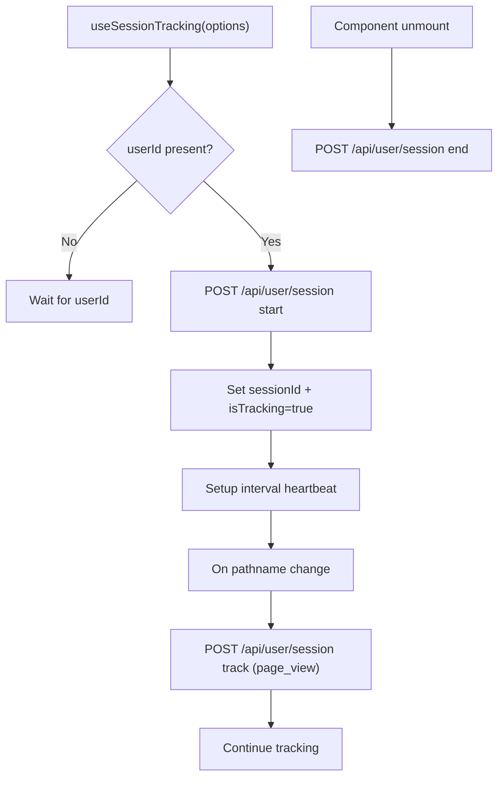
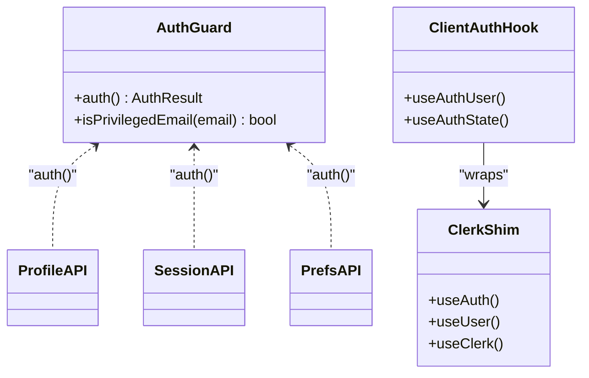
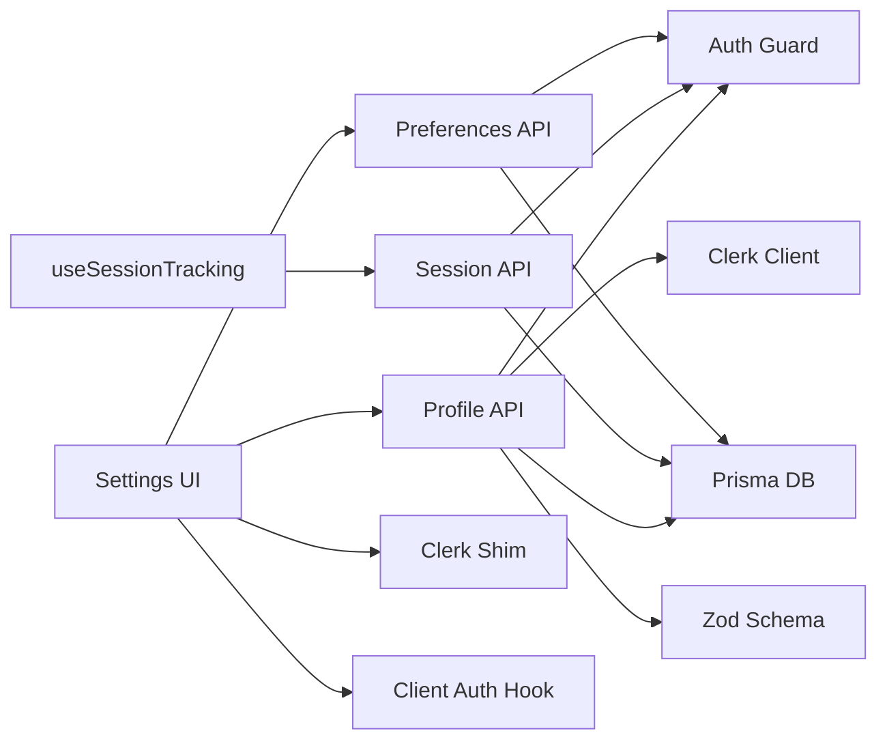

# User Profiles & Data Management

<cite>
**Referenced Files in This Document**
- [src/app/api/user/profile/route.ts](file://src/app/api/user/profile/route.ts)
- [src/app/api/user/session/route.ts](file://src/app/api/user/session/route.ts)
- [src/app/api/user/preferences/route.ts](file://src/app/api/user/preferences/route.ts)
- [src/app/dashboard/settings/page.tsx](file://src/app/dashboard/settings/page.tsx)
- [src/hooks/use-auth-user.ts](file://src/hooks/use-auth-user.ts)
- [src/hooks/use-session-tracking.ts](file://src/hooks/use-session-tracking.ts)
- [src/lib/clerk-shim.ts](file://src/lib/clerk-shim.ts)
- [src/lib/schemas.ts](file://src/lib/schemas.ts)
- [src/lib/auth.ts](file://src/lib/auth.ts)
</cite>

## Table of Contents
1. [Introduction](#introduction)
2. [Project Structure](#project-structure)
3. [Core Components](#core-components)
4. [Architecture Overview](#architecture-overview)
5. [Detailed Component Analysis](#detailed-component-analysis)
6. [Dependency Analysis](#dependency-analysis)
7. [Performance Considerations](#performance-considerations)
8. [Troubleshooting Guide](#troubleshooting-guide)
9. [Conclusion](#conclusion)

## Introduction
This document explains how user profiles and data are managed across the system, focusing on:
- Profile page implementation and Clerk integration
- User session lifecycle and activity tracking
- Data synchronization between Clerk and the application database
- Profile editing workflows, validation, and persistence
- Privacy controls and data protection measures
- Integration patterns with the authentication system

## Project Structure
The user profile and session management spans client UI, server APIs, and shared authentication utilities:
- Client pages and hooks: dashboard settings UI, session tracking hook, Clerk shim
- Server routes: profile read/write, session lifecycle, preferences
- Shared libraries: schemas, auth guard, Clerk wrappers

**Diagram sources**
- [src/app/dashboard/settings/page.tsx](file://src/app/dashboard/settings/page.tsx)
- [src/hooks/use-session-tracking.ts](file://src/hooks/use-session-tracking.ts)
- [src/hooks/use-auth-user.ts](file://src/hooks/use-auth-user.ts)
- [src/lib/clerk-shim.ts](file://src/lib/clerk-shim.ts)
- [src/app/api/user/profile/route.ts](file://src/app/api/user/profile/route.ts)
- [src/app/api/user/session/route.ts](file://src/app/api/user/session/route.ts)
- [src/app/api/user/preferences/route.ts](file://src/app/api/user/preferences/route.ts)
- [src/lib/auth.ts](file://src/lib/auth.ts)
- [src/lib/schemas.ts](file://src/lib/schemas.ts)

**Section sources**
- [src/app/dashboard/settings/page.tsx](file://src/app/dashboard/settings/page.tsx)
- [src/hooks/use-session-tracking.ts](file://src/hooks/use-session-tracking.ts)
- [src/hooks/use-auth-user.ts](file://src/hooks/use-auth-user.ts)
- [src/lib/clerk-shim.ts](file://src/lib/clerk-shim.ts)
- [src/app/api/user/profile/route.ts](file://src/app/api/user/profile/route.ts)
- [src/app/api/user/session/route.ts](file://src/app/api/user/session/route.ts)
- [src/app/api/user/preferences/route.ts](file://src/app/api/user/preferences/route.ts)
- [src/lib/auth.ts](file://src/lib/auth.ts)
- [src/lib/schemas.ts](file://src/lib/schemas.ts)

## Core Components
- Profile API: Fetches and updates user profile via Clerk and database, with rate limiting and validation.
- Session API: Manages session lifecycle (start, heartbeat, end) and tracks page-view events.
- Preferences API: Loads and saves user preferences and onboarding state.
- Settings UI: Client page that loads profile and preferences, displays plan and subscription info, and allows edits.
- Session Tracking Hook: Client-side hook to start sessions, send heartbeats, and track page views.
- Auth Utilities: Centralized auth guard and Clerk wrappers for client and server.

**Section sources**
- [src/app/api/user/profile/route.ts](file://src/app/api/user/profile/route.ts)
- [src/app/api/user/session/route.ts](file://src/app/api/user/session/route.ts)
- [src/app/api/user/preferences/route.ts](file://src/app/api/user/preferences/route.ts)
- [src/app/dashboard/settings/page.tsx](file://src/app/dashboard/settings/page.tsx)
- [src/hooks/use-session-tracking.ts](file://src/hooks/use-session-tracking.ts)
- [src/lib/auth.ts](file://src/lib/auth.ts)
- [src/lib/clerk-shim.ts](file://src/lib/clerk-shim.ts)
- [src/lib/schemas.ts](file://src/lib/schemas.ts)

## Architecture Overview
The system integrates Clerk for identity and the app’s database for persistent preferences and session data. The Settings page orchestrates profile and preferences retrieval, while the session tracking hook ensures continuous session monitoring.

**Diagram sources**
- [src/app/dashboard/settings/page.tsx](file://src/app/dashboard/settings/page.tsx)
- [src/app/api/user/profile/route.ts](file://src/app/api/user/profile/route.ts)
- [src/app/api/user/preferences/route.ts](file://src/app/api/user/preferences/route.ts)
- [src/app/api/user/session/route.ts](file://src/app/api/user/session/route.ts)
- [src/hooks/use-session-tracking.ts](file://src/hooks/use-session-tracking.ts)
- [src/lib/auth.ts](file://src/lib/auth.ts)

## Detailed Component Analysis

### Profile API: Fetch and Update
- GET /api/user/profile
  - Authenticates caller, rate-limits requests, reads Clerk user and app DB user, merges Clerk profile with DB plan/subscription data, and returns a consolidated profile object.
  - Includes graceful fallback when Clerk fails.
- PUT /api/user/profile
  - Validates payload against a Zod schema, authenticates, and updates Clerk user’s first and last name atomically.
  - Returns the updated profile.

**Diagram sources**
- [src/app/api/user/profile/route.ts](file://src/app/api/user/profile/route.ts)
- [src/lib/auth.ts](file://src/lib/auth.ts)
- [src/lib/schemas.ts](file://src/lib/schemas.ts)

**Section sources**
- [src/app/api/user/profile/route.ts](file://src/app/api/user/profile/route.ts)
- [src/lib/schemas.ts](file://src/lib/schemas.ts)
- [src/lib/auth.ts](file://src/lib/auth.ts)

### Session API: Lifecycle and Activity Tracking
- POST /api/user/session
  - Supports actions: start, heartbeat, end, track.
  - start: creates a new userSession record with deviceInfo and optional ipAddress.
  - heartbeat: updates lastActivityAt for the given sessionId and userId.
  - end: marks the session inactive and sets endedAt.
  - track: records a userActivityEvent and optionally refreshes the session heartbeat.
- GET /api/user/session
  - Returns the active session id and presence flag.

**Diagram sources**
- [src/app/api/user/session/route.ts](file://src/app/api/user/session/route.ts)

**Section sources**
- [src/app/api/user/session/route.ts](file://src/app/api/user/session/route.ts)

### Preferences API: Onboarding and Notification Settings
- GET /api/user/preferences
  - Ensures user preferences exist, returns current preferences with caching headers.
- PUT /api/user/preferences
  - Validates input, ensures preferences exist, updates fields including onboarding completion timestamps, and upserts defaults if needed.

**Diagram sources**
- [src/app/api/user/preferences/route.ts](file://src/app/api/user/preferences/route.ts)
- [src/lib/auth.ts](file://src/lib/auth.ts)

**Section sources**
- [src/app/api/user/preferences/route.ts](file://src/app/api/user/preferences/route.ts)

### Settings Page: Profile Editing and Data Presentation
- Loads Clerk client-side user for fast pre-fill.
- Fetches authoritative profile from the Profile API.
- Displays plan and subscription status.
- Allows editing first and last name; PUTs to the Profile API.
- Loads and saves preferences and notification settings.

**Diagram sources**
- [src/app/dashboard/settings/page.tsx](file://src/app/dashboard/settings/page.tsx)
- [src/app/api/user/profile/route.ts](file://src/app/api/user/profile/route.ts)
- [src/app/api/user/preferences/route.ts](file://src/app/api/user/preferences/route.ts)

**Section sources**
- [src/app/dashboard/settings/page.tsx](file://src/app/dashboard/settings/page.tsx)

### Session Tracking Hook: Client-Side Session Orchestration
- Starts a session when a userId becomes available.
- Sends periodic heartbeats.
- Tracks page views automatically and logs custom events.
- Ends session on component unmount.

**Diagram sources**
- [src/hooks/use-session-tracking.ts](file://src/hooks/use-session-tracking.ts)
- [src/app/api/user/session/route.ts](file://src/app/api/user/session/route.ts)

**Section sources**
- [src/hooks/use-session-tracking.ts](file://src/hooks/use-session-tracking.ts)

### Authentication and Clerk Integration
- Auth guard centralizes authentication checks and supports development bypass modes.
- Clerk shim exposes client-side hooks and wraps them for consistent usage across components.
- Client auth hook supports a dev bypass with a localStorage flag.

**Diagram sources**
- [src/lib/auth.ts](file://src/lib/auth.ts)
- [src/lib/clerk-shim.ts](file://src/lib/clerk-shim.ts)
- [src/hooks/use-auth-user.ts](file://src/hooks/use-auth-user.ts)

**Section sources**
- [src/lib/auth.ts](file://src/lib/auth.ts)
- [src/lib/clerk-shim.ts](file://src/lib/clerk-shim.ts)
- [src/hooks/use-auth-user.ts](file://src/hooks/use-auth-user.ts)

## Dependency Analysis
- Profile API depends on:
  - Auth guard for userId extraction
  - Clerk client for user updates
  - Prisma for plan/subscription data
  - Zod schema for validation
  - Rate limiting and logging utilities
- Session API depends on:
  - Auth guard
  - Prisma for userSession and userActivityEvent
  - Fire-and-forget error logging
- Preferences API depends on:
  - Auth guard
  - Prisma userPreference
  - Service helpers to ensure defaults
- Settings UI depends on:
  - Clerk shim and client auth hook
  - Profile and preferences APIs
- Session tracking hook depends on:
  - Session API
  - Next.js router for pathname tracking

**Diagram sources**
- [src/app/api/user/profile/route.ts](file://src/app/api/user/profile/route.ts)
- [src/app/api/user/session/route.ts](file://src/app/api/user/session/route.ts)
- [src/app/api/user/preferences/route.ts](file://src/app/api/user/preferences/route.ts)
- [src/app/dashboard/settings/page.tsx](file://src/app/dashboard/settings/page.tsx)
- [src/hooks/use-session-tracking.ts](file://src/hooks/use-session-tracking.ts)
- [src/lib/clerk-shim.ts](file://src/lib/clerk-shim.ts)
- [src/hooks/use-auth-user.ts](file://src/hooks/use-auth-user.ts)
- [src/lib/auth.ts](file://src/lib/auth.ts)
- [src/lib/schemas.ts](file://src/lib/schemas.ts)

**Section sources**
- [src/app/api/user/profile/route.ts](file://src/app/api/user/profile/route.ts)
- [src/app/api/user/session/route.ts](file://src/app/api/user/session/route.ts)
- [src/app/api/user/preferences/route.ts](file://src/app/api/user/preferences/route.ts)
- [src/app/dashboard/settings/page.tsx](file://src/app/dashboard/settings/page.tsx)
- [src/hooks/use-session-tracking.ts](file://src/hooks/use-session-tracking.ts)
- [src/lib/clerk-shim.ts](file://src/lib/clerk-shim.ts)
- [src/hooks/use-auth-user.ts](file://src/hooks/use-auth-user.ts)
- [src/lib/auth.ts](file://src/lib/auth.ts)
- [src/lib/schemas.ts](file://src/lib/schemas.ts)

## Performance Considerations
- Profile API uses concurrent reads for Clerk and DB to minimize latency.
- Session heartbeat intervals are configurable and run on an interval to reduce network overhead.
- Preferences API caches responses with cache-control headers to reduce repeated loads.
- Settings page uses client-side pre-fill from Clerk to improve perceived performance while fetching authoritative data server-side.

[No sources needed since this section provides general guidance]

## Troubleshooting Guide
Common issues and mitigations:
- Unauthorized responses from APIs indicate missing or invalid auth; verify the auth guard and Clerk integration.
- Clerk profile fetch failures are handled gracefully; the UI falls back to DB-derived plan/subscription data.
- Session tracking failures are non-fatal and logged; ensure the hook receives a valid userId and network connectivity.
- Validation errors occur when request bodies do not match Zod schemas; confirm client-side forms align with server expectations.

**Section sources**
- [src/app/api/user/profile/route.ts](file://src/app/api/user/profile/route.ts)
- [src/app/api/user/session/route.ts](file://src/app/api/user/session/route.ts)
- [src/app/dashboard/settings/page.tsx](file://src/app/dashboard/settings/page.tsx)
- [src/lib/schemas.ts](file://src/lib/schemas.ts)

## Conclusion
The profile and session management system integrates Clerk for identity and the app database for persistent preferences and session analytics. The Settings page provides a unified interface to edit profile details and manage preferences, while the session tracking hook ensures robust session lifecycle handling. Centralized auth guards and schema validation enforce data integrity and protect user privacy.