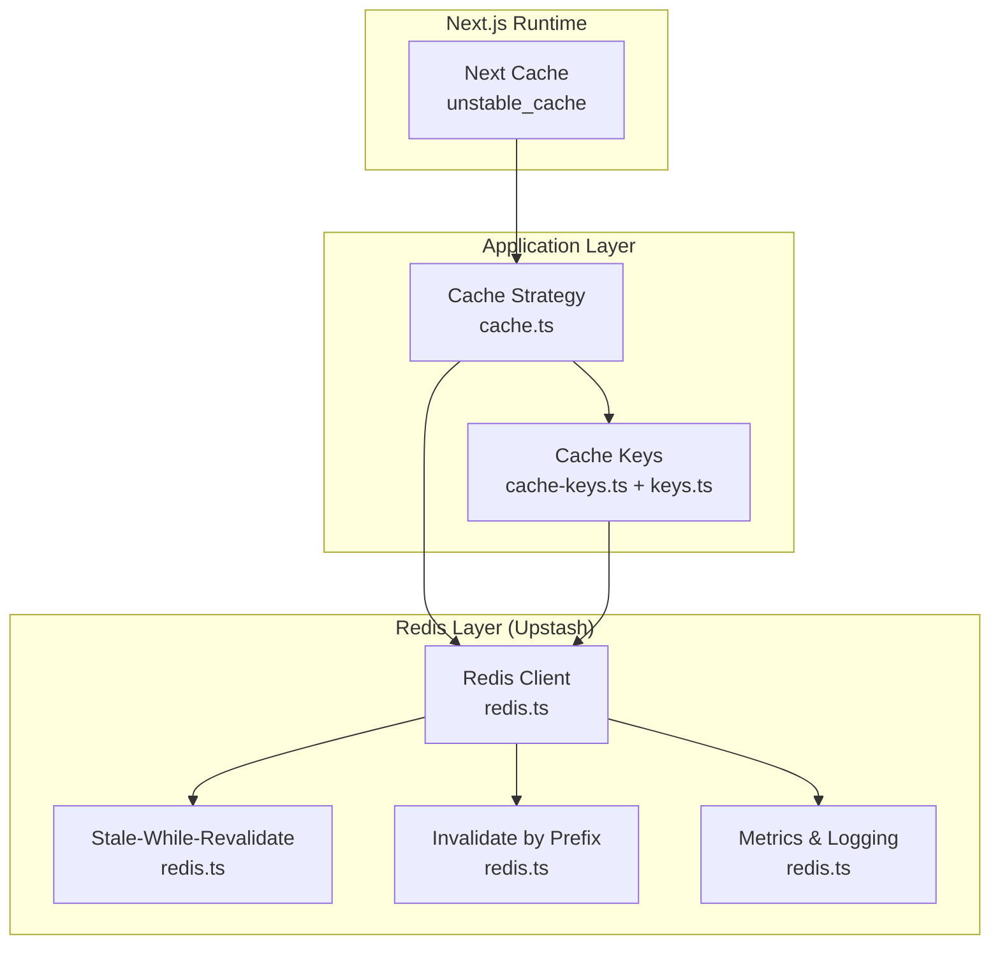
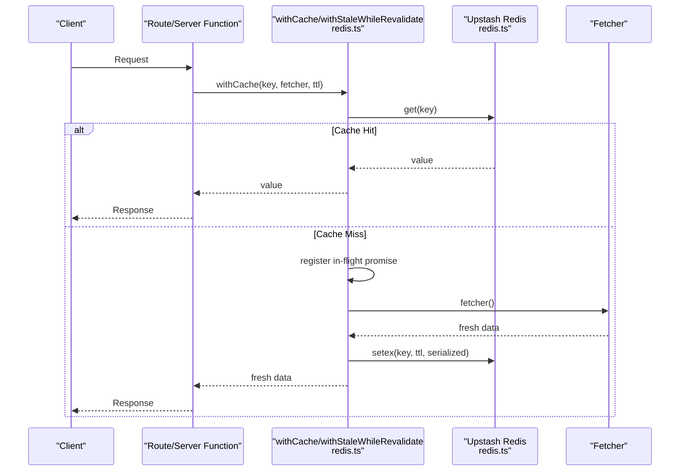
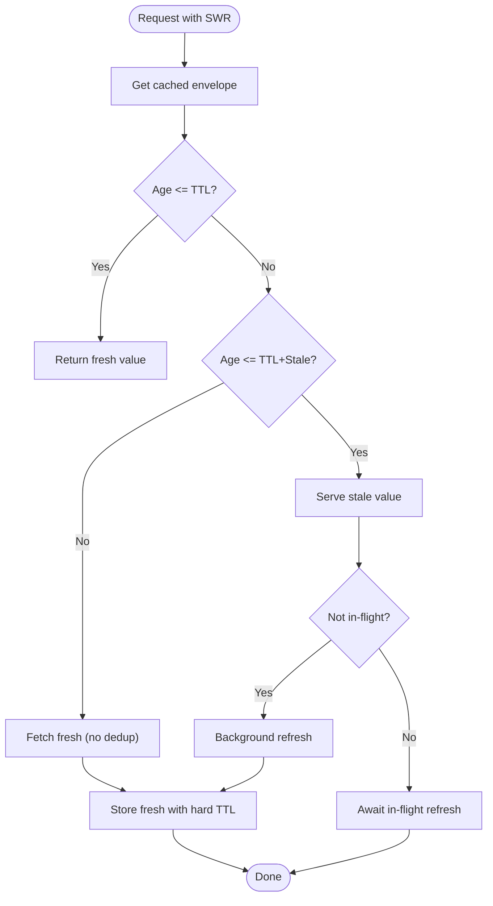
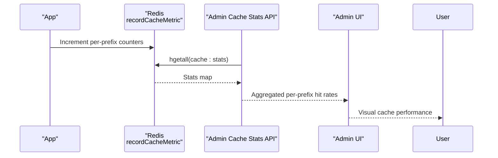
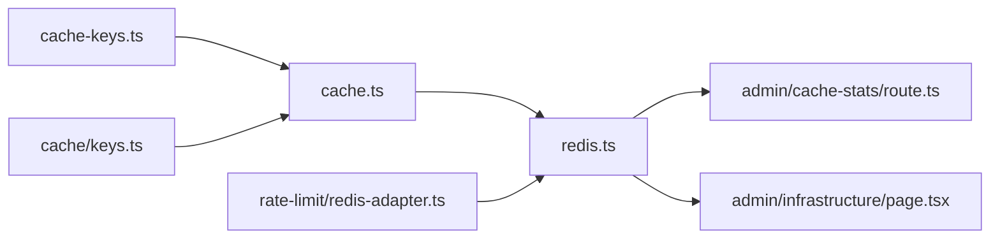

# Caching Strategy

<cite>
**Referenced Files in This Document**
- [redis.ts](file://src/lib/redis.ts)
- [cache.ts](file://src/lib/cache.ts)
- [cache-keys.ts](file://src/lib/cache-keys.ts)
- [keys.ts](file://src/lib/cache/keys.ts)
- [route.ts](file://src/app/api/admin/cache-stats/route.ts)
- [page.tsx](file://src/app/admin/infrastructure/page.tsx)
- [redis-dedup.test.ts](file://src/lib/__tests__/redis-dedup.test.ts)
- [redis-adapter.ts](file://src/lib/rate-limit/redis-adapter.ts)
- [market-regime.ts](file://src/lib/engines/market-regime.ts)
</cite>

## Table of Contents
1. [Introduction](#introduction)
2. [Project Structure](#project-structure)
3. [Core Components](#core-components)
4. [Architecture Overview](#architecture-overview)
5. [Detailed Component Analysis](#detailed-component-analysis)
6. [Dependency Analysis](#dependency-analysis)
7. [Performance Considerations](#performance-considerations)
8. [Troubleshooting Guide](#troubleshooting-guide)
9. [Conclusion](#conclusion)
10. [Appendices](#appendices)

## Introduction
This document describes LyraAlpha’s multi-level caching strategy, focusing on Redis-backed caching via Upstash. It covers connection management, configuration, key generation patterns, TTL strategies, invalidation, stale-while-revalidate for perceived performance, segmentation by data type and user context, warming and background refresh, monitoring and metrics, and consistency patterns. The goal is to provide a practical, code-backed guide for building reliable, observable, and performant caching across the platform.

## Project Structure
LyraAlpha implements caching at two primary layers:
- Next.js server-side caching for high-latency database queries using unstable_cache.
- Redis caching for cross-request persistence, distributed locks, and metrics, with helpers for deduplication, staleness handling, and invalidation.

**Diagram sources**
- [redis.ts:1-455](file://src/lib/redis.ts#L1-L455)
- [cache.ts:1-21](file://src/lib/cache.ts#L1-L21)
- [cache-keys.ts:1-36](file://src/lib/cache-keys.ts#L1-L36)
- [keys.ts:1-105](file://src/lib/cache/keys.ts#L1-L105)

**Section sources**
- [redis.ts:1-68](file://src/lib/redis.ts#L1-L68)
- [cache.ts:1-21](file://src/lib/cache.ts#L1-L21)

## Core Components
- Redis client abstraction with environment-driven initialization and a no-op fallback for environments without Redis credentials.
- Serialization-aware get/set/del helpers with date revival for robust deserialization.
- In-flight request deduplication to prevent thundering herds during cache misses.
- Stale-while-revalidate pattern for improved perceived latency and background refresh.
- Prefix-based invalidation for targeted cache purges.
- Metrics collection for cache hit/miss and per-prefix hit rates.
- Next.js cache wrapper for database-heavy queries.

**Section sources**
- [redis.ts:1-455](file://src/lib/redis.ts#L1-L455)
- [cache.ts:1-21](file://src/lib/cache.ts#L1-L21)

## Architecture Overview
The caching architecture integrates Next.js caching with Redis for durable, distributed caching. Requests flow through the cache layer, which either serves from Redis or triggers a fetcher, caches the result, and returns it. During stale windows, stale data is returned while a background refresh occurs.

**Diagram sources**
- [redis.ts:338-373](file://src/lib/redis.ts#L338-L373)

**Section sources**
- [redis.ts:338-373](file://src/lib/redis.ts#L338-L373)

## Detailed Component Analysis

### Redis Client and Connection Management
- Environment detection: Uses trimmed environment variables for Upstash REST URL and token. If missing, falls back to a no-op Redis client that returns safe defaults without throwing.
- Global singleton pattern: Ensures a single Redis client instance across the app lifecycle in non-production environments.
- Robust serialization: All values are JSON.stringified before storage to guarantee consistent retrieval and parsing. Date revival logic converts ISO date strings back to Date objects.
- Telemetry: Timing wrappers around Redis operations annotate logs with key prefixes and TTLs for observability.
- Info access: Exposes redisInfo for memory and performance insights when available.

Operational notes:
- The no-op client ensures graceful degradation when Redis is unavailable.
- Fail-open semantics apply to idempotency checks (e.g., webhook dedup), while a strict variant exists for critical dedup scenarios.

**Section sources**
- [redis.ts:1-68](file://src/lib/redis.ts#L1-L68)
- [redis.ts:142-195](file://src/lib/redis.ts#L142-L195)
- [redis.ts:218-245](file://src/lib/redis.ts#L218-L245)
- [redis.ts:251-267](file://src/lib/redis.ts#L251-L267)

### Cache Key Generation Patterns
Two complementary systems define cache keys:
- Functional helpers for domain-specific keys (e.g., personal briefing, dashboard home, portfolio analytics, macro research).
- A centralized class-based generator for assets, discovery, intelligence, macro research, market regimes, sectors, user data, rate limits, and AI model outputs.

Patterns:
- Hierarchical namespaces (e.g., “lyra”, “dashboard”, “portfolio”, “macro”) enable prefix-based invalidation and metrics aggregation.
- User-scoped keys include user identifiers; feature-scoped keys encode feature and parameters.
- Parameterized keys for discovery and intelligence include query parameters to avoid collisions.

Examples of generated keys:
- Personal briefing: lyra:personal-briefing:{userId}
- Dashboard home: dashboard:home:{userId}:{region}:{plan}
- Portfolio analytics: portfolio:analytics:{portfolioId}
- Macro research: macro:research:{region}
- Assets: asset:{type}:{SYMBOL}[:suffix]
- Discovery: discovery:{feed|explain|search}[:sectorSlug]
- Intelligence: intelligence:{feed|calendars|analogs}[?params]
- Market regime: regime:{region}[:assetId]
- Sectors: sector:{regime|feed}:{slug}
- Users: user:{plan|preferences|progress}:{userId}
- Rate limits: ratelimit:{chat|api}:{userId}
- AI models: ai:model:{model}[:{promptHash}]

**Section sources**
- [cache-keys.ts:1-36](file://src/lib/cache-keys.ts#L1-L36)
- [keys.ts:1-105](file://src/lib/cache/keys.ts#L1-L105)

### TTL Strategies and Hard TTLs
- Default TTLs: Helpers use sensible defaults (e.g., 300 seconds for basic cache, 60 seconds for Next.js cache wrapper).
- Stale-while-revalidate hard TTL: When refreshing in the stale window, the hard TTL extends by staleSeconds to keep serving stale data safely.
- Weekly TTL on metrics: cache:stats is periodically refreshed with a weekly expiry to prevent unbounded growth.

Practical guidance:
- Choose TTLs based on data volatility and acceptable staleness.
- Use staleSeconds to balance perceived latency and freshness.
- Monitor metrics to tune TTLs empirically.

**Section sources**
- [redis.ts:176-195](file://src/lib/redis.ts#L176-L195)
- [redis.ts:388-454](file://src/lib/redis.ts#L388-L454)
- [redis.ts:121-140](file://src/lib/redis.ts#L121-L140)

### Cache Invalidation Mechanisms
- Targeted prefix invalidation: Scans for keys matching a given prefix, batches deletions with pipelining, and caps iterations to avoid timeouts.
- Immediate deletion: Direct key deletion for precise invalidation.
- Application-level invalidation: Dedicated helpers allow clearing by prefix or specific keys.

Operational tips:
- Use prefix-based invalidation for user-scoped or feature-scoped updates.
- Combine with tagging or scheduled jobs to invalidate stale data proactively.

**Section sources**
- [redis.ts:269-303](file://src/lib/redis.ts#L269-L303)
- [redis.ts:197-207](file://src/lib/redis.ts#L197-L207)

### Stale-While-Revalidate Pattern
The implementation supports a robust SWR flow:
- On hit, compute age; serve fresh if within TTL, or stale if within TTL+staleSeconds.
- If in stale window, return stale immediately and schedule a background refresh.
- Deduplication ensures only one refresh is in flight per key.
- OnRefreshError callback allows capturing refresh failures without failing the request.

**Diagram sources**
- [redis.ts:388-454](file://src/lib/redis.ts#L388-L454)

**Section sources**
- [redis.ts:375-454](file://src/lib/redis.ts#L375-L454)

### Cache Segmentation by Data Type, User Context, and Feature Area
Segmentation enables efficient invalidation and targeted TTL tuning:
- Data type: “lyra”, “dashboard”, “portfolio”, “macro”, “asset”, “intelligence”, “regime”, “sector”, “user”, “ratelimit”, “ai”.
- User context: Keys include userId to isolate per-user data.
- Feature area: Keys encode feature and sub-feature (e.g., discovery:feed, discovery:explain, intelligence:feed, regime:US, sector:energy).

Benefits:
- Reduce blast radius of invalidations.
- Apply different TTLs per feature or data type.
- Simplify monitoring by prefix.

**Section sources**
- [cache-keys.ts:1-36](file://src/lib/cache-keys.ts#L1-L36)
- [keys.ts:1-105](file://src/lib/cache/keys.ts#L1-L105)

### Cache Warming, Background Refresh, and Critical Data Strategies
- Cache warming: Use prefix invalidation and targeted fetchers to pre-populate hot keys (e.g., dashboard home, macro research) during off-peak hours.
- Background refresh: Leverage stale-while-revalidate to keep data fresh without impacting user latency.
- Critical data: Apply stricter TTLs and lower stale windows for sensitive or frequently changing data; monitor hit rates and adjust accordingly.

Validation:
- Tests demonstrate deduplication correctness and SWR behavior under concurrency.

**Section sources**
- [redis.ts:269-303](file://src/lib/redis.ts#L269-L303)
- [redis.ts:388-454](file://src/lib/redis.ts#L388-L454)
- [redis-dedup.test.ts:1-266](file://src/lib/__tests__/redis-dedup.test.ts#L1-L266)

### Monitoring Cache Hit Ratio and Performance Metrics
- Metrics key: cache:stats with fields for per-prefix hit/miss and global counters.
- Sampling: Configurable sample rate to reduce overhead; endpoint aggregates per-prefix hit rates.
- Admin UI: Infrastructure page displays cache hit rate, hits, misses, and Redis memory usage.
- Pipeline metrics: Additional metrics for operational events with daily keys and weekly expiry.

**Diagram sources**
- [redis.ts:124-140](file://src/lib/redis.ts#L124-L140)
- [route.ts:1-60](file://src/app/api/admin/cache-stats/route.ts#L1-L60)
- [page.tsx:59-110](file://src/app/admin/infrastructure/page.tsx#L59-L110)

**Section sources**
- [redis.ts:124-140](file://src/lib/redis.ts#L124-L140)
- [route.ts:1-60](file://src/app/api/admin/cache-stats/route.ts#L1-L60)
- [page.tsx:59-110](file://src/app/admin/infrastructure/page.tsx#L59-L110)

### Consistency and Eventual Consistency Patterns
- Eventual consistency: SWR and periodic invalidation ensure data converges toward freshness without blocking user requests.
- Idempotency: Fail-open semantics for dedup locks avoid dropping webhook events; strict variant available for critical paths.
- Local caches: Some engines maintain local in-process caches with eviction policies to reduce upstream load.

**Section sources**
- [redis.ts:218-245](file://src/lib/redis.ts#L218-L245)
- [market-regime.ts:80-110](file://src/lib/engines/market-regime.ts#L80-L110)

## Dependency Analysis
The caching stack exhibits low coupling and clear separation of concerns:
- Next.js cache wrapper depends on key composition and Redis client.
- Redis client encapsulates Upstash connectivity, serialization, and metrics.
- Key generators are independent and reusable across modules.
- Admin endpoints depend on Redis metrics for observability.

**Diagram sources**
- [cache-keys.ts:1-36](file://src/lib/cache-keys.ts#L1-L36)
- [keys.ts:1-105](file://src/lib/cache/keys.ts#L1-L105)
- [cache.ts:1-21](file://src/lib/cache.ts#L1-L21)
- [redis.ts:1-455](file://src/lib/redis.ts#L1-L455)
- [route.ts:1-60](file://src/app/api/admin/cache-stats/route.ts#L1-L60)
- [page.tsx:59-110](file://src/app/admin/infrastructure/page.tsx#L59-L110)
- [redis-adapter.ts:1-126](file://src/lib/rate-limit/redis-adapter.ts#L1-L126)

**Section sources**
- [redis.ts:1-455](file://src/lib/redis.ts#L1-L455)
- [cache.ts:1-21](file://src/lib/cache.ts#L1-L21)
- [cache-keys.ts:1-36](file://src/lib/cache-keys.ts#L1-L36)
- [keys.ts:1-105](file://src/lib/cache/keys.ts#L1-L105)
- [route.ts:1-60](file://src/app/api/admin/cache-stats/route.ts#L1-L60)
- [page.tsx:59-110](file://src/app/admin/infrastructure/page.tsx#L59-L110)
- [redis-adapter.ts:1-126](file://src/lib/rate-limit/redis-adapter.ts#L1-L126)

## Performance Considerations
- Deduplication: Limits in-flight requests per key to prevent memory growth and thundering herds.
- Pipelining: Batched deletes and increments reduce round-trips.
- Serialization: JSON serialization ensures consistent parsing and date revival.
- TTL tuning: Use SWR hard TTLs and per-prefix metrics to optimize for both latency and freshness.
- Observability: Telemetry and admin dashboards enable continuous tuning.

[No sources needed since this section provides general guidance]

## Troubleshooting Guide
Common issues and remedies:
- Redis initialization failures: The client falls back to a no-op; verify environment variables and network connectivity. Check logs for initialization errors.
- Parsing failures: getCache attempts JSON.parse with date revival; if parsing fails, raw values are returned. Investigate malformed stored values.
- Thundering herd: Enable deduplication and consider increasing staleSeconds for volatile endpoints.
- High misses: Review TTLs, warming strategies, and prefix invalidation scope. Use admin cache stats to identify underperforming prefixes.
- Memory pressure: Use redisInfo to monitor memory usage and adjust TTLs or evictions.

**Section sources**
- [redis.ts:54-62](file://src/lib/redis.ts#L54-L62)
- [redis.ts:142-174](file://src/lib/redis.ts#L142-L174)
- [redis.ts:251-267](file://src/lib/redis.ts#L251-L267)
- [page.tsx:59-110](file://src/app/admin/infrastructure/page.tsx#L59-L110)

## Conclusion
LyraAlpha’s caching strategy combines Next.js server caching with a robust Redis layer to deliver fast, observable, and resilient performance. By segmenting caches by data type and user context, applying thoughtful TTL and SWR strategies, and instrumenting metrics, the system achieves strong user-perceived latency while maintaining eventual consistency. The provided helpers and tests offer a solid foundation for extending and tuning caching across features.

[No sources needed since this section summarizes without analyzing specific files]

## Appendices

### Next.js Cache Wrapper
- Purpose: Wrap high-latency database queries with Next.js unstable_cache using keys and tags.
- Behavior: Accepts keys and tags; applies a configurable TTL for revalidation.

**Section sources**
- [cache.ts:1-21](file://src/lib/cache.ts#L1-L21)

### Rate Limiting Adapter Compatibility
- Purpose: Bridge ioredis-compatible clients to Upstash rate limiting scripts.
- Behavior: Implements required Redis command subset and JSON serialization semantics.

**Section sources**
- [redis-adapter.ts:1-126](file://src/lib/rate-limit/redis-adapter.ts#L1-L126)