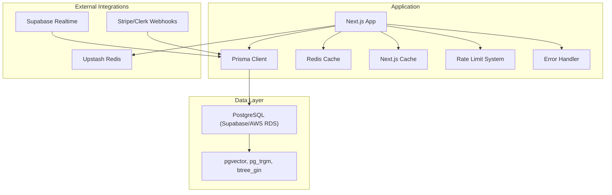
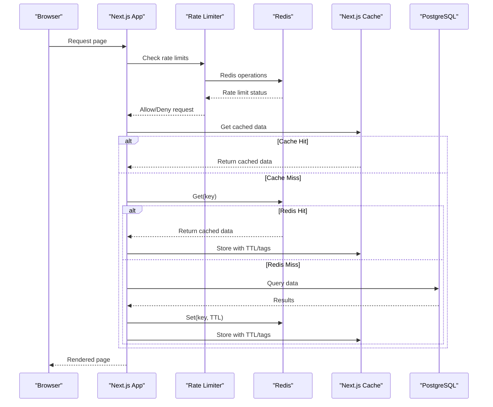
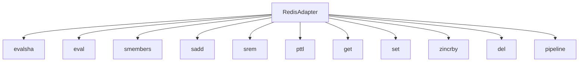
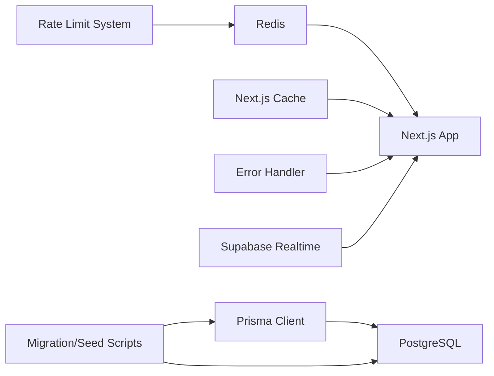

# Data Management

<cite>
**Referenced Files in This Document**
- [schema.prisma](file://prisma/schema.prisma)
- [seed.ts](file://prisma/seed.ts)
- [prisma.ts](file://src/lib/prisma.ts)
- [cache.ts](file://src/lib/cache.ts)
- [redis.ts](file://src/lib/redis.ts)
- [cache-keys.ts](file://src/lib/cache-keys.ts)
- [supabase-realtime.ts](file://src/lib/supabase-realtime.ts)
- [redis-adapter.ts](file://src/lib/rate-limit/redis-adapter.ts)
- [index.ts](file://src/lib/rate-limit/index.ts)
- [config.ts](file://src/lib/rate-limit/config.ts)
- [api-response.ts](file://src/lib/api-response.ts)
- [classification.ts](file://src/lib/errors/classification.ts)
- [api-error-handler.ts](file://src/lib/middleware/api-error-handler.ts)
- [migrate-asset-metrics.ts](file://scripts/migrate-asset-metrics.ts)
- [migrate-colors.ts](file://scripts/migrate-colors.ts)
- [20260317050000_rebaseline/migration.sql](file://prisma/migrations/20260317050000_rebaseline/migration.sql)
- [migrate-database.ts](file://scripts/migrate-database.ts)
- [data-pipeline-patterns/SKILL.md](file://.windsurf/skills/data-pipeline-patterns/SKILL.md)
- [data-engineer.md](file://.windsurf/agents/data-engineer.md)
</cite>

## Update Summary
**Changes Made**
- Enhanced Redis integration documentation with comprehensive rate limiting implementation
- Added detailed error handling and API response formatting sections
- Updated caching architecture to reflect improved Redis adapter and rate limiting patterns
- Added new operational scripts documentation for asset metrics migration and color system updates
- Enhanced test coverage and quality assurance documentation

## Table of Contents
1. [Introduction](#introduction)
2. [Project Structure](#project-structure)
3. [Core Components](#core-components)
4. [Architecture Overview](#architecture-overview)
5. [Detailed Component Analysis](#detailed-component-analysis)
6. [Enhanced Redis Integration and Rate Limiting](#enhanced-redis-integration-and-rate-limiting)
7. [Improved Error Handling and API Response Management](#improved-error-handling-and-api-response-management)
8. [New Operational Scripts and Data Migration Tools](#new-operational-scripts-and-data-migration-tools)
9. [Comprehensive Test Coverage and Quality Assurance](#comprehensive-test-coverage-and-quality-assurance)
10. [Dependency Analysis](#dependency-analysis)
11. [Performance Considerations](#performance-considerations)
12. [Troubleshooting Guide](#troubleshooting-guide)
13. [Conclusion](#conclusion)
14. [Appendices](#appendices)

## Introduction
This document provides comprehensive data management documentation for LyraAlpha's database and data processing systems. It covers the Prisma ORM schema, core entities, relationships, and constraints; the migration and seeding strategy; enhanced caching architecture with Redis including rate limiting; improved error handling across API endpoints; data transformation and streaming; backup and archival procedures; and operational practices for data integrity, access patterns, indexing, and query optimization.

## Project Structure
The data management stack spans:
- Prisma ORM schema and migrations for Postgres
- Seeding scripts for initial dataset population
- Application-level caching with Next.js cache and Redis
- Enhanced rate limiting system with Redis adapters
- Comprehensive error handling and API response management
- Real-time integration via Supabase Realtime
- Operational scripts for migration and maintenance including new asset metrics and color system updates



**Diagram sources**
- [prisma.ts:29-60](file://src/lib/prisma.ts#L29-L60)
- [redis.ts:49-67](file://src/lib/redis.ts#L49-L67)
- [supabase-realtime.ts:1-9](file://src/lib/supabase-realtime.ts#L1-L9)
- [redis-adapter.ts:26-31](file://src/lib/rate-limit/redis-adapter.ts#L26-L31)

**Section sources**
- [prisma.ts:1-69](file://src/lib/prisma.ts#L1-L69)
- [redis.ts:1-455](file://src/lib/redis.ts#L1-L455)
- [cache.ts:1-21](file://src/lib/cache.ts#L1-L21)
- [supabase-realtime.ts:1-9](file://src/lib/supabase-realtime.ts#L1-L9)

## Core Components
- Prisma ORM schema defines entities for assets, users, gamification, portfolios, discovery feed, market regimes, and more. It includes enums, relations, and indexes tailored for analytical and real-time use cases.
- Seeding script populates sectors, assets, trending questions, and blog posts for a ready-to-use discovery universe.
- Enhanced caching layers:
  - Next.js cache for server-side data fetching with tags and TTL.
  - Redis for high-throughput, low-latency caching with atomic locks, in-flight deduplication, stale-while-revalidate, and comprehensive rate limiting.
- Advanced rate limiting system with Redis adapters supporting sliding window and fixed window algorithms.
- Comprehensive error handling with classified error types and standardized API response formats.
- Real-time integration via Supabase for streaming and notifications.
- Migration and maintenance scripts for database transitions and integrity checks including new asset metrics and color system updates.

**Section sources**
- [schema.prisma:1-1046](file://prisma/schema.prisma#L1-L1046)
- [seed.ts:1-392](file://prisma/seed.ts#L1-L392)
- [cache.ts:1-21](file://src/lib/cache.ts#L1-L21)
- [redis.ts:142-454](file://src/lib/redis.ts#L142-L454)
- [redis-adapter.ts:26-126](file://src/lib/rate-limit/redis-adapter.ts#L26-L126)
- [api-response.ts:6-27](file://src/lib/api-response.ts#L6-L27)
- [classification.ts:5-52](file://src/lib/errors/classification.ts#L5-L52)
- [supabase-realtime.ts:1-9](file://src/lib/supabase-realtime.ts#L1-L9)

## Architecture Overview
The system integrates a Postgres backend with vector extensions for embeddings, a Redis cache for hot-path reads with comprehensive rate limiting, and Next.js cache for server rendering. Enhanced error handling ensures robust API responses, while real-time updates are supported via Supabase. Migrations and seeding ensure consistent schema and baseline datasets, with new operational scripts for advanced data management.



**Diagram sources**
- [index.ts:94-190](file://src/lib/rate-limit/index.ts#L94-L190)
- [redis.ts:338-373](file://src/lib/redis.ts#L338-L373)

## Detailed Component Analysis

### Prisma ORM Schema and Entities
The schema defines core entities and relationships:
- Users, Preferences, Sessions, Activity Events
- Assets, Scores, Evidence, Institutional Events, Price History
- Market Regime, Multi-Horizon Regime, Historical Analog
- Discovery Feed Items, Watchlists, Portfolios, Holdings
- Gamification: XP, Badges, Learning Completions, Point Transactions
- Payments: Subscriptions, Payment Events, Credit Transactions/Lots, Packages
- Knowledge Docs, Prompts, AI Request Logs
- Support Conversations/Messages/Knowledge Docs
- Blog Posts

Key design characteristics:
- Enums for statuses, tiers, regions, and types.
- JSON fields for flexible analytics and metadata.
- Vector fields for embeddings.
- Extensive indexes for frequent filters and sorts (e.g., by region, date, user, asset).
- Unique constraints for data integrity (e.g., user preferences, subscription provider IDs, asset-score per day).

```mermaid
erDiagram
USER ||--o{ USER_PREFERENCE : "has"
USER ||--o{ USER_SESSION : "has"
USER ||--o{ USER_ACTIVITY_EVENT : "generates"
USER ||--o{ SUBSCRIPTION : "has"
USER ||--o{ PAYMENT_EVENT : "involved_in"
USER ||--o{ CREDIT_TRANSACTION : "has"
USER ||--o{ CREDIT_LOT : "owns"
USER ||--o{ PORTFOLIO : "owns"
USER ||--o{ WATCHLIST_ITEM : "has"
USER ||--o{ DISCOVERY_FEED_ITEM : "consumes"
USER ||--o{ AI_REQUEST_LOG : "generates"
USER ||--o{ LYRA_FEEDBACK : "gives"
USER ||--o{ SUPPORT_CONVERSATION : "participates_in"
ASSET ||--o{ ASSET_SCORE : "has_many"
ASSET ||--o{ EVIDENCE : "has_many"
ASSET ||--o{ INSTITUTIONAL_EVENT : "has_many"
ASSET ||--o{ PRICE_HISTORY : "has_many"
ASSET ||--o{ ASSET_SECTOR : "belongs_to"
ASSET ||--o{ DISCOVERY_FEED_ITEM : "featured_in"
ASSET ||--o{ WATCHLIST_ITEM : "watched_by"
ASSET ||--o{ PORTFOLIO_HOLDING : "held_in"
ASSET ||--o{ LYRA_ANALYSIS : "analyzed_in"
PORTFOLIO ||--o{ PORTFOLIO_HOLDING : "contains"
PORTFOLIO ||--o{ PORTFOLIO_HEALTH_SNAPSHOT : "tracked_by"
```



**Diagram sources**
- [schema.prisma:396-794](file://prisma/schema.prisma#L396-L794)

**Section sources**
- [schema.prisma:1-1046](file://prisma/schema.prisma#L1-L1046)

### Migration Strategy
- Migration tooling uses pg_dump/pg_restore for efficient, parallel migration from Supabase to AWS RDS.
- Pre-flight steps enable required PostgreSQL extensions (vector, pg_trgm, btree_gin).
- Migration script verifies row counts per table between source and target.
- After migration, Prisma migration history is deployed to the new database.

Operational highlights:
- Uses direct connections (not pooled) for migration tasks.
- Dry-run mode supports planning and validation.
- Parallel restore workers configured for speed.

**Section sources**
- [migrate-database.ts:1-272](file://scripts/migrate-database.ts#L1-L272)
- [20260317050000_rebaseline/migration.sql:1-1320](file://prisma/migrations/20260317050000_rebaseline/migration.sql#L1-L1320)

### Seeding Processes
- Seeds sectors, assets, and asset-sector mappings aligned with crypto themes.
- Upserts trending questions and blog posts from static content into the database.
- Initializes baseline analytics scores and compatibility metadata for assets.

Benefits:
- Provides a consistent, reproducible dataset for development and staging.
- Ensures discovery feed and analytics surfaces are immediately usable.

**Section sources**
- [seed.ts:1-392](file://prisma/seed.ts#L1-L392)

### Enhanced Caching Architecture with Redis
Redis provides:
- High-throughput GET/SET/DEL with TTL.
- Atomic SET NX with fail-open/fail-closed variants for idempotency and deduplication.
- In-flight request deduplication to prevent thundering herds.
- Stale-while-revalidate with envelopes for stale thresholds.
- Prefix-based invalidation with SCAN and pipelined deletes.
- Metrics collection for cache hit/miss rates and pipeline health.
- Comprehensive rate limiting integration with Redis adapters supporting sliding window and fixed window algorithms.

Next.js cache complements Redis:
- Server-side caching with tags and TTL for route-level invalidation.
- Seamless integration with server components and data fetching.

Cache keys:
- Personal briefing, dashboard home, portfolio analytics, macro research, and sector analytics use structured prefixes for targeted invalidation.


**Diagram sources**
- [redis.ts:338-373](file://src/lib/redis.ts#L338-L373)
- [cache.ts:10-20](file://src/lib/cache.ts#L10-L20)

**Section sources**
- [redis.ts:142-454](file://src/lib/redis.ts#L142-L454)
- [cache.ts:1-21](file://src/lib/cache.ts#L1-L21)
- [cache-keys.ts:1-36](file://src/lib/cache-keys.ts#L1-L36)

### Data Transformation Pipelines and Real-Time Streaming
- Data pipeline principles emphasize idempotency, schema drift detection, bronze/silver/gold layers, and explicit backfill/replay strategies.
- Streaming vs batch selection depends on freshness needs and source capabilities.
- Real-time integration via Supabase enables live updates for support messages and related features.

Operational guidance:
- Normalize identifiers and timestamps early.
- Preserve source-of-truth provenance for derived metrics.
- Separate ingestion mechanics from business logic.

**Section sources**
- [data-pipeline-patterns/SKILL.md:1-106](file://.windsurf/skills/data-pipeline-patterns/SKILL.md#L1-L106)
- [data-engineer.md:1-64](file://.windsurf/agents/data-engineer.md#L1-L64)
- [supabase-realtime.ts:1-9](file://src/lib/supabase-realtime.ts#L1-L9)

### Backup Procedures, Archival, and Cleanup Strategies
- Migration script leverages pg_dump/pg_restore for robust backups and migrations.
- Row-count verification ensures integrity during cut-overs.
- Cleanup utilities exist for old price history and general database maintenance (refer to scripts directory for additional cleanup routines).

Recommended practices:
- Schedule regular dumps and verify restoration paths.
- Maintain dry-run procedures before production changes.
- Archive historical datasets separately and enforce retention policies.

**Section sources**
- [migrate-database.ts:183-230](file://scripts/migrate-database.ts#L183-L230)

### Data Access Patterns, Indexing, and Query Optimization
- Extensive indexes on frequently filtered/sorted columns (e.g., user IDs, dates, regions, symbols).
- Unique constraints prevent duplicates (e.g., asset scores per day).
- JSON fields support flexible analytics; vector fields enable similarity searches.
- Connection pooling tuned for serverless environments with SSL configuration for Supabase.

Optimization tips:
- Use selective projections and pagination for large lists.
- Leverage indexes for time-series queries (e.g., price history).
- Apply region filters early to reduce result sets.
- Batch writes and invalidate by prefix for cache warming.

**Section sources**
- [schema.prisma:117-124](file://prisma/schema.prisma#L117-L124)
- [prisma.ts:10-27](file://src/lib/prisma.ts#L10-L27)

## Enhanced Redis Integration and Rate Limiting

### Redis Adapter Implementation
The Redis adapter provides compatibility between ioredis and @upstash/ratelimit libraries, implementing essential Redis commands for rate limiting operations:

- **Script Evaluation**: Supports both `evalsha` and `eval` for Lua script execution
- **Set Operations**: Handles `smembers`, `sadd`, and `srem` for membership management
- **Key Operations**: Manages `pttl` for expiration, `get`/`set` with JSON parsing
- **Sorted Set Operations**: Implements `zincrby` for scoring and ranking
- **Pipeline Support**: Provides pipeline interface with proper result mapping



**Diagram sources**
- [redis-adapter.ts:26-126](file://src/lib/rate-limit/redis-adapter.ts#L26-L126)

**Section sources**
- [redis-adapter.ts:26-126](file://src/lib/rate-limit/redis-adapter.ts#L26-L126)

### Rate Limiting Configuration and Implementation
The rate limiting system implements multiple algorithms with configurable tiers:

#### Rate Limit Algorithms
- **Sliding Window**: Used for chat endpoints with precise request counting
- **Fixed Window**: Used for general endpoints with simpler bucket-based limiting
- **Hybrid Approach**: Combines daily burst limits with monthly caps for comprehensive protection

#### Tier-Based Configuration
Rate limits are configured per plan tier (STARTER, PRO, ELITE, ENTERPRISE) with different request limits and time windows:

| Endpoint | STARTER | PRO | ELITE | ENTERPRISE |
|----------|---------|-----|-------|------------|
| Chat Daily Burst | 60/1d | 120/1d | 300/1d | 1200/1d |
| Chat Monthly Cap | 1000/30d | 4000/30d | 12000/30d | 50000/30d |
| Discovery | 200/1h | 500/1h | 2000/1h | 8000/1h |
| Market Data | 500/1h | 2000/1h | 8000/1h | 32000/1h |
| General | 1000/1h | 5000/1h | 20000/1h | 80000/1h |

#### Timeout and Fail-Safe Mechanisms
- **Timeout Protection**: Configurable timeouts (1000-1200ms) prevent rate limit checks from blocking requests
- **Fail-Open Strategy**: Graceful degradation when Redis is unavailable
- **Fail-Closed Strategy**: Strict enforcement during Redis failures for critical operations

**Section sources**
- [config.ts:12-107](file://src/lib/rate-limit/config.ts#L12-L107)
- [index.ts:94-372](file://src/lib/rate-limit/index.ts#L94-L372)

### Rate Limiting Endpoints and Usage Patterns
The system provides specialized rate limiting functions for different API endpoints:

#### Chat Rate Limiting
- **Most Restrictive**: Combines daily burst and monthly cap limits
- **Sliding Window Algorithm**: Precise request counting with smooth rate control
- **Parallel Processing**: Executes daily and monthly checks concurrently

#### Market Data Rate Limiting
- **Fixed Window Algorithm**: Simpler, more predictable rate limiting
- **User Context**: Resolves user plans dynamically for personalized limits
- **Timeout Protection**: Prevents blocking during Redis latency spikes

#### Public Chat Burst Protection
- **Layered Security**: Additional protection for unauthenticated endpoints
- **IP-Based Identification**: Uses client IP when user ID is unavailable
- **Fail-Open Strategy**: Allows legitimate traffic during Redis failures

**Section sources**
- [index.ts:94-314](file://src/lib/rate-limit/index.ts#L94-L314)

## Improved Error Handling and API Response Management

### Standardized API Response Format
The system implements a consistent API response format with success/error states:

```typescript
type ApiResponse<T = unknown> = 
  | { success: true; data: T; error?: never }
  | { success: false; data?: never; error: string; details?: unknown };
```

#### Success Responses
- **Structure**: `{ success: true, data: T }`
- **Status Codes**: Default 200, customizable per endpoint
- **Data Serialization**: Automatic JSON serialization with date handling

#### Error Responses
- **Structure**: `{ success: false, error: string, details?: unknown }`
- **Sanitization**: Production-safe error messages to prevent information leakage
- **Logging**: Detailed logging for debugging while maintaining security

**Section sources**
- [api-response.ts:6-27](file://src/lib/api-response.ts#L6-L27)

### Error Classification and Severity
A comprehensive error classification system categorizes errors by type and severity:

#### Error Types
- **Network**: Connection failures, timeouts, DNS resolution issues
- **Database**: Query failures, constraint violations, connection errors
- **External API**: Third-party service failures, authentication issues
- **Validation**: Input validation failures, schema mismatches
- **Rate Limit**: Rate limit exceeded, quota limitations
- **Authentication**: Invalid credentials, session expired
- **Authorization**: Permission denied, insufficient privileges
- **Not Found**: Resource not found, invalid identifiers
- **Internal**: Unexpected server errors, unhandled exceptions

#### Severity Levels
- **Low**: Non-critical issues, minor performance impacts
- **Medium**: Service degradation, partial functionality loss
- **High**: Major service disruption, data inconsistency
- **Critical**: System failure, data loss, security breach

**Section sources**
- [classification.ts:5-52](file://src/lib/errors/classification.ts#L5-L52)

### Middleware Error Handling
The API error handler provides centralized error processing with:

#### Validation Error Handling
- **Zod Integration**: Structured field-level validation errors
- **Detailed Reporting**: Individual field error information
- **HTTP Status Mapping**: Proper 422 status codes for validation failures

#### Common Error Responses
Predefined error response helpers for standard scenarios:
- **Bad Request**: Invalid request format or parameters
- **Unauthorized**: Authentication required or invalid credentials
- **Forbidden**: Access denied due to permissions
- **Not Found**: Resource not found
- **Conflict**: Resource conflict or duplicate entry
- **Rate Limit**: Too many requests within time window
- **Internal**: Server error with sanitization
- **Unavailable**: Service temporarily unavailable

#### Production Safety
- **Error Sanitization**: Internal errors hidden in production
- **Logging**: Original error details logged for debugging
- **Consistent Responses**: Standardized error format across all endpoints

**Section sources**
- [api-error-handler.ts:93-193](file://src/lib/middleware/api-error-handler.ts#L93-L193)

## New Operational Scripts and Data Migration Tools

### Asset Metrics Migration Script
The asset metrics migration script provides a comprehensive solution for migrating legacy data to new AssetMetrics entities:

#### Migration Process
- **Source Detection**: Identifies assets with populated JSON metric fields
- **Duplicate Prevention**: Checks for existing AssetMetrics records before migration
- **Atomic Operations**: Uses raw SQL queries to avoid type conflicts
- **Batch Processing**: Processes assets in batches with progress tracking

#### Supported Metrics
The script migrates comprehensive metric data including:
- Factor data and alignment metrics
- Correlation data and regime analysis
- Score dynamics and performance indicators
- Signal strength and intelligence data
- Scenario modeling and event-adjusted scores

#### Error Handling and Tracking
- **Progress Monitoring**: Tracks migrated, skipped, and failed records
- **Error Logging**: Detailed error reporting with asset identification
- **Graceful Degradation**: Continues processing despite individual failures

**Section sources**
- [migrate-asset-metrics.ts:11-117](file://scripts/migrate-asset-metrics.ts#L11-L117)

### Color System Migration Script
The color system migration script provides semantic color token replacement for consistent theming:

#### Migration Strategy
- **Semantic Tokens**: Replaces raw Tailwind color utilities with semantic roles
- **Pattern Matching**: Uses regex patterns to identify color utilities
- **Idempotent Operations**: Safe to run multiple times without side effects
- **Dry Run Mode**: Validates changes before applying modifications

#### Color Mapping
The script maps raw colors to semantic roles:
- `emerald` → `success`
- `rose` → `danger`
- `amber` → `warning`
- `sky` → `info`
- `cyan` → `info`

#### Scope and Safety
- **Utility Coverage**: Supports text, background, border, fill, stroke, ring, gradient utilities
- **Shade Preservation**: Maintains opacity and shade variations
- **Directory Filtering**: Excludes node_modules, build artifacts, and generated files
- **File Extension Control**: Processes only TypeScript/JavaScript and CSS files

**Section sources**
- [migrate-colors.ts:25-252](file://scripts/migrate-colors.ts#L25-L252)

### Database Migration Tooling
Enhanced migration tooling supports:
- **Parallel Restoration**: Optimized database restoration with multiple workers
- **Row Count Verification**: Ensures data integrity during migration
- **Extension Management**: Automatic enabling of required PostgreSQL extensions
- **Environment Configuration**: Flexible deployment across different environments

**Section sources**
- [migrate-database.ts:1-272](file://scripts/migrate-database.ts#L1-L272)

## Comprehensive Test Coverage and Quality Assurance

### Testing Framework Integration
The project maintains comprehensive test coverage with modern testing frameworks:

#### Test Runner Automation
- **Framework Detection**: Automatically detects Jest, Vitest, or custom configurations
- **Coverage Reporting**: Generates detailed coverage reports with customizable thresholds
- **Multi-language Support**: Handles both TypeScript and Python test suites
- **Execution Monitoring**: Provides real-time test execution feedback

#### Test Generation Workflow
- **Code Analysis**: Analyzes target functions and identifies edge cases
- **Mock Dependencies**: Automatically creates appropriate mocks for external dependencies
- **Integration Testing**: Supports end-to-end and integration test scenarios
- **Quality Gates**: Enforces minimum coverage thresholds before deployment

#### Test Coverage Analysis
- **TypeScript Coverage**: Validates type safety and interface compliance
- **Python Coverage**: Ensures Python components meet quality standards
- **Cross-platform Compatibility**: Tests run consistently across different environments
- **Performance Metrics**: Tracks test execution time and resource usage

### API Validation and Quality Assurance
- **Endpoint Validation**: Automated checking of API endpoint compliance
- **Response Format Verification**: Ensures consistent API response structures
- **Best Practices Audit**: Validates adherence to API design guidelines
- **Security Testing**: Includes vulnerability scanning and security validation

**Section sources**
- [.windsurf/skills/testing-patterns/scripts/test_runner.py:1-181](file://.windsurf/skills/testing-patterns/scripts/test_runner.py#L1-L181)
- [.windsurf/skills/lint-and-validate/scripts/type_coverage.py:128-173](file://.windsurf/skills/lint-and-validate/scripts/type_coverage.py#L128-L173)

## Dependency Analysis


**Diagram sources**
- [prisma.ts:29-60](file://src/lib/prisma.ts#L29-L60)
- [redis.ts:49-67](file://src/lib/redis.ts#L49-L67)
- [supabase-realtime.ts:1-9](file://src/lib/supabase-realtime.ts#L1-L9)
- [migrate-database.ts:171-181](file://scripts/migrate-database.ts#L171-L181)

**Section sources**
- [prisma.ts:1-69](file://src/lib/prisma.ts#L1-L69)
- [redis.ts:1-455](file://src/lib/redis.ts#L1-L455)
- [migrate-database.ts:1-272](file://scripts/migrate-database.ts#L1-L272)

## Performance Considerations
- Use Redis for hot-path reads and Next.js cache for server-side TTL/tag invalidation.
- Employ in-flight deduplication to avoid redundant heavy computations.
- Prefer prefix-based invalidation to minimize broad cache clears.
- Implement rate limiting with appropriate timeouts to prevent blocking during Redis latency.
- Use Redis adapters for seamless integration with @upstash/ratelimit library.
- Tune Prisma pool sizes for serverless concurrency and SSL settings for Supabase.
- Enable vector and text search extensions for analytics and retrieval.
- Implement fail-open strategies for non-critical operations and fail-closed for security-sensitive operations.

## Troubleshooting Guide
Common issues and remedies:
- Redis failures: Fail-open for idempotency checks; fail-closed for deduplication to prevent overload.
- Rate limit timeouts: Configurable timeouts prevent blocking; adjust based on Redis performance.
- Cache deserialization: Automatic ISO date revival and fallback parsing for non-JSON values.
- Migration verification: Use row-count checks and dry-run mode before cutting over.
- Real-time connectivity: Validate Supabase credentials and environment variables.
- Error handling: Use classified error types for proper error categorization and response formatting.
- API response issues: Verify standardized response format and proper error sanitization.

**Section sources**
- [redis.ts:218-245](file://src/lib/redis.ts#L218-L245)
- [redis.ts:142-174](file://src/lib/redis.ts#L142-L174)
- [migrate-database.ts:232-272](file://scripts/migrate-database.ts#L232-L272)
- [supabase-realtime.ts:1-9](file://src/lib/supabase-realtime.ts#L1-L9)
- [index.ts:66-79](file://src/lib/rate-limit/index.ts#L66-L79)

## Conclusion
LyraAlpha's data management stack combines a robust Prisma schema with enhanced caching, comprehensive rate limiting, advanced error handling, and reliable migration tooling. The recent improvements in Redis integration, error handling, and test coverage provide a solid foundation for scalable analytics, responsive UIs, and trustworthy data products. The new operational scripts for asset metrics migration and color system updates demonstrate the system's commitment to continuous improvement and maintainability.

## Appendices
- Cache key naming conventions enable precise invalidation and observability.
- Data pipeline principles guide safe, observable transformations and reprocessing.
- Rate limiting configuration provides flexible protection across different endpoint types.
- Error classification system ensures consistent error handling and response formatting.
- Comprehensive test coverage validates system reliability and quality.

**Section sources**
- [cache-keys.ts:1-36](file://src/lib/cache-keys.ts#L1-L36)
- [data-pipeline-patterns/SKILL.md:1-106](file://.windsurf/skills/data-pipeline-patterns/SKILL.md#L1-L106)
- [config.ts:78-98](file://src/lib/rate-limit/config.ts#L78-L98)
- [classification.ts:24-31](file://src/lib/errors/classification.ts#L24-L31)
- [migrate-asset-metrics.ts:11-117](file://scripts/migrate-asset-metrics.ts#L11-L117)
- [migrate-colors.ts:25-252](file://scripts/migrate-colors.ts#L25-L252)