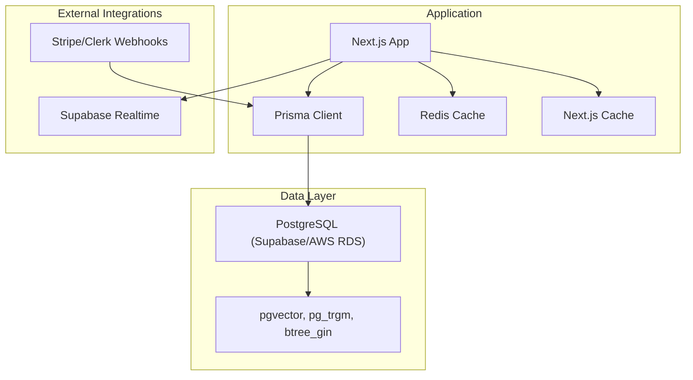
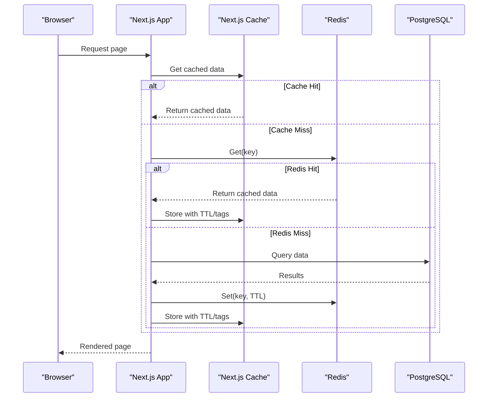
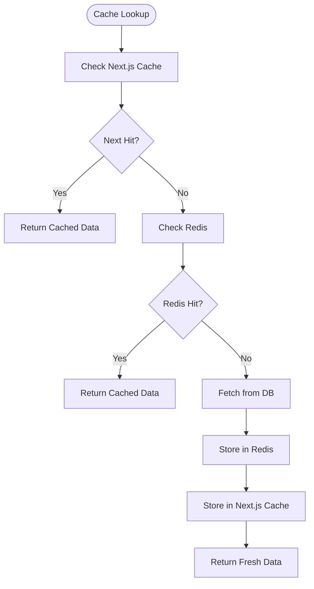
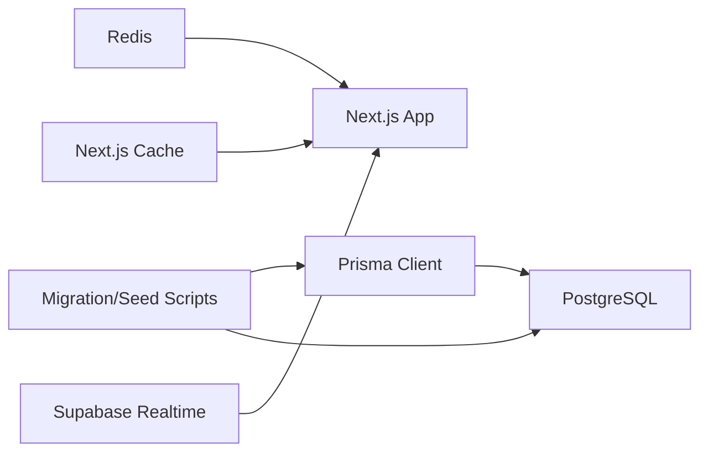

# Data Management

<cite>
**Referenced Files in This Document**
- [schema.prisma](file://prisma/schema.prisma)
- [seed.ts](file://prisma/seed.ts)
- [prisma.ts](file://src/lib/prisma.ts)
- [cache.ts](file://src/lib/cache.ts)
- [redis.ts](file://src/lib/redis.ts)
- [cache-keys.ts](file://src/lib/cache-keys.ts)
- [supabase-realtime.ts](file://src/lib/supabase-realtime.ts)
- [20260317050000_rebaseline/migration.sql](file://prisma/migrations/20260317050000_rebaseline/migration.sql)
- [migrate-database.ts](file://scripts/migrate-database.ts)
- [data-pipeline-patterns/SKILL.md](file://.windsurf/skills/data-pipeline-patterns/SKILL.md)
- [data-engineer.md](file://.windsurf/agents/data-engineer.md)
</cite>

## Table of Contents
1. [Introduction](#introduction)
2. [Project Structure](#project-structure)
3. [Core Components](#core-components)
4. [Architecture Overview](#architecture-overview)
5. [Detailed Component Analysis](#detailed-component-analysis)
6. [Dependency Analysis](#dependency-analysis)
7. [Performance Considerations](#performance-considerations)
8. [Troubleshooting Guide](#troubleshooting-guide)
9. [Conclusion](#conclusion)
10. [Appendices](#appendices)

## Introduction
This document provides comprehensive data management documentation for LyraAlpha’s database and data processing systems. It covers the Prisma ORM schema, core entities, relationships, and constraints; the migration and seeding strategy; caching architecture with Redis; data transformation and streaming; backup and archival procedures; and operational practices for data integrity, access patterns, indexing, and query optimization.

## Project Structure
The data management stack spans:
- Prisma ORM schema and migrations for Postgres
- Seeding scripts for initial dataset population
- Application-level caching with Next.js cache and Redis
- Real-time integration via Supabase Realtime
- Operational scripts for migration and maintenance

**Diagram sources**
- [prisma.ts:29-60](file://src/lib/prisma.ts#L29-L60)
- [redis.ts:49-67](file://src/lib/redis.ts#L49-L67)
- [supabase-realtime.ts:1-9](file://src/lib/supabase-realtime.ts#L1-L9)

**Section sources**
- [prisma.ts:1-69](file://src/lib/prisma.ts#L1-L69)
- [redis.ts:1-455](file://src/lib/redis.ts#L1-L455)
- [cache.ts:1-21](file://src/lib/cache.ts#L1-L21)
- [supabase-realtime.ts:1-9](file://src/lib/supabase-realtime.ts#L1-L9)

## Core Components
- Prisma ORM schema defines entities for assets, users, gamification, portfolios, discovery feed, market regimes, and more. It includes enums, relations, and indexes tailored for analytical and real-time use cases.
- Seeding script populates sectors, assets, trending questions, and blog posts for a ready-to-use discovery universe.
- Caching layers:
  - Next.js cache for server-side data fetching with tags and TTL.
  - Redis for high-throughput, low-latency caching with atomic locks, in-flight deduplication, and stale-while-revalidate.
- Real-time integration via Supabase for streaming and notifications.
- Migration and maintenance scripts for database transitions and integrity checks.

**Section sources**
- [schema.prisma:1-1046](file://prisma/schema.prisma#L1-L1046)
- [seed.ts:1-392](file://prisma/seed.ts#L1-L392)
- [cache.ts:1-21](file://src/lib/cache.ts#L1-L21)
- [redis.ts:142-454](file://src/lib/redis.ts#L142-L454)
- [supabase-realtime.ts:1-9](file://src/lib/supabase-realtime.ts#L1-L9)

## Architecture Overview
The system integrates a Postgres backend with vector extensions for embeddings, a Redis cache for hot-path reads, and Next.js cache for server rendering. Real-time updates are supported via Supabase. Migrations and seeding ensure consistent schema and baseline datasets.

**Diagram sources**
- [cache.ts:10-20](file://src/lib/cache.ts#L10-L20)
- [redis.ts:338-373](file://src/lib/redis.ts#L338-L373)

## Detailed Component Analysis

### Prisma ORM Schema and Entities
The schema defines core entities and relationships:
- Users, Preferences, Sessions, Activity Events
- Assets, Scores, Evidence, Institutional Events, Price History
- Market Regime, Multi-Horizon Regime, Historical Analog
- Discovery Feed Items, Watchlists, Portfolios, Holdings
- Gamification: XP, Badges, Learning Completions, Point Transactions
- Payments: Subscriptions, Payment Events, Credit Transactions/Lots, Packages
- Knowledge Docs, Prompts, AI Request Logs
- Support Conversations/Messages/Knowledge Docs
- Blog Posts

Key design characteristics:
- Enums for statuses, tiers, regions, and types.
- JSON fields for flexible analytics and metadata.
- Vector fields for embeddings.
- Extensive indexes for frequent filters and sorts (e.g., by region, date, user, asset).
- Unique constraints for data integrity (e.g., user preferences, subscription provider IDs, asset-score per day).

```mermaid
erDiagram
USER ||--o{ USER_PREFERENCE : "has"
USER ||--o{ USER_SESSION : "has"
USER ||--o{ USER_ACTIVITY_EVENT : "generates"
USER ||--o{ SUBSCRIPTION : "has"
USER ||--o{ PAYMENT_EVENT : "involved_in"
USER ||--o{ CREDIT_TRANSACTION : "has"
USER ||--o{ CREDIT_LOT : "owns"
USER ||--o{ PORTFOLIO : "owns"
USER ||--o{ WATCHLIST_ITEM : "has"
USER ||--o{ DISCOVERY_FEED_ITEM : "consumes"
USER ||--o{ AI_REQUEST_LOG : "generates"
USER ||--o{ LYRA_FEEDBACK : "gives"
USER ||--o{ SUPPORT_CONVERSATION : "participates_in"
ASSET ||--o{ ASSET_SCORE : "has_many"
ASSET ||--o{ EVIDENCE : "has_many"
ASSET ||--o{ INSTITUTIONAL_EVENT : "has_many"
ASSET ||--o{ PRICE_HISTORY : "has_many"
ASSET ||--o{ ASSET_SECTOR : "belongs_to"
ASSET ||--o{ DISCOVERY_FEED_ITEM : "featured_in"
ASSET ||--o{ WATCHLIST_ITEM : "watched_by"
ASSET ||--o{ PORTFOLIO_HOLDING : "held_in"
ASSET ||--o{ LYRA_ANALYSIS : "analyzed_in"
PORTFOLIO ||--o{ PORTFOLIO_HOLDING : "contains"
PORTFOLIO ||--o{ PORTFOLIO_HEALTH_SNAPSHOT : "tracked_by"
```

**Diagram sources**
- [schema.prisma:396-794](file://prisma/schema.prisma#L396-L794)

**Section sources**
- [schema.prisma:1-1046](file://prisma/schema.prisma#L1-L1046)

### Migration Strategy
- Migration tooling uses pg_dump/pg_restore for efficient, parallel migration from Supabase to AWS RDS.
- Pre-flight steps enable required PostgreSQL extensions (vector, pg_trgm, btree_gin).
- Migration script verifies row counts per table between source and target.
- After migration, Prisma migration history is deployed to the new database.

Operational highlights:
- Uses direct connections (not pooled) for migration tasks.
- Dry-run mode supports planning and validation.
- Parallel restore workers configured for speed.

**Section sources**
- [migrate-database.ts:1-272](file://scripts/migrate-database.ts#L1-L272)
- [20260317050000_rebaseline/migration.sql:1-1320](file://prisma/migrations/20260317050000_rebaseline/migration.sql#L1-L1320)

### Seeding Processes
- Seeds sectors, assets, and asset-sector mappings aligned with crypto themes.
- Upserts trending questions and blog posts from static content into the database.
- Initializes baseline analytics scores and compatibility metadata for assets.

Benefits:
- Provides a consistent, reproducible dataset for development and staging.
- Ensures discovery feed and analytics surfaces are immediately usable.

**Section sources**
- [seed.ts:1-392](file://prisma/seed.ts#L1-L392)

### Caching Architecture with Redis
Redis provides:
- High-throughput GET/SET/DEL with TTL.
- Atomic SET NX with fail-open/fail-closed variants for idempotency and deduplication.
- In-flight request deduplication to prevent thundering herds.
- Stale-while-revalidate with envelopes for stale thresholds.
- Prefix-based invalidation with SCAN and pipelined deletes.
- Metrics collection for cache hit/miss rates and pipeline health.

Next.js cache complements Redis:
- Server-side caching with tags and TTL for route-level invalidation.
- Seamless integration with server components and data fetching.

Cache keys:
- Personal briefing, dashboard home, portfolio analytics, macro research, and sector analytics use structured prefixes for targeted invalidation.

**Diagram sources**
- [redis.ts:338-373](file://src/lib/redis.ts#L338-L373)
- [cache.ts:10-20](file://src/lib/cache.ts#L10-L20)

**Section sources**
- [redis.ts:142-454](file://src/lib/redis.ts#L142-L454)
- [cache.ts:1-21](file://src/lib/cache.ts#L1-L21)
- [cache-keys.ts:1-36](file://src/lib/cache-keys.ts#L1-L36)

### Data Transformation Pipelines and Real-Time Streaming
- Data pipeline principles emphasize idempotency, schema drift detection, bronze/silver/gold layers, and explicit backfill/replay strategies.
- Streaming vs batch selection depends on freshness needs and source capabilities.
- Real-time integration via Supabase enables live updates for support messages and related features.

Operational guidance:
- Normalize identifiers and timestamps early.
- Preserve source-of-truth provenance for derived metrics.
- Separate ingestion mechanics from business logic.

**Section sources**
- [data-pipeline-patterns/SKILL.md:1-106](file://.windsurf/skills/data-pipeline-patterns/SKILL.md#L1-L106)
- [data-engineer.md:1-64](file://.windsurf/agents/data-engineer.md#L1-L64)
- [supabase-realtime.ts:1-9](file://src/lib/supabase-realtime.ts#L1-L9)

### Backup Procedures, Archival, and Cleanup Strategies
- Migration script leverages pg_dump/pg_restore for robust backups and migrations.
- Row-count verification ensures integrity during cut-overs.
- Cleanup utilities exist for old price history and general database maintenance (refer to scripts directory for additional cleanup routines).

Recommended practices:
- Schedule regular dumps and verify restoration paths.
- Maintain dry-run procedures before production changes.
- Archive historical datasets separately and enforce retention policies.

**Section sources**
- [migrate-database.ts:183-230](file://scripts/migrate-database.ts#L183-L230)

### Data Access Patterns, Indexing, and Query Optimization
- Extensive indexes on frequently filtered/sorted columns (e.g., user IDs, dates, regions, symbols).
- Unique constraints prevent duplicates (e.g., asset scores per day).
- JSON fields support flexible analytics; vector fields enable similarity searches.
- Connection pooling tuned for serverless environments with SSL configuration for Supabase.

Optimization tips:
- Use selective projections and pagination for large lists.
- Leverage indexes for time-series queries (e.g., price history).
- Apply region filters early to reduce result sets.
- Batch writes and invalidate by prefix for cache warming.

**Section sources**
- [schema.prisma:117-124](file://prisma/schema.prisma#L117-L124)
- [prisma.ts:10-27](file://src/lib/prisma.ts#L10-L27)

## Dependency Analysis

**Diagram sources**
- [prisma.ts:29-60](file://src/lib/prisma.ts#L29-L60)
- [redis.ts:49-67](file://src/lib/redis.ts#L49-L67)
- [supabase-realtime.ts:1-9](file://src/lib/supabase-realtime.ts#L1-L9)
- [migrate-database.ts:171-181](file://scripts/migrate-database.ts#L171-L181)

**Section sources**
- [prisma.ts:1-69](file://src/lib/prisma.ts#L1-L69)
- [redis.ts:1-455](file://src/lib/redis.ts#L1-L455)
- [migrate-database.ts:1-272](file://scripts/migrate-database.ts#L1-L272)

## Performance Considerations
- Use Redis for hot-path reads and Next.js cache for server-side TTL/tag invalidation.
- Employ in-flight deduplication to avoid redundant heavy computations.
- Prefer prefix-based invalidation to minimize broad cache clears.
- Tune Prisma pool sizes for serverless concurrency and SSL settings for Supabase.
- Enable vector and text search extensions for analytics and retrieval.

## Troubleshooting Guide
Common issues and remedies:
- Redis failures: Fail-open for idempotency checks; fail-closed for deduplication to prevent overload.
- Cache deserialization: Automatic ISO date revival and fallback parsing for non-JSON values.
- Migration verification: Use row-count checks and dry-run mode before cutting over.
- Real-time connectivity: Validate Supabase credentials and environment variables.

**Section sources**
- [redis.ts:218-245](file://src/lib/redis.ts#L218-L245)
- [redis.ts:142-174](file://src/lib/redis.ts#L142-L174)
- [migrate-database.ts:232-272](file://scripts/migrate-database.ts#L232-L272)
- [supabase-realtime.ts:1-9](file://src/lib/supabase-realtime.ts#L1-L9)

## Conclusion
LyraAlpha’s data management stack combines a robust Prisma schema with efficient caching, real-time streaming, and reliable migration tooling. By adhering to idempotent pipelines, strong indexing, and validated integrity checks, the system supports scalable analytics, responsive UIs, and trustworthy data products.

## Appendices
- Cache key naming conventions enable precise invalidation and observability.
- Data pipeline principles guide safe, observable transformations and reprocessing.

**Section sources**
- [cache-keys.ts:1-36](file://src/lib/cache-keys.ts#L1-L36)
- [data-pipeline-patterns/SKILL.md:1-106](file://.windsurf/skills/data-pipeline-patterns/SKILL.md#L1-L106)