# Batch Processing Jobs

<cite>
**Referenced Files in This Document**
- [setup-qstash-schedules.ts](file://scripts/setup-qstash-schedules.ts)
- [cron-auth.ts](file://src/lib/middleware/cron-auth.ts)
- [daily-sync.ts](file://scripts/daily-sync.ts)
- [enrich-crypto-coingecko.ts](file://scripts/enrich-crypto-coingecko.ts)
- [backdate-market-regime.ts](file://scripts/backdate-market-regime.ts)
- [db-cleanup.ts](file://scripts/db-cleanup.ts)
- [migrate-database.ts](file://scripts/migrate-database.ts)
- [route.ts](file://src/app/api/cron/crypto-sync/route.ts)
- [route.ts](file://src/app/api/cron/daily-briefing/route.ts)
- [route.ts](file://src/app/api/cron/cache-stats/route.ts)
- [market-sync.service.ts](file://src/lib/services/market-sync.service.ts)
- [intelligence-events.service.ts](file://src/lib/services/intelligence-events.service.ts)
- [daily-briefing.service.ts](file://src/lib/services/daily-briefing.service.ts)
- [migrations.md](file://.windsurf/skills/database-design/migrations.md)
- [admin.service.ts](file://src/lib/services/admin.service.ts)
- [page.tsx](file://src/app/admin/ai-limits/page.tsx)
</cite>

## Table of Contents
1. [Introduction](#introduction)
2. [Project Structure](#project-structure)
3. [Core Components](#core-components)
4. [Architecture Overview](#architecture-overview)
5. [Detailed Component Analysis](#detailed-component-analysis)
6. [Dependency Analysis](#dependency-analysis)
7. [Performance Considerations](#performance-considerations)
8. [Troubleshooting Guide](#troubleshooting-guide)
9. [Conclusion](#conclusion)
10. [Appendices](#appendices)

## Introduction
This document explains LyraAlpha’s batch processing and scheduled job system. It covers the cron job architecture for periodic data synchronization, database maintenance, and system housekeeping. It also documents the daily market data synchronization process, historical data enrichment workflows, backup and migration procedures, audit and monitoring jobs, and operational dashboards. Job scheduling is powered by Upstash QStash, with robust authentication, retries, and observability.

## Project Structure
The batch processing system spans three main areas:
- Scheduled job orchestration and registration via QStash
- Cron endpoints under /api/cron that perform specific tasks
- Supporting scripts for enrichment, maintenance, and migrations

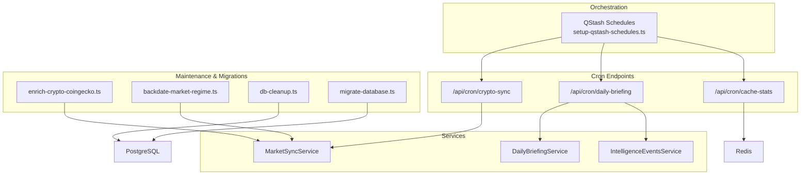

**Diagram sources**
- [setup-qstash-schedules.ts:1-116](file://scripts/setup-qstash-schedules.ts#L1-L116)
- [route.ts:1-44](file://src/app/api/cron/crypto-sync/route.ts#L1-L44)
- [route.ts:1-68](file://src/app/api/cron/daily-briefing/route.ts#L1-L68)
- [route.ts:1-41](file://src/app/api/cron/cache-stats/route.ts#L1-L41)
- [market-sync.service.ts:119-166](file://src/lib/services/market-sync.service.ts#L119-L166)
- [intelligence-events.service.ts:28-167](file://src/lib/services/intelligence-events.service.ts#L28-L167)
- [daily-briefing.service.ts:1-200](file://src/lib/services/daily-briefing.service.ts#L1-L200)
- [enrich-crypto-coingecko.ts:1-254](file://scripts/enrich-crypto-coingecko.ts#L1-L254)
- [backdate-market-regime.ts:1-372](file://scripts/backdate-market-regime.ts#L1-L372)
- [db-cleanup.ts:37-68](file://scripts/db-cleanup.ts#L37-L68)
- [migrate-database.ts:1-272](file://scripts/migrate-database.ts#L1-L272)

**Section sources**
- [setup-qstash-schedules.ts:1-116](file://scripts/setup-qstash-schedules.ts#L1-L116)
- [route.ts:1-44](file://src/app/api/cron/crypto-sync/route.ts#L1-L44)
- [route.ts:1-68](file://src/app/api/cron/daily-briefing/route.ts#L1-L68)
- [route.ts:1-41](file://src/app/api/cron/cache-stats/route.ts#L1-L41)

## Core Components
- QStash schedule registration script: defines all cron jobs, their cron expressions, and retry policies, and reconciles with existing schedules.
- Cron authentication middleware: validates QStash signatures in production and supports a development fallback.
- Cron endpoints: lightweight handlers that delegate to services and return structured JSON responses.
- Services: encapsulate business logic for market data synchronization, intelligence event generation, and daily briefings.
- Maintenance and migration scripts: handle enrichment, backdating, cleanup, and database migrations.

**Section sources**
- [setup-qstash-schedules.ts:35-63](file://scripts/setup-qstash-schedules.ts#L35-L63)
- [cron-auth.ts:18-102](file://src/lib/middleware/cron-auth.ts#L18-L102)
- [route.ts:1-44](file://src/app/api/cron/crypto-sync/route.ts#L1-L44)
- [route.ts:1-68](file://src/app/api/cron/daily-briefing/route.ts#L1-L68)
- [route.ts:1-41](file://src/app/api/cron/cache-stats/route.ts#L1-L41)
- [market-sync.service.ts:119-166](file://src/lib/services/market-sync.service.ts#L119-L166)
- [intelligence-events.service.ts:28-167](file://src/lib/services/intelligence-events.service.ts#L28-L167)
- [daily-briefing.service.ts:1-200](file://src/lib/services/daily-briefing.service.ts#L1-L200)

## Architecture Overview
The system uses QStash to schedule HTTP requests to Next.js API routes. Each route validates the request via a shared middleware, logs execution, and invokes a service method. Services coordinate external APIs, database writes, and caches. Maintenance and migration scripts run independently or are triggered manually.

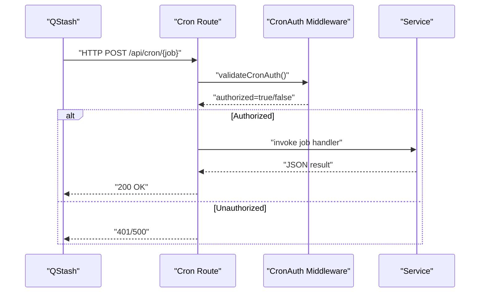

**Diagram sources**
- [cron-auth.ts:61-102](file://src/lib/middleware/cron-auth.ts#L61-L102)
- [route.ts:18-31](file://src/app/api/cron/crypto-sync/route.ts#L18-L31)
- [route.ts:19-48](file://src/app/api/cron/daily-briefing/route.ts#L19-L48)

## Detailed Component Analysis

### QStash Schedule Registration
- Purpose: Registers all cron schedules with QStash, reconciling existing schedules and updating only changed ones.
- Behavior:
  - Reads environment variables for QStash token and deployment URL.
  - Lists existing schedules and removes stale ones not present in the desired list.
  - Creates or recreates schedules with cron expressions and retry counts.
- Configuration: The schedule list includes job paths, cron expressions, and retry counts.

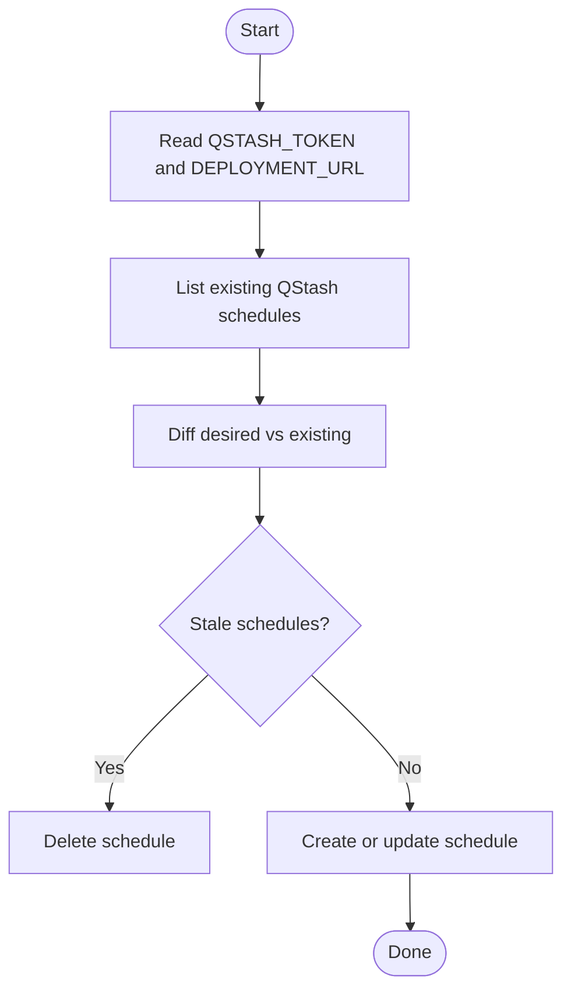

**Diagram sources**
- [setup-qstash-schedules.ts:65-111](file://scripts/setup-qstash-schedules.ts#L65-L111)

**Section sources**
- [setup-qstash-schedules.ts:19-31](file://scripts/setup-qstash-schedules.ts#L19-L31)
- [setup-qstash-schedules.ts:35-63](file://scripts/setup-qstash-schedules.ts#L35-L63)
- [setup-qstash-schedules.ts:65-111](file://scripts/setup-qstash-schedules.ts#L65-L111)

### Cron Authentication Middleware
- Production: Validates QStash signature using a Receiver with current and next signing keys.
- Development: Accepts a Bearer token from CRON_SECRET for local testing.
- Logging: Generates a request ID and logs job start with timing.

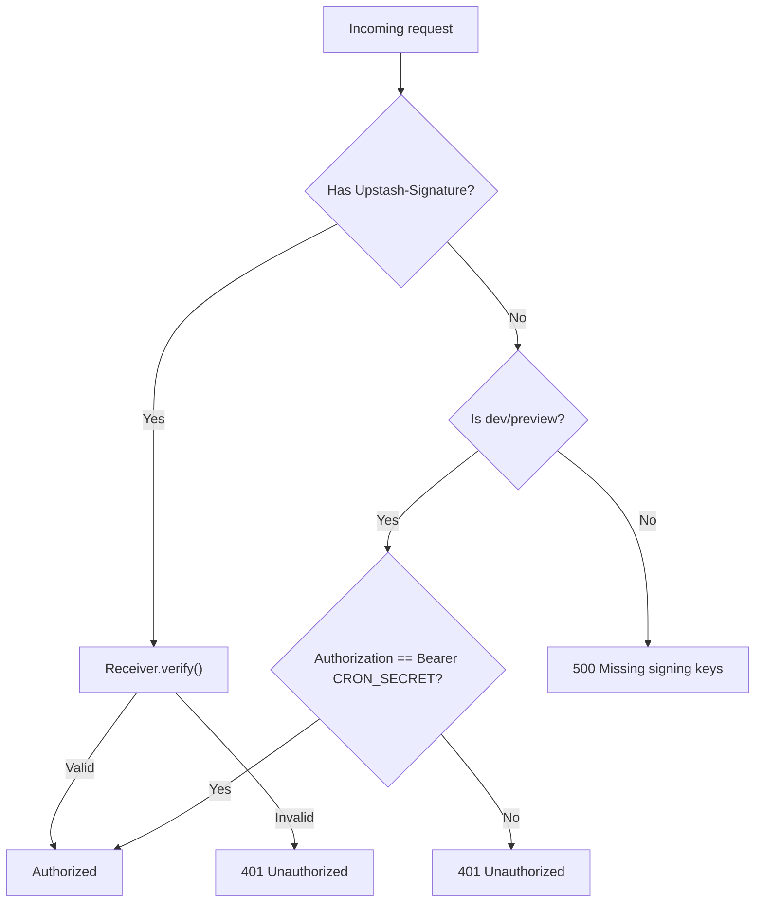

**Diagram sources**
- [cron-auth.ts:61-102](file://src/lib/middleware/cron-auth.ts#L61-L102)

**Section sources**
- [cron-auth.ts:18-102](file://src/lib/middleware/cron-auth.ts#L18-L102)

### Cron Endpoint: Crypto Market Sync
- Path: /api/cron/crypto-sync
- Triggers: MarketSyncService.runCryptoMarketSync
- Notes: Exposes POST for QStash and GET for status; sets dynamic mode and region preference.

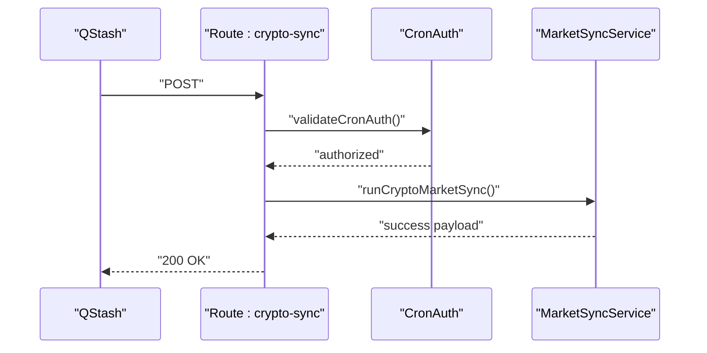

**Diagram sources**
- [route.ts:18-31](file://src/app/api/cron/crypto-sync/route.ts#L18-L31)
- [market-sync.service.ts:164-166](file://src/lib/services/market-sync.service.ts#L164-L166)

**Section sources**
- [route.ts:1-44](file://src/app/api/cron/crypto-sync/route.ts#L1-L44)
- [market-sync.service.ts:119-166](file://src/lib/services/market-sync.service.ts#L119-L166)

### Cron Endpoint: Daily Briefing
- Path: /api/cron/daily-briefing
- Triggers: DailyBriefingService.generateBriefings, followed by warming narratives and macro research refresh.
- Status: GET endpoint returns current US briefing status.

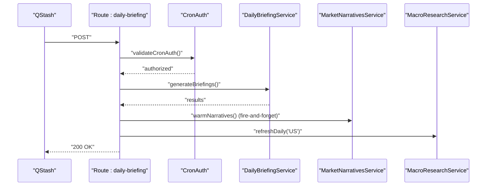

**Diagram sources**
- [route.ts:19-48](file://src/app/api/cron/daily-briefing/route.ts#L19-L48)
- [daily-briefing.service.ts:1-200](file://src/lib/services/daily-briefing.service.ts#L1-L200)

**Section sources**
- [route.ts:1-68](file://src/app/api/cron/daily-briefing/route.ts#L1-L68)
- [daily-briefing.service.ts:1-200](file://src/lib/services/daily-briefing.service.ts#L1-L200)

### Cron Endpoint: Cache Stats
- Path: /api/cron/cache-stats
- Triggers: Reads Redis cache statistics and returns hit/miss totals and hit rate.

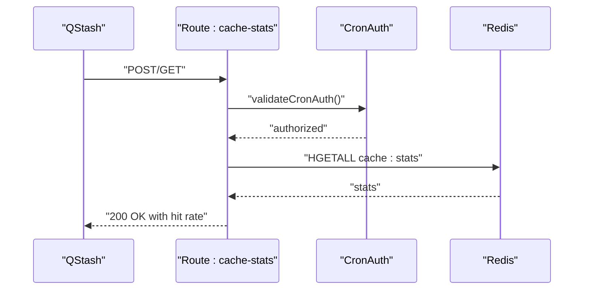

**Diagram sources**
- [route.ts:12-35](file://src/app/api/cron/cache-stats/route.ts#L12-L35)

**Section sources**
- [route.ts:1-41](file://src/app/api/cron/cache-stats/route.ts#L1-L41)

### Daily Market Data Synchronization
- Entry point: scripts/daily-sync.ts orchestrates phases and respects dry-run, force, and skip flags.
- Phases:
  - Crypto market data: checks freshness thresholds and runs MarketSyncService.
  - Daily market briefing: generates regional briefings.
  - Lyra components: optional trending questions refresh and Lyra intel generation.
  - Housekeeping: prunes stale intelligence events and related tables.
- Freshness checks: ensures sufficient coverage before syncing.

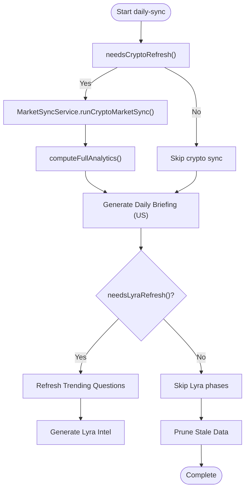

**Diagram sources**
- [daily-sync.ts:67-101](file://scripts/daily-sync.ts#L67-L101)
- [market-sync.service.ts:164-166](file://src/lib/services/market-sync.service.ts#L164-L166)
- [intelligence-events.service.ts:112-167](file://src/lib/services/intelligence-events.service.ts#L112-L167)

**Section sources**
- [daily-sync.ts:1-123](file://scripts/daily-sync.ts#L1-L123)
- [market-sync.service.ts:119-166](file://src/lib/services/market-sync.service.ts#L119-L166)
- [intelligence-events.service.ts:112-167](file://src/lib/services/intelligence-events.service.ts#L112-L167)

### Historical Data Enrichment Workflows
- CoinGecko enrichment: promotes top-level fields and enriches metadata for all crypto assets, with batching and per-item delays.
- Backdate MarketRegime: backfills MarketRegime with regime states, breadth, volatility, and correlation metrics for selected regions.

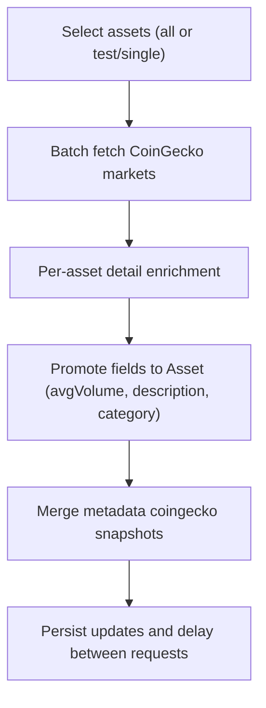

**Diagram sources**
- [enrich-crypto-coingecko.ts:38-247](file://scripts/enrich-crypto-coingecko.ts#L38-L247)

**Section sources**
- [enrich-crypto-coingecko.ts:1-254](file://scripts/enrich-crypto-coingecko.ts#L1-L254)
- [backdate-market-regime.ts:173-349](file://scripts/backdate-market-regime.ts#L173-L349)

### Backup and Database Maintenance
- Database cleanup: deletes old AssetScore, InstitutionalEvent, PriceHistory, MarketRegime, and TrendingQuestion entries based on retention windows.
- Vacuum and cleanup scripts: separate maintenance utilities for DB hygiene.

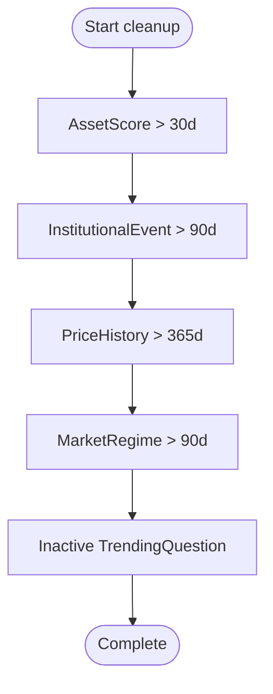

**Diagram sources**
- [db-cleanup.ts:37-68](file://scripts/db-cleanup.ts#L37-L68)

**Section sources**
- [db-cleanup.ts:37-68](file://scripts/db-cleanup.ts#L37-L68)

### Database Migration System
- Supabase to AWS RDS migration:
  - Uses pg_dump/pg_restore for parallel import.
  - Enables vector/pg_trgm/btree_gin extensions.
  - Verifies row counts per table and deploys Prisma migration history.
- Migration philosophy: safe, reversible, tested on copies, with rollback plans.

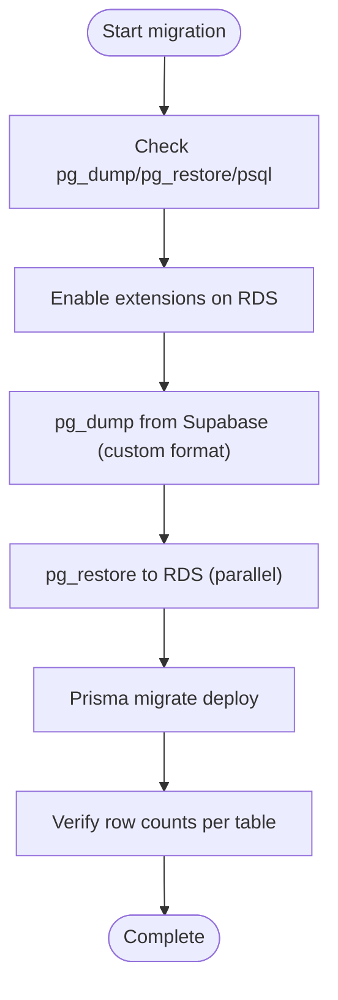

**Diagram sources**
- [migrate-database.ts:79-256](file://scripts/migrate-database.ts#L79-L256)
- [migrations.md:5-21](file://.windsurf/skills/database-design/migrations.md#L5-L21)

**Section sources**
- [migrate-database.ts:1-272](file://scripts/migrate-database.ts#L1-L272)
- [migrations.md:1-49](file://.windsurf/skills/database-design/migrations.md#L1-L49)

### Audit and Monitoring Jobs
- Cron LLM metrics: collected via hash fields (calls, failures, latency_ms, cost_usd) and aggregated into admin dashboards.
- Admin panel: displays cron job performance, fallback mitigations, and AI circuit breaker status.

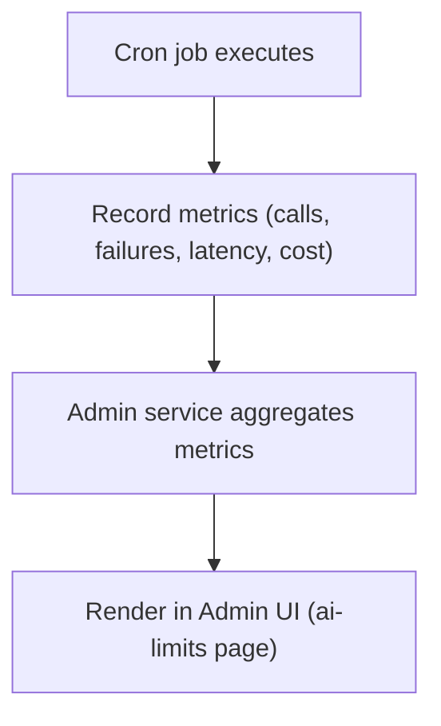

**Diagram sources**
- [admin.service.ts:381-404](file://src/lib/services/admin.service.ts#L381-L404)
- [page.tsx:168-173](file://src/app/admin/ai-limits/page.tsx#L168-L173)

**Section sources**
- [admin.service.ts:381-404](file://src/lib/services/admin.service.ts#L381-L404)
- [page.tsx:156-193](file://src/app/admin/ai-limits/page.tsx#L156-L193)

## Dependency Analysis
- Cron endpoints depend on shared middleware for authentication and logging.
- Services encapsulate domain logic and interact with external APIs and the database.
- Scripts operate independently and can be invoked manually or via CI/CD.

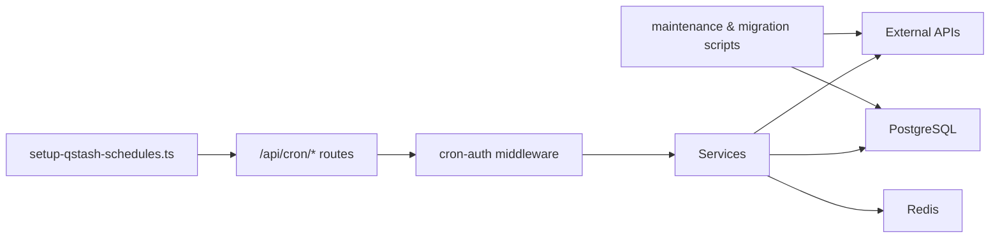

**Diagram sources**
- [setup-qstash-schedules.ts:65-111](file://scripts/setup-qstash-schedules.ts#L65-L111)
- [cron-auth.ts:61-102](file://src/lib/middleware/cron-auth.ts#L61-L102)
- [route.ts:1-44](file://src/app/api/cron/crypto-sync/route.ts#L1-L44)
- [market-sync.service.ts:119-166](file://src/lib/services/market-sync.service.ts#L119-L166)

**Section sources**
- [setup-qstash-schedules.ts:65-111](file://scripts/setup-qstash-schedules.ts#L65-L111)
- [cron-auth.ts:61-102](file://src/lib/middleware/cron-auth.ts#L61-L102)
- [route.ts:1-44](file://src/app/api/cron/crypto-sync/route.ts#L1-L44)
- [market-sync.service.ts:119-166](file://src/lib/services/market-sync.service.ts#L119-L166)

## Performance Considerations
- QStash retries: configure retry counts per job to handle transient failures.
- Service batching: MarketSyncService batches updates and uses chunked transactions to avoid timeouts.
- Cache warming: Fire-and-forget warming avoids blocking cron responses.
- Retention windows: Historical data pruning prevents excessive storage growth.

[No sources needed since this section provides general guidance]

## Troubleshooting Guide
- Cron auth failures:
  - Ensure QSTASH_CURRENT_SIGNING_KEY and QSTASH_NEXT_SIGNING_KEY are set in production.
  - For local/dev, set CRON_SECRET and use Bearer token.
- Job not triggering:
  - Verify schedule exists and cron expression matches expectations.
  - Confirm DEPLOYMENT_URL is correct and reachable.
- Service errors:
  - Check logs for sanitized error messages and request IDs.
  - Review external API quotas and backoff behavior.
- Maintenance scripts:
  - Use dry-run flags to preview changes before applying.
  - Validate row counts after migration and before cutting over DNS.

**Section sources**
- [cron-auth.ts:18-102](file://src/lib/middleware/cron-auth.ts#L18-L102)
- [setup-qstash-schedules.ts:19-31](file://scripts/setup-qstash-schedules.ts#L19-L31)
- [daily-sync.ts:116-122](file://scripts/daily-sync.ts#L116-L122)

## Conclusion
LyraAlpha’s batch processing system leverages QStash for reliable scheduling, a shared authentication middleware for security, and modular services for data synchronization, enrichment, and maintenance. The system balances reliability with observability, enabling safe migrations, efficient housekeeping, and actionable dashboards for operational insights.

[No sources needed since this section summarizes without analyzing specific files]

## Appendices

### Job Configuration Examples
- Register schedules: run the setup script with QSTASH_TOKEN and DEPLOYMENT_URL.
- Cron expressions: define recurrence patterns and retry counts in the schedule list.
- Environment variables: QSTASH_CURRENT_SIGNING_KEY, QSTASH_NEXT_SIGNING_KEY, CRON_SECRET (dev), DEPLOYMENT_URL.

**Section sources**
- [setup-qstash-schedules.ts:19-31](file://scripts/setup-qstash-schedules.ts#L19-L31)
- [setup-qstash-schedules.ts:35-63](file://scripts/setup-qstash-schedules.ts#L35-L63)

### Execution Tracking and Failure Recovery
- Request IDs: generated per cron invocation for tracing.
- Metrics aggregation: cron LLM metrics are parsed and summarized for admin dashboards.
- Recovery: scripts support dry-run modes and staged rollouts; migrations verify counts before completion.

**Section sources**
- [cron-auth.ts:104-110](file://src/lib/middleware/cron-auth.ts#L104-L110)
- [admin.service.ts:381-404](file://src/lib/services/admin.service.ts#L381-L404)
- [migrate-database.ts:232-266](file://scripts/migrate-database.ts#L232-L266)