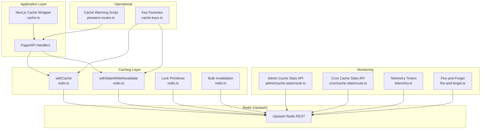
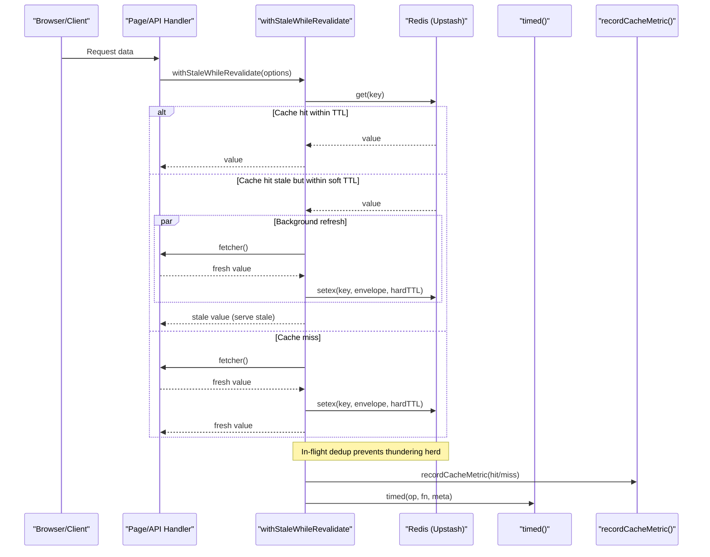
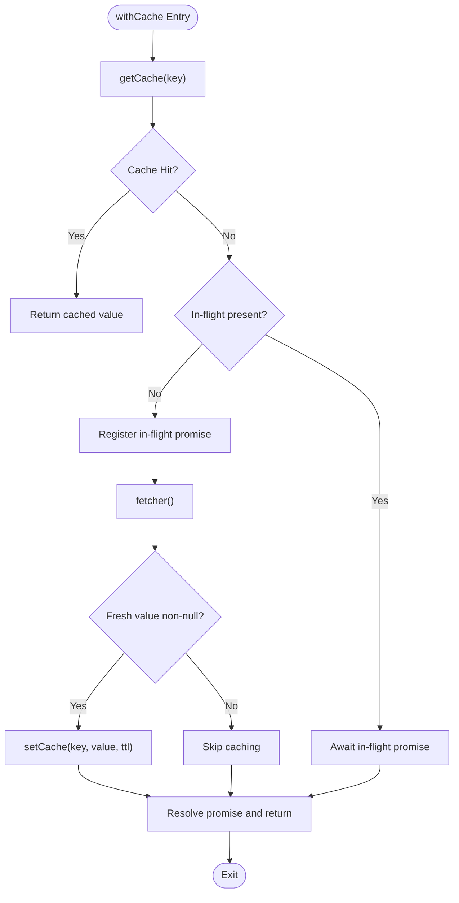
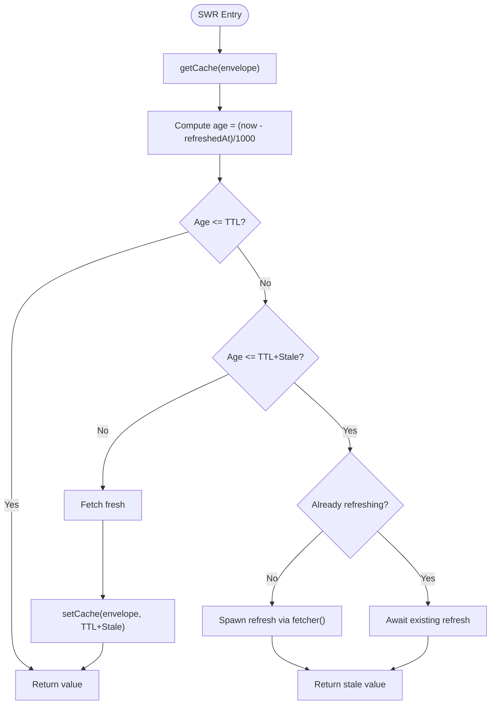
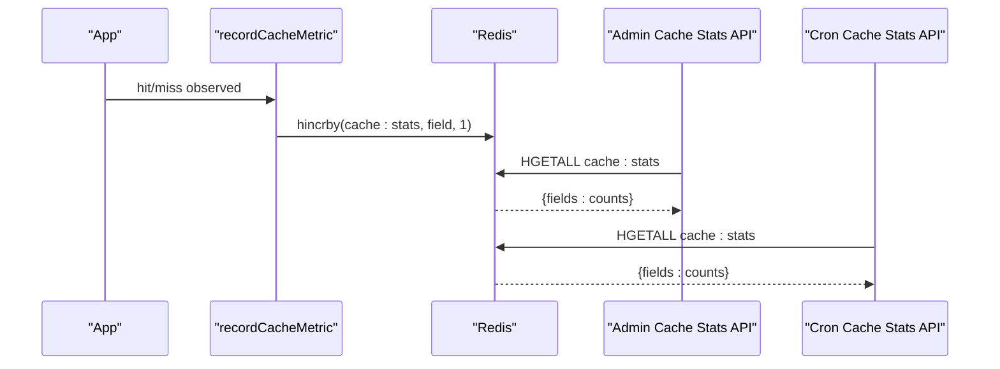
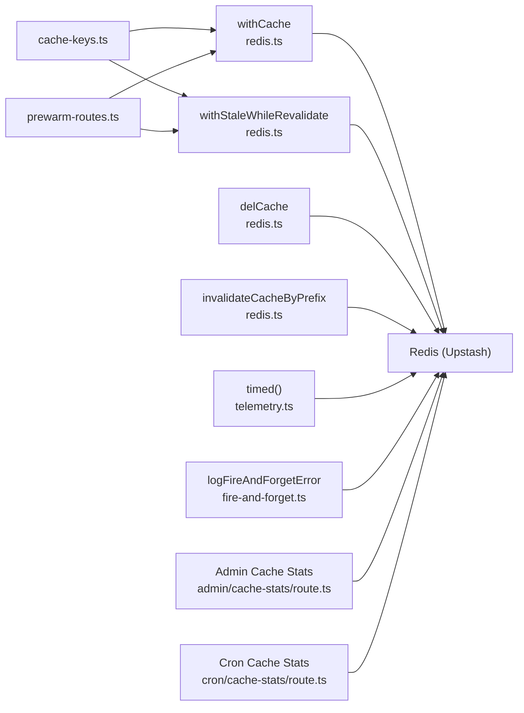

# Cache Management & Optimization

<cite>
**Referenced Files in This Document**
- [cache.ts](file://src/lib/cache.ts)
- [redis.ts](file://src/lib/redis.ts)
- [cache-keys.ts](file://src/lib/cache-keys.ts)
- [telemetry.ts](file://src/lib/telemetry.ts)
- [fire-and-forget.ts](file://src/lib/fire-and-forget.ts)
- [prewarm-routes.ts](file://scripts/prewarm-routes.ts)
- [cache-stats route (admin)](file://src/app/api/admin/cache-stats/route.ts)
- [cache-stats route (cron)](file://src/app/api/cron/cache-stats/route.ts)
- [redis-dedup tests](file://src/lib/__tests__/redis-dedup.test.ts)
- [market-regime engine](file://src/lib/engines/market-regime.ts)
- [admin infrastructure page](file://src/app/admin/infrastructure/page.tsx)
</cite>

## Table of Contents
1. [Introduction](#introduction)
2. [Project Structure](#project-structure)
3. [Core Components](#core-components)
4. [Architecture Overview](#architecture-overview)
5. [Detailed Component Analysis](#detailed-component-analysis)
6. [Dependency Analysis](#dependency-analysis)
7. [Performance Considerations](#performance-considerations)
8. [Troubleshooting Guide](#troubleshooting-guide)
9. [Conclusion](#conclusion)
10. [Appendices](#appendices)

## Introduction
This document explains LyraAlpha’s caching strategy and performance optimization system built on Upstash Redis. It covers multi-level caching, cache key design, TTL management, stale-while-revalidate, cache warming, partitioning by user segments and geography, monitoring and metrics, memory optimization, failure recovery, and cache coherency across distributed environments.

## Project Structure
The caching system spans several modules:
- Next.js cache wrapper for server-side data fetching
- Upstash Redis client with robust wrappers for get/set/del, lock primitives, and bulk invalidation
- Cache key factories for user-specific and region-specific content
- Telemetry and fire-and-forget helpers for observability
- Cache warming scripts for high-traffic routes
- Admin endpoints for cache hit rate reporting and cron-driven aggregation
- Local in-process caches for engine-level context snapshots

**Diagram sources**
- [cache.ts:1-21](file://src/lib/cache.ts#L1-L21)
- [redis.ts:142-195](file://src/lib/redis.ts#L142-L195)
- [redis.ts:388-454](file://src/lib/redis.ts#L388-L454)
- [redis.ts:218-245](file://src/lib/redis.ts#L218-L245)
- [redis.ts:269-303](file://src/lib/redis.ts#L269-L303)
- [cache-stats route (admin):14-60](file://src/app/api/admin/cache-stats/route.ts#L14-L60)
- [cache-stats route (cron):12-40](file://src/app/api/cron/cache-stats/route.ts#L12-L40)
- [telemetry.ts:17-30](file://src/lib/telemetry.ts#L17-L30)
- [fire-and-forget.ts:14-27](file://src/lib/fire-and-forget.ts#L14-L27)
- [prewarm-routes.ts:1-46](file://scripts/prewarm-routes.ts#L1-L46)
- [cache-keys.ts:1-36](file://src/lib/cache-keys.ts#L1-L36)

**Section sources**
- [cache.ts:1-21](file://src/lib/cache.ts#L1-L21)
- [redis.ts:142-195](file://src/lib/redis.ts#L142-L195)
- [redis.ts:388-454](file://src/lib/redis.ts#L388-L454)
- [redis.ts:218-245](file://src/lib/redis.ts#L218-L245)
- [redis.ts:269-303](file://src/lib/redis.ts#L269-L303)
- [cache-stats route (admin):14-60](file://src/app/api/admin/cache-stats/route.ts#L14-L60)
- [cache-stats route (cron):12-40](file://src/app/api/cron/cache-stats/route.ts#L12-L40)
- [telemetry.ts:17-30](file://src/lib/telemetry.ts#L17-L30)
- [fire-and-forget.ts:14-27](file://src/lib/fire-and-forget.ts#L14-L27)
- [prewarm-routes.ts:1-46](file://scripts/prewarm-routes.ts#L1-L46)
- [cache-keys.ts:1-36](file://src/lib/cache-keys.ts#L1-L36)

## Core Components
- Next.js cache wrapper: wraps high-latency data fetches with revalidation tags and TTL for server rendering and ISR.
- Redis client: thin wrapper around Upstash Redis with serialization, date hydration, telemetry, and fail-open/fail-closed lock semantics.
- Cache key factories: deterministic key construction for user dashboards, personal briefings, portfolios, and macro research by region.
- Stale-while-revalidate: maintains perceived freshness by serving cached data while refreshing in the background.
- Bulk invalidation: safe prefix-based deletion with pagination and capped iteration limits.
- Monitoring: admin and cron endpoints for cache hit rate and periodic aggregation.
- Cache warming: pre-warms hot routes to prime caches and reduce initial latency spikes.

**Section sources**
- [cache.ts:10-20](file://src/lib/cache.ts#L10-L20)
- [redis.ts:142-195](file://src/lib/redis.ts#L142-L195)
- [redis.ts:388-454](file://src/lib/redis.ts#L388-L454)
- [redis.ts:269-303](file://src/lib/redis.ts#L269-L303)
- [cache-keys.ts:1-36](file://src/lib/cache-keys.ts#L1-L36)
- [cache-stats route (admin):14-60](file://src/app/api/admin/cache-stats/route.ts#L14-L60)
- [cache-stats route (cron):12-40](file://src/app/api/cron/cache-stats/route.ts#L12-L40)
- [prewarm-routes.ts:1-46](file://scripts/prewarm-routes.ts#L1-L46)

## Architecture Overview
The system layers:
- Application handlers call either the Next.js cache wrapper or Redis-based cache helpers.
- Redis persists serialized values and metadata envelopes for SWR.
- Telemetry measures operation durations; fire-and-forget ensures non-blocking metrics.
- Admin and cron endpoints expose cache statistics for observability.
- Operational scripts pre-warm routes to improve cold-start performance.

**Diagram sources**
- [redis.ts:388-454](file://src/lib/redis.ts#L388-L454)
- [redis.ts:142-195](file://src/lib/redis.ts#L142-L195)
- [redis.ts:124-140](file://src/lib/redis.ts#L124-L140)
- [telemetry.ts:17-30](file://src/lib/telemetry.ts#L17-L30)

## Detailed Component Analysis

### Next.js Cache Wrapper
- Purpose: Memoize expensive data fetches during render with tags and TTL for revalidation.
- Key features: Accepts keys and tags; integrates with Next.js cache internals.
- Typical usage: Wrap server-side data loaders that query databases or external APIs.

**Section sources**
- [cache.ts:10-20](file://src/lib/cache.ts#L10-L20)

### Redis Cache Helpers
- getCache: Deserializes values, restores dates, logs hits/misses, records metrics, and handles errors gracefully.
- setCache: Serializes values to JSON before storing; sets TTL; logs failures.
- delCache: Deletes a single key; logs failures.
- withCache: Full cache flow with in-flight dedup to avoid thundering herd; serializes/deserializes; hydrates dates.
- withStaleWhileRevalidate: Envelope-based SWR with separate TTL and stale windows; dedup; background refresh; error callback hook.
- Lock primitives: redisSetNX (fail-open) and redisSetNXStrict (fail-closed) for idempotency and request dedup.
- Bulk invalidation: Prefix-based SCAN with pipelined deletes and iteration caps.
- Telemetry: timed wrapper samples Redis operations with high-resolution timing.
- Fire-and-forget: Non-blocking error logging for metrics and background tasks.

**Diagram sources**
- [redis.ts:338-373](file://src/lib/redis.ts#L338-L373)
- [redis.ts:142-195](file://src/lib/redis.ts#L142-L195)

**Section sources**
- [redis.ts:142-195](file://src/lib/redis.ts#L142-L195)
- [redis.ts:338-373](file://src/lib/redis.ts#L338-L373)
- [redis.ts:388-454](file://src/lib/redis.ts#L388-L454)
- [redis.ts:218-245](file://src/lib/redis.ts#L218-L245)
- [redis.ts:269-303](file://src/lib/redis.ts#L269-L303)
- [telemetry.ts:17-30](file://src/lib/telemetry.ts#L17-L30)
- [fire-and-forget.ts:14-27](file://src/lib/fire-and-forget.ts#L14-L27)

### Stale-While-Revalidate Implementation
- Envelope stores value and refreshedAt timestamp.
- TTL: hard TTL equals base TTL plus stale window.
- Behavior:
  - Within TTL: serve fresh.
  - Within TTL+stale: serve stale and refresh asynchronously if not already refreshing.
  - Miss: fetch, cache, return fresh; ensure in-flight registration before async work.

**Diagram sources**
- [redis.ts:388-454](file://src/lib/redis.ts#L388-L454)

**Section sources**
- [redis.ts:388-454](file://src/lib/redis.ts#L388-L454)

### Cache Key Design Patterns
- Personalized: personalBriefingCacheKey(userId)
- Dashboard home: dashboardHomeCacheKey(userId, region, plan) and shell variant
- Dashboard home prefix: dashboardHomeCachePrefix(userId) for targeted invalidation
- Portfolio: portfolioHealthCacheKey(portfolioId), portfolioAnalyticsCacheKey(portfolioId)
- Macro research: macroResearchCacheKey(region), macroResearchSectorCacheKey(region), and prefix for bulk invalidation

These keys encode user identity, region, plan, and data type to enable:
- Partitioning by user segment (userId)
- Geographic partitioning (region)
- Data-type partitioning (dashboard, portfolio, macro)
- Efficient invalidation via prefix-based deletion

**Section sources**
- [cache-keys.ts:1-36](file://src/lib/cache-keys.ts#L1-L36)

### Cache Invalidation Strategies
- Targeted by prefix: invalidateCacheByPrefix(prefix) scans and deletes keys matching a pattern with pagination and capped iterations.
- Use cases: dashboard home content per user, macro research by region, or portfolio analytics by portfolioId.
- Safety: capped iterations and pipeline batching prevent timeouts and excessive memory use.

**Section sources**
- [redis.ts:269-303](file://src/lib/redis.ts#L269-L303)

### Cache Warming Strategies
- Routes: dashboard pages, discovery feeds, market regime, stock analytics, and Lyra history endpoints.
- Execution: prewarm-routes.ts iterates over configured routes, optionally multiple rounds, and logs timings and statuses.
- Purpose: prime caches to reduce cold-start latency and stabilize initial request latencies.

**Section sources**
- [prewarm-routes.ts:1-46](file://scripts/prewarm-routes.ts#L1-L46)

### Cache Monitoring and Hit Rate Analysis
- Metrics: cache:stats hash with per-prefix counters and weekly TTL; sampled writes via recordCacheMetric.
- Admin endpoint: returns global and per-prefix hit rates derived from cache:stats.
- Cron endpoint: aggregates and returns current totals and hit rate for operational dashboards.
- UI: admin infrastructure page displays cache hit rate visualization.

**Diagram sources**
- [redis.ts:124-140](file://src/lib/redis.ts#L124-L140)
- [cache-stats route (admin):14-60](file://src/app/api/admin/cache-stats/route.ts#L14-L60)
- [cache-stats route (cron):12-40](file://src/app/api/cron/cache-stats/route.ts#L12-L40)

**Section sources**
- [redis.ts:124-140](file://src/lib/redis.ts#L124-L140)
- [cache-stats route (admin):14-60](file://src/app/api/admin/cache-stats/route.ts#L14-L60)
- [cache-stats route (cron):12-40](file://src/app/api/cron/cache-stats/route.ts#L12-L40)
- [admin infrastructure page:86-110](file://src/app/admin/infrastructure/page.tsx#L86-L110)

### Memory Optimization Techniques
- In-flight dedup: _inFlight map bounds concurrent requests to prevent memory growth; threshold guarded by MAX_IN_FLIGHT_KEYS.
- Serialization: JSON.stringify before storage ensures consistent parsing on retrieval; date revival preserves temporal fidelity.
- Pipeline batching: bulk deletions and metric increments use pipelining to minimize round trips.
- Fail-open vs fail-closed locks: choose semantics based on risk tolerance (idempotency vs preventing overload).

**Section sources**
- [redis.ts:104-106](file://src/lib/redis.ts#L104-L106)
- [redis.ts:176-195](file://src/lib/redis.ts#L176-L195)
- [redis.ts:288-296](file://src/lib/redis.ts#L288-L296)
- [redis.ts:218-245](file://src/lib/redis.ts#L218-L245)

### Cache Failure Recovery Mechanisms
- No-op fallback: when environment variables are missing or initialization fails, a no-op Redis client is returned to keep the app running.
- Fail-open locks: redisSetNX returns true on Redis failure to avoid dropping events (safe for idempotency checks).
- Fail-closed locks: redisSetNXStrict returns false to block requests when Redis is down (useful to prevent thundering herd).
- Fire-and-forget metrics: pipeline and metric writes do not block the main request path.

**Section sources**
- [redis.ts:25-67](file://src/lib/redis.ts#L25-L67)
- [redis.ts:218-245](file://src/lib/redis.ts#L218-L245)
- [fire-and-forget.ts:14-27](file://src/lib/fire-and-forget.ts#L14-L27)

### Cache Coherency and Consistency Guarantees
- Tags and TTL: Next.js cache wrapper supports tags and TTL for controlled revalidation.
- Prefix invalidation: targeted invalidation by userId or region enables coherent updates across partitions.
- SWR envelope: timestamps ensure staleness checks and ordered refreshes.
- Engine-level cache: local in-process cache with eviction and deep cloning maintains consistency boundaries for domain-specific contexts.

**Section sources**
- [cache.ts:10-20](file://src/lib/cache.ts#L10-L20)
- [redis.ts:269-303](file://src/lib/redis.ts#L269-L303)
- [redis.ts:388-454](file://src/lib/redis.ts#L388-L454)
- [market-regime engine:80-110](file://src/lib/engines/market-regime.ts#L80-L110)

## Dependency Analysis

**Diagram sources**
- [cache-keys.ts:1-36](file://src/lib/cache-keys.ts#L1-L36)
- [redis.ts:338-373](file://src/lib/redis.ts#L338-L373)
- [redis.ts:388-454](file://src/lib/redis.ts#L388-L454)
- [redis.ts:142-195](file://src/lib/redis.ts#L142-L195)
- [redis.ts:269-303](file://src/lib/redis.ts#L269-L303)
- [telemetry.ts:17-30](file://src/lib/telemetry.ts#L17-L30)
- [fire-and-forget.ts:14-27](file://src/lib/fire-and-forget.ts#L14-L27)
- [cache-stats route (admin):14-60](file://src/app/api/admin/cache-stats/route.ts#L14-L60)
- [cache-stats route (cron):12-40](file://src/app/api/cron/cache-stats/route.ts#L12-L40)
- [prewarm-routes.ts:1-46](file://scripts/prewarm-routes.ts#L1-L46)

**Section sources**
- [cache-keys.ts:1-36](file://src/lib/cache-keys.ts#L1-L36)
- [redis.ts:338-373](file://src/lib/redis.ts#L338-L373)
- [redis.ts:388-454](file://src/lib/redis.ts#L388-L454)
- [redis.ts:142-195](file://src/lib/redis.ts#L142-L195)
- [redis.ts:269-303](file://src/lib/redis.ts#L269-L303)
- [telemetry.ts:17-30](file://src/lib/telemetry.ts#L17-L30)
- [fire-and-forget.ts:14-27](file://src/lib/fire-and-forget.ts#L14-L27)
- [cache-stats route (admin):14-60](file://src/app/api/admin/cache-stats/route.ts#L14-L60)
- [cache-stats route (cron):12-40](file://src/app/api/cron/cache-stats/route.ts#L12-L40)
- [prewarm-routes.ts:1-46](file://scripts/prewarm-routes.ts#L1-L46)

## Performance Considerations
- TTL tuning: balance freshness and hit rate; shorter TTLs increase load but improve accuracy; longer TTLs improve hit rate but risk staleness.
- Stale window: extend soft TTL to serve stale while refreshing, reducing perceived latency spikes.
- In-flight dedup: keep MAX_IN_FLIGHT_KEYS tuned to serverless memory budgets; monitor for memory growth under load.
- Serialization overhead: JSON serialization is consistent but consider binary formats for very large payloads if needed.
- Telemetry sampling: adjust REDIS_TIMING_ENABLED and REDIS_TIMING_SAMPLE to control instrumentation overhead.
- Cache warming: schedule warming during off-peak hours; iterate routes progressively to avoid overwhelming upstream systems.

[No sources needed since this section provides general guidance]

## Troubleshooting Guide
- Redis init failures: verify UPSTASH_REDIS_REST_URL and UPSTASH_REDIS_REST_TOKEN; fallback to no-op client prevents crashes.
- Cache stats not appearing: ensure CACHE_STATS_SAMPLE_RATE is set; confirm weekly TTL and pipeline writes.
- Thundering herd: verify in-flight dedup is active; check MAX_IN_FLIGHT_KEYS thresholds.
- Stale data served unexpectedly: review TTL and staleSeconds configuration; confirm envelope timestamps.
- Bulk invalidation slow or partial: inspect iteration caps and prefix correctness; validate pipeline execution.

**Section sources**
- [redis.ts:25-67](file://src/lib/redis.ts#L25-L67)
- [redis.ts:124-140](file://src/lib/redis.ts#L124-L140)
- [redis.ts:104-106](file://src/lib/redis.ts#L104-L106)
- [redis.ts:269-303](file://src/lib/redis.ts#L269-L303)

## Conclusion
LyraAlpha’s caching system combines Next.js cache tagging with Upstash Redis primitives to deliver scalable, observable, and resilient performance. The SWR pattern ensures data freshness while minimizing latency, targeted invalidation keeps partitions coherent, and telemetry and admin endpoints provide actionable insights. Operational warming and careful TTL/stale-window tuning further optimize user experience across diverse traffic patterns.

[No sources needed since this section summarizes without analyzing specific files]

## Appendices

### Example Cache Configuration
- Environment variables:
  - UPSTASH_REDIS_REST_URL, UPSTASH_REDIS_REST_TOKEN: Upstash credentials
  - CACHE_STATS_SAMPLE_RATE: fraction of requests to sample for cache stats
  - CACHE_LOG: enable cache log sampling
  - CACHE_LOG_SAMPLE: sampling rate for cache logs
  - REDIS_TIMING_ENABLED, REDIS_TIMING_SAMPLE: enable and sample Redis timing telemetry
- Typical TTLs:
  - Dashboard home: base TTL aligned with content update cadence; add stale window for smooth refresh
  - Market regime: short TTL with moderate stale window
  - Portfolio analytics: longer TTL depending on volatility and user expectations
- Invalidation patterns:
  - By user: dashboardHomeCachePrefix(userId)
  - By region: macroResearchCachePrefix()
  - By portfolio: portfolioAnalyticsCacheKey(portfolioId)

**Section sources**
- [redis.ts:124-140](file://src/lib/redis.ts#L124-L140)
- [redis.ts:101-106](file://src/lib/redis.ts#L101-L106)
- [cache-keys.ts:13-15](file://src/lib/cache-keys.ts#L13-L15)
- [cache-keys.ts:33-35](file://src/lib/cache-keys.ts#L33-L35)
- [cache-keys.ts:17-23](file://src/lib/cache-keys.ts#L17-L23)