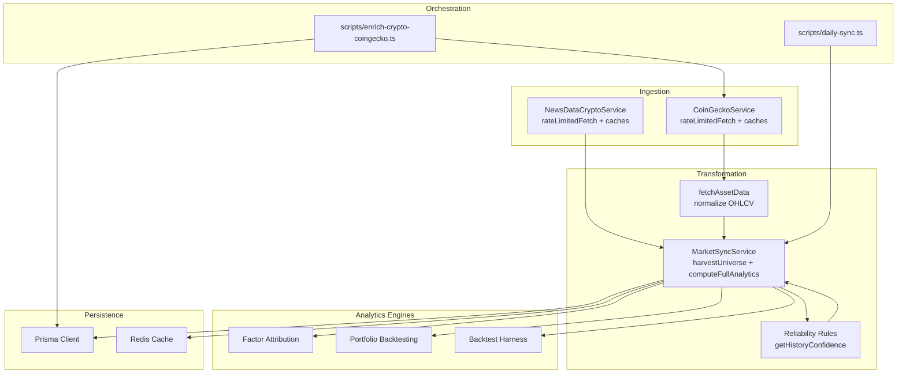
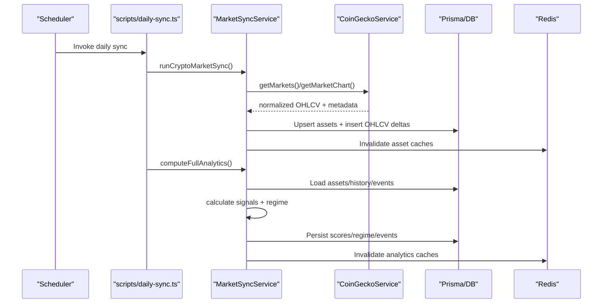
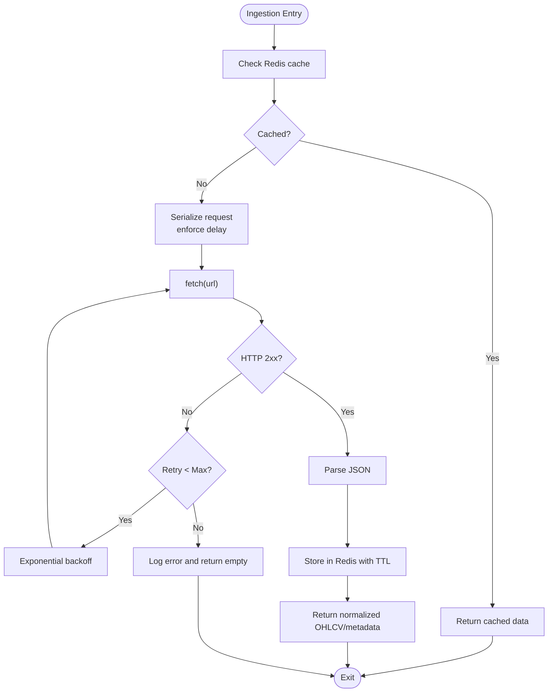
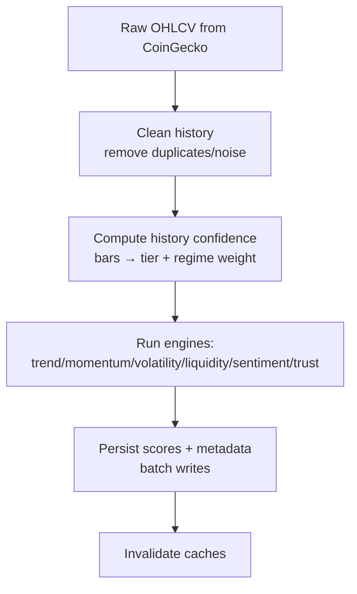
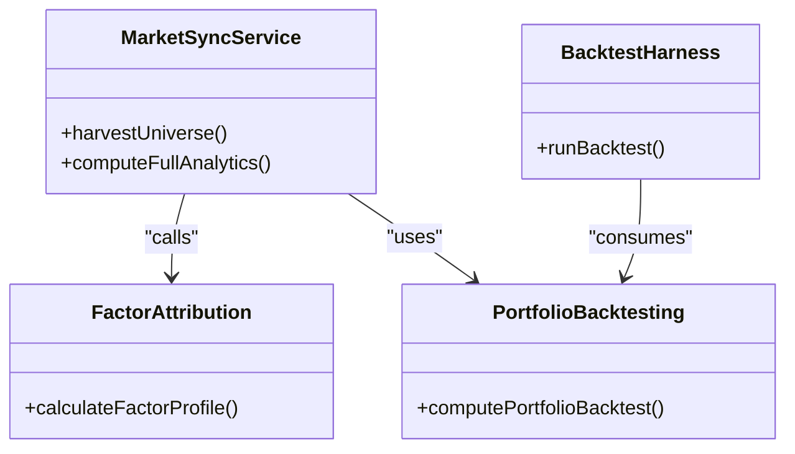
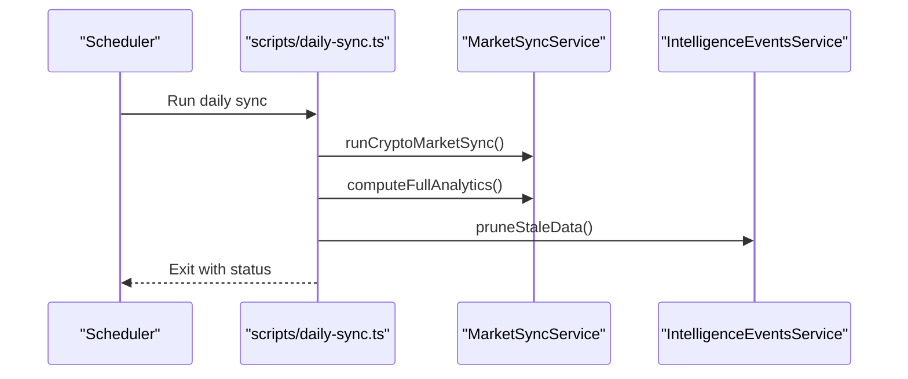
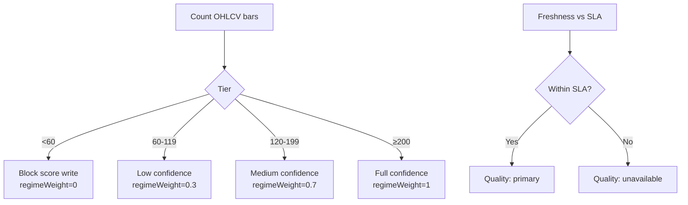
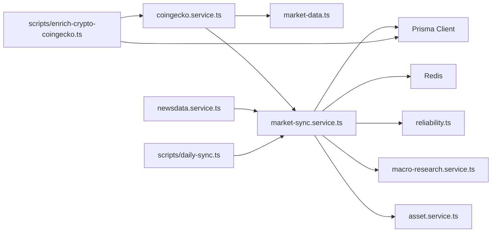

# Data Processing Pipelines

<cite>
**Referenced Files in This Document**
- [market-sync.service.ts](file://src/lib/services/market-sync.service.ts)
- [coingecko.service.ts](file://src/lib/services/coingecko.service.ts)
- [market-data.ts](file://src/lib/market-data.ts)
- [newsdata.service.ts](file://src/lib/services/newsdata.service.ts)
- [daily-sync.ts](file://scripts/daily-sync.ts)
- [enrich-crypto-coingecko.ts](file://scripts/enrich-crypto-coingecko.ts)
- [asset.service.ts](file://src/lib/services/asset.service.ts)
- [macro-research.service.ts](file://src/lib/services/macro-research.service.ts)
- [intelligence-events.service.ts](file://src/lib/services/intelligence-events.service.ts)
- [reliability.ts](file://src/lib/data-quality/reliability.ts)
- [backtest-engines.ts](file://src/scripts/backtest-engines.ts)
- [portfolio-backtesting.ts](file://src/lib/engines/portfolio-backtesting.ts)
- [factor-attribution.ts](file://src/lib/engines/factor-attribution.ts)
- [crypto.ts](file://src/lib/crypto.ts)
</cite>

## Table of Contents
1. [Introduction](#introduction)
2. [Project Structure](#project-structure)
3. [Core Components](#core-components)
4. [Architecture Overview](#architecture-overview)
5. [Detailed Component Analysis](#detailed-component-analysis)
6. [Dependency Analysis](#dependency-analysis)
7. [Performance Considerations](#performance-considerations)
8. [Troubleshooting Guide](#troubleshooting-guide)
9. [Conclusion](#conclusion)
10. [Appendices](#appendices)

## Introduction
This document explains LyraAlpha’s data processing pipelines and ETL operations. It covers real-time market data ingestion from cryptocurrency exchanges and financial APIs, normalization and transformation of market data, technical indicator calculations, derived metrics generation, batch jobs for historical enrichment and backtesting preparation, data quality assurance, validation rules, error handling, integration with external providers, rate limiting and retry strategies, and monitoring and performance optimization techniques.

## Project Structure
The data pipeline spans several layers:
- Real-time ingestion: CoinGecko and NewsData integrations
- Transformation and analytics: OHLCV normalization, scoring engines, regime detection
- Persistence: PostgreSQL via Prisma, Redis caching
- Orchestration: Daily sync script and batch enrichment scripts
- Quality and governance: Reliability rules, SLAs, and housekeeping

**Diagram sources**
- [market-sync.service.ts:119-800](file://src/lib/services/market-sync.service.ts#L119-L800)
- [coingecko.service.ts:37-75](file://src/lib/services/coingecko.service.ts#L37-L75)
- [market-data.ts:23-112](file://src/lib/market-data.ts#L23-L112)
- [reliability.ts:51-62](file://src/lib/data-quality/reliability.ts#L51-L62)
- [daily-sync.ts:67-114](file://scripts/daily-sync.ts#L67-L114)
- [enrich-crypto-coingecko.ts:38-248](file://scripts/enrich-crypto-coingecko.ts#L38-L248)

**Section sources**
- [market-sync.service.ts:119-800](file://src/lib/services/market-sync.service.ts#L119-L800)
- [coingecko.service.ts:37-75](file://src/lib/services/coingecko.service.ts#L37-L75)
- [market-data.ts:23-112](file://src/lib/market-data.ts#L23-L112)
- [daily-sync.ts:67-114](file://scripts/daily-sync.ts#L67-L114)
- [enrich-crypto-coingecko.ts:38-248](file://scripts/enrich-crypto-coingecko.ts#L38-L248)

## Core Components
- MarketSyncService orchestrates the full ETL lifecycle: harvesting universe data, computing analytics, and persisting results.
- CoinGeckoService provides rate-limited, cached access to cryptocurrency market data and metadata.
- MarketData normalizes OHLCV for downstream analytics.
- Reliability module enforces history confidence tiers and SLA-aware field sourcing.
- IntelligenceEventsService generates institutional events and prunes stale data.
- AssetService and MacroResearchService provide cached analytics and macro snapshots.
- Scripts orchestrate daily sync and enrichment jobs.

**Section sources**
- [market-sync.service.ts:119-800](file://src/lib/services/market-sync.service.ts#L119-L800)
- [coingecko.service.ts:77-541](file://src/lib/services/coingecko.service.ts#L77-L541)
- [market-data.ts:23-112](file://src/lib/market-data.ts#L23-L112)
- [reliability.ts:51-138](file://src/lib/data-quality/reliability.ts#L51-L138)
- [intelligence-events.service.ts:28-167](file://src/lib/services/intelligence-events.service.ts#L28-L167)
- [asset.service.ts:100-181](file://src/lib/services/asset.service.ts#L100-L181)
- [macro-research.service.ts:33-62](file://src/lib/services/macro-research.service.ts#L33-L62)

## Architecture Overview
The pipeline follows a staged architecture:
- Phase 1: Harvest universe (CoinGecko batch quotes, metadata, and OHLCV delta)
- Phase 2: Compute analytics (engine signals, market regime, compatibility, persistence)
- Phase 3: Generate events and maintain housekeeping
- Phase 4: Batch enrichment and backtesting preparation

**Diagram sources**
- [daily-sync.ts:67-114](file://scripts/daily-sync.ts#L67-L114)
- [market-sync.service.ts:125-166](file://src/lib/services/market-sync.service.ts#L125-L166)
- [coingecko.service.ts:82-202](file://src/lib/services/coingecko.service.ts#L82-L202)

## Detailed Component Analysis

### Real-time Market Data Ingestion
- CoinGeckoService implements a serialized, rate-limited fetch with exponential backoff and configurable retries. It caches responses with per-endpoint TTLs and supports batch queries for efficiency.
- MarketData resolves asset history, preferring database records and falling back to CoinGecko when necessary.

**Diagram sources**
- [coingecko.service.ts:37-75](file://src/lib/services/coingecko.service.ts#L37-L75)
- [coingecko.service.ts:82-202](file://src/lib/services/coingecko.service.ts#L82-L202)

**Section sources**
- [coingecko.service.ts:37-75](file://src/lib/services/coingecko.service.ts#L37-L75)
- [coingecko.service.ts:82-202](file://src/lib/services/coingecko.service.ts#L82-L202)
- [market-data.ts:23-112](file://src/lib/market-data.ts#L23-L112)

### Data Normalization and Transformation
- MarketData normalizes OHLCV from CoinGecko and maps to internal structures.
- MarketSyncService cleans historical series, computes history confidence, and runs engines concurrently with chunking and batching.

**Diagram sources**
- [market-data.ts:23-112](file://src/lib/market-data.ts#L23-L112)
- [market-sync.service.ts:579-613](file://src/lib/services/market-sync.service.ts#L579-L613)
- [reliability.ts:51-62](file://src/lib/data-quality/reliability.ts#L51-L62)

**Section sources**
- [market-data.ts:23-112](file://src/lib/market-data.ts#L23-L112)
- [market-sync.service.ts:579-613](file://src/lib/services/market-sync.service.ts#L579-L613)
- [reliability.ts:51-62](file://src/lib/data-quality/reliability.ts#L51-L62)

### Technical Indicators and Derived Metrics
- Engines compute scores and metadata (e.g., factor profiles, correlation regimes, scenario risk metrics). MarketSyncService coordinates engine execution and caches market regime context for downstream use.

**Diagram sources**
- [market-sync.service.ts:790-800](file://src/lib/services/market-sync.service.ts#L790-L800)
- [factor-attribution.ts:51-93](file://src/lib/engines/factor-attribution.ts#L51-L93)
- [portfolio-backtesting.ts:98-165](file://src/lib/engines/portfolio-backtesting.ts#L98-L165)
- [backtest-engines.ts:104-165](file://src/scripts/backtest-engines.ts#L104-L165)

**Section sources**
- [market-sync.service.ts:790-800](file://src/lib/services/market-sync.service.ts#L790-L800)
- [factor-attribution.ts:51-93](file://src/lib/engines/factor-attribution.ts#L51-L93)
- [portfolio-backtesting.ts:98-165](file://src/lib/engines/portfolio-backtesting.ts#L98-L165)
- [backtest-engines.ts:104-165](file://src/scripts/backtest-engines.ts#L104-L165)

### Batch Processing Jobs
- Daily sync script coordinates crypto market sync and analytics, with optional dry-run and force flags.
- Enrichment script promotes CoinGecko metadata to top-level columns and enriches metadata incrementally.

**Diagram sources**
- [daily-sync.ts:67-114](file://scripts/daily-sync.ts#L67-L114)
- [intelligence-events.service.ts:112-167](file://src/lib/services/intelligence-events.service.ts#L112-L167)

**Section sources**
- [daily-sync.ts:67-114](file://scripts/daily-sync.ts#L67-L114)
- [intelligence-events.service.ts:112-167](file://src/lib/services/intelligence-events.service.ts#L112-L167)
- [enrich-crypto-coingecko.ts:38-248](file://scripts/enrich-crypto-coingecko.ts#L38-L248)

### Data Quality Assurance and Validation
- History confidence tiers gate score persistence and regime weighting based on bar count.
- SLA-aware field sourcing determines freshness thresholds and quality tiers for single-source and fundamental fields.
- Housekeeping prunes stale institutional events and market regime entries.

**Diagram sources**
- [reliability.ts:51-62](file://src/lib/data-quality/reliability.ts#L51-L62)
- [reliability.ts:112-138](file://src/lib/data-quality/reliability.ts#L112-L138)

**Section sources**
- [reliability.ts:51-138](file://src/lib/data-quality/reliability.ts#L51-L138)
- [intelligence-events.service.ts:112-167](file://src/lib/services/intelligence-events.service.ts#L112-L167)

### Integration with External Providers and Rate Limiting
- CoinGeckoService serializes requests, enforces a minimum delay, and applies exponential backoff on 429 responses.
- NewsDataCryptoService applies bounded retries and backoff on rate limiting.
- Both services cache responses to reduce load and latency.

**Section sources**
- [coingecko.service.ts:37-75](file://src/lib/services/coingecko.service.ts#L37-L75)
- [newsdata.service.ts:227-246](file://src/lib/services/newsdata.service.ts#L227-L246)

### Monitoring, Alerting, and Performance Optimization
- Logging captures timing, errors, and outcomes for ingestion and analytics phases.
- Caching reduces DB and API pressure; cache keys are invalidated on updates.
- Concurrency limits and chunked batches optimize throughput and stability.
- Housekeeping prevents DB bloat and maintains long-term regime history.

**Section sources**
- [market-sync.service.ts:131-161](file://src/lib/services/market-sync.service.ts#L131-L161)
- [asset.service.ts:171-181](file://src/lib/services/asset.service.ts#L171-L181)
- [intelligence-events.service.ts:112-167](file://src/lib/services/intelligence-events.service.ts#L112-L167)

## Dependency Analysis

**Diagram sources**
- [market-sync.service.ts:1-49](file://src/lib/services/market-sync.service.ts#L1-L49)
- [coingecko.service.ts:1-17](file://src/lib/services/coingecko.service.ts#L1-L17)
- [market-data.ts:1-8](file://src/lib/market-data.ts#L1-L8)
- [newsdata.service.ts:1-7](file://src/lib/services/newsdata.service.ts#L1-L7)
- [daily-sync.ts:9-17](file://scripts/daily-sync.ts#L9-L17)
- [enrich-crypto-coingecko.ts:24-25](file://scripts/enrich-crypto-coingecko.ts#L24-L25)

**Section sources**
- [market-sync.service.ts:1-49](file://src/lib/services/market-sync.service.ts#L1-L49)
- [coingecko.service.ts:1-17](file://src/lib/services/coingecko.service.ts#L1-L17)
- [market-data.ts:1-8](file://src/lib/market-data.ts#L1-L8)
- [newsdata.service.ts:1-7](file://src/lib/services/newsdata.service.ts#L1-L7)
- [daily-sync.ts:9-17](file://scripts/daily-sync.ts#L9-L17)
- [enrich-crypto-coingecko.ts:24-25](file://scripts/enrich-crypto-coingecko.ts#L24-L25)

## Performance Considerations
- Minimize N+1 queries: pre-fetch assets, histories, and events in bulk.
- Chunk and batch writes to avoid transaction timeouts and improve throughput.
- Use concurrency limits to balance speed and resource usage.
- Cache aggressively for slow-changing data (e.g., metadata, macro snapshots).
- Invalidate caches on updates to prevent serving stale data.

[No sources needed since this section provides general guidance]

## Troubleshooting Guide
Common issues and remedies:
- Rate limiting: Verify delays and backoff logic; confirm API keys and quotas.
- Empty or stale data: Check cache TTLs and invalidation flows; validate SLA freshness thresholds.
- Transaction failures: Fall back to individual writes when batch transactions fail.
- Stale regime or events: Trigger housekeeping or manual invalidation.

**Section sources**
- [coingecko.service.ts:37-75](file://src/lib/services/coingecko.service.ts#L37-L75)
- [market-sync.service.ts:282-298](file://src/lib/services/market-sync.service.ts#L282-L298)
- [intelligence-events.service.ts:112-167](file://src/lib/services/intelligence-events.service.ts#L112-L167)

## Conclusion
LyraAlpha’s data pipelines combine robust ingestion with rigorous quality controls, efficient transformations, and scalable persistence. The modular design enables incremental improvements, strong observability, and resilient operations across real-time and batch workloads.

[No sources needed since this section summarizes without analyzing specific files]

## Appendices

### Example: Backtesting Preparation and Execution
- Backtest harness selects assets with sufficient history, slides windows, computes engine scores, and measures forward returns across horizons.
- Portfolio backtesting aligns multiple holdings on common dates, computes NAVs, and derives statistics like cumulative returns and drawdowns.

**Section sources**
- [backtest-engines.ts:104-165](file://src/scripts/backtest-engines.ts#L104-L165)
- [portfolio-backtesting.ts:98-165](file://src/lib/engines/portfolio-backtesting.ts#L98-L165)

### Example: Data Protection Utilities
- Encryption utilities provide secure storage of secrets and sensitive fields using AES-256-GCM with PBKDF2-derived keys and authenticated encryption.

**Section sources**
- [crypto.ts:17-72](file://src/lib/crypto.ts#L17-L72)