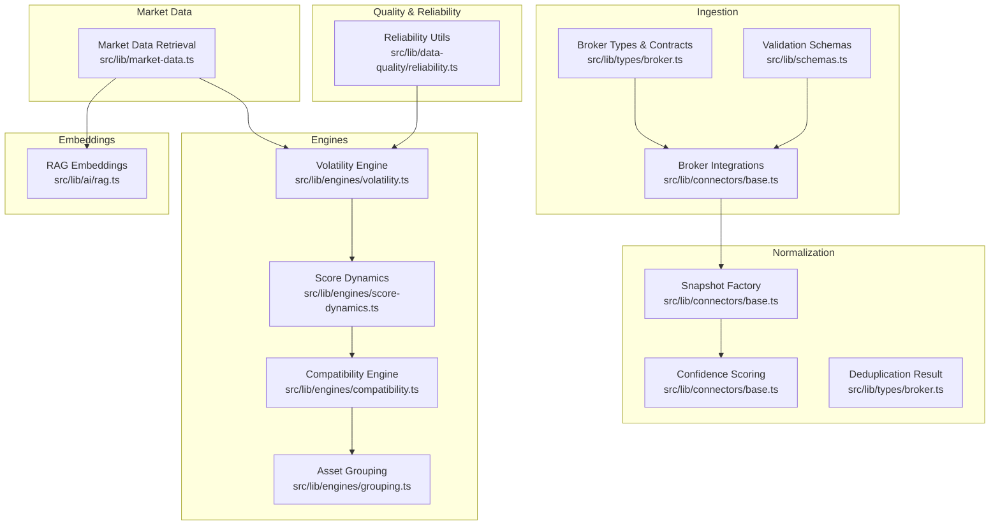
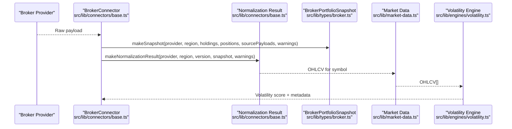
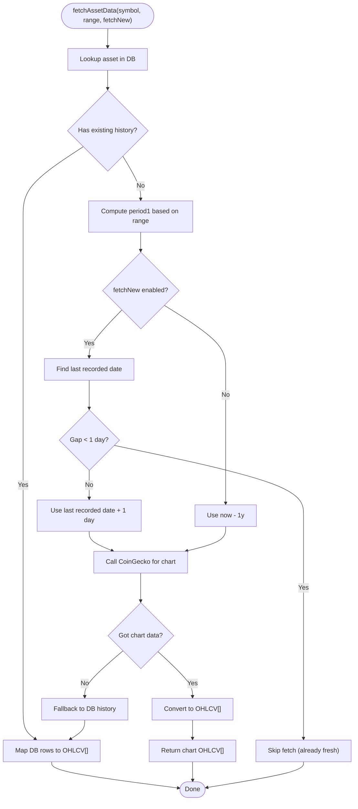
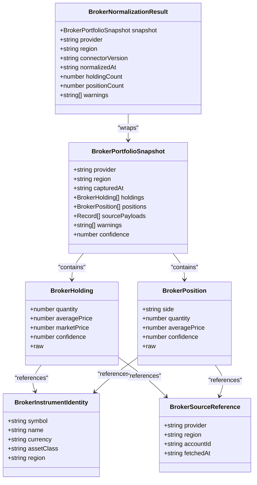
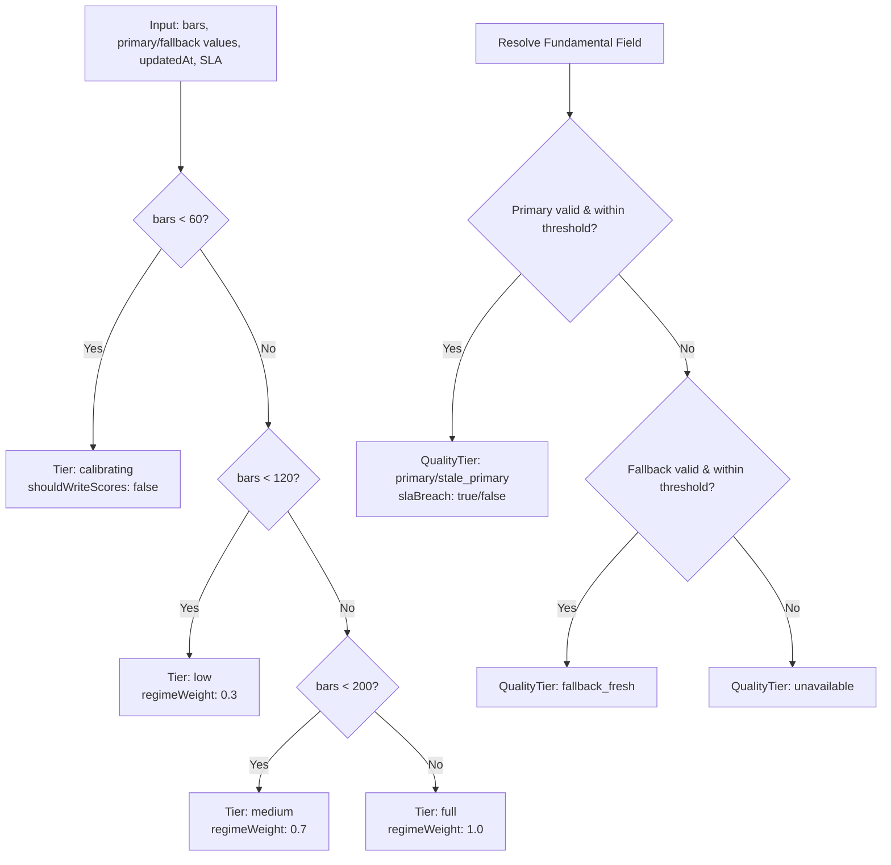
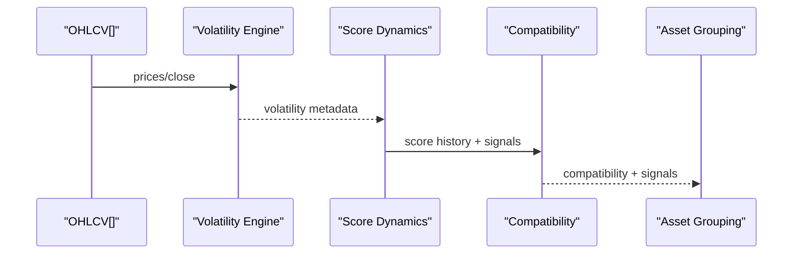
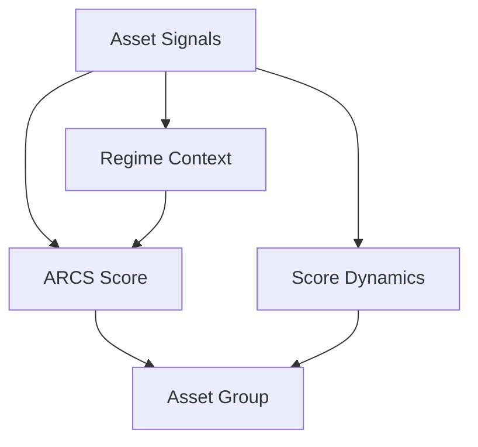
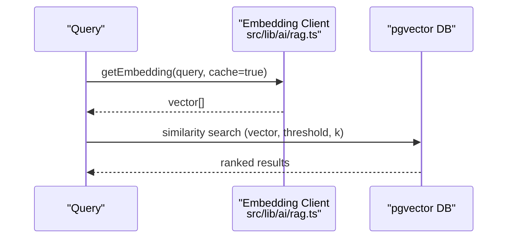
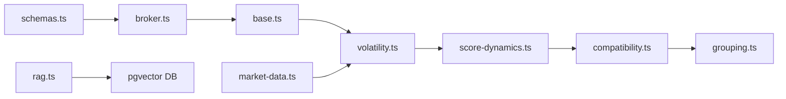

# Data Transformation & Normalization

<cite>
**Referenced Files in This Document**
- [market-data.ts](file://src/lib/market-data.ts)
- [reliability.ts](file://src/lib/data-quality/reliability.ts)
- [volatility.ts](file://src/lib/engines/volatility.ts)
- [score-dynamics.ts](file://src/lib/engines/score-dynamics.ts)
- [compatibility.ts](file://src/lib/engines/compatibility.ts)
- [grouping.ts](file://src/lib/engines/grouping.ts)
- [schemas.ts](file://src/lib/schemas.ts)
- [broker.ts](file://src/lib/types/broker.ts)
- [base.ts](file://src/lib/connectors/base.ts)
- [rag.ts](file://src/lib/ai/rag.ts)
- [admin.service.ts](file://src/lib/services/admin.service.ts)
</cite>

## Table of Contents
1. [Introduction](#introduction)
2. [Project Structure](#project-structure)
3. [Core Components](#core-components)
4. [Architecture Overview](#architecture-overview)
5. [Detailed Component Analysis](#detailed-component-analysis)
6. [Dependency Analysis](#dependency-analysis)
7. [Performance Considerations](#performance-considerations)
8. [Troubleshooting Guide](#troubleshooting-guide)
9. [Conclusion](#conclusion)
10. [Appendices](#appendices)

## Introduction
This document explains LyraAlpha’s data transformation and normalization processes. It covers how raw exchange and broker data are standardized into a consistent internal format, how technical indicators and derived metrics are generated, and how data quality, validation, and lineage are enforced. It also documents the asset scoring system, regime classification, performance attribution concepts, and embedding generation for vector search and semantic similarity.

## Project Structure
The data transformation stack spans several layers:
- Data ingestion and normalization for broker integrations
- Market data retrieval and standardization
- Data quality and reliability utilities
- Technical indicator engines (volatility, score dynamics)
- Regime compatibility and asset grouping
- Vector embeddings for semantic search
- Validation schemas and typing contracts

**Diagram sources**
- [base.ts:221-270](file://src/lib/connectors/base.ts#L221-L270)
- [broker.ts:195-221](file://src/lib/types/broker.ts#L195-L221)
- [schemas.ts:248-431](file://src/lib/schemas.ts#L248-L431)
- [market-data.ts:23-112](file://src/lib/market-data.ts#L23-L112)
- [reliability.ts:51-138](file://src/lib/data-quality/reliability.ts#L51-L138)
- [volatility.ts:14-142](file://src/lib/engines/volatility.ts#L14-L142)
- [score-dynamics.ts:27-155](file://src/lib/engines/score-dynamics.ts#L27-L155)
- [compatibility.ts:32-142](file://src/lib/engines/compatibility.ts#L32-L142)
- [grouping.ts:21-117](file://src/lib/engines/grouping.ts#L21-L117)
- [rag.ts:386-868](file://src/lib/ai/rag.ts#L386-L868)

**Section sources**
- [base.ts:1-420](file://src/lib/connectors/base.ts#L1-L420)
- [broker.ts:1-480](file://src/lib/types/broker.ts#L1-L480)
- [schemas.ts:1-539](file://src/lib/schemas.ts#L1-L539)
- [market-data.ts:1-113](file://src/lib/market-data.ts#L1-L113)
- [reliability.ts:1-139](file://src/lib/data-quality/reliability.ts#L1-L139)
- [volatility.ts:1-142](file://src/lib/engines/volatility.ts#L1-L142)
- [score-dynamics.ts:1-325](file://src/lib/engines/score-dynamics.ts#L1-L325)
- [compatibility.ts:1-204](file://src/lib/engines/compatibility.ts#L1-L204)
- [grouping.ts:1-117](file://src/lib/engines/grouping.ts#L1-L117)
- [rag.ts:386-868](file://src/lib/ai/rag.ts#L386-L868)

## Core Components
- Broker normalization contracts and factories: standardized snapshots, confidence scoring, and normalization results.
- Market data retrieval: OHLCV extraction and fallback logic for crypto assets.
- Data quality utilities: history confidence tiers and single/fundamental field resolution with freshness SLAs.
- Engines: volatility scoring, score dynamics, regime compatibility, and asset grouping.
- Embeddings: vector generation and pgvector similarity search for semantic retrieval.

**Section sources**
- [broker.ts:195-221](file://src/lib/types/broker.ts#L195-L221)
- [base.ts:200-270](file://src/lib/connectors/base.ts#L200-L270)
- [market-data.ts:23-112](file://src/lib/market-data.ts#L23-L112)
- [reliability.ts:51-138](file://src/lib/data-quality/reliability.ts#L51-L138)
- [volatility.ts:14-142](file://src/lib/engines/volatility.ts#L14-L142)
- [score-dynamics.ts:27-155](file://src/lib/engines/score-dynamics.ts#L27-L155)
- [compatibility.ts:32-142](file://src/lib/engines/compatibility.ts#L32-L142)
- [grouping.ts:21-117](file://src/lib/engines/grouping.ts#L21-L117)
- [rag.ts:386-868](file://src/lib/ai/rag.ts#L386-L868)

## Architecture Overview
The normalization pipeline transforms heterogeneous broker payloads into a canonical snapshot, validates and enriches fields, computes confidence, and persists lineage via source payloads. Market data is retrieved and standardized for indicator computation. Engines consume standardized inputs to produce derived signals and scores. Embeddings enable semantic search and retrieval.

**Diagram sources**
- [base.ts:221-270](file://src/lib/connectors/base.ts#L221-L270)
- [broker.ts:195-221](file://src/lib/types/broker.ts#L195-L221)
- [market-data.ts:23-112](file://src/lib/market-data.ts#L23-L112)
- [volatility.ts:14-142](file://src/lib/engines/volatility.ts#L14-L142)

## Detailed Component Analysis

### Market Data Standardization Pipeline
- Retrieves asset metadata and price history from the database or external APIs.
- Converts external chart data to internal OHLCV format.
- Applies fallback logic and logs warnings for unavailable or unsupported assets.
- Ensures consistent date/time and numeric types for downstream engines.

**Diagram sources**
- [market-data.ts:23-112](file://src/lib/market-data.ts#L23-L112)

**Section sources**
- [market-data.ts:23-112](file://src/lib/market-data.ts#L23-L112)

### Broker Data Normalization and Confidence Scoring
- Factory functions construct canonical snapshots and normalization results.
- Confidence is computed from completeness of normalized fields.
- Source payloads are retained for audit and reprocessing.
- Validation schemas enforce strict typing for all broker entities.

**Diagram sources**
- [broker.ts:123-221](file://src/lib/types/broker.ts#L123-L221)
- [base.ts:221-270](file://src/lib/connectors/base.ts#L221-L270)
- [schemas.ts:331-415](file://src/lib/schemas.ts#L331-L415)

**Section sources**
- [base.ts:200-270](file://src/lib/connectors/base.ts#L200-L270)
- [broker.ts:123-221](file://src/lib/types/broker.ts#L123-L221)
- [schemas.ts:248-431](file://src/lib/schemas.ts#L248-L431)

### Data Quality Validation and Reliability Utilities
- History confidence tiers guide whether to write scores based on bar count thresholds.
- Single-source and fundamental-field resolution apply freshness SLAs and precedence rules.
- Quality tiers indicate primary, stale-primary, fallback-fresh, or unavailable.

**Diagram sources**
- [reliability.ts:51-138](file://src/lib/data-quality/reliability.ts#L51-L138)

**Section sources**
- [reliability.ts:51-138](file://src/lib/data-quality/reliability.ts#L51-L138)

### Technical Indicators and Derived Metrics
- Volatility score integrates NATR, Bollinger Bands %B, and realized volatility regime, weighted to produce a 0–100 score.
- Score dynamics computes momentum, acceleration, volatility, and percentile ranks for asset scores across all assets and sectors.
- Compatibility scoring aligns asset signals with macro regime conditions and sentiment.
- Asset grouping classifies instruments into regimes and risk profiles.

**Diagram sources**
- [volatility.ts:14-142](file://src/lib/engines/volatility.ts#L14-L142)
- [score-dynamics.ts:27-155](file://src/lib/engines/score-dynamics.ts#L27-L155)
- [compatibility.ts:32-142](file://src/lib/engines/compatibility.ts#L32-L142)
- [grouping.ts:21-117](file://src/lib/engines/grouping.ts#L21-L117)

**Section sources**
- [volatility.ts:14-142](file://src/lib/engines/volatility.ts#L14-L142)
- [score-dynamics.ts:27-155](file://src/lib/engines/score-dynamics.ts#L27-L155)
- [compatibility.ts:32-142](file://src/lib/engines/compatibility.ts#L32-L142)
- [grouping.ts:21-117](file://src/lib/engines/grouping.ts#L21-L117)

### Asset Scoring System and Regime Classification
- ARCS (Asset-to-Regime Compatibility Score) blends trend, momentum, volatility, liquidity, and sentiment with regime-dependent weights.
- Asset groups reflect structural fit to environment and risk profile.
- Score dynamics provide temporal context (momentum, acceleration, volatility) and percentile comparisons.

**Diagram sources**
- [compatibility.ts:32-142](file://src/lib/engines/compatibility.ts#L32-L142)
- [grouping.ts:21-117](file://src/lib/engines/grouping.ts#L21-L117)
- [score-dynamics.ts:27-155](file://src/lib/engines/score-dynamics.ts#L27-L155)

**Section sources**
- [compatibility.ts:32-142](file://src/lib/engines/compatibility.ts#L32-L142)
- [grouping.ts:21-117](file://src/lib/engines/grouping.ts#L21-L117)
- [score-dynamics.ts:27-155](file://src/lib/engines/score-dynamics.ts#L27-L155)

### Performance Attribution Concepts
- The system does not implement explicit portfolio-level performance attribution in the analyzed code.
- Engines focus on asset-level signals, compatibility, and dynamics. Portfolio-level attribution would require additional aggregation and decomposition logic not present here.

[No sources needed since this section summarizes absence of specific code]

### Embedding Generation and Semantic Similarity
- Embeddings are generated via an embedding client with retry/backoff and validated before vector operations.
- pgvector similarity search is used for knowledge and user memory retrieval with configurable thresholds and limits.
- Empty or invalid vectors are guarded against to prevent undefined behavior.

**Diagram sources**
- [rag.ts:386-868](file://src/lib/ai/rag.ts#L386-L868)

**Section sources**
- [rag.ts:386-868](file://src/lib/ai/rag.ts#L386-L868)

## Dependency Analysis
- Broker connectors depend on validation schemas and type contracts to ensure normalized outputs.
- Engines rely on standardized OHLCV and score histories; they are decoupled from upstream data sources.
- Embedding utilities depend on vector dimensions and similarity thresholds configured at runtime.

**Diagram sources**
- [schemas.ts:248-431](file://src/lib/schemas.ts#L248-L431)
- [broker.ts:195-221](file://src/lib/types/broker.ts#L195-L221)
- [base.ts:221-270](file://src/lib/connectors/base.ts#L221-L270)
- [volatility.ts:14-142](file://src/lib/engines/volatility.ts#L14-L142)
- [score-dynamics.ts:27-155](file://src/lib/engines/score-dynamics.ts#L27-L155)
- [compatibility.ts:32-142](file://src/lib/engines/compatibility.ts#L32-L142)
- [grouping.ts:21-117](file://src/lib/engines/grouping.ts#L21-L117)
- [market-data.ts:23-112](file://src/lib/market-data.ts#L23-L112)
- [rag.ts:386-868](file://src/lib/ai/rag.ts#L386-L868)

**Section sources**
- [schemas.ts:248-431](file://src/lib/schemas.ts#L248-L431)
- [broker.ts:195-221](file://src/lib/types/broker.ts#L195-L221)
- [base.ts:221-270](file://src/lib/connectors/base.ts#L221-L270)
- [volatility.ts:14-142](file://src/lib/engines/volatility.ts#L14-L142)
- [score-dynamics.ts:27-155](file://src/lib/engines/score-dynamics.ts#L27-L155)
- [compatibility.ts:32-142](file://src/lib/engines/compatibility.ts#L32-L142)
- [grouping.ts:21-117](file://src/lib/engines/grouping.ts#L21-L117)
- [market-data.ts:23-112](file://src/lib/market-data.ts#L23-L112)
- [rag.ts:386-868](file://src/lib/ai/rag.ts#L386-L868)

## Performance Considerations
- Caching: Connector-level in-memory caching reduces repeated fetches; tune TTL based on volatility and freshness SLAs.
- Batching: Bulk score dynamics computation pre-fetches global and sector distributions to minimize DB scans.
- Vector search: Use similarity thresholds and result caps to bound latency; guard against empty vectors.
- Idempotency: Pipelines should be replay-safe; checkpoints and cursors support incremental syncs.

[No sources needed since this section provides general guidance]

## Troubleshooting Guide
Common issues and remedies:
- Missing or stale data: Check history confidence tiers and SLA breaches; ensure freshness windows are respected.
- Invalid embeddings: Validate vector strings before pgvector queries; log and degrade gracefully on API failures.
- Broker normalization errors: Confirm schemas and field mappings; verify required fields and currency consistency.
- Inconsistent asset grouping: Review ARCS breakdown and regime labels; adjust thresholds if needed.

**Section sources**
- [reliability.ts:51-138](file://src/lib/data-quality/reliability.ts#L51-L138)
- [rag.ts:386-868](file://src/lib/ai/rag.ts#L386-L868)
- [schemas.ts:248-431](file://src/lib/schemas.ts#L248-L431)
- [compatibility.ts:32-142](file://src/lib/engines/compatibility.ts#L32-L142)

## Conclusion
LyraAlpha’s data transformation and normalization stack ensures robust, auditable, and standardized inputs for analytics and AI. By enforcing strict validation, retaining raw payloads, computing confidence, and deriving signals through modular engines, the system supports accurate regime classification, asset grouping, and semantic search. Extending the framework with portfolio-level attribution and enhanced lineage tracking would further strengthen compliance and traceability.

## Appendices

### Data Validation Schemas (Selected)
- Broker integration matrices, source references, instrument identities, holdings, positions, transactions, and normalization results are strictly typed and validated.

**Section sources**
- [schemas.ts:248-431](file://src/lib/schemas.ts#L248-L431)

### Embedding Status Monitoring
- Admin service aggregates embedding status counts across processing stages.

**Section sources**
- [admin.service.ts:809-819](file://src/lib/services/admin.service.ts#L809-L819)