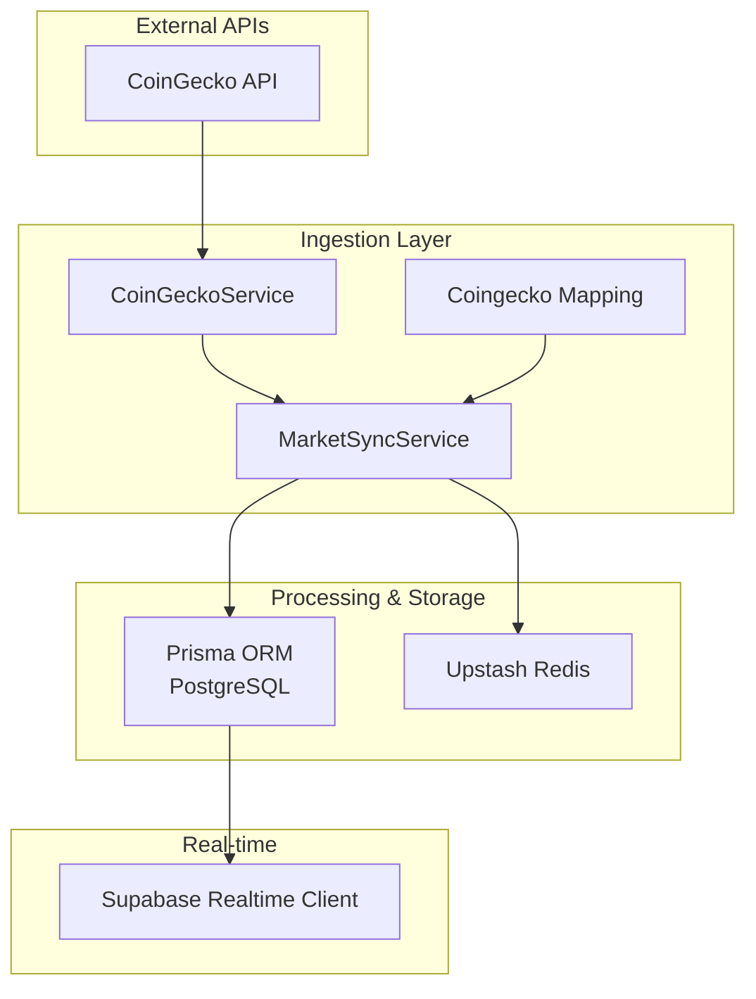
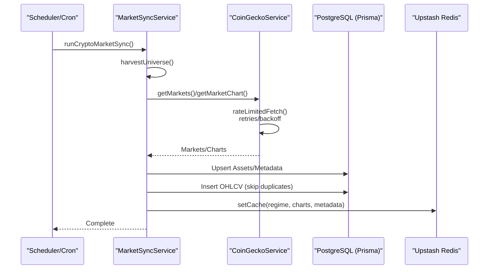
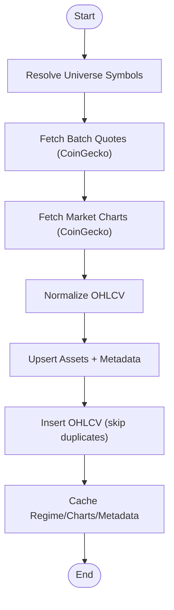
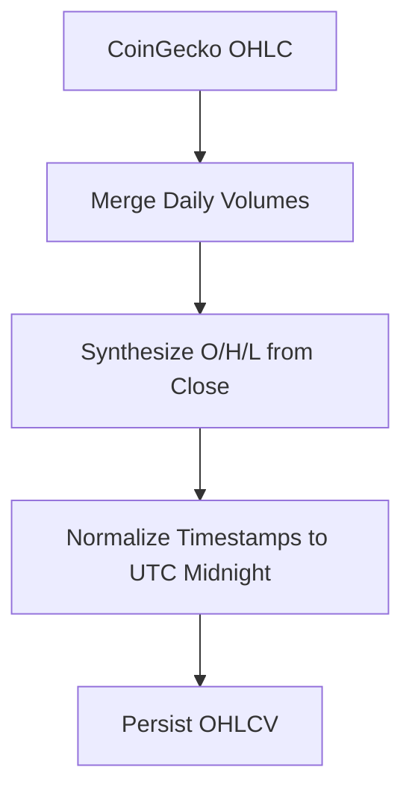
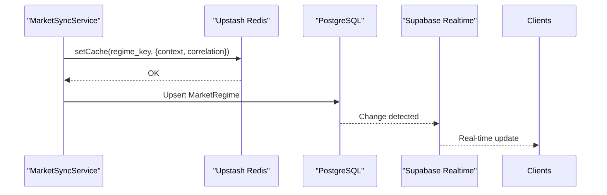
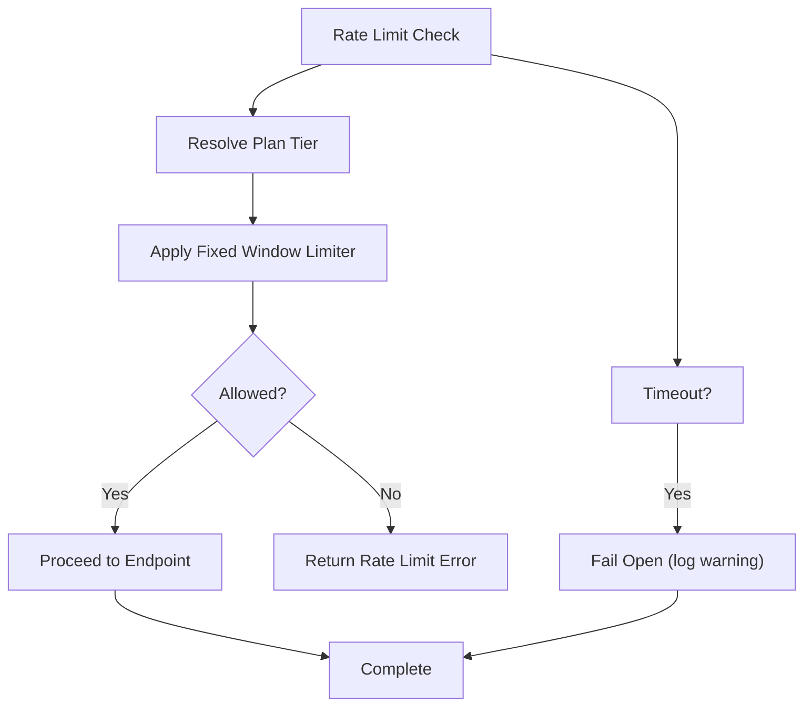
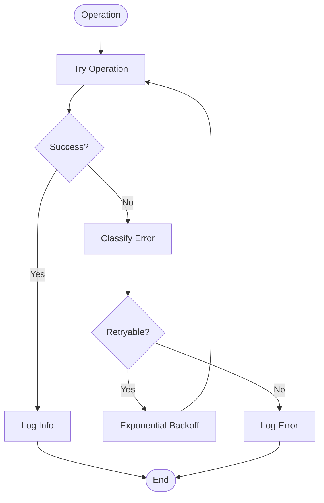
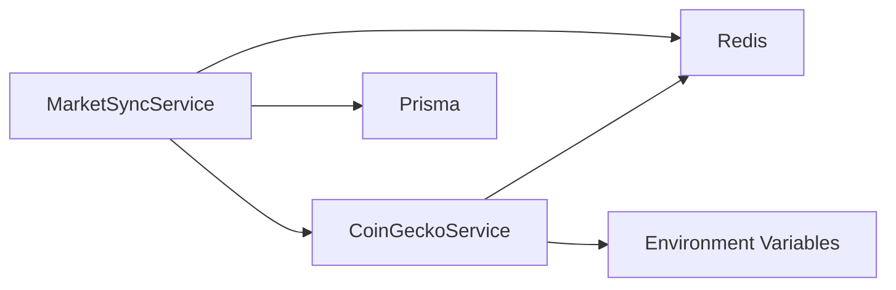

# Real-time Data Ingestion

<cite>
**Referenced Files in This Document**
- [market-data.ts](file://src/lib/market-data.ts)
- [coingecko.service.ts](file://src/lib/services/coingecko.service.ts)
- [coingecko-mapping.ts](file://src/lib/services/coingecko-mapping.ts)
- [market-sync.service.ts](file://src/lib/services/market-sync.service.ts)
- [redis.ts](file://src/lib/redis.ts)
- [supabase-realtime.ts](file://src/lib/supabase-realtime.ts)
- [rate-limit/index.ts](file://src/lib/rate-limit/index.ts)
- [rate-limit/config.ts](file://src/lib/rate-limit/config.ts)
- [logger/index.ts](file://src/lib/logger/index.ts)
- [cache.ts](file://src/lib/cache.ts)
- [crypto.ts](file://src/lib/crypto.ts)
- [schemas.ts](file://src/lib/schemas.ts)
- [types/broker.ts](file://src/lib/types/broker.ts)
- [engines/market-regime.ts](file://src/lib/engines/market-regime.ts)
</cite>

## Table of Contents
1. [Introduction](#introduction)
2. [Project Structure](#project-structure)
3. [Core Components](#core-components)
4. [Architecture Overview](#architecture-overview)
5. [Detailed Component Analysis](#detailed-component-analysis)
6. [Dependency Analysis](#dependency-analysis)
7. [Performance Considerations](#performance-considerations)
8. [Troubleshooting Guide](#troubleshooting-guide)
9. [Conclusion](#conclusion)
10. [Appendices](#appendices)

## Introduction
This document explains LyraAlpha’s real-time data ingestion system for cryptocurrency market data. It covers how market data is collected from external APIs (primarily CoinGecko), normalized and persisted, and how the system maintains performance and reliability using caching, rate limiting, and robust error handling. It also outlines the real-time processing architecture leveraging Upstash Redis for caching and Supabase for real-time updates, and details strategies for data consistency, timestamps, and volume/price aggregation.

## Project Structure
The ingestion pipeline spans several modules:
- Data collection: CoinGecko service and mapping utilities
- Data normalization: OHLCV conversion and metadata enrichment
- Persistence: PostgreSQL via Prisma ORM
- Caching: Upstash Redis for short-lived and long-lived caches
- Rate limiting: Tiered rate limits for market data endpoints
- Logging and observability: Pino structured logging
- Real-time updates: Supabase client initialization

**Diagram sources**
- [market-sync.service.ts:125-472](file://src/lib/services/market-sync.service.ts#L125-L472)
- [coingecko.service.ts:77-541](file://src/lib/services/coingecko.service.ts#L77-L541)
- [coingecko-mapping.ts:1-368](file://src/lib/services/coingecko-mapping.ts#L1-L368)
- [redis.ts:1-70](file://src/lib/redis.ts#L1-L70)
- [supabase-realtime.ts:1-8](file://src/lib/supabase-realtime.ts#L1-L8)

**Section sources**
- [market-sync.service.ts:119-166](file://src/lib/services/market-sync.service.ts#L119-L166)
- [coingecko.service.ts:77-114](file://src/lib/services/coingecko.service.ts#L77-L114)
- [coingecko-mapping.ts:312-367](file://src/lib/services/coingecko-mapping.ts#L312-L367)
- [redis.ts:1-70](file://src/lib/redis.ts#L1-L70)
- [supabase-realtime.ts:1-8](file://src/lib/supabase-realtime.ts#L1-L8)

## Core Components
- MarketSyncService orchestrates the ingestion pipeline: resolving the universe, harvesting quotes and charts, persisting OHLCV, enriching metadata, computing analytics, and caching results.
- CoinGeckoService encapsulates API access with rate limiting, retries, and caching.
- Coingecko-mapping provides bidirectional symbol-to-ID mapping and display name overrides.
- Redis client abstraction supports caching and fail-open behavior when Redis is unavailable.
- Supabase realtime client enables real-time updates when data changes.
- Rate limiting enforces per-tier quotas for market data endpoints.
- Logger provides structured logging across services.

**Section sources**
- [market-sync.service.ts:119-166](file://src/lib/services/market-sync.service.ts#L119-L166)
- [coingecko.service.ts:77-114](file://src/lib/services/coingecko.service.ts#L77-L114)
- [coingecko-mapping.ts:312-367](file://src/lib/services/coingecko-mapping.ts#L312-L367)
- [redis.ts:1-70](file://src/lib/redis.ts#L1-L70)
- [supabase-realtime.ts:1-8](file://src/lib/supabase-realtime.ts#L1-L8)
- [rate-limit/index.ts:225-250](file://src/lib/rate-limit/index.ts#L225-L250)
- [logger/index.ts:1-91](file://src/lib/logger/index.ts#L1-L91)

## Architecture Overview
The ingestion architecture follows a multi-phase pipeline:
- Phase 1: Universe harvesting (assets and metadata)
- Phase 1-CG: Quote and chart harvesting via CoinGecko
- Phase 2: Analytics computation and persistence
- Caching: Redis-backed caches for regimes, charts, and metadata
- Real-time updates: Supabase client initialized for downstream consumers

**Diagram sources**
- [market-sync.service.ts:164-166](file://src/lib/services/market-sync.service.ts#L164-L166)
- [coingecko.service.ts:37-75](file://src/lib/services/coingecko.service.ts#L37-L75)
- [redis.ts:1-70](file://src/lib/redis.ts#L1-L70)

## Detailed Component Analysis

### Market Data Collection Pipeline
- CoinGeckoService implements rate-limited fetch with exponential backoff, caching, and per-endpoint TTLs. It exposes methods for markets, charts, details, and global metrics.
- Coingecko-mapping resolves symbol-to-ID and vice versa, with display name overrides and fallback logic.
- MarketSyncService coordinates:
  - Resolving the asset universe
  - Fetching batch quotes and charts
  - Persisting OHLCV with deduplication
  - Enriching metadata and computing analytics

**Diagram sources**
- [market-sync.service.ts:125-472](file://src/lib/services/market-sync.service.ts#L125-L472)
- [coingecko.service.ts:82-202](file://src/lib/services/coingecko.service.ts#L82-L202)
- [coingecko-mapping.ts:312-367](file://src/lib/services/coingecko-mapping.ts#L312-L367)

**Section sources**
- [coingecko.service.ts:77-202](file://src/lib/services/coingecko.service.ts#L77-L202)
- [coingecko-mapping.ts:312-367](file://src/lib/services/coingecko-mapping.ts#L312-L367)
- [market-sync.service.ts:125-472](file://src/lib/services/market-sync.service.ts#L125-L472)

### Data Normalization and Transformation
- OHLCV normalization:
  - CoinGecko OHLC lacks volume; the service synthesizes O/H/L from close and augments with daily volumes from market charts.
  - Timestamps are normalized to UTC midnight strings.
- Metadata enrichment:
  - Developer/community metrics are transformed into labels and proxies (e.g., technical rating, analyst rating).
  - Institutional proxy derived from watchlist and social metrics.
- Reliability and confidence:
  - Confidence tiers and reliability metadata are attached to assets to guide engine computations.

**Diagram sources**
- [coingecko.service.ts:345-415](file://src/lib/services/coingecko.service.ts#L345-L415)
- [market-sync.service.ts:331-362](file://src/lib/services/market-sync.service.ts#L331-L362)

**Section sources**
- [coingecko.service.ts:345-415](file://src/lib/services/coingecko.service.ts#L345-L415)
- [market-sync.service.ts:331-362](file://src/lib/services/market-sync.service.ts#L331-L362)

### Real-time Processing with Redis and Supabase
- Redis client:
  - Thin wrapper around Upstash Redis with a no-op fallback when environment variables are missing.
  - Provides get/set/scan/pipeline primitives used by caching utilities.
- Supabase realtime:
  - Client creation guarded by environment variables; returns null when not configured.
- Market regime caching:
  - Market context and correlation metrics are cached under a region/date key to avoid recomputation.

**Diagram sources**
- [redis.ts:1-70](file://src/lib/redis.ts#L1-L70)
- [market-sync.service.ts:618-724](file://src/lib/services/market-sync.service.ts#L618-L724)
- [supabase-realtime.ts:1-8](file://src/lib/supabase-realtime.ts#L1-L8)

**Section sources**
- [redis.ts:1-70](file://src/lib/redis.ts#L1-L70)
- [market-sync.service.ts:618-724](file://src/lib/services/market-sync.service.ts#L618-L724)
- [supabase-realtime.ts:1-8](file://src/lib/supabase-realtime.ts#L1-L8)

### Rate Limits and Retry Strategies
- Tiered rate limits for market data endpoints:
  - Configured per plan tier with fixed windows and timeouts.
  - Fail-open behavior on timeout or limiter failure to preserve UX.
- CoinGecko rate limiting:
  - Serialized request queue with enforced delays and exponential backoff on 429.
  - Per-endpoint TTLs for caches to reduce API pressure.

**Diagram sources**
- [rate-limit/config.ts:12-106](file://src/lib/rate-limit/config.ts#L12-L106)
- [rate-limit/index.ts:225-250](file://src/lib/rate-limit/index.ts#L225-L250)
- [coingecko.service.ts:37-75](file://src/lib/services/coingecko.service.ts#L37-L75)

**Section sources**
- [rate-limit/config.ts:12-106](file://src/lib/rate-limit/config.ts#L12-L106)
- [rate-limit/index.ts:225-250](file://src/lib/rate-limit/index.ts#L225-L250)
- [coingecko.service.ts:37-75](file://src/lib/services/coingecko.service.ts#L37-L75)

### Error Handling and Data Consistency
- Structured logging:
  - Centralized logger with redaction and environment-aware formatting.
- Error classification:
  - Classification utilities categorize errors (network, external API, database, rate limit) and mark retryable ones.
- Data consistency:
  - Batched writes with chunking and fallback to per-item writes.
  - Skip-duplicates during OHLCV insertion and 1-year retention policy.
  - Cache invalidation and regime signature checks to detect shifts.

**Diagram sources**
- [logger/index.ts:1-91](file://src/lib/logger/index.ts#L1-L91)
- [errors/classification.ts:116-182](file://src/lib/errors/classification.ts#L116-L182)
- [market-sync.service.ts:283-297](file://src/lib/services/market-sync.service.ts#L283-L297)

**Section sources**
- [logger/index.ts:1-91](file://src/lib/logger/index.ts#L1-L91)
- [errors/classification.ts:116-182](file://src/lib/errors/classification.ts#L116-L182)
- [market-sync.service.ts:283-297](file://src/lib/services/market-sync.service.ts#L283-L297)

### Examples and Patterns
- Market data transformation:
  - Converting CoinGecko OHLC arrays to standardized OHLCV entries with UTC midnight timestamps.
  - Augmenting with daily volumes from market charts.
- Timestamp handling:
  - Converting timestamps to ISO strings at UTC midnight to ensure consistent grouping.
- Volume/price aggregation:
  - Using daily OHLCV to compute returns, rolling statistics, and correlation metrics.
- API authentication:
  - Optional CoinGecko API key via environment variable; otherwise anonymous access.

**Section sources**
- [coingecko.service.ts:345-415](file://src/lib/services/coingecko.service.ts#L345-L415)
- [market-data.ts:15-21](file://src/lib/market-data.ts#L15-L21)
- [coingecko.service.ts:53-58](file://src/lib/services/coingecko.service.ts#L53-L58)

## Dependency Analysis
- MarketSyncService depends on:
  - CoinGeckoService for external data
  - Prisma for persistence
  - Redis for caching
  - Engines for analytics computation
- CoinGeckoService depends on:
  - Environment variables for base URL and API key
  - Redis for caching
- Redis client depends on environment variables for Upstash credentials.

**Diagram sources**
- [market-sync.service.ts:1-50](file://src/lib/services/market-sync.service.ts#L1-L50)
- [coingecko.service.ts:1-20](file://src/lib/services/coingecko.service.ts#L1-L20)
- [redis.ts:16-23](file://src/lib/redis.ts#L16-L23)

**Section sources**
- [market-sync.service.ts:1-50](file://src/lib/services/market-sync.service.ts#L1-L50)
- [coingecko.service.ts:1-20](file://src/lib/services/coingecko.service.ts#L1-L20)
- [redis.ts:16-23](file://src/lib/redis.ts#L16-L23)

## Performance Considerations
- Batched API calls: CoinGecko markets endpoint accepts comma-separated IDs to minimize requests.
- Chunked writes: Prisma transactions are split into chunks to avoid timeouts.
- Caching: Short TTLs for frequently changing data (quotes, OHLC) and longer TTLs for stable metadata.
- Serialization: CoinGecko requests are queued to respect rate limits and avoid 429 responses.
- Retention policy: One-year OHLCV retention prevents unbounded growth while preserving analytics windows.

[No sources needed since this section provides general guidance]

## Troubleshooting Guide
- Redis unavailable:
  - The Redis client falls back to a no-op implementation; ingestion continues but caching is disabled.
- Rate limit exceeded:
  - Market data endpoints enforce per-tier limits; failures return a structured error response; the system is designed to fail open on limiter timeouts.
- CoinGecko errors:
  - 429 responses trigger exponential backoff; persistent failures are logged and the system attempts fallbacks (e.g., returning DB history).
- Data gaps:
  - Delta-only history fetch computes days since last record and inserts only new points; overlapping periods are filtered.

**Section sources**
- [redis.ts:25-62](file://src/lib/redis.ts#L25-L62)
- [rate-limit/index.ts:66-79](file://src/lib/rate-limit/index.ts#L66-L79)
- [coingecko.service.ts:62-75](file://src/lib/services/coingecko.service.ts#L62-L75)
- [market-sync.service.ts:317-362](file://src/lib/services/market-sync.service.ts#L317-L362)

## Conclusion
LyraAlpha’s ingestion system combines efficient external API usage, robust normalization, and resilient caching to deliver timely and consistent market data. The modular design allows for incremental improvements, while rate limiting, retries, and fail-open strategies ensure reliability under varying conditions. Redis and Supabase enable scalable caching and real-time updates, supporting both batch and reactive data flows.

[No sources needed since this section summarizes without analyzing specific files]

## Appendices

### API Authentication and Security
- CoinGecko API key:
  - Optional environment variable; included in request headers when present.
- Encryption utilities:
  - AES-256-GCM helpers for secure storage of secrets; PBKDF2 key derivation with caching.

**Section sources**
- [coingecko.service.ts:53-58](file://src/lib/services/coingecko.service.ts#L53-L58)
- [crypto.ts:17-31](file://src/lib/crypto.ts#L17-L31)

### Data Models and Normalization Contracts
- Broker normalization schemas and field mappings define canonical structures for portfolio data; analogous normalization principles apply to market data ingestion (mapping external fields to internal structures, attaching confidence, and retaining raw payloads for audit).

**Section sources**
- [schemas.ts:473-525](file://src/lib/schemas.ts#L473-L525)
- [types/broker.ts:287-343](file://src/lib/types/broker.ts#L287-L343)