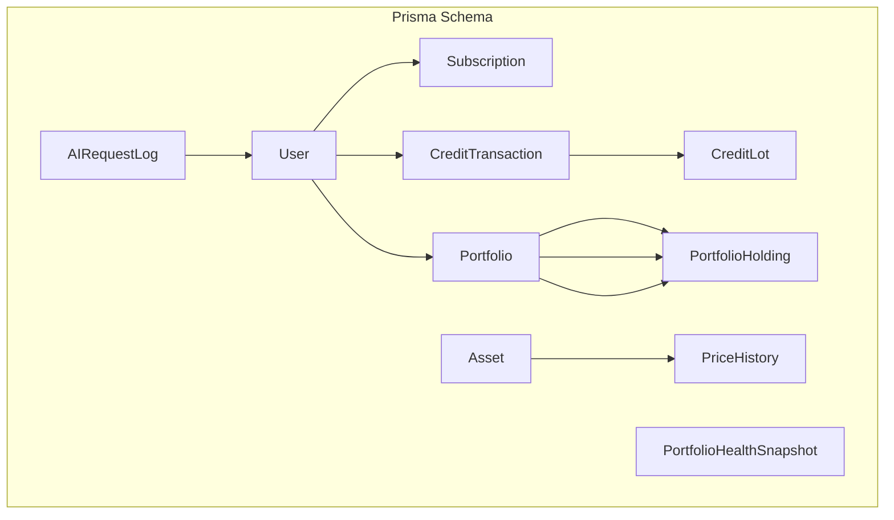
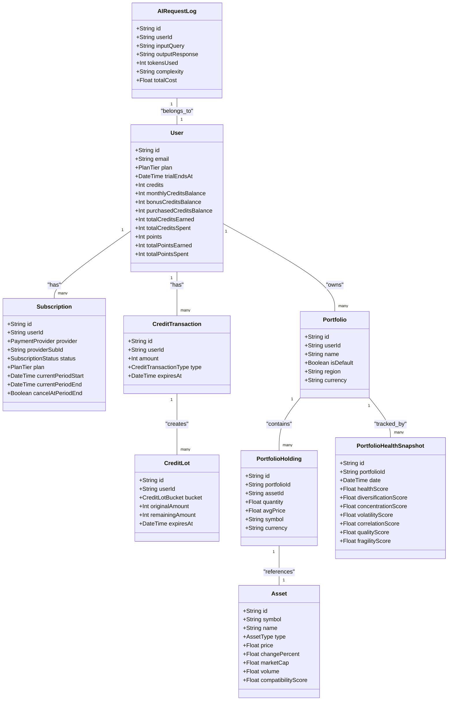
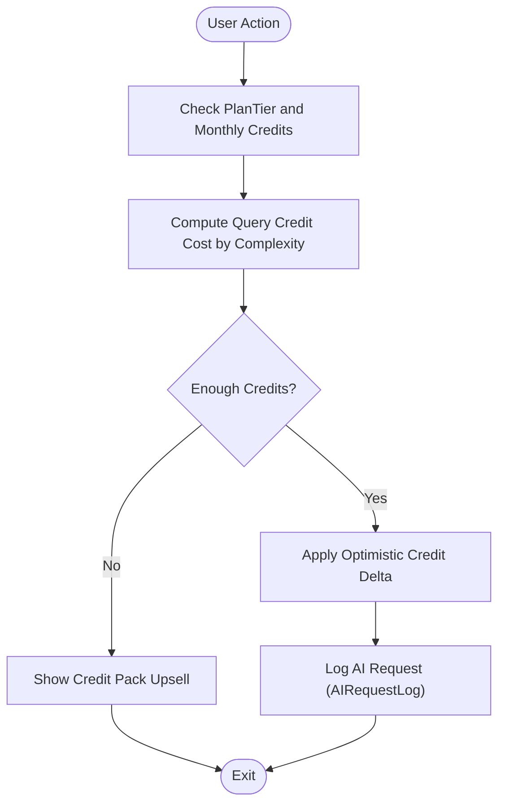
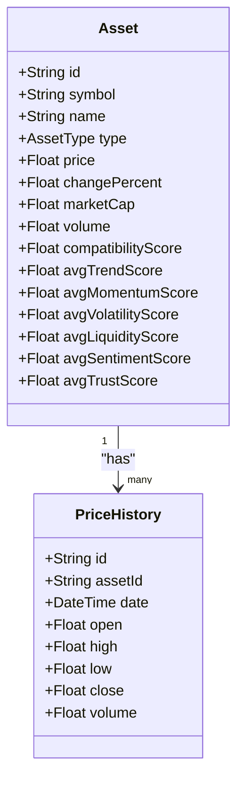
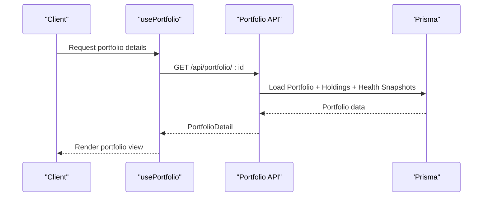
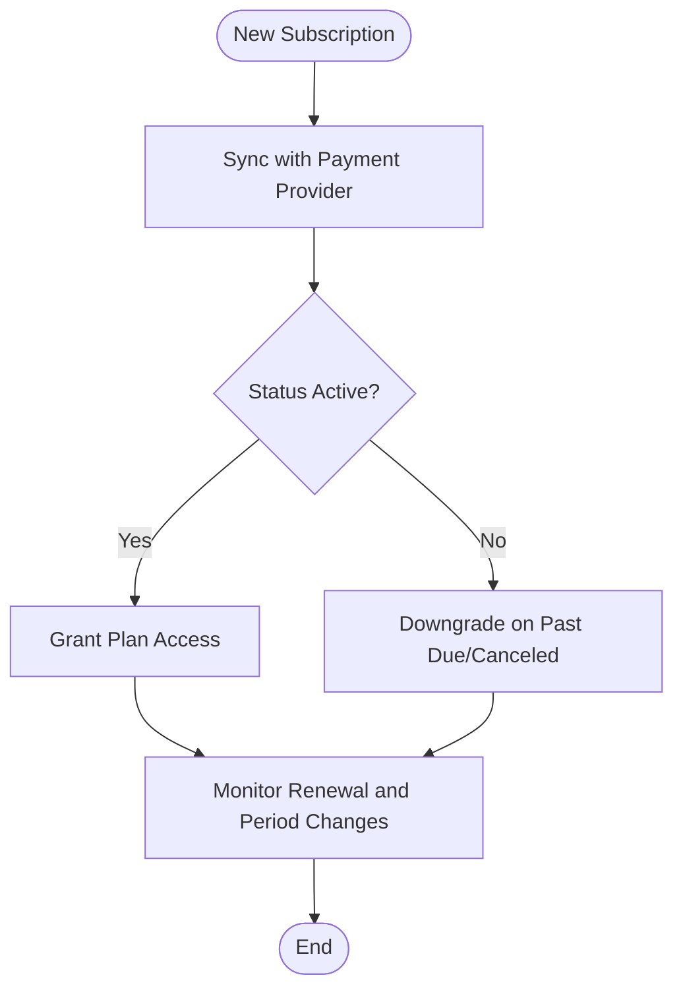
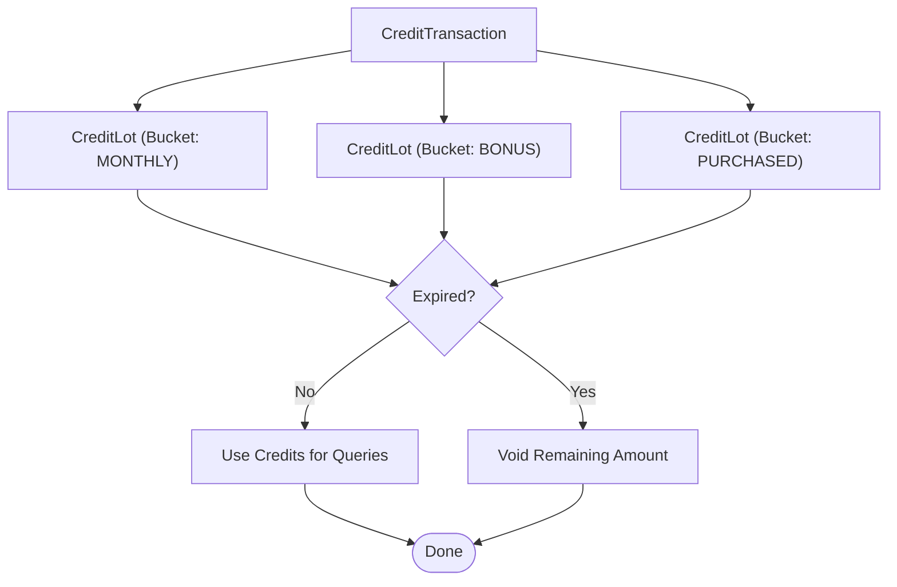
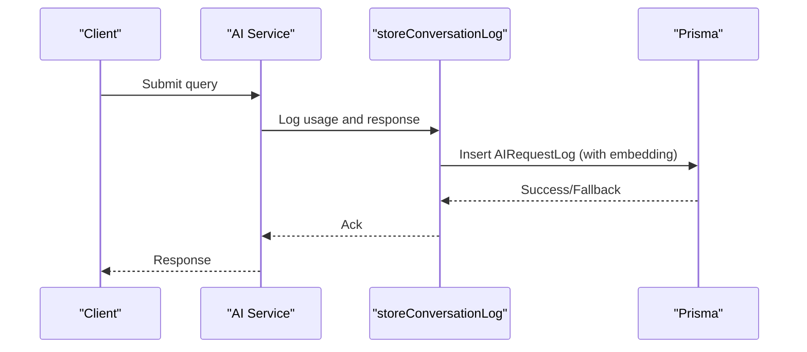
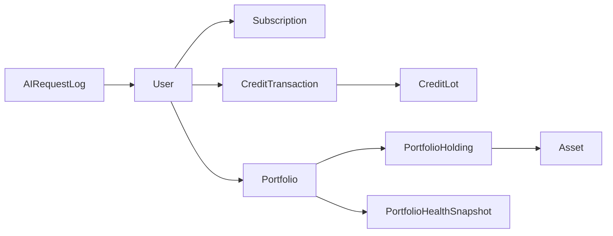

# Core Entities

<cite>
**Referenced Files in This Document**
- [schema.prisma](file://prisma/schema.prisma)
- [query-builders.ts](file://src/lib/db/query-builders.ts)
- [client.ts](file://src/lib/credits/client.ts)
- [facts.ts](file://src/lib/plans/facts.ts)
- [upgrade-pricing.ts](file://src/lib/billing/upgrade-pricing.ts)
- [use-portfolio.ts](file://src/hooks/use-portfolio.ts)
- [use-portfolio-health.ts](file://src/hooks/use-portfolio-health.ts)
- [rag.ts](file://src/lib/ai/rag.ts)
- [monitoring.ts](file://src/lib/ai/monitoring.ts)
- [audit-prompt-pipeline.ts](file://scripts/audit-prompt-pipeline.ts)
</cite>

## Table of Contents
1. [Introduction](#introduction)
2. [Project Structure](#project-structure)
3. [Core Components](#core-components)
4. [Architecture Overview](#architecture-overview)
5. [Detailed Component Analysis](#detailed-component-analysis)
6. [Dependency Analysis](#dependency-analysis)
7. [Performance Considerations](#performance-considerations)
8. [Troubleshooting Guide](#troubleshooting-guide)
9. [Conclusion](#conclusion)

## Introduction
This document provides comprehensive documentation for LyraAlpha’s core database entities. It focuses on the User, Asset, Portfolio, Subscription, CreditTransaction, CreditLot, and AIRequestLog models, along with supporting enums and relationships. It explains field definitions, data types, constraints, and business logic, and illustrates common query patterns and integrations with the broader system.

## Project Structure
The core data model is defined in the Prisma schema. Supporting libraries define plan facts, credit client helpers, and portfolio hooks. AI telemetry and analytics rely on the AIRequestLog model and related utilities.

**Diagram sources**
- [schema.prisma](file://prisma/schema.prisma)

**Section sources**
- [schema.prisma](file://prisma/schema.prisma)

## Core Components

### User
- Purpose: Stores user identity, plan tier, trial state, and credits balances. Tracks preferences, activity, and relationships to portfolios, subscriptions, and transactions.
- Key fields:
  - Identity: id (primary key), email (unique), stripeCustomerId (unique)
  - Plan and trial: plan (PlanTier), trialEndsAt
  - Credits: credits (current balance), monthlyCreditsBalance, bonusCreditsBalance, purchasedCreditsBalance, totalCreditsEarned, totalCreditsSpent
  - Points and XP: points, totalPointsEarned, totalPointsSpent, progress (via UserProgress), badges, xpTransactions, xpRedemptions
  - Preferences and communications: preferences (UserPreference), notifications, sessions, activity events
  - Payments and billing: subscriptions (Subscription), paymentEvents (PaymentEvent), billingAuditLogs
  - Portfolios: portfolios (Portfolio)
  - Credits system: creditTransactions (CreditTransaction), creditLots (CreditLot)
  - AI analytics: AIRequestLog
  - Referrals: referralsMade, referralsReceived
  - Support: supportConversations
  - Learning: learningCompletions
- Constraints and indexes:
  - Unique indices on email, stripeCustomerId
  - Indexes on createdAt, updatedAt, and derived fields for performance
- Business logic highlights:
  - Monthly credits are managed via monthlyCreditsBalance and credit buckets
  - Trial period enforced via trialEndsAt
  - Plan tier influences AI routing and feature access

**Section sources**
- [schema.prisma](file://prisma/schema.prisma)

### Asset
- Purpose: Represents cryptocurrency assets with price, metrics, technical indicators, and market regime data.
- Key fields:
  - Identification: id, symbol (unique), name, type (AssetType)
  - Metadata: description, sector, exchange, currency, region
  - Market data: price, changePercent, marketCap, volume, avgVolume, lastPriceUpdate
  - Ratings and scores: technicalRating, analystRating, compatibilityScore, compatibilityLabel
  - DSE scores: avgTrendScore, avgMomentumScore, avgVolatilityScore, avgLiquidityScore, avgSentimentScore, avgTrustScore
  - Performance and scenario data: performanceData, scenarioData, scoreDynamics
  - Factor and correlation data: factorData, correlationData, correlationRegime, factorAlignment
  - Event-adjusted metrics: eventAdjustedScores
  - Industry and group: industry, assetGroup
  - Crypto-specific: openInterest, fiftyTwoWeekHigh, fiftyTwoWeekLow
  - JSON metadata: metadata
- Constraints and indexes:
  - Unique symbol
  - Composite indexes for region/type/lastPriceUpdate, region/lastPriceUpdate, coingeckoId
- Business logic highlights:
  - Supports multiple score types and regime-aware metrics
  - Price history stored separately via PriceHistory

**Section sources**
- [schema.prisma](file://prisma/schema.prisma)

### Portfolio
- Purpose: Manages user portfolios, holdings, and health snapshots for performance tracking.
- Key fields:
  - Identification: id, userId (foreign key), name (unique per user), description
  - Settings: isDefault, region, currency (default USD)
  - Timestamps: createdAt, updatedAt
- Relationships:
  - One-to-many with PortfolioHolding (holdings)
  - One-to-many with PortfolioHealthSnapshot (healthSnapshots)
  - Belongs to User
- Constraints and indexes:
  - Unique index on userId + name
  - Indexes on userId, region, updatedAt

**Section sources**
- [schema.prisma](file://prisma/schema.prisma)

### PortfolioHolding
- Purpose: Tracks individual asset holdings within a portfolio.
- Key fields:
  - Identification: id, portfolioId (foreign key), assetId (foreign key), symbol
  - Position: quantity, avgPrice, currency (default USD)
  - Timestamps: addedAt, updatedAt
- Constraints and indexes:
  - Unique index on portfolioId + assetId
  - Indexes on portfolioId, assetId

**Section sources**
- [schema.prisma](file://prisma/schema.prisma)

### PortfolioHealthSnapshot
- Purpose: Stores periodic health metrics for a portfolio.
- Key fields:
  - Identification: id, portfolioId (foreign key)
  - Timestamp: date (default now)
  - Scores: healthScore, diversificationScore, concentrationScore, volatilityScore, correlationScore, qualityScore, fragilityScore
  - Risk metrics: riskMetrics (JSON)
  - Regime context: regime
- Constraints and indexes:
  - Index on portfolioId + date (descending)

**Section sources**
- [schema.prisma](file://prisma/schema.prisma)

### Subscription
- Purpose: Records user payment subscriptions and plan status.
- Key fields:
  - Identification: id, userId (foreign key), provider (PaymentProvider), providerSubId (unique)
  - Status and plan: status (SubscriptionStatus), plan (PlanTier)
  - Periods: currentPeriodStart, currentPeriodEnd, cancelAtPeriodEnd
  - Metadata: metadata (JSON)
  - Timestamps: createdAt, updatedAt
- Constraints and indexes:
  - Unique index on providerSubId
  - Indexes on userId, status

**Section sources**
- [schema.prisma](file://prisma/schema.prisma)

### CreditTransaction
- Purpose: Logs credit movements for a user (purchases, bonuses, adjustments, redemptions).
- Key fields:
  - Identification: id, userId (foreign key), amount, type (CreditTransactionType)
  - Details: description, referenceId, expiresAt
  - Timestamps: createdAt
- Relationships:
  - Belongs to User
  - One-to-many with CreditLot (creditLots)
- Constraints and indexes:
  - Indexes on userId + createdAt (descending), userId + type + createdAt (descending), expiresAt, createdAt (descending)

**Section sources**
- [schema.prisma](file://prisma/schema.prisma)

### CreditLot
- Purpose: Implements time-bucketed credit allocations with expiry.
- Key fields:
  - Identification: id, userId (foreign key), bucket (CreditLotBucket)
  - Allocation: originalAmount, remainingAmount
  - Lifecycle: createdAt, updatedAt, expiresAt
  - Linkage: transactionId (optional, foreign key to CreditTransaction)
- Constraints and indexes:
  - Indexes on userId + bucket + expiresAt, userId + remainingAmount, transactionId

**Section sources**
- [schema.prisma](file://prisma/schema.prisma)

### AIRequestLog
- Purpose: Captures AI request/response telemetry, token usage, cost, and embedding status for analytics and billing.
- Key fields:
  - Identification: id, userId (foreign key), promptId (optional)
  - Query: inputQuery, outputResponse
  - Usage: tokensUsed, inputTokens, outputTokens, cachedInputTokens, reasoningTokens
  - Cost: inputCost, outputCost, cachedInputCost, totalCost
  - Complexity and model: complexity (SIMPLE/MODERATE/COMPLEX), model
  - Fallback and safety: wasFallback, safetyFlag
  - Embedding: embedding (vector), embeddingStatus (EmbeddingStatus), embeddingAttempts, lastEmbeddingError, embeddedAt, embeddingProcessingAt, embeddingTextHash
  - Timestamps: createdAt
- Relationships:
  - Belongs to User
  - Optional relation to PromptDefinition
- Constraints and indexes:
  - Indexes on userId, userId+createdAt(desc), promptId, embeddingStatus+createdAt(ascending)

**Section sources**
- [schema.prisma](file://prisma/schema.prisma)

## Architecture Overview
The core entities form a cohesive data model:
- Users drive subscriptions, credits, and portfolios.
- Assets are central to discovery, scoring, and portfolio holdings.
- AIRequestLog ties usage to users and supports analytics and cost tracking.
- CreditTransaction and CreditLot implement a flexible, time-bucketed credit system.

**Diagram sources**
- [schema.prisma](file://prisma/schema.prisma)

## Detailed Component Analysis

### User Model: Plan Tiers, Credits, and Subscription Management
- Plan tiers:
  - STARTER, PRO, ELITE, ENTERPRISE (PlanTier enum)
  - Monthly credits allocation and query credit costs are defined in plan facts
- Credit system:
  - Current balance: credits
  - Bucketed balances: monthlyCreditsBalance, bonusCreditsBalance, purchasedCreditsBalance
  - Lifetime totals: totalCreditsEarned, totalCreditsSpent
  - CreditTransactionType includes purchase, referral bonus, subscription monthly, bonus, spent, adjustment
- Subscription lifecycle:
  - Provider (Stripe/Razorpay), providerSubId, status, plan, period dates, cancelAtPeriodEnd
- Integrations:
  - Credit updates are optimized via optimistic SWR mutations for UI responsiveness

**Diagram sources**
- [facts.ts](file://src/lib/plans/facts.ts)
- [client.ts](file://src/lib/credits/client.ts)
- [schema.prisma](file://prisma/schema.prisma)

**Section sources**
- [schema.prisma](file://prisma/schema.prisma)
- [facts.ts](file://src/lib/plans/facts.ts)
- [client.ts](file://src/lib/credits/client.ts)

### Asset Model: Cryptocurrency Data, Indicators, and Metrics
- Fields include price, change percent, market cap, volumes, and DSE-style scores (trend, momentum, volatility, liquidity, sentiment, trust).
- Technical and regime data stored as JSON for flexibility.
- Indexes optimize discovery, sector mapping, and price history queries.

**Diagram sources**
- [schema.prisma](file://prisma/schema.prisma)

**Section sources**
- [schema.prisma](file://prisma/schema.prisma)
- [query-builders.ts](file://src/lib/db/query-builders.ts)

### Portfolio Model: Holdings and Performance Tracking
- Portfolio holds multiple PortfolioHolding entries and periodic PortfolioHealthSnapshot records.
- Health metrics include diversification, concentration, volatility, correlation, and quality scores, plus optional fragility and regime context.

**Diagram sources**
- [use-portfolio.ts](file://src/hooks/use-portfolio.ts)
- [schema.prisma](file://prisma/schema.prisma)

**Section sources**
- [schema.prisma](file://prisma/schema.prisma)
- [use-portfolio.ts](file://src/hooks/use-portfolio.ts)
- [use-portfolio-health.ts](file://src/hooks/use-portfolio-health.ts)

### Subscription Model: Payment Processing and Plan Management
- Tracks provider, subscription ID, status, plan, billing periods, and cancellation settings.
- Integrates with payment events and billing audit logs.

**Diagram sources**
- [schema.prisma](file://prisma/schema.prisma)

**Section sources**
- [schema.prisma](file://prisma/schema.prisma)

### CreditTransaction and CreditLot Models: Credit System Implementation
- CreditTransaction captures all credit movements with types and expiration.
- CreditLot allocates amounts into buckets (monthly, bonus, purchased) with remainingAmount and expiry.

**Diagram sources**
- [schema.prisma](file://prisma/schema.prisma)

**Section sources**
- [schema.prisma](file://prisma/schema.prisma)

### AIRequestLog Model: AI Service Tracking and Analytics
- Captures input/output, token usage, cost breakdowns, model, complexity, and embedding pipeline status.
- Supports analytics, billing, and fallback handling.

**Diagram sources**
- [rag.ts](file://src/lib/ai/rag.ts)
- [schema.prisma](file://prisma/schema.prisma)

**Section sources**
- [schema.prisma](file://prisma/schema.prisma)
- [rag.ts](file://src/lib/ai/rag.ts)
- [monitoring.ts](file://src/lib/ai/monitoring.ts)
- [audit-prompt-pipeline.ts](file://scripts/audit-prompt-pipeline.ts)

## Dependency Analysis
- User depends on Subscription, CreditTransaction, Portfolio, AIRequestLog.
- Portfolio depends on PortfolioHolding and PortfolioHealthSnapshot.
- Asset depends on PriceHistory and is referenced by PortfolioHolding.
- AIRequestLog depends on User and optionally PromptDefinition.
- CreditTransaction depends on CreditLot.

**Diagram sources**
- [schema.prisma](file://prisma/schema.prisma)

**Section sources**
- [schema.prisma](file://prisma/schema.prisma)

## Performance Considerations
- Indexes on frequently queried fields (e.g., User.email, Asset.symbol, AIRequestLog.userId, Portfolio.userId) improve lookup performance.
- Selective projections in query builders reduce payload sizes for discovery and analytics.
- Bucketed credit accounting minimizes write contention and simplifies expiry handling.

[No sources needed since this section provides general guidance]

## Troubleshooting Guide
- AIRequestLog duplicates: The logging utility checks for idempotency within a short time window and falls back to raw insertion if vector storage fails.
- Audit queries: Scripts can locate AIRequestLog entries by userId, input, and creation time windows.
- Credit balance discrepancies: Use optimistic SWR updates and revalidation keys to keep UI and backend in sync.

**Section sources**
- [rag.ts](file://src/lib/ai/rag.ts)
- [audit-prompt-pipeline.ts](file://scripts/audit-prompt-pipeline.ts)
- [client.ts](file://src/lib/credits/client.ts)

## Conclusion
The core entities form a robust foundation for LyraAlpha’s user, asset, portfolio, subscription, credits, and AI analytics systems. Clear constraints, indexes, and relationships enable efficient queries and reliable business logic. Integrations with plan facts, credit clients, and portfolio hooks ensure consistent behavior across the platform.