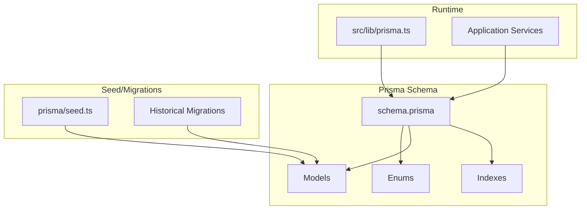
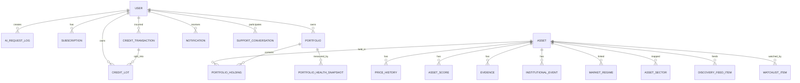
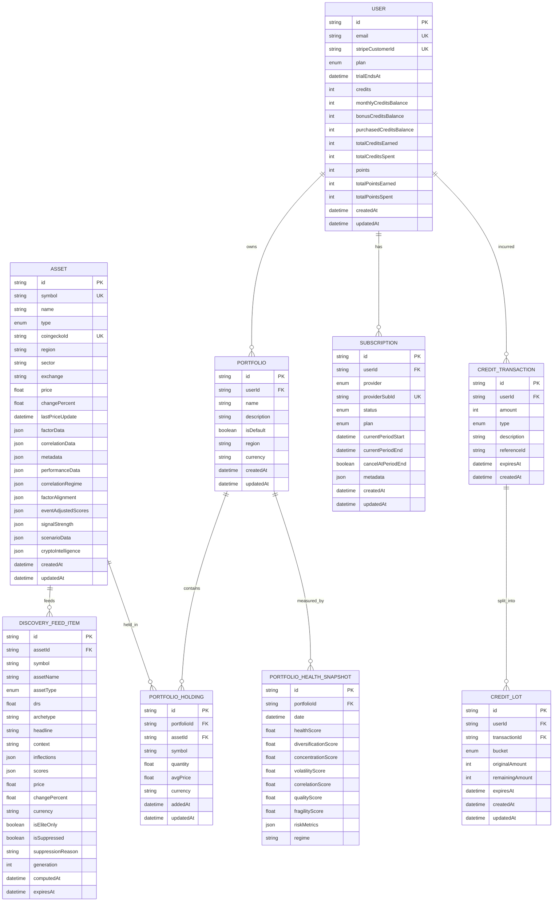
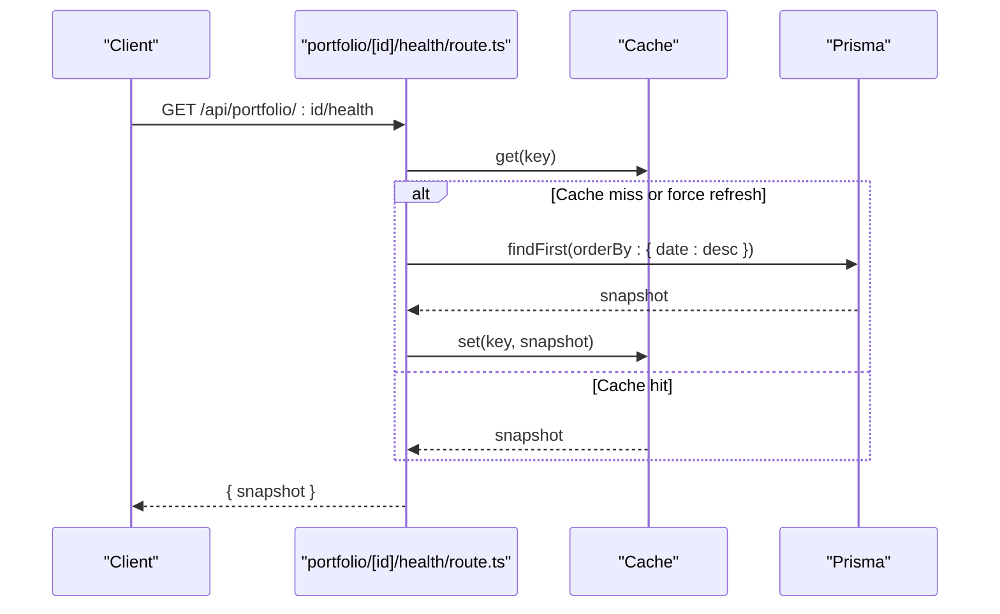
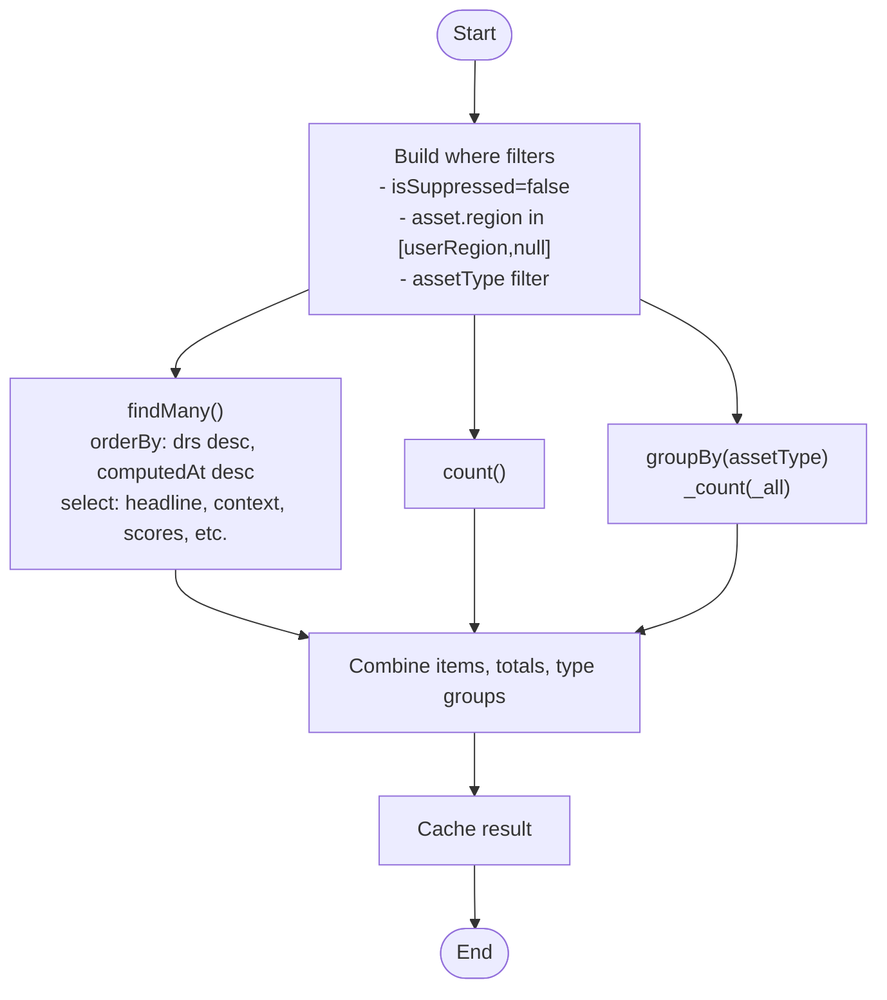
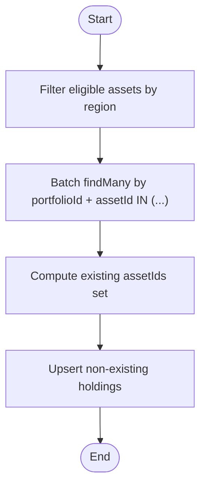
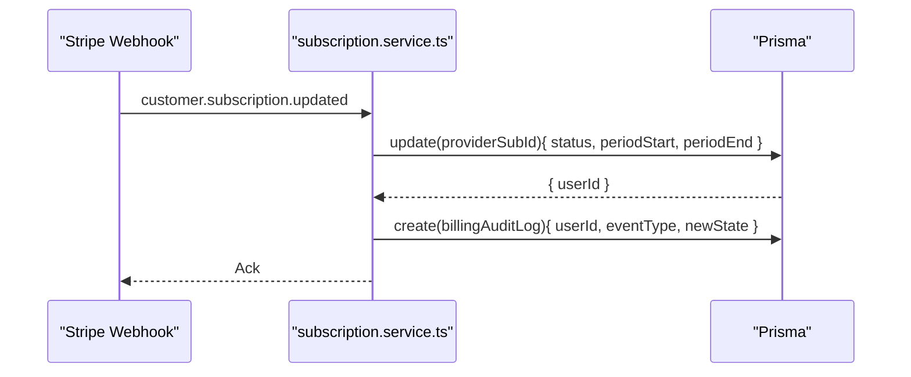
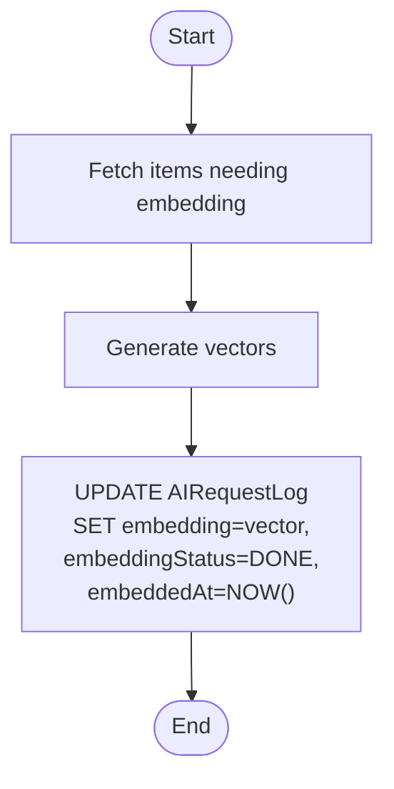
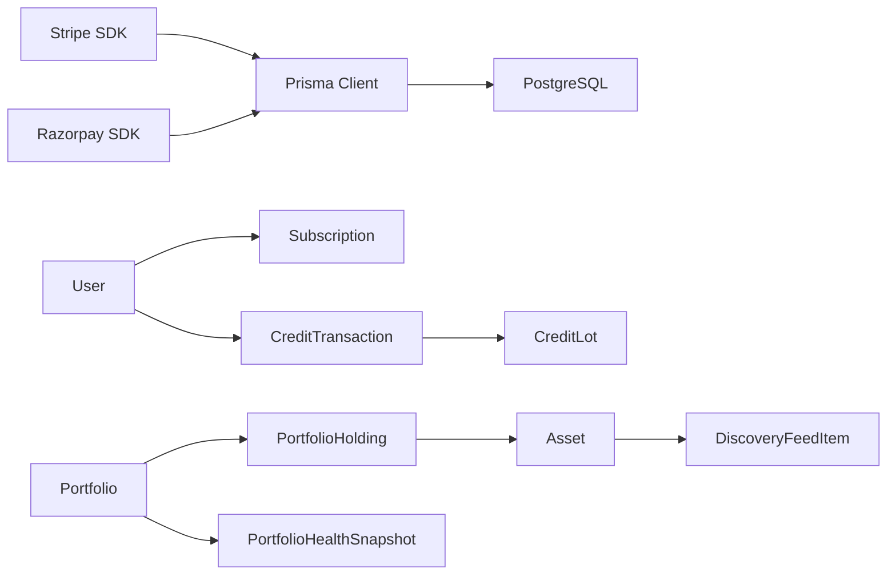

# Database Schema

<cite>
**Referenced Files in This Document**
- [schema.prisma](file://prisma/schema.prisma)
- [seed.ts](file://prisma/seed.ts)
- [migration.sql](file://docs/archive/prisma-migrations-2026-03-17/20260220211346_add_portfolio_models/migration.sql)
- [migration.sql](file://docs/archive/prisma-migrations-2026-03-17/20260212225606_add_discovery_feed_item/migration.sql)
- [prisma.ts](file://src/lib/prisma.ts)
- [plan-gate.ts](file://src/lib/middleware/plan-gate.ts)
- [subscription.service.ts](file://src/lib/services/subscription.service.ts)
- [discovery-feed.service.ts](file://src/lib/services/discovery-feed.service.ts)
- [discovery-intelligence.service.ts](file://src/lib/services/discovery-intelligence.service.ts)
- [broker-import.service.ts](file://src/lib/services/broker-import.service.ts)
- [portfolio/page.tsx](file://src/app/dashboard/portfolio/page.tsx)
- [portfolio-health/route.ts](file://src/app/api/portfolio/[id]/health/route.ts)
- [use-portfolio-health.ts](file://src/hooks/use-portfolio-health.ts)
- [admin.service.ts](file://src/lib/services/admin.service.ts)
- [rag.ts](file://src/lib/ai/rag.ts)
- [count-crypto-assets.ts](file://scripts/count-crypto-assets.ts)
</cite>

## Table of Contents
1. [Introduction](#introduction)
2. [Project Structure](#project-structure)
3. [Core Components](#core-components)
4. [Architecture Overview](#architecture-overview)
5. [Detailed Component Analysis](#detailed-component-analysis)
6. [Dependency Analysis](#dependency-analysis)
7. [Performance Considerations](#performance-considerations)
8. [Troubleshooting Guide](#troubleshooting-guide)
9. [Conclusion](#conclusion)
10. [Appendices](#appendices)

## Introduction
This document provides comprehensive database schema documentation for LyraAlpha’s Prisma ORM implementation. It focuses on the core entities central to the product: User, Asset, Portfolio, Subscription, and CreditTransaction, along with supporting models such as PortfolioHolding, PortfolioHealthSnapshot, DiscoveryFeedItem, and CreditTransaction/CreditLot. It also documents enum types (PlanTier, AssetType, SubscriptionStatus, among others), Prisma schema annotations for vector embeddings and JSON fields, unique constraints, foreign key relationships, and cascading behaviors. Finally, it outlines typical complex queries and join patterns used across the application.

## Project Structure
The schema is defined declaratively in Prisma and supplemented by seeding logic and historical migrations. The application uses a PostgreSQL provider with a connection pooling adapter optimized for serverless environments.

**Diagram sources**
- [schema.prisma](file://prisma/schema.prisma)
- [prisma.ts](file://src/lib/prisma.ts)
- [seed.ts](file://prisma/seed.ts)

**Section sources**
- [schema.prisma](file://prisma/schema.prisma)
- [prisma.ts](file://src/lib/prisma.ts)

## Core Components
This section documents the primary models and enums used by the application.

### Enumerations
- PlanTier: STARTER, PRO, ELITE, ENTERPRISE
- AssetType: CRYPTO
- SubscriptionStatus: ACTIVE, PAST_DUE, CANCELED, INCOMPLETE, TRIALING
- ScoreType: TREND, MOMENTUM, VOLATILITY, SENTIMENT, LIQUIDITY, TRUST, PORTFOLIO_HEALTH
- PaymentProvider: STRIPE, RAZORPAY
- UserPreferredRegion: US, IN, BOTH
- UserExperienceLevel: BEGINNER, INTERMEDIATE, ADVANCED
- UserInterest: CRYPTO
- CreditTransactionType: PURCHASE, REFERRAL_BONUS, REFERRAL_REDEEMED, SUBSCRIPTION_MONTHLY, BONUS, SPENT, ADJUSTMENT
- CreditLotBucket: MONTHLY, BONUS, PURCHASED
- SupportStatus: OPEN, PENDING, RESOLVED, CLOSED
- SupportSenderRole: USER, AGENT
- BlogPostStatus: DRAFT, PUBLISHED, ARCHIVED
- EmbeddingStatus: PENDING, PROCESSING, DONE, FAILED

Business significance:
- PlanTier drives feature gating and billing behavior.
- AssetType determines asset universe and filtering.
- SubscriptionStatus governs lifecycle and access control.
- ScoreType categorizes derived asset metrics.
- PaymentProvider enables multi-provider billing integrations.
- CreditTransactionType and CreditLotBucket define credit accounting and expiry semantics.

**Section sources**
- [schema.prisma](file://prisma/schema.prisma)

### User
- Purpose: Core identity and account holder.
- Key fields:
  - id (primary key)
  - email (unique)
  - stripeCustomerId (unique)
  - plan (PlanTier)
  - trialEndsAt (DateTime?)
  - credits, monthlyCreditsBalance, bonusCreditsBalance, purchasedCreditsBalance, totalCreditsEarned, totalCreditsSpent
  - points, totalPointsEarned, totalPointsSpent
  - createdAt, updatedAt
- Relationships:
  - One-to-many to AIRequestLog, UserPreference, UserProgress, UserBadge, XPTransaction, LearningCompletion, Subscription, PaymentEvent, WatchlistItem, UserSession, UserActivityEvent, CreditTransaction, CreditLot, Referral (referrer/referee), PointTransaction, SupportConversation, BillingAuditLog, XPRedemption, Portfolio, Notification, LyraFeedback, UserMemoryNote
- Constraints and indexes:
  - Unique(email)
  - Unique(stripeCustomerId)
  - Indexes on email, stripeCustomerId, createdAt, updatedAt

**Section sources**
- [schema.prisma](file://prisma/schema.prisma)

### Asset
- Purpose: Market instrument (crypto-focused).
- Key fields:
  - id (primary key)
  - symbol (unique)
  - name, type (AssetType)
  - coingeckoId (unique)
  - region, sector, exchange
  - price, changePercent, lastPriceUpdate
  - factorData, correlationData, metadata, performanceData, correlationRegime, factorAlignment, eventAdjustedScores, signalStrength, scenarioData, cryptoIntelligence
  - Scores, Evidence, InstitutionalEvents, MarketRegimes, PriceHistory, AssetSectors, DiscoveryFeedItems, WatchlistItems, PortfolioHoldings, LyraAnalyses
- Constraints and indexes:
  - Unique(symbol)
  - Unique(coingeckoId)
  - Indexes on assetGroup, compatibilityScore; lastPriceUpdate; type, compatibilityScore; region, type, lastPriceUpdate; region, lastPriceUpdate; region, changePercent; coingeckoId

**Section sources**
- [schema.prisma](file://prisma/schema.prisma)

### Portfolio
- Purpose: User-defined investment collections.
- Key fields:
  - id (primary key)
  - userId (foreign key to User)
  - name, description, isDefault, region, currency
  - createdAt, updatedAt
- Relationships:
  - One-to-many to PortfolioHolding, PortfolioHealthSnapshot
- Constraints and indexes:
  - Unique(userId, name)
  - Indexes on userId, userId, region, updatedAt

**Section sources**
- [schema.prisma](file://prisma/schema.prisma)
- [migration.sql](file://docs/archive/prisma-migrations-2026-03-17/20260220211346_add_portfolio_models/migration.sql)

### PortfolioHolding
- Purpose: Holdings within a Portfolio.
- Key fields:
  - id (primary key)
  - portfolioId (foreign key to Portfolio)
  - assetId (foreign key to Asset)
  - symbol, quantity, avgPrice, currency
  - addedAt, updatedAt
- Constraints and indexes:
  - Unique(portfolioId, assetId)
  - Indexes on portfolioId, assetId

**Section sources**
- [schema.prisma](file://prisma/schema.prisma)
- [migration.sql](file://docs/archive/prisma-migrations-2026-03-17/20260220211346_add_portfolio_models/migration.sql)

### PortfolioHealthSnapshot
- Purpose: Periodic health metrics for a Portfolio.
- Key fields:
  - id (primary key)
  - portfolioId (foreign key to Portfolio)
  - date, healthScore, diversificationScore, concentrationScore, volatilityScore, correlationScore, qualityScore, fragilityScore, riskMetrics, regime
- Constraints and indexes:
  - Index on portfolioId, date desc

**Section sources**
- [schema.prisma](file://prisma/schema.prisma)
- [migration.sql](file://docs/archive/prisma-migrations-2026-03-17/20260220211346_add_portfolio_models/migration.sql)

### Subscription
- Purpose: Recurring billing relationship with a provider.
- Key fields:
  - id (primary key)
  - userId (foreign key to User)
  - provider (PaymentProvider), providerSubId (unique)
  - status (SubscriptionStatus), plan (PlanTier)
  - currentPeriodStart, currentPeriodEnd, cancelAtPeriodEnd
  - metadata, createdAt, updatedAt
- Constraints and indexes:
  - Unique(providerSubId)
  - Indexes on userId, providerSubId, status

**Section sources**
- [schema.prisma](file://prisma/schema.prisma)

### CreditTransaction and CreditLot
- Purpose: Credit accounting and expiry buckets.
- Key fields:
  - CreditTransaction: id, userId (foreign key to User), amount, type (CreditTransactionType), description, referenceId, expiresAt, createdAt
  - CreditLot: id, userId (foreign key to User), transactionId (foreign key to CreditTransaction), bucket (CreditLotBucket), originalAmount, remainingAmount, expiresAt, createdAt, updatedAt
- Constraints and indexes:
  - CreditTransaction: Indexes on userId, type, createdAt; expiresAt; createdAt
  - CreditLot: Indexes on userId, bucket, expiresAt; userId, remainingAmount; transactionId

**Section sources**
- [schema.prisma](file://prisma/schema.prisma)

### DiscoveryFeedItem
- Purpose: Personalized discovery items for assets.
- Key fields:
  - id (primary key)
  - assetId (foreign key to Asset)
  - symbol, assetName, assetType (AssetType), drs, archetype, headline, context, inflections, scores, price, changePercent, currency, isEliteOnly, isSuppressed, suppressionReason, generation, computedAt, expiresAt
- Constraints and indexes:
  - Indexes on computedAt desc; assetType, drs desc; isSuppressed, drs desc; assetId; generation

**Section sources**
- [schema.prisma](file://prisma/schema.prisma)
- [migration.sql](file://docs/archive/prisma-migrations-2026-03-17/20260212225606_add_discovery_feed_item/migration.sql)

### Supporting Entities
- AIRequestLog: Vector embeddings, embedding status, prompt association.
- KnowledgeDoc, SupportKnowledgeDoc: Vector embeddings for RAG and support.
- MarketRegime, MultiHorizonRegime, HistoricalAnalog: Macro/regime modeling with JSON and vector fields.
- WatchlistItem: User asset watchlists.
- Notification, UserSession, UserActivityEvent: User engagement and audit.
- UserPreference, UserProgress, UserBadge, XPTransaction, LearningCompletion, PointTransaction, XPRedemption: Behavioral and gamification data.
- SupportConversation, SupportMessage: Support workflows.
- BlogPost: Content management with JSON metadata.

**Section sources**
- [schema.prisma](file://prisma/schema.prisma)

## Architecture Overview
The schema enforces referential integrity with cascading deletes for child entities when parents are removed. JSON fields store flexible structured data, while vector embeddings enable semantic search. Indexes are strategically placed to optimize frequent queries (filters, sorts, joins).

**Diagram sources**
- [schema.prisma](file://prisma/schema.prisma)

## Detailed Component Analysis

### Entity Relationship Diagram
This diagram maps core entities and their relationships, highlighting foreign keys and cascade behaviors.

**Diagram sources**
- [schema.prisma](file://prisma/schema.prisma)

### Complex Queries and Join Patterns
Below are representative query patterns used across the application, mapped to actual code paths.

#### Portfolio Health Snapshot Retrieval
- Fetch latest snapshot for a portfolio with caching and optional forced refresh.
- Joins: PortfolioHealthSnapshot by portfolioId, ordered by date desc.

**Diagram sources**
- [portfolio-health/route.ts](file://src/app/api/portfolio/[id]/health/route.ts)

**Section sources**
- [portfolio-health/route.ts](file://src/app/api/portfolio/[id]/health/route.ts)
- [use-portfolio-health.ts](file://src/hooks/use-portfolio-health.ts)

#### Discovery Feed Aggregation
- Filters DiscoveryFeedItem by region and type, counts by type, paginates, and caches results.
- Joins: Asset via assetId; filters on isSuppressed and assetType; ordering by drs desc, computedAt desc.

**Diagram sources**
- [discovery-feed.service.ts](file://src/lib/services/discovery-feed.service.ts)

**Section sources**
- [discovery-feed.service.ts](file://src/lib/services/discovery-feed.service.ts)

#### Broker Import Upsert Pipeline
- Deduplicates holdings by symbol, validates region compatibility, batches existence checks, and upserts holdings.
- Joins: PortfolioHolding by portfolioId and assetId; filters on assetId in (...) for batch existence.

**Diagram sources**
- [broker-import.service.ts](file://src/lib/services/broker-import.service.ts)

**Section sources**
- [broker-import.service.ts](file://src/lib/services/broker-import.service.ts)

#### Subscription Renewal and Audit
- Update subscription status and period dates; select userId for audit logging; insert billing audit log.
- Joins: Subscription by providerSubId; relation to User for audit.

**Diagram sources**
- [subscription.service.ts](file://src/lib/services/subscription.service.ts)

**Section sources**
- [subscription.service.ts](file://src/lib/services/subscription.service.ts)

#### Vector Embedding Updates
- Batch update AIRequestLog.embedding and embeddingStatus using raw SQL vector literals.
- Joins: Internal processing of batches; updates via $executeRaw.

**Diagram sources**
- [rag.ts](file://src/lib/ai/rag.ts)

**Section sources**
- [rag.ts](file://src/lib/ai/rag.ts)

## Dependency Analysis
- Coupling:
  - Portfolio depends on Asset via PortfolioHolding.
  - DiscoveryFeedItem depends on Asset.
  - CreditLot depends on CreditTransaction.
  - Subscription depends on User; BillingAuditLog depends on Subscription/User.
- Cohesion:
  - Financial and usage data are grouped under User and Subscription.
  - Market data is grouped under Asset and related regimes.
- External dependencies:
  - Prisma adapter for PostgreSQL connection pooling.
  - Stripe and Razorpay for payment events.
  - pgvector for vector similarity.

**Diagram sources**
- [schema.prisma](file://prisma/schema.prisma)
- [prisma.ts](file://src/lib/prisma.ts)

**Section sources**
- [schema.prisma](file://prisma/schema.prisma)
- [prisma.ts](file://src/lib/prisma.ts)

## Performance Considerations
- Indexing strategy:
  - Foreign keys indexed (e.g., userId, assetId, portfolioId).
  - Composite indexes for frequent filters (e.g., region/type/lastPriceUpdate).
  - Vector similarity indexes implicitly supported by pgvector.
- JSON fields:
  - Stored as JSONB for efficient querying and indexing where needed.
- Vector embeddings:
  - Stored as vector type; batched updates minimize overhead.
- Connection pooling:
  - Pooling adapter configured for serverless workloads with SSL bypass for Supabase infrastructure.

[No sources needed since this section provides general guidance]

## Troubleshooting Guide
- Missing indexes:
  - Verify foreign keys are indexed; use EXPLAIN ANALYZE to detect sequential scans.
- Vector embedding failures:
  - Check embeddingStatus transitions and error fields; re-run migration scripts.
- Subscription state drift:
  - Confirm PaymentEvent ingestion and SubscriptionStatus updates; validate webhook delivery.
- Portfolio health stale data:
  - Force refresh endpoint clears cache and recomputes snapshots.

**Section sources**
- [admin.service.ts](file://src/lib/services/admin.service.ts)
- [subscription.service.ts](file://src/lib/services/subscription.service.ts)
- [portfolio-health/route.ts](file://src/app/api/portfolio/[id]/health/route.ts)
- [rag.ts](file://src/lib/ai/rag.ts)

## Conclusion
The schema is designed around a cohesive set of entities that support user accounts, asset discovery, portfolio management, and credit/billing workflows. Enums and constraints enforce business rules, while JSON and vector fields enable flexible and modern data handling. Strategic indexing and connection pooling support scalable serverless operations.

[No sources needed since this section summarizes without analyzing specific files]

## Appendices

### Field Definitions and Constraints Summary
- Users: unique email and Stripe customer ID; credit and points balances; plan tiers and trial windows.
- Assets: unique symbol and coingeckoId; regional and categorical metadata; JSON fields for analytics; vector embedding fields on logs.
- Portfolios: unique per user; default flag; region and currency; linked holdings and health snapshots.
- Subscriptions: provider-subscription ID uniqueness; status lifecycle; plan tiers; period windows.
- Credits: transaction types and expiry; lot buckets for monthly/bonus/purchased allocations.

**Section sources**
- [schema.prisma](file://prisma/schema.prisma)

### Example Queries and Patterns
- Count crypto assets by type:
  - Uses asset.count with where type = CRYPTO and groupBy on type.
- Discovery feed retrieval:
  - findMany with ordering, pagination, and grouping by assetType.
- Portfolio health:
  - findFirst with orderBy date desc and caching.

**Section sources**
- [count-crypto-assets.ts](file://scripts/count-crypto-assets.ts)
- [discovery-feed.service.ts](file://src/lib/services/discovery-feed.service.ts)
- [portfolio-health/route.ts](file://src/app/api/portfolio/[id]/health/route.ts)